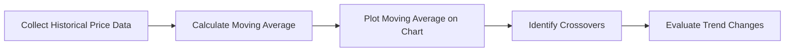
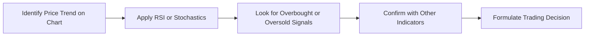
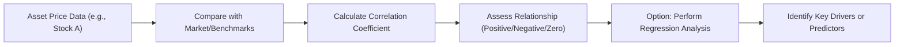

## 8.3 Statistical Analysis

Statistical Analysis is a cornerstone of technical analysis because it helps transform seemingly chaotic price data into more interpretable signals. In other words, it provides a structured way to determine if the market is trending up or down, how fast it’s moving, and whether those signals are real or just noise. We’ll look at how technical analysts use moving averages, momentum indicators, volatility measures, correlation, and even regression techniques in their day-to-day attempts to understand markets. And I’ll do my best to keep it slightly conversational—after all, we’re in this together, exploring these tools one step at a time.

Before we dig in, it’s useful to recall that in Canadian markets, all investment dealers and mutual fund dealers operate under the Canadian Investment Regulatory Organization (CIRO). CIRO provides guidelines to ensure that any tools—be they fundamental or technical—are used appropriately within a suitable framework geared to investor protection. If you were around before 2023, you might remember the MFDA and IIROC. Well, they’ve since merged into CIRO, effective June 1, 2023, but the focal point remains consistent: putting clients first and ensuring advice is founded on solid research and appropriate risk management.

––––––––––––––––––––––––––––

Understanding Moving Averages

When people talk about technical analysis, it’s hard not to mention moving averages. They’re some of the very first indicators many of us learn about when we start charting price movements. You’ve probably heard of the famed “50-day MA” or “200-day MA” all over financial news tickers. Essentially, a moving average (MA) allows you to smooth out day-to-day fluctuations in price and better visualize the broader trend.

• Simple Moving Average (SMA): This is the basic one—an average of a set number of closing prices, updated day by day. Mathematically:


\text{SMA} = \frac{P_1 + P_2 + \cdots + P_n}{n}


where \\( P_i \\) is the closing price on day \\( i \\) and \\( n \\) is the number of days in the lookback period.

• Exponential Moving Average (EMA): Often used to give more weight to recent data. Technical analysts might prefer EMAs if they believe yesterday’s price action is more relevant than what happened, say, a month ago.

The famous “golden cross” occurs when the short-term moving average (say, 50-day) moves above the long-term moving average (often 200-day). That might signal bullish momentum. Conversely, a “death cross” is when the short-term crosses below the long-term. These terms sound dramatic, but analysts believe they mark major shifts in trend direction.

Anyway, I once tried using the 50-, 100-, and 200-day SMAs on a Canadian bank stock. The crossovers did give me an early heads-up about a pivot in price direction. Sure, it didn’t always work—sometimes it gave false signals—but it’s surprising how frequently these crossovers align with real turning points.

Here’s a quick Mermaid diagram to illustrate the conceptual flow of how you’d calculate a moving average and look for crossovers:

––––––––––––––––––––––––––––

Momentum Indicators

Momentum indicators measure the speed or velocity of price changes. They can help you discern not just whether price is up or down, but the rate at which it’s moving in a particular direction. Two of the most popular are the Relative Strength Index (RSI) and Stochastics.

Relative Strength Index (RSI)

Developed by J. Welles Wilder, the RSI compares the magnitude of recent gains to the magnitude of recent losses, producing a value that oscillates between 0 and 100. An RSI above 70 is often considered “overbought,” implying the asset may be ripe for a pullback. Conversely, an RSI below 30 is often considered “oversold,” implying a potential rebound.

For instance, when I was day-trading a technology ETF not too long ago, the RSI kept hovering around 80. I thought, “Surely, it can’t go higher,” but it did remain overbought for a while before it finally reversed. That’s a classic lesson: high RSI doesn’t always mean an immediate drop—it’s more like a caution sign that the uptrend might be losing steam.

Stochastics

The Stochastic Oscillator is another momentum indicator that attempts to compare a security’s closing price “relative to its price range” over a given period. People often see values above 80 as overbought and values under 20 as oversold. Just as with RSI, being overbought or oversold doesn’t guarantee a price reversal, but it’s another heads-up that the trend could be reaching an extreme.

Let’s take a quick look at how you’d integrate momentum indicators into your basic chart analysis:

––––––––––––––––––––––––––––

Volatility Measures

Now, let’s talk volatility. Volatility can be scary, but to many traders, it’s an opportunity—when price swings are wide, there’s potential for bigger gains (and, obviously, bigger losses). Two popular volatility measures that show up on technical charts are Bollinger Bands and the Average True Range (ATR).

Bollinger Bands

Invented by John Bollinger, Bollinger Bands plot two standard deviations above and below a simple moving average. The logic is that price tends to stay within those bands. When prices tag the upper band, it might suggest the security is relatively expensive; when they tag the lower band, it might be relatively cheap. In sideways or quiet markets, the bands narrow to reflect lower volatility. In highly volatile markets, the bands widen.

Average True Range (ATR)

ATR, meanwhile, measures the average range of price movements over a specific window. It doesn’t tell you whether a market will rise or fall, just how far it might move. A high ATR means wide price swings, while a low ATR implies calmer seas. I used ATR to size my position back in 2021, particularly when I was delving into resource stocks. If the ATR was high, I’d reduce my share count so as not to expose myself to big swings. On the other hand, if the ATR was low, I tended to hold a larger position. “Don’t let volatility knock you out of the game” was my motto!

Here’s a table of typical parameter ranges for Bollinger Bands and ATR:

| Indicator          | Typical Parameters       | What It Measures                                 |
|--------------------|--------------------------|--------------------------------------------------|
| Bollinger Bands    | 20-day SMA, ±2 Std Dev   | Volatility around a moving average              |
| ATR                | 14-day lookback         | Average intraday price range (volatility proxy) |

We’ll talk more about risk management with these indicators in Chapter 16 (“Managing Your Client’s Investment Risk”). For now, you can remember that volatility indicators help you gauge the potential jerkiness of a trade.

––––––––––––––––––––––––––––

Correlation & Regression

Correlation

Correlation measures how closely two variables (often, two assets) move in relation to each other. A correlation coefficient near +1 signals a strong positive relationship—like a big Canadian bank stock might have with other Canadian financials—while a figure near -1 signals a strong inverse relationship. For a well-diversified portfolio, some traders look for correlated or uncorrelated assets to manage overall risk.

Regression Analysis

Regression is a statistical tool used to find relationships between variables. In technical analysis, you might run a simple linear regression on a stock’s daily closing price to see if there’s an upward or downward trend over time. You might also use a multifactor regression to see if a security’s price is influenced by, say, the U.S. benchmark S&P 500 index, U.S. dollar index, or commodity prices.

Personally, I once tested regression as a tool for identifying fair value ranges for an oil producer’s stock. I input the West Texas Intermediate (WTI) crude price, the Canadian dollar exchange rate, and the overall energy sector index as independent variables. Sometimes it’s enlightening to see how a stock’s returns might be partly “explained” by these macro factors. And granted, it’s not perfect—for instance, a big portion of price movements can always remain unexplained or random. But it helps me think about probable price ranges.

Here’s a conceptual diagram illustrating how correlation and regression factor into technical analysis:

––––––––––––––––––––––––––––

Combining Indicators

Technical analysts frequently blend multiple indicators—RSI, MACD, Bollinger Bands, and so on—to get a more complete picture. For instance, you might look for an RSI over 70 and the price hitting the upper Bollinger Band simultaneously. That might strengthen your conviction that the market’s overheated and due for a pullback. Many professionals also watch for confirmation from different time frames—say a 4-hour chart and a daily chart. But be careful: Too many indicators might trigger “analysis paralysis,” or conflicting signals.

In essence, it’s about synergy, right? Using fewer but well-chosen indicators can give you clarity. Overload yourself with a dozen or more, and you might just end up confused.

A quick example in combining indicators:

• Wait for a faster moving average (say, the 50-day) to cross above a slower one (the 200-day).  
• Confirm that RSI is above 50 but below 70 (indicating moderate bullish strength without being overbought).  
• Check Bollinger Bands to see if the range is expanding or contracting. A contracting range might mean a breakout is forthcoming.  

If all these line up, you might have a more robust signal than if you relied on just one of them.

––––––––––––––––––––––––––––

A Note on CIRO Guidelines

From a regulatory standpoint, CIRO (the new self-regulatory organization in Canada) wants to ensure that if you’re using technical analysis or any other method, you do it in a manner consistent with a client’s risk tolerance and objectives. No single indicator can guarantee results. Moreover, for compliance, you’ll often need to articulate how a particular technical approach helps fulfill the client’s suitability requirements. For a deeper dive, check out the CIRO website (https://www.ciro.ca), where they keep guidelines, bulletins, and investor resources updated. Historically, if you read something from the MFDA or IIROC, note that those organizations have now merged into CIRO.

––––––––––––––––––––––––––––

Practical Tools and Further Learning

If you want to explore these statistical analysis tools on your own, many open-source libraries can help:

• Python’s “pandas” and “numpy” for data manipulation and basic scientific operations  
• “matplotlib” or “plotly” for charting  
• “TA-Lib” for easily computing various indicators such as MA, RSI, MACD, etc.  

In Canada, the Canadian Securities Institute (CSI) offers advanced courses on technical analysis, risk management, and more. If you want something more academically rigorous, check out the CFA Institute Research Foundation publications—they’ve got a wealth of papers on applying statistical models to market data.

––––––––––––––––––––––––––––

Common Pitfalls and Best Practices

• Curve-Fitting: With so many indicators, you can easily over-optimize your system to fit past data. Then it fails miserably in real-time markets.  
• Ignoring Market Context: Focusing exclusively on indicators without examining broader market or economic conditions can lead to incomplete analysis. (See Chapter 6 on macro-economic factors, and Chapter 14 on international considerations.)  
• Overleverage: High volatility tools like Bollinger Bands or ATR might reveal big swings. Using too much leverage in a highly volatile environment can be disastrous.  
• Lack of Consistency: If you jump from one indicator set to another every time you see a losing trade, you’ll never truly refine your approach. Keep consistent, track results, and then improve methodically.

Consider a small anecdote here: Early in my investing journey, I used a new indicator each week, hoping it would perfectly predict the market. That, obviously, was a recipe for whipsaw trades. Eventually, I settled on a few core indicators that matched my personality, risk tolerance, and time horizon.

––––––––––––––––––––––––––––

Real-World Case Study

Let’s do a simplified case study on a mining stock that trades on the Toronto Stock Exchange (TSX).

Scenario: A mid-cap miner has recently shown significant price fluctuation amid shifting commodity prices. You pull in daily data for the last 12 months.

1) Moving Average Setup  
   • Compute a 50-day SMA and a 200-day SMA. Notice a bullish crossover occurred last month.  
2) Momentum Indicator: RSI  
   • The RSI has been climbing steadily; it just touched 65, signaling strong momentum that’s not yet overbought.  
3) Volatility: Bollinger Bands  
   • The width between upper and lower bands is expanding, indicating rising volatility. Price is currently pushing the upper band but hasn’t closed above it for more than two days in a row.  
4) Correlation  
   • You calculate the correlation with gold prices. The correlation coefficient is 0.75, which is quite high. If gold prices fall, you might expect the mining stock to retrace.  
5) Trading Decision  
   • You observe that gold’s short-term wave might be losing steam, so you decide to keep a tighter stop-loss, using the ATR to gauge that.  
   • You keep the position small enough so that if gold prices unexpectedly plunge, the drawdown won’t devastate your portfolio.  
   • You remain mindful of the heavier risk in a volatile sector.

It’s all about analyzing multiple angles—price patterns, momentum, volatility, correlation—tying everything together in a cohesive plan.

––––––––––––––––––––––––––––

References and Additional Resources

• CIRO (https://www.ciro.ca) – Canada’s new self-regulatory organization overseeing investment dealers, mutual fund dealers, and market integrity.  
• CSI (Canadian Securities Institute) – Offers advanced courses in technical analysis, derivatives, portfolio management, and risk management.  
• Python libraries: “pandas,” “NumPy,” “TA-Lib,” “matplotlib,” “plotly” – Great for coding your own technical analysis tools.  
• CFA Institute Research Foundation – Provides scholarly publications that often dive deep into statistical methods in finance.  
• For a deeper look at how these tools can be blended into your workflow, see also Chapter 16 on risk management strategies and Chapter 8.6 on how technical analysis can be integrated with fundamental approaches.

––––––––––––––––––––––––––––

Summary

Statistical analysis in technical analysis is the practical application of math and data interpretation to price charts, momentum readings, and market volatility. Whether you’re scanning for moving average crossovers, gauging momentum with RSI, or measuring volatility with Bollinger Bands, these tools are designed to help you identify trends, anticipate potential reversals, and manage your portfolio’s risk.

As you progress, remember to keep your indicators meaningful and not overload yourself with redundant signals. Always remain mindful that technical indicators are just a piece of the puzzle—macro events, fundamental factors, and investor psychology can all override what the indicators suggest. Combine these statistical tools with solid judgment, robust risk management, and a constant eye on regulatory guidelines. That’s how you’ll harness the power of statistical analysis to (hopefully) tilt the odds in your favor in a world where absolute certainty never exists.

Now, are you still with me? I hope so. This has been a deep dive, but hopefully a fun one, too. The best way to cement this knowledge is to take a moment and review. Speaking of which...

## Test Your Knowledge: Statistical Analysis in Technical Trading



### Which of the following describes the primary function of a moving average (MA) in technical analysis?

- [ ] It measures only the highest and lowest prices over a given period.
- [x] It smooths out short-term price fluctuations to reveal underlying trends.
- [ ] It calculates the standard deviation of trading volumes.
- [ ] It determines the fair value of a stock based on fundamental indicators.

> **Explanation:** Moving averages are used to smooth out price data over a specified period, making underlying trends more visible.

### Which statement best explains the term “golden cross”?

- [ ] It is a price signal when RSI crosses above 70.
- [ ] It is a volatility signal that occurs when Bollinger Bands contract.
- [ ] It occurs when the ATR spikes above its long-term average.
- [x] It occurs when a short-term moving average crosses above a long-term moving average, signaling a potential bullish trend.

> **Explanation:** A golden cross is commonly seen when a 50-day moving average crosses above a 200-day moving average, often interpreted as a bullish signal.

### Using the Relative Strength Index (RSI), which reading typically suggests an asset is overbought?

- [ ] 10
- [ ] 25
- [x] 75
- [ ] 40

> **Explanation:** An RSI value above 70 is often considered overbought and may indicate a potential pullback.

### When discussing Bollinger Bands, which of the following is correct?

- [ ] Bollinger Bands ignore the concept of standard deviation.
- [ ] Bollinger Bands provide linear regression analysis of stock prices.
- [ ] Bollinger Bands do not expand or contract with market volatility.
- [x] Bollinger Bands typically consist of a moving average plus or minus a specified number of standard deviations.

> **Explanation:** Bollinger Bands use a simple moving average and plot upper and lower bands based on the standard deviation of recent price moves.

### Which of the following is a legitimate use of correlation in technical analysis?

- [x] Measuring how closely two stocks’ returns move in tandem over time.
- [ ] Determining the intraday price range of a single stock.
- [x] Evaluating how an asset’s movement may be explained by macro factors like commodity prices.
- [ ] Smoothing out price fluctuations into a single signal.

> **Explanation:** Correlation is about understanding how two sets of returns move relative to each other or how one asset’s price might relate to external factors (e.g., commodity prices).

### What does an Average True Range (ATR) value indicate?

- [x] The average intraday price range over a specified period, reflecting volatility.
- [ ] The rate at which the moving average changes from one day to another.
- [ ] The correlation strength between two different assets.
- [ ] The difference between short-term and long-term moving averages.

> **Explanation:** ATR measures volatility by calculating the average daily range of a security over a specified time period.

### What is the main risk in using numerous indicators at once?

- [x] “Analysis paralysis” and conflicting signals that reduce clarity.
- [ ] Preventing any false signals.
- [x] Uncovering a perfect indicator that works in every market scenario.
- [ ] Ensuring a complete examination of market fundamentals.

> **Explanation:** While combining indicators can be valuable, using too many can lead to confusion, analysis paralysis, or conflicting signals.

### In regression analysis, if Stock A’s price is highly correlated with the price of gold, how can that insight be applied in technical trading?

- [x] A drop in gold prices might signal a corresponding drop in Stock A.
- [ ] A negative correlation means they always move in tandem.
- [ ] Stock A is more volatile than gold by definition.
- [ ] Stock A has no relationship with macroeconomic indicators.

> **Explanation:** A high positive correlation suggests that Stock A might move similarly to gold, so changes in gold prices could forecast potential movements in Stock A.

### How does CIRO (Canadian Investment Regulatory Organization) influence the use of technical analysis?

- [x] By ensuring that technical analysis, like any other strategy, is employed within a suitable, client-focused framework.
- [ ] By mandating the exclusive use of RSI and ATR in all portfolios.
- [ ] By providing direct buy/sell signals to advisors.
- [ ] By prohibiting any form of moving average crossover.

> **Explanation:** CIRO (formerly MFDA and IIROC) sets guidelines that ensure financial professionals use any analysis method, including technical analysis, in a manner consistent with client objectives and regulatory compliance.

### True or False: Overbought readings on RSI always lead to immediate price reversals.

- [x] True
- [ ] False

> **Explanation:** This is a bit tricky because “always” is a strong word. Historically, many traders note that an RSI above 70 is indicative of a potential reversal. However, “overbought” conditions can persist longer than expected, and the price may keep rising before pulling back. In strict academic terms, it is false to say “always.” Yet in common trading parlance, “overbought” is indeed a signal that a reversal could be looming—just not guaranteed.


