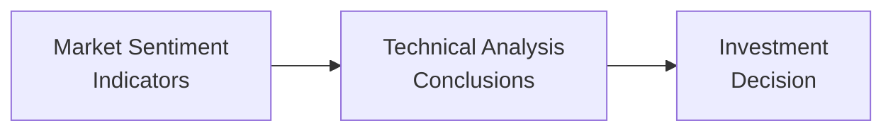

## 8.4 Sentiment Indicators

Imagine you’re sitting on your couch, scrolling through social media, and it feels like everyone is either super excited about certain stocks or absolutely petrified about the market as a whole. Well, this collective feeling—this mood—often gets packaged into what we call “market sentiment” in the realm of technical analysis. And yeah, I’ve spoken with so many folks who have said, “But these are just feelings—how can they possibly guide real-world trading decisions?” The surprising twist? When crowds of people get extremely bullish or extremely bearish, it may actually reveal a perfect contrarian opportunity. Let’s explore.

### Understanding Market Sentiment

Market sentiment essentially wraps up the psychology, the hopes, the fears, and the overarching vibe among investors. We label it bullish when investors feel confident, expecting higher prices, and bearish when investors feel fearful, expecting lower prices. Whether you’re handling your RRSP account in Canada or day-trading stocks on a global exchange, tapping into market sentiment can help you predict short-term fluctuations or identify inflection points.

In Canada, many analysts keep a close eye on the broader market psychology by following data from various local and international sources. For instance, the U.S.-based American Association of Individual Investors (AAII) publishes a well-known sentiment survey that often influences perspectives north of the border as well.

But don’t get too carried away by the news. Market sentiment, while valuable, can also be fleeting if you don't tie it in with other forms of technical and fundamental analysis (like the fundamental approaches in Chapter 7 or the broader technical perspective in Chapter 8).

### Contrarian Indicators

One of the big reasons we monitor market sentiment is to practice contrarian investing. This approach basically says: “If everyone is bullish, it might be time to get out!” That’s a little tongue-in-cheek, but the point is that crowds often get it wrong at extremes. When sentiment hits fever-pitch optimism or doom-and-gloom pessimism, the market might be due for a reversal.

#### Put-Call Ratio

The put-call ratio measures the total traded put options (which generally profit from stock price declines) relative to total traded call options (which generally profit from stock price increases). A very high ratio suggests more puts than calls are being bought, implying bearish sentiment. A very low ratio suggests bullish sentiment. If you’re a contrarian, you might interpret an extremely high put-call ratio as a potential signal that fear is overdone, and the market could soon recover.

You can find put-call data on Canadian derivatives markets such as the Montréal Exchange. The Canadian Investment Regulatory Organization (CIRO), which came into effect after the historical amalgamation of the MFDA and IIROC in 2023, oversees these dealers and ensures compliance with short-selling and options regulations. For official updates on short-selling frameworks, you can check out their resources at https://www.ciro.ca.

#### VIX (CBOE Volatility Index)

Often dubbed the “fear gauge,” the VIX reflects the stock market’s expectation of near-term volatility, using S&P 500 index options. A rising VIX typically signals heightened fear; a falling VIX often implies complacency. Sometimes, if you see the VIX spike dramatically, it suggests traders are buying loads of insurance (put options), anticipating a market drop. Contrarians might see that as a time to look for bargains.

It’s true the VIX is U.S.-based, but the S&P 500 is such a major index that the VIX can still be useful if you’re keeping an eye on global sentiment. Besides, many Canadian stocks correlate strongly with the U.S. market, particularly large-caps and resource-oriented companies.

#### Short Interest

Short interest represents how many shares of a stock (or ETF, for that matter) are being sold short. A big surge in short interest might mean negative sentiment has soared. Not everyone interprets high short interest as a guaranteed bullish contrarian sign—sometimes there are fundamental vulnerabilities that encourage consistent shorting. But if you pair short interest with other sentiment indicators, it might help confirm the emotional extreme.

### Surveys and Confidence Indexes

If you ever tune in to the financial news and see an economist referencing “consumer confidence” or “investor confidence,” these are basically surveys that try to glean how optimistic (or pessimistic) people are about the future. Let’s talk about a couple that are widely followed:

• AAII Sentiment Survey: Conducted by the American Association of Individual Investors, it reveals how many participants are bullish, bearish, or neutral on the stock market. Even though it’s American, many Canadian analysts or DIY investors track it for insights into broader North American markets.  
• Canadian Investor Polls: While less internationally famous, Canadian banks, brokerage firms, and research institutions occasionally gather sentiments from retail clients. This can offer a local read on the market’s psychological state.

High confidence readings might raise a bright red flag for a contrarian who says, “Hang on—maybe this market is too frothy.” Low confidence readings might, ironically, signal a buying opportunity if you believe public pessimism has reached rock bottom.

### Breadth Indicators

Breadth indicators, in the simplest terms, measure how many stocks are joining in a particular market move. This is sometimes referred to as market breadth. If an index is climbing but only a handful of large-cap stocks are pushing it higher, analysts might question the longevity of that rally.

#### Advance-Decline Line (A/D Line)

The advance-decline line calculates the difference between the number of advancing stocks and the number of declining stocks on a given day (and then accumulates that difference over time). If the index is going up but the A/D line is not confirming, that could be a sign of weakening momentum.

#### New Highs vs. New Lows

Tracking how many stocks are hitting 52-week highs versus those hitting 52-week lows also reveals if a rally is broad-based or if the momentum is concentrated in a small pocket of the market. A robust rally sees many stocks striking new highs. A suspect rally sees only a tiny fraction making new highs.

### Media and Social Media Monitoring

So, let’s say you’re scrolling through your favorite hashtag on social media and all you see are folks popping champagne over a certain tech trend. That might spark a little contrarian spidey-sense: is everyone perhaps too euphoric about this? Media coverage—especially widespread, mainstream coverage—can sometimes signal we’re near a market top. This isn’t always the case, of course, but big hype often accompanies speculative runs.

Social media is trickier to quantify, but data scientists are starting to track sentiment based on keywords, engagement levels, or the ratio of positive to negative tweets/posts. While these data sets are more common in the U.S., Canadian sentiment might not be far behind (especially given how interconnected the online trading world is).

### Combining Sentiment Indicators with Technical Analysis

No matter how potent your sentiment gauge is, it’s crucial to combine these indicators with other pillars of technical and fundamental analysis. Does the chart pattern from Chapter 8.2 confirm what sentiment is saying? Or does your fundamental research from Chapter 7 reveal an intrinsic value that aligns or clashes with crowd sentiment? Sentiment alone can mislead you if you don’t apply a more holistic approach.

Below is a simple diagram showing how sentiment indicators might feed into your broader technical analysis process:

In this flow, you gather your sentiment data (like the put-call ratio, short interest, VIX, or investor surveys), integrate it into chart patterns and momentum signals (seen in your technical studies), and then arrive at a more data-driven final decision about whether to buy, hold, or sell.

### A Personal Anecdote

Let me slip in a quick story. Back during a major market correction (it might’ve been early 2009 or so), I was glued to my screens watching the VIX sit at astronomical levels. My feed was flooded with dire headlines, and you know that sinking pit in your stomach—like maybe the bottom might fall out forever? Anyway, I remembered reading about contrarian strategies: when fear is super high, it can signal a market nearing a turning point. Long story short, placing a humble but determined bet against all that panic turned out to be one of my best trades in that era. Of course, it was nerve-racking. But that’s the essence of contrarian sentiment analysis: it’s never easy, because it intentionally goes against the prevailing crowd vibe.

### Best Practices and Pitfalls

Here are a few do’s and don’ts for using sentiment indicators:

• Do combine multiple sentiment measures. One single data point—like a put-call ratio—may not tell the whole story.  
• Do keep perspective on fundamentals, economic forecasts, and industry analyses, as described in Chapters 6 and 7. Sentiment extremes might take longer than you expect to reverse.  
• Don’t rely on sentiment alone. It’s a piece of the puzzle; you still need to look at price trends, volume, and broader macro factors.  
• Don’t let hype override risk management. A rush of euphoria might tempt you to buy at the top—or a wave of panic might scare you out of a profitable position too soon.  

### Common Contrarian Signals at Extremes

At major tops:  
• News headlines might be unbelievably bullish: “Stocks Will Rise Forever!”  
• Confidence surveys might be at multi-year highs.  
• The put-call ratio can be quite low (more calls than puts) because investors expect endless gains.  

At major bottoms:  
• Headline claims might say: “This Is the Worst Crisis Ever—No End in Sight!”  
• The put-call ratio could spike (flood of puts as investors scramble for protection).  
• The VIX might soar as people panic.

### Regulatory Considerations in Canada

If you’re monitoring short interest or trading derivatives in Canada, you’re operating under the purview of CIRO—formed by the historical amalgamation of the MFDA and IIROC in 2023. CIRO takes charge of investment dealers, mutual fund dealers, and market integrity on Canada’s equity and debt marketplaces. The Canadian Investor Protection Fund (CIPF), which is also fairly new in its current form after merging with the MFDA IPC, stands beside CIRO but is independent, protecting your assets if a member firm goes insolvent.

While referencing the old MFDA or IIROC, note that these are now defunct predecessor organizations. Their legacy materials might still exist in archives, but the modern references will be at https://www.ciro.ca.

### Practical Example: Using Breadth Data in a Bullish Market

Let’s say we’re back in a bullish environment. The TSX Composite seems to rise daily, and everyone’s excited. You want to see if the run is sustainable or if too few stocks are driving the index (a negative divergence situation).

• Advance-Decline: You check the A/D data and find that 80% of stocks are participating. That’s strong.  
• New Highs vs. New Lows: A significant number of stocks are making new highs each week. Also strong.  
• Sentiment Surveys: You see contrarian signals creeping in—polls show extremely high bullish sentiment.  
• The put-call ratio is pretty low, as folks are piling into calls.  

You weigh these conflicting signals. The breadth data suggests the rally might be robust—but if sentiment is looking frothy, maybe a short-term pullback is brewing. You might keep trailing stop-loss orders or hedge with an options strategy (drawing on Chapter 16 about managing investment risk) to protect some gains. This balanced stance allows you to stay in the market if it continues upward, but also to mitigate risk if the crowd gets ahead of itself.

### Tools and Resources for Further Exploration

• CIRO (https://www.ciro.ca): For checking up-to-date regulations on short-selling, derivatives, and broker-dealer compliance.  
• Montréal Exchange (https://www.m-x.ca): For Canadian option quotes, historical implied volatility data, and put-call ratios.  
• AAII Sentiment Survey (https://www.aaii.com): Weekly poll data on U.S. retail investor sentiment. Often used as a partial gauge for North American investor moods.  
• CFA Institute’s Research Foundation (https://www.cfainstitute.org/research/foundation): Articles on behavioral finance and investor sentiment—rich content if you like to understand the psychology behind the numbers.  
• Canadian Investor Protection Fund (https://www.cipf.ca): For details on how your trading accounts are protected in case of a member firm insolvency.  

### Conclusion

Market sentiment is a fascinating window into the hearts and minds of all those who trade and invest. Sometimes we get swept up in the excitement or the fear, which might be why contrarian investors seek (however nervously) to do the opposite of the crowd at extremes. Whether you rely on contrarian indicators like the put-call ratio and VIX or use breadth indicators like the advance-decline line, sentiment can be powerful. But it’s only powerful in context—so pair it with your broader technical analysis, fundamental insights, and macro views. Market sentiment can be your friend, or your worst enemy, depending on how faithfully you continue to apply a disciplined approach. And if you ever find yourself lost in the noise of the media frenzy—pause, take a breath, and remember that sometimes the right move is simply the contrarian one.

So next time a friend or a headline insists that “everyone knows” the market has nowhere to go but up—or down—maybe that’s your cue to look for the cracks in the narrative. After all, the herd may know a lot, but the herd can also be plain wrong at the worst possible moments.

## Test Your Knowledge: Sentiment Indicators in Technical Analysis



### Which of the following best describes a contrarian approach to market sentiment?  
- [ ] Moving in the same direction as the majority, expecting trend continuation.  
- [x] Taking positions opposite to the majority when sentiment extremes are observed.  
- [ ] Always buying only when the market is bullish.  
- [ ] Selling only when the market is bullish.  

> **Explanation:** Contrarian investing involves doing the opposite of the majority when sentiment hits an extreme—because crowds often get it wrong at those peaks or troughs.

### What does the put-call ratio measure?  
- [ ] The ratio of stock volume to option volume.  
- [x] The ratio of total traded put options to total traded call options.  
- [ ] The ratio of institutional trades to retail trades.  
- [ ] The ratio of futures contracts to forwards contracts.  

> **Explanation:** The put-call ratio is calculated by dividing total put option volume by total call option volume. A high ratio indicates more puts (bearish sentiment) than calls (bullish sentiment).

### When the VIX (Volatility Index) suddenly spikes, it generally indicates:  
- [x] Increased fear or uncertainty in the market.  
- [ ] Decreased investor anxiety.  
- [ ] A guaranteed bull market reversal.  
- [ ] Irrelevant information for North American markets.  

> **Explanation:** The VIX, often called the “fear gauge,” tends to rise when investors are buying more options to protect against downside risks, implying increased market fear.

### Which of the following statements about the Advance-Decline (A/D) Line is most accurate?  
- [ ] The A/D Line tracks only large-cap stocks.  
- [x] The A/D Line adds or subtracts daily net advances from a running total.  
- [ ] The A/D Line includes volume weighting.  
- [ ] The A/D Line focuses exclusively on new highs and new lows.  

> **Explanation:** The A/D Line accumulates the difference between advancing and declining stocks over time, offering insight into market breadth.

### If you’re a contrarian, how might you interpret a period of very low put-call ratio?  
- [x] Investors may be overly bullish, potentially warning of an upcoming correction.  
- [ ] The market is oversold, suggesting a buying opportunity.  
- [ ] There is no significance; the put-call ratio doesn’t matter.  
- [ ] The market is in a stable, neutral sentiment environment.  

> **Explanation:** A very low put-call ratio typically indicates that call buying is outpacing put buying, a sign that investors are bullish. Contrarians sometimes view extreme bullishness as a warning signal.

### What is a key risk of using sentiment data alone to make trading decisions?  
- [ ] Sentiment data is universally accurate.  
- [ ] Sentiment data makes personal biases irrelevant.  
- [x] Sentiment data can be misleading if not confirmed by price trends or fundamentals.  
- [ ] Sentiment data always offers precise entry and exit points.  

> **Explanation:** Relying solely on sentiment might cause premature or inaccurate trades. Combine it with technical and fundamental data to reduce false signals.

### CIRO (Canadian Investment Regulatory Organization) replaced which two defunct predecessor organizations?  
- [ ] CIPF and MFDA IPC  
- [ ] AAII and CFA Institute  
- [x] MFDA and IIROC  
- [ ] There was no amalgamation in Canada  

> **Explanation:** CIRO is the current self-regulatory organization formed after the historical amalgamation of the MFDA and IIROC on January 1, 2023.

### Which statement is true about market breadth?  
- [ ] If only a few stocks drive an index higher, it signals a robust market.  
- [x] A broad-based rally featuring many advancing stocks is generally more sustainable.  
- [ ] Market breadth is irrelevant to technical analysis.  
- [ ] Sentiment indicators and market breadth are always in direct agreement.  

> **Explanation:** Market breadth is crucial: a market rally that includes a wide swath of stocks often indicates more durability than a narrow advance led by a few high-fliers.

### How can social media sentiment be used in technical analysis?  
- [ ] It is completely useless due to excessive noise.  
- [x] It can provide insights into retail investor enthusiasm or panic.  
- [ ] It replaces the need for put-call ratio analysis.  
- [ ] It’s universally more reliable than official survey data.  

> **Explanation:** Monitoring social media sentiment can reveal the intensity of public emotion—whether excitement or fear—and help confirm or question other sentiment indicators.

### True or False: A high short interest always indicates an imminent price rally.  
- [ ] True  
- [x] False  

> **Explanation:** While high short interest could signal a contrarian opportunity, it doesn’t guarantee a rally. Sometimes, fundamental weaknesses cause persistent short activity.


