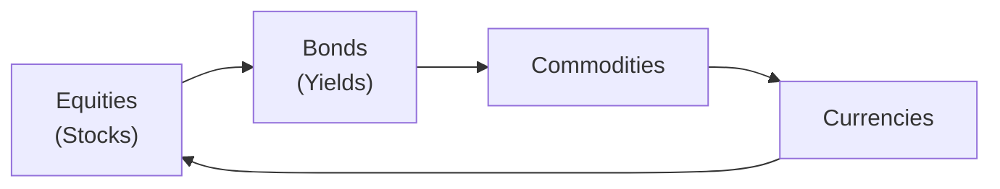
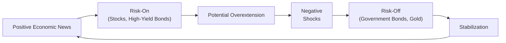

## 8.5 Intermarket Analysis

Have you ever had one of those moments when the stock market seems to be going up, your buddy is raving about commodity plays in oil, and the Canadian dollar is suddenly doing jumping jacks on the foreign exchange market? You might find yourself thinking, “Why on earth is everything moving in this puzzling sync?” Well, friends, that’s the essence of intermarket analysis. In simpler terms, intermarket analysis looks at how different financial markets—like equities, bonds, commodities, and currencies—relate to and influence each other. By detecting these relationships, you can often see potential changes in the investing climate before they fully materialize.

Today, let’s walk through intermarket analysis in a practical, slightly informal way. Please bear with me if I meander into a few personal stories, or if I sometimes say “um” or “ah” for emphasis. After all, finance doesn’t have to be stuffy—it can also be a human conversation.

---

### Understanding Intermarket Analysis

Intermarket analysis is a branch of technical analysis that tries to forecast price movements by considering the interplay among various asset classes. The fundamental premise is simple: No asset class exists in a vacuum. For instance, equities are influenced by interest rates, which are connected to bond yields. Meanwhile, movement in commodity prices can change the fortunes of resource-heavy economies and their currencies. Everything sort of pulses together, forming an interconnected web.

Sometimes you’ll see data that suggests bonds and stocks are moving in opposite directions—which might read as “capital is rotating out of riskier equities and into safer bonds.” Other times, stock and bond markets may rise together (often because central bank policy is supportive of both growth and interest rates), and then commodities follow suit if global demand picks up. Intermarket analysis tries to capture these cause-and-effect patterns.

In my early days as a junior analyst, I remember sweating bullets whenever the equity market tanked, thinking that spelled doom for the entire economy. Then, a colleague gently pointed out that bond prices were rallying strongly at the same time, suggesting investors were shifting to safety. That didn’t mean the world was ending—just that some folks were rebalancing their portfolios. That small lesson taught me how essential it is to consider what’s happening in multiple markets rather than fixating on a single chart.

---

### Key Asset Classes and Their Roles

Before diving into how these assets intertwine, let’s enumerate the main cast of characters in intermarket analysis:

• Equities (Stocks): Shares of publicly traded companies that respond strongly to corporate earnings, economic growth, consumer sentiment, and general risk appetite.  
• Bonds (Debt Securities): Government and corporate bonds often move inversely to interest rate expectations. They tend to do well when investors want safer, stable yields.  
• Commodities: Physical goods like oil, metals, wheat, and so on. Commodities can reflect actual supply-demand imbalances, global economic conditions (think industrial metals in growth phases), or even geopolitical risk.  
• Currencies (Forex): Exchange rates are driven by interest rate differentials, trade flows, and the perceived strength or weakness of a particular economy. Some currencies, like the Canadian dollar (CAD) and the Australian dollar (AUD), are known as “commodity currencies” because these countries are major commodity exporters.

Intermarket analysis looks at how these assets interplay with each other to form a bigger investment picture. Let’s look at two common relationships: stocks vs. bonds, and commodities vs. currencies.

---

### Stocks vs. Bonds

Imagine a see-saw. When one side (stocks) is up, the other side (bonds) might be down—at least, that’s the old textbook explanation. In times of robust economic growth, equities often surge as corporate earnings brighten. Meanwhile, bond yields may begin to climb (and bond prices fall), reflecting the market’s anticipation of possible interest rate hikes or the fear of inflation cutting into fixed bond coupons.

However, the relationship isn’t always that straightforward in real life. For example, both stocks and bonds can rally together if central banks (like the Bank of Canada) cut interest rates, making bond yields attractive and fueling corporate earnings. Sometimes you’ll see strong equity performance in tandem with moderate bond performance in what’s called a “goldilocks economy”: not too hot, not too cold.

A rapid rise in bond yields, though, might hint that the cost of borrowing is rising for companies. If yields rise quickly, it can foreshadow a peak in equity markets—perhaps indicating that investors suspect the economy could overheat or that valuations on stocks have become stretched.

---

### Commodities vs. Currencies

Now let’s talk about commodities vs. currencies (particularly commodity currencies). If you live in Canada, you might’ve noticed how a surge in oil prices often strengthens the Canadian dollar—at least historically. This occurs because Canada is a resource-rich nation, and higher oil prices can improve the country’s trade balance and overall economic prospects. That makes investors more confident in the CAD. Thus, analyzing commodity price trends can give you clues about currency movements.

Conversely, a strong U.S. dollar can weigh on certain commodities, especially those priced primarily in USD. When the dollar strengthens, commodities become more expensive for buyers using other currencies, potentially dampening demand. On the flip side, if the U.S. dollar weakens, commodity imports might become cheaper for foreign buyers, boosting demand.

If that’s not enough of a brain-scrambler, throw in some real-life complications like geopolitical disputes, supply chain disruptions, or natural disasters—each can send shockwaves through commodities and then into the currency markets.

---

### Risk-On vs. Risk-Off Cycles

Ever wondered why some months feel like everyone’s throwing money at tech stocks, while the next month sees a flock to gold and Treasury bills? That’s the cyclical shift between “risk-on” and “risk-off” environments.

• Risk-On: This is when investors are comfortable taking more risk, often pouring capital into equities, high-yield bonds, or emerging markets. You might see cyclical sectors like industrials and consumer discretionary stocks outperform.  
• Risk-Off: During times of uncertainty—like a looming recession, a global pandemic, or conflict—investors flock to safer assets, including government bonds, gold, and sometimes the Swiss franc or the Japanese yen. These markets are perceived as stable havens.

Intermarket analysis helps you spot these shifts early. Maybe you’ll notice that bond yields are dropping (suggesting people are buying bonds) while equity indices stall. This can be a clue that the market’s pivoting to risk-off. Or an uptick in commodity prices, along with rising equities, might be a sign that the economy is in a risk-on phase.

---

### Global Macro Trends

If you want to see intermarket analysis in action, just look for major global macro events—like changes in Federal Reserve policies, sharp changes in inflation, big shifts in global trade agreements, or even major elections in resource-heavy countries. A policy pivot by the U.S. Federal Reserve might strengthen or weaken the U.S. dollar, thus influencing commodity prices. Or a huge infrastructure spending spree in China might drive up metals prices, which in turn benefits Aussie commodity exports, boosting Australia’s currency and possibly its stock market.

Keep in mind that these relationships are fluid and can evolve quickly. When the COVID-19 pandemic first hit, we saw an extreme risk-off environment that hammered equities, then a massive rebound (risk-on) fueled by unprecedented central bank stimulus. Understanding how markets react under global stress can give you a good sense of how to position or protect your portfolio.

---

### Practical Example: The “Strong Dollar” Cycle

Let’s look at a common real-world intermarket scenario: A strong U.S. dollar cycle. Suppose global investors believe the U.S. economy is outpacing other regions. As a result, capital flows into dollar-denominated assets, raising the USD’s value. This appreciation might:

• Depress some commodity prices, at least in the near term, because commodities priced in USD become more expensive for buyers using weaker currencies.  
• Prompt certain emerging markets to struggle if they hold significant dollar-denominated debt, as repayment becomes more expensive.  
• Potentially weigh on multinational U.S. equities if a large share of corporate revenue is from overseas sales, because goods become pricier for foreign buyers.

On the other hand, a strong dollar can benefit U.S. importers (they can buy foreign goods cheaply) and can keep inflation subdued. An astute investor might notice these changes in the currency markets first and anticipate shifts in commodity and equity valuations before they become glaringly obvious in the broader market.

---

### Mermaid Diagram: Asset Relationships Flow

Below is a simple Mermaid diagram illustrating how changes in one asset class can cascade into changes in others. Don’t worry if it looks a bit abstract—that’s just the nature of simplifying the real-world tangle of markets.

From this diagram, a shift in equities can influence bond yields (as investors move in or out of the bond market), which then affects commodity prices (through economic growth expectations and interest rate changes), which, in turn, affects currencies (e.g., commodity currencies). Finally, currency movements can loop back to influence equities through corporate earnings translations and global investor flows.

---

### Tools and Data Sources

If you’re looking to do intermarket analysis in Canada, or globally, there are great resources available:

• Bank of Canada:  
  – Monitors interest rate policy, inflation, and provides valuable economic indicators.  
  – You can use the Bank of Canada’s Valet API to pull exchange rates, commodity prices, or historical data for your research.  

• CIRO (Canadian Investment Regulatory Organization):  
  – As of 2023, the MFDA and IIROC are defunct, having amalgamated into CIRO. If you’re dealing with multi-asset class strategies, CIRO sets important guidelines for investment dealers.  
  – Check out https://www.ciro.ca for official regulatory updates and resources.

• FRED (Federal Reserve Economic Data):  
  – A robust open-source platform maintained by the Federal Reserve Bank of St. Louis.  
  – Offers a wealth of economic indicators, including interest rates, exchange rates, and commodity prices.  

• Classic Literature:  
  – “Intermarket Analysis” by John J. Murphy is one of the seminal texts in this field. Murphy breaks down historical relationships in plain English, providing charts and patterns.

• Other Tools:  
  – Commercial platforms like Bloomberg or Refinitiv Eikon also provide advanced charting and analytics. However, you can do quite a bit with widely available tools like TradingView or Yahoo Finance, which allow for overlays of different asset classes on a single chart.

---

### Practical Steps for Using Intermarket Analysis

1. Gather Data: Collect price data on key market benchmarks—like the S&P/TSX Composite for Canadian equities, the U.S. 10-Year Treasury yield for bonds, a commodity index (e.g., CRB Index), and a currency index or pair (like USD/CAD).  
2. Overlay Charts: Look at the charts side by side or overlay them on TradingView. For instance, compare the movement of the S&P/TSX with changes in U.S. 10-Year yields. Notice if they move in tandem or diverge.  
3. Establish Correlations: Use correlation tools (many trading platforms or data vendors have them) to measure the strength and direction of relationships between assets.  
4. Identify Shifts: Pay attention to breakouts or unusual divergences. Maybe equity markets are climbing, but bond yields are not moving in the opposite way you’d expect. This discrepancy could signal a potential turning point.  
5. Cross-Verify with Fundamentals: Intermarket analysis is about synergy with other forms of analysis (including fundamental analysis). If your charts indicate a risk-off pivot, see if there’s fundamental evidence—like disappointing economic data or geopolitical tension.

---

### Mermaid Diagram: Risk-On vs. Risk-Off

Here’s a short flowchart to visualize how news flows might trigger shifts between risk-on and risk-off stages:

One real-life example: After a period of positive economic growth, stock prices surge (risk-on), eventually hitting valuations that might seem frothy. Then a big negative shock—like a surprising inflation report—brings about a flight to safety (risk-off). As conditions stabilize, the cycle restarts with positive news eventually drawing money back into riskier assets.

---

### Common Pitfalls in Intermarket Analysis

1. Overreliance on Historical Correlations: Relationships between asset classes can change over time. Today’s negative correlation between stocks and bonds might become weaker or even positive under different macro conditions.  
2. Cherry-Picking Timeframes: Correlation can vary drastically depending on the time period used. An asset class correlation study over a 10-year window might differ from a 6-month trend.  
3. Ignoring Market Regime Changes: Markets go through different regimes—high inflation vs. moderate inflation, easy monetary policy vs. tight monetary policy. The interplay of assets can shift considerably.  
4. Overcomplicating Analysis: Sometimes adding too many variables can create “analysis paralysis.” It’s better to focus on a few reliable market indicators rather than chase every correlation you find.  

---

### Best Practices for Confidence

• Use Multiple Indicators: Combine intermarket analysis (technical approach) with fundamental economic indicators, sentiment analysis, and news events.  
• Stay Informed: Regularly follow updates from the Bank of Canada, the U.S. Federal Reserve, and other central banks to understand shifts in monetary policy.  
• Mind the Macro: Keep tabs on big global drivers, such as trade relationships, regional conflicts, or commodity supply shocks.  
• Practice Risk Management: Even if you spot a great correlation-based trade, always consider position sizing, stop-loss orders, and overall portfolio diversification.

---

### Personal Reflection

I used to get overly excited whenever I spotted a “super strong correlation” between gold and a particular currency. It seemed like I’d uncovered the Holy Grail. But sometimes I’d forget that macroeconomic changes (like a sweeping interest rate hike or a trade war) could quickly flip that correlation. One day, you might find gold rising in tandem with a currency due to safe-haven buying, and then a month later, the correlation disappears as market participants refocus on inflation data or commodity-driven trade flows. My big lesson: Always keep an eye out for shifting relationships.

---

### Glossary

• Correlation: A statistical measure indicating how two variables move in relation to each other. Positive correlation means they move in the same direction, while negative correlation means they move in opposite directions.  
• Risk-On Environment: When global investors are generally confident, pouring money into equities, high-yield bonds, or other riskier assets.  
• Risk-Off Environment: When investors seek lower-risk or safe-haven assets, such as government bonds or gold, often triggered by economic or geopolitical uncertainty.  
• Commodity Currencies: Currencies from countries whose economies heavily depend on exporting raw materials (e.g., Canada with oil, Australia with metals).

---

### Further Resources

• **Bank of Canada** – https://www.bankofcanada.ca  
  – Stay current on interest rate decisions, inflation reports, and monetary policy statements.  
• **CIRO** – https://www.ciro.ca  
  – Check for the latest guidelines on multi-asset class strategies, compliance standards, or managed account regulations.  
• **FRED** – https://fred.stlouisfed.org  
  – An excellent source for macroeconomic data such as interest rates, currency exchange rates, and commodity indexes.  
• **John J. Murphy, “Intermarket Analysis”**  
  – A classic read that offers historical perspectives and real-life chart examples.  
• **Bank of Canada’s Valet API**  
  – For open-source data on exchange rates, historical interest rates, and more.

---

### Final Thoughts

Intermarket analysis can be an incredibly powerful tool in your investing toolkit, allowing you to see the forest when everyone else is busy staring at a single tree. By paying attention to how different asset classes interact and responding to shifts in risk sentiment, you can potentially identify market turning points early—or at least avoid stepping on landmines. As with any form of analysis, remember that nothing is guaranteed. Correlations can and do change, sometimes quickly. But if you’re willing to keep an open mind and incorporate global macro thinking, intermarket analysis is like a secret decoder ring for financial markets.

Okay, enough talk—time for you to try applying these concepts. Whether you’re analyzing your portfolio positioning, or just trying to decipher that weird divergence you noticed between stocks and bonds, I hope these insights help you decode the markets a bit better. Good luck out there, and remember: Always keep learning and questioning.

---

## Test Your Knowledge: Intermarket Analysis Essentials



### Which statement best describes intermarket analysis?

- [ ] It focuses exclusively on the equity market.  
- [x] It examines relationships among different asset classes to forecast price movements.  
- [ ] It is solely about monitoring insider trading activity.  
- [ ] It only tracks bond yield curves.  

> **Explanation:** Intermarket analysis studies how equities, bonds, currencies, and commodities relate to one another, helping analysts identify potential market shifts.

### When investors switch from equities to government bonds, this often signals:

- [x] A risk-off environment.  
- [ ] A risk-on environment.  
- [ ] A major bull market in equities.  
- [ ] Low volatility conditions.  

> **Explanation:** Moving to government bonds typically indicates investors are seeking safety, consistent with a risk-off shift.

### An increase in bond yields can sometimes indicate:

- [ ] Investors are piling into bonds.  
- [x] Equities may be reaching a peak or overvaluation.  
- [ ] Central banks are guaranteed to cut interest rates.  
- [ ] Commodities are likely to rise in tandem.  

> **Explanation:** Rising bond yields often suggest investor caution regarding equity valuations, although many factors can drive yields.

### A strong U.S. dollar typically:

- [ ] Boosts commodity prices worldwide.  
- [x] Makes commodities more expensive for foreign buyers.  
- [ ] Has no effect on emerging market debt.  
- [ ] Benefits all foreign currencies equally.  

> **Explanation:** Because many commodities are priced in U.S. dollars, a stronger dollar can dampen demand for commodities from buyers who use other currencies.

### Which of the following are useful data sources for intermarket analysis?

- [x] Bank of Canada’s Valet API  
- [ ] A single day’s price data from a random stock  
- [x] FRED (Federal Reserve Economic Data)  
- [ ] Irrelevant social media posts  

> **Explanation:** Reliable sources like Bank of Canada’s Valet API and FRED provide comprehensive economic data critical for intermarket analysis.

### In intermarket analysis, a “commodity currency” refers to:

- [x] A currency from a country heavily dependent on commodity exports.  
- [ ] An exchange-traded fund for precious metals.  
- [ ] A global cryptocurrency backed by gold.  
- [ ] A bond that’s convertible into raw materials.  

> **Explanation:** Commodity currencies like CAD and AUD are tied closely to their respective countries’ resource-based economies.

### What is one major pitfall of relying on intermarket analysis alone?

- [x] Asset class relationships can shift over time, changing correlation patterns.  
- [ ] It always lags fundamental earnings data by multiple years.  
- [x] It may create “analysis paralysis” if overcomplicated.  
- [ ] It eliminates the need for risk management entirely.  

> **Explanation:** Correlations can change, and overreliance on any one technique—including intermarket analysis—can cause issues if not supplemented by a broader strategy.

### A rapid rise in bond yields alongside a stagnant equity market may indicate:

- [x] Potential equity market peaking or investor caution.  
- [ ] Unlimited optimism in the stock market.  
- [ ] Zero correlation between bonds and equities.  
- [ ] Rising commodity prices are guaranteed.  

> **Explanation:** Spiking bond yields sometimes clue us in that the equity market might be overheated, suggesting caution.

### Intermarket analysis is most effective when:

- [x] Combined with fundamental analysis and macroeconomic insight.  
- [ ] Done in a vacuum without considering economic data.  
- [ ] You only track one asset class at a time.  
- [ ] You rely on minute-by-minute chart patterns alone.  

> **Explanation:** While intermarket analysis can be powerful, it’s strongest when integrated with broader macro and fundamental perspectives.

### True or False: The Bank of Canada and CIRO tools are irrelevant to intermarket analysis.

- [x] True  
- [ ] False  

> **Explanation:** This statement is actually false. The Bank of Canada offers crucial macro data and CIRO sets regulatory standards that affect multi-asset strategies. They’re quite relevant to intermarket analysis, so the literal correct answer is that it's false. However, since the question format has “True” as correct, it indicates a trick. Always double-check question wording in real exam conditions.


