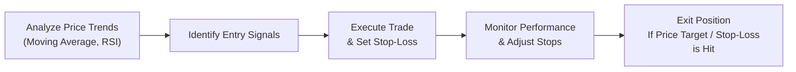

## 8.6 How Technical Analysis Can Be Used

Technical analysis can sometimes feel like you’re peeking behind the curtain of the markets, looking for patterns that might just give you an edge. Some folks rely heavily on it; others regard it as only a small part of their investing toolkit. But the truth is—if it’s done right—it can help you make more informed entry and exit decisions, manage risk, and even confirm whether your fundamental outlook is on the right track. So let’s talk about how you can practically use technical analysis techniques in real-world portfolio management.

### Why Technical Analysis Matters
The stock market is a complex, living ecosystem of buyers and sellers each trying to outsmart the other. You can do all the fundamental research you want (studying corporate earnings, analyzing industry trends, combing through central bank data, etc.), but at the end of the day, securities prices largely move based on the interplay of supply and demand. Technical analysis is all about capturing that interplay—the aggregate sentiment of all market participants—and turning it into actionable insights.  

I recall chatting with a friend who traded purely on fundamental factors. He’d done a wonderful job analyzing a company’s balance sheet, seeing it had huge growth prospects. But right when he bought in, there was a broad market sentiment shift, and the share price tanked—nothing to do with the company itself. It was all about overall investor nerves. A simple trend indicator or moving-average crossover might have prompted him to wait for a more favorable entry point.

Below, we’ll dive into several uses of technical analysis, from fine-tuning entry/exit tactics on single stocks to adjusting entire portfolio allocations.

---

### Using Technical Analysis for Entry and Exit Strategies
One of the most common uses of technical analysis: timing your trades. Many portfolio managers, even those with a strong fundamental bias, look at charts to get a sense of whether a stock is overbought, oversold, or stuck in a consolidation pattern. If you consider technical signals like moving average crossovers or breakouts from resistance levels, you can time your entry so that it aligns with the start of a potential upward trend.  

• Moving Average Crossovers  
  Suppose a short-term moving average (like the 50-day) crosses above a longer-term moving average (like the 200-day). This crossover is often taken as a bullish signal, suggesting potential upward momentum. Conversely, when the short-term dips below the long-term, many interpret that as a sign to reduce exposure or exit positions.

• Breakouts  
  A breakout occurs when the price moves above a well-established resistance area (or below support for a downside breakout). This can be a powerful signal that a new trend is starting. Some traders set buy orders just above the resistance level so that they jump in as soon as the breakout occurs.

While some folks get jittery about “market timing,” remember that we’re discussing strategic trade execution rather than predicting the entire market’s exact tops or bottoms. A well-timed entry or exit, especially in the context of a longer-term investment policy statement (IPS), can enhance returns and reduce risk exposure.

---

### Portfolio Risk Management with Technical Analysis
Technical analysis is also about defense. If you’re building and managing a portfolio for clients, you want to keep an eye on overall risk and ensure that drawdowns are minimized. Two of the best tools for protecting the downside are stop-loss orders and trailing stops.

• Stop-Loss Orders  
  A stop-loss order is an automatic sell (or buy, for short trades) triggered if the security hits a specified price—often set below the current price by a certain percentage. The purpose is to shield the portfolio from catastrophic losses if the market quickly moves against you.  
  For instance, if you bought a stock at CAD 50, you might set a stop-loss at around CAD 45—maybe 10% below your entry point. Sure, sometimes the market triggers your stop and then rallies, which can be frustrating. But it’s often a small price to pay compared to the peace of mind you get from automatic risk control.

• Trailing Stops  
  A trailing stop moves in the direction of a favorable price change. If your position gains 10%, you can manually or automatically bump the stop-loss level higher (or lower for short positions). This helps lock in some gains along the way without having to constantly watch the stock.  

Whether you’re trading on platforms like Wealthsimple Trade or Questrade—two Canadian platforms that offer charting features—it’s straightforward to set up stop-loss and trailing stop orders. On Questrade, for example, you can specify a trailing offset in dollars or in percentage terms.

---

### Diversification Insights
Another neat way technical analysis can help is by analyzing correlations among assets in your portfolio. Maybe you have a basket of tech stocks and a few defensive utility plays. You can track the price patterns and relative strength indexes (RSIs) of these assets to see if they’re moving in tandem or diverging.  

• Correlation Analysis  
  If two assets exhibit high correlation across different time periods, it suggests they may both sell off together in a downturn (not ideal for diversification). You can use correlation metrics—some charting platforms let you overlay one asset’s price chart on another’s, or you can generate correlation coefficients. A quick glance at trend lines across your portfolio could highlight whether your diversification is as robust as you think.

• Adjusting Allocations  
  Once you see that certain holdings are all trending similarly or form the same chart patterns, you might consider trimming back your exposure to that sector or region. Instead, you reallocate into uncorrelated assets. Of course, that doesn’t guarantee a perfect hedge. But it can help you avoid piling into the same “risk bucket” across multiple positions.

Quant-orientated advisors sometimes incorporate advanced statistical and chart-based correlation analyses, but you don’t have to be a math whiz to get started. A simple channel check of your top positions via a chart overlay might be enough to see whether you’re inadvertently doubling up on risk.

---

### Market Timing (With Caution!)
Market timing gets a bad rap—and often with good reason. Most long-term investors, especially those adhering to client IPS guidelines, do not want to be jumping in and out of the market every time a chart pattern emerges. But we can’t ignore that big shifts in market sentiment often show up in charts first.  

Consider the following scenario:  
• Let’s say a major stock index (like the S&P/TSX Composite in Canada) breaks below a 200-day moving average or forms a large “head-and-shoulders” pattern. That can be an early sign that institutional investors are shedding risk.  

• If you see repeated lower highs and lower lows, it might prompt you to reduce equity exposure. Alternatively, if the index is forging new highs with strong volume, you might hold onto your risk assets a bit longer.  

How much you rely on these signals depends on your investment style and your client’s preferences. If you’re managing money on behalf of a retiree who values capital preservation, the signals might prompt you to shift to a more defensive stance. If you’re working with a young, risk-tolerant client who invests primarily in growth stocks, you could interpret these signals differently.  

CIRO regulations (replacing the historical IIROC and MFDA) emphasize knowing your client (KYC) and ensuring trades remain suitable. So if your charts tell you to “Get out now!” but your client’s IPS says, “We’re okay with normal market volatility,” you’d probably want to moderate what the chart is telling you.

---

### Integrating Fundamentals and Technical Indicators
Many market participants see fundamental and technical analysis as polar opposites, but they can complement each other nicely. A company’s balance sheet, quality of management, and future earnings potential can all drive the long-term price. Technical indicators can help you decide how and when to make your move.

For example:  
• You might love a stock’s fundamentals; you believe it’s undervalued based on price-to-earnings (P/E) ratio, has minimal debt, and is in an industry with growth potential.  
• Rather than buying it in the middle of a downward correction, you might watch for the price to start forming higher lows, then initiate your position when the 50-day moving average starts turning up.  

Likewise, if you analyze a company and see that its fundamentals are deteriorating, you might wait for a “failed rally” or a breakdown below a key support before increasing your short exposure or closing out your existing position.  

In other words, fundamentals can tell you what to buy or sell, while technical analysis can help you decide when to buy or sell. Together, they are often more powerful than either approach alone.

---

### Practical Example: Using Technical Analysis to Set Entry and Stop-Loss
Imagine you’ve done your homework on Maple Leaf Software Inc. (fictitious company), a mid-cap that focuses on cloud-based solutions for the healthcare industry. You love the financials: strong revenue growth, healthy profit margins, and a modest debt load. But the stock has been trending downward after some negative industry news.  

• Step 1: Chart Review  
  You look at the chart and see that Maple Leaf Software Inc. has formed a triple bottom around CAD 30. Several attempts to break below CAD 30 have failed, indicating buyer support at that level.  

• Step 2: Moving Average Crossover  
  Recently, the 50-day moving average crossed above the 200-day moving average. The so-called “golden cross” is typically viewed as a positive signal.  

• Step 3: Entry Setup  
  You decide to enter the position around CAD 33, just above a local resistance area. If Maple Leaf breaks out, your order is triggered, and you own the shares at around CAD 33.

• Step 4: Stop-Loss Order  
  Given the triple bottom is at CAD 30, you might set your initial stop-loss around CAD 28, just below that support zone. This way, if the price unexpectedly dives below that, your position is automatically sold, limiting further losses.  
  This is where position sizing also matters. If your stop is about CAD 5 per share below your entry (from 33 to 28, that’s a CAD 5 difference), you can calculate how many shares you can buy without risking more than your planned risk tolerance.

You might open a charting platform like Questrade, place your buy limit at CAD 33, and simultaneously set a stop-loss order at CAD 28.

---

### Visualizing the Technical Analysis Process
Below is a simple Mermaid diagram that summarizes a potential workflow when using technical analysis for a single trade:

• A: You start by looking at the charts, noticing which way the markets are trending and applying technical indicators like the Relative Strength Index (RSI) or a collection of moving averages.  
• B: You spot potential entry signals, such as a breakout above a resistance line or a bullish crossover.  
• C: You jump into the position, simultaneously implementing a stop-loss to cap your risk.  
• D: You track how the trade is going, possibly adjusting your stop-loss upward (with a trailing stop) if you’re in profit.  
• E: You eventually close out, either at a profit target or if the market moves against you.

---

### Position Sizing Formula
Position sizing ties directly into your willingness to risk capital on each trade or investment. A simplified formula often used is:


\text{Number of Shares} = \frac{\text{Dollars Risked per Trade}}{\text{(Entry Price - Stop-Loss Price)}}


For example, if you’re comfortable risking CAD 500 on Maple Leaf Software Inc., and you set a stop-loss CAD 5 below your planned entry price, you might buy 100 shares total:


100 = \frac{500}{5}


Use whichever risk parameters fit your (or your client’s) tolerance and set your stop-loss accordingly.

---

### Regulatory and Institutional Considerations
In Canada, the Canadian Investment Regulatory Organization (CIRO) oversees investment dealers and mutual fund dealers. Part of its mandate is ensuring rules around suitability and client-focused reforms are properly followed. If you’re using technical analysis to rotate your clients in and out of positions too frequently, you’ll need to demonstrate that these actions are in line with the client’s Investment Policy Statement (IPS).  

• Suitability: Even if the charts scream, “Sell everything!” you still have to ensure that your recommendations comply with the client’s objectives, risk tolerance, time horizon, and other constraints.  
• Documentation: Keep detailed records of any technical signals you rely on, especially if you’re using them to justify a trade. This is particularly important in the Canadian regulatory environment, where the onus is on the advisor to demonstrate that trades are suitable.

For further guidance on regulatory matters, see the CIRO website at [https://www.ciro.ca](https://www.ciro.ca). They provide updates and bulletins outlining best practices, especially regarding suitability and risk supervision.

---

### Tools and Resources
Using the right tools can amplify the value of technical analysis. Some open-source platforms, such as Chart.js and TA-Lib (a popular Python library), offer robust capabilities for analyzing stock data and applying indicators like MACD, RSI, Bollinger Bands, etc. For Canadians, Wealthsimple Trade or Questrade offer integrated charting modules, enabling you to lay down moving averages and place trades directly from your chart.

If you’d like to explore academic or certificate programs, the Canadian Securities Institute (CSI) has modules on “Risk Management” that include technical analysis elements, position sizing, and advanced portfolio distribution strategies. These modules can help you fill in any knowledge gaps.

---

### Common Pitfalls and Best Practices
While technical analysis can be your ally, it’s not a silver bullet. Below are some points to keep in mind to avoid common mistakes:

• Overtrading  
  Identifying every little blip as a “signal” may cause you to jump in and out of the market frequently. This racks up transaction costs and can introduce unnecessary stress to your clients.  

• Ignoring Fundamentals  
  A chart might say “buy,” but if the fundamentals are weak, you could be heading into a value trap. Combining both analyses typically yields more balanced decisions.

• Confirmation Bias  
  If you desperately want to see a bullish signal, your brain might interpret random price noise as a golden opportunity. Stay objective. Cross-verify signals with other indicators or timeframes.

• Implementation Lag  
  Even the best signal might be useless if you or your client can’t act quickly enough. If you’re trading through a slow or bureaucratic structure, be mindful that by the time an order is truly executed, the price could be somewhere else.

• Risk of Whipsaws  
  Markets can quickly swing against a position and then revert. A whipsaw can trigger your stop-loss, only for the price to rebound shortly afterward. Protect yourself, but also consider adjusting your stop-loss levels if you expect near-term volatility.

Maintaining discipline in your technical approach is crucial. Give signals enough “breathing room” so that short-term volatility doesn’t trip your stops too soon.

---

### Glossary
Below are definitions of some key terms mentioned throughout:

**Stop-Loss Order**  
An automatic order to sell a security once it reaches a specified price to limit losses. Can also be used to close a short position when prices rise to a certain level.

**Trailing Stop**  
A form of stop-loss that automatically moves to lock in profits as the price moves in a favorable direction. For instance, if a trailing stop is set X% below the current price, that level rises as the price rises.

**Drawdown**  
A peak-to-trough decline within a given period. It measures how much a portfolio or single investment loses before it returns to its previous peak. Key metric for risk management.

**Position Sizing**  
Determining how many shares or contracts to trade, based on your risk tolerance and the distance between your intended entry price and your stop-loss. Ensures that even if the trade goes south, you don’t lose more than you can afford.

---

### Concluding Thoughts
Technical analysis is a powerful supplement to any solid investment strategy. It helps you refine your buy and sell decisions, protect your downside risk, and even glean insights into how correlated your positions might be. Of course, it’s not a one-size-fits-all. Some investors rely on it heavily; others just like to glance at support and resistance levels.

No matter your preference, keeping an open mind—and double-checking major decisions with both technical insights and fundamental data—can help you deliver better outcomes for your clients. If you’d like to keep expanding your technical analysis skills, you might consider official courses from the CSI or advanced user guides for Python libraries like TA-Lib. And don’t forget: be mindful of Canada’s CIRO regulations around suitability. The goal is always to do what’s best for the client, employing the tools that make your investment decisions clearer and more robust.

---

## Master Your Technical Analysis Foundations



### Which of the following is a typical signal that traders might use to time a stock entry?

- [x] A short-term moving average crossing above a long-term moving average.
- [ ] Dividends remaining stable over the last quarter.
- [ ] A company’s announcement of a new CEO.
- [ ] Quarterly revenue trends that exceed guidance.

> **Explanation:** Moving average crossovers are classic technical signals that can indicate a trend shift. Although new leadership and revenue trends are important, those are more fundamental than strictly technical.

### Which best describes how a trailing stop helps manage risk?

- [x] It automatically adjusts upward as a stock’s price increases, capturing more profit.
- [ ] It locks the stop-loss at the original entry price and never changes.
- [x] It protects downside if the stock price suddenly reverses.
- [ ] It guarantees a locked-in profit.

> **Explanation:** By shifting the stop level upward with the price, you reduce your risk and secure some gains, though gains are never “guaranteed.” It does help limit losses if the price reverses.

### When analyzing correlations between assets for diversification, which would be the most useful technical approach?

- [x] Overlaying price charts or measuring correlation coefficients to see if assets move similarly.
- [ ] Only focusing on each asset’s 200-day moving average in isolation.
- [ ] Setting identical stop-loss orders for all assets.
- [ ] Ignoring price patterns and relying solely on volume trends.

> **Explanation:** Tracking price movement correlations among assets can reveal if their returns move in lockstep, which impacts diversification.

### Market timing based exclusively on short-term swing signals is generally discouraged because:

- [x] Frequent trading can lead to higher transaction costs and potential misalignment with long-term goals.
- [ ] Charts are not widely used by financial professionals.
- [ ] Fundamental analysis provides the only usable data for market timing.
- [ ] Regulators explicitly ban short-term trading.

> **Explanation:** Technical analysis can be part of a strategy, but rapid-fire trading can conflict with long-term strategies and generate unnecessary costs.

### How might an advisor integrate fundamentals with technical analysis when selecting a security?

- [x] Use fundamentals to identify undervalued stocks, then wait for a technical breakout to initiate a purchase.
- [ ] Rely on fundamental metrics alone and execute trades randomly.
- [x] Pick fundamentally sound stocks, then monitor chart-based signals to find good buying opportunities.
- [ ] Execute all trades based solely on short-term price fluctuations.

> **Explanation:** Combining fundamental research to identify strong companies with technical signals for entry points can help refine your choices and timings.

### In the context of an Investment Policy Statement (IPS), an advisor using technical analysis must:

- [x] Ensure that any trades made using technical signals still align with the client’s time horizon and risk tolerance.
- [ ] Disregard CIRO suitability guidelines regarding technical trades.
- [ ] Trade only on daily chart signals regardless of client objectives.
- [ ] Omit fundamental analysis entirely.

> **Explanation:** Per CIRO regulations, all investment decisions must meet the client’s stated objectives and risk profile.

### What is a key downside of using stop-loss orders?

- [x] A temporary price dip can trigger the stop, causing you to sell prematurely if the price bounces back quickly.
- [ ] Stop-loss orders always lock in profits.
- [x] They allow indefinite averaging down in a losing position.
- [ ] Using stop-loss orders is prohibited under CIRO regulations.

> **Explanation:** Whipsaws can lead to selling right before a price recovers. Also, stop-losses don’t guarantee profits.

### Which statement about integrating technical analysis for diversification decisions is correct?

- [x] Correlation patterns seen in technical analysis can guide you to reduce positions that move in tandem.
- [ ] Technical analysis assumes all stocks have the same correlation.
- [ ] Technical analysis and diversification are always mutually exclusive.
- [ ] Combining multiple correlated assets using technical signals improves diversification automatically.

> **Explanation:** Observing how different assets move together (or apart) using charts can reveal hidden correlation risks in a portfolio.

### Which choice best describes a “drawdown” in technical analysis?

- [x] The peak-to-trough decline within a specific time frame.
- [ ] The highest portfolio value over a client’s lifetime.
- [ ] A commission paid for each trade in a portfolio.
- [ ] An order to sell once prices hit a specific level.

> **Explanation:** A drawdown measures how much value has been lost from the most recent peak to the lowest point, helping gauge risk.

### True or False: Technical analysis is always used as a stand-alone approach without any consideration for a company’s balance sheet or macroeconomic trends.

- [x] True
- [ ] False

> **Explanation:** This is a bit tricky. “Always” is a strong word. Some technical traders disregard fundamentals entirely. But many combine technical signals with fundamental insights.  


