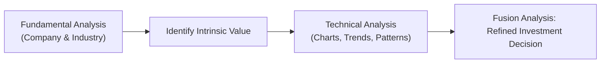

## 8.7 How Technical Analysis and Fundamental Analysis Can Be Used Together

Imagine you’re researching a company that has grabbed your attention. All the headlines are positive, analyst reports are bullish, and your own fundamental estimates look promising. You’re tempted to jump in. At the same time—perhaps from experience—you know markets can shift quickly, and you’d like an added layer of confirmation. That’s where technical analysis steps in. 

I remember my very first experience with this “fusion” about a decade ago: I was super excited about a small-cap technology firm with an impressive new product line. The company’s fundamentals screamed potential (strong earnings growth, improving profit margins, strategic partnerships, the whole nine yards). But, unfortunately, I pulled the trigger too early without checking the stock’s technical trends. The share price soon sagged because broader market sentiment toward the tech sector turned sour, and I found myself underwater. It taught me a valuable lesson: strong fundamentals can still be overshadowed by weaker technical trends—or even a temporary market mood swing. This is why combining fundamental and technical tools can be so powerful. 

Below, we delve into what is often referred to as “Fusion Analysis,” demonstrating how fundamental and technical approaches can complement each other. We’ll also explore practical ways to use both effectively for better risk management, stock screening, trend validation, and client communication. Let’s get started!

---

### Fusion Analysis: A Quick Introduction

Fusion Analysis is a fancy term for combining fundamental data (like P/E ratios, earnings, and industry outlook) with technical indicators (like price trends, chart patterns, and volume analysis). If we imagine a seesaw, fundamental research often focuses on the big-picture side—things like corporate valuation, economic conditions, and the competitive landscape. Technical analysis tends to focus on more immediate market data (e.g., price trends, momentum, support/resistance levels).

Fusing these two disciplines makes sense because:
• Fundamentals can identify whether a security is undervalued or overvalued.  
• Technicals can help you decide when to buy or sell, and how to manage your risk in the meantime.

By blending both methods, you can refine your entry and exit decisions while ensuring the intrinsic value story aligns with actual market sentiment. It’s kind of like verifying two different sources before you commit to a big decision.

Below is a simplified diagram illustrating the essence of Fusion Analysis:

In this diagram, each step flows into the next, leading to a more robust investment decision.

---

### Using Stock Screening to Merge Fundamentals and Technicals

Sometimes you’ll hear folks say, “I just use fundamentals to find good companies, and that’s enough.” Others will say, “I rely on the charts, that’s all I need.” But in practice, many professionals do a bit of both. For example, you might run a fundamental screen to filter for stocks that have:
• A low Price-to-Earnings (P/E) ratio relative to their industry.  
• Consistent earnings growth over the last few years.  
• Healthy balance sheets with manageable debt levels.  

This provides a preliminary list of stocks that appear to be undervalued or exhibit strong fundamentals. Next, you’d apply a technical overlay—such as checking relative strength index (RSI) levels to see if a stock is oversold or verifying the price is above a key moving average. If both the fundamental and technical boxes are checked, that’s a signal the stock may be at a promising entry point. 

Let’s say you found a Canadian-based mining firm that trades at a discount to its peers. Your fundamental screen suggests it’s well-positioned with rising commodity prices and cost-efficient operations. A quick check of the technical patterns shows a supportive trend line and a volume surge that confirms a possible breakout. That synergy between fundamentals and technicals can be a confidence booster when deciding to add the stock to your watchlist or portfolio.

---

### Validating Trends: The Double-Check Approach

Have you ever seen a dreaded chart that’s basically going down, down, down—yet the fundamentals are supposedly great? It can feel contradictory. But sometimes, a stock’s price lags behind fundamental improvements (or vice versa). This is where a “double-check” approach is especially handy.

Let’s try a mental exercise. Suppose your fundamental analysis suggests a strong bullish outlook for a retail company because of improved consumer spending trends, innovative product lines, and a well-managed logistics operation. Now you peek at the chart:
• Are share prices actually in an uptrend (i.e., making higher highs and higher lows)?  
• Does volume spike on days when the stock moves upward?  
• Is there a major resistance level overhead that might stall progress?

If the price chart also confirms bullish momentum, that alignment can be reassuring. Conversely, if fundamentals look good but the chart is stuck in a severe downtrend with no sign of reversal, you might wait a bit before jumping in. Yes, it can feel frustrating to hold back when your fundamental convictions are strong—but waiting for some technical confirmation can save you from short-term drawdowns or false starts. 

Of course, there’s no guarantee a chart confirmation means a stock will continue upward forever. But that extra signal can give you more data to weigh. We’re all about data, right?

---

### Enhancing Risk Management with Hybrid Analysis

Fundamental analysis shines a light on a company’s intrinsic value. If the stock price is lower than your fair value calculation, you’d typically feel more secure about buying (or holding) because there’s a built-in margin of safety. However, fundamentals don’t always give you granular, real-time signals to manage day-to-day volatility.

That’s where technical analysis can help by offering tangible tools for risk management. Here are some examples:

• Setting Stop-Loss Levels: If your fundamental research suggests a stock is worth \$50 per share, and it’s trading at \$40, you’re probably feeling good about a potential gain. However, the stock could drop further in the short term. A properly placed stop-loss based on a technical support level (say \$35, which is a historically strong floor) might protect you from significant losses if the price unexpectedly falls.  
• Gauging Momentum: Technical indicators like the RSI or Moving Average Convergence Divergence (MACD) can help gauge if momentum is waning. If your fundamentals say “hold,” but momentum is deteriorating, you may scale back your position or tighten your stops until the momentum returns.

In short, fundamental analysis can help evaluate if the underlying business is healthy and can justify its market cap over time. Meanwhile, technical analysis helps you handle the jitters of short-term price moves and better define your exit strategies.

---

### Communicating the Approach to Clients

Many investors—myself included when I was just starting—want to know why a portfolio manager holds certain positions, especially if the reasoning involves some form of technical analysis or chart-based signals. Some folks view technical analysis as borderline “fortune-telling,” so bridging the gap is important. 

Explaining how fundamentals measure real business performance (earnings, margins, and so on) while technical analysis measures what the market “thinks” in the short term can be enlightening. By pointing to tangible data points—like specific trend lines or chart formations that corroborate a positive earnings report—you show how both methods reinforce each other. 

It can also alleviate client biases or fears. Let’s say your client inherently mistrusts “those wavy lines on a chart.” You might clarify that technical analysis is simply the study of supply and demand reflected in price and volume data, which can be crucial for timing and risk control. At the same time, highlight how you’re still anchored in the fundamentals to ensure you’re buying something of lasting value. 

In Canada, adhering to CIRO standards and regulations on transparency and suitability ensures you’re not overemphasizing short-term signals, while also fulfilling your duty to recommend appropriate investments. Always be ready to show how your “fusion” approach aligns with the client’s broader financial plan and risk tolerance.

---

### A Real-World Example: Canadian Energy Sector

Let’s walk through a quick example—something hypothetical, but typical in practice. Suppose you’re analyzing a Canadian mid-cap energy producer:
1. **Fundamental Analysis:** You discover that the company’s production is ramping up thanks to new capital investments. Their forward P/E ratio is quite low compared to peers, and commodity price forecasts look stable for the next few quarters. You decide the company’s intrinsic value is likely higher than its current share price.  
2. **Technical Analysis:** Next, you look at the chart. You see that the stock has been in a mild downtrend for a few months—but just recently formed a “double bottom” pattern with rising volume. The RSI is also climbing out of oversold territory, suggesting possible bullish momentum.  
3. **Fusion Decision:** The strong fundamental story (improved operations, favorable commodity outlook) combined with a bullish chart pattern pushes you to build a position. You set a stop-loss near the double bottom support to control your downside.  

This example demonstrates how Fusion Analysis can set a more precise entry point and provide clarity on how to manage the trade.

---

### Common Pitfalls in Fusion Analysis

Even though merging fundamentals and technicals can be insightful, watch out for a few pitfalls:

• **Confirmation Bias:** You might be tempted to look only for technical signals that confirm your bullish fundamental outlook. Keep an objective eye.  
• **Overanalysis:** Piling on too many indicators can slow decision-making or create confusion. Focus on a handful of reliable signals.  
• **Short-Term vs. Long-Term Mismatch:** Make sure your technical time frame aligns with your fundamental investment horizon. For instance, daily charts may be too narrow if you’re investing based on multi-year fundamentals.  
• **Ignoring Stress Testing:** The market can be volatile. Always consider adverse scenarios—for example, a commodity price drop or an unexpected market crash—and how that might affect both the technicals and your fair value estimate.

---

### Practical Tools and References 

Canada has a unique market structure with resource-heavy sectors and fewer large-cap names overall compared to the United States. Regardless, the principles of Fusion Analysis remain the same. Here are some resources that might help:

• **Canadian Securities Administrators (CSA):** Keep an eye on CSA policies regarding disclosures and fair dealing. Their guidelines help ensure you’re using accurate fundamental data and abiding by transparency requirements.  
• **CIRO (Canadian Investment Regulatory Organization):** As of January 1, 2023, both the MFDA and IIROC (their predecessor SROs) merged into CIRO. Always make sure your integrated analysis respects current CIRO rules on suitability and professional conduct. Visit [https://www.ciro.ca](https://www.ciro.ca) for the latest.  
• **“Security Analysis” by Benjamin Graham and David Dodd:** The classic text on fundamental analysis, a must-read for understanding intrinsic value.  
• **“Technical Analysis: The Complete Resource for Financial Market Technicians” by Charles D. Kirkpatrick and Julie R. Dahlquist:** A comprehensive guide to chart patterns, indicators, and the theory behind technical analysis.  
• **Investment Management Techniques (IMT®) and CIM® Study Guides (Canadian Securities Institute):** Solid references for combining fundamental analysis, technical analysis, asset allocation, and professional ethics in Canadian markets.  

Open-source charting libraries and data providers, like TradingView or Yahoo Finance, can be incredibly useful. They provide real-time or delayed chart data, letting you visually blend your fundamental and technical insights.

---

### Glossary

• **Intrinsic Value (Fundamental Analysis):** The value of a security based on estimated future cash flows or other fundamental measures. Essentially, what a company is “truly” worth, regardless of its current market price.  
• **Technical Overlay:** An added layer of technical signals, such as chart patterns and momentum indicators, placed atop a fundamentally driven investment decision.  
• **Top-Down Analysis (Fundamental):** A method of evaluating broad economic and sector factors first, and then zeroing in on specific companies within that sector.  
• **Bottom-Up Analysis (Fundamental):** Focusing on a company’s specific characteristics (e.g., management, product lines, financial statements) before considering broader market or economic factors.

---

### Final Thoughts on Fusion Analysis

Maybe you’ve heard the saying, “Value without a catalyst is a value trap.” Sometimes, a great fundamental story needs a spark of market sentiment to really take off—something that’s often captured by technical analysis. On the flip side, a beautiful chart pattern may fizzle out if the underlying fundamentals are poor (no amount of short-term hype can permanently mask a dire financial situation).

In my opinion, blending fundamentals and technicals is like cooking with complementary flavors. You get a more robust meal—something that not only looks good but tastes good too. If you’re new to this approach, try it in a simulated (paper trading) environment first or test it with small positions. Keep track of your reasoning for each trade or investment, documenting not just the fundamentals but also the technical signals that guided your timing. Over time, you’ll refine your personal approach, gain confidence, and be able to share with clients (or fellow investors) exactly why you think a stock is a sweet opportunity.

Remember: always ensure that any strategy fits within your client’s broader financial plan, risk tolerance, and timeframe. Aligning your approach with CIRO standards—and complementing it with a thoughtful communication style—can foster trust and long-term success. 

---

## Test Your Knowledge: Fusion Analysis in Practice



### Which best describes “Fusion Analysis” in an investment context?

- [x] Combining fundamental data with technical signals to refine investment decisions.
- [ ] Using exclusively chart-based indicators for all investment decisions.
- [ ] Mixing behavioral finance concepts and tax strategies.
- [ ] Relying on automated trading algorithms without human oversight.

> **Explanation:** Fusion Analysis merges the insights from both fundamental and technical approaches, aiming to enhance the decision-making process by verifying intrinsic value through fundamentals and market sentiment or timing through technical signals.

### In a typical investment process, how can an advisor use technical analysis to improve the results of a fundamentally driven stock screen?

- [x] By applying technical indicators (e.g., RSI or moving averages) to confirm the timing of entries and exits.
- [ ] By ignoring valuation metrics such as P/E or earnings growth.
- [ ] By exiting any stock that shows a single day of downward movement.
- [ ] By selecting only stocks traded on U.S. exchanges.

> **Explanation:** After fundamental analysis narrows down potential purchases, technical signals can help fine-tune the exact buy/sell timing within those fundamentally solid selections.

### An investor identifies a stock with strong fundamentals. However, the current price chart shows the stock in a persistent downtrend. What might a Fusion Analysis approach suggest?

- [x] Wait for a sign of technical trend reversal before investing.
- [ ] Immediately buy more shares on the assumption fundamentals outweigh all other factors.
- [ ] Ignore the fundamentals and short the stock.
- [ ] Increase exposure by adding leverage, since the price is “cheap.”

> **Explanation:** If the stock’s fundamentals are strong but the chart suggests it’s moving downward, a Fusion Analysis might recommend waiting for a technical confirmation or reversal to avoid near-term losses.

### How can technical analysis offer risk management advantages when combined with fundamental analysis?

- [x] By providing clear price levels (e.g., stop-loss points) and momentum indicators to manage short-term volatility.
- [ ] By assuming market prices never deviate from intrinsic value.
- [ ] By removing the need for fundamental valuation altogether.
- [ ] By forcing investors to trade daily regardless of market conditions.

> **Explanation:** Technical tools like stop-loss levels, trend lines, and momentum indicators allow investors to manage downside risks on a more granular level than fundamentals alone might suggest.

### Which of the following illustrates a common pitfall in combining fundamental and technical analyses?

- [x] Seeking only technical indicators that confirm your preexisting fundamental bias.
- [ ] Placing a stop-loss to protect from unexpected market downturns.
- [x] Over-relying on a single time frame.
- [ ] Using fundamental screens to identify undervalued sectors.

> **Explanation:** Confirmation bias and mixing mismatched time frames pose significant pitfalls. Objectivity and consistency in time horizons are crucial for a successful Fusion Analysis.

### Why might clients feel more comfortable when advisors integrate both fundamental and technical analyses?

- [x] Because it offers both long-term valuation insights and short-term market sentiment signals.
- [ ] Because it suggests investment decisions rely solely on historical financial data.
- [ ] Because it removes all risks associated with investing.
- [ ] Because it guarantees market-beating returns every quarter.

> **Explanation:** Sharing how market price trends and fundamental health both factor into decisions can reassure clients that the investment is not only supported by solid business metrics but also aligns with market sentiment.

### Which resource would be most appropriate for learning more about the fundamentals of valuation in the Canadian context?

- [x] “Security Analysis” by Benjamin Graham and David Dodd.
- [ ] A random financial blog without citations.
- [x] The Canadian Securities Institute’s (CSI) CIM® Study Guides.
- [ ] A popular social media influencer’s stock-picking show.

> **Explanation:** The classic Graham/Dodd text and CSI’s materials are both strong resources. Other sources may be tempting, but they may lack the academic rigor or reliability needed for professional-level understanding.

### What is one major benefit of adopting a bottom-up fundamental approach and then adding a technical overlay?

- [x] It helps identify attractive companies first, then fine-tunes timing decisions with technical signals.
- [ ] It makes macroeconomic and sector analysis unnecessary.
- [ ] It eliminates market risk entirely.
- [ ] It automatically diversifies a portfolio without further adjustments.

> **Explanation:** A bottom-up approach starts at the company level, ensuring robust stock selection. The technical overlay refines entry and exit timing.

### According to Fusion Analysis principles, which scenario best indicates a high-confidence signal?

- [x] Strong fundamentals are paired with a bullish technical breakout on high volume.
- [ ] Declining earnings but a temporary rally in price due to short-squeeze speculation.
- [ ] Mixed fundamentals and a sideways chart with low volume.
- [ ] A stock that has no analyst coverage but trades consistently flat.

> **Explanation:** A strong fundamental backdrop and a technical breakout with supportive volume can offer a higher-confidence signal that both short-term sentiment and long-term value are aligned.

### True or False? CIRO (Canadian Investment Regulatory Organization) replaced the Mutual Fund Dealers Association (MFDA) and Investment Industry Regulatory Organization of Canada (IIROC) as Canada’s main self-regulatory organization for dealers in 2023.

- [x] True
- [ ] False

> **Explanation:** As of January 1, 2023, MFDA and IIROC amalgamated into CIRO, making CIRO the national self-regulatory organization. 


