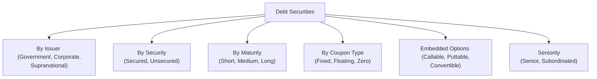

## 9.2 Characteristics of Debt Securities

When I was just starting out in the world of finance, I remember being a little mystified by bonds—why were certain bonds considered safer, and why did some pay higher coupons than others? Someone once told me: “Bonds are basically loans from you to governments or companies. But not all loans are created equal.” That stuck with me. And it’s really a fantastic way to open up our discussion here on the unique features or characteristics that shape the world of debt securities.

Below, we’re going to explore the building blocks of debt securities so you can recognize when a particular bond is a good fit for a client’s portfolio—or, sometimes, when it’s not. We’ll dive into issuers, credit ratings, coupon types, maturity terms, security or collateral, embedded features like calls and puts, convertibility, and the hierarchy known as seniority. Understanding these bits can help you decide which bond aligns best with a client’s objectives and risk tolerance.

Remember: While we’ll touch on risk, yield, and regulatory references here, the overall strategy behind bond selection flows from what you learned in earlier chapters—particularly those on risk profiles (Chapter 2) and asset allocation (Chapter 3). So, let’s look under the hood and see what makes a bond tick.

---

### Understanding the Issuer

One of the first questions to ask about any bond is: who’s issuing it? The issuer itself—be it a government or a corporation—affects both the risk you’re taking on and the rate of return you can expect.

• Government Bonds  
  Federal governments, such as the Canadian government, typically present lower default risk. The reason? They have the power to tax, and historically, major governments (Canada, the U.S., etc.) rarely default because of their fiscal capabilities. Provincial, territorial, and municipal governments also issue bonds, though they will generally command slightly higher yields compared to federal bonds (to compensate for potential incremental credit risk).  
  In Canada, provincial or territorial bonds are sometimes referred to as “provies,” and they’re used to finance infrastructure, healthcare, education—things that matter to everyday Canadians. They typically come in the form of fixed-rate, floating-rate, or inflation-protected structures.

• Supranational Organizations  
  Groups like the World Bank or the African Development Bank also issue bonds. These entities tend to have high credit ratings because they’re supported by multiple national governments. For clients wanting global diversification, supranational bonds can be an interesting avenue, though currency considerations and global interest rate fluctuations come into play.

• Corporate Bonds  
  Corporate bonds are typically higher-yielding than government bonds—this is because they carry more credit risk, and it’s something we’ll expand on shortly. Businesses issue bonds to fund new projects, operations, or acquisitions. Industries range from stable, cash-generating utilities to more adventurous, high-tech firms. Each corporate bond is shaped by the company’s credit quality, capital structure, and growth trajectory.

No matter the type of bond, the identity and credit strength of the issuer is a fundamental starting point in evaluating risk, pricing, and yield expectations. For more details on Canadian regulations around bond issuances, check out the Canadian Securities Administrators (CSA) resources, particularly National Instruments such as NI 41-101 (for prospectus requirements) or NI 44-101 (short form prospectus distributions). Issuers listing their securities in Canada must deposit essential financial statements and disclosure documents onto SEDAR+ (System for Electronic Document Analysis and Retrieval), which you can access here:  
→ [SEDAR.com](https://www.sedar.com/)

---

### Credit Rating: Defining the Bond’s Quality

If the issuer’s financial health is the heart, then the credit rating is the heart monitor. That rating tells you just how likely it is that an issuer will meet its payment obligations. In Canada, DBRS Morningstar is widely recognized, though S&P Global Ratings and Moody’s are global staples.

Credit ratings break down into categories:  
• Investment-Grade Bonds: Typically those rated BBB- (or equivalent) or higher. They offer lower yields because, presumably, they’re safer from a credit risk perspective.  
• High-Yield (or Non-Investment Grade or “Junk”) Bonds: These fall below the investment-grade threshold. They offer higher yields to compensate for higher default risk.

One day, I remember looking at two corporate bonds that had roughly the same coupon. One was issued by a large, stable utility with an A rating, and the other had a BB rating from a smaller company in a riskier industry. At first, I was confused—why would a riskier company not offer a higher coupon as an incentive? Eventually, I realized the lower-rated bond had other structural features that improved investor protection, which partially offset credit risk and thus kept its coupon in line with the safer bond. So, always keep in mind that coupons, ratings, and additional features intermingle to affect pricing.

Investors and advisors often use rating agency research to gauge default risk. If a rating agency downgrades the issuer, the price of that bond might fall, sometimes quite sharply, reflecting greater default risk. For rating reports on many Canadian corporations, check out:  
→ [DBRS Morningstar](https://www.dbrsmorningstar.com/)

---

### Coupon Type: Cash Flow Options

Bonds typically pay interest, also known as a coupon. But not all coupons are the same.

• Fixed-Rate Coupon  
  With a fixed-rate coupon, you know exactly what you’ll receive each year until maturity. For instance, if a bond has a face value of $1,000 and a 5% annual coupon, it pays $50 each year, typically in semi-annual or annual installments. This stability is excellent for those who want predictable income. However, fixed-rate bonds are more sensitive to changes in market interest rates.

• Floating-Rate Coupon  
  These bonds (often called “floaters”) tie their coupon payments to a reference rate, such as CDOR (the Canadian Dollar Offered Rate) or LIBOR (though LIBOR is being phased out in parts of the world). The coupon is reset at regular intervals—like every quarter—so if benchmark interest rates go up, investors see a higher coupon, which helps reduce interest rate risk.

• Zero-Coupon (Discount) Bonds  
  A zero-coupon bond doesn’t pay a coupon. Instead, it’s typically sold at a discount to its face value, and at maturity, the investor receives the full par amount. For instance, you might buy a $1,000 bond for $800, hold it for 10 years, and then receive $1,000 at maturity. This structure can be beneficial for long-term planning or for those looking to lock in a certain yield without reinvestment risk along the way—though zero-coupon bonds can see volatility if interest rates shift.

Bond coupons reflect both the broader market’s interest rate environment and the incremental compensation for the bond’s risk profile. Some clients may prefer a stable, predictable coupon, while others might like floaters that keep pace with rates. And of course, in certain specialized strategies (like for holistic tax planning or risk management), zero-coupon bonds can be quite handy.

---

### Maturity: Short, Medium, or Long?

Maturity is about how soon the bond comes due. Generally:

• Short-Term (up to 1 year)  
  Often called T-bills if issued by governments, or commercial paper if issued by corporations, these instruments are used for short-term financing. Clients seeking capital preservation, or who anticipate near-term cash needs, might find this segment more attractive.

• Medium-Term (1 to 10 years)  
  This is a broad bucket that includes many standard corporate or government offerings. It’s a sweet spot for investors wanting a balance between yield and moderate interest-rate sensitivity.

• Long-Term (over 10 years)  
  Long bonds—sometimes 30 years or more—are more sensitive to interest rate movements. They can also amplify gains (and losses) if rates shift significantly. Retirement funds, pension plans, and long-horizon investors often use long maturities to match their liabilities or future obligations.

There’s an inherent trade-off when it comes to maturities: A longer maturity typically provides a higher yield, but it also means the bond’s price might fluctuate more if interest rates change. This phenomenon is directly tied to duration, a concept we’ll discuss in more detail in Chapter 11. For now, know that the “pull to par” effect gets stronger as a bond approaches maturity, which can sometimes help mitigate short-term price fluctuations for near-maturity bonds.

---

### Secured vs. Unsecured: Collateral Matters

One typical question I get from new investors is: “Wait, why would I get a lower yield on a bond that’s literally secured by real estate or inventories?” And the short answer is: additional protection lowers risk, which usually lowers yield.

• Secured Bonds  
  Secured bonds are backed by specific collateral—this might be property, equipment, or other real assets. If the issuer defaults, holders of secured bonds have a claim on the assets used as collateral. Because they offer some measure of security, these bonds tend to have lower yields compared to unsecured bonds of the same issuer.

• Unsecured Bonds (Debentures)  
  Unsecured bonds, often called debentures, are backed only by the issuer’s general creditworthiness and promise to pay. This typically translates to higher coupon rates or yields, since these come with a greater risk of default and no direct recourse to designated collateral. Depending on the issuer’s strength, an unsecured bond can still be relatively safe, but it’s a more intangible promise than an actual lien on property.

In the event of an issuer’s bankruptcy, secured bondholders would generally recoup more of their investment than unsecured bondholders. Obviously, that can mean the difference between recouping 90% of your principal or 10%. Clients who want an added layer of protection (and can live with a slightly lower yield) might look at secured bonds. Those chasing higher returns must also be comfortable shouldering more risk with unsecured bonds.

---

### Call and Put Features: Early Redemption Possibilities

Sometimes, you’ll see the words “callable” or “puttable” thrown around when describing bonds. These embedded options give either the issuer or the bondholder the right (but not the obligation) to take action before maturity.

• Callable Bonds  
  A callable bond allows the issuer to redeem (or “call”) the bond before it matures, typically at a premium over par. Why would an issuer do that? If interest rates fall significantly, the issuer might want to refinance at a lower rate. From an investor’s perspective, that can be a bummer since it means your high-yield bond gets taken away early. To compensate you for this risk, callable bonds typically pay higher coupons.

• Puttable Bonds  
  Put features let the investor sell (or “put”) the bond back to the issuer, usually at par value, before maturity. This can be handy if interest rates rise or if the issuer’s credit profile deteriorates. The investor can simply “put” the bond and reinvest in something else less risky or better-yielding. Because it favors the holder, these bonds often pay slightly lower coupons.

The presence or absence of such features impacts the bond’s price sensitivity. A highly callable bond might not appreciate much in price if interest rates drop, because the market expects it’ll just get called away. Conversely, a puttable bond might hold its value better if rates rise, since investors can exit earlier at par.

---

### Convertible Features: The Debt-Equity Hybrid

Convertible bonds can be a lot of fun—or occasionally quite frustrating—depending on your perspective. They offer a fixed coupon, but they also include the option to convert into the issuer’s equity (i.e., stock) at a pre-set conversion price.

Imagine you believe in a company’s long-term growth story but still want downside protection if things go sour. A convertible bond might be the best of both worlds. You get coupon payments, and if the stock soars, you can transform your debt holding into equity to catch that upside. The trade-off is you might accept a lower coupon than a non-convertible bond from the same company because of that conversion privilege.

This is often beneficial for bullish investors who value capital appreciation. At the same time, the bond’s price can be influenced by the underlying share price. If the share price is well below the conversion price, the convertible bond trades more like a regular plain-vanilla bond. If it’s well above, it often trades more like an equity instrument, meaning the bond price might track the share price’s movement.

---

### Seniority: Who Gets Paid First?

In finance, we talk about the “capital structure” as a stack or ladder reflecting the order in which claims are paid if something goes wrong (e.g., if the issuer defaults or goes bankrupt). Senior debt is at the top rung, meaning these creditors get paid before those who hold subordinated debt, which is lower in priority.

• Senior Debt  
  Typically has the highest priority in claims on the issuer’s assets and cash flow. Because creditors have a senior claim, the interest rate on senior debt is usually lower than subordinated debt.

• Subordinated (Junior) Debt  
  Is ranked below senior debt. Because you’re taking more risk that there might be insufficient funds if the issuer fails, subordinated bondholders usually receive a higher interest rate. Notably, many Tier 2 or Tier 3 capital instruments that banks issue are subordinated and carry specialized features.

From a practical standpoint, you can think of seniority in the same way you might think about a household paying bills. Essential bills get paid first (mortgage, utilities, etc.), then everything else. Similarly, senior creditors get first dibs on money if the issuer is in distress. By the time it gets to subordinated debt, there may be less, or even nothing, left. This is crucial insight when analyzing clients’ high-yield or speculative bond allocations.

---

### Putting It All Together: Example Scenario

Let’s say you have a client, Marie, who’s in her mid-40s, with a moderate risk tolerance, looking to diversify her portfolio with some fixed-income holdings. She wants a steady stream of income, but in the back of her mind, she’s also open to a bit of equity upside if interest rates remain stable or if a particular company does well.

• You might first check out a convertible, investment-grade corporate bond with 10 years to maturity—a brand-name issuer rated A by DBRS Morningstar. This offers Marie a reasonable coupon, plus she can switch into shares if the firm’s stock surges.  
• Further, if Marie’s concerned about interest rates spiking over the next few years, a floating-rate note from a stable bank might be interesting, as her coupon would increase alongside the reference rate.  
• Alternatively, if Marie wants a shorter timeline or more certainty, a 2-year, fixed-rate government bond might be recommended to mitigate interest rate exposure.  

Thinking about these features—issuer creditworthiness, rating, coupon structure, maturity, embedded options, and level of security or seniority—prevents the dreaded “one-size-fits-all” approach. That’s precisely the point of the Portfolio Management Process (Chapter 1). You’re personalizing and accommodating different risk-return objectives in alignment with your client’s unique circumstances.

---

### Visualizing Bond Types and Features

Sometimes it helps to visualize these features and how they can overlap. Below is a simple Mermaid diagram showing a hierarchy of debt security features.

From the diagram, you can see that any single bond can sit at some intersection of these attributes. For instance, you might have a **long-term, subordinated, unsecured, callable corporate bond** with a **fixed** coupon, or a **medium-term government bond** that’s **non-callable** but **floating-rate**. Understanding each dimension helps you figure out which combination best suits a client’s needs.

---

### Common Pitfalls and Issues

• Not Considering Call Risk  
  A bond with an invitingly high coupon might be called away if interest rates fall. Clients who rely on steady coupon payments can be disappointed if the bond’s called early and they have to reinvest at lower rates.

• Ignoring Liquidity  
  Some corporate bonds are thinly traded, and while the yield looks good on paper, it might be tough to exit the position without incurring a large bid-ask spread.  

• Overlooking Credit Rating Trends  
  It’s not just the rating that matters but also the direction of rating changes. A bond rated BBB could be on a negative watch and risk downgrading to junk territory, which can have profound impacts on pricing.

• Mismatch Between Maturity and Need  
  Investors sometimes pick a 20-year bond for an important event that’s 5 years away—only to realize that a big drop in bond prices may occur if they have to sell early in an unfavorable market.

• Failing to Factor in Taxes  
  Especially in Canada, the interest from bonds is taxed at the investor’s marginal income tax rate, which can impact net returns. Chapter 17 dives deeper into tax considerations.

---

### Best Practices and Strategies

• Diversify Across Issuer Types and Credit Ratings  
  Don’t rely solely on investment-grade government bonds or only on high-yield corporate bonds. Diversifying can mitigate the impact of a single adverse credit event or market shift.

• Align Bond Features with Client Needs  
  If an investor wants minimal interest rate risk, maybe look for short-term floaters. If they want steady, predictable income, pick a longer-term, high-grade fixed-rate bond. If they’re more opportunistic, consider convertibles.

• Monitor Periodically and Rebalance  
  Conditions change. What once was a stable A-rated bond might slip if the issuer overextends itself. Or maybe interest rates crater, altering the relative attractiveness of your fixed-income holdings.

• Leverage Reputable Resources  
  The Canadian Investment Regulatory Organization (CIRO) oversees investment dealers and helps maintain market integrity. Keep tabs on any regulatory updates at [CIRO.ca](https://www.ciro.ca). For historical references, note that IIROC and the MFDA were predecessor SROs that amalgamated into CIRO in 2023. Bear in mind that the Canadian Investor Protection Fund (CIPF) is now the country’s single investor protection fund, safeguarding clients in case of a member firm’s insolvency.

---

### Further Resources and References

• **CSA’s National Instruments (NI 41-101 and NI 44-101)**  
  These provide detailed guidelines for issuers, disclosures, and offering documents.

• **SEDAR+**  
  Access financial statements and continuous disclosure documents for Canadian-listed issuers:  
  → [sedar.com](https://www.sedar.com/)

• **DBRS Morningstar**  
  Offers accessible rating reports, commentaries, and outlooks.  
  → [dbrsmorningstar.com](https://www.dbrsmorningstar.com/)

• **Canadian Securities Course**  
  An excellent certification track and resource that includes comprehensive materials on debt securities, fixed-income calculations, and risk management strategies.

• **Open-Source Financial Tools**  
  If you’re looking to run some yield and duration calculations, Python-based libraries like `Pandas` or `NumPy` might be useful. Many free online calculators are also available to future-proof your analysis, but do ensure their methodology aligns with standard industry practice.

---

### Conclusion

Debt securities have so many cool facets—coupons that can be fixed, floating, or zero; maturities that span from months to decades; collateral (or lack thereof); embedded call, put, or conversion features; and different levels of seniority. My own journey with bonds started out with confusion, but with time and lots of reading, I saw how each bond is essentially an agreement with unique risk and return characteristics.

For advisors and investors alike, picking the right debt instrument can bring stable income, diversification from equity markets, and potential capital gains if the market turns favorably. Yet it’s crucial to understand each piece before you jump in. In the chapters ahead, we’ll examine how to analyze bonds (price, yield, term structure) and how to manage price volatility (like using duration and convexity). But for now, hopefully the building blocks outlined here provide a solid roadmap for your bond adventures.

---

## Test Your Knowledge: Characteristics of Debt Securities Quiz



### Which of the following issuers typically presents the lowest credit risk for bondholders?

- [ ] A high-tech startup corporation
- [x] The federal government
- [ ] A mid-level supranational organization
- [ ] A newly founded real estate investment trust

> **Explanation:** Federal governments generally carry lower default risk due to their ability to raise taxes and print currency.

### In bond terminology, what does “credit rating” primarily measure?

- [ ] Liquidity of the bond
- [x] Probability of the issuer defaulting
- [ ] The bond’s potential for capital gains
- [ ] Investment timeframe

> **Explanation:** Credit ratings primarily assess the issuer’s creditworthiness—i.e., its likelihood of honoring interest and principal payments.

### Which bond feature allows the issuer to repay the principal before maturity?

- [x] Call feature
- [ ] Put feature
- [ ] Convertible feature
- [ ] Seniority clause

> **Explanation:** A call feature gives the issuer the right to redeem a bond early, often if interest rates fall and they can refinance more cheaply.

### What best characterizes a zero-coupon bond?

- [x] It is issued at a discount and pays no interim coupon.
- [ ] It has a fixed coupon paid annually.
- [ ] It has a coupon that varies with interest rates.
- [ ] It can be converted into common equity.

> **Explanation:** Zero-coupon bonds don't pay periodic interest; instead, the investor buys at a discount and redeems at par value upon maturity.

### What is the main advantage of a puttable bond for the investor?

- [x] The investor can sell the bond back to the issuer if conditions worsen.
- [ ] The investor can convert it into shares.
- [x] The investor can reinvest elsewhere if rates rise significantly.
- [ ] The issuer can call the bond at a premium.

> **Explanation:** A puttable bond benefits the investor by allowing them to exit early, typically at par, which is helpful if rates go up or the issuer's outlook deteriorates.

### Why do subordinated bonds usually offer higher yields than senior debt?

- [x] They carry higher credit risk due to lower payment priority.
- [ ] Their coupons are always zero.
- [ ] They are more actively traded in secondary markets.
- [ ] They are callable at any time.

> **Explanation:** Subordinated debt ranks below senior debt in bankruptcy proceedings, posing a higher default risk and thus requiring higher yields.

### Which of the following statements about convertible bonds is correct?

- [x] They offer a lower coupon but potential upside via conversion into shares.
- [ ] They are only issued by government entities.
- [x] They can be seen as a hybrid investment combining debt and equity features.
- [ ] They typically have extremely high fixed coupons with no option to convert.

> **Explanation:** Convertible bonds can be converted into equity at a set conversion price. Because of this added equity “sweetener,” they tend to have a lower coupon relative to similar non-convertible bonds.

### If an issuer defaults, who has the first claim on assets?

- [x] Holders of senior secured debt
- [ ] Holders of subordinated bonds
- [ ] Common shareholders
- [ ] Convertible bondholders

> **Explanation:** Senior secured debt typically stands first in line, thanks to its collateral backing and higher priority in the capital structure.

### Which of the following conditions generally leads to a floating-rate bond having increased interest payments for investors?

- [x] Rising benchmark interest rates
- [ ] Declining bond prices
- [ ] A high credit rating
- [ ] A call feature being triggered

> **Explanation:** Floating-rate bonds reset their coupons based on reference rates, so if those benchmark rates rise, so do the coupons.

### A bond that is both callable by the issuer and puttable by the investor allows:

- [x] The issuer to redeem it early and the investor to sell it back.
- [ ] Only the investor to choose an early redemption date.
- [ ] Only the issuer to decide on maturity date changes.
- [ ] No flexibility regarding maturity.

> **Explanation:** A bond can include both call and put features, giving the issuer the option to redeem early and the investor the option to sell early, respectively.


