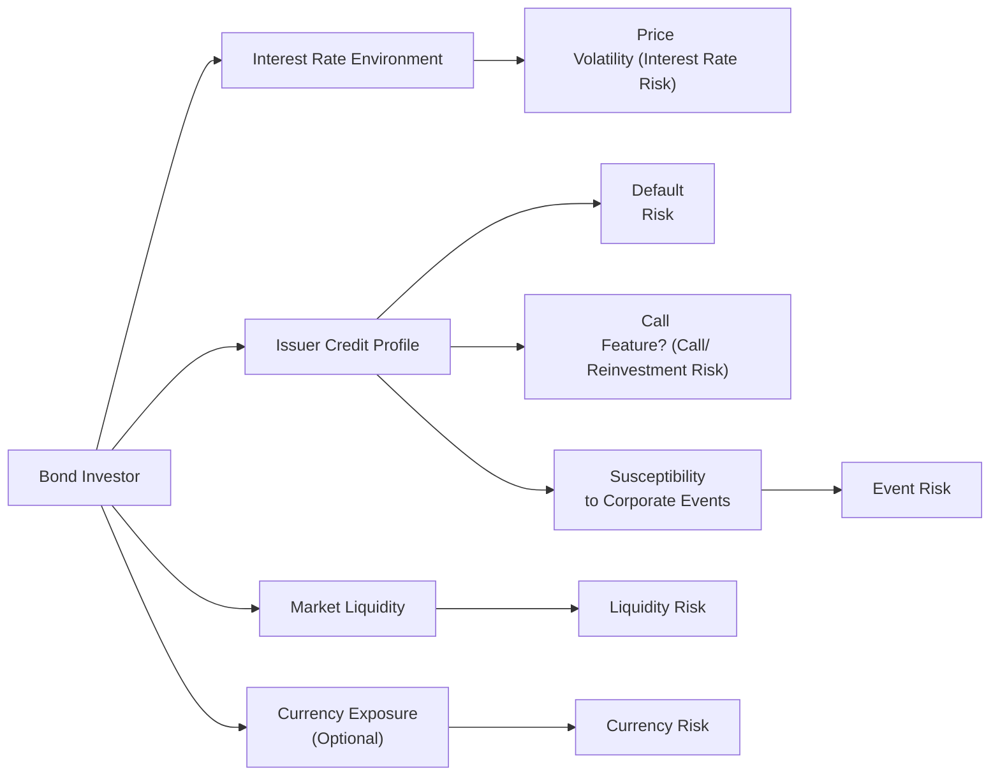

## 9.3 Risk Factors of Debt Securities

Imagine you're sitting down with a good friend who just asked, “Hey, can I really lose money if I invest in bonds?” And your immediate reaction might be—“Well, yeah, you can.” You might add that, typically, bonds are considered safer than a lot of equities, but there are still plenty of ways one can run into trouble. Although debt securities often get a reputation as the “safe” portion of a portfolio, it’s important to understand they do carry a wide variety of risks. Sometimes, if you ignore those risks, it can feel like going to a carnival thinking you’ll avoid all the rollercoasters—only to somehow end up right in the middle of a twisting, looping ride.

The main risk factors associated with debt securities are interest rate risk, credit or default risk, reinvestment risk, call risk, inflation risk, liquidity risk, currency risk, and event risk. Let’s break them all down so you fully grasp how they can affect your portfolio. Along the way, we’ll weave in some personal experiences, case studies, and even a simple diagram to help put a bow on it all.

---
  
### Understanding the “Perceived Safety” of Debt Securities

Debt securities (often called bonds, debentures, or notes) are essentially IOUs from the issuer—be it a corporation, a government, or a municipality—to investors. The issuer guarantees payment of interest (coupons) and eventual repayment of principal at maturity. Unlike most equities, bonds typically have a stated interest or coupon rate, so you can usually anticipate the cash flows you’ll receive. 

So yes, they can seem more predictable than equities, which is why they tend to be considered less volatile. But these apparently foreseeable coupon streams and principal redemptions are far from certain. Let’s walk through each risk to see why.

---

### Interest Rate Risk

When we talk about interest rate risk, we mean the sensitivity of a bond’s price to changes in market interest rates. Picture this scenario:

• You purchased a bond with a 3% coupon when prevailing market rates were around 3%.  
• A year later, market rates jump to 5%. The new bonds that come on the market now offer 5% coupons. 

Well, if you ever dreamed of selling that 3% bond, you can imagine how potential buyers will think: “Why should I pay top dollar for a bond that only yields 3% when I can get 5% elsewhere?” Consequently, your older 3% bond’s market price drops.

Conversely, if rates go down, your existing bond becomes more attractive to potential buyers, and its price goes up. This inverse relationship between bond prices and interest rates is arguably the most well-known bond risk. But in real life, it can be quite surprising if an investor watches their “safe” bond drop in value just because the Bank of Canada changes its overnight rate target.

For example, I once met an investor who held a large chunk of long-term government bonds in a Registered Retirement Savings Plan (RRSP). Interest rates rose unexpectedly, and the bond portfolio took a notable hit. Suddenly, the portion of their portfolio labeled “safe” wasn’t looking so safe. While the investor still expected to receive the promised coupon and principal at maturity, the near-term price fluctuations caused some restless nights!

Key ways to manage interest rate risk include:
• Shortening the bond’s maturity (or duration).  
• Considering floating-rate notes, also known as Variable Rate Notes (VRNs).  
• Matching bond durations to the time horizon of the investor’s needs.

---

### Credit Risk (Default Risk)

Credit risk, sometimes referred to as default risk, centers on the possibility that the issuer will fail to make timely interest payments or repay the principal. This risk is particularly relevant when dealing with corporate issuers, especially those with weaker balance sheets or uncertain revenue sources. 

In June 2020, for instance, a highly leveraged company in the energy sector faced massive cash flow problems when oil prices declined sharply. The firm’s bond prices fell because investors worried about its ability to stay afloat. Sure enough, a few months later, the company missed coupon payments and found itself negotiating with creditors. Some bondholders faced significant losses.

Credit rating agencies, such as DBRS Morningstar (in Canada), S&P Global, Moody’s, or Fitch Ratings, are in the business of evaluating and rating issuers based on their perceived creditworthiness. While these ratings give a helpful initial compass of the issuer’s reliability, they aren’t foolproof. Always remember that credit ratings can be—and sometimes are—downgraded on short notice when an issuer’s financial health deteriorates.

Investors seeking higher yields often turn to lower-rated, higher-yield (“junk”) bonds, but keep in mind: that higher yield usually compensates for the greater default risk. Like deciding whether you want to skip the line for that next rollercoaster by paying more for a “fast pass,” but you might still find the ride a bit hair-raising.

---

### Reinvestment Risk

Here’s a subtle one: Reinvestment risk arises when a bond pays out coupon or principal at a time when interest rates happen to be lower than they were when you started. Let’s say you have a 10-year, 5% coupon bond, and by year five, it’s called or it matures early for some reason. You still want to keep your money in the bond market—but if the current going rate for comparable bonds has dropped to 3%, you’ll be stuck reinvesting at that lower rate.

Common situations leading to reinvestment risk:
• Callable bonds being redeemed early.  
• Maturing bonds when rates are drastically lower than when the investment began.

You’ll see this risk especially in a declining rate environment. It’s frustrating because your once-pleasant 5% coupon is gone, and now new bonds are offering smaller coupons. This scenario is more common with issuers that can “call” their bonds if they spot a chance to refinance at cheaper rates.

---

### Call Risk

So, speaking of callable bonds, let’s talk about call risk. A callable bond allows issuers to redeem the bond before it reaches maturity, typically at a predefined call price. Issuers take advantage of this right if rates have dropped, so they can refinance their debt with cheaper coupons. 

To see it in action: 
• An issuer sold callable bonds with an 8% coupon.  
• A few years later, market interest rates are around 4%.  
• The issuer might call the bond, pay back bondholders at a set call price (sometimes slightly above par), and then reissue new bonds at 4%, slashing its interest costs in half.

Investors who expected to keep receiving 8% coupons until maturity might see their relatively high-yielding bond vanish before they planned, forcing reinvestment at these lower rates. 

A bullet bond, by contrast, has no call feature, so the issuer cannot redeem it early. Investors seeking predictability in coupon flow often prefer bullet bonds because they eliminate call risk.

---

### Inflation Risk

Inflation risk, sometimes called purchasing power risk, centers on the potential erosion of real returns. Even if your bond pays a fixed interest rate, if inflation is outpacing that rate, your real return might be negative. For example, if the coupon is 2% per year but inflation is running at 3%, you’re actually losing purchasing power each year.

In practice, longer-maturity bonds tend to be more exposed to inflation risk. Over a 20- or 30-year period, a lot can happen to the economy’s price levels. When inflation spikes, bond markets tend to demand higher yields, pushing bond prices down.

Some governments offer inflation-indexed bonds to mitigate this risk. In the United States, they’re known as Treasury Inflation-Protected Securities (TIPS). In Canada, we have Real Return Bonds (RRBs). These instruments adjust their principal based on inflation readings, helping investors preserve purchasing power. So if you’re feeling uneasy about inflation risk, TIPS or RRBs can be an attractive option, albeit with their own complexities.

---

### Liquidity Risk

While major government bonds (like those issued by the Canadian or U.S. government) are usually more liquid, many corporate or municipal bond issues can have limited trading volume. If a bond issue is too small or seldom traded, you might face difficulty selling the bond, especially when you need the cash quickly. Or, even if you manage to find a buyer, you might have to offer a sizable discount to entice them.

For example, a friend of mine once invested in a municipal bond from a small county. The yield was decent, but when they wanted to liquidate that position for a personal emergency, hardly any buyers lined up. They ended up selling at an unexpectedly steep discount. That’s liquidity risk in a nutshell: not being able to easily convert an asset to cash at—or near—its fair market value.

Managing liquidity risk often involves balancing the bond portfolio: mixing highly tradable government or large corporate issues with some higher-yield, less liquid bonds, depending on risk appetite. Meanwhile, professional portfolio managers keep track of “bid-ask spreads” as an indicator of liquidity. In general, wider spreads mean lower liquidity and, hence, higher liquidity risk.

---

### Currency Risk

Investing in bonds denominated in a currency different from your own can introduce exchange-rate fluctuations. If you’re a Canadian investor buying U.S. dollar bonds, for example, an unfavorable shift in the CAD/USD exchange rate can erode your returns (or boost them, if you’re lucky and the currency swings your way).

Broadly, currency risk means you’re juggling two sets of factors: the bond issuer’s creditworthiness, interest rate environment, and the macroeconomic situation of the currency’s home country. A notable event was the strong surge of the U.S. dollar in certain periods, which made it expensive for foreign bondholders who needed to convert to local currency, or vice versa.

Some investors use currency-hedged bond funds to mitigate this risk. But hedging has costs, and it can complicate the overall portfolio structure—so get to know your personal or institutional needs before employing hedges.

---

### Event Risk

Finally, we have event risk, which encompasses big, often unforeseen events that can affect the issuer’s ability to meet its obligations. Examples:
• A sudden merger or acquisition that significantly affects an issuer’s capital structure.  
• Regulatory changes that impose new taxes or fees on the issuer.  
• Natural disasters that damage a company’s manufacturing facilities, limiting its revenue.  

A practical example would be a pharmaceutical company losing a key patent earlier than expected, drastically reducing its revenue prospects and hurting its ability to service debt. Or consider how major global events like pandemics can turn entire industries upside down in a matter of weeks. While you can’t always predict these shocks, you can sometimes see signals in an issuer’s industry or business model that highlight vulnerability.

---

### Visual Overview of Bond Risk Factors

Below is a simple Mermaid diagram to illustrate how these risk factors interrelate in the broader bond ecosystem:

• As you can see, the “Bond Investor” sits in the middle, exposed to interactions with market interest rates, the issuer’s credit profile, liquidity conditions, and (where relevant) currency exposures.  
• Changing interest rate environments lead to price volatility.  
• The issuer’s credit profile feeds into default risk and call features.  
• Event risk can emerge from unexpected corporate or regulatory developments.

---

### Glossary

• **Default**: Failure of the issuer to meet terms of the bond’s indenture, such as missing an interest or principal payment.  
• **Bond Indenture**: The legal contract describing the bond’s features, covenants, rights, and obligations of both issuer and investors.  
• **VRN (Variable Rate Note)**: A bond with a floating coupon rate that adjusts periodically based on a benchmark interest rate.  
• **TIPS (Treasury Inflation-Protected Securities)**: U.S. government bonds that adjust principal for inflation. The Canadian equivalent is the Real Return Bond (RRB).  
• **Callable Bond**: A bond giving the issuer the right to redeem it before maturity.  
• **Bullet Bond**: A non-callable bond that repays principal only at maturity, eliminating call risk.

---

### Practical Examples and Case Study

Let’s bring this to life:

1) Corporate Bond with Heightened Credit Risk:  
   A Canadian manufacturing firm issues a five-year bond at a 6% coupon. Initially, it seems healthy, but after two years, new trade tariffs are imposed. The firm’s main export market shrinks, leading to smaller revenues. The credit rating agencies downgrade the bond from BBB to BB, revealing higher default risk. The bond’s price tumbles, liquidity on the secondary market evaporates, and investors are stuck with an asset that’s hard to sell without taking a major price cut.

2) Government Bond Hit by Interest Rate Increases:  
   An investor holds a 10-year Government of Canada bond purchased at a 2% yield. Over the following year, the Bank of Canada aggressively hikes rates to counter rising inflation. The bond’s price drops because newly issued bonds come with higher coupons. While the investor can hold to maturity and eventually recover principal plus coupons, a mark-to-market approach shows short-term losses in the portfolio.

3) Callable Utility Bond Reinvestment Risk:  
   A provincial utility company with a robust credit rating issues a callable 4.5% bond with 10 years to maturity. Rates decline sharply three years in. The issuer calls the bond at a small premium, so investors end up with their principal returned earlier than expected, now forced to invest in a 2.5% environment.

---

### Using Tools and Best Practices to Evaluate Bond Risks

• **Duration and Convexity**: These metrics help gauge interest rate sensitivity. If you’re worried about rising rates, you might prefer shorter-duration bonds or floating-rate notes.  
• **Credit Rating Analysis**: Examine ratings from DBRS Morningstar, S&P Global, Moody’s, and Fitch, but remember: do your own credit analysis too.  
• **Bond Covenants**: Check if the indenture has provisions limiting additional debt or restricting asset sales. Such covenants often provide extra protection for bondholders.  
• **Call Features**: Evaluate if the call premium adequately offsets the risk of early redemption.  
• **Inflation-Protected Instruments**: Consider RRBs (in Canada) or TIPS (in the U.S.) if you’re worried about inflation.  
• **Liquidity Check**: Analyze the bond’s EMMA (Electronic Municipal Market Access) for the U.S. or SEDAR/CIRO bulletins in Canada to see if the bond trades actively. Remember that historically there were separate SROs (the MFDA and IIROC), but they have since been amalgamated into the Canadian Investment Regulatory Organization (CIRO). CIRO’s website (https://www.ciro.ca) offers bulletins and notices regarding trading, credit analysis protocols, and additional details on market integrity.  
• **Currency Hedging**: If you’re investing in foreign-currency bonds, consider whether you need a currency hedge to reduce volatility due to exchange-rate movements.  

---

### Personal Perspectives on Managing Bond Risk

In my own experience, it’s always worth the time to look under the hood of any bond you’re considering. There was a time I thought: “It’s just a bond—how complicated can it be?” Then I realized that each factor—credit rating, coupon, if it’s callable, if it’s linked to inflation—can significantly impact my returns. Over time, I learned to appreciate the difference between simply trusting a credit rating and doing my own deep dive into the company’s financial health or the government’s fiscal situation. Assessing whether the bond aligns with my investment horizon and risk tolerance is key too. 

When advising others, I often suggest starting with safer short-term government bonds or well-rated corporate bonds if they’re new to the bond market, then once comfortable with the fundamentals, exploring more nuanced instruments like floating-rate notes or TIPS/RRBs.

---

### References and Additional Resources

• **CIRO (Canadian Investment Regulatory Organization)**: https://www.ciro.ca. Browse bulletins, compliance notices, and market integrity frameworks that help shape credit analysis best practices.  
• **Bank of Canada**: https://www.bankofcanada.ca. Stay updated on economic indicators, rate announcements, and yield curve trends—vital for managing interest rate risk.  
• **CFA Institute Curriculum**: Particularly the “Fixed Income Analysis” sections in the CFA Program. Provides a thorough conceptual framework on valuation, yield curve dynamics, and risk management strategies.  
• **Investopedia**: https://www.investopedia.com. Excellent open-source resource covering bond basics and a variety of risk factors, from reinvestment risk to currency risk.  

Whether you’re brand new to the bond scene or a seasoned professional, continuously learning about risk factors keeps you ahead of the curve. It’s a never-ending journey of education, re-evaluation, and adaptation to market conditions.

---

## Test Your Knowledge of Risk Factors in Debt Securities



### Which of the following best describes interest rate risk?

- [x] Bond prices generally move inversely to changes in interest rates.
- [ ] Bond prices tend to rise steadily irrespective of interest rate changes.
- [ ] Interest rate risk only applies to callable bonds.
- [ ] Interest rate risk is always trivial for government bonds.

> **Explanation:** Interest rate risk refers to the inverse relationship between interest rates and bond prices. When market rates rise, existing bond prices fall, and vice versa.

### What is the primary concern when investing in lower-rated, high-yield (junk) bonds?

- [ ] Reinvestment risk.
- [x] Credit (default) risk.
- [ ] Currency risk.
- [ ] Liquidity risk does not apply to junk bonds.

> **Explanation:** Lower-rated bonds carry greater uncertainty about the issuer’s ability to fulfill coupon and principal payments. Hence, credit or default risk is the key concern.

### What happens if a bond is called when interest rates are lower than they were at issuance?

- [x] Investors may have to reinvest their principal at lower prevailing rates, facing reinvestment risk.
- [ ] Investors benefit from a windfall of higher coupons.
- [ ] The issuer has defaulted.
- [ ] No changes occur, as investors retain the original coupon.

> **Explanation:** When a bond is called in a falling rate environment, investors receive their principal earlier but must reinvest at lower interest rates, which is classic reinvestment risk.

### Which type of bond feature specifically increases the likelihood the issuer will redeem the bond early?

- [ ] Bullet bond.
- [ ] Real Return Bond (RRB).
- [x] Call feature.
- [ ] Convertible feature.

> **Explanation:** Callable bonds allow the issuer to repay the bond before maturity, often motivated by lower interest rates.

### How does inflation risk affect the real return on a fixed-rate bond?

- [x] It erodes the bond’s purchasing power.
- [ ] It increases the liquidation value.
- [x] It reduces the actual (real) yield below the nominal coupon rate.
- [ ] It has no effect on bond returns whatsoever.

> **Explanation:** High inflation diminishes the real value of both future coupon payments and principal repayment, so the real return might be much lower than the nominal coupon.

### Consider a bond in a thinly traded market. Which risk is most prevalent for investors seeking to sell?

- [x] Liquidity risk.
- [ ] Interest rate risk.
- [ ] Call risk.
- [ ] Reinvestment risk.

> **Explanation:** Low trading volume can cause wide bid-ask spreads and make it difficult to sell the bond quickly without accepting a significant discount, meaning liquidity risk is paramount.

### An investor in Canada purchases a U.S. dollar-denominated corporate bond. Which additional risk emerges due to currency fluctuation?

- [x] Currency risk.
- [ ] Default risk.
- [x] The bond is more prone to credit rating downgrades.
- [ ] Considerably less liquidity risk.

> **Explanation:** Investing in a foreign currency bond typically adds currency risk due to exchange rate movements. Credit rating downgrades are a separate issue, not specifically triggered by currency choice.

### What kind of events are typically covered under event risk?

- [ ] Routine coupon payments by the issuer.
- [ ] Annual audits by regulators.
- [x] Mergers, acquisitions, or unexpected regulatory changes that affect the issuer’s cash flow.
- [ ] Moderate shifts in the broader market interest rates.

> **Explanation:** Event risk encompasses extraordinary, unexpected occurrences—like mergers or new regulations—that can directly impact an issuer’s ability to meet debt obligations.

### Which bond type helps protect investors specifically against inflation?

- [x] Real Return Bonds (RRBs) in Canada or TIPS in the U.S.
- [ ] Bullet bonds with fixed coupons.
- [ ] Callable corporate bonds.
- [ ] Convertible bonds.

> **Explanation:** RRBs and U.S. TIPS have principal amounts indexed to inflation, helping preserve purchasing power over time.

### True or False: The Canadian Investment Regulatory Organization (CIRO) replaced both IIROC and MFDA as the single national self-regulatory body.

- [x] True
- [ ] False

> **Explanation:** Effective June 1, 2023, CIRO is indeed the single national SRO overseeing investment dealers, mutual fund dealers, and market integrity on debt and equity marketplaces in Canada.


