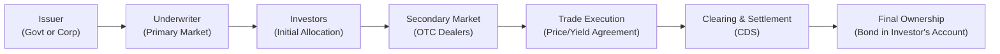

## 9.4 Mechanics of Debt Market Trading

Picture this for a moment: You’re sitting in your office late on a Friday, staring at a screen full of bond quotes. You might be tracking a 10-year Government of Canada issue or a corporate bond from a major energy company. Maybe you’re working for a large asset management firm, or perhaps you’re just curious about how this whole thing works. Either way, the mechanics behind debt market trading can feel like navigating a maze—there are auctions, syndicates, underwriters, settlement processes, and all kinds of acronyms flying around. Well, don’t worry. In this section, we’ll break down the nuts and bolts of how bonds move from issuer to investor, how they’re priced, and how trades close behind the scenes in the Canadian context (with a few global references thrown in).

Though some of these ideas might sound technical at first, I promise they’ll make more sense once we walk through them step by step. Let’s get started.

### Setting the Stage

Debt securities create a special kind of relationship—an issuer (like a government or a corporation) borrows money, and the investor (maybe you or me) essentially becomes the lender. In return, the issuer pays interest and eventually returns the principal. When it comes to trading these securities, the journey begins in the primary market and continues in the secondary market.

Why should we care about the underlying mechanics of trading? For one thing, the returns on these instruments often hinge on factors like auction results, liquidity in the secondary market, and the precise settlement arrangements. Additionally, in Canada, the entire process is shaped by a regulatory framework that ensures transparency, fairness, and efficiency—at least, that’s the goal.

### The Primary Market

Let’s begin at the beginning: the primary market. This is where newly created bonds first get sold.

• Government Bond Issuance (Bank of Canada Auctions)  
  When the Canadian government needs to raise money, it can issue bonds through auctions facilitated by the Bank of Canada. Market participants (like primary dealers—often major banks) submit bids that detail how much they’re willing to buy and at what yield. The Bank of Canada sets a cut-off yield that clears the market. Sometimes, the highest yield accepted forms the boundaries for what’s considered an acceptable bid.  
  What’s neat here is that the result can influence broader bond pricing across the Canadian yield curve. If investors demand higher yields (or equivalently offer lower prices) in these auctions, it can signal fears about inflation, government debt levels, or other macro moves.

• Corporate Bond Issuance (Syndicated Offerings and Private Placements)  
  Corporations tap the market by issuing new bonds. They might do this via a “syndicated offering,” where a group of investment banks (sometimes called underwriters) come together to distribute this debt to investors. Alternatively, they could opt for a private placement. That’s when the bond is sold directly to a small group of sophisticated investors, often large institutions, without going through a full-blown public offering and the associated regulatory disclosures.  
  If you’re a corporate issuer, the advantage of a syndicated offering is that you leverage multiple underwriters who can market your debt to many potential investors. With private placements, you typically get fewer regulatory hurdles and can customize the terms more easily, but it might be harder to resell later because the investor base is smaller.

• Prospectus Requirements Under CSA Regulations (e.g., NI 41-101)  
  When corporations recruit investors via a public bond issuance, they often need to file a prospectus. This prospectus offers details on the nature of the business, risks, and how they plan to repay the debt. In Canada, the Canadian Securities Administrators (CSA) sets out the regulations (for example, under National Instrument 41-101) that govern this entire process.  
  The idea is to make sure potential investors have enough information to make an informed decision. If a company does an exempt offering (private placement), it can skip some of these steps, but only if it meets certain conditions outlined by the CSA.

### The Secondary Market: The Heart of Debt Trading

Eventually, those newly issued bonds make their way into what we call the secondary market. That’s where existing debt securities are bought and sold among investors. If you imagine the primary market as a “bond birth,” the secondary market is where bonds live out the rest of their life cycle until maturity.

• Over-the-Counter (OTC)  
  The vast majority of bond trading worldwide (including Canada) happens over-the-counter. That means there’s no single centralized exchange—like what you see for stocks on the Toronto Stock Exchange (TSX). Instead, participants (dealers, institutional investors, etc.) trade with each other via phone calls, trading platforms, or direct electronic messaging.  
  Dealers typically post yields or prices at which they’re willing to buy or sell specific bonds. Negotiation often happens in real time.

• Institutional Dominance  
  The bond market is huge—think about how many governments and corporations borrow money. Because of the large trade sizes, institutional players (pension funds, insurance companies, asset managers, and banks) dominate this space. Retail investors who want exposure to bond markets typically either go through brokers or invest in bond funds (like a mutual fund or ETF).

### Making Sense of Order Types and Quotes

The mechanics of bond trading can get tricky because bond quotes often revolve around yields, not prices. Let’s break that down:

• Yield vs. Price  
  The higher the yield, the lower the price, and vice versa. Actually, the bond price is the net present value of all future cash flows (coupons plus principal repayment). If yields in the market rise, investors will only buy your existing bond at a lower price so that its yield matches the new, higher rate. That inverse relationship is a cornerstone of fixed-income math, and it’s good to keep in mind.  
  In practice, if someone says a bond is trading at “3.5%,” they might be referencing its yield to maturity. Converting that yield back into a precise dollar price requires calculations, often performed by dealers or on data platforms (Bloomberg, Reuters, etc.).

• Spreads  
  In the Canadian market, you’ll often hear something like “the bond is trading at +150 basis points over the Government of Canada curve.” That means the yield on the corporate bond is 1.50% higher than a comparable government bond with a similar maturity. The difference often reflects the additional credit risk (and other factors) that the issuer carries.  
  If you remember nothing else, remember that a narrower spread tends to mean the market perceives less risk—or is more optimistic—about the issuer. A wider spread might indicate higher perceived risk, or lower liquidity.

• Price Transparency  
  Bond markets are less transparent than stock markets. In an equity market, you can usually see the last trade price on a central exchange. For many bonds, trades get reported with a time delay, often only visible to participants on specific platforms. That said, in Canada, regulatory initiatives have improved transparency, and many brokers now show indicative bond quotes on their websites or on TMX Money.  
  If you’ve ever been frustrated trying to pin down the “exact” price of a bond, you’re not alone. This challenge is why you’ll often see yield-based quotes or a basis-point spread relative to a benchmark. It’s simply how the market communicates, especially for less liquid bonds.

### Settlement and Clearing

So you’ve executed a trade. Now what? That’s where settlement and clearing come in. Think of it like the final handshake that completes the transaction.

• Timeline (T+1, T+2)  
  Government bonds in Canada often settle one business day after the trade date (T+1). Corporate bonds generally settle two business days after the trade date (T+2)—though this can vary, and the industry has trended toward shorter settlement cycles over time.  
  Why does this matter? Well, if you’re trying to match cash flows or allocate resources, you need to know exactly when you’ll receive funds or deliver them. If you’ve just sold tens of millions of dollars’ worth of bonds, that’s not a trivial detail.

• Role of CDS (Canadian Depository for Securities)  
  In Canada, the Canadian Depository for Securities (CDS) is the main entity that facilitates clearing and settlement for bond trades. They ensure that the buyer gets the bonds and the seller gets the cash, verifying that no one is left holding the bag. CDS effectively acts as the central point that matches all the instructions.  
  In a world without CDS or another clearinghouse, each pair of trading counterparties would have to trust the other to deliver. That’d be messy, to say the least.

• Clean Price vs. Dirty Price  
  When you see a bond quote, it typically doesn’t include the accrued interest—the interest that’s built up since the last coupon payment. That’s called the clean price. The dirty price, which is the actual price the buyer pays, includes accrued interest. For instance, if a bond’s clean price is 100.20, but there’s $0.50 of accrued interest, the dirty price is 100.70.  
  It sounds like a small detail until you’re dealing with big amounts or unusual settlement dates. Don’t be surprised if you see both figures used in different contexts.

### Regulatory Oversight

Now that we’ve covered how bonds move around, let’s look at who keeps an eye on it all—especially in Canada.

• CIRO  
  The Canadian Investment Regulatory Organization (CIRO) is Canada’s national self-regulatory body overseeing investment dealers, mutual fund dealers, and market integrity on equity and debt marketplaces. It came into being on January 1, 2023, through the amalgamation of the defunct predecessor Self-Regulatory Organizations (SROs), the Investment Industry Regulatory Organization of Canada (IIROC) and the Mutual Fund Dealers Association of Canada (MFDA).  
  CIRO sets the statutes, by-laws, and rules that members must follow. It helps ensure that dealers behave ethically, provide proper disclosures, and meet suitability requirements for investors.

• CSA (Canadian Securities Administrators)  
  The CSA is an umbrella group of provincial and territorial securities regulators. They set rules for how new bonds get issued (like those prospectus requirements we mentioned for corporate issuers), ensure ongoing disclosure, and aim for a harmonized national framework where possible—even though securities regulation in Canada can sometimes feel a bit decentralized.

• Tying It Together  
  Between CIRO, the CSA, and other regulatory entities, the main objective is to keep markets fair and transparent, protect investors, reduce systemic risk, and keep the entire bond-issuing and trading mechanism stable.  
  If you want the official scoop on fixed income trading practices, check out the rules and bulletins on the CIRO website at [ciro.ca](https://www.ciro.ca/).

### Examples and Real-World Scenarios

I remember the first time I tried to buy a corporate bond; I kept getting quotes in yield form, and I had to politely ask the broker to show me the actual dollar price. They gave me a spread over the Government of Canada bond, and my immediate reaction was, “Uh, okay, so how much money am I paying exactly?” That confusion is pretty common.

Let’s consider an example:

- Suppose an oil and gas company issues a 5-year bond at a coupon of 4.0%. You look it up a few months later, and your broker says it’s trading at a yield to maturity of 4.3%. You might wonder: “Are we talking 99 for the price? 98? 101?”  
- The actual price could be around 98.50 (dirty price) if we factor in accrued interest since the last coupon date. The spread might be something like +150 basis points over the 5-year Government of Canada bond. If the government bond yield for that maturity is 2.8%, add 1.5% to get 4.3%. That’s your yield. But working out the precise price from that yield usually requires formulas or a pricing calculator.  

### Potential Pitfalls and Best Practices

• Pitfall: Confusing Yield and Price  
  It’s easy to see a quote in yield terms and mentally treat it as a price. Resist that temptation. If you need a precise value, ask for the clean and dirty price, or do your own calculation.

• Pitfall: Not Considering liquidity  
  In the corporate bond market, liquidity can dry up fast—especially if you’re dealing with smaller or lower-rated issuers. If you plan on trading frequently, check how active the bond is instead of only focusing on yield. A bond that’s rarely traded might carry a wider bid-ask spread, causing you to potentially lose out when you buy or sell.

• Pitfall: Neglecting Settlement Timelines  
  If you’re short on cash and you assume you’ll receive money from a bond sale right away, good luck. Remember that settlement often happens days after the trade date.

• Best Practice: Monitor Spreads Over Time  
  Keeping an eye on a bond’s spread relative to government bonds is one of the simplest ways to track sentiment around an issuer’s credit risk. Narrowing spreads can be a sign that the market is feeling better about the issuer.

• Best Practice: Stay Informed About Regulatory Changes  
  Regulators frequently update rules to improve transparency or reduce risks. Given that the MFDA and IIROC have unified into CIRO, it’s wise to monitor changes in compliance, oversight, and potential new guidelines on best execution and disclosure.

### Visual Aid: How a Bond Trade Flows

Below is a simple Mermaid diagram that shows the flow of a bond from its issuance in the primary market to trading and settlement in the secondary market.

• A: Government or corporate issuer needs funds and creates new bonds.  
• B: Underwriters and syndicates market the issue.  
• C: Initial allocation to investors occurs (primary market).  
• D: Over time, these bonds trade in the secondary market via OTC dealers.  
• E: Buyers and sellers agree on a yield/price.  
• F: CDS handles clearing and settlement, matching up the cash and bond deliveries.  
• G: Final ownership of the bond rests with the new investor.

### Additional Resources

Below are a few resources if you’d like to explore more:

• CIRO’s official website: [https://www.ciro.ca](https://www.ciro.ca)  
• Bank of Canada auctions and operations for Government of Canada securities: [https://www.bankofcanada.ca/markets/government-securities-auctions/](https://www.bankofcanada.ca/markets/government-securities-auctions/)  
• The Canadian Depository for Securities (CDS) on clearing and settlement: [https://www.cds.ca/](https://www.cds.ca/)  
• Bond quotes and market data on TMX Money: [https://money.tmx.com/en/bond/](https://money.tmx.com/en/bond/)  
• For deeper dives:  
  - “Fixed Income Analysis” (CFA Institute)  
  - “Bond and Money Markets: Strategy, Trading, Analysis” by Moorad Choudhry

### Conclusion

That’s a wrap for the mechanics of debt market trading in Canada. From the initial auction or issuance, through the nuances of OTC trading and yield-based quotes, to the final handshake of settlement, the journey can be intricate. But at its core, the bond market is about connecting issuers who need capital with investors who have it—under terms that, hopefully, benefit both sides.

If you ever find yourself scratching your head over the difference between a clean and dirty price or wondering why a certain bond trades at +150 basis points over the benchmark, rest assured that every investor (no matter how seasoned) has asked those same questions. The main thing is to stay informed, ask for clarity when needed, and keep track of the evolving regulatory context in Canada—where CIRO, the CSA, and the Bank of Canada are all working to maintain an orderly, transparent market.

Learning these mechanics takes practice, so don’t be shy about diving a bit deeper. Let curiosity be your guide—and remember, knowledge is your best friend in the bond market.

## Test Your Knowledge: Mechanics of Debt Market Trading



### Which entity in Canada typically facilitates auctions for Government of Canada bonds?

- [ ] CIRO
- [x] Bank of Canada
- [ ] Canadian Depository for Securities (CDS)
- [ ] Canadian Securities Administrators (CSA)

> **Explanation:** Government of Canada bonds are commonly issued through auctions supervised by the Bank of Canada.

### Which term describes a bond issuance sold directly to a small group of investors, often without a full public prospectus?

- [ ] Syndicated Offering
- [ ] Over-the-Counter (OTC) Trade
- [x] Private Placement
- [ ] Mutual Fund

> **Explanation:** Private placements are sold to a limited group of accredited or institutional investors, bypassing many public-offering regulations.

### In the secondary market, bond trading in Canada most commonly occurs:

- [x] Over-the-counter (OTC) among dealers and institutions
- [ ] Exclusively on a single centralized exchange
- [ ] Via an automated direct lending platform
- [ ] Through only government-approved clearing banks

> **Explanation:** The vast majority of bond trading transacts via OTC channels, rather than central exchanges.

### A bond is quoted at a yield of 3.5%. Which of the following best describes how to find its price?

- [ ] Subtract 3.5% from par value
- [x] Calculate the present value of its future coupon payments and principal using 3.5%
- [ ] Multiply the coupon amount by 3.5
- [ ] Add 3.5% to the face value

> **Explanation:** The bond’s yield to maturity is used as a discount rate in pricing. The correct approach is to discount future cash flows (coupon and principal) back to present value using the yield.

### What is the principal function of the Canadian Depository for Securities (CDS) in the bond market?

- [ ] Setting bond yields
- [ ] Issuing new government bonds
- [x] Clearing and settling trades
- [ ] Overseeing broker-dealer suitability requirements

> **Explanation:** CDS is responsible for settlement and clearing of trades, ensuring accurate transfer of cash and securities between buyer and seller.

### If a bond is traded at a clean price of 101.00 but includes accrued interest of 0.25, what is its dirty price?

- [ ] 100.75
- [ ] 100.25
- [x] 101.25
- [ ] 101.75

> **Explanation:** Dirty price = Clean price + Accrued interest. So, 101.00 + 0.25 = 101.25.

### Which Canadian regulatory body oversees the conduct and market integrity of broker-dealers in the debt marketplace?

- [x] CIRO
- [ ] MFDA (still active)
- [ ] IIROC (still active)
- [ ] The Office of the Superintendent of Financial Institutions (OSFI)

> **Explanation:** CIRO is the current SRO overseeing broker-dealers and market integrity (MFDA and IIROC no longer exist as separate entities).

### In a bond quote expressed as “+150 basis points over the Government of Canada 5-year,” the 150 basis points refers to:

- [ ] The coupon rate of the bond
- [ ] The absolute yield to maturity
- [x] The yield spread above the government bond yield
- [ ] The daily volatility of bond prices

> **Explanation:** Spreads measure the difference in yield relative to a benchmark. “+150 basis points” indicates the bond’s yield is 1.50% higher than the reference government bond yield.

### Which of the following statements accurately describes a syndicated bond offering?

- [ ] A single investor directly purchases the entire bond issue.
- [x] A group of underwriters works together to sell a new bond issuance to investors.
- [ ] The corporate issuer crowdsources funds via an online platform.
- [ ] The bond trades only through a single designated exchange.

> **Explanation:** In a syndicated offering, multiple underwriters jointly market and distribute the newly issued bonds to a broad base of investors.

### The settlement cycle for most Canadian government bond trades is:

- [x] T+1
- [ ] T+4
- [ ] T+3
- [ ] T+5

> **Explanation:** Government of Canada bonds typically settle on the next business day after the trade date (T+1).


