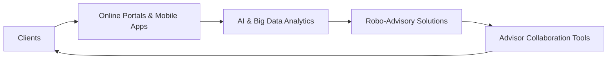
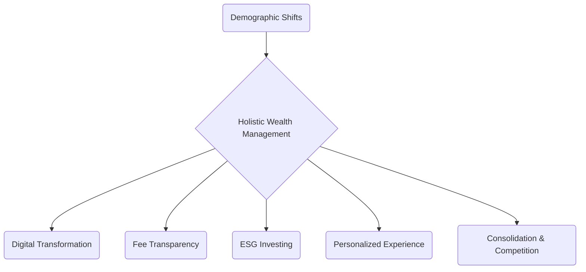

## 1.3 Key Trends Shaping the Future of Wealth Management

The wealth management industry in Canada is undergoing a remarkable transformation, driven by rapidly evolving client expectations, emerging technologies, and shifting societal values. To remain competitive and provide the best possible service to clients, wealth managers must understand and adapt to the following key trends. This section explores each trend in-depth, providing insights, examples, and best practices relevant to Canadian financial advisors and planners.

---

## 1.3.1 Digital Transformation

The adoption of digital technology is reshaping how clients interact with financial institutions. Features such as online portals, integrated mobile apps, AI-driven analytics, and robo-advisors influence every stage of the wealth management process, from initial client discovery to portfolio rebalancing and ongoing advice. 

### Drivers of Digital Transformation

1. ● Advances in AI and Big Data: Large Canadian banks like RBC (Royal Bank of Canada) and TD (Toronto-Dominion Bank) are heavily investing in data analytics platforms and AI-driven solutions. These technologies process massive amounts of information in real-time, providing detailed insights into client behavior and market conditions.  
2. ● Demand for Convenience: Clients increasingly expect seamless digital experiences. Whether scheduling a meeting via a mobile app or approving an electronic trade from their smartphones, convenience is vital for building robust client relationships in the modern era.  
3. ● Cost Efficiency and Scalability: On the advisor side, robo-advisory and automated portfolio rebalancing can reduce operational costs while enabling wealth managers to serve a broader client base.  

### Robo-Advisors in Canada

Robo-advisors have become a key entry point for many investors, typically offering:  
• Automated asset allocation, often based on a risk questionnaire.  
• Lower management fees relative to traditional advisory services.  
• User-friendly platforms that provide real-time portfolio performance metrics.  

Examples of prominent Canadian robo-advisors include Wealthsimple and Nest Wealth. These services cater particularly to young professionals comfortable with technology, though many established financial institutions also integrate robo-advisory components into their broader wealth management platforms.

#### Diagram: Digital Wealth Management Ecosystem

In this ecosystem:
- Clients interact with advisors, support teams, and robo-based solutions via integrated digital channels.
- AI-driven analytics provide insights for both clients and advisors.  
- Collaboration tools help the advisor tailor solutions to the client’s needs.

To explore deeper practical guidance on implementing digital tools in wealth management, Deloitte Canada’s “Financial Services & FinTech” insights (https://www2.deloitte.com/ca/en.html) provide current research and case studies.

---

## 1.3.2 Demographic Shifts

Demographics play a critical role in wealth management strategies. In Canada, two distinct trends are shaping client demands:

1. **Aging Population:**  
   - Baby Boomers are entering retirement, creating a surge in demand for reliable retirement income solutions such as annuities, dividend-paying stocks, and Guaranteed Minimum Withdrawal Benefit (GMWB) products.  
   - Advisors must be prepared to address longevity risk, estate planning, and potential long-term care expenses for aging clients.

2. **Younger Generations and Tech-Savvy Investors:**  
   - Millennials and Gen Z clients seek seamless digital experiences, impact investing opportunities, and flexible, mobile-first solutions.  
   - This segment may be less tolerant of high fees and more likely to gravitate toward ethical and socially responsible investments.

#### Canadian Case Example  
An Ontario-based wealth management firm discovered that over 60% of its newly onboarded clients in 2022 cited “mobile-first convenience” as a deciding factor when selecting an advisory service. This shift underscores the need for wealth managers to keep pace with new technology and communication approaches.

---

## 1.3.3 Responsible Investing (ESG)

Investors increasingly consider Environmental, Social, and Governance (ESG) factors when selecting investments, reflecting growing awareness of social impact, climate change, and corporate governance. Advisors in Canada are finding that clients—especially younger generations—prioritize more than just financial returns.  

### ESG in Practice

- **Environmental Factors:** Carbon footprint, waste management, resource use, and energy efficiency.  
- **Social Factors:** Labour standards, human rights, diversity and inclusion policies, community relations.  
- **Governance Factors:** Board independence, executive compensation, shareholder rights, and business ethics.

#### ESG Reporting Frameworks  
Various organizations, including the Responsible Investment Association (RIA) in Canada (https://www.riacanada.ca/), publish guidelines and tools that help investors analyze a company’s ESG profile. Familiarity with such frameworks allows advisors to:

• Demonstrate informed guidance on ESG products.  
• Align client portfolios with personal values.  
• Evaluate the sustainability and ethical impact of potential investments.

#### Step-by-Step ESG Evaluation Process  

1. **Identify Client Values and Goals:** Determine which ESG criteria best reflect client priorities.  
2. **Use ESG Rating Tools:** Many rating agencies (e.g., MSCI, Sustainalytics) provide ESG scores.  
3. **Integrate ESG Criteria in Portfolio Construction:** Balance ESG preferences with diversification, risk tolerance, and financial goals.  
4. **Monitor Ongoing Performance:** Regularly assess ESG ratings and news for potential controversies or corporate changes that may affect a portfolio.  

Advisors who excel in ESG-centric guidance can differentiate themselves in a competitive marketplace while helping clients align investments with their core values.

---

## 1.3.4 Fee Transparency

Clients in Canada increasingly demand transparency regarding how advisors are compensated, whether through commissions, fee-based arrangements, or a combination of both. This demand for clarity is also reflected in Canadian regulatory expectations, including CIRO’s ongoing proposals regarding proficiency and advancement toward an “assessment-centric” model (https://www.ciro.ca).

### Why Fee Transparency Matters

- **Trust Building:** Clients appreciate clear, upfront disclosure of costs. Transparent communication fosters long-term trust.  
- **Aligning Interests:** By clarifying fee structures, advisors reinforce that their recommendations are in the client’s best interest.  
- **Comparability:** As new entrants (e.g., robo-advisors) may provide lower-cost models, fee transparency helps clients evaluate the value-add of a service.  

Common Fee Structures in Canada:  

1. **Assets Under Management (AUM) Fee:** A percentage of the client’s portfolio value is charged each year.  
2. **Flat Retainer Fee:** A fixed amount is charged, usually on an annual or quarterly basis.  
3. **Hourly Fee:** Advisors charge for the total hours spent on a client’s financial plan.  
4. **Commission-Based:** The advisor receives commissions for product sales, which can lead to conflicts of interest if not managed and disclosed properly.

---

## 1.3.5 Personalized Client Experience

The nature of advice is changing. Clients now expect wealth managers to have a holistic understanding of their situation. Traditional product-centric approaches are giving way to life-centric financial advisory that takes into account budget habits, family dynamics, lifestyle needs, and long-term ambitions.

### Practical Ways to Personalize Service

1. **Holistic Data Gathering:** Go beyond just investment goals. Incorporate family details, career aspirations, health considerations, and real estate plans.  
2. **Customized Reporting and Goal-Setting:** Some advisors create custom dashboards with metrics that track if a client can purchase a vacation property, fund a child’s education, or retire early.  
3. **Ongoing Reviews and Adjustments:** Regular check-ins, possibly powered by collaboration tools, ensure that asset allocation and strategies remain aligned with evolving client circumstances.

Personalization fosters deep relationships, boosts client satisfaction, and strengthens retention. 

---

## 1.3.6 Consolidation and Competition

The Canadian financial landscape is characterized by a handful of major institutions that offer comprehensive services spanning banking, insurance, and wealth management, as well as specialized boutique firms. Mergers and acquisitions continue to shape the competitive environment:

- **Larger Institutions:** Provide one-stop-shop convenience, leveraging advanced analytics and robust technology infrastructures.  
- **Boutique Firms:** Carve out niches for specialized advisory services, such as impact investing, health care professionals, or ultra-high-net-worth family offices models.

This duality can benefit clients, who gain more flexible service options, but it also demands that advisors define their unique value proposition. Whether working for a large bank or an independent firm, understanding how to differentiate offerings is essential.

---

## Common Pitfalls and Best Practices

To remain at the forefront of these trends, wealth managers should be mindful of common challenges and strategies to mitigate them:

• **Pitfall:** Over-reliance on automated tools without proper human oversight.  
  - **Best Practice:** Combine robo-advisory with personalized human expertise.  

• **Pitfall:** Underestimating the younger client’s appetite for ESG and technology.  
  - **Best Practice:** Engage with digital channels and stay informed on ESG reporting frameworks.  

• **Pitfall:** Lack of clarity about fees, which can erode client trust.  
  - **Best Practice:** Offer transparent, detailed fee breakdowns from the outset.  

• **Pitfall:** Neglecting demographic nuances in retirement planning strategies.  
  - **Best Practice:** Base strategies on data-driven insights reflecting Canada’s aging population and diverging generational priorities.

---

## Putting It All Together

Wealth management in Canada is at a transformational crossroads, shaped by technology, shifting demographics, an expanding ESG framework, fee transparency expectations, personalization demands, and ongoing consolidation in the financial services sector. Advisors equipped to seamlessly integrate these trends into their practice will be best positioned to thrive.

Below is a high-level “Trends Integration Model”—a visual illustration of how these trends can form a cohesive practice strategy:

When viewed as complementary pieces, each trend feeds into a holistic wealth management approach that centers on client needs and preferences.

---

## Additional Resources

- **CIRO’s Proposed Assessment-Centric Model:**  
  Official site: [https://www.ciro.ca](https://www.ciro.ca)  
  Provides insights into proficiency standards for advisors in Canada.

- **Responsible Investment Association (RIA):**  
  [https://www.riacanada.ca/](https://www.riacanada.ca/)  
  Excellent resource for ESG trends, research, and best practices.

- **Deloitte Canada’s Fintech Insights:**  
  [https://www2.deloitte.com/ca/en.html](https://www2.deloitte.com/ca/en.html)  
  Contains studies on digital transformation, big data, cybersecurity, and other financial tech developments.

- **Suggested Reading:**  
  “Digital Finance: Security and Compliance in a New Age” (available through various industry journals) — recommended for deepening your knowledge of risk management, cybersecurity, and compliance in digital environments.

---

## Summary

The future of wealth management in Canada is dynamically evolving, offering unprecedented opportunities for advisors who can anticipate and adapt to the changing landscape. By embracing digital tools, proactively addressing demographic shifts, integrating ESG concerns, maintaining transparent fee structures, offering personalized client experiences, and strategically positioning themselves amid industry consolidation, wealth managers will be well-prepared to guide their clients’ financial success.

---

## Test Your Knowledge: Key Trends in Canadian Wealth Management



### Which of the following best describes how demographic shifts influence Canadian wealth management?

- [x] Baby boomers require retirement income solutions, while younger generations seek technology-driven, ESG-focused offerings.  
- [ ] All Canadians now prefer high-risk, high-return strategies.  
- [ ] Demographic changes have minimal impact on product offerings.  
- [ ] Older Canadians always invest more aggressively than younger generations.  

> **Explanation:** Baby boomers are generally focused on retirement income, while younger generations demand digital access, personalized solutions, and ESG-oriented products.

### What is one major driver propelling the digital transformation in wealth management?

- [x] Clients’ demand for convenience via mobile apps and online portals.  
- [ ] Decline in internet usage.  
- [ ] Reduced interest in personalized services.  
- [ ] Complete elimination of face-to-face meetings.  

> **Explanation:** The push for convenience and the ubiquity of smartphones are key accelerators of digital transformation in wealth management.

### Which organization in Canada provides resources and frameworks for integrating ESG factors into investment decisions?

- [ ] CIRO  
- [x] Responsible Investment Association (RIA)  
- [ ] Bank of Canada  
- [ ] Ontario Securities Commission (OSC)  

> **Explanation:** The Responsible Investment Association (RIA) is a leading source of standards and guidance for ESG-focused investing in Canada.

### Why is fee transparency increasingly important in the Canadian wealth management industry?

- [x] It builds client trust, clarifies cost structures, and ensures alignment of interests.  
- [ ] It allows advisors to charge more.  
- [ ] It reduces the regulatory burden.  
- [ ] It is not necessary if the advisor works for a large bank.  

> **Explanation:** Clients want to know how they are charged to ensure fairness and alignment of interests, and regulatory bodies also advocate for clearer disclosure.

### What is the main advantage of robo-advisory platforms in Canada?

- [x] They offer automated investment management at lower costs.  
- [ ] They replace the need for all human advisors.  
- [x] They provide a convenient mobile-first experience.  
- [ ] They are irrelevant for tech-savvy investors.  

> **Explanation:** Robo-advisors use automated algorithms, typically leading to reduced fees, and are accessible through digital channels—key benefits for clients wanting low-cost, convenient services.  

### By prioritizing a personalized client experience, advisors can:

- [x] Improve client satisfaction and strengthen retention.  
- [ ] Replace comprehensive client data with a one-size-fits-all solution.  
- [ ] Avoid discussing family situations.  
- [ ] Keep fees hidden.  

> **Explanation:** Personalization leads to greater satisfaction and retention, as clients feel their unique needs are being addressed.

### Which of the following is a common pitfall for advisors focusing solely on automated tools?

- [x] Neglecting the importance of human oversight and judgment.  
- [ ] Eliminating the need to disclose fees.  
- [x] Creating opportunities for mismatch of services and client goals.  
- [ ] Streamlining the fiduciary duty.  

> **Explanation:** Over-reliance on automation can lead to oversight if human judgment is omitted, as errors or mismatches can go unnoticed.

### In light of industry consolidation:

- [x] Larger institutions may offer broad “one-stop-shop” solutions, while boutique firms specialize.  
- [ ] There is no competition left in the market.  
- [ ] Boutique firms have disappeared entirely.  
- [ ] Investors have fewer choices overall.  

> **Explanation:** Consolidation creates major players with comprehensive offerings, but boutique firms remain competitive by focusing on niche services.

### Which best describes the Canadian context for fee-based or commission-based compensation?

- [x] Advisors can choose among fee-for-service, AUM, or commission structures, all of which require transparent disclosure.  
- [ ] Commission-based models are prohibited in Canada.  
- [ ] Fees are uniformly set by the government.  
- [ ] Clients never inquire about how advisors are paid.  

> **Explanation:** Advisors may utilize different fee models, but they must disclose them transparently, especially as clients and regulators demand clarity.

### Is it accurate to say that ESG factors are limited to environmental issues only?

- [ ] True  
- [x] False  

> **Explanation:** ESG stands for Environmental, Social, and Governance factors. Focusing solely on environmental issues overlooks the broader scope of social and governance dimensions in responsible investing.



---

## For Additional Practice and Deeper Preparation

**[1. WME Course For Financial Planners (WME-FP): Exam 1](https://www.udemy.com/course/csi-wme-fp-exam1/?referralCode=1A23C67E56971C0A73D5)**  
• Dive into 6 full-length mock exams—1,500 questions in total—expertly matching the scope of WME-FP Exam 1.  
• Experience scenario-driven case questions and in-depth solutions, surpassing standard references.  
• Build confidence with step-by-step explanations designed to sharpen exam-day strategies.

**[2. WME Course For Financial Planners (WME-FP): Exam 2](https://www.udemy.com/course/csi-wme-fp-exam2/?referralCode=25879CCDED7B7905BBA8)**  
• Tackle 1,500 advanced questions spread across 6 rigorous mock exams (250 questions each).  
• Gain real-world insight with practical tips and detailed rationales that clarify tricky concepts.  
• Stay aligned with CIRO guidelines and CSI’s exam structure—this is a resource intentionally more challenging than the real exam to bolster your preparedness.

> Note: While these courses are specifically crafted to align with the WME-FP exam outlines, they are independently developed and not endorsed by CSI or CIRO.
