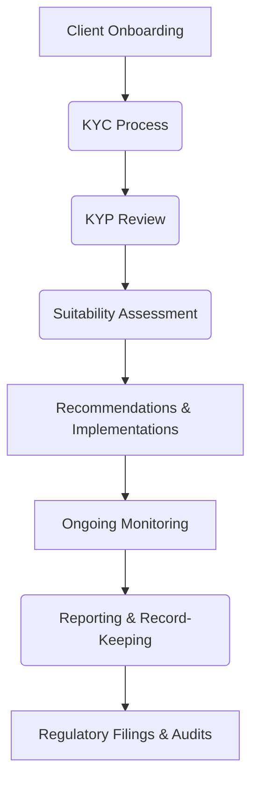

## 1.4 Regulatory Environment

Regulatory compliance forms the backbone of wealth management in Canada. Whether you are dealing with securities, insurance, or broader financial services, multiple layers of regulations will shape your practices. This section outlines key regulatory bodies, rules that govern financial advice, and the compliance obligations that ensure investor protection and market integrity. A thorough understanding of these regulations will help wealth advisors uphold professional standards and maintain trust with their clients.

---

### Overview of the Canadian Regulatory Landscape

Canada’s regulatory environment differs from that of many other countries, primarily because it does not have a single national securities regulator. Instead, regulation is carried out at the provincial and territorial levels, guided and harmonized by the Canadian Securities Administrators (CSA). This structure can be understood as a system of “passport” rules, whereby compliance with one jurisdiction’s regulatory requirements often meets or approximates compliance with another’s.

To support a more uniform approach, the CSA coordinates policy among the provincial and territorial securities commissions, creating a more seamless environment for interprovincial securities activities. Securities legislation focuses on:

• Registration requirements for firms and individuals.  
• Disclosure and transparency obligations for public offerings of securities.  
• Enforcement of securities laws to prevent fraud and protect investors.  

Beyond securities, wealth management professionals often deal with additional regulatory authorities, such as insurance regulators and anti-money laundering organizations.

---

### Key Regulatory Bodies

#### Canadian Securities Administrators (CSA)

The CSA is an umbrella organization composed of all provincial and territorial securities commissions. Although the CSA itself does not have direct legislative authority, it plays a coordinating role by:

• Developing nationwide regulatory initiatives.  
• Promoting uniform securities laws.  
• Streamlining processes like filing prospectuses or registering new advisors.  

For example, the CSA’s National Instrument 31-103 stipulates rules related to registration requirements, ongoing obligations, and the conduct of advisors and dealers.

#### Provincial Securities Commissions

Each province has its own securities commission that enforces local rules and laws. Examples include the Ontario Securities Commission (OSC), the Autorité des marchés financiers (AMF) in Quebec, and the Alberta Securities Commission (ASC). While these commissions operate independently, they coordinate through CSA to standardize:

• Prospectus requirements.  
• Registration for securities industry participants.  
• Enforcement actions for non-compliance.  

Advisors working with clients across multiple provinces must be well-versed in each applicable commission’s regulations. More information can be found at the Ontario Securities Commission’s website:  
[https://www.osc.ca/](https://www.osc.ca/)

#### Canadian Investment Regulatory Organization (CIRO)

Formed as a result of consolidation in Canada’s self-regulatory organizations, CIRO is the national SRO overseeing investment dealers, mutual fund dealers, and related market activities. CIRO:

• Implements rules governing product distribution and financial advice.  
• Oversees professional standards among its member dealers and advisors.  
• Conducts regular audits and enforces continued education programs.  

Maintaining membership with CIRO ensures that firms and advisors adhere to industry best practices and meet or exceed regulatory standards. Detailed guidance can be found at:  
[https://www.ciro.ca](https://www.ciro.ca)

---

### Additional Regulatory Authorities

#### Insurance Regulators

Wealth management professionals who advise on life, health, or property and casualty insurance face additional provincial oversight. In Ontario, the Financial Services Regulatory Authority of Ontario (FSRA) is responsible for licensing and regulating insurance activities. Advisors must:

• Obtain and renew requisite licenses.  
• Comply with provincial insurance laws.  
• Adhere to ethical and market conduct guidelines (e.g., needs-based selling).  

Each province has its equivalent regulatory framework, so compliance requirements vary by region.

#### Anti-Money Laundering (AML) and Privacy Statutes

Canadian wealth management firms also must comply with federal anti-money laundering and anti-terrorist financing rules under the Proceeds of Crime (Money Laundering) and Terrorist Financing Act (PCMLTFA). FINTRAC (Financial Transactions and Reports Analysis Centre of Canada) is the authority responsible for:

• Monitoring financial transactions for suspicious activity.  
• Reviewing firms’ record-keeping and reporting obligations.  
• Imposing penalties or sanctions for non-compliance.  

In addition, privacy laws such as the Personal Information Protection and Electronic Documents Act (PIPEDA) govern how advisors collect, use, and store client data. Rigorous data protection measures and documented consent processes are essential to ensure compliance.

For more details, visit FINTRAC’s official website:  
[https://www.fintrac-canafe.gc.ca](https://www.fintrac-canafe.gc.ca)

---

### Key Regulatory Concepts in Wealth Management

#### Know-Your-Client (KYC)

KYC is a foundational pillar of compliance and ethical practice. Advisors must gather and document key client information, including:

• Personal details (age, employment, dependents)  
• Financial status (income, assets, liabilities)  
• Investment objectives and time horizon  
• Risk tolerance level  

The data collected ensures that the advisor can recommend products suited to the client’s profile. KYC also provides a first line of defense against unsuitable advice and fraudulent activities.

#### Know-Your-Product (KYP)

Closely aligned with KYC, Know-Your-Product (KYP) requires advisors to have a thorough understanding of the products they recommend. This includes awareness of:

• Product structure (e.g., risks, fees, redemption features)  
• Market conditions that could impact performance  
• Regulatory guidelines and suitability considerations  

By combining strong KYC and KYP practices, advisors can tailor effective solutions while remaining compliant.

#### Suitability

Suitability ties KYC and KYP together. Advisors must ensure that investment strategies, asset allocations, or insurance solutions recommended are appropriate for a client. A product that is suitable for a high-net-worth individual with strong cash flow and a high risk tolerance may be entirely inappropriate for a retiree relying on fixed income. Suitability standards are enforced by provincial commissions and CIRO to protect clients from misaligned advice.

---

### Step-by-Step Compliance Framework

Below is a simplified diagram illustrating how different regulatory considerations interact in a compliance framework for wealth management professionals:

1. Client Onboarding: Collect client information, verify identity, and obtain necessary disclosures and consents.  
2. KYC Process: Comprehensively document financial profiles, risk tolerance, and objectives.  
3. KYP Review: Examine product offerings to ensure understanding of features and risks.  
4. Suitability Assessment: Match appropriate products or solutions with the client’s profile.  
5. Recommendations & Implementations: Present your advice to the client, obtain approvals, and execute transactions.  
6. Ongoing Monitoring: Review the client’s portfolio and life changes regularly. Adjust strategies as needed.  
7. Reporting & Record-Keeping: Maintain complete records; comply with any updates from regulators.  
8. Regulatory Filings & Audits: Submit required disclosures and data to relevant bodies (CSA, CIRO, FINTRAC), ensuring preparedness for audits.

---

### Practical Examples and Case Studies

#### Case Study 1: Registered Investment Advisor at a National Bank

An investment advisor at a major Canadian bank, such as RBC, works with high-net-worth individuals. As a registered investment advisor under CIRO’s oversight, they must complete robust KYC reviews annually, especially if the client experiences significant life events (e.g., selling a business, relocating, divorce). They also need to regularly log and document client interactions to meet both CSA and FINTRAC requirements.

#### Case Study 2: Independent Insurance Agent

An independent agent licensed in Ontario through FSRA focuses on life and living benefits insurance. They must keep track of licensing renewal requirements and continuing education credits. They must also ensure product suitability—selling a whole life policy to a young client with limited disposable income might raise red flags if the agent doesn’t demonstrate a thorough analysis of the client’s ability to sustain premiums.

---

### Common Pitfalls and Best Practices

• Failing to Update KYC Information: Client data can go stale if not regularly updated. A best practice is to conduct annual or semi-annual reviews.  
• Inadequate Documentation: Even if an advisor conducts thorough KYC and product due diligence, failing to document properly can still lead to compliance issues.  
• Lack of Conflict of Interest Disclosures: Advisors must be transparent about any compensation or referral arrangements that might influence recommendations.  
• Poor AML/ATF Oversight: Ignoring thresholds for large cash transactions or suspicious activities can lead to regulatory sanctions.  

**Best Practices**:  
• Maintain systematic processes for collecting and updating client data.  
• Use standardized checklists and digital tools for compliance tracking.  
• Stay abreast of rule changes by following CSA, CIRO, and provincial commission updates.  
• Integrate compliance procedures with client relationship management (CRM) systems for better oversight.

---

### Leveraging Tools and Resources

• Provincial Securities Commission Websites (e.g., OSC): Access rulebooks, investor alerts, and regulatory consultations.  
• CIRO Rulebook: Stay informed on SRO rules related to sales practices, continuing education, and supervision.  
• FINTRAC Guidelines: Use FINTRAC’s resources for AML/ATF compliance checklists and reporting forms.  
• Open-Source Financial Tools: Explore compliance plugins and CRM modules that help automate client onboarding and record-keeping (e.g., open-source solutions tailored to financial services).  
• “Canadian Securities Regulation” by Poonam Puri, Anita Anand, et al.: Offers an academic perspective, deep dives into legal frameworks, and expert commentary on policy developments.

---

### Summary

Navigating the multifaceted Canadian regulatory landscape is central to delivering trustworthy and ethical financial advice. By ensuring compliance with provincial securities commissions, adhering to CIRO’s oversight, and respecting AML and privacy statutes, advisors protect both clients and themselves from significant risks. Core principles like KYC, KYP, and suitability form the backbone of wealth management practice, while ongoing monitoring and documentation keep the advisor well-prepared for audits and regulatory changes.

Wealth management professionals who embrace these requirements foster deeper client relationships and uphold the integrity of the financial system. As legislation, technology, and market conditions evolve, remaining informed and agile will be key to maintaining a successful, compliant advisory practice in Canada.

--------------------------------------------------------------------------------

## Master the Canadian Regulatory Environment: A Comprehensive Quiz



### Which organization coordinates securities regulation and policy across provincial and territorial commissions in Canada?

- [ ] Ontario Securities Commission
- [ ] Financial Transactions and Reports Analysis Centre of Canada
- [x] Canadian Securities Administrators (CSA)
- [ ] Financial Services Regulatory Authority of Ontario

> **Explanation:** The Canadian Securities Administrators (CSA) is an umbrella organization that harmonizes regulations and policies across provincial and territorial securities commissions in Canada.

### What is the main responsibility of the Canadian Investment Regulatory Organization (CIRO)?

- [x] Overseeing investment dealers, mutual fund dealers, and related activities
- [ ] Setting insurance premium rates
- [ ] Administering anti-money laundering regulations
- [ ] Issuing Government of Canada bonds

> **Explanation:** CIRO is the self-regulatory organization in Canada that enforces regulations for investment dealers, mutual fund dealers, and related market activities, ensuring professional standards are met.

### Which of the following is NOT typically overseen by provincial securities commissions?

- [ ] Registration requirements for advisors
- [ ] Public offering disclosures
- [ ] Enforcement of securities laws
- [x] Life insurance licensing

> **Explanation:** Provincial securities commissions primarily regulate securities issuance and trading. Insurance licensing is governed separately by provincial insurance regulators, such as the Financial Services Regulatory Authority of Ontario (FSRA).

### What does "KYC" stand for in wealth management?

- [ ] Know Your Competition
- [x] Know Your Client
- [ ] Keep Your Custody
- [ ] Know Your Compliance

> **Explanation:** “Know Your Client” refers to the regulatory requirement for advisors to gather sufficient information about a client's financial situation, investment objectives, and risk tolerance before making recommendations.

### Which regulator oversees Canada’s anti-money laundering and anti-terrorist financing framework?

- [ ] CIRO
- [x] FINTRAC
- [ ] CSA
- [ ] FSRA

> **Explanation:** The Financial Transactions and Reports Analysis Centre of Canada (FINTRAC) enforces Canada’s AML/ATF laws, including monitoring reporting entities’ compliance with record-keeping and suspicious transaction reporting requirements.

### A self-regulatory organization (SRO) in financial services is generally responsible for:

- [x] Establishing and enforcing rules for member firms
- [ ] Lending money to publicly traded companies
- [ ] Directly setting interest rates for mortgage products
- [ ] Negotiating labour agreements for brokers

> **Explanation:** An SRO like CIRO creates and enforces regulations among its members, complementing government-led regulatory frameworks in financial services.

### Why is “Suitability” crucial in wealth management?

- [x] It ensures that recommended products align with a client’s goals and risk tolerance.
- [ ] It allows advisors to bypass compliance requirements.
- [x] It protects both the client and the advisor from inappropriate advice.
- [ ] It guarantees investment performance.

> **Explanation:** Suitability is the process of matching financial products and strategies to the client’s circumstances, thereby protecting both clients (from unsuitable investments) and advisors (from regulatory penalties).

### Which of the following is a common pitfall for advisors failing to meet regulatory standards?

- [x] Inadequate documentation of client interactions
- [ ] Over-diversifying a client’s portfolio
- [ ] Subscribing to CIRO’s rulebook
- [ ] Providing a risk assessment before opening accounts

> **Explanation:** Inadequate documentation can lead to compliance shortcomings. Over-diversification, subscribing to CIRO’s rulebook, and providing risk assessments are generally advisable or required practices.

### What best describes the primary function of the Financial Services Regulatory Authority of Ontario (FSRA)?

- [ ] Granting patents and trademarks
- [x] Governing insurance licensing and regulating pension plans in Ontario
- [ ] Managing the national stock exchange
- [ ] Administering federal income tax rules

> **Explanation:** FSRA oversees insurance and pension plan regulation in Ontario. It is not responsible for patents, stock exchange management, or tax rules.

### Under the Know-Your-Product (KYP) principle, what is expected of an advisor?

- [x] Thorough understanding of the products they recommend 
- [ ] Partial knowledge of the product’s structure
- [ ] Relying solely on the client’s input for product selection
- [ ] Guaranteeing zero risk to clients

> **Explanation:** KYP requires advisors to understand a product’s features, risks, costs, and suitability to ensure informed recommendations that align with a client’s profile.



---

## For Additional Practice and Deeper Preparation

**[1. WME Course For Financial Planners (WME-FP): Exam 1](https://www.udemy.com/course/csi-wme-fp-exam1/?referralCode=1A23C67E56971C0A73D5)**  
• Dive into 6 full-length mock exams—1,500 questions in total—expertly matching the scope of WME-FP Exam 1.  
• Experience scenario-driven case questions and in-depth solutions, surpassing standard references.  
• Build confidence with step-by-step explanations designed to sharpen exam-day strategies.

**[2. WME Course For Financial Planners (WME-FP): Exam 2](https://www.udemy.com/course/csi-wme-fp-exam2/?referralCode=25879CCDED7B7905BBA8)**  
• Tackle 1,500 advanced questions spread across 6 rigorous mock exams (250 questions each).  
• Gain real-world insight with practical tips and detailed rationales that clarify tricky concepts.  
• Stay aligned with CIRO guidelines and CSI’s exam structure—this is a resource intentionally more challenging than the real exam to bolster your preparedness.

> Note: While these courses are specifically crafted to align with the WME-FP exam outlines, they are independently developed and not endorsed by CSI or CIRO.
