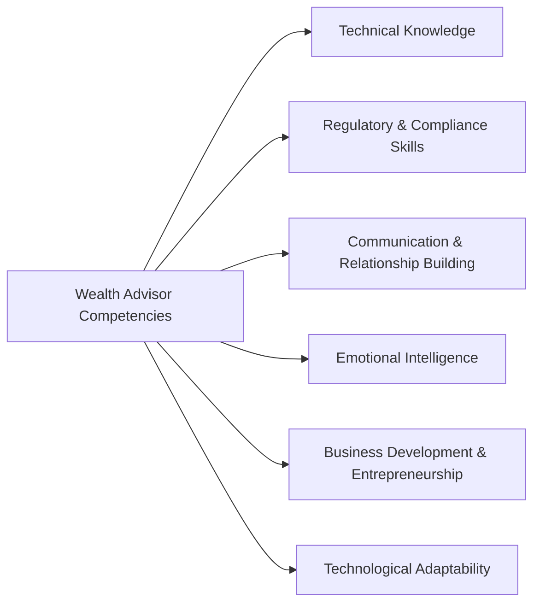
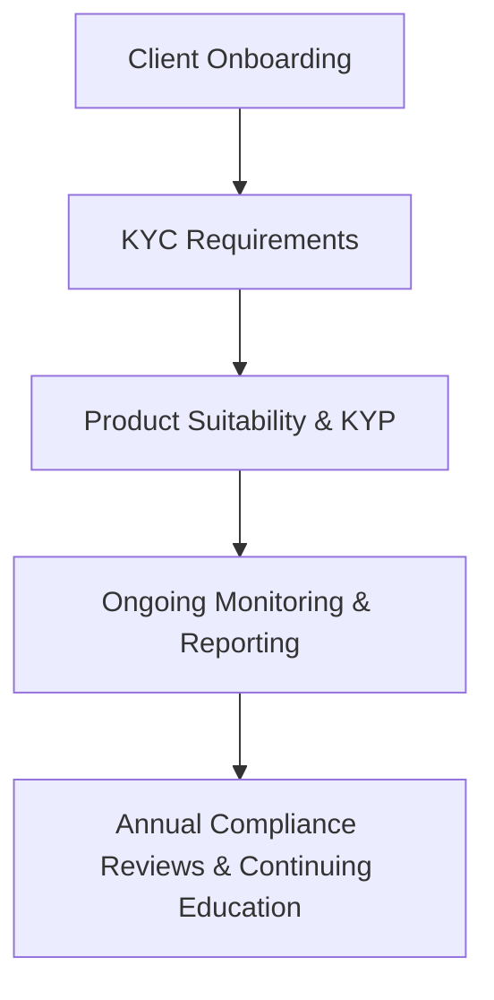

## 1.5 Competencies of Successful Wealth Advisors

In the Canadian wealth management landscape, successful wealth advisors blend technical expertise, compliance knowledge, communication skills, emotional intelligence, entrepreneurial acumen, and technological adaptability. This holistic skill set empowers advisors to meet clients’ unique goals, regulatory obligations, and evolving demands—ultimately fostering successful, enduring partnerships. Below, we examine each of these competencies in detail, alongside examples, diagrams, and practical insights for today’s Canadian advisor.

---

## The Core Competency Areas

### Technical Knowledge

#### Overview

At the heart of any successful wealth advisor’s practice lies a solid grasp of technical knowledge. This encompasses an array of subjects central to financial planning, including:

• Taxation – Understanding personal tax rates in Canada, tax-sheltering vehicles (RRSP, TFSA), and tax-saving strategies  
• Investments – Evaluating stocks, bonds, exchange-traded funds (ETFs), mutual funds, and structured products  
• Retirement Planning – Projecting income needs for retirement, analyzing retirement income sources such as CPP/QPP, OAS, and private pensions  
• Estate Planning – Devising strategies to minimize probate fees and ensure assets pass efficiently to beneficiaries  

Technical proficiency allows advisors to:

• Interpret complex financial statements and personal net worth statements  
• Recommend investment products tailored to risk tolerance and time horizon  
• Design tax-efficient strategies that align with Canadian rules, such as splitting income or utilizing spousal RRSPs  
• Formulate holistic plans that integrate cash flow, risk, and long-term growth  

#### Practical Example: A Canadian Pension Fund Analysis

Many advisors in Canada look to the investment strategies employed by major pension funds—like the Canada Pension Plan Investment Board (CPPIB)—for insights into asset allocation and risk management. For instance, if an advisor’s client expresses interest in a diversified approach, the advisor might propose a blend of equities, fixed income, and alternative investments (e.g., real estate or infrastructure). Understanding how pension funds factor in long-term liabilities and inflation protection will help the advisor structure a portfolio that similarly “hedges” future expenses such as retirement or education costs.

#### Best Practices and Pitfalls

• Best Practice: Stay informed of tax rule changes—especially annual updates to contribution limits for TFSAs and RRSPs, and new tax credits or exemptions.  
• Pitfall: Overreliance on past performance without considering current market conditions and the client’s evolving goals can lead to misaligned recommendations.  

---

### Regulatory and Compliance Skills

#### Overview

Canada’s wealth management industry is governed by a robust regulatory framework. Regulatory bodies like CIRO (Canadian Investment Regulatory Organization) and guidelines from provincial securities commissions define the parameters within which advisors must operate. Advisors must:

• Stay current with securities legislation changes  
• Abide by know-your-client (KYC) and understand-your-product (KYP) rules  
• Adhere to CIRO proficiency requirements and continuing education mandates  
• Maintain client privacy in compliance with federal and provincial regulations  

#### Compliance Roadmap Diagram

Each step in the diagram underscores a critical compliance stage—starting from client onboarding (KYC) to annual updates and reviews.

#### Practical Example: Overcoming a Compliance Challenge

When a client at a major Canadian bank like RBC seeks advice on margin borrowing, an advisor must carefully document how the recommendation meets the client’s risk tolerance, net worth, and investment objectives. Proactive recordkeeping, plus documented disclosures related to margin account risks, ensures that the advisor meets compliance standards while serving the client’s interests.

---

### Communication and Relationship Building

#### Overview

Clear, empathetic communication is the linchpin of client relationships. Effective wealth advisors:

• Translate complex concepts—like options strategies or dividend tax credits—into language clients understand  
• Help clients stay calm amid market volatility by providing reality checks and thorough explanations  
• Foster trust through regular, meaningful interactions  

#### Strategies for Strong Communication

1. Use accessible analogies: Comparing asset allocation to a “well-balanced meal” can clarify the value of diversification.  
2. Incorporate interactive tools: Demonstrate the mortgage amortization process with online calculators.  
3. Schedule structured reviews: Offer quarterly updates, annual in-person reviews, and timely communications whenever significant portfolio changes occur.  

#### Business Case Study: Transitioning to Retirement

A common scenario in Canada is the shift from accumulation to decumulation strategies at retirement. Advisors can demonstrate potential tax burdens on RRSP withdrawals, highlight bridging benefits of CPP/QPP, and illustrate different withdrawal schedules. Clear communication about these transitions reduces stress for clients while cementing the advisor’s role as a trusted resource.

---

### Emotional Intelligence

#### Overview

Emotional Intelligence (EQ) often sets top-performing advisors apart. Advisors must not only understand clients’ financial objectives, but also empathize with their emotional states, personal values, and family dynamics. Key components of EQ include:

• Self-awareness: Recognizing personal biases and emotional triggers  
• Self-regulation: Maintaining composure during challenging conversations  
• Empathy: Sensing and validating the client’s feelings, such as anxiety about market downturns  
• Relationship management: Guiding clients through life-altering events (inheritances, divorces, or critical health issues) while preserving strong rapport  

#### Example of EQ in Action

Consider an advisor with a client who recently lost a spouse. Beyond the immediate financial implications—such as updating beneficiary designations—emotional support and patience are necessary. The advisor’s empathy helps the client navigate a sensitive transition, ensuring that the wealth plan remains cohesive and aligned with the client’s evolving needs.

#### Recommended Reading

• “Emotional Intelligence 2.0” by Travis Bradberry and Jean Greaves. This book offers practical exercises to enhance communication, empathy, and self-awareness in professional relationships.

---

### Business Development and Entrepreneurship

#### Overview

Wealth advisors often function as entrepreneurs, responsible for growing and managing their practices. This involves:

• Identifying target markets (e.g., retirees, small business owners, tech professionals)  
• Developing marketing strategies—social media campaigns, educational seminars, or referral programs  
• Cultivating a pipeline of prospective clients through networking events and digital initiatives  

#### Key Factors

1. Branding and Value Proposition: Advisors should state clearly why clients should choose them over competitors.  
2. Sales Acumen: Comfortably discussing fees, services, and potential outcomes to convert leads into long-term clients.  
3. Customer Relationship Management (CRM): Utilizing CRM software to track prospect interactions, ensure timely follow-ups, and foster loyalty.  

#### Practical Example: Acquiring Small Business Owners as Clients

A wealth advisor might tailor a marketing campaign discussing the unique considerations for business owners—such as corporate taxation, succession planning, or specialized insurance. By hosting a webinar in partnership with a local chamber of commerce, the advisor can showcase expertise in these areas, generating trust and potential leads.

---

### Technological Adaptability

#### Overview

With the emergence of robo-advisory platforms, AI-driven portfolio management software, and advanced client communication tools, technology plays a pivotal role in modern wealth management. Technological adaptability allows advisors to:

• Automate administrative tasks, freeing time for more personalized advice  
• Generate data-driven insights for enhanced decision-making on asset allocation, rebalancing, and tax-loss harvesting  
• Offer secure digital client onboarding, e-signatures, and instant portfolio updates compliant with Canadian privacy laws  

#### Example: Integrating a Robo-Platform

Consider how TD or RBC has introduced hybrid advisory services, combining digital wealth management tools with human oversight. Advisors who adapt effectively might use these platforms to manage smaller client portfolios efficiently or to serve younger, tech-savvy customers while dedicating more face-to-face time to clients with complex needs.  

#### Implementation Steps

1. Assess available tools: Evaluate software for portfolio rebalancing, compliance monitoring, and performance reporting.  
2. Tailor experiences: Offer clients the choice of in-person meetings or a digital dashboard.  
3. Maintain data security: Ensure that any platform used is compliant with Canadian privacy regulations like PIPEDA (Personal Information Protection and Electronic Documents Act).  

---

## Additional Tools and Resources

Below are resources for each core competency area:

• [CIRO](https://www.ciro.ca) – Guidance on continuing education requirements and updated rule interpretations.  
• [FP Canada](https://www.fpcanada.ca/) – Ethical and professional standards for Certified Financial Planners and QAFP professionals.  
• Advanced Client Communication Platforms – Explore open-source or licensed solutions incorporating end-to-end encryption (e.g., Nextcloud, Secure Messaging).  
• Online Tax Calculators – Tools from the Canada Revenue Agency (CRA) and various open-source GitHub projects for simulating tax scenarios.  

---

## Key Takeaways

1. **Holistic Knowledge:** Mastery of tax, investments, and financial planning underpins an advisor’s ability to guide clients effectively through complex financial decisions.  
2. **Regulatory Integrity:** Compliance is an ongoing process, requiring continuous education and rigorous documentation.  
3. **Client-Centric Communication:** Clear, empathetic communication can foster long-term trust and strengthen advisor-client relationships.  
4. **Emotional Intelligence:** Understanding and managing emotions—both one’s own and the client’s—enables advisors to provide better support and counsel.  
5. **Entrepreneurial Mindset:** Cultivating new customers and expanding services is essential for sustainable business growth.  
6. **Tech Proficiency:** Embracing technology for analytics, reporting, and communication can enhance service quality and efficiency.

---

## Test Your Knowledge: Key Competencies of Successful Wealth Advisors



### What core aspect of Technical Knowledge is essential for creating tax-efficient strategies in Canada?

- [ ] Understanding only international investment markets
- [ ] Emphasizing short-term trading profits
- [x] Mastering RRSP, TFSA, and structured products
- [ ] Avoiding collaboration with tax specialists

> **Explanation:** technical expertise involves comprehensive knowledge of Canadian tax-sheltered accounts such as RRSPs and TFSAs, along with a grasp of derivatives and structured products to maximize tax efficiency.

### Which regulatory body in Canada helps oversee dealer conduct and proficiency in the investment industry?

- [ ] Canada Revenue Agency (CRA)
- [ ] FP Canada
- [x] CIRO (Canadian Investment Regulatory Organization)
- [ ] Financial Action Task Force (FATF)

> **Explanation:** CIRO sets rules and compliance guidelines for Canadian investment dealers and advisors, overseeing proficiency and continuing education requirements.

### What best describes the primary goal of communication and relationship-building skills in wealth management?

- [ ] Minimizing the number of client meetings
- [ ] Increasing the complexity of financial explanations
- [ ] Masking risks in the portfolio
- [x] Translating technical concepts clearly and fostering trust

> **Explanation:** Clear communication and trust-building are key outcomes of strong interpersonal skills, ensuring clients understand strategies and remain confident in their advisor.

### Which of the following is a key element of Emotional Intelligence for wealth advisors?

- [x] Recognizing and relating to a client’s emotional state
- [ ] Prioritizing only performance-driven conversations
- [ ] Encouraging clients to adopt high-risk strategies
- [ ] Ignoring clients’ personal circumstances

> **Explanation:** Emotional Intelligence involves understanding how a client’s emotions and personal circumstances affect their financial decisions, which fosters stronger advisor-client relationships.

### In terms of Business Development, what is a best practice for growing a financial advisory practice?

- [x] Hosting targeted seminars or webinars to showcase expertise
- [ ] Avoiding social media platforms for brand visibility
- [x] Developing a referral program to encourage word-of-mouth
- [ ] Restricting outreach to only existing clients

> **Explanation:** Advisors increase brand awareness and potential leads by offering informational sessions or referral incentives, showcasing expertise to new audiences.

### Which of the following statements about Technological Adaptability is true?

- [x] Robo-advisory platforms can streamline administrative tasks and offer an entry-level service option
- [ ] Advisors should ignore robo-advisories as they create unnecessary competition
- [ ] Digital solutions are incompatible with Canadian privacy regulations
- [ ] Technology reduces the need for regulatory compliance

> **Explanation:** Many modern advisors use robo-advisory platforms for clients who prefer digital solutions or have simpler portfolios, without compromising compliance or service standards.

### Why is ongoing education crucial for advisors in Canada?

- [x] Because rules and regulations evolve, and advisors must stay updated
- [ ] It only matters for new advisors
- [ ] It’s primarily for marketing purposes, with no impact on actual advisory quality
- [ ] Continuing education is optional under Canadian law

> **Explanation:** Advisors must keep pace with changes in legislation, best practices, and new financial products to ensure advice remains relevant and compliant.

### How does Emotional Intelligence help during market turbulence?

- [x] It enables advisors to empathize with client anxieties and provide reassurance
- [ ] It encourages advisors to dismiss client concerns as overreactions
- [ ] It focuses solely on technical charts when communicating
- [ ] It fosters confusion, leading to disorganized decision-making

> **Explanation:** By empathizing and communicating effectively, advisors help clients manage emotions and maintain discipline through market ups and downs.

### Which component is NOT typically included when discussing the technical skills required of wealth advisors?

- [ ] Estate planning
- [ ] Investment analysis
- [x] Culinary arts
- [ ] Tax knowledge

> **Explanation:** While understanding tax, investment, and estate considerations is crucial, culinary arts fall outside the scope of standard wealth management technical competencies.

### True or False: Embracing new technology platforms can help advisors create more efficient processes and offer robust client experiences.

- [x] True
- [ ] False

> **Explanation:** Leveraging technology—from automated processes to secure communication platforms—enhances transparency, client satisfaction, and overall efficiency in an advisory practice.



---

## For Additional Practice and Deeper Preparation

**[1. WME Course For Financial Planners (WME-FP): Exam 1](https://www.udemy.com/course/csi-wme-fp-exam1/?referralCode=1A23C67E56971C0A73D5)**  
• Dive into 6 full-length mock exams—1,500 questions in total—expertly matching the scope of WME-FP Exam 1.  
• Experience scenario-driven case questions and in-depth solutions, surpassing standard references.  
• Build confidence with step-by-step explanations designed to sharpen exam-day strategies.

**[2. WME Course For Financial Planners (WME-FP): Exam 2](https://www.udemy.com/course/csi-wme-fp-exam2/?referralCode=25879CCDED7B7905BBA8)**  
• Tackle 1,500 advanced questions spread across 6 rigorous mock exams (250 questions each).  
• Gain real-world insight with practical tips and detailed rationales that clarify tricky concepts.  
• Stay aligned with CIRO guidelines and CSI’s exam structure—this is a resource intentionally more challenging than the real exam to bolster your preparedness.

> Note: While these courses are specifically crafted to align with the WME-FP exam outlines, they are independently developed and not endorsed by CSI or CIRO.
