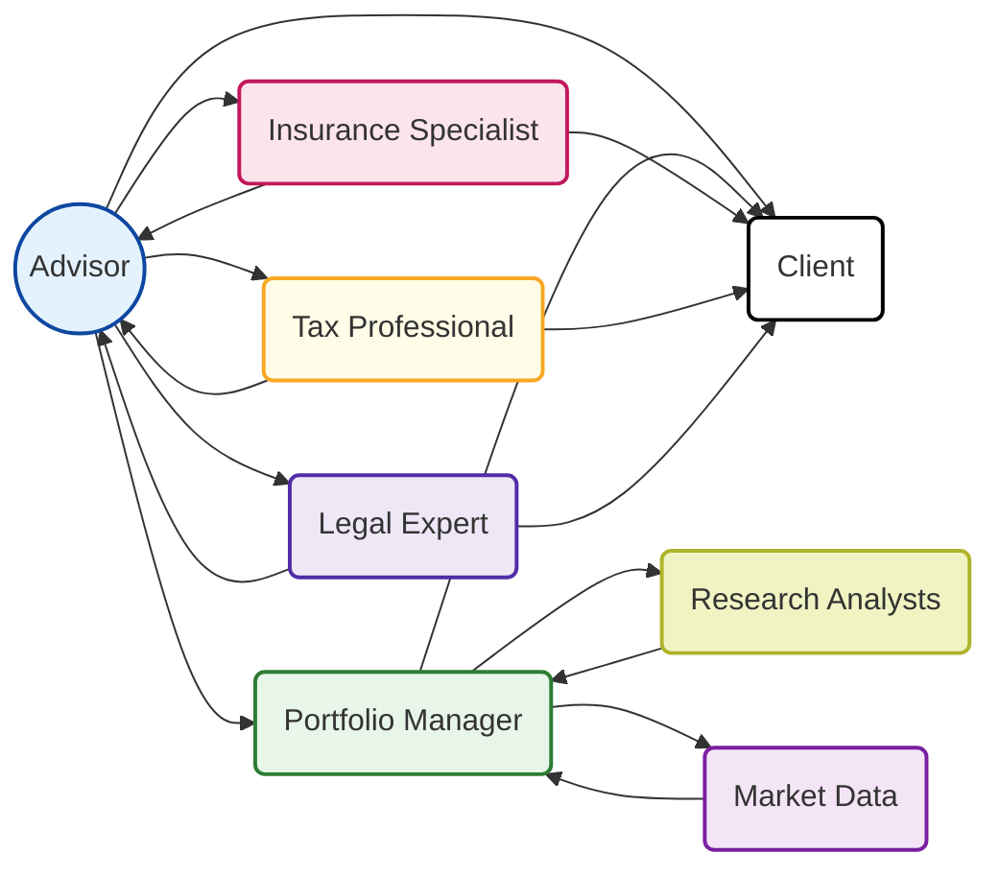

## 1.7 Building a Team of Specialists

Building a strong team of specialists is a cornerstone of delivering exceptional wealth management services in Canada. Modern wealth advisors rely on cross-functional partnerships to address the multi-faceted needs of their clients, especially those with higher net worth or more complex portfolio requirements. By bringing together legal, tax, insurance, and investment professionals—and sometimes external consultants—an advisor can provide holistic financial guidance that covers all areas of compliance, risk management, and strategic growth.

This section explores the roles of key specialists, discusses how to create effective collaboration structures, and offers practical recommendations for advisors aiming to build an impactful wealth management team.

---

## 1.7.1 The Rationale for a Specialist Team

• Clients increasingly expect end-to-end financial solutions that cover everything from retirement savings vehicles to estate planning needs.  
• Regulatory frameworks in Canada (including rules set by CIRO, provincial regulators, and more specialized entities like the Financial Services Regulatory Authority of Ontario [FSRA]) have grown in complexity, necessitating deeper expertise in specific niches.  
• Advisors who cultivate relationships with specialists can offer clients a comprehensive experience without diluting their own focus on advisory services.  

By assembling a carefully curated group of experts, you ensure that each financial domain is handled by a professional who is well-versed in both Canadian regulations and best practices.

---

## 1.7.2 Legal Experts and Estate Professionals

### The Need for Legal Expertise

When your client’s financial plan includes substantial assets, trusts, or complex family structures, specialized legal counsel becomes critical. Estate professionals, such as estate lawyers, play a pivotal role in shaping wills and trusts, ensuring they meet all provincial and federal legal requirements.

• **Role of Estate Lawyer:**  
  - Drafts or reviews wills, family trusts, and power of attorney documents.  
  - Advises on navigating provincial estate laws and probate fees.  
  - Helps minimize legal disputes and ensures the estate plan aligns with the client’s financial goals.

• **Practical Example:**  
  A high-net-worth individual might own multiple properties in different Canadian provinces. An estate lawyer ensures these assets are structured to minimize probate fees and meet each province’s legal requirements upon the client’s death.

### Provinces and Legal Variations

Each province in Canada (such as Ontario, British Columbia, Nova Scotia) has its own set of laws regarding wills, estates, and trusts. The oversight provided by an estate lawyer ensures compliance with local regulations, reducing the potential for costly legal challenges.

### Finding Qualified Professionals

• Consult the provincial Law Society directory.  
• Seek referrals from colleagues or other clients who have successfully executed complex estate plans.  
• Look for credentials like the TEP (Trust and Estate Practitioner) designation, indicating specialized expertise.

---

## 1.7.3 Tax Professionals

### The Complexity of Canadian Taxation

Canada’s tax landscape includes multiple layers of federal, provincial, and in some cases, municipal taxes—alongside intricate rules governing Registered Retirement Savings Plans (RRSPs), Tax-Free Savings Accounts (TFSAs), corporate structures, and trusts. A Chartered Professional Accountant (CPA) or tax lawyer provides essential insight into optimizing these tax obligations.

### Scope of Tax Professionals

• **Strategic Tax Planning:**  
  - Minimizing taxable income through deductions, credits, or corporate structures.  
  - Ensuring compliance with all Canada Revenue Agency (CRA) regulations.  
  - Advising on charitable giving strategies and philanthropic initiatives.

• **Practical Example:**  
  A CPA might analyze a client’s RRSP contribution limits, TFSA room, and corporate dividends to develop a tax-efficient income strategy, especially if the client also owns shares in a family business.

### Collaborating Effectively with CPAs and Tax Lawyers

• Establish a regular communication schedule (e.g., quarterly or semi-annually) for updates on changing tax rules.  
• Involve the tax professional early in the decision-making process to sidestep potential tax pitfalls.  
• Use shared online tools or secure document portals to streamline information exchange.

### Recommended Resources

• [CPA Canada](https://www.cpacanada.ca/) – Offers extensive materials on tax strategy, professional standards, and continuing education.  
• Provincial regulatory bodies that oversee CPA licensing and practice standards.

---

## 1.7.4 Insurance Specialists

### Why Insurance Matters in Wealth Management

Insurance products serve as foundational risk management tools. Life insurance can secure family income after the death of a breadwinner, while disability and critical illness coverage protect against a loss of earnings capacity. Properly integrated into a client’s financial plan, insurance strategies can also offer tax benefits or estate planning advantages.

### Working with a Licensed Insurance Advisor

• **Identifying Coverage Needs:**  
  - Evaluate the client’s family responsibilities, debt obligations, and long-term goals.  
  - Recommend products aligned with the client’s risk profile (e.g., term life insurance vs. permanent insurance).

• **Coordinating with Other Specialists:**  
  - Collaborate with the tax professional to explore deductibility or estate tax implications.  
  - Integrate feedback from estate lawyers to ensure policy beneficiaries align with will instructions.

### Canadian Regulatory Context

Insurance is provincially regulated in Canada. In Ontario, for example, the [Financial Services Regulatory Authority of Ontario (FSRA)](https://www.fsrao.ca/) oversees licensing and compliance for insurance practitioners. Advisors should ensure any recommended insurance specialist holds valid credentials and meets the province’s regulatory requirements.

---

## 1.7.5 Portfolio Managers, Investment Analysts, and Research Teams

### The Role of Specialized Investment Expertise

As client portfolios grow in size and complexity, especially for high-net-worth or ultra-high-net-worth individuals, the need for sophisticated investment management increases. Portfolio managers, investment analysts, and research teams bring deep insight into market trends, valuation metrics, and risk assessments.

• **Portfolio Manager:**  
  - Designs and implements investment strategies on a discretionary basis.  
  - Must hold appropriate regulatory credentials per Canadian securities law (e.g., CFA Charterholder, CIM designation).  

• **Investment Analyst/Research Team:**  
  - Provides ongoing market analysis, sector studies, and company-level research.  
  - Identifies potential investments and conducts due diligence on alternative assets or emerging markets.

### Collaborative Portfolio Construction

Below is a simplified diagram that illustrates the flow of communication among your specialists when constructing and managing client portfolios:

1. The advisor serves as the primary contact, coordinating input from all specialists.  
2. The portfolio manager refines asset allocation using insights from investment analysts and market data feeds.  
3. The insurance specialist, tax professional, and legal expert each provide counsel on implications for their respective domains.  

This flowchart underscores how each expert contributes to a more informed and agile service for the client.

---

## 1.7.6 External Consultants or Outsourced Services

### When to Engage External Consultants

In certain scenarios, an advisor may lack specific expertise or a client’s needs may be highly specialized. Examples include:  
• Rare or complex alternative investments (e.g., precious metals or real estate development projects).  
• Specialized ESG (Environmental, Social, and Governance) funds requiring deeper policy knowledge.  
• International tax issues involving multiple jurisdictions or cross-border estate concerns.

### Benefits of Outsourcing

• **Deeper Expertise:** By partnering with niche professionals, advisors add specialized knowledge without distracting from the firm’s core responsibilities.  
• **Flexible Costs:** Instead of hiring full-time specialists, firms can allocate resources on a project basis, adjusting to a client’s needs in real time.  
• **Enhanced Service Offering:** Clients appreciate the ability to access comprehensive expertise under one banner, even if some services are outsourced.

### Selecting Quality Vendors

• Review their track record, client references, and credentials.  
• Verify compliance with Canadian regulations, such as registration with the Ontario Securities Commission (OSC) if they provide investment advisory services.  
• Ensure data security and confidentiality measures align with your firm’s standards and the Personal Information Protection and Electronic Documents Act (PIPEDA).

---

## 1.7.7 Best Practices for Collaborative Team Building

1. **Set Clear Roles and Responsibilities**  
   - Eliminate confusion by defining each specialist’s domain of expertise.  
   - Implement a well-documented workflow for referrals and information sharing.

2. **Use Centralized Communication Platforms**  
   - Employ secure data-sharing portals or encrypted email services to streamline collaboration, especially for sensitive financial documents.  
   - Clarify expected response times and set up regular check-ins.

3. **Develop a Compliance Framework**  
   - Keep accurate records of advice provided and ensure it aligns with CIRO regulations and other applicable provincial requirements.  
   - Stay updated on privacy legislation to safeguard client information.

4. **Nurture Long-Term Relationships**  
   - Building rapport with specialists ensures they understand your client base and service model.  
   - Encourage ongoing professional development to keep skills current in a fast-evolving financial services environment.

5. **Client-Centric Approach**  
   - Always prioritize the client’s best interests when making referrals or structuring collaborations.  
   - Provide transparent communication about fees, roles, and potential conflicts of interest.

---

## 1.7.8 Common Pitfalls and How to Avoid Them

• **Failure to Engage Specialists Early:**  
  Waiting until a problem arises (e.g., a missed tax filing or an unfinalized trust arrangement) can be costly. Involve relevant experts in the earliest stages of planning.

• **Lack of Documentation:**  
  Failing to keep thorough documentation can lead to regulatory scrutiny. Maintain detailed records of advice, communications, and decisions.

• **Overreliance on a Single Expert:**  
  While strong relationships are good, occasionally cross-checking or consulting a second expert may be prudent—especially for critical or unusual cases.

• **Miscommunication Among Specialists:**  
  Advisors should function as effective project managers, ensuring that each professional’s input aligns with the client’s holistic plan.

---

## 1.7.9 Actionable Insights and Summary

By proactively assembling a team of estate lawyers, tax professionals, insurance specialists, and investment experts—supplemented by external consultants as necessary—advisors can deliver unparalleled service. This collaboration approach not only offers comprehensive coverage of risks and opportunities but also helps maintain compliance with Canada’s evolving regulatory environment.

• Estate lawyers safeguard against legal disputes and ensure inheritance structures are both robust and provincially compliant.  
• Tax professionals optimize the client’s tax posture, ensuring compliance and emerging opportunities are identified early.  
• Insurance specialists protect against life’s unpredictable risks, complementing investment strategies with an additional layer of security.  
• Portfolio managers and research teams underpin sophisticated investment decisions, while external consultants offer niche expertise when required.

---

## 1.7.10 Additional Resources

• Check your provincial Law Society directory for certified estate professionals.  
• [CPA Canada](https://www.cpacanada.ca/) – For comprehensive tax and accounting guidance.  
• [Financial Services Regulatory Authority of Ontario (FSRA)](https://www.fsrao.ca/) – Licensing and regulatory information for insurance professionals in Ontario.  
• Book Recommendation: “Family Trusts: A Guide for Beneficiaries, Trustees, Trust Protectors, and Trust Creators” by Hartley Goldstone and Kathy Wiseman.  

---

## Boost Your Skills: Building a Successful Specialist Team in Canadian Wealth Management



### Why is forming a team of specialists crucial in Canadian wealth management?  
- [x] Because it ensures comprehensive advice across legal, tax, insurance, and investment domains.  
- [ ] Because it is mandatory under all provincial regulations.  
- [ ] Because it allows advisors to avoid continuing education requirements.  
- [ ] Because it simplifies compliance with the CRA.  

> **Explanation:** Specialists provide targeted expertise in areas such as tax, estate planning, and insurance, guaranteeing clients receive thorough and accurate guidance.

### Which of the following best describes the role of estate lawyers in wealth management?  
- [ ] Supervise all of a client’s investments.  
- [x] Draft wills and trusts and advise on provincial inheritance laws.  
- [ ] Administer government pension programs.  
- [ ] Oversee every aspect of corporate structuring.  

> **Explanation:** Estate lawyers focus on wills, trusts, and estate laws, helping to structure inheritances and probate in alignment with provincial rules.

### What is a primary function of CPAs within a wealth management team?  
- [x] Optimize tax strategies and ensure compliance with CRA regulations.  
- [ ] Oversee real estate transactions and valuations.  
- [ ] Determine the best ESG funds for a client’s portfolio.  
- [ ] Provide expertise in family law matters like divorce settlements.  

> **Explanation:** CPAs focus on tax planning, compliance, and accounting. While they may collaborate on wider wealth management decisions, their core role is optimizing the client’s tax position.

### How can insurance specialists support holistic wealth planning?  
- [x] By proposing and structuring policies that manage key life, disability, and critical illness risks.  
- [ ] By replacing legal counsel in estate planning matters.  
- [ ] By guaranteeing the highest investment returns.  
- [ ] By offering free portfolio management services.  

> **Explanation:** Insurance specialists analyze risk factors and recommend appropriate products that protect against life’s uncertainties, complementing other wealth management strategies.

### Which statement accurately describes a portfolio manager’s duties?  
- [x] A portfolio manager manages investments on a discretionary basis and aligns strategies with client goals.  
- [ ] A portfolio manager strictly handles all estate planning matters.  
- [x] A portfolio manager collaborates with research analysts to select suitable securities.  
- [ ] A portfolio manager specializes solely in Canadian mutual fund regulations.  

> **Explanation:** Portfolio managers hold the appropriate credentials to manage investments on behalf of clients. They often collaborate with research teams to inform their decisions.

### When might an advisor choose to outsource to external consultants?  
- [x] When a client requires specialized ESG solutions or complex cross-border tax guidance.  
- [ ] When the advisor wants to bypass regulatory examinations.  
- [ ] When the advisor’s practice is too small to offer basic financial planning services.  
- [ ] Never—outsourcing is prohibited by most provincial regulations.  

> **Explanation:** External consultants provide niche expertise that might not exist within an advisor’s immediate network, enhancing the overall value delivered to clients.

### What is a key characteristic of strong collaboration among specialists?  
- [x] Clear communication protocols and well-defined responsibilities.  
- [ ] Complete reliance on verbal agreements without documentation.  
- [x] Periodic team reviews to ensure alignment with client goals.  
- [ ] Disregarding all compliance requirements to expedite client service.  

> **Explanation:** Effective collaboration requires regular communication, documented processes, and an aligned focus on the client’s goals and regulatory compliance.

### Which of the following is a common pitfall when building a team of specialists?  
- [x] Waiting too long to bring in an expert for complex client issues.  
- [ ] Documenting every single step of the planning process.  
- [ ] Conducting regular team meetings to review client cases.  
- [ ] Referring to internal and external professionals as needed.  

> **Explanation:** Engaging a specialist only after a problem surfaces can be costly and may not serve the client’s best interests. Proactive involvement is essential.

### Why is it important for advisors to keep updated documentation of all specialists’ input?  
- [x] To maintain clear records for regulatory compliance and to ensure consistent service quality.  
- [ ] To avoid having to pay taxes on behalf of clients.  
- [ ] To ensure that no professional can disagree with the advisor.  
- [ ] To hide potential conflicts of interest from the regulator.  

> **Explanation:** Maintaining accurate records helps meet compliance obligations and supports transparency in the advisor’s decisions and recommendations.

### A single specialist can cover all of a client’s needs effectively.  
- [x] True  
- [ ] False  

> **Explanation:** While certain specialists may have multiple areas of expertise, wealth management often requires multiple professionals to address a full range of client needs, from legal and tax issues to complex investment strategies.



---

## For Additional Practice and Deeper Preparation

**[1. WME Course For Financial Planners (WME-FP): Exam 1](https://www.udemy.com/course/csi-wme-fp-exam1/?referralCode=1A23C67E56971C0A73D5)**  
• Dive into 6 full-length mock exams—1,500 questions in total—expertly matching the scope of WME-FP Exam 1.  
• Experience scenario-driven case questions and in-depth solutions, surpassing standard references.  
• Build confidence with step-by-step explanations designed to sharpen exam-day strategies.

**[2. WME Course For Financial Planners (WME-FP): Exam 2](https://www.udemy.com/course/csi-wme-fp-exam2/?referralCode=25879CCDED7B7905BBA8)**  
• Tackle 1,500 advanced questions spread across 6 rigorous mock exams (250 questions each).  
• Gain real-world insight with practical tips and detailed rationales that clarify tricky concepts.  
• Stay aligned with CIRO guidelines and CSI’s exam structure—this is a resource intentionally more challenging than the real exam to bolster your preparedness.

> Note: While these courses are specifically crafted to align with the WME-FP exam outlines, they are independently developed and not endorsed by CSI or CIRO.
