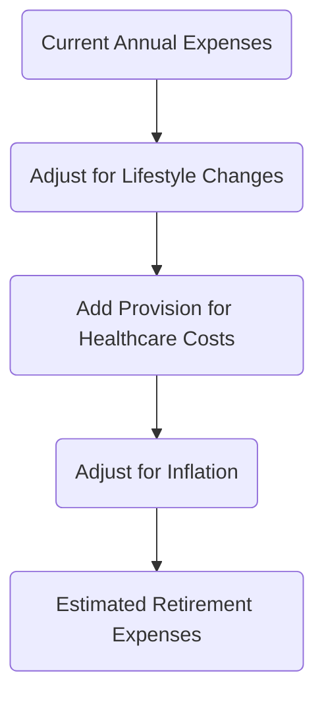

## 10.1 Preparing to Fund Retirement

Retirement is one of the most significant life goals for many Canadians. As a financial planner, helping your clients prepare to fund their retirement requires a thoughtful, comprehensive, and bespoke approach that addresses their life aspirations, financial obligations, risk tolerance, and long-term health considerations. This section delves into critical strategies for assessing retirement needs, setting realistic savings targets, and helping clients develop a roadmap for long-term financial security.

---

### The Importance of Retirement Planning

Retirement planning in Canada is unique due to the interplay of personal savings, employer-sponsored pension plans, Registered Retirement Savings Plans (RRSPs), and government-sponsored benefits such as the Canada Pension Plan (CPP), Quebec Pension Plan (QPP), and Old Age Security (OAS). By identifying the client’s current assets, income streams, and liabilities, you can help them pinpoint the gap between their retirement objectives and their current trajectory. This gap highlights how much needs to be set aside or reallocated to achieve their ideal retirement lifestyle.

Key reasons retirement planning is essential:
1. Ensuring sufficient funds to maintain a comfortable standard of living after leaving the workforce.
2. Protecting against unexpected life events, such as prolonged illness, market downturns, or changing family dynamics.
3. Taking advantage of compounding returns by starting early and contributing frequently.
4. Leveraging tax-advantaged accounts, like RRSPs, to maximize savings potential.

---

### Establishing Retirement Objectives

Retirement objectives are the specific financial and lifestyle goals a client aims to achieve after completing their working years. To clarify these objectives, encourage your client to:
- Envision their retirement lifestyle: Will they travel frequently, pursue hobbies, or downsize their home?  
- Budget for non-discretionary expenses, including housing costs, utilities, and healthcare.  
- Plan for potential long-term care costs or other medical expenses that may arise later in life.  

By defining these objectives early, you can devise a strategy to meet them systematically through budgeting, careful asset allocation, and prudent risk management.

---

### Estimating Annual Expenses in Retirement

A cornerstone of retirement readiness is identifying a target income that will sustain desired expenses. Guide clients to consider:

• Potential Changes in Lifestyle: Activities like travel, leisure, or part-time work can alter cash flow needs.  
• Inflation Risk: The risk that rising prices will erode the purchasing power of retirement income. Use conservative estimates to ensure expenses remain covered as costs rise over time.  
• Healthcare and Assisted Living: Clients may require additional support or medical care as they age. Estimating these costs mitigates potential surprises.  

A straightforward way to estimate annual expenses is to start with current expenses and adjust them for lifestyle changes and inflation. Here is a simple conceptual flow of arriving at the annual target:



Use online calculators from the [Financial Consumer Agency of Canada (FCAC)](https://www.canada.ca/en/financial-consumer-agency.html) or spreadsheet models to determine a ballpark figure for annual retirement spending. These tools can be refined over time with more accurate data.

---

### Understanding Life Expectancy and Longevity Risk

Longevity risk is the risk of outliving one’s retirement savings. As medical advancements extend average lifespans, it’s feasible your client could spend 20 to 30 years or more in retirement. Proper planning must incorporate:
1. Actuarial assumptions based on age, gender, and familial health history.  
2. Appropriate asset allocation that balances growth (to outpace inflation) with income generation.  
3. Contingency measures like annuities, guaranteed income products, or strategic insurance solutions, ensuring coverage for very long retirement horizons.

---

### Budgeting and Debt Management

Before building a robust retirement savings plan, focus on budgeting and managing high-interest debt:
- **Budgeting**: Allocate monthly income toward necessities, discretionary expenses, and savings. This reduces financial stress and frees resources for investing in retirement accounts.  
- **Debt Management**: Paying down costly forms of debt—such as credit card balances, personal loans, or lines of credit—yields a high “return on investment” because it saves interest that could otherwise be allocated to retirement contributions.

The [Financial Consumer Agency of Canada (FCAC)](https://www.canada.ca/en/financial-consumer-agency.html) offers budgeting worksheets and calculators, which can be particularly helpful when walking clients through the budgeting process.

---

### Government Retirement Income Sources

Government pension programs like the Canada Pension Plan (CPP) or Quebec Pension Plan (QPP), along with Old Age Security (OAS), can form part of an individual’s retirement income. However, it is essential to emphasize that these benefits alone may not be sufficient to maintain the client’s desired standard of living. Approximate benefits are typically less than what is needed to replace employment income fully.

The exact amounts depend on several factors:
- **Years Contributed**: The number of years (and how much) a client has contributed to CPP/QPP.  
- **Average Income**: Higher lifetime incomes result in higher pension benefits, up to a maximum threshold.  
- **Commencement Age**: Taking CPP/QPP before age 65 reduces the monthly amount, while delaying leads to higher payments.

Encourage clients to create a “My Service Canada” account to view their personalized CPP projections and track their OAS eligibility. This realistic assessment of government benefits helps determine how much additional savings are required.

---

### The Power of Starting Early

Time is a critical component of retirement planning. Even modest regular deposits made early in a career can grow exponentially due to compound interest. Consider the difference between starting to save at age 25 versus 35:

- **Scenario A**: A 25-year-old sets aside $300 per month in an RRSP growing at an average annual rate of 5%.  
- **Scenario B**: A 35-year-old invests $300 per month under the same conditions.

By the time both individuals reach 65, the 25-year-old’s nest egg is likely to be substantially larger—often hundreds of thousands more—simply because of an extra 10 years of compounding.

Encourage your clients to develop a schedule of automatic contributions (e.g., pre-authorized transfers) to keep them disciplined. The earlier they start, the simpler it becomes to manage consistent and meaningful contributions.

---

### Determining Nest Egg Adequacy

Crucial to retirement planning is evaluating the adequacy of the retirement nest egg. This often involves three main assessments:

1. **Projected Investment Growth**  
   Estimating the potential growth of contributions over time at various rates of return.  
2. **Withdrawal Rates**  
   Determining sustainable withdrawal rates (e.g., 3–4% annually) to minimize the risk of depleting savings too quickly.  
3. **Contingency Planning**  
   Accounting for market volatility, unforeseen health costs, and other potential surprises.

A simplified formula for nest egg adequacy might factor in:

• **Target Annual Retirement Income**  
• **Estimated Government Pensions and Other Fixed Sources**  
• **Rate of Return on Investments**  
• **Inflation Adjustments**  
• **Fees and Taxes**

Budgeting, prudent asset allocation, and considering longevity ensure that retirement savings outlive the retiree.

---

### Putting It All Together: A Step-by-Step Process

Below is a sample high-level process for guiding clients through funding their retirement:

```mermaid
flowchart LR
    A[Client Discovery] --> B[Assess Current Financial Position<br>(Assets, Liabilities, Income, Expenses)]
    B --> C[Define Retirement Objectives<br>(Lifestyle, Income, Age)]
    C --> D[Estimate Required Savings<br>(Expenses, Inflation, Life Expectancy)]
    D --> E[Choose Savings Strategies<br>(RRSP, TFSA, Employer Plans)]
    E --> F[Implement Budget & Debt Management]
    F --> G[Set Targets & Periodic Reviews<br>(Monitor and Adjust)]
```

1. **Client Discovery**: Gather in-depth information on financial goals, family situation, risk tolerance, and personal aspirations.
2. **Assess Current Financial Position**: Inventory net worth, identify available cash flow, and spot risk exposure.
3. **Define Retirement Objectives**: Collaborate to refine their vision of retirement and establish target markers.
4. **Estimate Required Savings**: Use projected spending, inflation, and longevity assumptions to determine the “savings gap.”
5. **Choose Savings Strategies**: Maximize registered accounts (e.g., RRSP) and consider other options like TFSAs (Tax-Free Savings Accounts) for flexibility.
6. **Implement Budget & Debt Management**: Encourage consistent contributions and prioritize paying down high-interest debt.
7. **Set Targets & Periodic Reviews**: Continually measure progress toward income goals, adjusting as needed for market fluctuations or changes in circumstances.

---

### Glossary

• **Retirement Objectives**: The specific financial and lifestyle goals a client aims to achieve after finishing their working years.  
• **Longevity Risk**: The risk of outliving one’s retirement savings due to a longer-than-expected lifespan.  
• **Inflation Risk**: The risk that rising prices will erode the purchasing power of retirement income and savings.  
• **Budgeting**: A financial process of allocating income to different categories of expenses, savings, and debt service.

---

### Additional Resources and References

• [Canadian Investment Regulatory Organization (CIRO)](https://www.ciro.ca) – Stay updated on evolving regulatory requirements for advisors.  
• [Canada Revenue Agency (CRA)](https://www.canada.ca/en/revenue-agency/services/tax/individuals/topics/rrsps-related-plans.html) – Official guidance on RRSP rules, contribution limits, and additional planning tools.  
• [Financial Consumer Agency of Canada (FCAC)](https://www.canada.ca/en/financial-consumer-agency.html) – Access budgeting advice, debt management tips, and retirement calculators.  
• **“The Wealthy Barber Returns” by David Chilton** – Offers accessible insights on long-term saving strategies and retirement planning from a Canadian perspective.

---

### Conclusion

Preparing to fund retirement is a collaborative and ongoing process. It starts with understanding your client’s unique circumstances and aspirations, modeling out future needs, addressing immediate financial priorities (like high-interest debt), and taking advantage of available programs and compounding returns. By maintaining a disciplined savings plan, leveraging tax-advantaged vehicles like RRSPs, and continually revisiting objectives and assumptions, you can help clients establish a robust and adaptable roadmap to secure their golden years.  

A diligent approach incorporating regular reviews, proper asset allocation, and an awareness of economic and regulatory changes will ensure that clients remain on track to meet their retirement goals—no matter how distant.

---

## Test Your Knowledge of Preparing to Fund Retirement in Canada



### Which of the following best describes why retirement planning is crucial?

- [x] It helps ensure a comfortable standard of living and protection against unforeseen life events.  
- [ ] It guarantees complete elimination of all debts before retirement.  
- [ ] It solely involves securing annuity products for a steady income stream.  
- [ ] It is only relevant for individuals with high net worth.  

> **Explanation:** Retirement planning reduces the risk of running out of funds during retirement and helps maintain a comfortable lifestyle. It also accounts for potential emergencies, medical costs, and other unforeseen events.


### In retirement planning, why is estimating annual expenses an important step?

- [x] It helps determine how much income will be needed to sustain a desired lifestyle and plan for potential healthcare costs.  
- [ ] It is only necessary for high-income earners.  
- [ ] Once retirement begins, expenses usually remain the same as pre-retirement.  
- [ ] It is unnecessary if clients have an employer-sponsored pension.  

> **Explanation:** Estimating annual expenses allows clients and advisors to set realistic income targets, account for lifestyle changes, and minimize the risk of underfunding retirement.


### What is longevity risk?

- [x] The risk that an individual outlives their retirement savings.  
- [ ] The risk that inflation will rise faster than retirement returns.  
- [ ] The risk of incurring high medical bills early in retirement.  
- [ ] The risk of being unable to quit working before age 70.  

> **Explanation:** Longevity risk refers to individuals needing retirement income longer than originally anticipated, raising the possibility of depleting their savings.


### Which of the following strategies best addresses budget and debt management before retirement?

- [x] Reducing high-interest debt to free up more cash flow for savings.  
- [ ] Taking on additional credit card debt.  
- [ ] Postponing significant debt payments until the retirement date.  
- [ ] Eliminating all insurance coverage first to free cash.  

> **Explanation:** Paying down high-interest debt (e.g., credit cards) improves cash flow for investing in retirement accounts and lowers overall interest costs.


### Which of the following could form part of a retiree’s income in Canada?

- [x] Canada Pension Plan (CPP) or Quebec Pension Plan (QPP).  
- [ ] Guaranteed net worth from an employer’s stock options alone.  
- [x] Old Age Security (OAS).  
- [ ] Universal Basic Income from the federal government for all retirees.  

> **Explanation:** CPP/QPP and OAS are core pillars of retirement income in Canada. However, these government benefits may not be sufficient by themselves, emphasizing the importance of additional savings plans.


### What is the major advantage of starting an RRSP contribution early?

- [x] Compounding growth has a longer period to expand the initial investment.  
- [ ] It immediately doubles the contributed amount.  
- [ ] RRSPs only allow contributions in the first 5 years of employment.  
- [ ] The tax rate for RRSP contributions is fixed at 10%.  

> **Explanation:** The power of compounding means that small, regular contributions made earlier in life can accumulate more significantly over the long term compared to starting later.


### Which agencies or organizations provide valuable tools and resources for retirement planning in Canada?

- [x] Canada Revenue Agency (CRA).  
- [ ] European Central Bank (ECB).  
- [x] Financial Consumer Agency of Canada (FCAC).  
- [ ] Federal Reserve of the United States.  

> **Explanation:** The CRA offers resources on RRSPs and other registered plans, while the FCAC provides budgeting and retirement calculators. ECB and Federal Reserve are central banks for other regions.


### How can budgeting benefit a client in retirement planning?

- [x] It clarifies available income for savings and reduces financial stress.  
- [ ] It only helps high-income earners reduce fees.  
- [ ] It ensures higher pension payouts.  
- [ ] It is unnecessary if a client has home equity.  

> **Explanation:** A well-structured budget helps manage expenses and identifies available resources that can be redirected to retirement savings.


### What does “nest egg adequacy” refer to?

- [x] The assurance that retirement savings will last throughout the retiree’s lifetime.  
- [ ] A calculation of how much debt can be taken on before retirement.  
- [ ] A fixed interest rate guarantee on government bonds.  
- [ ] The recommended number of eggs per week to maintain health during retirement.  

> **Explanation:** Nest egg adequacy ensures the retiree’s portfolio outlives the individual—factoring in market volatility, inflation, and longevity risk.


### True or False: Paydown of high-interest consumer debt should take precedence over making small, regular RRSP contributions.

- [x] True  
- [ ] False  

> **Explanation:** While both saving and debt repayment are important, eliminating high-interest debt first often has a greater financial benefit because it frees up cash flow and reduces costly interest payments. Once high-interest debt is managed, consistent RRSP contributions become more feasible and impactful.



---

## For Additional Practice and Deeper Preparation

**[1. WME Course For Financial Planners (WME-FP): Exam 1](https://www.udemy.com/course/csi-wme-fp-exam1/?referralCode=1A23C67E56971C0A73D5)**  
• Dive into 6 full-length mock exams—1,500 questions in total—expertly matching the scope of WME-FP Exam 1.  
• Experience scenario-driven case questions and in-depth solutions, surpassing standard references.  
• Build confidence with step-by-step explanations designed to sharpen exam-day strategies.

**[2. WME Course For Financial Planners (WME-FP): Exam 2](https://www.udemy.com/course/csi-wme-fp-exam2/?referralCode=25879CCDED7B7905BBA8)**  
• Tackle 1,500 advanced questions spread across 6 rigorous mock exams (250 questions each).  
• Gain real-world insight with practical tips and detailed rationales that clarify tricky concepts.  
• Stay aligned with CIRO guidelines and CSI’s exam structure—this is a resource intentionally more challenging than the real exam to bolster your preparedness.

> Note: While these courses are specifically crafted to align with the WME-FP exam outlines, they are independently developed and not endorsed by CSI or CIRO.
