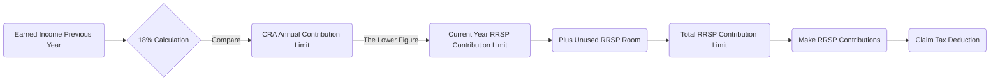

## 10.3 Registered Retirement Savings Plan Contribution Rules

Registered Retirement Savings Plans (RRSPs) are a cornerstone of retirement planning for many Canadians, providing a tax-deferred way to build wealth. Understanding contribution rules is essential not only for regulatory compliance but also for strategic financial planning. This section outlines the fundamental guidelines that govern RRSP contributions, highlights key strategies such as spousal RRSPs, and explains how to avoid pitfalls like over-contribution penalties. Incorporating RRSPs into a broader wealth management strategy typically yields tangible tax benefits that can fuel long-term investment growth.

---

### Contribution Limits and Annual Maximums

Every year, Canadians can contribute up to 18% of their previous year’s earned income to their RRSP, subject to an annual maximum limit set by the Canada Revenue Agency (CRA). This annual dollar limit is indexed to inflation and updated periodically. Here are some examples of historical limits for an RRSP (for illustration only):

| Tax Year | RRSP Contribution Limit | 
|----------|-------------------------|
| 2019     | $26,500                 |
| 2020     | $27,230                 |
| 2021     | $27,830                 |
| 2022     | $29,210                 |
| 2023     | $30,780                 |

Advisors typically examine both the 18% rule and the CRA’s stated upper limit to calculate which figure is lower—this becomes the actual contribution cap for the given tax year. Any earned income not captured in the annual limit creates "unused contribution room" that individuals can carry forward indefinitely.

#### Carry-Forward of Unused Room
Clients may not always be in a financial position to contribute the maximum amount each year. Fortunately, unused RRSP space can be accumulated for future use. This flexibility allows individuals to “catch up” on contributions when they have additional liquidity or when they enter higher-earning years.

---

### Deduction Limits and Notices of Assessment (NOA)

Although you can calculate the maximum theoretical contribution yourself, the most reliable source for determining the precise amount you can deduct in any given year is your Notice of Assessment (NOA). The NOA:

• Shows how much RRSP contribution room (or “deduction limit”) remains for the current year.  
• Accounts for any changes the CRA may have made to your returns.  
• Highlights any unused contribution room accrued from prior years.

#### Reading the NOA Correctly
A client’s NOA might list two key figures:  
1. The client’s current year deduction limit (often a single dollar amount).  
2. Their unused RRSP space from previous years.

Adding these two figures (if both are present) yields the grand total the individual can contribute. Advisors can add value by guiding clients on interpreting their NOA properly and by recommending strategic contribution amounts to manage tax efficiencies.

---

### Over-Contribution Penalties

The CRA imposes strict rules around over-contributions, which occur when an individual exceeds their allowable deduction limit. Over-contributions beyond $2,000 above your allowable limit are subject to a penalty tax of 1% per month on the excess amount. 

While the $2,000 buffer can help in minor calculation errors, it can diminish the benefit of immediate tax shelters. If you continuously exceed the limit, the 1% monthly penalty can mount quickly. As a prudent advisor:

• Monitor your client’s total RRSP contributions regularly.  
• Factor in employer-sponsored programs (like Group RRSPs) to avoid surprises.  
• Suggest adjusting payroll deductions or direct contributions to stay within allowable limits.

---

### Spousal RRSP Contributions

Spousal RRSPs are a strategic tool that allows higher-income earners to contribute part of their RRSP funds in their spouse’s name. The contributors receive the tax deduction, while the funds belong to the spouse. This approach can facilitate flexible income splitting in retirement when the spouse potentially withdraws funds at a lower marginal tax rate.

#### How It Works

1. The higher-income spouse contributes an amount (within their own RRSP deduction limit) into the spousal RRSP.  
2. They receive the RRSP tax deduction on their return, effectively reducing their taxable income.  
3. The spousal account is in the name of the lower-income spouse, who will own these assets.  
4. Given three calendar years must pass after the last contribution before the spouse can withdraw without attributing income back to the contributor, planning the timing of contributions and withdrawals is crucial.

This strategy can be especially effective for couples facing large income disparities in retirement, thereby reducing the overall family tax burden.

---

### Contribution Timing

Contributions to an RRSP are eligible for deduction in the calendar year they are made, or within the first 60 days of the following year. This “first 60 days rule” provides a flexible window for tax planning:

1. For instance, an RRSP contribution made on February 15 (assuming it falls within the first 60 days of the year) can be applied against the previous year or the current year.  
2. Advisors typically examine the client’s prior year’s taxable income, current-year prospects, and overall circumstances to maximize tax benefits.

#### Strategic Considerations

- If a client anticipates higher income for the current year, deferring the RRSP deduction could be more beneficial.  
- Conversely, if their tax bracket is likely to drop, it may be wise to claim the deduction immediately.  

---

### Withdrawal Restrictions and Exceptions

The main purpose of RRSPs is retirement savings. However, the CRA permits tax-free withdrawals for specific programs:

• Home Buyers’ Plan (HBP): Allows first-time homebuyers (or those who have not owned a home in four years) to withdraw up to $35,000 (or the current legislated maximum) from their RRSP to purchase or build a qualifying home. Repayment typically begins two years after the withdrawal, spread over 15 years.  
• Lifelong Learning Plan (LLP): Lets individuals fund full-time education or training for themselves or a spouse. The CRA allows annual withdrawals up to a certain maximum, and the total must be repaid within a prescribed schedule.

Keep in mind that if the repayment requirements are not met, the withdrawn amounts may be considered taxable income in the year they were not repaid.

---

### Practical Example: Combining Strategies for Tax Efficiency

Consider David, an RBC employee with a yearly income of $120,000. According to his NOA, his RRSP contribution limit is $21,600 for 2023. David’s spouse, Emily, works part-time and earns $30,000 per year. To optimize family tax, David decides to:

1. Contribute $15,000 to his personal RRSP.  
2. Contribute $3,000 to a spousal RRSP for Emily.  
3. Leave $3,600 of unused room for potential catch-up or to avoid over-contribution should he receive a bonus from RBC in February.

By splitting contributions, David secures an immediate tax deduction for both portions ($15,000 + $3,000). In retirement, if Emily is in a lower tax bracket, withdrawals from her spousal plan will be taxed at her lower rate, reducing the family’s overall tax burden. This arrangement demonstrates how effective utilization of spousal RRSPs and prudent planning helps families manage taxes and avoid over-contributions.

---

### Understanding RRSP Contribution Calculations: A Visual Overview

Below is a simple Mermaid diagram illustrating the flow of how one determines their RRSP contribution room and uses it effectively.

Explanation of the diagram:  
• Start with your previous year’s earned income (A). Calculate 18% of that figure (B).  
• Compare it with the CRA’s absolute annual limit (C). Whichever is lower determines the base contribution limit (D).  
• Add any carry-forward room (E) to get your total RRSP contribution room available (F).  
• When you contribute (G), you can subsequently deduct that contribution from taxable income (H).

---

### Glossary of Key Terms

• **Contribution Room:** The maximum amount an individual can contribute to their RRSP during a given year, consisting of 18% of earned income (up to the annual limit) plus any carry-forward from previous years.  
• **NOA (Notice of Assessment):** A summary the CRA issues after assessing your tax return, detailing any corrections and your updated RRSP contribution limit.  
• **Over-Contribution:** When an individual exceeds the RRSP contribution limit. There is a $2,000 grace amount before penalty taxes apply.  
• **Home Buyers’ Plan (HBP):** A federal program that allows first-time homebuyers (or those who qualify) to withdraw funds from their RRSP to buy or build a home, subject to future repayment.  
• **Spousal RRSP:** A plan designed to allow income splitting, where a higher-earning spouse contributes to a lower-earning spouse’s RRSP, benefiting from the immediate tax deduction while enabling the spouse to own and control the plan.

---

### Best Practices and Common Pitfalls

1. **Verify NOA Annually:** Encourage clients to read their NOA thoroughly each year, as it reflects the most up-to-date RRSP deduction limit.  
2. **Avoid Over-Contributions:** Even a small oversight can trigger penalties. Track total deposits across all registered plans.  
3. **Leverage Spousal RRSPs:** Contribute strategically to facilitate income splitting and potentially reduce overall family tax.  
4. **Check Timing:** Use the first 60 days of the year to finalize the prior year’s contributions, taking into account the client’s projected current-year income.  
5. **Repayment Obligations:** If participating in the HBP or LLP, create a repayment schedule to ensure you don’t inadvertently turn a required repayment into taxable income.

---

### Additional Resources and References

• [CRA: RRSP Contributions](https://www.canada.ca/en/revenue-agency/services/tax/individuals/topics/rrsps-related-plans/rrsp-contributions.html)  
  Learn about contribution limit details, forms, and official updates on RRSP rules.  
• [CIRO Bulletins and Investor Guidelines](https://www.ciro.ca)  
  Stay updated on spousal RRSP strategies and other regulatory considerations to safeguard investor interests.  
• “Tax-Free Savings Accounts and RRSPs: A Practical Guide” by Gordon Pape  
  Offers deeper insights for comparing TFSA and RRSP strategies, as well as advanced approaches to retirement saving and investing.

---

## Test Your Knowledge of RRSP Contribution Rules



### Which of the following best describes the maximum annual RRSP contribution limit?

- [ ] It is exactly 25% of an individual’s earned income from the previous year.  
- [x] It is 18% of the individual’s previous year’s earned income, subject to a CRA annual cap.  
- [ ] It is determined solely by how much room the individual chooses to carry forward.  
- [ ] It is a flat amount provided by the CRA, with no inflation indexing.  

> **Explanation:** In Canada, the rule is that individuals can contribute up to 18% of their prior year’s earned income, capped by a maximum dollar limit set by the CRA.

### Which of the following strategies helps high-income earners distribute taxable income over two spouses?

- [x] Contributing to a Spousal RRSP  
- [ ] Opening multiple individual RRSP accounts  
- [ ] Buying Canada Savings Bonds  
- [ ] Contributing to a Tax-Free Savings Account  

> **Explanation:** A Spousal RRSP allows a higher-income earner to contribute in the name of a lower-income spouse, ultimately permitting income splitting benefits at retirement.

### What happens if you over-contribute to your RRSP beyond the $2,000 threshold?

- [ ] You lose your RRSP tax deductions for two years.  
- [x] You must pay a 1% per month penalty tax on the excess.  
- [ ] The CRA automatically converts the excess into HBP repayments.  
- [ ] There is no penalty if the over-contribution is under $5,000.  

> **Explanation:** The CRA imposes a 1% monthly penalty tax on over-contributions exceeding $2,000 above the allowable limit.

### Which official CRA document helps confirm the exact amount you can contribute to your RRSP?

- [ ] T4 slip  
- [x] Notice of Assessment (NOA)  
- [ ] T5 slip  
- [ ] T3 slip  

> **Explanation:** The NOA, issued after the CRA processes your tax return, lists your updated RRSP deduction limit.

### Key considerations for timing RRSP contributions include: (Select two)

- [x] The first 60 days of each calendar year can be applied to the previous taxation year.  
- [ ] You must contribute in monthly installments only.  
- [x] Future income projections might influence whether you claim a deduction immediately or defer it.  
- [ ] You cannot contribute after December 31 of the tax year in question.  

> **Explanation:** Contributions made in the first 60 days can be allocated to the current or preceding tax year. Meanwhile, you might defer claiming your RRSP deduction if you anticipate a higher marginal tax rate in the future.

### Which statement about Spousal RRSPs is accurate?

- [x] The higher-income spouse’s contribution limit determines how much they can contribute to the Spousal RRSP.  
- [ ] The lower-income spouse can claim the tax deduction.  
- [ ] The lower-income spouse is restricted to making only half the amount the higher-income spouse makes.  
- [ ] The spousal RRSP has no withdrawal constraints.  

> **Explanation:** Even though the account is in the spouse’s name, the primary contributor must use their own contribution limit. The contributor, not the spouse, receives the tax deduction.

### Under the Home Buyers’ Plan (HBP) rules:

- [x] First-time homebuyers can withdraw from their RRSP without immediate tax implications, subject to repayment.  
- [ ] Withdrawals are fully taxed if the home is purchased outside Canada.  
- [x] Up to $35,000 can be withdrawn under current legislation.  
- [ ] No repayment plan is required.  

> **Explanation:** The HBP enables first-time homebuyers to access up to $35,000 from their RRSP tax-free, provided they repay it over 15 years starting two years after withdrawal.

### If you fail to repay your HBP withdrawal by the annual due date:

- [ ] You receive a lifetime ban from participating in the HBP again.  
- [x] The required repayment amount is added to your taxable income for that year.  
- [ ] You are charged a monthly interest penalty on the unpaid balance.  
- [ ] You only pay a 1% penalty on the missed amount.  

> **Explanation:** If HBP repayments are not made on time, the outstanding required repayment amount becomes part of the year’s taxable income.

### How does carrying forward unused RRSP room benefit clients in practical terms?

- [x] They can contribute more in subsequent years when they have the financial capacity or higher tax brackets.  
- [ ] They lose the carry-forward room if not used within three years.  
- [ ] They must pay interest on unused room.  
- [ ] They must always split the room with a spouse.  

> **Explanation:** Unused RRSP room carries forward indefinitely, allowing individuals to catch up on contributions when it is financially favorable or when they are in a higher tax bracket.

### Spousal RRSP withdrawals made within three calendar years of the last contribution typically:

- [x] Are attributed back to the contributing spouse as income.  
- [ ] Are tax-free for both spouses.  
- [ ] Are taxed at the contributor’s highest possible rate.  
- [ ] Cannot be withdrawn at all.  

> **Explanation:** Withdrawals from a Spousal RRSP within three calendar years of the last contribution are generally attributed to the contributor’s income. This prevents short-term income manipulation.



---

## For Additional Practice and Deeper Preparation

**[1. WME Course For Financial Planners (WME-FP): Exam 1](https://www.udemy.com/course/csi-wme-fp-exam1/?referralCode=1A23C67E56971C0A73D5)**  
• Dive into 6 full-length mock exams—1,500 questions in total—expertly matching the scope of WME-FP Exam 1.  
• Experience scenario-driven case questions and in-depth solutions, surpassing standard references.  
• Build confidence with step-by-step explanations designed to sharpen exam-day strategies.

**[2. WME Course For Financial Planners (WME-FP): Exam 2](https://www.udemy.com/course/csi-wme-fp-exam2/?referralCode=25879CCDED7B7905BBA8)**  
• Tackle 1,500 advanced questions spread across 6 rigorous mock exams (250 questions each).  
• Gain real-world insight with practical tips and detailed rationales that clarify tricky concepts.  
• Stay aligned with CIRO guidelines and CSI’s exam structure—this is a resource intentionally more challenging than the real exam to bolster your preparedness.

> Note: While these courses are specifically crafted to align with the WME-FP exam outlines, they are independently developed and not endorsed by CSI or CIRO.
