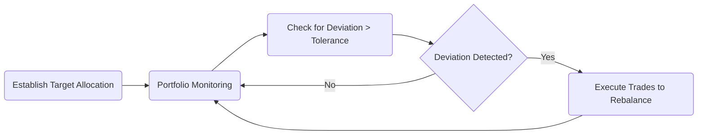

## 10.4 Management of RRSP Accounts

Effective management of Registered Retirement Savings Plan (RRSP) accounts is critical to ensuring long-term wealth accumulation and financial security for Canadian investors. This section discusses key facets of RRSP management, including strategic asset allocation, monitoring and rebalancing, fee structures, account consolidation, withdrawal strategies, creditor protections, and best practices. Advisors play a vital role in guiding clients through these considerations to help them optimize their RRSPs in alignment with personal financial goals and regulatory landscapes.

---

### Investment Selection and Asset Allocation

Selecting appropriate investments within an RRSP involves balancing risk tolerance, investment horizon, and expected returns. Asset allocation is often the initial step in determining how much to invest in equities, fixed-income securities (such as bonds), and cash or cash equivalents. By customizing asset allocation, advisors can tailor the portfolio to achieve a client’s long-term objectives while managing downside risk.

1. **Equities**  
   • Typically provide higher potential returns over the long run but come with increased volatility.  
   • Suitable for growth-oriented investors or those with extended time horizons—e.g., 10+ years from retirement.  
   • Examples include investing in individual Canadian stocks (like RBC, TD, or other large-cap companies) or equity mutual funds/ETFs.

2. **Bonds and Fixed Income**  
   • Usually offer lower volatility and predictable income streams.  
   • A core component for investors seeking stable income or nearing retirement, helping to offset equity market fluctuations.  
   • Canadian government bonds, corporate bonds, or bond funds are common instruments.

3. **Cash and Short-Term Instruments**  
   • Provide liquidity and stability, but yields are typically lower.  
   • Ideal for short-term needs or when strategizing for a near-term RRSP withdrawal.

To illustrate how different asset classes can compose an RRSP portfolio, consider the example table below:

| Asset Class | Typical Role        | Example Investments                             |
|-------------|---------------------|------------------------------------------------|
| Equities    | Growth Potential    | RBC equity funds, TD Canadian Equity Fund, S&P/TSX ETFs |
| Bonds       | Capital Preservation & Income | Government of Canada bonds, corporate bond ETFs  |
| Cash        | Liquidity & Stability | High-interest savings accounts, GICs           |

#### Strategic Asset Allocation in Practice

Advisors often use strategic asset allocations to balance risk and returns according to the client’s profile. For example, a 40-year-old investor with significant risk tolerance and 25 years left until retirement might hold 70% equities, 20% fixed income, and 10% cash. Conversely, a 60-year-old nearing retirement might reduce their equity allocation to 40% and increase fixed income to 50%, keeping 10% in cash for flexibility.

---

### Monitoring and Rebalancing

Once an RRSP portfolio is constructed, market movements can push allocations away from their targets over time. Monitoring and rebalancing ensure the portfolio remains aligned with the client’s objectives and risk tolerance.

• **Periodic Review**: Advisors typically review portfolios at least annually or semi-annually.  
• **Rebalancing Thresholds**: For instance, a tolerance band might allow an allocation to drift by 5%. Exceeding that band triggers rebalancing trades.  
• **Benefits of Rebalancing**:  
  - Maintains the intended risk level.  
  - Forces a “buy low, sell high” discipline (e.g., selling overweight winners and buying underweight laggards).

Below is a simple flowchart depicting a typical rebalancing process:

---

### Fee Structures and Cost Considerations

Investors should be aware of the costs associated with managing RRSPs, as high fees can significantly erode long-term returns. Common fees include:

1. **Account Fees**: Some financial institutions charge annual or quarterly fees for maintaining RRSP accounts.  
2. **Trading Commissions**: In a self-directed or online brokerage account, each buy or sell order may incur a commission.  
3. **Management Expense Ratios (MERs)**:  
   • Charged by mutual funds or ETFs to cover management fees, operating costs, and taxes.  
   • Expressed as a percentage of the fund’s average net assets.  
   • Even a small percentage difference in MERs (e.g., 2.00% vs. 1.50%) can have a significant impact over decades.  

#### Comparing Fee Structures

• **Mutual Fund MERs**: Often range between 1% and 2.5% in Canada.  
• **ETF MERs**: Commonly lower, often below 0.5%, though some specialized or niche ETFs may have higher MERs.  
• **Fee-Based Advisory Accounts**: May charge a percentage of assets under management (e.g., 1%), covering access to financial planning services and portfolio management.

---

### Consolidating Multiple RRSPs

Canadians often accumulate multiple RRSPs due to job changes, opening accounts at different financial institutions, or participating in group RRSPs. Consolidation offers a number of potential benefits:

• **Simplified Monitoring**: Fewer statements and accounts to track.  
• **Reduced Fees**: Fewer account or management fees if consolidated into a single plan.  
• **Improved Asset Allocation**: Easier to maintain and rebalance one consolidated portfolio.

#### Locked-In RRSPs (LIRAs)

Certain pension funds transferred into an RRSP become “locked in” (LIRAs). Unlike standard RRSPs, withdrawals or lump-sum transfers are heavily restricted before retirement, though certain exceptions (e.g., financial hardship or small balance unlock provisions) may apply. Always verify provincial or federal pension legislation to determine if and how accounts can be consolidated or unlocked.

---

### Withdrawal Strategies and Timing

RRSP withdrawals must be carefully planned to optimize tax efficiency and prevent undue erosion of retirement savings. Premature withdrawals can incur withholding taxes and negatively affect long-term growth. Key considerations include:

#### Mandatory Conversion by Age 71

• By December 31 of the year an individual turns 71, the RRSP must be converted to a Registered Retirement Income Fund (RRIF) or used to purchase an annuity.  
• Minimum annual withdrawals from an RRIF are based on the account holder’s age, gradually drawing down the account balance over time.

#### Minimizing Tax Implications

• **Splitting RRSP Withdrawals**: In retirement, splitting pension income or timing withdrawals to stay within lower tax brackets can help reduce tax liability.  
• **Pension Income Tax Credits**: For individuals aged 65 and older, converting RRSP funds into a RRIF may help take advantage of certain pension income tax credits.

**Example**  
Imagine Sandy, a 67-year-old retiree, with a $400,000 RRSP. She plans to gradually convert a portion of her RRSP to a RRIF each year, aiming to optimize tax credits and ensure a steady stream of income. By carefully timing these conversions, Sandy may pay less tax overall compared to converting the entire RRSP at once.

For official Government of Canada guidance on converting RRSPs to RRIFs, consult:  
[https://www.canada.ca/en/services/benefits/publicpensions/cpp/rrif.html](https://www.canada.ca/en/services/benefits/publicpensions/cpp/rrif.html)

---

### Bankruptcy Protections

One often-overlooked feature of RRSPs is the potential creditor protection they offer. While rules vary by province, and certain conditions must be met, RRSPs may be protected from creditors in the event of bankruptcy or legal judgments. For example:

• **Provincial Legislation**: Some provinces specifically protect funds held in insurance-based RRSPs (e.g., segregated funds) or in locked-in plans.  
• **Bankruptcy and Insolvency Act (Canada)**: Contributions made within 12 months prior to declaring bankruptcy may not be protected.  
• **Planning Considerations**: High-net-worth individuals or business owners worried about creditor claims may explore the protective features of insurance-based RRSP solutions.

---

### Best Practices in RRSP Management

Successful RRSP management extends beyond simple contributions. Advisors and investors should adopt best practices to maximize outcomes:

1. **Know Your Product (KYP) and Suitability**  
   • Align investments with the client’s risk tolerance, time horizon, and objectives, per CIRO guidelines.  
   • Stay informed about product changes, especially MER adjustments or fund manager replacements.

2. **Regular Portfolio Reviews**  
   • Monitor portfolio performance relative to objectives.  
   • Use open-source tools like [QuantLib](https://www.quantlib.org) or proprietary calculation and simulation tools from financial institutions to run risk and return simulations.

3. **Tax-Efficient Investing**  
   • Place higher-yielding, tax-inefficient assets (e.g., bonds paying interest) in RRSPs to defer taxes until withdrawal.  
   • Coordinate with non-registered accounts for overall tax efficiency (e.g., keep capital growth-oriented equities outside if beneficial).

4. **Systematic Contributions**  
   • Monthly or bi-weekly contributions help average out purchase costs (dollar-cost averaging).  
   • Facilitates disciplined saving and investing habits.

5. **Stay Current with Regulatory Changes**  
   • Keep track of new CIRO bulletins, especially around KYP and investor protection.  
   • Watch for federal budget announcements that might alter contribution limits, tax regulations, or spousal RRSP rules.

---

### Glossary of Key Terms

• **Rebalancing**: Adjusting a portfolio’s components to target allocation after market fluctuations.  
• **MER (Management Expense Ratio)**: The annual cost charged by a mutual fund or ETF provider, expressed as a percentage of a fund’s average assets under management.  
• **RRIF (Registered Retirement Income Fund)**: A retirement income vehicle into which RRSP assets can be converted, requiring annual withdrawals based on age.  
• **Locked-In RRSP (LIRA)**: An RRSP holding transferred pension funds that cannot generally be withdrawn as a lump sum (except under certain prescribed conditions).

---

### Summary

Managing RRSP accounts effectively requires balancing growth objectives, risk considerations, and tax implications. Strategic asset allocation, regular monitoring and rebalancing, prudent fee management, and timely withdrawal planning are critical elements. Additionally, understanding creditor protections, consolidating accounts when appropriate, and staying abreast of regulatory changes ensure that investors maximize the benefits of RRSPs. By leveraging both industry-standard tools and open-source solutions like QuantLib, advisors can simulate various scenarios to guide clients toward optimal outcomes.  

For official guidelines on suitability and KYP requirements, consult the [CIRO website](https://www.ciro.ca). Consider using proprietary platforms—offered by leading Canadian banks or independent brokerage firms—to gain a comprehensive view of clients’ RRSP holdings and produce in-depth projections of future retirement incomes.  

---

## Master Your RRSP Management: A Comprehensive Quiz



### Which of the following asset classes usually provides the highest potential returns but at increased volatility?

- [ ] Cash and cash equivalents
- [ ] Corporate bonds
- [x] Equities
- [ ] Government of Canada bonds

> **Explanation:** Equities historically deliver higher long-term returns compared to bonds or cash, but they also come with greater short-term price fluctuations.

### Which of the following is a key benefit of periodically rebalancing an RRSP portfolio?

- [x] Maintaining the intended risk profile
- [ ] Eliminating tax liabilities
- [ ] Achieving guaranteed returns
- [ ] Reducing management fees to zero

> **Explanation:** Rebalancing ensures the portfolio remains aligned with the investor’s target asset mix, thereby maintaining the intended level of risk and return potential.

### When comparing Management Expense Ratios (MERs) for mutual funds and ETFs, what is typically true in the Canadian context?

- [ ] Mutual funds usually have lower MERs than ETFs
- [x] ETFs generally have lower MERs than mutual funds
- [ ] MERs do not vary between funds
- [ ] Indexed mutual funds always have higher MERs than actively managed ETFs

> **Explanation:** In Canada, many ETFs carry lower MERs due to their mostly passive structure, whereas mutual funds often have higher costs tied to active management, marketing, and administration.

### What is the primary advantage of consolidating multiple RRSP accounts?

- [ ] It automatically increases the total amount of contributions allowed
- [ ] It eliminates the need for annual RRSP contributions
- [ ] It always guarantees higher returns
- [x] It simplifies monitoring and may reduce fees

> **Explanation:** Merging multiple RRSP accounts provides a clearer view of your overall asset mix, reduces administrative overhead, and can potentially reduce fees such as annual account charges.

### By the end of the year an individual turns 71, an RRSP must:

- [ ] Be entirely withdrawn
- [ ] Be transferred to a Tax-Free Savings Account (TFSA)
- [x] Convert to a Registered Retirement Income Fund (RRIF) or be used to purchase an annuity
- [ ] Double in value

> **Explanation:** Under Canadian law, the RRSP must be converted into an RRIF or used to purchase an annuity by December 31 of the year the account holder turns 71.

### Why might an investor choose to hold volatile investments such as certain equities within an RRSP instead of outside of it?

- [x] To defer taxes on capital gains or income until withdrawal
- [ ] Because equities cannot be held outside of RRSPs
- [ ] To avoid future mandatory withdrawals
- [ ] To make equities risk-free

> **Explanation:** Holding higher-volatility investments in an RRSP can help defer tax on potential gains, which may compound over time.

### In which scenario might RRSP balances provide creditor protection?

- [x] When provincial legislation or insurance structures protect the RRSP
- [ ] When contributions were made within the last 30 days
- [ ] Only if the investor’s net worth exceeds $1 million
- [ ] When the RRSP has no equity holdings

> **Explanation:** Depending on provincial rules (and in certain insurance-based RRSP arrangements), RRSP balances may be protected from creditors. This is often subject to specific conditions and may vary by province.

### Which of the following best describes a Locked-In RRSP (LIRA)?

- [ ] A standard RRSP account with no withdrawal limitations
- [ ] An account that can only hold mutual funds
- [x] An RRSP transferred from pension funds and restricted from lump-sum withdrawals
- [ ] A self-directed RRSP used mainly for day trading

> **Explanation:** A Locked-In RRSP is established from a pension plan transfer. There are rules restricting withdrawals until retirement, with exceptions for certain hardship situations or small balances.

### What is the primary risk of not rebalancing an RRSP portfolio that holds both equities and fixed income?

- [ ] The portfolio will become entirely illiquid
- [ ] The account cannot be converted to a RRIF
- [x] Overexposure to one asset class, possibly altering the intended risk/return profile
- [ ] The MER will automatically increase

> **Explanation:** A portfolio that drifts away from its target allocations can take on more risk (or less) than the investor intended, leading to potential mismatches with financial goals and risk tolerance.

### Does the RRSP holder have to continue contributing to their RRSP after 71?

- [x] True
- [ ] False

> **Explanation:** No new contributions can be made to the individual’s RRSP after December 31 of the year they turn 71; contributions must cease, and the RRSP is typically converted to a RRIF or annuity.



---

## For Additional Practice and Deeper Preparation

**[1. WME Course For Financial Planners (WME-FP): Exam 1](https://www.udemy.com/course/csi-wme-fp-exam1/?referralCode=1A23C67E56971C0A73D5)**  
• Dive into 6 full-length mock exams—1,500 questions in total—expertly matching the scope of WME-FP Exam 1.  
• Experience scenario-driven case questions and in-depth solutions, surpassing standard references.  
• Build confidence with step-by-step explanations designed to sharpen exam-day strategies.

**[2. WME Course For Financial Planners (WME-FP): Exam 2](https://www.udemy.com/course/csi-wme-fp-exam2/?referralCode=25879CCDED7B7905BBA8)**  
• Tackle 1,500 advanced questions spread across 6 rigorous mock exams (250 questions each).  
• Gain real-world insight with practical tips and detailed rationales that clarify tricky concepts.  
• Stay aligned with CIRO guidelines and CSI’s exam structure—this is a resource intentionally more challenging than the real exam to bolster your preparedness.

> Note: While these courses are specifically crafted to align with the WME-FP exam outlines, they are independently developed and not endorsed by CSI or CIRO.
