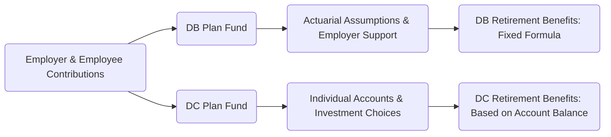

## 11.1 Employer-Sponsored Pension Plans

Employer-sponsored pension plans are critical components of Canada’s retirement savings system. They complement personal savings (such as Registered Retirement Savings Plans, or RRSPs) and government benefits (such as the Canada/Quebec Pension Plan and Old Age Security) to help ensure long-term financial stability for Canadian workers. In this section, we examine the fundamentals of employer-sponsored pension plans, their regulatory framework, and the different plan structures commonly offered in Canada.

---

### Introduction to Employer-Sponsored Pension Plans

Employer-sponsored pension plans (often called “registered pension plans”) are arrangements in which employers contribute funds to provide retirement income to their employees. Depending on the plan design, the employee may also contribute. These plans are governed by:

• Federal or provincial pension legislation (e.g., Pension Benefits Standards Act, 1985 [PBSA] for federally regulated plans, or a provincial pension benefits act).  
• Tax rules under the Income Tax Act (Canada) that impose contribution limits and other requirements.  

The primary goal of an employer-sponsored pension plan is to provide employees with a measure of financial security in retirement. By pooling contributions and investing assets over the long term, these plans aim to generate sufficient funds to support participants once they exit the workforce.

---

### Major Types of Employer-Sponsored Pension Plans

Three main types of employer-sponsored pension plans are prevalent in Canada:

1. **Defined Benefit (DB) Plans**  
2. **Defined Contribution (DC) Plans**  
3. **Hybrid or Combination Plans**

Each plan type offers unique features, risks, and opportunities.

#### Defined Benefit (DB) Plans

A Defined Benefit plan promises a specific retirement payout, often based on a formula that considers factors such as an employee’s final (or average) earnings, years of service, and a benefit multiplier. A typical example might be:


\text{Annual Pension} = 2\% \times \text{Years of Service} \times \text{Final Average Earnings}


• **Employer’s Role and Risk**: The employer is responsible for ensuring the plan is sufficiently funded to meet its future obligations. Investment risk lies primarily with the employer, as employees receive a predetermined benefit regardless of market performance.  
• **Actuarial Valuations**: To assess whether the plan has sufficient assets to meet its obligations, a professional actuary regularly conducts valuations incorporating assumptions about mortality rates, investment returns, and interest rates.  
• **Types of DB Formulas**:  
  - Flat-Benefit Plans: A fixed dollar amount per year of service.  
  - Career Average Plans: Benefits are based on an individual’s average earnings over their entire career with the employer.  
  - Final Average Plans: Benefits are typically based on the final (or best) average earnings over a specific period (e.g., last five years).  
  - Combination Formulas: Blend features of multiple approaches.

#### Defined Contribution (DC) Plans

In a Defined Contribution plan, contributions made by the employer (and often the employee) are allocated to an individual account in the employee’s name. The final retirement benefit depends on the amount contributed and the investment performance over time.

• **Employee’s Role and Risk**: The employee decides—or selects among several available options—how to invest contributions. Investment risk lies primarily with the employee, as the account value at retirement will depend on market returns.  
• **Funding**: Funding is more straightforward in a DC plan because contributions are fixed (e.g., a percentage of salary or a defined dollar amount).  
• **Investment Options**: Employers often offer multiple funds (e.g., target-date funds, balanced funds, equity-only funds) to cater to different risk tolerances. Some large employers partner with major Canadian financial institutions like RBC or TD to manage plan assets, providing employees with professionally managed portfolios.

#### Hybrid or Combination Plans

Hybrid plans integrate attributes of both DB and DC structures. Typical examples include:

• **DB Underpin**: A minimum guaranteed DB benefit is provided, supplemented by DC contributions if the DC portion performs well.  
• **Combination Formula**: Part of the benefit is calculated on a DB basis, and part on a DC basis.  

These plans aim to offer employees the predictable benefit of a DB arrangement and the growth potential of a DC account.

---

### Key Concepts and Terminology

In addition to understanding basic plan structures, it’s important to grasp several key concepts in employer-sponsored pension plans:

#### Vesting

Vesting refers to the point at which an employee’s accrued pension benefits cannot be lost—even if they leave the employer. Canadian jurisdictions typically require a short vesting period or immediate vesting. For instance, some provinces mandate full vesting after just two years of plan membership.

#### Locking-In

Most vested pension funds in a registered pension plan are locked in, meaning they cannot be withdrawn as a lump sum (except under specific circumstances, like certain financial hardships or shortened life expectancy, and subject to provincial regulations). Locking-in safeguards retirement savings by ensuring they are used for their intended purpose—generating retirement income.

#### Portability

When employees change jobs, they can often transfer their vested benefits to a new employer’s plan (if allowed) or to a locked-in retirement account (LIRA). Portability rules vary by jurisdiction, but the general aim is to preserve accrued savings and give employees the flexibility to continue building pension benefits with new employers or in personal locked-in vehicles.

#### Pension Plan Funding

• **DB Plans**: Employers typically engage with actuaries who determine required contributions to keep the plan solvent. These calculations factor in mortality rates, investment returns, interest rates, and other assumptions.  
• **DC Plans**: The funding obligation is transparent—employers (and employees, if applicable) contribute at defined rates, usually tied to salary.  

In Canada, regulators require regular funding valuations. If the plan is underfunded, employers may need to make special payments to address shortfalls.

#### Surpluses and Deficits

Like any investment pool, pension plans can experience surpluses (when assets exceed liabilities) or deficits (when liabilities exceed assets).

• **Deficits**: If a DB plan runs a deficit, the employer must typically make supplemental contributions to restore adequacy under legislative timelines.  
• **Surpluses**: Surpluses may create complex governance issues. In some cases, plan documents or regulations stipulate how surpluses are handled—through contribution holidays, distribution to plan members, or other mechanisms.

---

### Diagram: Comparing DB and DC Pension Flows

Below is a simplified diagram illustrating the flows of contributions, investment returns, and retirement payouts in DB versus DC plans.

• **DB Plan Flow**: Contributions go into a pooled fund, which is monitored against actuarial assumptions. The employer guarantees a specific benefit.  
• **DC Plan Flow**: Contributions are deposited into individual accounts, where investment growth determines the final benefit.

---

### Practical Examples and Case Studies

#### Example A: Large Canadian Bank Defined Benefit Plan

Consider a large Canadian bank offering a final average DB plan. The plan promises 1.5% × years of service × final average earnings (over five years) as the annual pension. The bank regularly reviews actuarial reports and adjusts contributions to ensure the plan remains fully funded. Employees enjoy the security of a predictable pension, knowing that fluctuations in investment markets will not directly affect their promised benefit.

#### Example B: Technology Firm with a Defined Contribution Plan

A medium-sized tech company partners with RBC to provide a DC pension plan. Both the employer and employees contribute 5% of the employee’s salary to an individual pension account. Employees can select from funds managed by RBC, such as a balanced fund or an equity fund, depending on their risk preference. The company provides regular education sessions, emphasizing the importance of diversification.

#### Example C: Hybrid Arrangement in Manufacturing

A manufacturing group offers a hybrid plan: a base DB guarantee based on flat benefits per year of service plus a supplemental DC account. The DC portion is invested in funds offered by TD Asset Management, while the DB portion ensures employees receive a minimum lifetime pension. This structure aims to balance the employer’s risk while providing a base level of retirement security to the workforce.

---

### Best Practices, Pitfalls, and Challenges

• **Employee Education**: Many employees fail to fully understand their pension plan. Holding education sessions and providing online tools (e.g., an open-source retirement calculator) can improve engagement and help employees make better decisions about contribution levels and investment choices.  
• **Regulatory Compliance**: Pension legislation and tax rules can be intricate. Employers must ensure their plan documents comply with provincial or federal legislation and with the Income Tax Act. Failure to do so can result in regulatory penalties.  
• **Funding Volatility**: DB plan sponsors face volatility in contributions due to changes in interest rates, market returns, and actuarial assumptions. Unexpected deficits may require large additional contributions, putting pressure on the employer’s finances.  
• **Administrative Complexity**: Hybrid plans often entail more complex governance, requiring specialized administrative software and robust oversight to ensure members’ entitlements are calculated accurately.  
• **Portability Considerations**: Employees who frequently change jobs need to be aware of vesting rules and transfer options. Advisors can help clients navigate portability to avoid unintended tax consequences and keep retirement savings on track.

---

### Regulatory Framework and Additional Resources

Canadian pension plans are subject to legislation and regulations from multiple layers of government. The primary frameworks include:

• **Income Tax Act (Canada)**: Sets tax treatment, contribution limits, and registration requirements for pension plans.  
• **Pension Benefits Standards Act, 1985 (PBSA)**: Governs plans under federal jurisdiction, including certain interprovincial and multinational employers (e.g., telecommunications, airlines, and banks).  
• **Provincial Pension Legislation**: Each province has its own legislation (e.g., Ontario’s Pension Benefits Act) that oversees private-sector pension arrangements within that jurisdiction.  

Advisors looking to refine their expertise should consult the following:

• Government of Canada’s webpage on “[Registered Pension Plans](https://www.canada.ca/en/services/benefits/publicpensions/cpp/retirement-income-sources.html)”  
• [Pension Benefits Standards Act, 1985 (PBSA)](https://laws-lois.justice.gc.ca/eng/acts/P-7.01/)  
• Provincial pension acts (e.g., [Ontario’s Pension Benefits Act](https://www.ontario.ca/laws/statute/90p08))  
• [Canadian Investment Regulatory Organization (CIRO)](https://www.ciro.ca/) guidelines for advisors serving employer-sponsored pension clients  
• Texts such as “Canadian Pension Law” by Ari Kaplan or “Canadian Pensions and Retirement Income Planning” from IFSE Institute  
• Online pension governance courses from organizations like the [International Foundation of Employee Benefit Plans](https://www.ifebp.org)

---

### Summary and Key Takeaways

Employer-sponsored pension plans are vital for many Canadians’ retirement security. Different plan structures—DB, DC, or hybrid—carry distinct risk profiles and funding mechanisms. Understanding vesting, locking-in, portability, and funding is essential for practitioners who advise on retirement solutions. Advisors can add value by guiding clients through plan complexities, ensuring compliance with legislation, and helping match plan structure to retirement goals.

• **Defined Benefit (DB) Plans**: Fixed payout, employer bears most risk.  
• **Defined Contribution (DC) Plans**: Variable payout, employee bears most risk.  
• **Hybrids**: Combine elements of DB and DC.  
• **Key Concepts**: Vesting, locking-in, portability, funding, surpluses, deficits.  
• **Regulatory Oversight**: Governed by federal or provincial pension legislation and the Income Tax Act.  

By staying informed about legislative changes and best practices, financial professionals can help employers and employees make the most of employer-sponsored pension plans—maximizing retirement security and financial well-being.

---

## Test Your Knowledge: Employer-Sponsored Pension Plans Quiz



### Which of the following is a characteristic of Defined Benefit (DB) plans?

- [x] The employer is responsible for ensuring the plan is adequately funded, and the benefit is predetermined.
- [ ] The employee bears all the investment risk.
- [ ] Contributions are based solely on a fixed percentage of salary.
- [ ] Employees manage their own accounts with multiple investment options.

> **Explanation:** In DB plans, the employer bears the investment risk and promises a predetermined payout. Regular actuarial valuations are conducted to maintain adequate funding.

### Under a Defined Contribution (DC) plan, the retirement benefit an employee receives depends primarily on:

- [x] The amount contributed and the investment performance of those contributions.
- [ ] A guaranteed percentage of their final average salary.
- [x] The timing and choice of investment options.
- [ ] The plan’s surplus amount at retirement.

> **Explanation:** DC plans focus on individual accounts. The final amount is influenced by contribution totals and investment returns, and employees often choose how to invest.

### What is vesting in the context of employer-sponsored pension plans?

- [x] When an employee’s accrued pension benefits become non-forfeitable.
- [ ] When the employer is required to stop contributing to the plan.
- [ ] When an employee reduces their hours and starts partial retirement benefits.
- [ ] The process of allocating surplus funds to employees.

> **Explanation:** Vesting awards ownership of pension benefits to the employee, ensuring they remain entitled to these benefits if they leave the company.

### Which statement best describes locking-in?

- [x] It is a restriction that typically prevents an employee from withdrawing pension funds before retirement, except under limited circumstances.
- [ ] It is an option allowing the employer to terminate the plan without further obligations.
- [ ] It allows employees to withdraw a lump sum at any time.
- [ ] It is only relevant for hybrid pension plans.

> **Explanation:** Locking-in ensures the retirement savings remain dedicated to retirement income and cannot be casually accessed.

### In a Defined Benefit plan, a deficit occurs when:

- [x] The plan’s liabilities exceed its assets.
- [ ] Returns on investment exceed the target funding level.
- [x] Current actuarial valuations show the plan’s assets are inadequate to meet future obligations.
- [ ] The employer decides to reduce its contributions to zero.

> **Explanation:** A DB plan deficit indicates that the plan’s funded status is below the level needed to meet all projected obligations. Employers must usually compensate by making extra contributions.

### Which plan design typically offers a minimum guarantee alongside a contribution-based element?

- [x] Hybrid or combination plan.
- [ ] Pure DB plan.
- [ ] Pure DC plan.
- [ ] A group RRSP arrangement only.

> **Explanation:** A hybrid plan can have a base (DB) guarantee plus individual accounts (DC), combining elements of both structures.

### A technology company using a DC plan partnered with RBC for investment management. Which best practice should they follow?

- [x] Provide employee education and multiple investment choices.
- [ ] Eliminate all investment choice to reduce complexity.
- [x] Limit employees to low-risk government bonds only.
- [ ] Restrict employees from making changes to their portfolio.

> **Explanation:** Employers offering DC plans should promote informed decision-making, allowing employees to choose from various investment options aligned with their risk tolerance.

### When employees change jobs, portability allows them to:

- [x] Transfer their vested pension benefits to a locked-in vehicle.
- [ ] Forfeit all accrued pension benefits automatically.
- [ ] Convert DB plans to DC plans without restrictions.
- [ ] Withdraw their entire pension balance in cash, penalty-free.

> **Explanation:** Portability enables the transfer of vested benefits into either the new employer’s pension plan (if allowed) or a locked-in retirement account (LIRA).

### Which piece of legislation primarily governs funding and administration of federally regulated pension plans?

- [x] Pension Benefits Standards Act, 1985 (PBSA).
- [ ] Ontario Pension Benefits Act (PBA).
- [ ] Income Tax Act, solely.
- [ ] Employment Standards Act.

> **Explanation:** Federally regulated pension plans must comply with the requirements of the PBSA. Provincial legislation (like Ontario’s PBA) applies to most provincially regulated plans.

### True or False: In a Defined Contribution plan, the employer bears the majority of the investment risk.

- [ ] True
- [x] False

> **Explanation:** In a DC plan, the employee generally bears the investment risk because the final benefit depends on market performance of their individual account.



---

## For Additional Practice and Deeper Preparation

**[1. WME Course For Financial Planners (WME-FP): Exam 1](https://www.udemy.com/course/csi-wme-fp-exam1/?referralCode=1A23C67E56971C0A73D5)**  
• Dive into 6 full-length mock exams—1,500 questions in total—expertly matching the scope of WME-FP Exam 1.  
• Experience scenario-driven case questions and in-depth solutions, surpassing standard references.  
• Build confidence with step-by-step explanations designed to sharpen exam-day strategies.

**[2. WME Course For Financial Planners (WME-FP): Exam 2](https://www.udemy.com/course/csi-wme-fp-exam2/?referralCode=25879CCDED7B7905BBA8)**  
• Tackle 1,500 advanced questions spread across 6 rigorous mock exams (250 questions each).  
• Gain real-world insight with practical tips and detailed rationales that clarify tricky concepts.  
• Stay aligned with CIRO guidelines and CSI’s exam structure—this is a resource intentionally more challenging than the real exam to bolster your preparedness.

> Note: While these courses are specifically crafted to align with the WME-FP exam outlines, they are independently developed and not endorsed by CSI or CIRO.
