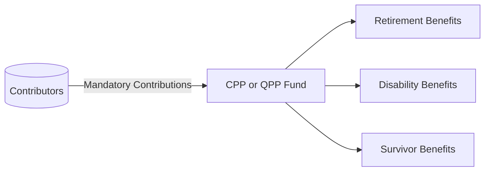
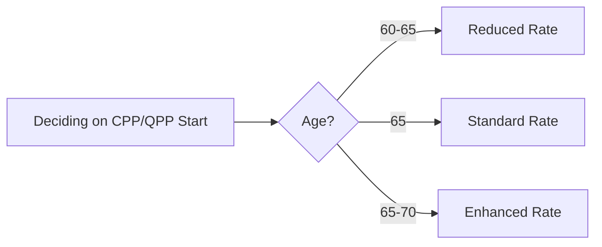

## 12.1 Canada and Quebec Pension Plans

The Canada Pension Plan (CPP) and the Quebec Pension Plan (QPP) are cornerstone public pension programs in Canada. Both are mandatory contributory plans that provide retirement, disability, and survivor benefits to eligible Canadians. Though governed by separate authorities, they share many structural features and objectives. A thorough understanding of these programs is essential for wealth advisors assisting clients with comprehensive retirement and estate planning.

---

### Overview of the CPP and QPP

#### Background and Purpose

• The Canada Pension Plan (CPP) was established in 1965, covering Canada outside Quebec.  
• The Quebec Pension Plan (QPP) started in 1966, covering Quebec residents.  
• Both plans serve the same primary goal: to provide retirement income replacement to contributors, easing financial uncertainty for Canadians during retirement.  
• Beyond retirement benefits, the plans also offer disability and survivor benefits, supporting Canadians in case of severe and prolonged disability or the death of a contributor.  

#### Key Similarities and Differences

Although CPP and QPP are closely aligned, a few operational characteristics may differ:

• Contribution Rates: Quebec has its own schedule, which may slightly differ from CPP rates.  
• Benefit Calculations: While fundamentally similar, subtle variances exist in formulas and additional provisions.  
• Administration:  
  - CPP: Administered by the federal government.  
  - QPP: Administered by Retraite Québec.  

Below is a simple diagram outlining the basic structure of these plans:

**Figure 1**: High-level flow of contributions and benefits under the CPP/QPP.

---

### Eligibility and Coverage

#### Who Must Contribute?

• Canadians age 18 or older, with annual earnings above a specified minimum threshold, typically must contribute to CPP/QPP.  
• Workers outside Quebec contribute to the CPP, while workers in Quebec contribute to the QPP.  

#### Employer and Employee Contributions

• Employees pay half of the contribution; the employer matches the other half.  
• Self-employed individuals pay both the employee and employer shares.  
• The mandatory nature ensures wide coverage and a relatively stable funding base.

---

### Contributions and Benefit Calculation

#### Contribution Thresholds

Both CPP and QPP contributions are based on:

• A Year’s Basic Exemption (YBE): This is a lower threshold below which no contributions are required.  
• The Year’s Maximum Pensionable Earnings (YMPE or MPE for QPP): This is the upper limit on annual earnings used to calculate contributions.  

These thresholds are revised periodically by the federal government (CPP) or the Québec government (QPP).

#### Calculating Retirement Benefits

Retirement benefits are determined primarily by an individual’s:

• Average lifetime earnings within pensionable earnings limits.  
• Contribution history (i.e., the duration and consistency of contributions).  
• Age when benefits begin (ranging from age 60 to 70).  

#### Dropout Provisions

To preserve fairness and account for life circumstances, certain provisions allow for the exclusion of specific periods of lower or no earnings from the benefit calculation base:

• Child Rearing Provision (CPP): Excludes years of low/no earnings when caring for a child under age seven.  
• General Dropout: Allows for a fixed percentage of the lowest earning years to be removed automatically.

For instance, consider Jane, who spent five years out of the workforce starting at age 30 to raise two young children. By executing the Child Rearing Provision, those five years may be excluded in calculating her CPP benefits, effectively boosting her average career earnings for benefit calculation.

---

### Retirement Benefits

#### Standard Retirement at Age 65

• The standard age to draw CPP/QPP retirement benefits is 65, with no permanent penalty or bonus applied to the benefit amount.

#### Early Retirement (As Early as Age 60)

• Individuals may elect to begin receiving reduced benefits as early as age 60.  
• The reduction factor is a permanent monthly rate, currently 0.6% per month for CPP (and a proportional rate for QPP), lowering the lifetime benefit to account for the longer payout period.

#### Delayed Retirement (Up to Age 70)

• Individuals who defer starting their pension beyond 65 enjoy a permanent monthly increase in their benefits.  
• The enhancement rate is 0.7% per month up to a maximum of five years (for CPP). This incentivizes Canadians who can afford to wait to receive a larger monthly benefit.  

Use the following decision tree as a guide:

**Figure 2**: High-level decision process for retirement benefit timing.

---

### Disability Benefits

For those who become severely and persistently disabled:

• Eligibility requires sufficient contributions in the years preceding disability and a medically recognized condition that prevents routine work.  
• Benefits comprise a flat-rate portion plus an earnings-related portion.  
• If eligible, disability beneficiaries automatically transition to retirement benefits at age 65 (or remain on disability under QPP rules until the QPP benefit transitions similarly).

---

### Survivor Benefits

#### Lump-Sum Death Benefit

• A one-time payment to the estate of a deceased contributor, capped at a maximum (often around $2,500 for CPP).  
• For QPP, the rate may differ slightly, but the principle is similar.

#### Survivor’s Pension

• A monthly pension for the deceased’s spouse or common-law partner.  
• The amount depends largely on the deceased’s contribution history and the survivor’s age.  
• Additional benefits may be available for dependent children.

---

### Pension Sharing and Credit Splitting

#### Pension Sharing

• Married or common-law couples receiving CPP/QPP can share pension benefits to optimize tax and household cash flow.  
• This strategy is often used to minimize overall taxable income and may help reduce the couple’s combined tax burden.

#### Credit Splitting

• If a marriage or common-law relationship ends, pension credits accumulated by either partner during the relationship can be split.  
• This ensures that both individuals fairly benefit from the contributions made during their time together.  
• In Ontario, for instance, a divorcing couple might coordinate credit splitting to ensure an equitable distribution of future pension payment entitlements.

---

### Special Considerations and Strategies

1. **Working Beneficiaries:**  
   • Individuals who continue to work while receiving CPP/QPP may choose to keep contributing until age 70, boosting their post-retirement benefit.  
   • This approach can yield a higher monthly payout during later retirement years, beneficial for those aiming to catch up on savings.  

2. **Planning Oliver’s Case** (Example Scenario):  
   • Oliver, 63, is enticed by an early retirement package at RBC (Royal Bank of Canada). He wonders if he should start his CPP at 63 or wait until 65—or even 70.  
   • By calculating his break-even point, Oliver observes that deferring until 65 might yield a higher monthly benefit, but it will take several years to surpass the cumulative total he would have received had he taken it earlier.  
   • If Oliver’s health is good and his life expectancy above average, delaying starting benefits might maximize his lifelong retirement income.

3. **Estate Considerations:**  
   • While CPP/QPP is largely non-transferable, survivor benefits provide limited continuity.  
   • Advisors should guide clients to structure their overall estate plan (including RRSPs, TFSAs, and private pensions) to ensure stable financial resources for beneficiaries.

---

### Glossary

• **Dropout Provisions:** Rules that exclude periods of low/no earnings from the pensionable earnings calculation, increasing the final pension.  
• **Child Rearing Provision (CPP):** Allows low- or zero-earnings years when caring for children under age seven to be excluded from benefit calculations.  
• **Pensionable Earnings:** The annual earnings (up to a specified maximum) on which CPP/QPP contributions are calculated.  
• **Working Beneficiaries:** Individuals who continue to work and contribute while receiving retirement benefits, thereby earning additional post-retirement benefits.  

---

### Best Practices and Common Pitfalls

1. **Timely and Accurate Contributions:**  
   - Ensure clients and their employers remit the correct contributions on time, since any missed or inaccurate data can reduce future benefits.  

2. **Strategic Benefit Start Date:**  
   - A common pitfall is electing to take CPP/QPP too early without a thorough analysis of break-even points, expected longevity, and alternative income sources.  

3. **Coordinating Other Retirement Income Sources:**  
   - Failing to consider how CPP/QPP integrates with private pensions, RRSPs, or TFSAs could lead to an inefficient tax strategy.  

4. **Forgetting Child Rearing and Dropout Provisions:**  
   - Overlooking eligibility for these provisions can significantly reduce monthly benefits.  

---

### References and Further Resources

• **Official Government of Canada – Canada Pension Plan:**  
  [https://www.canada.ca/en/services/benefits/publicpensions/cpp.html](https://www.canada.ca/en/services/benefits/publicpensions/cpp.html)

• **Government of Quebec – Quebec Pension Plan:**  
  [https://www.retraitequebec.gouv.qc.ca](https://www.retraitequebec.gouv.qc.ca)

• **CIRO (Canadian Investment Regulatory Organization) guidelines:**  
  [https://www.ciro.ca](https://www.ciro.ca)

• **Financial Consumer Agency of Canada (FCAC) Retirement Planning Tools:**  
  [https://www.canada.ca/en/financial-consumer-agency/services/retirement-planning.html](https://www.canada.ca/en/financial-consumer-agency/services/retirement-planning.html)

• **Recommended Reading:**  
  - “The CPP and QPP Explained” by the Canadian Institute of Actuaries  
  - “Retirement Income Planning” by the Canadian Securities Institute (CSI)

---

### Summary

The Canada Pension Plan (CPP) and Quebec Pension Plan (QPP) are vital components of Canada’s public pension ecosystem. They serve as fundamental building blocks for retirement planning, disability coverage, and survivor benefits. Through mandatory contributions shared between employees and employers (or fully paid by the self-employed), these plans help Canadians build a reliable source of income later in life.

For financial planners, understanding the intricacies of eligibility, contribution thresholds, dropout provisions, and survivor and disability benefits is key to maximizing value for clients. Equally important are strategic decisions around the timing of benefits—particularly the trade-offs between early, standard, or delayed retirement payouts.

When incorporated alongside other retirement vehicles—like RRSPs, TFSAs, employer pension plans, and private investments—CPP/QPP becomes an integral part of a holistic retirement strategy. Advisors who guide clients in optimizing their public pension entitlements will help Canadians achieve sustainable and secure financial futures, which is the ultimate goal of wealth management in retirement planning.

---

## Canada and Quebec Pension Plans: Test Your Knowledge



### Which statement best describes the scope of coverage for the CPP?

- [x] It covers all Canadian provinces and territories except Quebec.  
- [ ] It only covers residents of Ontario and British Columbia.  
- [ ] It covers only municipal government employees in Ontario.  
- [ ] It covers self-employed individuals in Quebec exclusively.

> **Explanation:** The Canada Pension Plan covers most provinces and territories in Canada, whereas the Quebec Pension Plan covers residents of Quebec.

### When must Canadians start contributing to the CPP or QPP?

- [x] At age 18 if they earn above the minimum threshold.  
- [ ] As soon as they turn 16, regardless of earnings.  
- [ ] Only after they have four consecutive quarters of work.  
- [ ] Not until they reach age 65.

> **Explanation:** Both plans require mandatory contributions from individuals aged 18 and older, provided their annual earnings exceed the minimum threshold (Year’s Basic Exemption).

### How are self-employed individuals’ contributions to CPP/QPP handled?

- [ ] The government pays the entire amount for self-employed individuals.  
- [ ] Employees pay the amount, and self-employed individuals pay nothing.  
- [x] Self-employed individuals pay both the employee and employer portions.  
- [ ] Self-employed individuals only pay half of the premium.

> **Explanation:** Unlike employed individuals (who split contributions with their employer), self-employed Canadians must remit both portions of the contribution themselves.

### What is a key advantage of the Child Rearing Provision under CPP?

- [ ] It allows contribution deferrals for up to five years.  
- [x] It excludes lower or zero-earnings years for those caring for a child under seven.  
- [ ] It guarantees a full pension regardless of contributions.  
- [ ] It provides free childcare to working parents.

> **Explanation:** The Child Rearing Provision under CPP enables parents to omit low or zero-earning years from the calculation of benefits, potentially enhancing their pension amounts.

### What is the main effect of starting CPP/QPP benefits at age 60?

- [ ] A permanent increase in benefits.  
- [x] A permanent reduction in the monthly payout.  
- [ ] No change in benefits, as 60 is the standard age.  
- [x] A temporary reduction until age 65.

> **Explanation:** Electing to receive benefits early (before the standard age of 65) results in a permanent reduction, reflecting longer potential payout.

### Which of the following generally leads to higher CPP/QPP payouts?

- [x] Delaying the start of benefits beyond age 65.  
- [ ] Contributing fewer years but in larger amounts.  
- [ ] Taking the QPP at age 62 in Quebec.  
- [ ] Claiming at the earliest possible date.

> **Explanation:** Delaying receiving benefits past the standard retirement age (65) increases the monthly benefit through the plan’s enhancement rate, up to age 70.

### What is the primary goal of pension sharing under CPP/QPP?

- [ ] To combine two pensions into one larger benefit.  
- [ ] To reduce overall retirement income.  
- [x] To optimize tax advantages for married or common-law partners.  
- [ ] To transfer all contributions to one spouse.

> **Explanation:** Pension sharing helps couples redistribute benefits in a way that may reduce taxable income and optimize household finances.

### Why might a divorcing couple split CPP/QPP credits?

- [x] To ensure an equitable distribution of future pension benefits.  
- [ ] To limit both partners from receiving full benefits.  
- [ ] To avoid taxes on pension contributions.  
- [ ] To create new pension accounts without the partner’s knowledge.

> **Explanation:** Credit splitting provides a fair division of pension contributions earned during the marriage or common-law partnership, promoting equitable retirement income for both parties.

### Which group of individuals is most likely to qualify for disability benefits under CPP/QPP?

- [ ] Individuals with a mild and short-term injury.  
- [ ] Individuals with no contribution history.  
- [x] Individuals with a severe and prolonged disability preventing regular work.  
- [ ] Individuals working part-time only.

> **Explanation:** CPP/QPP disability benefits are designed for contributors whose medical condition severely limits or prevents them from engaging in substantial gainful employment on a regular basis.

### The QPP is the equivalent of the CPP for which group?

- [x] Quebec residents.  
- [ ] Ontario residents only.  
- [ ] Canadian citizens living abroad.  
- [ ] Self-employed individuals nationwide.

> **Explanation:** The QPP operates within the province of Quebec, mirroring the structure of CPP but administered by Retraite Québec.



---

## For Additional Practice and Deeper Preparation

**[1. WME Course For Financial Planners (WME-FP): Exam 1](https://www.udemy.com/course/csi-wme-fp-exam1/?referralCode=1A23C67E56971C0A73D5)**  
• Dive into 6 full-length mock exams—1,500 questions in total—expertly matching the scope of WME-FP Exam 1.  
• Experience scenario-driven case questions and in-depth solutions, surpassing standard references.  
• Build confidence with step-by-step explanations designed to sharpen exam-day strategies.

**[2. WME Course For Financial Planners (WME-FP): Exam 2](https://www.udemy.com/course/csi-wme-fp-exam2/?referralCode=25879CCDED7B7905BBA8)**  
• Tackle 1,500 advanced questions spread across 6 rigorous mock exams (250 questions each).  
• Gain real-world insight with practical tips and detailed rationales that clarify tricky concepts.  
• Stay aligned with CIRO guidelines and CSI’s exam structure—this is a resource intentionally more challenging than the real exam to bolster your preparedness.

> Note: While these courses are specifically crafted to align with the WME-FP exam outlines, they are independently developed and not endorsed by CSI or CIRO.
