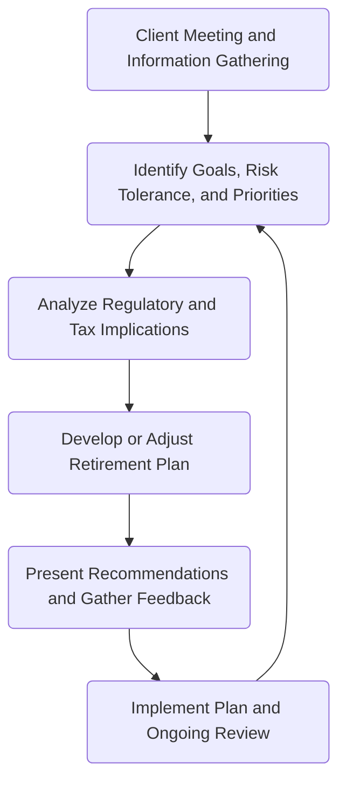

## 13.4 Questions to Consider When Advising Clients on Retirement Planning Process

A comprehensive retirement strategy hinges on asking the right questions at the outset—and revisiting these questions regularly. By maintaining open communication, advisors ensure the retirement plan stays aligned with clients’ goals, life events, and evolving regulatory environments in Canada. This section explores the most critical questions to ask clients, providing a robust framework to uncover needs, clarify objectives, and identify potential gaps in retirement planning.

---

### The Importance of Client-Centric Dialogue

Retirement planning is a dynamic process. From the initial discovery to ongoing review, advisors must probe deeper than basic financials. Clients often have diverse aspirations—some may dream of extensive travel, while others aim to leave a significant legacy to family or charities. An advisor’s skill lies in uncovering these nuances and incorporating them into a robust financial plan. As part of Canada's Know Your Client (KYC) rules—overseen by the Canadian Investment Regulatory Organization (CIRO) and provincial regulators—an ongoing dialogue ensures compliance, fosters transparency, and ultimately improves plan outcomes.

---

### Key Questions to Explore with Clients

Below are seven guiding questions to stimulate meaningful conversations:

1. **“What are your core retirement objectives and priorities (e.g., travel, family support, legacy)?”**  
   • Clients may have multiple goals—funding grandchildren’s education, embarking on world travel, or contributing to social causes.  
   • Advisors can create tailored solutions: for instance, a mix of income-generating products and growth-oriented investments to balance short-term cash flow with long-term wealth accumulation.  
   • Pension funds operated by large institutions like RBC or TD often emphasize a blended approach, reflecting diverse participant goals. Understanding each client’s personal objectives helps replicate a similar tailored methodology.

2. **“Do you anticipate maintaining a part-time job or consulting business after you retire?”**  
   • Part-time work can provide supplemental income and help clients stay socially active.  
   • Changes in tax obligations: Income from part-time jobs or consulting could affect federal or provincial benefit eligibility, as well as marginal tax rates.  
   • Advisors might consider strategies like contributing to a Tax-Free Savings Account (TFSA) or adjusting withdrawals from Registered Retirement Savings Plans (RRSPs) to preserve government benefits.

3. **“Have you considered potential healthcare costs and how you might fund them?”**  
   • Healthcare expenses in Canada—especially if private or specialized care is required—can significantly impact retirement savings.  
   • Health insurance products and critical illness coverage may mitigate large out-of-pocket costs.  
   • Financial models that account for long-term care expenses should be included in retirement projections to avoid shortfalls.

4. **“Are you aware of the potential risks of outliving your assets? How comfortable are you with investment and longevity risks?”**  
   • Longevity risk—outliving one’s savings—remains a prevalent concern, particularly as life expectancies increase.  
   • Strategies such as annuities, Guaranteed Minimum Withdrawal Benefit (GMWB) plans, or diversified portfolios can help mitigate longevity risk.  
   • Advisors should explore “what-if” scenarios (e.g., living beyond age 90 or 100) and incorporate inflation adjustments and potential medical costs into forecasts.

5. **“Do you know the rules surrounding federal or provincial pension programs, including any clawback provisions?”**  
   • Understanding Old Age Security (OAS) clawbacks, Canada Pension Plan (CPP) or Québec Pension Plan (QPP) entitlement options, and pension splitting can help optimize retirement income.  
   • Strategic timing of CPP/QPP benefits—whether taken at 60, 65, or 70—can materially influence total lifetime benefits.  
   • Advisors must stay updated on legislative changes through bodies like the Ontario Securities Commission (OSC) or the Autorité des marchés financiers (AMF).

6. **“Should we account for potential major life events, such as changing housing needs or relocating?”**  
   • A client’s decision to downsize, relocate to a different province, or move abroad can substantially alter retirement cash flows and asset allocations.  
   • Real estate considerations and bridging strategies (e.g., lines of credit) for transitional periods may be vital.  
   • Succession planning for real estate might also be necessary, especially if clients wish to bequeath property to beneficiaries.

7. **“How comfortable are you with the variability in investment returns, and have we structured your portfolio to align with your risk tolerance?”**  
   • Clients’ risk tolerance often shifts as they approach or enter retirement. A more conservative portfolio may be warranted, but it should still balance the potential for growth to fight inflation.  
   • Tools such as Monte Carlo simulations—available through open-source financial software—help illustrate how different asset allocations perform under various market conditions.  
   • Ongoing reviews ensure the portfolio continues to match the client’s preferences and time horizon.

---

### Common Insights Revealed by These Questions

• **Expectations about Lifestyle:** A client may plan to travel frequently in early retirement but slow down in later years, influencing cash-flow modeling.  
• **Personal Beliefs and Legacy Goals:** Some clients may be passionate about charitable giving, prompting a need for philanthropic strategies or donor-advised funds.  
• **Financial Blind Spots:** Issues like healthcare funding or inflation concerns often surface promptly when advisors systematically explore client objectives.  
• **Regulatory and Tax Implications:** Federal and provincial regulations affect RRSP withdrawals, pension clawbacks, and tax credits, all of which may alter plan feasibility and minimize tax leakage.

---

### A Visual Overview of the Retirement Planning Dialogue

Below is a simple Mermaid diagram illustrating the iterative nature of these conversations:

**Figure Explanation:**
1. The cycle starts at “Client Meeting and Information Gathering” (A).  
2. Detailed questions help identify goals and risk tolerance (B).  
3. Advisors then analyze how pension rules, taxes, and regulations influence strategies (C).  
4. Once analysis is complete, the advisor formulates or refines the plan (D).  
5. The plan is presented for discussion and fine-tuned based on feedback (E).  
6. Implementation followed by continuous monitoring ensures timely adjustments as the client’s goals or external circumstances change (F → B).

---

### Best Practices and Probable Challenges

• **Frequent Check-ins:** Beyond annual reviews, advisors should initiate conversations whenever significant life events occur—marriage, divorce, death of a spouse, or major medical issues.  
• **Encouraging Realistic Expectations:** Some clients may underestimate lifestyle costs or overshoot investment returns.  
• **Integrating Multiple Products:** Balancing annuities, segregated funds, and standard brokerage accounts can be challenging. A robust plan outlines how each product supports the broader retirement objective.  
• **Staying Informed on Regulatory Updates:** Clawback thresholds, pension increments, and new government initiatives (e.g., expansions to CPP benefits) directly impact the client’s feasibility analysis.

---

### Documenting and Revisiting Key Questions

Advisors should record client responses meticulously and revisit them during subsequent reviews. Goals and circumstances can shift subtly over time, and regulatory frameworks may change. Keeping a consistent record of these questions and answers:

• **Facilitates Compliance:** Aligns with CIRO KYC obligations.  
• **Enhances Accuracy:** Ensures updated assumptions in financial models.  
• **Strengthens Client Relationship:** Demonstrates an ongoing commitment to client-centric service.

---

### Glossary

- **Client-Centric Approach:** An advising philosophy where decisions and strategies are tailored specifically to each client’s personal goals, risk tolerance, and life situation.  
- **Legacy:** The net assets or values an individual wishes to pass on to heirs or charities. Effective legacy planning may involve trusts, wills, or named beneficiaries on registered accounts.  
- **Risk Tolerance:** A client’s level of comfort with fluctuations in investment returns and potential capital losses. Risk tolerance often shifts with age, life changes, or market experiences.

---

### Practical Examples and Case Studies

• **Case Study: RBC Pension Fund Modeling**  
  Suppose an RBC client nearing retirement has a mix of an employer pension, RRSPs, and TFSAs. The client’s goals include moderate travel and leaving a modest inheritance to children. By asking the above questions, the advisor uncovers that the client also wants to fund private healthcare insurance. The RBC financial planning tool calculates that drawing down RRSP assets too quickly may trigger OAS clawbacks. The advisor adjusts withdrawals, layering in TFSA distributions to maintain income but stay under clawback thresholds.

• **TD Wealth Management Example**  
  A self-employed consultant, working with TD Wealth Management, plans to reduce client projects at age 65 but continue light consulting work. Tracking the client’s ongoing business income helps identify how much can be contributed to a TFSA to optimize tax efficiency. Additionally, the advisor’s question about major life events reveals a plan to relocate to another province, prompting a review of provincial pension rules and property taxes.

---

### Step-by-Step Guidance

1. **Initial Discovery Meeting:** Use probing questions to determine the client’s big-picture retirement vision.  
2. **Financial Data Collection:** Gather information on current assets, liabilities, income sources, expenses, and anticipated lifestyle changes.  
3. **Scenario Analysis:** Apply sensitivity analyses (e.g., interest rate shifts, market downturns, health expenses) to gauge plan resilience.  
4. **Regulatory Check:** Incorporate up-to-date rules on CPP/QPP, OAS clawbacks, and tax credits.  
5. **Action Plan Development:** Propose strategies for asset allocation, insurance coverage, estate transfers, and the timing of government benefits.  
6. **Implementation and Ongoing Monitoring:** Execute the plan and schedule regular check-ins—or upon major life events—to update assumptions.

---

### Additional Resources

• **CIRO (Canadian Investment Regulatory Organization) Guidance:** Best practices and continuous education offerings for KYC in retirement planning discussions.  
• **CSA (Canadian Securities Administrators) Notices:** For updated investor protection measures and legislative changes across provinces.  
• **Provincial Regulators (OSC, AMF, etc.):** Websites contain consumer alerts, rule updates, and compliance resources for advisors.  
• **Moody’s Analytics Global Education (Canada) Inc.:** Offers continuing education modules on advanced retirement planning, portfolio modeling, and risk management.  
• **“16 Personal Finance Principles Every Investor Should Know” by Scott Plous:** Provides broader financial context and practical insights that can complement retirement planning conversations.  
• **Open-Source Financial Tools:** Platforms like Gnucash or AGPL-licensed spreadsheet templates can support scenario analysis and reporting for small advisory practices.

---

## Quiz: Key Questions for Effective Retirement Planning



### Which question best helps uncover a client’s goals for retirement?
- [ ] “Are you interested in charitable giving?”  
- [x] “What are your core retirement objectives and priorities (e.g., travel, family support, legacy)?”  
- [ ] “Do you want to buy a property next year?”  
- [ ] “What is your current job title?”  

> **Explanation:** Broad, open-ended questions about core retirement objectives and priorities allow the advisor to probe deeper into multiple facets of the client’s retirement goals.

### Why is it important to ask about part-time work in retirement?
- [ ] It ensures the client will not withdraw from their RRSPs.  
- [x] It helps project additional income sources and potential tax implications.  
- [ ] It guarantees eligibility for government benefits.  
- [ ] It prevents OAS clawbacks.  

> **Explanation:** Knowing whether a client anticipates part-time work or consulting lets the advisor model extra income, potentially affecting tax brackets and benefit eligibility.

### What is one potential risk of not considering healthcare costs in retirement?
- [ ] The client will automatically qualify for free long-term care.  
- [ ] The client may have excess savings.  
- [x] Unforeseen medical expenses could deplete retirement funds faster than planned.  
- [ ] The client would not qualify for Canada Pension Plan benefits.  

> **Explanation:** Healthcare needs can evolve, potentially incurring significant costs that can erode savings if not factored into retirement budgeting and insurance strategies.

### Which Canadian regulatory body oversees Know Your Client (KYC) rules for retirement planning discussions?
- [ ] Bank of Canada  
- [x] Canadian Investment Regulatory Organization (CIRO)  
- [ ] Canada Revenue Agency (CRA)  
- [ ] Canada Mortgage and Housing Corporation (CMHC)  

> **Explanation:** CIRO is responsible for oversight of KYC obligations and other rules applicable to investment and retirement planning.

### How can awareness of OAS clawback provisions influence retirement planning decisions?  
- [ ] It eliminates the need for TFSAs.  
- [x] It helps structure income sources to minimize the clawback.  
- [ ] It guarantees full OAS benefits.  
- [x] It can shape the timing of RRSP withdrawals and TFSA contributions.  

> **Explanation:** Understanding OAS clawbacks allows advisors to balance registered withdrawals, non-registered income, and TFSA distributions for optimized retirement cash flow.

### What is longevity risk?
- [ ] The risk of retiring too late.  
- [ ] The risk of short-term market fluctuations.  
- [ ] The risk of missing out on tax credits.  
- [x] The risk of outliving one’s retirement savings.  

> **Explanation:** Longevity risk addresses increasing life expectancy and the possibility that retirees may deplete their assets before the end of their lives.

### Which factor might cause a client’s risk tolerance to shift significantly during retirement?
- [ ] The appointment of a new provincial regulator  
- [x] Major life events, such as death of a spouse or critical illness  
- [ ] A minor dip in the stock market  
- [x] Achieving a key financial goal earlier than expected  

> **Explanation:** Significant personal or financial events—positive or negative—can prompt a reevaluation of risk tolerance and investment strategy.

### Which statement best describes a client-centric approach?
- [x] An advising philosophy that tailors strategies to match each client’s goals and circumstances  
- [ ] A universal one-size-fits-all approach to limit complexity in planning  
- [ ] An investment-only solution ignoring any personal client goals  
- [ ] A punitive approach for clients not saving enough  

> **Explanation:** A client-centric approach ensures personal goals, preferences, and life stage inform recommendations, improving relevance and client satisfaction.

### Why is it important to revisit these retirement questions at each client review meeting?
- [ ] To reduce the client’s overall fees  
- [ ] To avoid compliance with regulators  
- [x] To capture any changes in the client’s goals, circumstances, or the regulatory environment  
- [ ] To ensure the client changes banks regularly  

> **Explanation:** Situations and regulations can shift. Regularly revisiting the central retirement questions keeps the plan current and aligned with the client’s evolving needs.

### A client has major concerns about fluctuating returns. Which of the following is TRUE?
- [x] Advisors should verify the client’s risk tolerance and align the portfolio accordingly.  
- [ ] The client must invest solely in equity ETFs.  
- [ ] The client should ignore registered plans.  
- [ ] Advisors must recommend a 100% cash position.  

> **Explanation:** Clients anxious about market volatility should be guided through risk profile assessments. Tailoring the portfolio to the client’s comfort level helps maintain confidence and reduce panic-driven decisions.



---

## For Additional Practice and Deeper Preparation

**[1. WME Course For Financial Planners (WME-FP): Exam 1](https://www.udemy.com/course/csi-wme-fp-exam1/?referralCode=1A23C67E56971C0A73D5)**  
• Dive into 6 full-length mock exams—1,500 questions in total—expertly matching the scope of WME-FP Exam 1.  
• Experience scenario-driven case questions and in-depth solutions, surpassing standard references.  
• Build confidence with step-by-step explanations designed to sharpen exam-day strategies.

**[2. WME Course For Financial Planners (WME-FP): Exam 2](https://www.udemy.com/course/csi-wme-fp-exam2/?referralCode=25879CCDED7B7905BBA8)**  
• Tackle 1,500 advanced questions spread across 6 rigorous mock exams (250 questions each).  
• Gain real-world insight with practical tips and detailed rationales that clarify tricky concepts.  
• Stay aligned with CIRO guidelines and CSI’s exam structure—this is a resource intentionally more challenging than the real exam to bolster your preparedness.

> Note: While these courses are specifically crafted to align with the WME-FP exam outlines, they are independently developed and not endorsed by CSI or CIRO.
