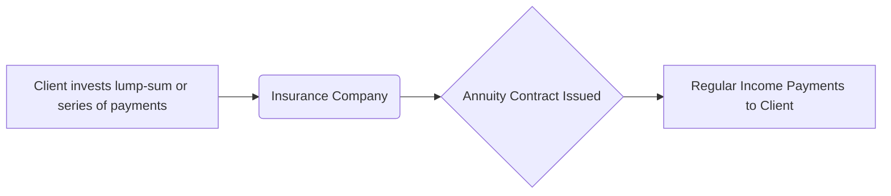

## 14.1 Understanding Annuities

Annuities are powerful investments that can play a vital role in retirement income strategies. In essence, they replace the unpredictability of investment returns with a reliable stream of income, guaranteed by a life insurance company. Before recommending or purchasing an annuity, financial planners should carefully evaluate the product’s specific characteristics and weigh the benefits against the associated costs and risks. This section explains annuities in depth, focusing on the Canadian context and offering practical guidance for wealth advisors.

---

### Overview of Annuities

An annuity is a contract between an annuitant (the purchaser) and a life insurance company. In Canada, life insurance companies such as RBC Insurance, TD Insurance, and other insurers offer annuity products designed to provide steady income streams during retirement. Examples of how annuities might be used include:

• Converting a portion of Registered Retirement Savings Plan (RRSP) funds into guaranteed income upon retirement.  
• Supplementing pension income for individuals needing predictable payments for life.  
• Managing longevity risk—that is, safeguarding against the risk of outliving one’s retirement savings.

Under typical arrangements, the annuitant either makes a lump-sum payment (single premium) or a series of payments to the life insurer. In exchange, the insurer promises to make regular payments to the annuitant, either starting immediately (immediate annuity) or at a future date (deferred annuity).

---

### Key Features and Structure

The core value of annuities rests on income guarantees. Some key features include:

1. **Payment Frequency**: An annuity’s payout schedule can be monthly, quarterly, semi-annually, or annually, providing flexibility for matching income needs.  
2. **Customization**: Options such as survivor benefits, indexing (i.e., cost-of-living adjustments), and guaranteed periods can be added based on the annuitant’s preference and needs.  
3. **Longevity Protection**: A life annuity provides payments as long as the annuitant is alive, mitigating the risk of outliving retirement savings.  
4. **Underwriting Factors**: Factors that commonly determine annuity income include:  
   - Current interest rates  
   - Actuarial life expectancy assumptions  
   - The annuitant’s age  
   - The annuitant’s gender  
   - Selected features (e.g., indexing, survivor benefits)

A simplified representation of the annuity process is shown in the following diagram:

This diagram highlights the straightforward flow between the annuitant and the life insurance company—funds transferred in exchange for a guaranteed income stream.

---

### Types of Annuities

Annuities vary widely, and financial planners should be familiar with the most common types available in Canada:

1. **Immediate Annuities**  
   - Income payments begin almost immediately after the premium is paid.  
   - Particularly suitable for retirees seeking income right away, often funded by RRSPs, RRIFs, or non-registered capital.  

2. **Deferred Annuities**  
   - Payouts begin at a future date, potentially years in the future.  
   - Useful for individuals who wish to accumulate a guaranteed income for a later stage in retirement.  

3. **Life Annuities**  
   - Provide guaranteed income for as long as the annuitant is alive.  
   - Often includes options like a “joint and survivor” feature—ensuring continued income for a spouse after the annuitant’s death.  
   - Can be combined with guarantees for a specific period (e.g., 10 or 20 years).

4. **Term-Certain Annuities**  
   - Provide guaranteed income for a specific time period (e.g., 10 years).  
   - Payments end when the term is complete or upon the annuitant’s death, depending on the contract.  

5. **Indexed Annuities**  
   - Feature cost-of-living adjustments (COLAs) that increase payments over time, helping protect against inflation.  
   - May require a higher initial premium in exchange for the inflation protection.

---

### Taxation Implications

Taxation differs depending on whether the annuity is purchased through a registered account (e.g., RRSP, RRIF) or with non-registered funds.

• **Registered Annuities**:  
  - All payments are fully taxable as ordinary income in the hands of the recipient in the year they’re received.  
  - The advantage is that funds grow on a tax-deferred basis up until the point of conversion into an annuity.

• **Non-Registered Annuities**:
  - Part of each payment is considered a return of capital and part is considered taxable interest.  
  - Taxes are generally lower than if the same funds were invested in a fully taxable interest-bearing product.  
  - The Canada Revenue Agency (CRA) provides guidelines and detailed worksheets for calculating the taxable portion of non-registered annuity income. Refer to:  
    [https://www.canada.ca/en/revenue-agency.html](https://www.canada.ca/en/revenue-agency.html)  

Detailed examples of these calculations can be found through CRA resources or advanced financial planning tools such as open-source spreadsheets and calculators that incorporate Canadian tax rates.

---

### Regulatory Protections and Claims-Paying Ability

An annuity’s security ultimately depends on the financial strength and claims-paying ability of the issuing life insurance company. Canadian insurance companies are regulated by federal and provincial authorities, with the Office of the Superintendent of Financial Institutions (OSFI) ( [https://www.osfi-bsif.gc.ca](https://www.osfi-bsif.gc.ca) ) playing a pivotal role in supervising federally regulated insurers.

**Assuris** is a not-for-profit organization that protects Canadian policyholders if their life insurance company fails. Under current guidelines, Assuris stands behind life annuity benefits, providing coverage up to certain limits. For instance, as of this writing, Assuris generally guarantees at least $2,000 per month or 85% of the promised monthly benefit (whichever is higher). Visit [https://assuris.ca](https://assuris.ca) for up-to-date details.

---

### Advantages and Disadvantages

#### Advantages
1. **Steady Income Stream**: Annuities provide peace of mind through predictable and guaranteed payments.  
2. **Longevity Risk Mitigation**: Life annuities ensure that payments continue for as long as the annuitant is alive.  
3. **Protection from Market Volatility**: The insurer shoulders investment and longevity risks; payments are not tied to stock market fluctuations.  
4. **Tax Efficiency (Non-Registered Annuities)**: Only the interest portion is taxed, with the return of capital portion being tax-free.

#### Disadvantages
1. **Lack of Liquidity**: Once the annuity is purchased, capital is locked in, reducing flexibility for other opportunities or emergencies.  
2. **Loss of Control**: The lump sum belongs to the insurer, not the annuitant, making modifications or early withdrawals challenging.  
3. **Inflation Risk (If Not Indexed)**: Without indexing, the purchasing power of payments may erode over time.  
4. **Dependence on Insurer’s Solvency**: Although Assuris provides some protection, the annuity is only as secure as the issuing insurer’s financial strength.

---

### Practical Example: Using an Annuity in a Retirement Strategy

Consider a 65-year-old client, Lisa, who retires with $600,000 in her RRSP. She decides to invest $200,000 of these funds into a life annuity from a major Canadian insurer like RBC Insurance. She selects:

• A single-life annuity with a 10-year guarantee period.  
• Monthly payments starting immediately.  
• No inflation protection.  

Based on interest rates and actuarial factors, the insurer determines her monthly payment to be $1,100 for life, with at least 10 years of guaranteed payments to her beneficiaries if she passes away early.

By supplementing her Canada Pension Plan and Old Age Security benefits with $1,100 from her annuity, Lisa gains a stable, predictable income stream. However, she recognizes that her annuity payments are not indexed to inflation. If she wants inflation protection for the future, she could also consider investing an additional sum into an indexed annuity product offered, for example, by TD Insurance. Balancing liquidity needs and guaranteed income is crucial, so she keeps the remaining $400,000 in her RRSP invested in a well-diversified portfolio, whose growth potential can help offset inflation.

---

### Best Practices and Common Pitfalls

1. **Thorough Needs Analysis**: Assess the client’s goals for income, liquidity, and legacy before committing large sums to an annuity.  
2. **Compare Product Features**: Different insurance companies offer unique riders, insurance components, and indexing options. Shop around and use open-source comparison tools or consult rating agencies.  
3. **Evaluate Timing**: The age at which an annuitant purchases the annuity significantly affects the payout. Generally, older clients receive higher monthly amounts (shorter life expectancy).  
4. **Be Mindful of Fees and Commissions**: Annuities commonly involve lock-in periods and commission charges. Ensure cost transparency and compliance with CIRO guidelines ( [https://www.ciro.ca](https://www.ciro.ca) ) on product suitability.  
5. **Consider Inflation**: When feasible, purchase an indexed annuity or allocate a portion of retirement assets to variable growth solutions to preserve purchasing power.  
6. **Review Solvency and Ratings**: Although Assuris provides some protection, working with a financially strong insurer is a best practice.

---

### Step-by-Step Guidance for Selecting an Annuity

1. **Determine Retirement Income Requirements**  
   - Estimate essential expenses in retirement, desired lifestyle, and any margin of safety.  
2. **Choose the Annuity Type**  
   - Decide between immediate or deferred, life or term-certain, single or joint, and any additional features like a guaranteed period.  
3. **Review Tax Implications**  
   - Assess how different annuity structures (registered vs. non-registered) fit within the client’s broader tax strategy.  
4. **Shop Around**  
   - Compare quotes from multiple insurers (e.g., RBC Insurance, Sun Life, TD Insurance, Manulife) for the best payout rates and features.  
5. **Conduct Due Diligence**  
   - Evaluate insurer solvency, read detailed policy documents, confirm medical or underwriting requirements if any.  
6. **Implement**  
   - Transfer assets, complete required paperwork, and carefully review the annuity contract.  
7. **Monitor and Evaluate**  
   - Confirm payments upon start, review alignment with retirement goals, and remain aware of changes in personal or market conditions that may prompt future adjustments.

---

### Glossary of Key Terms

- **Annuitant**: The person on whose life the annuity is based and who will receive the annuity payments.  
- **Longevity Risk**: The possibility that an individual will outlive their retirement savings.  
- **Claims-Paying Ability**: The insurance company’s financial strength to fulfill its payment obligations.  
- **Indexing (or Cost-of-Living Adjustment)**: An optional feature that increases annuity payments over time to help protect against inflation.  
- **Assuris**: A Canadian not-for-profit organization that protects policyholders in the event their life insurance company fails, within specified limits.

---

## Test Your Knowledge: Canadian Annuities and Retirement Income



### Which of the following is a primary advantage of using an annuity?
- [ ] Complete liquidity and control over your capital
- [x] Guaranteed income stream for life
- [ ] Flexible access to funds without early surrender charges
- [ ] Immediate inflation protection at no additional cost

> **Explanation:** One of the cornerstones of an annuity is its ability to provide a guaranteed stream of income for life, mitigating longevity risk. However, this often comes with reduced liquidity and optional inflation protection features.

### What is the main difference between an immediate annuity and a deferred annuity?
- [x] When income payments begin
- [ ] The partial versus total guarantee of capital
- [ ] Whether the annuity is insured by Assuris
- [ ] Registration status for tax purposes

> **Explanation:** Immediate annuities start paying income soon after the initial premium, whereas deferred annuities begin payouts at a later future date.

### How are registered annuity payments taxed in Canada?
- [x] Fully taxed as income in the year received
- [ ] 50% of the payment is taxed at marginal rates
- [ ] Taxed only on the portion representing interest
- [ ] They are tax-free if purchased from RRSPs

> **Explanation:** For a registered annuity funded by RRSP or RRIF assets, the entire payment is treated as taxable income when received.

### To protect against inflation, which annuity feature should a client consider?
- [ ] Joint and survivor option
- [ ] Guaranteed period
- [x] Indexing or COLA (Cost-of-Living Adjustment)
- [ ] Term-certain specification

> **Explanation:** An indexed or COLA feature increases periodic payments to offset the impact of rising living costs, providing partial protection against inflation.

### What could be a primary drawback of investing heavily in annuities?
- [x] Reduced liquidity and limited access to capital
- [ ] Fluctuating monthly payouts based on market conditions
- [ ] Loss of government pension benefits
- [x] Potential to outlive the payments

> **Explanation:** Because annuities typically lock in your capital, they offer limited liquidity. This can be challenging if unexpected expenses arise. The portion marked with an additional [x] is incorrect in principle—life annuities are specifically designed to address longevity risk, so you typically won’t outlive the payments; however, investing heavily can mean less liquidity for other needs.

### Which Canadian entity provides limited protection if a life insurance company fails?
- [x] Assuris
- [ ] CIRO
- [ ] CRA
- [ ] OSFI

> **Explanation:** Assuris protects Canadian policyholders in the event their life insurance company becomes insolvent, offering coverage up to specified limits.

### Which regulatory body supervises federally regulated insurance companies in Canada?
- [x] Office of the Superintendent of Financial Institutions (OSFI)
- [ ] Canada Revenue Agency (CRA)
- [ ] Canadian Investment Regulatory Organization (CIRO)
- [ ] RCMP

> **Explanation:** OSFI is responsible for the oversight of federally regulated financial institutions, including life insurance companies, ensuring their solvency and stability.

### How does the annuitant's age affect the annuity payout?
- [x] Older annuitants typically receive higher monthly payouts
- [ ] Younger annuitants receive higher monthly payouts
- [ ] Age has no impact on payouts
- [ ] Payouts only vary by gender

> **Explanation:** Since older annuitants have a shorter life expectancy, insurers typically offer higher monthly payments to those who purchase an annuity at older ages.

### What is a key reason for choosing a joint-and-survivor annuity?
- [x] To ensure the spouse continues to receive payments if the annuitant dies
- [ ] To double the annuity payout immediately
- [ ] To avoid any taxation on annuity income
- [ ] To obtain a built-in inflation adjustment

> **Explanation:** A joint-and-survivor option ensures that if the primary annuitant passes away, the surviving spouse continues to receive all or a portion of the annuity income.

### True or False: An annuity purchased with non-registered funds is partially tax-sheltered because part of each payment is considered a return of capital.
- [x] True
- [ ] False

> **Explanation:** When purchased with non-registered funds, a portion of the annuity payment is considered a return of capital, thus reducing the annual taxable amount.



---

## For Additional Practice and Deeper Preparation

**[1. WME Course For Financial Planners (WME-FP): Exam 1](https://www.udemy.com/course/csi-wme-fp-exam1/?referralCode=1A23C67E56971C0A73D5)**  
• Dive into 6 full-length mock exams—1,500 questions in total—expertly matching the scope of WME-FP Exam 1.  
• Experience scenario-driven case questions and in-depth solutions, surpassing standard references.  
• Build confidence with step-by-step explanations designed to sharpen exam-day strategies.

**[2. WME Course For Financial Planners (WME-FP): Exam 2](https://www.udemy.com/course/csi-wme-fp-exam2/?referralCode=25879CCDED7B7905BBA8)**  
• Tackle 1,500 advanced questions spread across 6 rigorous mock exams (250 questions each).  
• Gain real-world insight with practical tips and detailed rationales that clarify tricky concepts.  
• Stay aligned with CIRO guidelines and CSI’s exam structure—this is a resource intentionally more challenging than the real exam to bolster your preparedness.

> Note: While these courses are specifically crafted to align with the WME-FP exam outlines, they are independently developed and not endorsed by CSI or CIRO.
