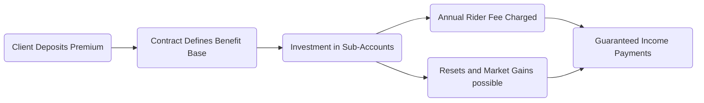

## 14.4 Guaranteed Minimum Withdrawal Benefit Contracts

Guaranteed Minimum Withdrawal Benefit (GMWB) contracts are a specialized type of annuity product designed to provide reliable income throughout retirement. These products blend essential elements of annuities (such as income guarantees) with market-based investments, enabling retirees to maintain the potential for market growth while benefiting from protection against significant downturns. GMWBs have become popular tools for Canadian retirees and wealth planners seeking both security and growth, but they also come with complexities—particularly regarding fees, withdrawal policies, and contract terms—highlighting the importance of careful product suitability and due diligence.

This section provides a comprehensive look at GMWB contracts, including their structure, benefits, limitations, and practical applications in Canadian financial planning.

---

## 14.4.1 Structural Overview of GMWB Contracts

### Defining the Base Value (Benefit Base)

• The base value, sometimes called the benefit base, typically starts at the initially deposited premium.  
• Some GMWB contracts may offer a “bonus” or “roll-up” feature, where the benefit base can grow at a guaranteed rate if the policyholder defers withdrawals for a specified number of years.  
• Once withdrawals begin, the benefit base generally remains fixed unless the contract allows “resets,” which can lock in market gains.

### Guaranteed Withdrawal Rate

• Many GMWB contracts promise an annual withdrawal rate between 4% to 5% of the benefit base, guaranteed for the contract holder’s lifetime.  
• Even if the contract’s market value declines due to poor investment performance, the guaranteed income stream remains intact—provided all policy conditions are met.  
• Withdrawal rates may vary based on the annuitant’s age, market conditions, or contract design.

### Market Participation Through Sub-Accounts

• Although GMWB features provide a safety net, the underlying assets are often invested in various sub-accounts that can include equities, balanced portfolios, or bond funds.  
• This allows for potential market-based growth, which can translate into higher locked-in benefit bases if a reset option is included.  
• However, market volatility may also affect the market value of the sub-accounts, which is distinct from the guaranteed benefit base.

### Rider Fees and Additional Costs

• GMWB contracts commonly charge an extra “rider fee” for the guarantee. This fee comes on top of the base management fee or management expense ratio (MER) for the sub-accounts.  
• Riders can significantly heighten the total cost of the product, sometimes exceeding 3% annually when combined with fund management fees.  
• Excessive fees can erode net returns, indicating the importance of thoroughly reviewing the contract’s cost structure and evaluating whether the guarantee justifies these charges.

---

## 14.4.2 Core Objectives of GMWBs

GMWB contracts aim to address key retirement concerns:

1. **Longevity Protection**  
   By guaranteeing withdrawals for life, GMWBs mitigate the risk of outliving one’s retirement savings—a critical concern for those entering their 80s and beyond.

2. **Market Volatility Control**  
   In a bear market, GMWBs ensure a steady income stream. If the market performs poorly, the client still receives the contractually guaranteed withdrawal, preserving retirement liquidity and preventing forced liquidation of assets at depressed values.

3. **Estate Preservation**  
   Many GMWBs include a death benefit or allow any unused capital to pass on to beneficiaries. Thus, survivors may still inherit part of the contract’s market value (if it exceeds the amount paid out during the client’s lifetime).

---

## 14.4.3 Suitability Considerations

### Fees and Impact on Returns

• GMWBs can be significantly more expensive than standard mutual funds or straightforward annuities because of their rider or guarantee fees.  
• High fees may diminish the net returns from underlying sub-accounts, especially in lower-return market environments.

### Withdrawal Conditions and Penalties

• Contracts generally stipulate a maximum guaranteed withdrawal rate. Withdrawing beyond that threshold can reduce, or even negate, the lifetime guarantee.  
• Early surrender or partial withdrawal beyond contractual terms may trigger hefty penalties, reducing the net surrendered value and jeopardizing the guarantee.

### Complexity and Client Understanding

• GMWBs are more complex than traditional annuities. Advisors must ensure that clients fully grasp the implications of rider fees, resets, and penalty structures.  
• A thorough review of contract terms is crucial—such as clarifying if resets automatically happen at market highs or if they must be elected.

### Case Study: Evaluating GMWB for a Canadian Retiree

Mr. Martin, a 67-year-old retiree from Ontario, invests CA$300,000 in a GMWB product offered by a major Canadian insurer. The contract stipulates:  
• A 5% guaranteed lifetime withdrawal rate, starting at age 71.  
• A possible annual “roll-up” of 4% on the benefit base if he defers withdrawals until age 71.  
• An optional reset feature every three years to lock in market gains if the sub-account performance is strong.

By age 71, Mr. Martin’s benefit base is locked in at CA$360,000 due to the “roll-up.” Despite a subsequent bear market, he can draw CA$18,000 (5% of CA$360,000) annually for life. Regardless of whether the sub-account market value dips below this benefit base, his guaranteed withdrawal remains intact, fulfilling a core goal of securing retirement income predictability.

---

## 14.4.4 Visualizing GMWB Structures

Below is a Mermaid diagram illustrating the flow of a typical GMWB contract:

• The contract first establishes a benefit base.  
• Premiums are invested into sub-accounts.  
• Rider fees are deducted regularly, which can be higher than standard annuity costs.  
• Through periodic resets, the benefit base can increase if the sub-accounts perform well.  
• Guaranteed income is paid to the contract holder irrespective of market underperformance or depletion in the actual market value—assuming no violation of withdrawal terms.

---

## 14.4.5 Best Practices

### Comprehensive Fee Analysis

Before recommending or purchasing a GMWB:

• Compare costs with simpler alternatives (e.g., traditional annuities, balanced portfolios, or risk-reduction strategies like partial annuitization).  
• Evaluate how much scale of guarantee is needed, as the cost must align with the client’s risk tolerance and longevity concerns.

### Aligning Withdrawals with the Guarantee Level

• Encourage policyholders to adhere to the stated annual withdrawal limits.  
• Exceeding these limits can undermine the lifetime guarantee and significantly reduce future income potential.

### Careful Timing of Resets

• If the product allows for resets, monitor sub-account performance and global equity conditions.  
• Although resets can lock in higher benefit bases, they may simultaneously increase fees if the rider cost is calculated on the updated base.

### Transparent Communication

• Thoroughly disclose and discuss product complexity, including fee implications and penalty clauses.  
• Provide scenario-based illustrations, clarifying how the contract would perform in both bull and bear markets.

---

## 14.4.6 Common Pitfalls and How to Avoid Them

1. **Overestimating Market Growth:**  
   Investors might be tempted by the possibility of resets but should remember that poor market performance can happen. Caution clients about potential volatility and the negative impact on the contract’s market value—even if the guaranteed income remains intact.

2. **Ignoring Excess Withdrawal Risk:**  
   Withdrawing more than the guaranteed rate is a primary cause of lost income guarantees. Educate clients on how an excess withdrawal in a single year can reduce their guaranteed lifetime income stream.

3. **Underestimating the Impact of Fees:**  
   GMWB rider fees can be substantial. Over time, high fees can drag down net portfolio returns, particularly when combined with management fees for sub-accounts. Make sure the client understands the long-term erosion effect of fees.

4. **Failing to Revisit the Strategy:**  
   As client circumstances evolve, the GMWB’s suitability could shift. Regular reviews ensure that both the fee structure and the guaranteed income align with the client’s retirement goals.

---

## 14.4.7 Regulatory and Reference Framework

Advisors and clients should remain informed on relevant Canadian regulatory guidelines:

• **CIRO (Canadian Investment Regulatory Organization)** – Visit [https://www.ciro.ca](https://www.ciro.ca) for compliance standards, product suitability rules, and continuing education resources.  

• **Provincial Insurance Regulators** – Each province’s insurance regulator monitors GMWB disclosures to protect consumers.  
• **Canadian Life and Health Insurance Association (CLHIA)** – Refer to “Variable Annuities and Their Guarantees,” which outlines best practices for insurers, product features, and regulatory expectations.  
• **Advanced Coursework** – The Canadian Securities Institute (CSI) offers specialized courses on insurance-based retirement products and wealth management designations that delve deeper into GMWB mechanics.  
• **Open-Source Tools** – Tools such as R or Python offer robust libraries for Monte Carlo simulations to model retirement outcomes under various withdrawal scenarios and fee structures.

---

## 14.4.8 Applying GMWBs in Financial Planning

Below is a simple tabular outline of how GMWBs might fit within a broader retirement strategy:

| Retirement Objective      | GMWB Advantage                      | Potential Limitation                     |
|---------------------------|-------------------------------------|------------------------------------------|
| Reliable Income           | Income guaranteed for life          | Higher fees than standard annuities      |
| Market Participation      | Potential for market-based “resets” | Returns can still be eroded by fees      |
| Estate Preservation       | Death benefits may apply            | Legacy value depends on sub-account value|
| Flexibility of Access     | Periodic resets, optional riders    | Early withdrawals reduce guarantees      |

Wealth planners can integrate GMWBs with other strategies, such as laddered bonds or partial annuitization, to balance growth, protection, and liquidity concerns.

---

## 14.4.9 Summary

In an environment of rising longevity risk and market uncertainty, Guaranteed Minimum Withdrawal Benefit (GMWB) contracts address fundamental retirement goals: ensuring a dependable income stream, mitigating market-driven volatility, and preserving some capacity for estate transfer. However, the additional costs, complex contract provisions, and withdrawal restrictions underscore the need for careful client profiling and diligent advisor guidance.

Key Takeaways:

• GMWBs guarantee an independent lifetime withdrawal rate based on a “benefit base,” safeguarding retirees against market downturns.  
• Market participation through sub-accounts offers potential for benefit base “resets,” yet investors remain exposed to the sub-account’s performance for the non-guaranteed portion of their assets.  
• GMWBs often carry higher fees than standard investments, necessitating a thorough cost–benefit analysis.  
• Suitability and regular review are paramount. Advisors should keep clients informed on contract flexibility, fee structures, and portfolio alignment over time.

---

## Test Your Knowledge: Guaranteed Minimum Withdrawal Benefit (GMWB) Essentials



### Which of the following best describes a GMWB contract?  
- [x] An annuity-like product that guarantees a minimum withdrawal rate for life while allowing market participation.  
- [ ] A short-term investment with no fees and no withdrawal limitations.  
- [ ] A retirement plan offered by the federal government with no minimum withdrawal.  
- [ ] A market-only investment portfolio with no insurance component.  

> **Explanation:** GMWB contracts blend annuity-type guarantees with sub-account market participation and guarantee a minimum withdrawal for life.

### What is the benefit base in a GMWB contract?  
- [ ] The market value of the underlying sub-accounts on a specific date.  
- [x] The reference amount on which guaranteed withdrawals are calculated.  
- [ ] The total cost of rider fees added to management expenses.  
- [ ] The final surrender value if the policy is liquidated early.  

> **Explanation:** The benefit base, or “base value,” serves as the yardstick for calculating guaranteed withdrawals and is generally set at the policy’s inception or adjusted via resets or bonuses.

### A key advantage of GMWB contracts is:  
- [x] Protection from outliving retirement funds via guaranteed withdrawals for life.  
- [ ] Completely eliminating all market risk exposure.  
- [ ] Having no additional fees beyond the standard management expense ratio.  
- [ ] Full liquidity at any time with no surrender charges.  

> **Explanation:** GMWBs safeguard the retiree from longevity risk by offering a guaranteed lifetime withdrawal, although they do not remove all market risk and can carry higher fees and higher surrender charges.

### Why might GMWB contracts have higher expense ratios than typical mutual funds?  
- [x] Because of additional rider fees for the insurance guarantees and resets.  
- [ ] Because they are only available when markets are at all-time highs.  
- [ ] Because they do not involve sub-accounts.  
- [ ] Because there are no other fees involved.  

> **Explanation:** GMWBs layer insurance guarantees (rider fees) on top of typical management fees, increasing overall costs.

### Excess withdrawals beyond the guaranteed rate in a GMWB contract tend to:  
- [x] Reduce or nullify the lifetime withdrawal guarantee.  
- [ ] Automate a reset, leading to a higher guaranteed payout.  
- [x] Lower the future payment base for the life of the contract.  
- [ ] Increase the total benefit base for the contract.  

> **Explanation:** Withdrawing more than the contract’s stated limit may cut into the guaranteed protected value or even negate the guarantee, thus endangering future retirement income.

### What regulatory body can advisors refer to for product suitability guidelines in Canada?  
- [x] CIRO  
- [ ] Bank of Canada  
- [ ] Canada Revenue Agency  
- [ ] Ministry of Finance  

> **Explanation:** Advisors can consult the Canadian Investment Regulatory Organization (CIRO) for compliance standards and suitability rules for investment products.

### Which item would most likely help increase the benefit base of a GMWB contract over time?  
- [x] Market resets capturing sub-account gains  
- [ ] Lowering the rider fee  
- [x] Roll-up features if withdrawals are deferred  
- [ ] Declining lifetime withdrawal rates  

> **Explanation:** Resets based on market gains and contractual roll-up features can increase the benefit base, thus raising the guaranteed withdrawal amounts.

### Which primary risk is mitigated by GMWB contracts?  
- [x] Longevity risk, the risk of outliving one’s retirement assets.  
- [ ] Credit risk, the risk of insurer default.  
- [ ] Liquidity risk, the risk of not being able to access any of your capital.  
- [ ] Currency risk, the risk of fluctuations in exchange rates.  

> **Explanation:** GMWBs primarily address longevity risk by providing a guaranteed income stream for life.

### What is one major drawback of GMWB contracts typically noted by financial advisors?  
- [x] High fees that could erode investment returns over time.  
- [ ] Full insulation from any kind of market fluctuation.  
- [ ] Penalties for withdrawing the guaranteed annual percentage.  
- [ ] Complete loss of legacy potential for beneficiaries.  

> **Explanation:** While GMWBs provide guaranteed income, the extra rider fees and management expenses can significantly reduce net investment returns in the long run.

### GMWB products are considered hybrid products because:  
- [x] They combine annuity-like guarantees with the potential of market-based returns.  
- [ ] They are issued by both the federal and provincial governments.  
- [ ] They guarantee double the annual withdrawal of any standard annuity.  
- [ ] They never involve insurance components.  

> **Explanation:** GMWBs are considered hybrid because they unite the insurance aspect of guaranteed income with the ability to invest in sub-accounts for market gains.



---

## For Additional Practice and Deeper Preparation

**[1. WME Course For Financial Planners (WME-FP): Exam 1](https://www.udemy.com/course/csi-wme-fp-exam1/?referralCode=1A23C67E56971C0A73D5)**  
• Dive into 6 full-length mock exams—1,500 questions in total—expertly matching the scope of WME-FP Exam 1.  
• Experience scenario-driven case questions and in-depth solutions, surpassing standard references.  
• Build confidence with step-by-step explanations designed to sharpen exam-day strategies.

**[2. WME Course For Financial Planners (WME-FP): Exam 2](https://www.udemy.com/course/csi-wme-fp-exam2/?referralCode=25879CCDED7B7905BBA8)**  
• Tackle 1,500 advanced questions spread across 6 rigorous mock exams (250 questions each).  
• Gain real-world insight with practical tips and detailed rationales that clarify tricky concepts.  
• Stay aligned with CIRO guidelines and CSI’s exam structure—this is a resource intentionally more challenging than the real exam to bolster your preparedness.

> Note: While these courses are specifically crafted to align with the WME-FP exam outlines, they are independently developed and not endorsed by CSI or CIRO.
