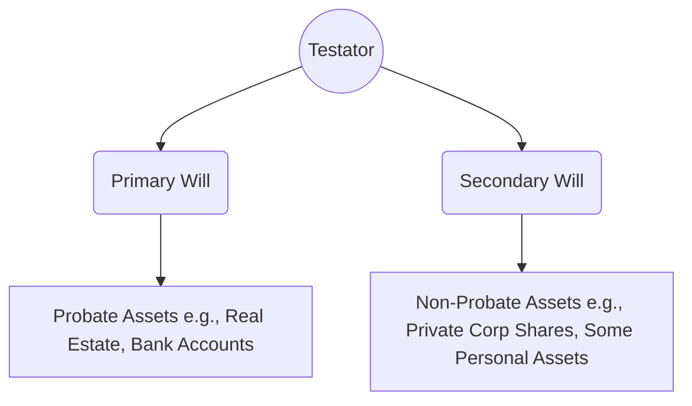

## 15.2 Other Factors to Consider when Making a Will

When clients think about making a will, their initial focus is often on fundamental elements such as identifying assets and naming key beneficiaries. Although these steps are crucial, there are additional factors that can significantly affect the distribution of an estate and the well-being of surviving family members or dependants. This section delves into these considerations, highlighting the interplay between Canadian legal frameworks, family dynamics, and emerging concerns such as digital asset inheritance.

---

### Blended Families, Special Needs, and Other Complexities

#### Blended Families and Dependants from Previous Relationships

In Canada, increasing numbers of families are blended—meaning there are stepchildren, half-siblings, or dependants from previous relationships in the family unit. In such scenarios, a will must carefully reflect the financial needs and emotional sensitivities of all parties involved. Failure to draft a balanced estate distribution plan may lead to disputes, legal challenges, or unintended disinheritance.

• Consider designating specific bequests to stepchildren, if desired, to avoid possible legal disputes.  
• Clarify any pre-existing obligations from prior relationships (e.g., child support or spousal support) and how those obligations are satisfied in the estate plan.  
• Consult relevant provincial statutes (e.g., Ontario’s Succession Law Reform Act, or British Columbia’s Wills, Estates, and Succession Act) to understand the rights of common-law partners or dependent children.

#### Children with Special Needs

Estate planning for children or adult dependants with special needs can be highly intricate. Setting up trusts—such as a testamentary trust or a Henson Trust—may help preserve government benefits or provide long-term care:

• A testamentary trust established within the will can ensure that funds are managed responsibly for the lifetime of the dependant.  
• Complement the trust with a Registered Disability Savings Plan (RDSP) for the beneficiary, where applicable.  
• Consider naming a professional trustee, such as an organization specializing in trust management (e.g., RBC Royal Trust or TD Private Trust), when additional expertise is required.

---

### The Role of Trusts in Estate Planning

Trusts are legal arrangements that manage and distribute assets for beneficiaries, according to the directions specified by the settlor (the individual establishing the trust). In the context of wills, testamentary trusts are created upon the testator’s death. Below are several trust structures that may be used in conjunction with a will:

#### Testamentary Trusts

A testamentary trust comes into effect after the testator’s death. It can be designed for a variety of purposes, including:

• Providing ongoing financial support to a surviving spouse or partner (spousal trust).  
• Safeguarding assets for minor or dependent children, releasing funds according to milestones (e.g., at certain ages or upon attainment of specific life events).  
• Managing complex business interests, such as shares in a family corporation.

#### Spousal Trusts

A spousal trust ensures that a surviving spouse has ongoing income or financial resources, while preserving the capital for other beneficiaries (often children) after the spouse’s passing. Careful drafting can also offer tax advantages that align with Canadian taxation rules on rollovers for spousal beneficiaries. Consulting with a legal professional and a tax accountant is essential to optimize these trusts and ensure compliance with the Income Tax Act (Canada).

#### Trusts for Children’s Education and Care

Beyond general testamentary trusts, specialized trusts can be created for a broad range of child-related expenses:

• Education trusts to fund tuition, books, and living expenses for higher education.  
• Trusts that provide for medical or rehabilitation costs for children with disabilities.  
• Lifecycle trusts that release funds at specific milestones or achievements to encourage fiscal responsibility.

---

### Guardianship Designations for Minor Children

If minor children are left without a surviving parent, guardianship designations in a will are crucial. Courts typically respect the parents’ preferences for a guardian, as stated in the will, unless there are compelling reasons to deviate from those wishes. Failure to name a guardian can lead to legal uncertainty, protracted family court battles, or the appointment of a guardian who may not reflect the parents’ original intentions.

• Appoint both a primary guardian and an alternate guardian to ensure continuity of care.  
• Include a brief rationale for your choice, if appropriate, to help avoid disputes.  
• Consider discussing these decisions openly with the prospective guardian and other family members to gain their support and keep expectations aligned.

---

### Primary Will vs. Ancillary or Secondary Will

In some provinces (e.g., Ontario), individuals may set up multiple wills—commonly referred to as a primary will and a secondary (or ancillary) will. The fundamental aim is to reduce probate fees on certain assets that do not require probate or where the transfer mechanisms can be simplified:

• The primary will covers assets that typically go through probate (e.g., real estate, financial accounts with no named beneficiaries).  
• The secondary will may cover assets like shares in a privately held family corporation, shareholder loans, or personal property of notable value that can be transferred without probate.  
• Work with an experienced legal professional who is familiar with local provincial laws to ensure that multiple wills are valid, integrated, and do not inadvertently conflict.

Below is a simplified illustration of how two wills might be structured:

In this diagram, the testator creates two wills. The primary will covers assets normally sent through probate. The secondary will handles qualifying assets that may be transferred outside of the probate process, potentially lowering probate fees.

---

### Letters of Instruction and Personal Memoranda

A will is a legal document that undergoes a formal process. By contrast, a letter of instruction or personal memorandum is an informal supplement to a will that can provide clarity on specific personal belongings or instructions. Some Canadian provinces allow these memoranda to be legally binding if they are explicitly referenced in the will and properly executed according to local law. However, even when they’re non-binding, these documents can be extremely helpful:

• Outline details for distributing sentimental items, such as jewelry, art, or collectibles.  
• Provide login credentials and guidance on accessing digital assets and online subscriptions.  
• Offer personal messages or explanations that may help reduce disputes among family members.  

Note that digital assets—ranging from cryptocurrency wallets to social media accounts—pose unique challenges. Each platform has its own access and transfer policies. Canadians should maintain a clear record or instructions so that executors can address these assets efficiently and legally.

---

### Planning for Digital Assets

Digital assets include online banking passwords, cryptocurrency wallets, email accounts, social media profiles, online-only subscription services, and more. Overlooking these assets can delay or complicate the estate settlement process.

• Keep secure login details documented and stored in a safe way, such as in a password manager or with encrypted backup.  
• Review service agreements of major online platforms (e.g., Facebook, Google) to determine if and how accounts can be transferred or memorialized.  
• Provide clear guidance in a will or letter of instruction regarding the desired handling of personal, business, or financial digital assets.

---

### Compliance with Canadian Regulations and Guidelines

#### CIRO Guidelines

The Canadian Investment Regulatory Organization (CIRO) periodically issues guidelines on estate-related issues for client accounts. This includes naming beneficiaries, issuing instructions for powers of attorney, and effectively handling estate accounts. Advisors should remain current with CIRO notices published at [ciro.ca](https://ciro.ca/) to ensure compliance when assisting clients with estate planning.

#### Provincial Succession Laws

Estate laws are largely governed by provincial legislation. Key statutes include:  
• Ontario’s Succession Law Reform Act (SLRA)  
• British Columbia’s Wills, Estates, and Succession Act (WESA)  
• Alberta’s Wills and Succession Act  
• Quebec’s Civil Code

These regulations outline the minimum requirements for a valid will, rules around spousal entitlement, and guidelines for family maintenance claims.

#### Public Guardian and Trustee Offices

Each province’s Public Guardian and Trustee office provides resources, brochures, and sometimes direct oversight for estates or trusts that involve vulnerable parties (e.g., minors, or individuals who lack capacity). Advisors and executors can consult these offices for guidance on specific matters, especially if disputes or complexities arise around guardianships or dependent adult beneficiaries.

---

### Best Practices and Common Pitfalls

1. **Regular Updates**: Life events such as marriage, divorce, the birth of children, the death of a spouse, or the acquisition of sizable assets demand will updates.  
2. **Proper Witnessing**: Failing to have the will properly witnessed and executed can invalidate or severely limit its enforceability.  
3. **Exceeding Trust Executor Capacities**: Appointing an ill-prepared executor or trustee might result in unintentional mismanagement. Consider a corporate trustee or a co-trustee who has expertise in estate settlements.  
4. **Coordinating with Other Documents**: Ensure that the beneficiary designations on registered assets (e.g., RRSPs, TFSAs, insurance policies) align with the overall estate plan. Contradictions between the will and designations can lead to confusion and possible litigation.  
5. **Communication with Family Members**: Surprises in estate plans can trigger disputes. Encourage periodic (though appropriately private) discussions with family members to manage expectations.  

---

### Case Study: Blended Family and Trust Planning

Consider an Ontario-based client, Karen, who has two children from her previous marriage and a stepson from her new marriage. She also has a child with special needs. Karen’s estate includes a family home, an RRSP, a privately held corporation, and a significant art collection.

• Karen decides to set up two wills:  
  – A primary will to handle the bulk of her assets that require probate (e.g., the family home, personal bank accounts).  
  – A secondary will for the privately held corporation’s shares to avoid unnecessary probate fees.  

• To provide long-term support for her child with special needs, Karen directs that a testamentary trust be established within her primary will. The trust’s funds will be administered by a professional trustee.  
• She also prepares a personal memorandum to designate specific gifts of art to each child and provides instructions for her jewelry.  
• Finally, aware of her blended family context, Karen communicates her decisions to her spouse, her children, and her stepson to minimize misunderstandings.

---

### Summary

Drafting a will that genuinely reflects one’s wishes, protects dependants, and coordinates with broader wealth management objectives involves more than just naming beneficiaries. Advisors and clients must address guardianship, trusts, multiple will strategies, digital assets, and provincial legal nuances. By exploring these areas in depth—and staying current with Canadian regulations—clients can ensure that their legacies are effectively preserved and that their loved ones are well looked after.

---

## Test Your Knowledge: Will Preparation Challenges in Canada



### Which of the following is a key reason to consider creating two wills in some Canadian provinces?

- [ ] To eliminate the need for an executor altogether.  
- [x] To reduce or avoid probate fees on certain assets such as shares of a private corporation.  
- [ ] To automatically terminate all spousal support obligations.  
- [ ] To include guardianship designations for minor children in a separate legal document.  

> **Explanation:** In provinces like Ontario, it is common to create a primary will and a secondary will when certain non-probate assets (e.g., private corporation shares) can be distributed outside of the probate process, consequently reducing probate fees.

### What is the primary purpose of a spousal trust in estate planning?

- [x] To provide financial support for a surviving spouse while preserving capital for other beneficiaries.  
- [ ] To avoid all estate taxes on inheritance for minors.  
- [ ] To consolidate multiple wills into a single legal document.  
- [ ] To ensure guardianship designations are included in the will.  

> **Explanation:** A spousal trust provides income or financial support for a surviving spouse during their lifetime, while preserving the principal for ultimate distribution to other beneficiaries, often children.

### Which of the following considerations is most relevant when designating a guardian for minor children in a will?

- [x] Whether the guardian is willing and able to take on child-rearing responsibilities.  
- [ ] Whether the guardian lives outside of Canada and pays no Canadian taxes.  
- [ ] The guardianship becomes invalid if another sibling is over age 21.  
- [ ] The guardian must be an executor of the will as well.  

> **Explanation:** The clarity and practicality of guardianship planning require confirming the guardian’s willingness and ability to care for minor children, ensuring the guardian’s role is aligned with the family's wishes and legal structures.

### What is a key benefit of establishing a testamentary trust for a minor child in the will?

- [x] It helps manage and distribute inheritance responsibly until the child reaches a certain age or milestone.  
- [ ] It automatically excludes that child from receiving any inheritance.  
- [ ] It eliminates the need for formal legal guardianship.  
- [ ] It bypasses all Canadian income tax regulations.  

> **Explanation:** A testamentary trust can administer and safeguard the inheritance for a minor child, with the trustee releasing funds at appropriate ages or milestones, ensuring the child’s needs are met responsibly.

### Letters of instruction or personal memoranda are primarily used to:

- [x] Provide informal guidance on bequests, guardianship insights, and distribution of personal belongings.  
- [ ] Replace the will and override executor decisions.  
- [x] Include details on digital asset management that may not fit neatly into the will.  
- [ ] Serve as legal guardianship documents.  

> **Explanation:** Letters of instruction or personal memoranda can supplement a will by clarifying minor details, specific bequests of sentimental belongings, and providing direction on digital assets or personal wishes that do not require legal formalities.

### In the context of Canadian estate planning, a “Henson Trust” is:

- [x] A trust designed to protect the assets of a beneficiary with disabilities, preserving access to government benefits.  
- [ ] A trust exclusively for guardianship designations.  
- [ ] A trust that focuses solely on spousal rollovers.  
- [ ] A specialized trust for holding digital assets.  

> **Explanation:** A Henson Trust is used to protect an individual with disabilities by controlling the beneficiary’s access to trust assets while allowing them to continue qualifying for government benefits.

### What is one of the most common pitfalls when planning a will for blended families?

- [x] Not updating the will to accommodate stepchildren or new marital relationships.  
- [ ] Naming an executor from a different province.  
- [ ] Creating more than one testamentary trust.  
- [ ] Obtaining professional legal advice.  

> **Explanation:** A frequent challenge arises when individuals fail to update their estate plans after remarriage or fail to consider stepchildren’s financial needs, causing disputes or unintentional disinheritance.

### Which of the following describes a core advantage of naming a corporate trustee for a testamentary trust?

- [x] Professional management of complex assets and impartial administration of trust provisions.  
- [ ] Ability to replace the guardian at will.  
- [ ] Complete exemption from provincial estate laws.  
- [ ] Guarantee of fee-free asset management.  

> **Explanation:** A corporate trustee offers expertise in overseeing and distributing trust assets, ensuring impartiality and continuity in fulfilling the testator’s intentions.

### Why is it important to coordinate beneficiary designations on registered accounts (e.g., RRSPs) with the provisions of a will?

- [x] Because beneficiary designations on registered accounts can override the will.  
- [ ] Because all assets must physically pass through probate at the same time.  
- [ ] Because only the will can name a new beneficiary.  
- [ ] Because courts ignore beneficiary forms.  

> **Explanation:** Beneficiary designations on registered accounts (RRSPs, TFSAs, etc.) typically override instructions in a will. Ensuring alignment prevents conflicts and unintentional outcomes.

### Is it generally advisable to document plans for digital assets in a separate letter of instruction?

- [x] True  
- [ ] False  

> **Explanation:** While it is possible to include guidelines for digital assets in the will itself, many testators use a separate letter of instruction to provide practical details about online accounts and passwords, allowing flexibility and confidentiality.



---

## For Additional Practice and Deeper Preparation

**[1. WME Course For Financial Planners (WME-FP): Exam 1](https://www.udemy.com/course/csi-wme-fp-exam1/?referralCode=1A23C67E56971C0A73D5)**  
• Dive into 6 full-length mock exams—1,500 questions in total—expertly matching the scope of WME-FP Exam 1.  
• Experience scenario-driven case questions and in-depth solutions, surpassing standard references.  
• Build confidence with step-by-step explanations designed to sharpen exam-day strategies.

**[2. WME Course For Financial Planners (WME-FP): Exam 2](https://www.udemy.com/course/csi-wme-fp-exam2/?referralCode=25879CCDED7B7905BBA8)**  
• Tackle 1,500 advanced questions spread across 6 rigorous mock exams (250 questions each).  
• Gain real-world insight with practical tips and detailed rationales that clarify tricky concepts.  
• Stay aligned with CIRO guidelines and CSI’s exam structure—this is a resource intentionally more challenging than the real exam to bolster your preparedness.

> Note: While these courses are specifically crafted to align with the WME-FP exam outlines, they are independently developed and not endorsed by CSI or CIRO.
