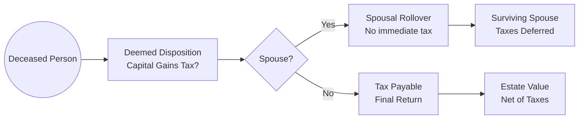

## 16.2 Taxation

Taxation is a key factor in estate planning, as the manner in which assets are taxed can affect the size of an estate and the legacy ultimately left to beneficiaries. In Canada, unlike some other jurisdictions, there is no standalone “estate tax.” Instead, the value of an individual’s assets is subject to a “deemed disposition” at death. This concept, along with other rules related to spousal rollovers, registered assets, and trusts, informs how advisors and clients should plan to minimize tax liabilities and optimize asset transfers.

In this section, we will explore the taxation principles that lie at the heart of estate planning in Canada, highlighting key strategies, best practices, and pitfalls to avoid. We will examine the deemed disposition rules, the role of spousal rollovers in deferring taxes, taxation of registered assets such as Registered Retirement Savings Plans (RRSPs), the structure and taxation of trusts, and the principal residence exemption. We will also look at how probate fees, though not strictly an income tax, influence planning, and how insurance can be effectively used to offset tax liabilities.

---

## 16.2.1 Overview of Estate Taxation in Canada

In many jurisdictions around the world, heirs may be subject to an estate or inheritance tax. However, Canada does not impose a dedicated estate tax. Instead, Canadian estate taxation primarily arises through income tax implications when a person dies. The Income Tax Act deems the deceased’s assets to have been sold at fair market value (FMV) immediately before death, triggering capital gains or losses on any appreciated or depreciated assets.

### 16.2.1.1 The Deemed Disposition Rule

Under normal circumstances, when an individual sells a security or transfers a property not at arm’s length, any capital gain or loss must be included in taxable income. At the time of death, the Canada Revenue Agency (CRA) treats all capital property (e.g., stocks, mutual funds, investment properties) as if it had been disposed of at FMV. This triggers capital gains (or losses) that must be declared on the final tax return of the deceased.

**Example:**  
• Suppose David owns shares of a Canadian bank (such as RBC) with an adjusted cost base (ACB) of $50,000. At David’s death, the shares have an FMV of $120,000. Absent any special rules, a capital gain of $70,000 ($120,000 - $50,000) would be added to his final tax return.  

The net effect is that David’s estate must pay any taxes resulting from the capital gains, reducing the remainder that goes to the beneficiaries.

---

## 16.2.2 Deferral Opportunities: The Spousal Rollover

The spousal rollover rule is a cornerstone of Canadian estate planning. Under this provision, when assets are transferred to a surviving spouse or a qualifying spousal trust (many advisors call it a “spousal rollover trust”), the deemed disposition is deferred. Instead, the asset’s adjusted cost base transfers to the spouse or spousal trust, and the capital gain is not triggered until the surviving spouse or trust ultimately disposes of the asset, or upon the spouse’s death.

This rule enables the deferral of capital gains and income inclusion, allowing families to better manage taxes if one spouse passes before the other.

### 16.2.2.1 Conditions for a Spousal Rollover

1. The receiving spouse or spousal trust must be a Canadian resident.  
2. The transfer must be an eligible transfer of property (generally, capital property but can also include certain registered funds).  
3. The rollover occurs at the ACB rather than FMV, meaning any accrued capital gains are transferred to the spouse/trust.  

**Example:**  
• Suppose Alice transfers her non-registered investment portfolio to Bob (her spouse) upon her death. The portfolio had an original cost base of $100,000 and is worth $200,000 at the time of her death. Using the spousal rollover, no immediate tax is triggered. Bob assumes the cost base of $100,000, and taxes on the $100,000 unrealized gain are deferred until Bob sells the assets or passes away, whichever comes first.

---

## 16.2.3 Taxation of Registered Assets at Death

For registered accounts such as RRSPs, Registered Retirement Income Funds (RRIFs), and similar plans, the rules differ from capital gains treatment on non-registered securities:

1. **RRSPs and RRIFs:** The entire fair market value of these funds is generally included as income on the deceased’s final tax return.  
2. **Spousal and Dependent Children Rollovers:** If a surviving spouse or eligible dependent child is a beneficiary, the proceeds from the RRSP or RRIF can be rolled over into the spouse’s or child’s registered plan, deferring tax until future withdrawals. Specific conditions apply, especially for dependent children under 18 or those who are financially dependent due to disability.

**Case Study:**  
• Consider a scenario where Atul, age 70, passes away holding an RRIF valued at $400,000. If Atul’s spouse, Priya, is the designated beneficiary, she can transfer the RRIF assets to her own RRIF or RRSP. Tax will only apply when Priya eventually withdraws funds from her registered plan. Without this spousal rollover, the entire $400,000 would become taxable in Atul’s final return, potentially pushing his estate into a very high tax bracket and significantly eroding the value passed on to Priya.

---

## 16.2.4 Trust Taxation in Estate Planning

Trusts can be powerful tools for controlling asset distribution and achieving tax efficiencies, although their taxation rules are complex:

1. **Income Taxation for Trusts:** Unless income is distributed to beneficiaries, the trust itself must pay tax at the top marginal rate. If the income is “paid or payable” to beneficiaries in a tax year, the trust can claim a corresponding deduction to reduce its income, and the beneficiaries then pay tax at their rates.  
2. **Testamentary Trusts:** Once used to benefit from graduated tax rates, testamentary trusts are now typically taxed at the top marginal rate, except for the first 36 months of a `graduated rate estate` (GRE) or if the trust qualifies as a `qualified disability trust` (QDT).  
3. **Graduated Rate Estates (GRE):** The deceased’s estate can qualify as a GRE for the first 36 months, allowing it to benefit from graduated tax rates. After this period, the estate is taxed at the highest marginal rate on its income.  

### Example of a Testamentary Trust Strategy

• Li Mei’s will establishes a testamentary trust for her grandchildren. For the first 36 months after her death, the estate qualifies as a GRE and can use lower graduated tax rates. After 36 months, if the trust continues to hold assets, any undistributed income is taxed at the highest marginal rate. To maximize tax savings, the executor might distribute income to the grandchildren where they can benefit from their lower marginal rates.

---

## 16.2.5 Principal Residence Exemption

In Canada, individuals (and often trusts if they qualify) can apply the principal residence exemption to shield the gain from the sale (or deemed disposition) of their primary home from capital gains tax. In the context of estate planning, this exemption can be a significant advantage:

1. **Eligibility:** Only one property can be designated as a principal residence for each year of ownership, and it must be “ordinarily inhabited” by the owner or certain family members.  
2. **Partial Exemptions:** If the property has only been the principal residence for some of the years of ownership, a partial exemption can still apply, proportionate to the number of years designated.  
3. **Estate Transfers:** Upon death, if the property is transferred to a beneficiary, the exemption may still apply if the deceased (or the estate) designates it appropriately for the years of ownership leading up to death.

**Example:**  
• Tyler owns a primary residence in Vancouver for 15 years. Five years prior to death, he also purchased a cottage. He only designates the Vancouver home as his principal residence for the full 15 years. At Tyler’s death, the Vancouver home passes to his nephew, and the entire capital gain from the Vancouver home is sheltered from tax, provided administrative requirements are met. The cottage may face capital gains taxes for the five years it accrued gains without principal residence designation.

---

## 16.2.6 Probate Fees

While not an income tax, probate fees (also referred to as probate taxes in some provinces) are relevant in estate planning, as they can be significant:

- **Vary by Province:** Different provinces have different fee structures. Ontario, for instance, charges a rate on the probate value of the estate, while Alberta’s fees are capped at a certain threshold.  
- **Avoiding Probate:** Some individuals try to reduce probate fees by using techniques such as holding assets jointly with rights of survivorship or settling them into an inter vivos trust. However, advisors should caution clients about potential unintended consequences—such as losing control over assets or triggering a deemed disposition upon transfer to a trust.

---

## 16.2.7 Life Insurance in Estate Planning

Life insurance policies can be strategically employed to offset potential estate taxes:

1. **Tax-Free Death Benefit:** Policy death benefits flow directly to the named beneficiary, bypassing probate.  
2. **Funding Tax Liabilities:** A life insurance policy’s proceeds can be used to pay off final tax bills, ensuring other estate assets are preserved for heirs.  
3. **Estate Equalization:** Life insurance can help estate equalization when certain assets (e.g., family business or cottage) go to one beneficiary, while another beneficiary receives an equivalent amount in cash.

**Case Example:**  
• Martin, a high-net-worth individual with a large portfolio of securities and multiple properties, anticipates a substantial tax liability at death. To cover these taxes and ensure his children inherit the maximum possible value, he takes out a joint-last-to-die policy with his spouse. The death benefit is timed to coincide with the ultimate deemed disposition event upon the surviving spouse’s death, providing liquidity for tax obligations.

---

## 16.2.8 Practical Example: Estate Tax Scenario

Below is a simplified flowchart illustrating the tax impact on an estate at death in Canada under various pathways:

**Figure Explanation:**  
1. When a person dies, their capital property is deemed to be disposed of, which may create a taxable capital gain.  
2. If the asset passes to a spouse or a qualifying spousal trust, the capital gain is deferred (no immediate tax).  
3. If not, the estate pays taxes in the deceased’s final return, and the net estate value is distributed to beneficiaries.

---

## 16.2.9 Key Considerations and Best Practices

• **Accurate Valuations:** Obtain professional appraisals and valuations whenever possible to confirm the fair market value of assets at death.  
• **Well-Drafted Will and Trusts:** Ensure testamentary documents are drafted to maximize the use of spousal rollovers, principal residence exemptions, and trust structures aligned with beneficiaries’ needs.  
• **Regular Review:** Tax laws evolve, and personal circumstances change (e.g., marriage, divorce, birth of children, changes to provincial laws). Ongoing reviews can ensure the estate plan remains optimal.  
• **Coordinate with the Entire Financial Plan:** Estate planning isn’t a standalone strategy; it intersects with retirement planning, insurance, and overall wealth management.  
• **Plan for Liquidity:** Evaluate if there is sufficient cash or liquid assets to pay final taxes. If not, consider establishing appropriate insurance coverage.  
• **Stay Informed with CRA and Provincial Rules:** Monitor bulletins and guides from the Canada Revenue Agency and provincial legislative changes that impact provincial probate fees.

---

## 16.2.10 Summary

Estate planning in Canada involves understanding the interplay between income taxes, probate fees, and the rights of heirs. Strategies like the spousal rollover, the principal residence exemption, and careful use of trusts can mitigate a significant portion of taxes. By leveraging life insurance, beneficiaries can receive tax-free proceeds that offset final tax liabilities. Ultimately, aligning estate planning with a broader wealth management strategy ensures that tax considerations neither erode wealth unnecessarily nor disrupt the intended legacy.

Below is a brief glossary recap of critical concepts:

- **Deemed Disposition:** Fictional sale of capital property at FMV for tax purposes, often triggered by death or certain transfers.  
- **Spousal Rollover:** Allows qualifying assets to pass from a deceased spouse to a surviving spouse or spousal trust without triggering immediate tax.  
- **Probate Fees:** Levied by the province on the deceased’s estate, varying by jurisdiction and the value of the estate.  
- **Graduated Rate Estate (GRE):** The estate of a deceased person that benefits from graduated tax rates for up to 36 months after death (beyond that, top-rate taxation generally applies).

---

## 16.2.11 Additional Resources and References

• **Canada Revenue Agency (CRA)** – “Preparing Returns for Deceased Persons”  
  https://www.canada.ca/en/revenue-agency/services/forms-publications/publications/t4011.html  

• **The Canadian Investment Regulatory Organization (CIRO)** – Provides guidance on ethical and compliant practices when advising clients on investment and estate matters.  

• **Provincial Wills and Estates Legislation**  
  - Ontario’s Succession Law Reform Act  
  - British Columbia’s Wills, Estates and Succession Act  

• **PricewaterhouseCoopers (PwC) Tax Facts and Figures**  
  https://www.pwc.com/ca/en/services/tax/publications/tax-facts.html  

• **Open-source Financial Planning Calculators**  
  Various credit union and bank websites provide online RRSP/RRIF withdrawal or capital gains calculators to simulate scenarios.

Remember that tax regulations can change, and each client’s personal situation is different. For more complex estates, it is crucial to work with tax professionals, legal advisors, and experienced financial planners.

---

## Test Your Knowledge: Canadian Estate Taxation Essentials



### Which rule commonly triggers capital gains upon a person's death in Canada?  
- [ ] The Gross-Up Provision  
- [x] The Deemed Disposition Rule  
- [ ] The Capital Dividend Account  
- [ ] The Savings Deferral Mechanism  

> **Explanation:** Canadian tax law stipulates a deemed disposition at fair market value immediately before death, triggering capital gains or losses on an individual’s property.

### Under which scenario does the spousal rollover typically apply?  
- [ ] Transfer of property to any family member.  
- [x] Transfer of certain assets from a deceased spouse to a surviving spouse or spousal trust.  
- [ ] Transfer of assets to a business partner.  
- [ ] Transfer of a rental property to tenants.  

> **Explanation:** The spousal rollover allows assets to move to a Canadian resident spouse or a qualifying spousal trust without immediate tax consequences.

### What tax implications generally apply to RRSP assets upon the death of the account holder if no spousal rollover is used?  
- [x] The entire fair market value is included as taxable income on the final return.  
- [ ] Only 50% of the fair market value is included in the final return.  
- [ ] There is no tax payable if the beneficiary is a child.  
- [ ] RRSPs are automatically tax-exempt at death.  

> **Explanation:** If an RRSP is not transferred to a surviving spouse or qualified dependent child, the full value of the RRSP is typically included as taxable income on the deceased’s final return.

### What best describes how trust income is taxed when it is distributed to beneficiaries?  
- [x] The trust deducts the distributed amount, and the beneficiary includes it in their own taxable income.  
- [ ] The trust always pays tax at the top marginal rate.  
- [ ] Neither the trust nor the beneficiary pay tax on distributed income.  
- [ ] Trusts are automatically exempt from income tax.  

> **Explanation:** When income is distributed to beneficiaries, the trust can claim a deduction, so the beneficiaries pay tax instead of the trust, typically at their own marginal rates.

### Which testamentary vehicle may benefit from graduated tax rates for the first 36 months after death?  
- [x] Graduated Rate Estate (GRE)  
- [ ] Joint-last-to-die trust  
- [x] Qualified disability trust  
- [ ] Lifetime inter vivos trust  

> **Explanation:** A Graduated Rate Estate (GRE) can enjoy graduated rates for the first 36 months following death. A qualifying disability trust also benefits from specific tax advantages.

### Which strategy can potentially reduce or eliminate capital gains tax on the sale of a principal residence?  
- [x] Claiming the principal residence exemption  
- [ ] Incorporating the property into a holding company  
- [ ] Listing the property below fair market value  
- [ ] Using an international trust  

> **Explanation:** The principal residence exemption can completely or partially eliminate capital gains on a home ordinarily inhabited by the individual or their family.

### How do probate fees differ from income tax?  
- [x] Probate fees are levied at the provincial level on the estate's value for probate court processing.  
- [ ] Probate fees are paid only if there is foreign property.  
- [x] Probate fees replace all federal taxes.  
- [ ] Probate fees follow the same schedule as federal income tax brackets.  

> **Explanation:** Probate fees (or probate taxes) are a separate provincial charge related to issuing probate, not an income tax.

### How might life insurance help mitigate estate tax liabilities?  
- [x] By providing tax-free death benefit proceeds that can offset the estate’s final tax liabilities.  
- [ ] By eliminating the requirement to file a final tax return.  
- [ ] By automatically transferring RRSPs tax-free to beneficiaries.  
- [ ] By replacing the principal residence exemption.  

> **Explanation:** Life insurance pays out a lump sum that can be used to settle the deceased’s tax obligations, preventing the forced sale of assets.

### What is a common pitfall when trying to avoid probate fees using joint tenancy?  
- [x] It may create unintended beneficial ownership and loss of control.  
- [ ] It always triggers an immediate deemed disposition.  
- [ ] It halts spousal rollover privileges.  
- [ ] It automatically invalidates the will.  

> **Explanation:** Joint tenancy can inadvertently create new beneficial ownership interests and complicate the estate plan, especially if the joint owner is not a spouse or is added purely for the sake of bypassing probate.

### True or False: A spousal rollover for capital property will permanently avoid capital gains tax.  
- [x] True  
- [ ] False  

> **Explanation:** While the spousal rollover defers capital gains tax, it does not eliminate it altogether—taxation will occur when the surviving spouse disposes of the asset or passes away.



---

## For Additional Practice and Deeper Preparation

**[1. WME Course For Financial Planners (WME-FP): Exam 1](https://www.udemy.com/course/csi-wme-fp-exam1/?referralCode=1A23C67E56971C0A73D5)**  
• Dive into 6 full-length mock exams—1,500 questions in total—expertly matching the scope of WME-FP Exam 1.  
• Experience scenario-driven case questions and in-depth solutions, surpassing standard references.  
• Build confidence with step-by-step explanations designed to sharpen exam-day strategies.

**[2. WME Course For Financial Planners (WME-FP): Exam 2](https://www.udemy.com/course/csi-wme-fp-exam2/?referralCode=25879CCDED7B7905BBA8)**  
• Tackle 1,500 advanced questions spread across 6 rigorous mock exams (250 questions each).  
• Gain real-world insight with practical tips and detailed rationales that clarify tricky concepts.  
• Stay aligned with CIRO guidelines and CSI’s exam structure—this is a resource intentionally more challenging than the real exam to bolster your preparedness.

> Note: While these courses are specifically crafted to align with the WME-FP exam outlines, they are independently developed and not endorsed by CSI or CIRO.
