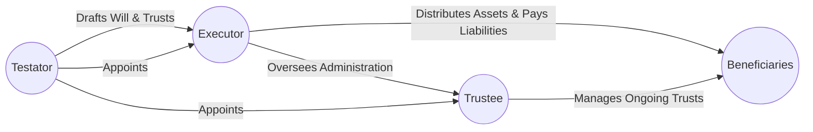

## 16.3 General Issues to Consider for Estate Planning

Estate planning is a critical component of wealth management, ensuring that an individual’s wishes regarding the distribution of assets are carried out effectively, responsibly, and with minimal tax obligations. In Canada, this process goes beyond simply drafting a will; it includes appointing suitable decision-makers, identifying and protecting vulnerable beneficiaries, addressing digital assets, and factoring in cross-border assets where necessary. In this section, we look at the key issues a financial planner or advisor should consider when guiding clients through their estate planning journey.

---

### Family Dynamics and Communication

Open communication plays a profound role in mitigating conflicts and ensuring the smooth execution of a client’s estate plan:

• Family Meetings: Encouraging clients to organize family meetings can help clarify estate distribution plans, allowing beneficiaries to understand the intentions and responsibilities involved.  
• Handling Complex Dynamics: In families with blended relationships, estranged relatives, or potential conflicts (e.g., over business succession), a transparent approach fosters understanding and reduces legal disputes.  
• Professional Facilitation: Having an experienced wealth advisor, lawyer, or mediator attend family discussions can alleviate tension and ensure complex issues—like business valuations or trust structures—are clarified properly.

The careful handling of family dynamics sets the tone for seamless administration and helps protect family wealth for future generations.

---

### Choice of Executor(s) and Trustee(s)

Selecting an executor (or executors) and trustee(s) is among the most critical decisions in estate planning:

• Responsibilities of an Executor: The executor is responsible for settling the estate, filing final taxes, dealing with creditors, and distributing assets as per the will. In Canada, the executor must comply with provincial law and the Canada Revenue Agency’s (CRA) requirements for final tax returns.  
• Trustee Roles: Trustees oversee trusts set up to administer assets over time, such as a testamentary trust or a trust for minor children. Trustees must act in the best interests of beneficiaries, invest trust assets prudently, and adhere to fiduciary obligations under relevant legislation (e.g., provincial Trustee Acts and common law).  
• Corporate Trustee: In some cases, a corporate trustee (e.g., a trust company affiliated with a major Canadian bank such as RBC or TD) may be preferred to reduce bias and provide professional oversight, particularly for large or complex estates.  
• Qualifications and Competencies: When clients select an executor or trustee, they should consider the appointed individual’s financial literacy, ability to handle administrative tasks, and willingness to shoulder legal and personal responsibilities.

---

### Protecting Vulnerable Beneficiaries

Estate planning must accommodate the needs of dependants who may be vulnerable:

• Henson Trust and Other Discretionary Trusts: A Henson trust is designed to protect the eligibility of a beneficiary with a disability for provincial social assistance by granting trustees full discretion over payments, thus preventing the beneficiary from legally “owning” the assets.  
• Minor Children: Testamentary trusts for minors ensure they have financial support until they reach an age specified by the will-maker. The trustee manages expenses such as education and healthcare, step by step, until the child is old enough to manage the inheritance directly.  
• Ongoing Care: If a beneficiary requires long-term medical care or specialized support, the trust and estate plan must provide for these needs over the beneficiary’s lifetime. This may involve customized trust provisions or insurance policies.  
• Balancing Beneficiary Needs: Advisors should guide clients on balancing inheritance distribution among vulnerable and non-vulnerable beneficiaries in a manner that supports fairness and avoids unintended disputes.

---

### Updating Estate Plans Regularly

Life events and legal changes can significantly impact estate plans:

• Major Life changes: Marriage, divorce, birth of a child, death of a spouse or other family member, changes in one’s financial status, or relocation to a new province can necessitate an estate plan review.  
• Regular Reviews: Advisors should recommend clients review their estate plans annually or upon significant changes. This ensures all legal documents (will, trusts, powers of attorney) reflect clients’ current goals and comply with any newly introduced laws or provincial regulations.  
• Staying Current with Law: Provincial laws (e.g., Ontario’s Succession Law Reform Act, B.C.’s Wills, Estates and Succession Act) can change. Monitoring these legal updates, as well as CRA regulations pertaining to estate tax, helps keep the estate plan compliant.

---

### International Assets and Cross-Border Issues

For clients with global footprints, the complexity of estate planning increases:

• Multiple Jurisdictions: Assets and beneficiaries in different countries introduce diverse legal frameworks, probate rules, and tax systems. For instance, distribution rules in the United States or the United Kingdom can differ greatly from Canadian protocols.  
• Tax Treaties and Reporting Requirements: Canada has tax treaties with various nations that can alleviate double taxation situations. Advisors must be aware of the applicable treaties and foreign reporting obligations (e.g., the U.S. Foreign Account Tax Compliance Act [FATCA]).  
• Cross-Border Estate Structures: Setting up cross-border trusts or utilizing local wills in each jurisdiction can help streamline probate and administration. However, these strategies require specialized legal guidance due to multi-jurisdictional complexities.

---

### Philanthropic Objectives

Many Canadians wish to incorporate charitable giving into their estate strategy:

• Charitable Donations: Directing a portion of the estate to qualified donees (charities recognized by the CRA) can generate significant tax credits for the estate.  
• Charitable Remainder Trusts (CRT): A CRT lets the donor (or another named individual) enjoy income from donated assets during their lifetime, with the remainder going to charity upon death. This approach provides both philanthropic impact and tax advantages.  
• Private Foundations: Establishing a private foundation can offer a more structured approach to philanthropy, enabling ongoing charitable activities aligned with personal or family values.  
• Collaboration with Philanthropic Advisors: Wealth advisors may partner with philanthropic planning specialists or major Canadian charities to help design effective giving solutions.

---

### Privacy Concerns

Public disclosure during probate can be sensitive, particularly for high-net-worth individuals:

• Public Record: When a will undergoes probate, it becomes accessible to the public. This opens a window into an individual’s net worth, beneficiaries, and asset distribution plan.  
• Trust Structures: Many Canadians use living trusts and other arrangements to maintain privacy, avoiding or minimizing the assets that pass through probate.  
• Planning with Corporate Entities: Planners can recommend clients consider corporations or partnerships to hold specific assets, further protecting privacy. However, each structure must align with tax-efficiency and legal compliance.

---

### Digital Assets

The scope of digital assets continues to expand, presenting unique challenges in estate administration:

• Types of Digital Assets: These may include cryptocurrencies, non-fungible tokens (NFTs), domain names, online subscriptions, social media accounts, and any other electronic property.  
• Access and Instructions: Advisors should recommend clients maintain a secure inventory of digital asset credentials, along with instructions for transfer or closure.  
• Legal Considerations: Provincial and federal regulations regarding digital assets are evolving. Advisors and attorneys must stay informed to ensure instructions are legally valid and enforceable.  
• Example: If a client invests in cryptocurrency through a Canadian exchange, the executor or trustee may need multi-factor authentication keys. Without proper instructions, these assets could become inaccessible.

---

### Powers of Attorney and Advance Healthcare Directives

Thoughtful planning for incapacity is crucial:

• Power of Attorney (POA) for Property: Enables a designated individual to manage financial affairs if the original asset owner cannot. POAs are recognized under provincial legislation such as Ontario’s Substitute Decisions Act.  
• Power of Attorney for Personal Care: Addresses healthcare and lifestyle decisions. This may include consent for medical treatments or choice of living arrangements in the event of mental or physical incapacitation.  
• Advance Healthcare Directives (Living Wills): Clients can provide guidance to healthcare professionals regarding treatments and end-of-life decisions. This ensures personal wishes are respected.

---

### Glossary

• **Executor:** The person or organization appointed to administer the estate of a deceased individual, ensuring debts are paid and assets distributed according to the will.  
• **Henson Trust:** A type of discretionary trust designed to protect the eligibility of a beneficiary with a disability for government benefits.  
• **Digital Assets:** Electronic or online resources that hold monetary or sentimental value, including cryptocurrencies and other intangible properties.  
• **Power of Attorney:** A legal document giving a designated person authority to manage your property and/or personal care decisions if you become unable.

---

### Diagrams and Visual Aids

Below is a diagram illustrating the major actors in an estate plan and how they interact:

In this flowchart:

• The Testator creates the will and trust.  
• The Executor (and possibly Trustee) implements the estate’s directives.  
• Beneficiaries receive estate assets according to the will and trust.

---

### Practical Case Study Example

Consider Tracy, a 55-year-old Canadian entrepreneur who has built a successful business with operations in Ontario and the U.S. She has a daughter with a developmental disability:

1. Tracy chooses a corporate trustee for her daughter’s Henson trust to ensure professional management, especially because her child’s care needs are likely to continue into adulthood.  
2. She arranges a second will for her business shares held in Ontario, aiming to streamline probate for those particular assets in compliance with provincial rules.  
3. Tracy also consults a U.S. tax attorney to address potential cross-border estate tax exposure due to her business assets in the U.S.  
4. She designates a power of attorney for property and personal care to her brother, instructing him on financial and personal decisions if she becomes incapacitated.  
5. Given her philanthropic goals, Tracy sets up a charitable remainder trust that will provide funds to a favourite hospital foundation upon her death, offering her estate a sizeable tax credit.

This case highlights the breadth and depth of considerations—from Henson trusts for vulnerable beneficiaries to cross-border complexities, corporate trustee selection, and philanthropic planning.

---

### Best Practices and Potential Challenges

• Ensure Documentation Is Up-To-Date: Encourage clients to keep wills, POAs, and trust documents current with life changes and legislative updates.  
• Include a Digital Assets Plan: Document online account credentials, private keys, or instructions to access cryptocurrency.  
• Address Family Dynamics Proactively: Facilitate honest dialogue to help reduce later conflicts.  
• Leverage Professional Expertise: Estate planning lawyers, tax experts, and corporate trustees can help navigate complex scenarios effectively.  
• Remain Vigilant about Tax Obligations: Failing to file final returns or semiconductor property reports can lead to penalties and delays.

---

### References and Additional Resources

• **CIRO (Canadian Investment Regulatory Organization):** Provides updated guidelines on best practices for advisors offering estate, trust, and wealth management services.  
• **“Planning for the Passing of Digital Assets”** by the Law Society of Ontario – Guidance on integrating digital properties into an estate plan.  
• **CBA (Canadian Bar Association) Resources on Estate Planning** ([CBA Website](https://www.cba.org/For-The-Public/Legal-Research/Estate-Planning)) – Offers practical checklists and articles.  
• **Executor’s Handbook** by Jennifer Greenan – A comprehensive Canadian-focused resource on executor duties and estate administration.  
• **Open-source Will or Trust Drafting Tools** – Online platforms can help clients begin the process, but professional legal review is highly recommended.

---

### Summary

A robust estate plan in Canada incorporates thoughtful decisions on executors, trustees, and distribution structures for both conventional and digital assets. It accounts for evolving family dynamics, vulnerable beneficiaries, philanthropy, and potential cross-border complications. Moreover, it needs periodic revision to remain aligned with current life circumstances and legal requirements. An advisor’s role is to guide clients through these complexities, offering strategic insight, resources, and references for professional expertise.

---

## Test Your Knowledge: Essential Estate Planning Considerations in Canada



### Which of the following best describes why open communication in estate planning is important?

- [x] It helps mitigate future conflicts and ensures all parties understand the distribution plan.  
- [ ] It ensures that family members can change the will at any time.  
- [ ] It eliminates the need for professional legal or financial advice.  
- [ ] It bypasses the need for formal documentation like a will.  

> **Explanation:** Transparent communication mitigates potential disputes by clarifying each party’s expectations and responsibilities, ultimately leading to a smoother estate settlement.

### What is the primary role of an executor in estate planning?

- [x] Overseeing the administration of the deceased’s estate, paying debts, and distributing assets according to the will.  
- [ ] Providing frontline healthcare decisions for the individual.  
- [x] Serving as the trustee of a Henson trust.  
- [ ] Freezing all assets until final notices are received from creditors.  

> **Explanation:** The executor is legally responsible for settling the estate’s obligations, filing taxes, and ensuring the decedent’s wishes (as laid out in the will) are carried out. While an executor might also be a trustee in some cases, the trustee role often has additional fiduciary responsibilities for ongoing trusts.

### Which of the following is a valid reason to consider a corporate trustee?

- [x] The estate is large and complex, necessitating professional oversight.  
- [ ] Family members require anonymity and cannot meet legal standards.  
- [ ] Corporate entities guarantee lower fees than individual trustees.  
- [ ] Provincial laws do not allow family members to act as trustees.  

> **Explanation:** Corporate trustees are often chosen for their expertise, impartiality, and ability to manage large or complex estates effectively.

### How can a Henson trust benefit a beneficiary with a disability?

- [x] By preserving the beneficiary’s eligibility for government benefits while providing supplementary financial support.  
- [ ] By allowing the beneficiary to rewrite the terms of the trust.  
- [ ] By mandating all assets be distributed in a lump sum.  
- [ ] By preventing the beneficiary from receiving any income.  

> **Explanation:** A Henson trust is structured so the beneficiary doesn’t legally “own” the trust assets, ensuring continued eligibility for provincial disability benefits.

### Which of the following highlights the importance of keeping estate plans updated?

- [x] Major life events, such as divorce or the birth of a child, can change estate objectives.  
- [ ] Canadian law automatically updates the will when personal circumstances change.  
- [x] Estate plans expire five years after they are written.  
- [ ] Executors have the authority to refuse outdated wills and create new ones.  

> **Explanation:** Regular reviews are essential because changes in marital status, family makeup, asset levels, or legislation often necessitate updates to estate documents.

### What is a key benefit of establishing a charitable remainder trust?

- [x] The donor (or a named individual) retains income from the donated assets during their lifetime, with the remainder going to charity.  
- [ ] It avoids reliance on trustee discretion.  
- [ ] It allows a testator to give away assets without providing beneficiaries with any notice.  
- [ ] It is a mandatory structure for all high-net-worth Canadians.  

> **Explanation:** Charitable remainder trusts allow the donor to receive ongoing income while securing a future gift to a designated charity, often with tax benefits.

### Why might some clients wish to avoid probate for certain assets?

- [x] Probate exposes details of the estate to public record, affecting privacy.  
- [ ] Probate automatically eliminates government taxes.  
- [x] Failure to go through probate nullifies the will.  
- [ ] Probate extends the trustee’s authority indefinitely.  

> **Explanation:** Assets passing through probate become part of the public record. High-net-worth families often prefer using trusts and other structures for privacy and efficiency.

### When it comes to digital assets, which factor is most critical for efficient estate administration?

- [x] Having access credentials and instructions clearly documented for the executor or trustee.  
- [ ] Keeping all digital asset credentials in a safe deposit box at a Canadian bank.  
- [ ] Hiding cryptocurrency holdings to avoid government inquiries.  
- [ ] Stating that the executor must only access digital assets upon a court order.  

> **Explanation:** Without proper records and instructions, executors may not access digital accounts, risking the loss of valuable or sentimental assets.

### What is one reason someone might set up a Power of Attorney for Property?

- [x] To ensure there is someone authorized to handle financial matters in case of incapacity.  
- [ ] To prevent the will from becoming part of the public record.  
- [ ] To transfer all rights and titles of the estate immediately.  
- [ ] To override the executor’s duties.  

> **Explanation:** A POA for Property ensures that the designator’s financial affairs are taken care of if they lose the ability to manage those affairs themselves.

### A Henson trust is specifically designed to assist which type of beneficiary?

- [x] Beneficiaries with disabilities  
- [ ] Elderly beneficiaries who have no registered retirement savings  
- [ ] Minor children who have no guardians  
- [ ] Charitable organizations  

> **Explanation:** A Henson trust helps safeguard the eligibility of a disabled beneficiary for provincial benefits while allowing trustees to manage financial support.



---

## For Additional Practice and Deeper Preparation

**[1. WME Course For Financial Planners (WME-FP): Exam 1](https://www.udemy.com/course/csi-wme-fp-exam1/?referralCode=1A23C67E56971C0A73D5)**  
• Dive into 6 full-length mock exams—1,500 questions in total—expertly matching the scope of WME-FP Exam 1.  
• Experience scenario-driven case questions and in-depth solutions, surpassing standard references.  
• Build confidence with step-by-step explanations designed to sharpen exam-day strategies.

**[2. WME Course For Financial Planners (WME-FP): Exam 2](https://www.udemy.com/course/csi-wme-fp-exam2/?referralCode=25879CCDED7B7905BBA8)**  
• Tackle 1,500 advanced questions spread across 6 rigorous mock exams (250 questions each).  
• Gain real-world insight with practical tips and detailed rationales that clarify tricky concepts.  
• Stay aligned with CIRO guidelines and CSI’s exam structure—this is a resource intentionally more challenging than the real exam to bolster your preparedness.

> Note: While these courses are specifically crafted to align with the WME-FP exam outlines, they are independently developed and not endorsed by CSI or CIRO.
