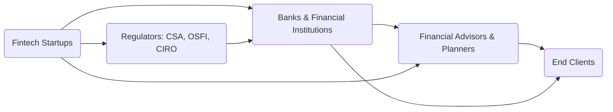

## 17.1 Fintech

Financial services are undergoing a profound transformation thanks to a wave of technological innovations commonly referred to as Fintech. Short for “financial technology,” Fintech encompasses a range of new tools, platforms, and solutions—mobile banking, peer-to-peer (P2P) lending, crowdfunding, cryptocurrencies, robo-advisors, digital payment systems, and more—all designed to increase efficiency, reduce costs, and enhance the client experience in banking, investing, and related financial areas.

For Canadian wealth management professionals, Fintech can be a game-changer. From automated regulatory compliance checks to integrated client onboarding solutions, Fintech tools promise improved productivity, better risk insights, and more personalized service offerings. However, the Fintech revolution also requires careful due diligence, robust security protocols, and ongoing regulatory compliance. This section explores the foundational concepts, examines how Fintech is being implemented in Canada, and offers best practices for advisors seeking to integrate Fintech solutions into their practice.

---

## The Growing Fintech Ecosystem in Canada

Canada’s Fintech ecosystem is thriving, supported by innovation hubs across major urban centres like Toronto, Vancouver, and Montréal. Federal and provincial governments, as well as national regulatory bodies, recognize the competitive benefits Fintech can bring to the financial services industry—fostering innovation, improving financial inclusion, and giving Canadians more efficient ways to manage their finances.

Several key factors contribute to this growth:

1. Government Incentives and Initiatives  
   • Tax credits for research and development.  
   • Grants and innovation funding at the federal and provincial levels.  
   • Collaborative programs like the OSC LaunchPad, which provide regulatory guidance to Fintech startups.

2. Established Financial Institutions Embracing Fintech  
   • Major Canadian banks (e.g., RBC, TD, BMO, Scotiabank) have ventured into digital banking solutions, acquiring Fintech startups or partnering with them.  
   • Financial planners can leverage these relationships through specialized platforms designed for seamless wealth management.

3. Supportive Regulatory Environment  
   • The Canadian Securities Administrators (CSA) and the Canadian Investment Regulatory Organization (CIRO) have provided clarity on digital advice, robo-advisor compliance, and online portfolio management.  
   • Initiatives such as open banking promise to streamline data sharing while safeguarding client privacy.

---

## Key Areas of Fintech for Wealth Management

Fintech covers a broad spectrum of tools and platforms. Below are some of the most relevant areas to wealth management professionals:

### Mobile Banking and Digital Payment Solutions

• Mobile Banking: Clients can open accounts, deposit checks, and manage their investments from smartphone applications.  
• Digital Payment Solutions: Tools like Interac e-Transfer or mobile wallets (e.g., Apple Pay, Google Pay) facilitate seamless transactions, enhancing convenience for wealth management clients and enabling instant cash transfers.

### Peer-to-Peer (P2P) Lending and Crowdfunding

• P2P Lending Platforms: Connect borrowers directly with lenders, often providing competitive rates for borrowers and higher interest returns for lenders relative to traditional savings.  
• Crowdfunding: Raises funds from a “crowd” of small investors to support various projects, whether commercial ventures, real estate development, or community initiatives. Advisors can use crowdfunding insights to alert clients to high-potential or high-risk opportunities.

### Cryptocurrencies and Blockchain

• Cryptocurrencies: Digital assets such as Bitcoin and Ethereum have introduced new investment possibilities. Canadian regulators are providing guidance on how these assets align with existing securities laws.  
• Blockchain Technology: Enables secure, decentralized record-keeping, potentially streamlining clearing and settlement processes in financial markets.

### Robo-Advisory Services

• Automatic Portfolio Management: Robo-advisors use algorithms to manage investment portfolios according to risk tolerance, goals, and timelines.  
• Hybrid Models: Many traditional firms now offer a combination of automated, algorithm-driven advice and direct interaction with human advisors.  
• Efficiency and Cost Reduction: Robo-advisors can handle routine tasks, freeing human advisors to focus on relationship-building and strategic planning.

### Data Analytics and Artificial Intelligence (AI)

• Predictive Analytics: Helps advisors forecast market movements or client life events, enabling more proactive advice.  
• Customer Relationship Management (CRM) Integration: AI-powered CRMs offer actionable insights into client behavior, helping tailor solutions more accurately.  
• Compliance and Fraud Detection: Advanced algorithms can flag suspicious transactions or anomalies in client profiles, supporting regulatory obligations.

### Regtech (Regulatory Technology)

• Automated Compliance: Real-time monitoring of client data and transactions to ensure compliance with investment and securities regulations issued by CSA, CIRO, and other bodies.  
• Reporting and Audit Trail Management: Automated generation of compliance reports with built-in data validation.

---

## How Fintech Supports Financial Planners

From client onboarding to portfolio monitoring, Fintech solutions can streamline a wealth management practice. Below are some crucial ways Fintech can support advisors:

1. **Client Onboarding and KYC**  
   Automated tools simplify identity verification, risk profiling, and Know Your Client (KYC) forms, ensuring compliance with anti–money laundering (AML) rules while improving the client experience.

2. **Portfolio Tracking and Reporting**  
   Real-time dashboards show portfolio performance across multiple accounts and asset classes. This information can integrate with CRM systems, enabling advisors to see the bigger picture at a glance.

3. **Financial Planning Tools**  
   Interactive planning software can run “what-if” scenarios, project retirement outcomes, and track potential shortfalls—all updated dynamically with real-time market data.

4. **Risk Assessment and Management**  
   AI-driven models assist in assessing market risk, currency exposures, and counterparty risk. Alerts for significant changes can prompt timely client communications.

5. **Compliance and Auditing**  
   Regtech solutions help advisors stay on top of regulatory rules, generating automated compliance reports. This reduces the time spent on manual checks and ensures consistent workflows.

---

## Compliance Considerations and Regulatory Environment

With the benefits of Fintech come obligations to remain compliant with applicable regulations. Several Canadian agencies govern different aspects of Fintech:

• The Canadian Securities Administrators (CSA): Oversees securities regulations, including rules for digital advice and investor protection.  
• The Office of the Superintendent of Financial Institutions (OSFI): Regulates banks, insurance companies, and other federal financial institutions, ensuring they maintain adequate capital and risk management practices.  
• The Canadian Investment Regulatory Organization (CIRO): Focuses on investment dealers, mutual fund dealers, and online brokerages. This includes guidance on robo-advisory services, marketing, and sales practices.

Advisors implementing Fintech tools must:

1. **Conduct Due Diligence**  
   Review the vendor’s track record, data security measures, and compliance with regulations. A reputable Fintech vendor should be transparent about its internal controls, data handling procedures, and business continuity plans.

2. **Protect Client Information**  
   Compliance with the Personal Information Protection and Electronic Documents Act (PIPEDA) is essential. Client privacy must be safeguarded, including how data is stored, transferred, and used in analytics engines.

3. **Stay Informed About Regulatory Updates**  
   Regulators frequently issue new guidelines or clarify existing regulations in light of evolving technologies. Subscribing to bulletins and participating in industry webinars can help advisors stay current.

---

## Ethical and Fiduciary Responsibilities in Fintech

While Fintech promises efficiency, it also raises important ethical considerations. Advisors adopting Fintech solutions must be mindful of the following:

1. **Data Privacy and Consent**  
   Collecting and analyzing client information must comply with privacy laws. Explicit consent is necessary to store biometric data or track investor behavior.

2. **Algorithmic Bias**  
   Automated systems are only as good as their underlying data sets and algorithms. Failure to account for bias can result in unfair or unsuitable investment recommendations.

3. **Suitability and Fiduciary Duty**  
   Robo-advice must align with the client’s best interests. Advisors remain responsible for ensuring that automated solutions adhere to CIRO guidelines on suitability and conflict of interest. Even with robo-advisors, the human advisor must exercise professional judgment and oversight.

4. **Transparency**  
   Clients should understand how the Fintech solution works, especially how algorithms drive recommendations or portfolio rebalancing. Openly explaining these processes can build trust.

---

## Practical Implementation in a Financial Practice

Integration of Fintech into an existing wealth management practice typically follows these steps:

### Step 1: Due Diligence

• **Vendor Assessment:** Evaluate multiple potential Fintech partners. Confirm their regulatory standing, data security protocols, and user satisfaction ratings.  
• **Pilot Programs:** Some firms run pilot phases with a small group of clients to test the system’s ease of use, accuracy, and reliability.

### Step 2: Systems Integration

• **CRM Integration:** Ensure seamless data flow between the Fintech tool and your CRM or portfolio management software.  
• **Compliance System Integration:** Align new tools with your compliance workflows for automated checks (KYC, AML, etc.).

### Step 3: Staff Training

• **User Training:** Provide sessions to administrative and advisory staff on system functionalities and data interpretation.  
• **Client Engagement:** Advisors need to explain the system’s benefits and constraints clearly to clients.

### Step 4: Ongoing Monitoring

• **Performance Tracking:** Evaluate the results of Fintech tools on metrics such as client satisfaction, back-office efficiency, and overall revenue.  
• **Regulatory Alerts:** Maintain a continuous update loop with CSA and CIRO to anticipate any changes in digital advice policies.  
• **Contingency Plans:** Confirm that the Fintech provider has robust data backup systems and a disaster recovery strategy.

---

## Common Pitfalls and How to Avoid Them

Implementing Fintech effectively requires awareness of typical challenges:

1. **Overreliance on Automated Tools**  
   • Pitfall: Assuming that robo-advisors or data analytics can replace human judgment entirely.  
   • Solution: Maintain a hybrid approach, blending automated insights with personalized advisory services.

2. **Failure to Train Staff Properly**  
   • Pitfall: Underestimating the learning curve, leading to confusion or errors.  
   • Solution: Offer comprehensive training sessions, with documented best practices and ongoing support.

3. **Inadequate Security Measures**  
   • Pitfall: Neglecting robust encryption, multi-factor authentication, or vendor audits.  
   • Solution: Vet Fintech providers thoroughly and establish strict internal policies for cybersecurity.

4. **Regulatory Non-Compliance**  
   • Pitfall: Rolling out Fintech solutions without confirming that they meet CSA and CIRO guidelines.  
   • Solution: Collaborate with compliance officers from the project’s inception, performing routine compliance checks.

5. **Data Integration Challenges**  
   • Pitfall: Expensive or prolonged integration processes that hamper day-to-day operations.  
   • Solution: Employ integration experts and pilot testing, ensuring system compatibility before full deployment.

---

## Fintech Ecosystem Model

To visualize the relationship among various stakeholders, consider the following diagram:

1. **Fintech Startups (A):** Develop innovative technologies and solutions.  
2. **Regulators (B):** Provide guidelines and oversight (CSA, OSFI, CIRO).  
3. **Banks & Financial Institutions (C):** Partner with or acquire Fintech startups to integrate digital capabilities.  
4. **Financial Advisors & Planners (D):** Utilize Fintech solutions to offer enhanced services and maintain compliance.  
5. **End Clients (E):** Receive improved, tech-driven financial services.

---

## Case Studies and Practical Examples

### Robo-Advisory Adoption at a Mid-Sized Brokerage

• **Overview:** A mid-sized Canadian brokerage firm partnered with a local Fintech company to create a hybrid-robo advisory offering for its retail clients.  
• **Outcome:** This move automated the initial risk profiling process, freeing advisors to conduct deeper discussions about long-term goals. As a result, advisors reported spending 40% more time on high-level strategy and client engagement, improving client satisfaction.

### Micro-Investment Apps for Younger Investors

• **Objective:** A major Canadian bank launched a mobile “micro-investing” app that rounds up everyday purchases and automatically invests the “spare change” in a diversified exchange-traded fund (ETF) portfolio.  
• **Result:** The app attracted over 100,000 new users within the first year, many of whom were under 30. The bank used this platform to introduce more comprehensive advisory services to these new investors as their wealth grew.

### Use of AI in Fraud Detection

• **Implementation:** A large wealth management firm integrated an AI-driven fraud detection system that monitored client transactions and flagged potential issues (e.g., unusual wire transfers or patterns of suspicious activity).  
• **Impact:** Within six months, the firm identified and preempted multiple fraudulent transactions, reinforcing client trust and meeting data protection requirements.

---

## Additional Resources

• **Government of Canada’s Competition Bureau Fintech Market Study Report**  
  [https://www.competitionbureau.gc.ca/eic/site/cb-bc.nsf/eng/04322.html](https://www.competitionbureau.gc.ca/eic/site/cb-bc.nsf/eng/04322.html)  

• **CIRO**  
  [https://www.ciro.ca/](https://www.ciro.ca/)  

• **CSA**  
  [https://www.securities-administrators.ca/](https://www.securities-administrators.ca/)  

• **OSC LaunchPad**  
  [https://www.osc.ca/en/industry/osc-launchpad](https://www.osc.ca/en/industry/osc-launchpad)  

• **Suggested Reading:** Paolo Sironi, “FinTech Innovation: From Robo-Advisors to Goal Based Investing and Gamification.”

• **Open-Source Tools:**  
  • [Open Banking Project](https://openbankingproject.ch/) (global community for open banking APIs)  
  • [QuantLib](https://www.quantlib.org/) (library for quantitative finance, risk analytics)

---

## Summary and Actionable Insights

Fintech represents a powerful frontier in modern wealth management. By embracing mobile banking, P2P lending, crowdfunding, robo-advisor platforms, data analytics, and blockchain solutions, Canadian financial planners can deliver more personalized, efficient, and cost-effective services to their clients. However, success hinges on striking the right balance between technological innovation and strict adherence to regulatory and ethical standards.

Key steps for advisors include:

• Ongoing education about unique Fintech features (e.g., AI algorithms, blockchain) and the resulting regulatory considerations.  
• Diligent vendor assessment, ensuring robust data security and compliance measures.  
• Combining automated insights with personalized advice, rather than relying solely on automated solutions.  
• Continual monitoring and improvement of deployed Fintech solutions.  

By thoughtfully integrating Fintech, advisors can enhance their entire advisory practice, building deeper client relationships and setting themselves apart in a rapidly evolving financial landscape.

---

## Test Your Knowledge: Canadian Fintech for Wealth Management



### Which of the following technology categories is commonly referred to as Fintech?

- [x] Digital platforms for financial services such as mobile banking and robo-advisors
- [ ] Traditional banking services with no technology
- [ ] Printed forms and ledgers for account management
- [ ] Physical currency exchange booths

> **Explanation:** Fintech specifically refers to technology-driven methods of delivering financial services, including mobile banking apps, digital payment systems, peer-to-peer lending platforms, and robo-advisory services.

### Which Canadian regulators are particularly important for Fintech solutions that involve investment advice?

- [x] The Canadian Securities Administrators (CSA) and the Canadian Investment Regulatory Organization (CIRO)
- [ ] The Federal Bureau of Investigation (FBI)
- [ ] The Securities and Exchange Commission (SEC)
- [ ] The Canada Border Services Agency (CBSA)

> **Explanation:** In Canada, the CSA and CIRO regulate investment dealers, robo-advisors, and other Fintech providers that offer securities-related services. The other listed organizations have different jurisdictions or operate outside Canada.

### What is a key advantage of robo-advisor platforms for financial planners?

- [x] They automate portfolio rebalancing and risk assessment, allowing planners more time for client relationships
- [ ] They completely remove the need for human oversight
- [ ] They only invest in conventional banking products
- [ ] They eliminate all regulatory oversight obligations

> **Explanation:** Robo-advisors use algorithms to handle tasks like portfolio rebalancing and suitability assessments, which frees advisors to focus on holistic financial planning and relationship-building. However, human oversight and regulatory compliance remain crucial.

### Which of the following is an important due diligence step when integrating Fintech solutions into a wealth management practice?

- [x] Evaluating the security measures and compliance track record of a Fintech vendor
- [ ] Purchasing as many Fintech tools as possible
- [ ] Offering untested tools directly to high-net-worth clients
- [ ] Avoiding written agreements with Fintech providers

> **Explanation:** Advisors should carefully examine a Fintech vendor’s security protocols, compliance status, and performance before integration. This ensures data protection and regulatory adherence.

### In the Canadian marketplace, what is a common use case for crowdfunding?

- [x] Gathering small contributions from many individuals to fund a business project or startup
- [ ] Using social media for personal promotion
- [x] Financing real estate investments through group contributions
- [ ] Providing direct grants from the government to businesses

> **Explanation:** Crowdfunding typically involves pooling small contributions from numerous backers to finance projects—ranging from starting a business to property development. Government grants are different and not considered crowdfunding.

### Why is algorithmic bias a concern in Fintech solutions like robo-advisors?

- [x] Biased input data or flawed algorithms could result in unsuitable investment recommendations
- [ ] It reduces workload for advisors
- [ ] It always improves portfolio performance
- [ ] It makes compliance easier

> **Explanation:** Algorithmic bias can occur if the data used to train algorithms is unrepresentative or biased. This can negatively impact investment recommendations, leading to unsuitability issues or unfair outcomes.

### Which of the following actions best aligns with protecting client data privacy in Fintech?

- [x] Using encryption protocols and obtaining explicit client consent for data sharing
- [ ] Storing data on unsecured servers for easy access
- [x] Periodically auditing cloud service providers for privacy compliance
- [ ] Publishing client information to promote transparency

> **Explanation:** Advisors must comply with privacy laws (such as PIPEDA) and use secure, encrypted systems. Regular audits of third-party data storage help maintain high standards of data protection.

### When selecting a Fintech vendor, why is it advisable to look at pilot test results within your firm?

- [x] To see how the technology performs with real client data and integrate with existing CRM systems
- [ ] To impress regulators with immediate full-scale deployment
- [ ] To skip further compliance checks
- [ ] To reduce staff training costs and time

> **Explanation:** Pilot programs provide realistic insights into system performance, user adoption, and compliance integration. This informed approach allows adjustments before a full-scale rollout.

### What is one of the key benefits of open banking for Fintech services?

- [x] It enables third-party providers to securely access bank data with client consent, fostering innovation
- [ ] It prevents banks from collaborating with Fintech startups
- [ ] It eliminates the need for KYC requirements
- [ ] It blocks AI integration in financial services

> **Explanation:** Open banking leverages standardized APIs, allowing authorized Fintech providers to access a consumer’s bank data (with permission). This facilitates innovative tools and competitive offerings.

### The ongoing fiduciary duty of a financial advisor when using automated (robo) solutions is:

- [x] True
- [ ] False

> **Explanation:** Advisors bear ultimate responsibility for ensuring all recommendations—automated or not—are suitable and in the client’s best interest. Robo solutions do not replace fiduciary obligations.



---

## For Additional Practice and Deeper Preparation

**[1. WME Course For Financial Planners (WME-FP): Exam 1](https://www.udemy.com/course/csi-wme-fp-exam1/?referralCode=1A23C67E56971C0A73D5)**  
• Dive into 6 full-length mock exams—1,500 questions in total—expertly matching the scope of WME-FP Exam 1.  
• Experience scenario-driven case questions and in-depth solutions, surpassing standard references.  
• Build confidence with step-by-step explanations designed to sharpen exam-day strategies.

**[2. WME Course For Financial Planners (WME-FP): Exam 2](https://www.udemy.com/course/csi-wme-fp-exam2/?referralCode=25879CCDED7B7905BBA8)**  
• Tackle 1,500 advanced questions spread across 6 rigorous mock exams (250 questions each).  
• Gain real-world insight with practical tips and detailed rationales that clarify tricky concepts.  
• Stay aligned with CIRO guidelines and CSI’s exam structure—this is a resource intentionally more challenging than the real exam to bolster your preparedness.

> Note: While these courses are specifically crafted to align with the WME-FP exam outlines, they are independently developed and not endorsed by CSI or CIRO.
