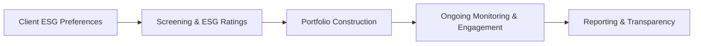

## 17.4 Responsible Investment

Responsible Investment (RI)—often interchanged with “ESG investing,” “sustainable investing,” or “socially responsible investing”—is an investment discipline that incorporates environmental, social, and governance (ESG) factors alongside traditional financial analysis. By evaluating both financial and non-financial metrics, Responsible Investment seeks to deliver positive impacts and align investor portfolios with a broader set of values, risk considerations, and long-term objectives.

In Canada, the momentum behind Responsible Investment has grown significantly in recent years, driven by a variety of factors: increasing client demand for sustainability-focused strategies, regulatory developments around ESG disclosures, and growing awareness of the financial risks associated with climate change, social inequities, human rights concerns, and poor governance.

This section explores the various approaches to Responsible Investment, outlines specific strategies for Canadian wealth advisors, and discusses the relevant regulatory frameworks. We will examine best practices, common pitfalls, and real-world scenarios within the Canadian context to help wealth managers and financial planners incorporate sustainable investing into their clients’ portfolios effectively.

---

## Foundations of Responsible Investment

### Why It Matters: Environmental, Social, and Governance Factors

Responsible Investment is rooted in the idea that environmental (E), social (S), and governance (G) issues can present both risks and opportunities for companies. By considering ESG factors, investors can:
• Identify companies more likely to generate sustainable long-term returns.  
• Mitigate exposure to potential reputational, legal, or regulatory risks.  
• Align portfolios with ethical or values-based objectives.  
• Facilitate positive social or environmental outcomes.

Industries with high carbon footprints, for instance, must be scrutinized more granularly for regulatory risks, environmental impacts, and the costs related to transitioning toward cleaner operations. Social factors like workers’ rights and product safety can directly impact brand reputation and consumer trust. Governance elements like shareholder rights, board diversity, and transparency of executive compensation can influence overall corporate health.

### Growth Drivers of Responsible Investment in Canada

Several trends have accelerated the adoption of Responsible Investment in Canada:

1. **Investor Demand:** A rising segment of retail and institutional investors, including large pension funds like the Canada Pension Plan Investment Board (CPPIB) and Ontario Teachers’ Pension Plan (OTPP), prioritize ESG considerations in their asset allocations.
2. **Regulatory Momentum:** The Canadian Securities Administrators (CSA) have been actively providing guidance on ESG-related investment fund disclosures. Meanwhile, the Canadian Investment Regulatory Organization (CIRO) offers guidelines on marketing and disclosure for responsible investment products.
3. **Global Commitments:** Canada is part of various global agreements (e.g., the Paris Agreement on climate change), which catalyze corporate efforts to address environmental challenges.
4. **Corporate Accountability:** Listed Canadian companies face increased pressure to publish ESG metrics and demonstrate sustainability performance, enhancing the availability and quality of ESG data for advisors.

---

## Approaches to Responsible Investment

Advisors can execute Responsible Investment strategies in different ways. Each approach may align differently with clients’ personal values, risk tolerance, and performance expectations.

### Negative Screening

Negative screening excludes companies, industries, or countries that do not meet certain ethical or responsibility criteria. Examples:
• Exclusion of tobacco, marijuana, alcohol, or firearms manufacturers.  
• Divestment from fossil fuels to reduce carbon exposure.  

Negative screening effectively aligns portfolios with clients’ values by removing specific exposures. However, excluding large segments of the market could also affect diversification.

### Positive Screening

Positive screening is a proactive approach that invests in companies demonstrating strong ESG practices relative to industry peers. This often involves:
• Selecting companies with progressive environmental policies.  
• Identifying firms with strong employee welfare, diversity, and community engagement programs.  
• Targeting organizations that exhibit responsible governance and robust auditing processes.  

Positive screening helps advisors find best-in-class leaders who manage ESG risks effectively and could potentially outperform laggards over the long term.

### Best-in-Class Selection

Best-in-class selection merges elements of both positive and negative screening:
• Ranks companies within a given sector or industry based on ESG performance metrics.  
• Chooses companies that lead their sectors in ESG compliance and innovation.  

This approach acknowledges that different industries have unique ESG challenges. A best-in-class strategy aims to encourage improvement within industries rather than excluding entire categories outright.

### Impact Investing

Impact investing seeks measurable social or environmental outcomes alongside financial returns. Unlike traditional investments that focus on profit maximization, impact investments aim to address societal challenges, such as:
• Affordable housing projects.  
• Renewable energy development.  
• Microfinance and financial inclusion initiatives.  

Impact investing often involves structured measurement frameworks, like the Global Impact Investing Network (GIIN) or the Impact Reporting and Investment Standards (IRIS), to track and quantify outcomes.

---

## Integrating ESG into Canadian Portfolios

### Aligning with Client Objectives

In wealth planning, ESG integration goes beyond screening. Advisors must thoroughly understand a client’s values, ethical preferences, and specific environmental or social concerns:
• Conduct in-depth conversations about why the client wants to invest responsibly. Is it purely values-based, or is it also about risk mitigation?  
• Determine acceptance of possible sector or geographic biases that might arise.  
• Evaluate how ESG investing fits within broader financial goals and risk tolerance.  

### Evaluating ESG Ratings and Methodologies

The Responsible Investment landscape includes numerous ESG rating agencies (e.g., MSCI, Sustainalytics, Refinitiv). Each may use different metrics, weightings, and data sources. Advisors should:
• Investigate how each rating provider defines and measures ESG.  
• Confirm that an ESG fund’s investment methodology aligns with the client’s principles.  
• Look under the hood of funds branded as “ESG” or “responsible” to ensure alignment with stated objectives, rather than relying solely on branding.

### Constructing a Responsible Portfolio

Below is a high-level flowchart representing how ESG factors can be integrated into a typical Canadian investment process:

1. **Client ESG Preferences:** Begin with a clear understanding of the client’s Responsible Investment goals.  
2. **Screening & ESG Ratings:** Use negative or positive screening to filter companies and cross-verify with recognized ESG ratings.  
3. **Portfolio Construction:** Build an asset allocation plan that balances ESG alignment, risk, and return. Combine equities, fixed income, and other instruments (ETFs, mutual funds) that fit the desired ESG profile.  
4. **Ongoing Monitoring & Engagement:** Continuously track companies’ ESG behavior, updating or rotating holdings if ESG performance deteriorates. Some advisors or institutional investors actively engage in shareholder activism, pushing for improved corporate policies.  
5. **Reporting & Transparency:** Offer clear, regular ESG reporting to clients, highlighting the portfolio’s progress toward both financial and impact targets.

---

## Regulatory Landscape in Canada

### CSA ESG Disclosure Requirements

The Canadian Securities Administrators (CSA) have published guidelines to improve:
• Transparency among issuers regarding ESG-related risk factors.  
• Disclosure of climate-related risks, greenhouse gas (GHG) emissions targets, and any corporate sustainability initiatives.  

Wealth advisors needing a deeper understanding of these requirements can visit the CSA’s official portal:  
[https://www.securities-administrators.ca/](https://www.securities-administrators.ca/)

### CIRO Guidelines

The Canadian Investment Regulatory Organization (CIRO) provides supplemental guidelines to ensure that client-facing resources (e.g., fund fact sheets) accurately describe how ESG factors are integrated. Advisors should consult:  
[https://www.ciro.ca/](https://www.ciro.ca/)  

These guidelines protect investors from “greenwashing” (the misrepresentation of a product as more sustainable or ethical than it is).

### Rise of Sustainable Finance

Sustainable finance takes into consideration broader macroprudential initiatives, including:
• Green bonds, which fund eco-friendly projects (e.g., wind farms, solar plants).  
• Transition bonds for companies shifting to lower-carbon practices.  
• Federal and provincial government programs incentivizing responsible investing.

---

## Practical Case Studies in the Canadian Context

### Major Canadian Bank’s ESG Fund

Consider a scenario where a Canadian bank (e.g., RBC or TD) launches an ESG-focused mutual fund. It invests in North American equities while screening out firearms manufacturers and firms with high carbon footprints. The fund then applies positive screening to identify top ESG performers in each sector. Over time, the fund outperforms comparable non-ESG funds, partly due to lower volatility and stronger brand reputation among the selected companies.

### Canadian Pension Plan’s Low-Carbon Strategy

A large Canadian pension plan implements a best-in-class selection strategy which reduces its exposure to high-emission industries but continues partial investments in sectors making tangible steps toward cleaner energy solutions. The plan actively engages with portfolio companies to improve corporate governance and reduce carbon intensity. This approach lowers the pension plan’s overall carbon footprint while maintaining diversification to meet long-term liabilities.

---

## Best Practices and Common Pitfalls

### Best Practices

1. **Client-Centric Customization:** Tailor strategies to the client’s specific ESG goals and risk tolerance.  
2. **Due Diligence:** Investigate ESG methodologies, data sources, and ratings thoroughly; confirm that “ESG-labeled” products are genuinely aligned with stated principles.  
3. **Ongoing Engagement:** Stay up-to-date with emerging regulations, corporate reporting trends, and best practices in responsible investing.  
4. **Transparency and Reporting:** Provide clear, tangible metrics about the efficacy and impact of your chosen ESG strategy.

### Common Pitfalls

1. **Greenwashing Exposure:** Accepting a fund’s marketing claims at face value without digging into its actual holdings and methodology.  
2. **Lack of Diversification:** Narrow exclusions and heavy sector biases can lead to increased portfolio concentration risk.  
3. **Inconsistent Data:** ESG data can be less uniform or standardized than financial data—rating discrepancies between providers can hamper comparability.  
4. **Regulatory Blind Spots:** Failing to comply with the evolving ESG disclosure requirements of CSA, CIRO, or any new developments.

---

## Actionable Steps for Canadian Advisors

1. **Conduct a Comprehensive Client Discovery:** Learn your client’s responsible investment priorities, personal values, financial goals, and risk tolerance.  
2. **Explore ESG Data Tools:** Use open-source libraries like Sustainable Finance Disclosure tools or proprietary rating systems to evaluate ESG performance.  
3. **Select an Approach:** Decide if negative screening, positive screening, impact investing, or a hybrid approach fits best.  
4. **Implement and Monitor:** Construct the portfolio, track performance across financial and ESG metrics, adjust holdings as necessary, and maintain comprehensive client reporting.  
5. **Stay Informed:** Regularly update client portfolio constructions and keep tabs on new guidelines, academic research, and frameworks like CSA’s ESG disclosure or RIA (Responsible Investment Association) Canada’s insights.

---

## Additional Resources and References

Below are some valuable resources to explore:

• CSA Guidance on ESG-Related Investment Fund Disclosure:  
  [https://www.securities-administrators.ca/](https://www.securities-administrators.ca/)  
• CIRO Guidelines for Responsible Investment Products:  
  [https://www.ciro.ca/](https://www.ciro.ca/)  
• Responsible Investment Association (RIA) Canada:  
  [https://www.riacanada.ca/](https://www.riacanada.ca/)  
• Academic Reference:  
  “Sustainable Investing: Revolutions in Theory and Practice” (by Herman Bril, Georg Kell, and Andreas Rasche).

---

## Conclusion

Responsible Investment is increasingly at the forefront of modern wealth management strategies. Understanding the fundamentals of ESG integration, screening methods, and Canada’s regulatory requirements enables advisors to craft comprehensive, ethical, and performance-oriented portfolios. By incorporating environmental, social, and governance factors into analytical frameworks, wealth managers can address their clients’ values, shield them from emerging risks, and foster a more sustainable economic future.

When advising clients, stay informed on evolving best practices and continuously refine your ESG approach. Responsible Investment is a dynamic, rapidly maturing field—one that is poised to remain a critical part of the Canadian wealth management landscape for years to come.

---

## Test Your Knowledge: Responsible Investment Strategies and Canadian Market Quiz



### What is the primary objective of integrating ESG factors into investment analysis?

- [x] To consider non-financial risks that could impact long-term returns
- [ ] To eliminate all investments in large-cap companies
- [ ] To guarantee above-average short-term returns
- [ ] To identify the market’s highest dividend payers                    

> **Explanation:** ESG factors help investors identify and manage non-financial risks, such as regulatory or reputational concerns, influencing returns over the longer term.

### In the context of Responsible Investment, what does “negative screening” typically involve?

- [x] Excluding companies or industries that do not meet certain ESG criteria
- [ ] Measuring the carbon footprints of portfolio holdings 
- [x] Automatically investing in companies with perfect ESG scores
- [ ] Seeking high-yield, short-term investments

> **Explanation:** Negative screening means removing companies from an investment universe if they fail to meet specific ethical or responsibility standards, such as tobacco or firearms manufacturers.

### Which approach focuses on finding ESG leaders in each sector rather than excluding entire industries?

- [ ] Impact investing
- [ ] Negative screening
- [x] Best-in-class 
- [ ] Thematic investing

> **Explanation:** Best-in-class selection identifies and invests in sector-leading companies based on ESG criteria, as opposed to excluding entire sectors outright.

### Impact investing specifically aims to achieve what distinction compared to other ESG strategies?

- [x] Measurable social or environmental impact alongside financial returns
- [ ] Exclusively higher-than-market returns
- [ ] Minimal risk by avoiding all equities
- [ ] Elimination of all sectors with negative ESG implications

> **Explanation:** Impact investments target specific societal or environmental outcomes (e.g., renewable energy, social housing) while seeking financial returns.

### What is a potential pitfall if an advisor relies on a single ESG rating provider without deeper research?

- [x] Greenwashing, as methodologies and definitions vary widely
- [ ] They might end up over-diversifying
- [x] They can guarantee consistent performance 
- [ ] It signals complete alignment with CIRO regulations

> **Explanation:** Each ESG rating provider has unique methodologies, data sets, and weighting systems. Without thorough due diligence, there is a risk of greenwashing or misinterpretation.

### Why might negative screening lead to higher concentration risk?

- [x] It can exclude large segments of the market, reducing diversification
- [ ] It systematically focuses on companies with very high volatility
- [ ] It includes all sectors without discrimination
- [ ] It duplicates the entire market index

> **Explanation:** By removing large swaths of industries or companies (like oil and gas), negative screening can limit diversification potential and lead to concentration in fewer holdings or sectors. 

### Which Canadian regulatory body has provided guidance on ESG-related investment fund disclosures?

- [ ] Bank of Canada
- [x] Canadian Securities Administrators (CSA)
- [ ] Financial Transactions and Reports Analysis Centre (FINTRAC)
- [ ] Canada Deposit Insurance Corporation (CDIC)

> **Explanation:** The Canadian Securities Administrators (CSA) guide the disclosure requirements for ESG and Responsible Investment funds to ensure transparency and consistency.

### What is the role of the Canadian Investment Regulatory Organization (CIRO) with respect to Responsible Investment?

- [ ] They solely issue licenses for portfolio managers across Canada
- [x] They provide guidelines to ensure proper marketing and disclosure of RI products
- [ ] They do not have responsibility for RI matters
- [ ] They issue corporate governance ratings for all Canadian issuers

> **Explanation:** CIRO outlines guidance to promote clear and honest representation of Responsible Investment products, protecting investors from overly optimistic or misleading claims.

### Which of the following represents a common best practice for Responsible Investment?

- [ ] Avoiding any measurement of continuous ESG performance
- [x] Offering transparent reporting on financial and ESG impact goals
- [ ] Eliminating all intangible sustainability metrics from analysis
- [ ] Committing only to near-term profit maximization

> **Explanation:** Best practices emphasize ongoing analysis, transparent reporting, and alignment with stated ESG impact objectives to maintain authenticity and investor trust.

### The practice of “greenwashing” can occur when a fund:

- [x] Markets itself as ESG or “green” but does not align with genuine sustainable principles
- [ ] Discloses all holdings and ensures comprehensive ESG analysis
- [ ] Actively engages with companies to improve ESG performance
- [ ] Follows the best-in-class approach to screening

> **Explanation:** Greenwashing refers to misleading or exaggerated claims about a fund’s environmental or social credentials without corresponding, rigorous ESG practices.



---

## For Additional Practice and Deeper Preparation

**[1. WME Course For Financial Planners (WME-FP): Exam 1](https://www.udemy.com/course/csi-wme-fp-exam1/?referralCode=1A23C67E56971C0A73D5)**  
• Dive into 6 full-length mock exams—1,500 questions in total—expertly matching the scope of WME-FP Exam 1.  
• Experience scenario-driven case questions and in-depth solutions, surpassing standard references.  
• Build confidence with step-by-step explanations designed to sharpen exam-day strategies.

**[2. WME Course For Financial Planners (WME-FP): Exam 2](https://www.udemy.com/course/csi-wme-fp-exam2/?referralCode=25879CCDED7B7905BBA8)**  
• Tackle 1,500 advanced questions spread across 6 rigorous mock exams (250 questions each).  
• Gain real-world insight with practical tips and detailed rationales that clarify tricky concepts.  
• Stay aligned with CIRO guidelines and CSI’s exam structure—this is a resource intentionally more challenging than the real exam to bolster your preparedness.

> Note: While these courses are specifically crafted to align with the WME-FP exam outlines, they are independently developed and not endorsed by CSI or CIRO.
