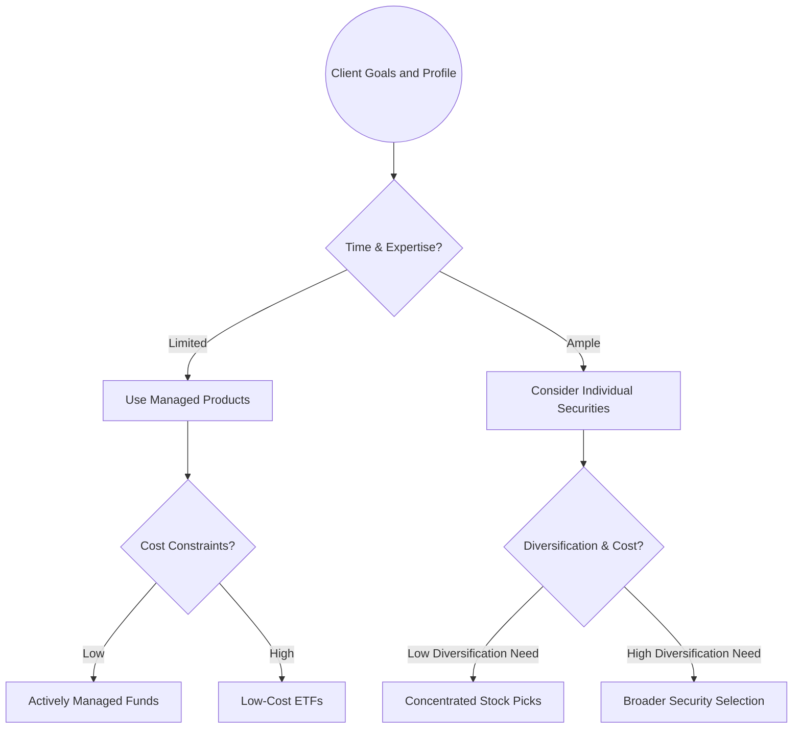

## 18.2 Individual Securities or Managed Products?

Deciding whether to invest in individual securities (e.g., stocks, bonds) or to use managed products (e.g., mutual funds, exchange-traded funds (ETFs), segregated funds) is a core challenge in the wealth management process. Many financial planners and investors struggle to balance factors such as diversification, cost, and time commitment. Smart decision-making requires a clear understanding of how each approach can align with the client’s goals, tolerance for risk, desire for involvement, and the advisor’s own expertise and licensing mandates in Canada. This section provides an in-depth look at both individual securities and managed products through a Canadian lens.

---

## Introduction

When building an investment portfolio for clients, financial planners typically weigh two main strategies:

1. Selecting individual securities—purchasing specific stocks, bonds, or alternative instruments.  
2. Investing in managed products—delegating investment decisions to professional managers through mutual funds, ETFs, segregated funds, and other pooled vehicles.

Each approach offers unique advantages and disadvantages in terms of control, cost, risk, and growth potential. Advisors must carefully evaluate client needs, market conditions, and applicable regulatory frameworks. In Canada, the Canadian Investment Regulatory Organization (CIRO) and the Canadian Securities Administrators (CSA) have established guidelines and registration requirements that influence an advisor’s scope of practice and product recommendations.

---

## Investing in Individual Securities

### Direct Ownership and Control

Many investors prefer holding individual securities because of direct control. Rather than allocating capital to a pooled investment vehicle governed by a fund manager, the investor (or advisor on behalf of the investor) decides which stocks, bonds, or other instruments to buy, hold, or sell. For clients who desire a hands-on approach or have specific sector or ethical preferences, this can be very appealing.

#### Advantages of Individual Securities

1. • Control Over Holdings:  
   Investors have full autonomy to select companies or bonds that align with their personal convictions (e.g., investing in clean energy stocks or avoiding companies with certain environmental or governance concerns).  
2. • Potentially Lower Management Costs:  
   If investors trade infrequently and manage their own portfolio, ongoing management fees (like those found in mutual funds or ETFs) may be avoided. Transaction costs through a discount brokerage (e.g., RBC Direct Investing or TD Direct Investing) can be minimal for those who execute only a handful of trades per year.  
3. • Tailored Portfolios:  
   The portfolio can be customized to address a client’s specific constraints, such as excluding certain industries or focusing on a niche market segment.

#### Disadvantages of Individual Securities

1. • Time-Consuming Research and Monitoring:  
   Ongoing evaluation of corporate financial statements, market news, and trends is required. Without robust research capabilities, even experienced investors may miss relevant information.  
2. • Higher Transaction Costs for Frequent Traders:  
   If an investor trades often (especially in small quantities), brokerage fees can accumulate quickly. Overtrading can reduce returns due to increased commissions and bid-ask spreads.  
3. • Potential Lack of Diversification:  
   Constructing a well-balanced portfolio of individual securities that spans different sectors, bond maturities, and asset classes can be challenging—especially if client portfolios are smaller in scale.

---

## Managed Products

Managed products, such as mutual funds, ETFs, hedge funds, and segregated funds, pool investor capital and invest it under the guidance of portfolio managers or investment teams. This approach facilitates diversification across multiple holdings, regions, and asset classes and leverages professional management expertise.

### Types of Managed Products

1. **Mutual Funds**: Pooled investment funds managed by professionals, often with a particular strategy (e.g., growth or value) or focus on a specific sector (e.g., Canadian equity, global technology).  
2. **Exchange-Traded Funds (ETFs)**: Funds that trade like stocks on an exchange, often tracking a specific index (e.g., S&P/TSX Composite Index). They typically have lower management expense ratios (MERs) than mutual funds, although this may vary by product.  
3. **Segregated Funds**: Insurance-based investment products offered by insurance companies. They typically include certain guarantees (e.g., guaranteed death benefit), and in some cases, creditor protection advantages.  
4. **Hedge Funds and Private Markets**: These products often require an Accredited Investor status under Canadian rules, meaning individuals must meet certain asset or income thresholds to invest.

### Advantages of Managed Products

1. • Professional Management:  
   A dedicated investment team researches securities, executes trades, and adjusts the portfolio as market conditions shift. Investors benefit from specialized expertise without having to devote personal time to security analysis.  
2. • Diversification Benefits:  
   Managed products can hold dozens or even hundreds of securities, greatly reducing unsystematic risk. For instance, a global equity fund may invest in companies around the world across different sectors.  
3. • Access to Specialized Markets:  
   Some managed products invest in narrow sectors (e.g., artificial intelligence or biotech) or asset classes (e.g., emerging markets bonds). Directly replicating such portfolios could be difficult or costly for individual investors.  
4. • Ongoing Monitoring:  
   The fund’s management team continually reassesses portfolio positions and market conditions, saving individual investors the responsibility of frequent fine-tuning.

### Disadvantages of Managed Products

1. • Management Fees and Expense Ratios:  
   Investors pay for professional management. The Management Expense Ratio (MER) can eat into returns, especially if the investor holds the fund(s) for a long period.  
2. • Less Control Over Specific Holdings:  
   Investors cannot typically influence the fund manager’s choice of securities or the fund’s investment strategy.  
3. • Potential Overlap:  
   Holding multiple mutual funds or ETFs with similar strategies can result in duplicated holdings and unintended concentration in particular stocks or sectors.

---

## Key Considerations in Choosing the Right Approach

Whether you opt for individual securities or managed products, due diligence is essential. Advisors should carefully dissect cost structures, evaluate management quality, and examine regulatory constraints.  

### Cost Structure

Both individual securities and managed products carry costs. It’s important to distinguish between explicit and implicit fees:

- **Trading Commissions**: When buying and selling individual stocks or bonds, the investor pays commissions on each trade unless trading through a commission-free brokerage solution.  
- **Management Fees (MERs/TERs)**: For funds, the Management Expense Ratio (MER) covers operating expenses, management fees, and certain administrative costs. Some mutual funds or ETFs also have a trading expense ratio (TER) that further affects net returns.  
- **Expense Ratio Transparency**: In Canada, the mandatory Fund Facts disclosures—mandated by the CSA—provide specific information about MERs, other costs, and performance track records.  

### Management Quality

When evaluating managed products, it is critical to assess the fund manager’s track record, investment philosophy, and competitive advantage. For individual securities, the investor or advisor must assume the research and ongoing monitoring role:

- **Professional Fund Managers**: Evaluate the consistency of their performance versus relevant benchmarks.  
- **Advisor Expertise**: Advisors recommending individual securities must ensure that they hold the appropriate licenses under CIRO or the securities commissions, particularly for advanced strategies like derivatives.

### Transparency and Liquidity

- **Transparency**:  
  Individual security holdings are straightforward—investors know exactly what they own. Managed products typically provide periodic holdings reports, but daily transparency varies. ETFs often disclose holdings daily, while some open-ended funds disclose quarterly or semi-annually.  
- **Liquidity**:  
  Stocks and ETFs trade on an exchange and are generally liquid throughout the trading day. Mutual funds can be redeemed at net asset value (NAV) end-of-day pricing. Segregated funds may have redemption schedules, and hedge funds can have lock-up periods.

### Regulatory Framework

In Canada, product distribution and licensing are overseen by multiple agencies:

- **CIRO**: Sets standards for the sale of mutual funds, ETFs, and certain alternative products by Approved Persons.  
- **Canadian Securities Administrators (CSA)**: Establishes registration categories for portfolio managers, investment dealers, and more. Enforces regulations for public offerings and private placements.  
- **Accredited Investor Requirements**: Access to hedge funds, private equity, or certain specialized investments typically requires accreditation based on net worth or income thresholds.

---

## Selecting the Right Approach: A Decision Framework

Choosing between individual securities and managed products depends on multiple client-specific factors:

1. **Time and Expertise**: If neither the advisor nor the client has the time or skill to research individual securities, managed products are often more suitable.  
2. **Licensing and Accreditation**: Advisors must verify that they have the appropriate registration to recommend certain products (e.g., hedge funds, private equity).  
3. **Diversification Requirements**: Clients seeking broad diversification with minimal effort may prefer funds or ETFs.  
4. **Cost Constraints**: If cost minimization is top priority, ETFs and passive index investing might be preferable to actively managed solutions. Conversely, a client who wants specialized strategies might accept higher fees for actively managed solutions.

---

## Practical Examples and Case Studies

### Example: High-Net-Worth Client Seeking Targeted Exposure

A Canadian client with a substantial net worth wants to invest in the booming technology sector. They could:

- Buy domestic and international tech stocks (e.g., Shopify, Apple, etc.) individually, requiring ongoing analysis.  
- Invest in a technology-focused ETF that automatically diversifies across global tech leaders.  

The second option may be more cost-effective and diversified, while the first provides direct control but demands higher research commitment.

### Example: Canadian Pension Funds

Major Canadian pension plans, like the Canada Pension Plan Investment Board (CPPIB), often apply a hybrid approach:

- **Direct Investments**: Large-scale holdings in real estate, infrastructure, and private equities globally.  
- **Managed Products**: Use of external managers or pooled vehicles for certain markets or specialized strategies.  

This approach underscores that even professional institutions blend individual asset ownership with managed mandates to optimize performance and diversification.

### Example: RBC or TD Mutual Funds

For retail investors seeking broad participation in Canadian equity markets, RBC or TD mutual funds provide professional management and simplified diversification. Individuals looking for cost savings may gravitate toward RBC or TD’s suite of index ETFs, often with lower MERs than actively managed funds.

---

## Best Practices and Common Pitfalls

- **Best Practices**:  
  1. Evaluate the client’s risk tolerance and time horizon before suggesting individual securities.  
  2. Benchmark MER costs of various funds using publicly available Fund Facts.  
  3. Conduct a thorough manager due diligence process, examining track records, style consistency, and any disciplinary history.  
  4. Keep an eye on tax efficiency—some managed products distribute capital gains more frequently than others.

- **Common Pitfalls**:  
  1. Overlapping managed funds that buy the same securities, inadvertently concentrating exposure.  
  2. Overtrading individual securities, leading to excessive transaction costs.  
  3. Ignoring the costs of currency conversion if investing in U.S. or international markets.  
  4. Failing to meet accredited investor criteria and inadvertently recommending (or investing in) products not suitable from a regulatory standpoint.

---

## Recommended Tools and Resources

• **CIRO Guidelines**:  
  Learn about the regulatory standards governing the sale of managed products → [https://www.ciro.ca/](https://www.ciro.ca/)  

• **Canadian Securities Administrators’ Registration Categories**:  
  Investigate portfolio manager registration requirements → [https://www.securities-administrators.ca/](https://www.securities-administrators.ca/)  

• **Fund Facts Documents**:  
  Required by the CSA, these documents detail MERs and performance metrics of specific mutual funds.  

• **Morningstar Canada**:  
  A resource (both open-source data lists and subscription-based tools) for comparing performance, MERs, and risk metrics → [https://www.morningstar.ca/](https://www.morningstar.ca/)  

• **Discount Brokerage Platforms** (e.g., Questrade, RBC Direct Investing, TD Direct Investing):  
  Compare fees and trading options when deciding whether to hold individual securities or managed funds.

---

## Summary

The choice between individual securities and managed products hinges on a clear assessment of client goals, time commitment, cost, regulatory requirements, and the level of control desired. Individual securities offer autonomy and flexibility but require intensive research and can expose investors to concentrated risks if not carefully managed. Managed products provide professional oversight, diversification, and convenience, albeit at the cost of management fees and reduced control over specific assets.

Financial planners must maintain a client-first mindset, ensuring that the chosen investment avenue aligns with the client’s objectives, risk tolerance, timeline, and personal preferences. Both approaches can coexist synergistically within a single portfolio to optimize returns and manage risk more effectively.

---

## Test Your Knowledge: Choosing Between Individual Securities and Managed Products



### Which of the following is an advantage of investing in individual securities?

- [ ] Guaranteed principal protection  
- [x] Direct control over holdings  
- [ ] Zero transaction costs  
- [ ] Automatic global diversification  

> **Explanation:** Direct control over holdings is a primary advantage, allowing investors to tailor their portfolio to personal beliefs or preferences. However, principal protection is not guaranteed, and transaction costs may apply.

### When would a financial planner most likely recommend managed products to a client?

- [ ] When the client insists on selecting each security in the portfolio  
- [ ] When the client has extensive investment knowledge and time to research  
- [x] When the client lacks the time or expertise to actively manage individual holdings  
- [ ] When the client wants total control of their investments  

> **Explanation:** Managed products are ideal for clients who lack the time or expertise to closely monitor their individual securities. The managed approach leverages professional oversight and diversification benefits.

### Which statement best describes a disadvantage of holding individual securities?

- [ ] Diversification is always guaranteed  
- [x] Lack of diversification can be a significant risk if not carefully managed  
- [ ] Research and monitoring require minimal effort  
- [ ] There are no transaction fees at all  

> **Explanation:** Constructing a diversified portfolio manually can be challenging and time-consuming, and it can expose the investor to concentrated risks if diversification is overlooked.

### Which of the following is an example of a managed product?

- [ ] Canadian Government Treasury Bills  
- [ ] A share of the Royal Bank of Canada (RY)  
- [x] A mutual fund offered by TD  
- [ ] A corporate bond from a major technology firm  

> **Explanation:** A mutual fund offered by TD is a form of managed product, where professional managers make investment decisions and maintain the fund on behalf of investors.

### What is the primary advantage of a segregated fund over a traditional mutual fund?

- [ ] Ability to select individual stocks  
- [ ] Lowest management fees in the market  
- [x] Certain guarantees (such as death benefit) and potential creditor protection  
- [ ] Fluctuations in market value are eliminated  

> **Explanation:** Segregated funds often include specific insurance guarantees, like a death benefit guarantee and potential creditor protection, which are not typically features of conventional mutual funds.

### Which cost is typically associated with owning individual securities in a self-directed brokerage account?

- [x] Trading commissions when buying or selling securities  
- [ ] Guaranteed management expense ratio (MER) deductions  
- [ ] Front-end load fees for each purchase  
- [ ] Deferred sales charges (DSC) upon sale  

> **Explanation:** Self-directed brokerage accounts charge trading commissions per transaction unless using specific commission-free platforms. MERs, front-end loads, and DSCs are typically associated with mutual funds, not individual stocks or bonds.

### Which of the following is the best reason a client might prefer to invest in an ETF over an actively managed mutual fund?

- [x] Lower MER on average  
- [ ] Absolute guarantee of outperformance  
- [x] Intraday trading flexibility  
- [ ] Unique hedge fund strategies  

> **Explanation:** Many ETFs offer lower average MERs than actively managed funds and allow intraday trading. However, there is no guarantee of outperformance solely based on structure.

### How might a financial planner address the overlap risk when a client holds multiple managed products?

- [x] Review and adjust holdings to ensure complementary exposures  
- [ ] Encourage the client to add more funds and diversify further  
- [ ] Avoid monitoring the specific holdings within each product  
- [ ] Limit the client to only one type of managed product  

> **Explanation:** Overlap occurs when multiple funds hold similar securities. Regular review is essential to ensure the client’s overall portfolio is balanced without unintended concentrations.

### Which of the following Canadian regulatory entities primarily oversees advisors' product recommendations?

- [ ] Office of the Superintendent of Financial Institutions (OSFI)  
- [x] The Canadian Investment Regulatory Organization (CIRO)  
- [ ] Canada Revenue Agency (CRA)  
- [ ] Canada Mortgage and Housing Corporation (CMHC)  

> **Explanation:** CIRO regulates many aspects of the financial advisory industry, including mutual fund dealers and investment dealers, influencing the products advisors can recommend.

### Index-based ETFs generally have lower management fees than actively managed funds. True or False?

- [x] True  
- [ ] False  

> **Explanation:** Index-based ETFs tend to have lower management fees because they passively track a benchmark index, eliminating the need for intensive research and active management.



---

## For Additional Practice and Deeper Preparation

**[1. WME Course For Financial Planners (WME-FP): Exam 1](https://www.udemy.com/course/csi-wme-fp-exam1/?referralCode=1A23C67E56971C0A73D5)**  
• Dive into 6 full-length mock exams—1,500 questions in total—expertly matching the scope of WME-FP Exam 1.  
• Experience scenario-driven case questions and in-depth solutions, surpassing standard references.  
• Build confidence with step-by-step explanations designed to sharpen exam-day strategies.

**[2. WME Course For Financial Planners (WME-FP): Exam 2](https://www.udemy.com/course/csi-wme-fp-exam2/?referralCode=25879CCDED7B7905BBA8)**  
• Tackle 1,500 advanced questions spread across 6 rigorous mock exams (250 questions each).  
• Gain real-world insight with practical tips and detailed rationales that clarify tricky concepts.  
• Stay aligned with CIRO guidelines and CSI’s exam structure—this is a resource intentionally more challenging than the real exam to bolster your preparedness.

> Note: While these courses are specifically crafted to align with the WME-FP exam outlines, they are independently developed and not endorsed by CSI or CIRO.
