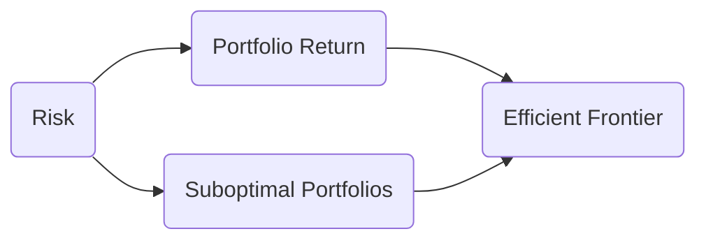

## 18.3 Portfolio Theory

Portfolio theory underpins many of the strategies and best practices used in investment management and wealth planning today. It explains how a well-diversified portfolio can reduce risk while aiming for attractive returns. This section covers Modern Portfolio Theory (MPT), the Capital Asset Pricing Model (CAPM), the Efficient Market Hypothesis (EMH), and insights from Behavioural Finance. We also explore practical Canadian examples and resources to help you integrate these concepts into everyday practice.

---

## Introduction

Portfolio theory is the foundation on which most professional investment practices—and many regulatory guidelines—are built. Its central premise is that investors should not look at a single security’s risk and return in isolation, but rather consider how each investment interacts with all other assets in the portfolio. By combining assets with different correlations, investors can manage the overall risk profile without necessarily compromising expected returns.

In Canada, wealth advisors and financial planners use portfolio theory to comply with proficiency standards established by organizations such as CIRO (Canadian Investment Regulatory Organization). Many of these concepts are reflected in the risk disclosure requirements mandated by the Canadian Securities Administrators (CSA), which, for example, require mutual funds and exchange-traded funds (ETFs) to disclose their risk levels based on measures such as standard deviation.

---

## Modern Portfolio Theory (MPT)

Harry Markowitz developed Modern Portfolio Theory in the 1950s. His revolutionary insight was that the volatility (risk) of an investment must be evaluated based on how that investment interacts with all others in a portfolio, rather than looking at it in isolation.

### Concept of Diversification

• Diversification involves spreading investments across different assets, geographical regions, and industries.  
• By ensuring that holdings do not share the same risk factors, investors can reduce unsystematic risk—also known as idiosyncratic risk—that is specific to a company or an industry.

### Correlation and Risk Reduction

• The magic word behind MPT is correlation.  
• If two assets are perfectly correlated (correlation coefficient = +1), an increase in one asset's value is always matched by an increase in the other’s value as well.  
• If two assets move in opposite directions (significant negative correlation), owning both may help smooth out the overall portfolio’s returns.

Real-world Canadian Example:  
Imagine an investor holding shares of TD Bank (a large Canadian bank) and shares of Canadian Natural Resources (a major Canadian energy company). Because the banking sector and the energy sector are influenced by different economic drivers, they are not perfectly correlated. By combining these two stocks, the investor may reduce the portfolio’s volatility compared to investing in only one stock.

### The Efficient Frontier

Markowitz introduced the concept of the “efficient frontier,” a curve on a risk-return graph that represents the set of portfolios yielding the maximum expected return for each level of risk.

**How to interpret the diagram**:  
1. The horizontal axis measures portfolio risk (often standard deviation or variance).  
2. The vertical axis measures the portfolio’s expected return.  
3. The dotted curve labeled “Efficient Frontier” shows portfolios that are optimally diversified.  
4. Portfolios below the efficient frontier (D) are suboptimal because they either take on too much risk for the return they generate or offer too little return for the level of risk assumed.

### Practical Implementation in Canada

• Financial institutions such as RBC and BMO offer model portfolios or mutual funds that are constructed to align closely with efficient frontier concepts.  
• Tools: Advisors can use open-source frameworks in R, such as the “PortfolioAnalytics” package, to conduct Markowitz mean-variance optimization for various client goals and risk appetites.

---

## Capital Asset Pricing Model (CAPM)

### Overview

The Capital Asset Pricing Model (CAPM) builds on Markowitz’s work by linking each asset’s expected return to its systematic risk (market risk). The key contribution is the notion of “beta,” which measures how sensitive a particular asset or portfolio is to market movements.

The standard CAPM equation is:


E(R_i) = R_f + \beta_i \, [E(R_m) - R_f]


Where:  
• \\( E(R_i) \\) = Expected return of the asset i  
• \\( R_f \\) = Risk-free rate (e.g., yield on Government of Canada treasury bills)  
• \\( \beta_i \\) = Beta of the asset i relative to a market index (often the S&P/TSX Composite Index in Canada)  
• \\( E(R_m) \\) = Expected return of the market portfolio

### Systematic vs. Unsystematic Risk

• **Systematic Risk (Market Risk):** Risk affecting the entire market or a broad sector. This risk cannot be diversified away by adding more securities within the same market. Examples include recessions or significant regulatory changes.  
• **Unsystematic Risk (Idiosyncratic Risk):** Risk specific to a particular company or industry. This risk can be mitigated by adding different securities to the portfolio.

### Beta in the Canadian Market

In the Canadian context, beta is often measured relative to the TSX Composite Index:  
• If an asset’s beta is 1.2, it means the asset is expected to move 1.2% for every 1% move in the TSX Composite.  
• If an asset’s beta is 0.8, it moves less than the broader market, suggesting a lower degree of systematic risk.

### Critiques and Limitations

While CAPM remains widely taught, critics highlight that real-world markets may behave differently than the CAPM assumes. Beta is a backward-looking measure based on historical data, and future correlations and volatilities may change. Additionally, CAPM presupposes that markets are efficient, an assumption that may not always hold.

---

## Efficient Market Hypothesis (EMH)

### Defining EMH

The Efficient Market Hypothesis proposes that prices in a well-functioning market incorporate all available information at any given time. Consequently, it becomes difficult for any active manager to consistently “beat the market,” especially when fees and transaction costs are included.

### Forms of Market Efficiency

1. **Weak Form Efficiency:** Asset prices reflect all historical market data (e.g., past prices).  
2. **Semi-Strong Form Efficiency:** Asset prices reflect all publicly available information (including financial statements and news releases).  
3. **Strong Form Efficiency:** Asset prices reflect all information, both public and private (strong form efficiency is considered more hypothetical and rarely holds in practice).

### Implications for Advisors

1. **Index Investing vs. Active Management:** If markets are at least semi-strong form efficient, beating the market via stock-picking may be difficult over the long term.  
2. **Behavioral Anomalies:** Despite EMH, markets may experience price distortions related to investor psychology and other external factors.

---

## Behavioural Finance

Behavioural Finance challenges the rational assumptions underpinning EMH and portfolio theory. It studies how emotional, cognitive, and psychological biases can affect decision-making in financial markets.

### Common Biases

• **Overconfidence Bias:** Investors overestimate their ability to pick winning stocks.  
• **Herd Mentality:** People follow the crowd, buying or selling securities because everyone else is doing so, even if fundamentals do not support the action.  
• **Loss Aversion:** Investors feel the pain of losses more acutely than the pleasure of gains, sometimes leading them to hold onto losing positions for too long.

### Policy and Planning Implications

• Advisors should educate clients on the risks of emotional decision-making.  
• Helping clients establish a disciplined investment policy statement (IPS) can mitigate knee-jerk reactions to market volatility.  
• Continuous monitoring of portfolios—coupled with regular discussion of risk tolerance—can help clients stay the course.

---

## Putting It All Together: A Canadian Perspective

### Portfolio Construction Process

1. **Assess Client Goals and Risk Profile:** Use KYC (Know Your Client) forms and in-depth discovery to determine financial objectives, risk tolerance, and time horizon.  
2. **Determine Asset Allocation:** Based on the insights from MPT, select a mix of Canadian and global equities, fixed income, and alternative investments (e.g., REITs) suitable for the client’s risk-return objectives.  
3. **Optimize Using Tools:** Use open-source software (e.g., R’s “PortfolioAnalytics”) to model potential portfolios. Advisors can also leverage in-house resources from Canadian banks like RBC or TD.  
4. **Ongoing Monitoring:** Rebalance according to a set schedule or when asset allocations drift significantly from target levels.

### Regulatory Compliance in Canada

• CIRO sets proficiency standards, ensuring registered representatives understand risk management, portfolio construction, and suitability guidelines.  
• CSA (Canadian Securities Administrators) regulates mutual fund prospectus disclosures, focusing on standardized risk rating and performance data for retail investors.

### Example: A Hypothetical Client Portfolio

Suppose a client has moderate risk tolerance and a 10-year time horizon. A potential allocation might be:  
• 50% in Canadian and global equities (focus on diversified sectors: financials, energy, tech)  
• 40% in Canadian and international bonds or bond ETFs (to mitigate volatility)  
• 10% in alternative assets (e.g., Canadian REITs, infrastructure funds)

Advisors would calculate the portfolio’s expected return and volatility based on historical correlations among these asset classes. By strategically combining assets with lower correlations, the portfolio may offer a smoother ride while providing growth potential.

---

## Additional Resources

• **CIRO Proficiency Standards:** Ensure your knowledge aligns with Canadian proficiency requirements.  
• **CSA Guidance:** Review mutual fund risk disclosure guidelines to understand how products classify risk levels.  
• **Open-Source Frameworks:** “PortfolioAnalytics” package in R is a powerful tool for performing mean-variance optimization and backtesting various portfolio strategies.  
• **Reading List:**  
  - “Modern Portfolio Theory and Investment Analysis” by Elton, Gruber, Brown, & Goetzmann.  
  - “The Intelligent Investor” by Benjamin Graham.  

---

## Key Takeaways

1. **Modern Portfolio Theory** underscores diversification’s power to manage risk without sacrificing return.  
2. **CAPM** links an asset’s expected return to its market sensitivity (beta) and highlights the distinction between systematic and unsystematic risks.  
3. **Efficient Market Hypothesis** posits that markets incorporate all available information into security prices, but real-world outcomes may deviate due to human biases.  
4. **Behavioural Finance** reminds us that investors can behave irrationally, reinforcing the importance of structured planning and objective decision-making.  
5. **Canadian Regulators** emphasize portfolio suitability and clear risk disclosure, ensuring clients’ portfolios align with their goals and objectives.

Ultimately, understanding portfolio theory is about knowing why a portfolio is structured the way it is and helping clients remain disciplined in their investment approach. By balancing theory with practical market knowledge, financial planners can create robust portfolios that stand the test of time.

---

## Test Your Knowledge: Portfolio Theory, CAPM, and EMH Quiz



### Which of the following statements best describes Modern Portfolio Theory (MPT)?

- [ ] It suggests holding only a single stock reduces risk.
- [x] It emphasizes that an investor should consider how assets interact as part of an overall portfolio.
- [ ] It recommends short-term trading as the best way to increase returns.
- [ ] It implies that diversification has no meaningful effect on systematic risk.

> **Explanation:** MPT focuses on the diversification of assets and the correlation among them, highlighting that overall risk can be reduced by holding assets that are not perfectly correlated.

### Under CAPM, which term best describes an asset’s sensitivity to the overall market?

- [ ] Alpha
- [ ] Standard deviation
- [x] Beta
- [ ] Correlation coefficient

> **Explanation:** Under CAPM, beta measures how much an asset’s price is expected to move relative to changes in the broader market.

### Which statement is true about the Efficient Frontier?

- [x] It is a curve that represents portfolios with the highest expected return for each level of risk.
- [ ] It is a strategy focused on speculative, high-risk investments only.
- [ ] It applies only to government bond portfolios.
- [ ] It is a single-point estimate of overall market risk.

> **Explanation:** The Efficient Frontier is a graphical representation of optimal portfolios that maximize returns for a given level of risk.

### According to the Efficient Market Hypothesis (EMH), which of the following is most likely?

- [x] In a semi-strong form efficient market, asset prices reflect all publicly available information.
- [ ] In a weak form efficient market, asset prices reflect all confidential insider information.
- [ ] In a strong form efficient market, fundamental analysis always identifies mispriced securities.
- [ ] In a semi-strong form efficient market, technical analysis will consistently beat the market.

> **Explanation:** Under semi-strong form efficiency, all publicly available information is already priced in, making it challenging for active managers to consistently outperform the market.

### Which of the following biases is categorized under Behavioural Finance?

- [ ] Low standard deviation
- [x] Overconfidence
- [ ] Asset allocation
- [x] Herd mentality

> **Explanation:** Overconfidence and herd mentality are both biases that can lead to irrational decision-making. They are key concepts in Behavioural Finance.

### When using CAPM in the Canadian market, which index is typically used as the “market portfolio” benchmark?

- [ ] The Dow Jones Industrial Average
- [ ] The S&P 500
- [ ] The NASDAQ
- [x] The S&P/TSX Composite Index

> **Explanation:** In Canada, the S&P/TSX Composite Index is commonly used as the proxy for the overall market portfolio.

### Which statement about unsystematic risk is correct?

- [x] It can be minimized through diversification.
- [ ] It is driven by overall market movements.
- [x] It is also known as idiosyncratic risk.
- [ ] It cannot be eliminated from a portfolio under any circumstances.

> **Explanation:** Unsystematic or idiosyncratic risk is specific to a company or industry and can be substantially mitigated by diversifying across many unrelated assets.

### Which of the following would likely have the lowest correlation with a Canadian equity portfolio?

- [ ] Another Canadian equity ETF
- [ ] A Canadian bank stock
- [ ] An ETF that invests in the TSX 60
- [x] A Canadian REIT (Real Estate Investment Trust)

> **Explanation:** While a Canadian REIT still has some correlation to the local economy, it tends to have a lower correlation to the broader equity market than another pure equity product would.

### Which of the following is a practical open-source tool for portfolio optimization in R?

- [ ] Excel Solver
- [ ] Python TensorFlow
- [ ] C++ library
- [x] PortfolioAnalytics Package

> **Explanation:** The “PortfolioAnalytics” package in R is a powerful, open-source resource for mean-variance optimization and other portfolio analysis techniques.

### All else being equal, if markets are semi-strong form efficient, is it likely that active fund managers can consistently outperform the market?

- [x] True
- [ ] False

> **Explanation:** In a semi-strong form efficient market, all publicly available information is already factored into prices, making it difficult for active managers to systematically outperform after fees.



---

## For Additional Practice and Deeper Preparation

**[1. WME Course For Financial Planners (WME-FP): Exam 1](https://www.udemy.com/course/csi-wme-fp-exam1/?referralCode=1A23C67E56971C0A73D5)**  
• Dive into 6 full-length mock exams—1,500 questions in total—expertly matching the scope of WME-FP Exam 1.  
• Experience scenario-driven case questions and in-depth solutions, surpassing standard references.  
• Build confidence with step-by-step explanations designed to sharpen exam-day strategies.

**[2. WME Course For Financial Planners (WME-FP): Exam 2](https://www.udemy.com/course/csi-wme-fp-exam2/?referralCode=25879CCDED7B7905BBA8)**  
• Tackle 1,500 advanced questions spread across 6 rigorous mock exams (250 questions each).  
• Gain real-world insight with practical tips and detailed rationales that clarify tricky concepts.  
• Stay aligned with CIRO guidelines and CSI’s exam structure—this is a resource intentionally more challenging than the real exam to bolster your preparedness.

> Note: While these courses are specifically crafted to align with the WME-FP exam outlines, they are independently developed and not endorsed by CSI or CIRO.
