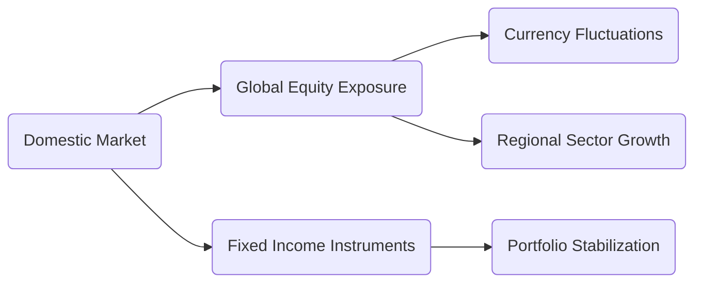

## 18.4 International Investing

International investing gives Canadian wealth managers and financial planners the opportunity to expand their clients’ portfolios beyond domestic markets and tap into broader sources of potential growth. While investing outside of Canada can enhance diversification and reduce overall portfolio volatility (especially when correlations between various global markets are low), it also introduces additional risks, including currency fluctuations, political upheavals, varied tax regimes, and differing regulations. This section provides an in-depth exploration of the benefits, considerations, and strategies associated with international investing, offering a solid foundation for advisors seeking to manage global opportunities for their clients.

---

## Introduction

Canadian investors and advisors have historically focused on the domestic markets—particularly the Toronto Stock Exchange (TSX) for equities and Canadian fixed-income instruments. However, the global capital landscape offers far more depth and variety. By incorporating international assets, wealth advisors can broaden the opportunity set, leverage sectoral or regional outperformance, and potentially enhance long-term risk-adjusted returns.

That said, international investing requires careful analysis of the political, economic, and regulatory environments in each target jurisdiction. New frameworks and guidelines developed or enforced by Canadian institutions—such as the Canadian Securities Administrators (CSA) and the Canadian Investment Regulatory Organization (CIRO)—also help shape how advisors conduct due diligence for foreign assets. Mastering these guidelines is essential for ensuring compliance and safeguarding client interests.

---

## Benefits and Rationale

### Diversification

Global diversification can reduce volatility by spreading investments across multiple regions and markets. This approach can insulate portfolios from localized downturns in the Canadian economy. If a significant event negatively impacts the TSX, an investor with a global portfolio may be partially shielded because other regions might not be affected to the same degree.

• Example: During a domestic economic downturn heavily affecting commodities, an investor with part of their portfolio in emerging Asian technology stocks might achieve better overall performance compared to an entirely Canadian-focused portfolio.

### Access to Growth

Certain foreign markets may exhibit faster economic growth than Canada. This is especially notable in emerging markets such as China, India, or regions in Southeast Asia. High-growth industries—like advanced technology, renewable energy, and certain health care segments—tend to cluster in specific geographies. Investing internationally can help advisors capitalize on these opportunities early.

• Example: RBC Global Asset Management often offers global equity funds specializing in emerging markets. These funds target companies that could achieve double-digit growth in sectors like e-commerce, biotechnology, or clean energy.

### Currency Exposure

Currency fluctuations can significantly amplify or dampen returns. When the Canadian dollar weakens against a foreign currency, the returns on international investments denominated in that foreign currency may increase (when converted back to CAD), and vice versa. Although currency movements introduce additional volatility, they can also serve as a return enhancer if properly managed.

• Example: A Canadian investor purchases U.S. equities worth USD 10,000. If the USD strengthens against the CAD by 5%, the investor benefits from both any gains on the U.S. stock and the currency appreciation when converting back to Canadian dollars.

---

## Risks and Considerations

### Country Risk

“Country risk” encompasses political instability, governance quality, economic policies, and social factors. Advisors need to evaluate variables such as inflation risk, interest rates, and geopolitical tensions that could depress the value of an investment. Even established markets like the United Kingdom or European Union countries face periodic swings due to political shifts or policy changes.

• Case Study: A Canadian pension fund invests in a frontier African market that sees political unrest. While the initial returns were attractive, political upheaval caused the market to drop sharply, highlighting the importance of geopolitical due diligence.

### Regulatory Differences

Foreign accounting standards, disclosure requirements, and enforcement regimes can differ markedly from Canadian standards overseen by the CSA. Some countries might have less transparent financial reporting, which can heighten the risk of investing in certain foreign entities. Understanding these differences helps advisors avoid misinterpreting financial statements or regulatory filings.

• Practical Tip: Refer to CIRO guidelines (https://www.ciro.ca/) and consult legal and accounting specialists familiar with local rules before purchasing foreign securities. Additionally, ensure compliance with CSA Know-Your-Product (KYP) obligations for cross-border assets.

### Tax Issues

Foreign tax regulations can be complex. Taxes may be withheld at source on dividends, interest payments, or capital gains. Without proper structuring, investors risk double taxation. Professional advice—particularly during estate planning or setting up offshore business structures—helps minimize tax leakage. The Canada Revenue Agency (CRA) offers resources (e.g., the International Tax Services Office) to guide Canadians on cross-border tax questions:  
• https://www.canada.ca/en/revenue-agency.html

### Liquidity

Emerging or frontier markets can have lower trading volumes and higher bid-ask spreads, making it more difficult (and expensive) to purchase or sell securities quickly. Advisors should ensure there are contingency plans if liquidity becomes an issue, particularly in times of market stress.

### Currency Risk

Exchange rate changes remain a key factor in international portfolios. Advisors can mitigate or eliminate this risk by using currency-hedged products, currency forwards, or other derivative contracts. Before employing these hedges, planners must fully understand how each derivative impacts the portfolio’s net risk/return profile.

---

## Approaches to International Investing

There is no one-size-fits-all route to gaining international exposure. A variety of vehicles can align with clients’ risk tolerances, investment timelines, and cost considerations.

### Direct Purchase of Foreign Securities

**What It Entails**: Buying stocks or bonds traded on foreign exchanges (e.g., NYSE, LSE, HKEX).  
• Pros: Direct ownership; control over which assets to hold; potential for customized sector bets.  
• Cons: Requires in-depth due diligence on foreign firms; exposure to currency risk; complexity with foreign brokerage accounts; potentially higher transaction fees.

### Managed Products with Global Mandates

Global mutual funds and Exchange-Traded Funds (ETFs) are widely accessible for Canadian investors. Managed funds may use various strategies— from broad global indexes to active thematic approaches (climate change, emerging tech, etc.).

• Example: iShares or Vanguard Global ETFs that track the MSCI World Index.  
• Pros: Diversification; professional management; immediate, broad global exposure.  
• Cons: Management fees; tracking error for some ETFs; limited customization.

### Regional or Single-Nation Funds

Investors looking for specific geographic exposure—e.g., Europe, Asia-Pacific, or Latin America—may opt for regionally focused funds. Advisors can also find single-nation funds for countries like India, China, or Brazil.

• Pros: Targeted exposure to a single region or country; potential for high returns if local conditions are favorable.  
• Cons: Heightened risk if that region faces a downturn or political instability.

### Multinational Corporations

Investing in large Canadian companies with substantial international operations—e.g., banks like TD Bank or RBC that operate globally—can provide indirect foreign exposure. Although these corporations are listed on domestic exchanges, a significant portion of their revenues may come from foreign markets.

• Pros: Familiar Canadian regulatory environment, while still benefiting from global revenue streams.  
• Cons: Limited to sectors where large Canadian multinationals operate; indirect and potentially uneven foreign exposure.

---

## Practical Examples and Case Studies

1. **RBC Global Equity Fund**  
   • A hypothetical RBC client invests $50,000 in an RBC Global Equity Fund that focuses on developed markets (U.S., Europe, Japan) and emerging markets. While the Canadian market faces a slowdown, gains from U.S. technology and European industrials help offset domestic losses, illustrating the diversification benefit.

2. **TD Direct Investing Client**  
   • Through the TD Direct Investing platform, a client buys stock in a multinational telecommunications firm based in Finland. Despite robust performance from the company, the euro weakens against the Canadian dollar, slightly reducing net returns upon conversion back to CAD. This highlights the role of currency risk and the value of monitoring economic factors in the Eurozone.

---

## Step-by-Step Approach to Evaluating International Investments

1. **Define Client Objectives:** Identify the client’s risk tolerance, time horizon, and desired asset allocation.  
2. **Select Appropriate Markets:** Assess market conditions, GDP growth rates, and macroeconomic forecasts (e.g., using IMF publications at https://www.imf.org/).  
3. **Conduct Due Diligence:** Examine regulatory environments, accounting standards, and political risks.  
4. **Analyze Currency Impact:** Determine if a currency-hedged product or derivative strategy (e.g., via QuantLib’s open-source libraries for currency derivatives, https://www.quantlib.org/) is appropriate.  
5. **Consider Tax Implications:** Investigate withholding taxes, double taxation issues, and CRA requirements.  
6. **Review Liquidity and Trading Costs:** Check bid-ask spreads and accessibility of the market.  
7. **Integrate into the Portfolio:** Align the international investment with domestic holdings to optimize diversification benefits.  
8. **Monitor Performance and Adjust:** Continuously review geopolitical and market developments, rebalancing as needed.

---

## Diagram: Global Portfolio Diversification

Below is a simple Mermaid diagram illustrating how international equity and domestic assets can interact within a broader portfolio framework:

**Explanation**:  
• Domestic Market (A) anchors the portfolio in familiar territory with Canadian equities and bonds.  
• Global Equity Exposure (B) introduces new growth opportunities but also comes with exchange rate considerations (D) and potential regional outperformance (E).  
• Fixed Income Instruments (C) (domestic or global) can help stabilize returns (F).

---

## Glossary

• **Frontier Market**: A small, developing country market with lower liquidity and market capitalization than emerging markets. Examples include certain African or Middle Eastern nations.  
• **Currency Hedge**: Utilizing derivatives or other financial products designed to offset exposure to currency movements.  
• **Withholding Tax**: Tax withheld at the source on income such as dividends or interest payments. Rates can vary based on tax treaties.  
• **Global Mandate**: A broad investment strategy that allows managers to invest across various global markets, with few geographical limitations.

---

## References and Additional Resources

• **CIRO**: https://www.ciro.ca/ – Guidelines on investment products, including leveraged or complex products involving international exposure.  
• **CSA**: https://www.securities-administrators.ca/ – Regulatory updates and resources for cross-border securities compliance.  
• **Canada Revenue Agency (CRA)**: https://www.canada.ca/en/revenue-agency.html – International Tax Services Office guidance, forms, and tax treaty information.  
• **QuantLib**: https://www.quantlib.org/ – Open-source tool for pricing derivative products, including currency-hedged strategies.  
• **Recommended Reading**:  
  - “Global Investing: The Professional’s Guide to the World Capital Markets” by Roger G. Ibbotson and Gary P. Brinson.  
  - IMF Publications: https://www.imf.org/ – Reports on macroeconomic trends, enabling better insight into foreign investment climates.

---

## Summary and Key Takeaways

• International investing offers significant benefits—diversification, growth opportunities, and currency-driven returns—yet demands thorough due diligence.  
• Key risks revolve around country-specific factors, regulatory divergences, tax complexity, and currency exposure.  
• Advisors can access global markets via direct securities purchase, managed funds, or investments in Canadian multinationals with substantial foreign footprints.  
• Effective international portfolio construction requires a well-defined process that includes analysis of taxes, currency hedging options, liquidity, and ongoing market monitoring.  
• Canadian investors should stay updated on CSA and CIRO developments to align cross-border investments with regulatory requirements.  
• By combining financial tools, professional advice, and robust research, advisors can help clients harness the full potential of international investing in a manner consistent with their risk profiles and financial goals.

---

## Test Your Knowledge: International Investing Essentials Quiz



### Which of the following is a primary advantage of international investing for Canadian investors?
- [x] Diversification benefits due to potentially lower correlations with domestic markets
- [ ] Elimination of all currency risk
- [ ] Guaranteed higher returns than the Canadian market
- [ ] Exemption from capital gains taxes in foreign jurisdictions

> **Explanation:** International investing can help investors diversify and reduce portfolio volatility if correlations are lower among global markets. However, it does not guarantee higher returns, nor does it eliminate taxes or currency risk.

### What is one potential drawback of investing in frontier markets compared to more developed markets?
- [ ] Lower expected returns due to slow growth
- [x] Reduced liquidity and potentially higher bid-ask spreads
- [ ] No currency risk
- [ ] Minimal political risk

> **Explanation:** Frontier markets often have lower liquidity compared to more developed or emerging markets, leading to higher transaction costs and potential execution challenges. Political risk can also be higher in these regions.

### When a Canadian investor buys U.S. equities, how can a strong USD relative to the CAD affect the investor’s returns?
- [x] It can increase the investor’s returns once converted back to Canadian dollars
- [ ] It always results in currency losses
- [ ] It does not affect returns at all
- [ ] None of the above

> **Explanation:** A stronger USD means that when converting any gains (or losses) back to CAD, the investor sees an amplified effect. If the USD appreciates, the Canadian investor's returns can be enhanced.

### Why is it crucial for Canadian financial planners to analyze regulatory environments when investing abroad?
- [ ] Foreign regulators always have the same standards as Canadian regulators
- [ ] International regulations rarely impact investment returns
- [x] Accounting standards, disclosure practices, and enforcement can differ significantly
- [ ] Currency risk is the only factor to consider

> **Explanation:** Regulatory differences—such as alternative accounting standards or varying disclosure requirements—can impact the transparency and risk profile of foreign investments.

### Which approach might best suit an investor who wants broad, immediate global exposure with minimal administrative complexity?
- [ ] Purchasing shares of a single foreign company
- [x] Investing in a global equity ETF or mutual fund
- [ ] Engaging in currency derivatives solely
- [ ] Only holding domestic treasury bills

> **Explanation:** A global equity fund or ETF provides quick and diversified access to international markets with minimal operational effort, making it ideal for investors requiring broad coverage.

### A Canadian client invests in a European stock that pays annual dividends. Which factor is most likely to reduce the net dividend the client receives?
- [x] Foreign withholding taxes imposed by the European jurisdiction
- [ ] Fluctuations in the price of gold
- [ ] Lower brokerage commissions due to advanced regulation
- [ ] None of the above; dividends remain the same

> **Explanation:** Many countries withhold a portion of dividends at the source for tax compliance. Without a tax treaty provision or proper planning, the Canadian investor receives less than the gross dividend.

### In the context of international investing, how can a currency hedge benefit a Canadian investor?
- [x] It can mitigate or eliminate foreign exchange losses due to an unfavorable shift in exchange rates
- [ ] It guarantees higher returns
- [x] It can help stabilize portfolio performance when the Canadian dollar strengthens
- [ ] It has no impact on risk management

> **Explanation:** Currency hedging strategies, such as forwards or options, allow investors to protect their positions from adverse currency movements (e.g., a strengthening CAD reducing the value of foreign assets).

### What is a key reason why emerging-market stocks may offer higher growth potential than Canadian stocks?
- [ ] No political or economic risks exist in emerging markets
- [ ] Currency risk is entirely absent
- [ ] Emerging markets do not have corporate taxes
- [x] Some emerging economies have faster GDP growth rates and expanding consumer bases

> **Explanation:** Many emerging markets experience robust economic expansion and demographic trends that can fuel significant corporate revenue and profit growth.

### Which of the following best describes the benefit of investing in Canadian multinational corporations (e.g., large banks) with substantial international operations?
- [x] Indirect exposure to global market opportunities while investing in a security regulated within Canada
- [ ] Elimination of all foreign currency exposure
- [ ] Guaranteed tax exemptions on all global revenue
- [ ] Mandatory listing on every major global exchange

> **Explanation:** Canadian multinational corporations earn significant revenue abroad, creating indirect exposure to global markets. This approach can reduce certain regulatory complexities while still providing some international diversification.

### True or False? Directly purchasing foreign securities on a foreign exchange always involves less complexity than investing in a global mutual fund.
- [x] True
- [ ] False

> **Explanation:** This statement is false. Directly purchasing foreign securities can be more complex due to differing regulations, currency conversion, and brokerage account requirements. A global mutual fund can simplify access, professional management, and diversification.



---

## For Additional Practice and Deeper Preparation

**[1. WME Course For Financial Planners (WME-FP): Exam 1](https://www.udemy.com/course/csi-wme-fp-exam1/?referralCode=1A23C67E56971C0A73D5)**  
• Dive into 6 full-length mock exams—1,500 questions in total—expertly matching the scope of WME-FP Exam 1.  
• Experience scenario-driven case questions and in-depth solutions, surpassing standard references.  
• Build confidence with step-by-step explanations designed to sharpen exam-day strategies.

**[2. WME Course For Financial Planners (WME-FP): Exam 2](https://www.udemy.com/course/csi-wme-fp-exam2/?referralCode=25879CCDED7B7905BBA8)**  
• Tackle 1,500 advanced questions spread across 6 rigorous mock exams (250 questions each).  
• Gain real-world insight with practical tips and detailed rationales that clarify tricky concepts.  
• Stay aligned with CIRO guidelines and CSI’s exam structure—this is a resource intentionally more challenging than the real exam to bolster your preparedness.

> Note: While these courses are specifically crafted to align with the WME-FP exam outlines, they are independently developed and not endorsed by CSI or CIRO.
