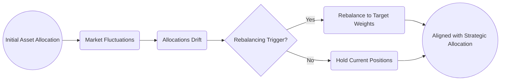

## 19.4 Rebalancing

Rebalancing is a foundational pillar of prudent wealth management. Even the most carefully constructed asset allocation will shift over time if left unattended, driven by the ebb and flow of the markets. The goal of rebalancing is straightforward: to ensure that your client’s portfolio remains aligned with their target allocations and, by extension, their risk tolerance and long-term objectives.

This section explores various rebalancing methods, from routine calendar-based systems to more nuanced threshold-based triggers. We will also delve into the critical role that transaction costs, tax considerations, and behavioral factors play in shaping effective rebalancing decisions.

-----------------------------------------------------------------------------------------------------

### The Purpose of Rebalancing

Over time, different asset classes—even within the same broad category—perform differently. For instance, Canadian equities could surge due to favorable market conditions, while global equities lag, or fixed income might remain stable regardless of domestic market volatility. As a result, the portfolio’s actual weight of each component drifts from its strategic allocation.

1. **Risk Management:** By rebalancing, you bring the risk exposures (e.g., equity vs. fixed income) back into line with the client’s original risk profile. Without periodic rebalancing, a portfolio that started with 60% equities could end up with 70% or higher if equities outperform, significantly altering the risk-return dynamics.

2. **Return Enhancement:** While rebalancing is primarily about risk control, research such as that highlighted in “The Intelligent Asset Allocator” by William Bernstein has shown that consistent rebalancing can also improve long-term risk-adjusted returns. In many cases, it forces investors to “buy low and sell high” by selling assets that have risen sharply (winners) and buying underperforming assets (potential future winners).

3. **Client Discipline **: Rebalancing serves as a policy-based guideline that helps clients and wealth managers make objective decisions, reducing the emotional temptation to chase high-performing assets or abandon underperformers prematurely.

-----------------------------------------------------------------------------------------------------

### Common Rebalancing Methods

The method of rebalancing you recommend depends on client objectives, risk preferences, transaction cost sensitivity, and practical considerations like account type (RRSP, TFSA, non-registered).

#### Calendar-Based Rebalancing

Under calendar-based rebalancing, portfolios are adjusted on a set schedule—monthly, quarterly, semi-annually, or annually.

• **Advantages**:  
  – Predictable and easy to communicate to clients, especially those who prefer a routine.  
  – Straightforward to implement: Advisors can mark specific dates for rebalancing and systematically restore target allocations.

• **Disadvantages**:  
  – May miss opportunities or be delayed if markets move significantly between rebalancing dates.  
  – Potentially higher transaction costs if done too frequently without regard for small deviations.

#### Threshold-Based Rebalancing

Threshold-based approaches, sometimes referred to as “percentage-of-portfolio” rebalancing, involve setting a predetermined deviation from the target allocations that triggers a realignment.

• **How It Works**:  
  – Suppose the target allocation to equities is 50% ± 5%. If the portfolio’s equity weighting rises above 55% or falls below 45%, an automatic rebalancing is triggered.

• **Advantages**:  
  – Implements a responsive mechanism. If the market surges or corrects unexpectedly, the portfolio can quickly return to desired targets.  
  – Potentially fewer unnecessary transactions during periods of low market volatility.

• **Disadvantages**:  
  – If markets are particularly volatile, the portfolio might breach thresholds often, leading to frequent rebalancing and higher transaction costs.  
  – Clients may question why actions weren’t taken earlier or treat the threshold as a psychological barrier.

#### Combination (Calendar + Threshold)

Many advisors in Canada choose a combination approach, setting a routine rebalancing schedule (e.g., annually) but also specifying that if an asset class drifts more than a certain percentage from its target, rebalancing occurs immediately.

• **Advantages**:  
  – Offers the discipline of scheduled reviews with the flexibility to address extreme market movements.  
  – Balances transaction cost considerations with the need to maintain the desired risk profile.

• **Disadvantages**:  
  – Still adds complexity and requires clear communication and documentation, especially regarding triggers.

-----------------------------------------------------------------------------------------------------

### Behavioral and Emotional Implications

Clients can experience anxiety when selling assets that have done well (winners) and purchasing those that have lagged in performance (losers). This runs somewhat counter to the common human tendency to “let winners ride.” The best way to manage these behavioral factors is to set expectations early with a clear rebalancing policy. Pointing to historical data and frameworks like “buy low, sell high” can reinforce why systematic rebalancing is beneficial.

-----------------------------------------------------------------------------------------------------

### Transaction Costs and Tax Considerations

Every time you rebalance, you generate trades: you sell some assets that have become overweight and buy assets that have become underweight. Advisors must weigh transaction costs (commissions, spreads, fees) and tax consequences:

1. **Transaction Costs**  
   – With discount brokerages (e.g., RBC Direct Investing or TD Direct Investing), your client may pay a flat fee per trade.  
   – For smaller portfolios or in fee-based accounts, transaction costs might be less burdensome if trades are minimal.

2. **Tax Liabilities**  
   – Selling winners in a non-registered account can trigger capital gains taxes.  
   – Hence, advisors should consider the type of account. Rebalancing in a TFSA carries no capital gains taxes, while rebalancing in an RRSP defers taxes until withdrawal.  
   – Use resources like the Government of Canada’s website on capital gains taxation (https://www.canada.ca/en/services/taxes/income-tax.html) to inform tax planning.  

3. **Optimization Strategies**  
   – **Harvesting Losses**: If some holdings have declined in value, those losses can sometimes be realized to offset gains.  
   – **Asset Location**: Place relatively high-turnover assets in tax-advantaged accounts (RRSP, TFSA) to reduce annual taxable events.  
   – **In-Kind Transfers**: In some cases, you can rebalance across multiple accounts or use in-kind transfers to reduce immediate tax consequences.

-----------------------------------------------------------------------------------------------------

### Rebalancing Frequency

There is no one-size-fits-all frequency. Generally, the lower the volatility and drift, the less frequent the trades needed. During high-volatility periods—like large equity sell-offs or strong bull markets—portfolios can deviate quickly from their targets, potentially justifying more frequent rebalancing.

1. **Annual Rebalancing**  
   – Commonly used by pension funds or large Canadian institutional investors.  
   – Strikes a balance between providing discipline and controlling transaction costs.  

2. **Semi-Annual or Quarterly Rebalancing**  
   – More responsive to market volatility.  
   – Potentially higher costs if thresholds are easy to breach.

3. **Event-Driven Rebalancing**  
   – Used after major life events (inheritance, sale of a business, or marriage).  
   – Typically used in combination with calendar- or threshold-based rules.

-----------------------------------------------------------------------------------------------------

### Case Study: Threshold Rebalancing for a Canadian Investor

Consider a hypothetical investor, Mary, who has a target allocation of 50% Canadian equities, 25% global equities, and 25% Canadian bonds. Mary decides to implement a ±5% threshold. Let’s see how her portfolio might evolve:

• **Initial Portfolio (Year 0)**  
  – $50,000 in Canadian equities, $25,000 in global equities, and $25,000 in bonds → total $100,000.  
  – Allocation is precisely 50%/25%/25%.  

• **After One Year**  
  – Canadian equities do very well, growing to $60,000 (up 20%).  
  – Global equities stay roughly the same at $26,000 (up 4%).  
  – Bonds remain relatively stable, dropping slightly to $24,000 due to market interest rate changes.  
  – New total is $110,000, with allocations of ~55% in Canadian equities, ~24% in global equities, and ~22% in bonds.

• **Rebalancing Trigger**  
  – Canadian equities now exceed Mary’s threshold (above 55%).  
  – To return to 50% equity, Mary sells $5,500 of Canadian equities and uses the proceeds to buy more bonds and some additional global equities as needed.

Over time, Mary’s threshold-based system ensures that her allocation stays near her targeted mix, controlling the risk profile she’s comfortable with.

-----------------------------------------------------------------------------------------------------

### Rebalancing Visualized

Below is a simplified diagram illustrating the typical rebalancing process flow:

1. The portfolio starts with a targeted allocation.  
2. Market fluctuations cause allocations to deviate.  
3. A monitoring process checks if thresholds or calendar periods are reached.  
4. If triggered, the portfolio is rebalanced; if not, the current positions remain.  
5. The end result is an allocation that stays aligned (or close to) the strategic target.

-----------------------------------------------------------------------------------------------------

### Best Practices and Common Pitfalls

• **Set Clear Guidelines**: Document rebalancing frequency, thresholds, and the rationale. This avoids confusion and reassures clients.  
• **Use Tax-Advantaged Accounts Strategically**: Where possible, shift positions in RRSPs or TFSAs first to avoid immediate capital gains.  
• **Consider Passive Inflows and Outflows**: Directing new contributions (or withdrawals) into/off overweight or underweight asset classes can reduce the need for large “all at once” trades.  
• **Watch the Costs**: High expense ratios, commissions, or frequent trading fees can eat into returns. Try to minimize trades or use cost-effective vehicles such as ETFs.  
• **Stay Vigilant in Volatile Markets**: A sudden market correction can tilt an entire portfolio. Assess exposure more frequently during turbulent times.

-----------------------------------------------------------------------------------------------------

### Regulatory and Tool References

• **CIRO Compliance Manuals** (https://www.ciro.ca/) for guidance on suitability, “Know Your Client” (KYC), and rebalancing documentation.  
• **Government of Canada’s Website** on income tax and capital gains (https://www.canada.ca/en/services/taxes/income-tax.html).  
• **Open-Source Tools**:  
  – Bogleheads Forum Tools and Spreadsheets (https://www.bogleheads.org/wiki/Tools_and_spreadsheets) for sample rebalancing calculators.  
• **Recommended Reading**:  
  – “The Intelligent Asset Allocator” by William Bernstein.  

-----------------------------------------------------------------------------------------------------

### Key Takeaways

1. **Rebalancing is essential** for maintaining a portfolio’s intended risk and return characteristics.  
2. **Multiple strategies** exist—calendar-based, threshold-based, or combination—each suited to different client needs.  
3. **Transaction costs and taxes** can affect the portfolio’s net return, making tax planning critical.  
4. **Behavioral coaching** is often needed to help clients stick to a rebalancing discipline.  
5. **No universal frequency** fits every investor; it should reflect personal objectives, account types, and market conditions.

-----------------------------------------------------------------------------------------------------

## Quiz: Master Rebalancing Strategies in Canadian Asset Allocation



### Which of the following best describes the primary purpose of rebalancing?

- [x] Maintaining the original risk-return profile of the portfolio.
- [ ] Generating the highest possible returns via frequent trading.
- [ ] Minimizing all market risks without considering client goals.
- [ ] Eliminating the need for strategic asset allocation updates.

> **Explanation:** Rebalancing primarily aims to align the portfolio with the original or updated target allocation, thus preserving the intended risk-return characteristics.

### What is a key advantage of threshold-based rebalancing over a strictly calendar-based approach?

- [x] It reacts more quickly to significant market movements.
- [ ] It eliminates all transaction costs.
- [ ] It guarantees outperformance in bull markets.
- [ ] It requires no oversight by the advisor.

> **Explanation:** Threshold-based rebalancing triggers a portfolio adjustment whenever allocations drift significantly, which can address major market moves in real time.

### Why might rebalancing in a TFSA be more tax-efficient than in a non-registered account?

- [x] No capital gains taxes apply to TFSA earnings.
- [ ] All rebalancing in a TFSA automatically reports no trading activity.
- [ ] Canadian regulators ban rebalancing in non-registered accounts.
- [ ] Rebalancing in a non-registered account is illegal.

> **Explanation:** In a TFSA, all capital gains and losses are tax-sheltered, so selling an appreciated asset will not incur capital gains tax, unlike in a non-registered account.

### Which of the following is a potential pitfall of frequent rebalancing during high market volatility?

- [x] Excessive transaction costs that erode portfolio returns.
- [ ] The manager may miss minor movements in asset prices.
- [ ] It is not permitted by Canadian regulators.
- [ ] It virtually guarantees no capital gains tax.

> **Explanation:** Frequent trades can accumulate transaction costs and fees that erode overall returns, particularly if done too often in volatile markets.

### In the context of threshold-based rebalancing, what is a typical trigger mechanism?

- [x] Asset class drift exceeding a set percentage from its target.
- [ ] A fixed date each year for selling underperforming assets.
- [x] Asset classes surpassing multiple risk indicators simultaneously.
- [ ] Automatic compliance updates from CIRO.

> **Explanation:** A threshold-based approach uses predetermined bands (e.g., ±5%) around each target allocation to trigger rebalancing when weights move outside these bands. Some advisors also combine triggers to include multiple parameters.

### Which statement about selling “winners” when rebalancing is correct?

- [x] It is often emotionally difficult for clients but can lock in gains.
- [ ] It is always illegal in Canadian non-registered accounts.
- [ ] It generally leads to a violation of KYC rules.
- [ ] It only applies to derivatives, not to stocks or bonds.

> **Explanation:** Many clients resist selling assets that have performed well, but doing so can preserve profits and maintain a balanced risk profile. It is a normal, legal practice.

### How can an advisor reduce the tax burden when rebalancing a non-registered account?

- [x] Match realized gains with capital losses.
- [ ] Rebalance as frequently as possible to minimize exposures.
- [x] Utilize leveraged derivatives to replace equity positions.
- [ ] Rely solely on TFSAs for all client assets.

> **Explanation:** Harvesting capital losses can offset gains, reducing overall taxable income. This is a common tax strategy, alongside other tactics like asset location and off-setting positions.

### Why do many advisors adopt a combination of calendar- and threshold-based rebalancing?

- [x] It balances the discipline of set schedules with responsiveness to market changes.
- [ ] It is mandatory under CIRO regulations for all advisors.
- [ ] It assures zero compliance or documentation requirements.
- [ ] It aims to magnify short-term risks to generate higher returns.

> **Explanation:** Combining these methods ensures that rebalancing occurs periodically as planned but also addresses significant market swings.

### Which statement correctly highlights a practical approach to reduce rebalancing transactions?

- [x] Direct new contributions toward underweight asset classes.
- [ ] Increase the threshold to 50% so that rebalancing is almost never triggered.
- [ ] Sell both winners and losers only in December each year.
- [ ] Never rebalance in TFSAs to avoid extra work.

> **Explanation:** Using new contributions (or withdrawals) to adjust allocations reduces the need to trade existing positions, thus minimizing transaction costs and tax consequences.

### True or False: Selling an overweight position in a non-registered account will always result in a capital gain.

- [x] True
- [ ] False

> **Explanation:** If the asset’s market value has appreciated over its adjusted cost base, selling will trigger a capital gain in a non-registered account. However, if the current market value is below the cost base, it could result in a capital loss.



-----------------------------------------------------------------------------------------------------

## For Additional Practice and Deeper Preparation

**[1. WME Course For Financial Planners (WME-FP): Exam 1](https://www.udemy.com/course/csi-wme-fp-exam1/?referralCode=1A23C67E56971C0A73D5)**  
• Dive into 6 full-length mock exams—1,500 questions in total—expertly matching the scope of WME-FP Exam 1.  
• Experience scenario-driven case questions and in-depth solutions, surpassing standard references.  
• Build confidence with step-by-step explanations designed to sharpen exam-day strategies.

**[2. WME Course For Financial Planners (WME-FP): Exam 2](https://www.udemy.com/course/csi-wme-fp-exam2/?referralCode=25879CCDED7B7905BBA8)**  
• Tackle 1,500 advanced questions spread across 6 rigorous mock exams (250 questions each).  
• Gain real-world insight with practical tips and detailed rationales that clarify tricky concepts.  
• Stay aligned with CIRO guidelines and CSI’s exam structure—this is a resource intentionally more challenging than the real exam to bolster your preparedness.

> Note: While these courses are specifically crafted to align with the WME-FP exam outlines, they are independently developed and not endorsed by CSI or CIRO.
