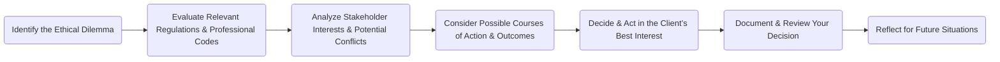

## 2.1 Ethics in the Financial Services Industry

Ethics in financial services involves adhering to moral principles and professional standards that guide decision-making and behavior. In an industry entrusted with clients’ assets and sensitive personal information, ethical conduct is paramount to maintaining public trust and ensuring that the financial system functions with integrity. For Canadian financial services professionals, adhering to established regulations, codes of conduct, and professional guidelines is not only a matter of compliance—it's the bedrock for sustaining meaningful client relationships, professional reputation, and long-term success.

This section explores the importance of ethics in the Canadian financial services industry, the applicable regulatory environment, and practical guidelines for maintaining ethical standards in all client dealings. We'll delve into key issues like managing conflicts of interest, navigating compensation models, protecting confidentiality, and addressing the ethical considerations that arise from evolving technologies such as robo-advisory services. Through examples, case studies, and best practices, you’ll gain insights into how ethical decision-making serves as a pillar of responsible and effective wealth management.

---

### Understanding the Foundations of Ethical Conduct

Ethical conduct is built upon several core elements:

• **Moral Principles:** These are fundamental beliefs about right and wrong, fairness, and responsibility. In financial services, moral principles manifest through integrity, honesty, and respect for client interests.  
• **Professional Standards:** Professional bodies, such as FP Canada or CIRO (Canadian Investment Regulatory Organization), set forth rules governing competence, confidentiality, and client satisfaction. These standards provide a roadmap for advisors to uphold their professional obligations.  
• **Public Trust:** Trust is a valuable asset in financial services. Advisors who consistently demonstrate ethical behavior foster confidence among clients and in the broader community.

It’s important to recognize that ethical obligations in finance aren’t limited to legal compliance; they also extend to meeting professional guidelines and upholding unwritten societal expectations.

---

### The Role of Public Trust in Financial Services

Clients entrust wealth managers and advisors with significant responsibilities: managing retirement savings, planning for their children’s education, and recommending insurance solutions to protect their families. This fiduciary relationship underscores the need to act in the client’s best interest at all times. A single breach of ethics—whether through misrepresentation of products, conflict of interest mismanagement, or negligence—can erode a client’s trust permanently.

Moreover, ethical lapses don’t just harm individual investors; they undermine confidence in the broader financial system. Events such as financial scandals, data security breaches, or major conflicts of interest can ripple through markets and shake public trust in financial institutions nationwide.

---

### Ethical Obligations and the Canadian Regulatory Context

In Canada, the ethical framework for financial services professionals is multi-layered. Major regulatory bodies enforce regulations and guidelines, while professional organizations provide ethics codes and continuing education requirements.

1. **Canadian Investment Regulatory Organization (CIRO)**  
   • Oversees investment dealers and mutual fund dealers.  
   • Upholds stringent rules for market integrity, disclosure, and client communications.  
   • Mandates oversight of advisor conduct, including guidelines for conflicts of interest, product suitability, and accurate advertising.  
   • Reference: [https://www.ciro.ca](https://www.ciro.ca)

2. **FP Canada**  
   • Offers the CFP® designation, one of the most recognized credentials for financial planning.  
   • Enforces a “Standards of Professional Responsibility,” including a code of ethics and rules of conduct.  
   • Reference: [https://www.fpcanada.ca](https://www.fpcanada.ca)

3. **Provincial Securities Commissions**  
   • Enforce securities legislation at the provincial level.  
   • Require full, true, and plain disclosure in the sale of securities.  

4. **Professional Designation Bodies**  
   • **CIM® (Chartered Investment Manager)**, **CFA® (Chartered Financial Analyst)**, etc.  
   • Require ongoing professional development and adherence to ethical guidelines specific to portfolio management and investment analysis.

5. **Other Professional Standards**  
   • **CPA Canada Code of Professional Conduct** for tax and accounting principles.  
   • Reference: [https://www.cpacanada.ca](https://www.cpacanada.ca)

Because Canadian wealth management often involves multiple domains—tax, insurance, investments, and estate planning—advisors may be subject to various codes of conduct simultaneously.

---

### Key Ethical Considerations for Financial Advisors

Financial ethics extend into nearly every facet of the advisor-client relationship. Below are some of the most pressing areas where ethical considerations arise:

#### Product Recommendations
Recommending financial products—mutual funds, structured investments, segregated funds—must be done with a client’s best interest at heart. Advisors should:
• Know their product extensively, including its risks and costs.  
• Match product suitability to the client’s objectives, risk tolerance, and time horizon.  
• Offer transparent disclosures regarding fees, commissions, and conflicts of interest.

#### Compensation and Fee Models
Financial advisors in Canada may be compensated through commissions, fees, salary, or a combination of these methods. Ethically, the chosen fee model should not bias the advisor’s recommendations:
• **Commission-based:** Advisors must disclose potential conflicts due to trailer fees or sales commissions.  
• **Fee-only:** Eliminates product commissions but may involve equally rigorous disclosure to ensure fees are transparent.  
• **Fee-based plus Commission:** Requires particular vigilance to avoid “double-dipping” or excessive fee structures.

#### Conflict of Interest Management
A **conflict of interest** occurs when an advisor could benefit personally at the expense of the client’s interest. Common examples include proprietary product promotions and referral fees from third parties. Ethical practice involves:
• Disclosing the conflict openly.  
• Taking steps to operate in the client’s best interest.  
• Obtaining the client’s informed consent for any arrangement that could influence objectivity.

#### Confidentiality
Canadian financial advisors handle vast amounts of personal and financial information about their clients. Safeguarding this data is both a legal and ethical requirement. Advisors must:
• Employ secure data management practices.  
• Adhere to legislative requirements like the Personal Information Protection and Electronic Documents Act (PIPEDA).  
• Train staff on privacy policies and confidentiality obligations.

#### Technology and Robo-Advisors
The rise of technology-based solutions, such as robo-advisors and online wealth management platforms, introduces new ethical questions:
• **Algorithmic Transparency:** Clients deserve clarity on how rebalancing, risk profiling, and asset allocation decisions are determined.  
• **Cybersecurity:** Robust protection of client accounts, financial data, and personal information is critical.  
• **Data Privacy:** Consent for data usage and third-party sharing must be obtained and managed carefully.

---

### Ethical Decision-Making Model

Below is a simplified diagram illustrating how a financial advisor can approach ethical dilemmas in their practice:

1. **Identify the Ethical Dilemma:** Recognize the potential conflict or moral ambiguity.  
2. **Evaluate Relevant Regulations & Professional Codes:** Consult CIRO rules, FP Canada guidelines, and/or your employer’s policies.  
3. **Analyze Stakeholder Interests & Potential Conflicts:** Consider how the decision affects the client, the firm, and other parties.  
4. **Consider Possible Courses of Action & Outcomes:** Brainstorm alternatives and weigh their ethical impact.  
5. **Decide & Act in the Client’s Best Interest:** Once you settle on the most ethical path, implement it.  
6. **Document & Review Your Decision:** Record the process for transparency and compliance.  
7. **Reflect for Future Situations:** Continuous improvement refines future ethical decision-making.

---

### Practical Example: Conflict of Interest

Imagine you are an investment advisor at a major Canadian bank, such as RBC or TD. Your client is interested in a mutual fund that offers a higher commission to the advisor. Alternatively, a lower-cost ETF might be more suitable for the client based on her risk tolerance and time horizon, but it yields virtually no commission. Ethically, you must:

• Disclose your compensation structure for both products.  
• Explain why the ETF might offer lower fees and potentially higher net returns over time.  
• Allow the client to make an informed decision without pressure or bias from your compensation plan.

### Case Study: Data Privacy and Robo-Advisors

A Canadian fintech company specializing in robo-advisory services automatically collects and aggregates large amounts of client data, including personal financial information, transaction history, and risk profile. During a product recommendation process, the platform uses an algorithm that automatically triggers targeted marketing emails for additional services beyond the standard portfolio management.

• **Ethical Question:** Is the company using client data in a manner that the client fully understands and has consented to?  
• **Best Practice:** Provide a clear data consent form and the option to opt out of marketing emails. Ensure transparency in describing how their data informs product recommendations.

---

### Best Practices and Ongoing Challenges

1. **Ongoing Education:** Canadian regulations and professional standards continually evolve. Stay current by attending workshops, webinars, and reading updates from CIRO and FP Canada.  
2. **Transparent Communication:** First, fully explain investment products, fees, and potential conflicts. Then, document client meetings to confirm mutual understanding.  
3. **Client-Centric Focus:** Always prioritize the client’s goals, risk tolerance, and long-term success.  
4. **Cybersecurity Vigilance:** Ethical practice includes safeguarding digital information and ensuring compliance with privacy regulations.  
5. **Elevate Firm Culture:** Encourage a culture of integrity. Senior leadership should demonstrate ethical behavior, making it part of firm-wide learning and mentorship programs.

---

### Additional Resources

• **CIRO’s Rules and Standards:** [https://www.ciro.ca](https://www.ciro.ca)  
• **FP Canada’s Standards of Professional Responsibility:** [https://www.fpcanada.ca](https://www.fpcanada.ca)  
• **CPA Canada Code of Professional Conduct:** [https://www.cpacanada.ca](https://www.cpacanada.ca)  
• **Suggested Reading:** “Ethics in Finance” by John R. Boatright  
• **Open-Source Tools:** Consider leveraging open-source compliance tools to track regulatory updates and ensure consistent policy implementation in your firm.

---

### Summary

Ethics lie at the heart of financial services, shaping the advisor-client dynamic and safeguarding the reputation of the financial industry as a whole. By adhering to moral principles, professional standards, and a robust regulatory framework, Canadian financial professionals help maintain public trust and uphold a fiduciary standard of care. Balancing product suitability, conflicts of interest, confidentiality, and the ethical implications stemming from technological innovations is no simple feat. Yet, with conscious effort, ongoing education, and a commitment to transparency, advisors can navigate ethical challenges skillfully and fortify client relationships for the long term.

---

## Test Your Knowledge: Ethics in the Financial Services Industry



### Which of the following best describes why ethics is critical in financial services?

- [x] It safeguards client interests and upholds public trust in the industry.  
- [ ] It ensures advisors receive the highest possible compensation.  
- [ ] It helps marketing campaigns gain a competitive edge.  
- [ ] It eliminates all conflicts of interest permanently.  

> **Explanation:** Ethics is foundational to protecting clients' interests and maintaining public confidence in financial institutions.  

### Which of the following regulatory bodies enforces ethical and professional standards for investment dealers and mutual fund dealers in Canada?

- [ ] FP Canada  
- [x] CIRO  
- [ ] CPA Canada  
- [ ] Canada Revenue Agency  

> **Explanation:** The Canadian Investment Regulatory Organization (CIRO) enforces rules and standards for investment dealers and mutual fund dealers.  

### An advisor recommending a high-commission product without disclosing compensation to the client is likely failing to uphold which principle?

- [x] Conflict of interest management  
- [ ] Time value of money principles  
- [ ] Tax minimization strategies  
- [ ] Portfolio rebalancing guidelines  

> **Explanation:** The advisor has an obligation to disclose conflicts of interest—such as higher commissions—to ensure the client’s best interest is not compromised.  

### Which of the following is a key step in any ethical decision-making model in financial services?

- [x] Documenting and reviewing your decision for future reference  
- [ ] Shifting responsibility to a legal department  
- [ ] Encouraging the client to handle the decision independently  
- [ ] Hiding all potential conflicts of interest to avoid confusion  

> **Explanation:** Proper documentation is crucial for transparency and to refine future ethical decisions.  

### How does technology introduce new ethical considerations in the financial services industry?

- [x] It raises issues like data privacy, cybersecurity, and algorithmic transparency.  
- [ ] It makes ethics irrelevant because robo-advisors have no human biases.  
- [ ] It ensures all regulatory requirements are automatically met.  
- [ ] It guarantees no conflicts of interest will arise.  

> **Explanation:** Tech-based solutions can present data privacy and algorithm transparency concerns that must be addressed ethically.  

### Why are professional designations like CFP® or CIM® relevant to ethics in financial services?

- [x] They impose specific codes of conduct and ongoing professional education.  
- [ ] They are purely academic and unrelated to ethical considerations.  
- [ ] They automatically grant an exemption from regulatory oversight.  
- [ ] They limit advisors to serving only institutional clients.  

> **Explanation:** Professional bodies enforce ethical standards and continuing education requirements for their certified members.  

### Which of the following actions best illustrates confidentiality practice under Canadian regulations?

- [x] Securing client data and following PIPEDA requirements.  
- [ ] Sharing client data with marketing partners without disclosure.  
- [ ] Retaining no records of client transactions at all.  
- [ ] Informing the client's family members of their investments.  

> **Explanation:** Confidentiality requires safeguarding client data and following applicable privacy laws, including PIPEDA.  

### If an advisor suspects a conflict of interest in recommending a proprietary product, what should they do first?

- [x] Disclose the conflict to the client and explain how it may affect recommendations.  
- [ ] Immediately decline to provide advice altogether.  
- [ ] Transfer the client to a robo-advisor service.  
- [ ] Continue as usual since it benefits the advisor.  

> **Explanation:** Ethical standards demand proper disclosure of any conflict of interest, allowing the client to provide informed consent.  

### In an ethical decision-making flowchart, why is it important to reflect on decisions afterward?

- [x] To improve future ethical decision-making and refine processes  
- [ ] To justify non-compliance with regulations retroactively  
- [ ] To limit overall client communication  
- [ ] To underreport commissions to tax authorities  

> **Explanation:** Reflection ensures continuous improvement and helps strengthen the advisor’s ethical framework over time.  

### Ethical obligations in the financial services industry can be satisfied by complying with:

- [x] Legal requirements, professional codes, and moral principles  
- [ ] Only the legal requirements pertinent to your employer  
- [ ] Whichever regulations offer the least oversight  
- [ ] The highest return investment products exclusively  

> **Explanation:** Advisors must consider laws, professional standards, and core moral principles to genuinely uphold ethical obligations.  



---

## For Additional Practice and Deeper Preparation

**[1. WME Course For Financial Planners (WME-FP): Exam 1](https://www.udemy.com/course/csi-wme-fp-exam1/?referralCode=1A23C67E56971C0A73D5)**  
• Dive into 6 full-length mock exams—1,500 questions in total—expertly matching the scope of WME-FP Exam 1.  
• Experience scenario-driven case questions and in-depth solutions, surpassing standard references.  
• Build confidence with step-by-step explanations designed to sharpen exam-day strategies.

**[2. WME Course For Financial Planners (WME-FP): Exam 2](https://www.udemy.com/course/csi-wme-fp-exam2/?referralCode=25879CCDED7B7905BBA8)**  
• Tackle 1,500 advanced questions spread across 6 rigorous mock exams (250 questions each).  
• Gain real-world insight with practical tips and detailed rationales that clarify tricky concepts.  
• Stay aligned with CIRO guidelines and CSI’s exam structure—this is a resource intentionally more challenging than the real exam to bolster your preparedness.

> Note: While these courses are specifically crafted to align with the WME-FP exam outlines, they are independently developed and not endorsed by CSI or CIRO.

---

By understanding and consistently applying ethical principles, you will reinforce your role as a trusted advisor, advance client relationships, and foster a robust reputation within Canada’s financial services industry.
