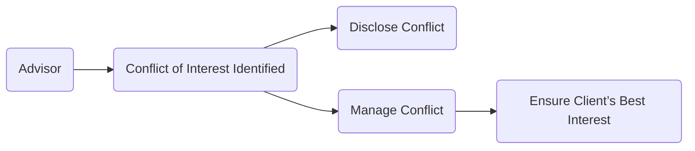

## 2.2 Types of Ethical Dilemmas

Ethics is the cornerstone of any relationship between a financial planner and their client. It governs the conduct, decision-making process, and professional integrity that underpin every client interaction. When advisors fail to uphold strong ethical standards, the implications extend beyond reputational harm—they can erode trust in the entire financial services industry.  

This section delves into five key types of ethical dilemmas frequently encountered in the wealth management profession:

1. Conflict of Interest Dilemmas  
2. Confidentiality Dilemmas  
3. Suitability Concerns  
4. Duty of Care vs. Sales Pressure  
5. Inadvertent Biases

Each of these dilemmas has the potential to compromise client interests, expose advisors to regulatory scrutiny, or jeopardize long-term client relationships. By understanding these dilemmas in-depth, advisors can develop robust strategies to uphold ethical standards within the Canadian context.

---

### Conflict of Interest Dilemmas

A conflict of interest arises when personal or institutional incentives may tempt an advisor to place personal gain above the client’s needs. In many cases, conflicts of interest can be subtle, making them difficult to detect or disclose.

#### Common Sources of Conflict of Interest
• Proprietary Products: Some large Canadian banks (e.g., RBC, TD) might offer incentives to advisors for selling in-house mutual funds or managed portfolios. This incentive can encourage advisors to recommend products that might not be best suited to a client’s unique objectives.  
• Commission Structures: Advisors who earn higher commissions on certain investments may be tempted to promote those products over more suitable options for the client.  
• Referral Arrangements: Partnerships or referral fees from external service providers (e.g., insurance brokers, lawyers, or mortgage experts) may also bias an advisor’s recommendations.  

When conflict of interest dilemmas arise, the best practices include:
1. Clear Disclosure: Advisors must inform clients—preferably in writing—of any potential conflicts.  
2. Management and Mitigation: If conflicts cannot be avoided, they should be minimized and actively monitored. A boundary or firewall may be set up to separate the advisor’s financial interest from the advice given.  
3. Regulatory Compliance: Canadian regulations demand the highest level of transparency regarding fees, commissions, or referral incentives. Review the CIRO rulebook (<https://www.ciro.ca>) for guidance on conflicts of interest disclosures and procedures.

Below is a simple flowchart indicating a high-level approach to managing conflicts of interest:

**Figure 2.1** – Conflict of Interest Management Flow 

---

### Confidentiality Dilemmas

Confidentiality dilemmas occur when an advisor’s responsibility to maintain client privacy conflicts with legal or regulatory obligations. Advisors handle highly sensitive client information such as net worth, sources of income, asset holdings, and personal financial goals. Privacy is paramount, yet Canadian regulations also require vigilant monitoring to detect illegal activities like money laundering or terrorist financing.

#### Case Example: FINTRAC Reporting
Consider an advisor who suspects a client’s transaction might be tied to money laundering. On one hand, the advisor has a duty to keep the client’s information confidential. On the other hand, Canadian law (Proceeds of Crime (Money Laundering) and Terrorist Financing Act) obligates the advisor to report suspicious activity to FINTRAC (Financial Transactions and Reports Analysis Centre of Canada). Failure to do so can lead to heavy penalties.

#### Balancing Acts
• Privacy vs. Obligation: Advisors must know and comply with reporting requirements.  
• Secure Record-Keeping: Ensure client data is stored safely, consistent with federal regulations (e.g., Personal Information Protection and Electronic Documents Act, PIPEDA).  
• Document Everything: If a report is filed, maintain appropriate records, but also safeguard client confidentiality as far as the law permits.

**Best Practice Tips**:  
• Always confirm whether an activity is mandatory to report under Canadian law.  
• Communicate the general obligations and possible exceptions to clients in engagement letters or initial disclosure documents.  
• Seek compliance or legal counsel if in doubt.

---

### Suitability Concerns

Suitability is a central tenet of the financial advisory relationship, requiring advisors to ensure recommendations align with the client’s financial situation, objectives, and risk tolerance. A suitable recommendation must be based on:
• The client’s current net worth and cash flow  
• Investment horizon and liquidity needs  
• Risk tolerance, both subjective (risk appetite) and objective (capacity to absorb losses)  
• Tax considerations and other personal circumstances

#### Common Drivers of Suitability Dilemmas
• High Commission Products: An advisor might recommend a product with a lucrative commission despite the product’s mismatch with the client’s investment objectives.  
• Overselling Complex Products: Alternatively, an advisor may steer clients into complicated derivative instruments or structured notes to meet sales targets without adequately explaining the risks.  

**Regulatory Guidance**:  
• CIRO rules: Advisors must “Know Your Client” (KYC) and perform “Know Your Product” (KYP) due diligence to confirm suitability.  
• Canadian Securities Administrators (CSA) guidelines emphasize the “Client Focused Reforms,” which demand heightened standards for suitability and conflicts of interest management (<https://www.securities-administrators.ca/>).

#### A Canadian Pension Example
A leading Canadian pension fund invests in diversified assets (bonds, equities, real estate, and infrastructure) to manage risk effectively. When replicating a suitable pension-like strategy for a private client, an advisor should consider factors like the client’s time horizon and liquidity needs to mirror the stable, long-term approach characteristic of large institutional investors. If an advisor ignores these factors, it could result in an unsuitable strategy for an individual client.

---

### Duty of Care vs. Sales Pressure

Financial institutions and product manufacturers often set ambitious sales targets or expectations. When these targets clash with an advisor’s obligation to prioritize a client’s well-being, ethical dilemmas arise. Duty of care demands that advisors exercise reasonable skill, diligence, and good faith in serving clients.

#### Types of Sales Pressures  
• Quota Requirements: Advisors may be required to open a certain number of new accounts or sell a specified dollar value of a particular annuity, ETF, or segregated fund.  
• Cross-Selling Demands: Advisors may be encouraged to provide multiple products (mortgages, credit products, insurance, and investments) per client.  

**When Duty of Care is Threatened**  
1. Product Pushing: Advisors risk recommending a product that offers short-term gains (for the client or the institution) but does not align with a client’s long-term interests.  
2. Omission of Alternatives: Failure to present a wide range of suitable alternatives can inadvertently steer clients towards less optimal solutions.  

To mitigate these risks, advisors can:
• Maintain Full Transparency: Disclose the range of options considered and why certain ones were eliminated.  
• Document Decision Processes: Keep a record of how the recommended solution aligns with the client’s objectives.  
• Seek a Second Opinion: If unsure, consult a supervisor or compliance department regarding the best course of action.

---

### Inadvertent Biases

Even the most ethical advisors can be affected by implicit or unconscious biases. Behavioral finance, pioneered by Daniel Kahneman and Richard Thaler, reveals ways in which human beings make decisions that deviate from rational economic predictions.

#### Types of Biases
• Confirmation Bias: The tendency to search for and give preference to information that supports existing beliefs about a product or strategy.  
• Anchoring: Relying too heavily on a recent reference point, such as the “last traded price,” when determining a security’s fair value.  
• Recency Bias: Overvaluing recent events while discounting the importance of historical performance.  
• Familiarity Bias: Preferring investments in familiar sectors, geographies, or companies (e.g., always recommending Canadian bank stocks because they have historically done well).

#### Practical Example 
An advisor who is personally comfortable with a certain balanced fund may propose it to multiple clients irrespective of their unique situations. Although there may be no direct financial conflict, this unintentional bias can lead to ill-suited recommendations.

#### Mitigating Inadvertent Biases  
• Self-Assessment: Advisors should ask themselves regularly, “Am I objectively evaluating this client’s best interest, or am I influenced by my personal preferences?”  
• Peer Review: A second advisor or a compliance officer can help spot biases in the decision-making process.  
• Education and Training: Familiarity with behavioral finance concepts can help advisors recognize and counteract biases in their professional practice.  

---

### Integrating Ethical Principles with Regulations

A strong foundation in ethics is incomplete without a thorough understanding of regulatory requirements. In Canada, various bodies—CIRO, provincial securities commissions, and self-regulatory organizations—publish rules related to conflicts of interest, suitability, and professional conduct. The Canadian Securities Administrators (CSA) has also emphasized the importance of seniors- and vulnerable-clients-focused reforms.  

**Key Resources**:  
• **CIRO Rulebook** (<https://www.ciro.ca>): Detailed instructions and guidance for dealing with common ethical violations, including conflict of interest disclosures and record-keeping.  
• **Canadian Securities Administrators** (<https://www.securities-administrators.ca/>): Pan-Canadian coordination of securities regulations, ensuring consistent rules across provinces.  
• **FINTRAC** (<https://www.fintrac-canafe.gc.ca/>): Canada’s financial intelligence unit, enforcing anti-money laundering regulations.  

---

### Balancing Professional Integrity and Practical Realities

An advisor’s role often involves navigating several tensions simultaneously: meeting sales targets, serving the client’s best interests, and maintaining compliance with Canadian regulations. By acknowledging these potential conflicts and proactively implementing controls—such as disclosures, ongoing training, and peer reviews—advisors can safeguard client interests while fulfilling their professional responsibilities.

**Actionable Steps**:
1. **Maintain a Conflicts Register**  
   Keep a living document that records any identified conflicts of interest, the level of disclosure, and actions taken to manage them.  
2. **Adopt a Suitability Checklist**  
   Before finalizing recommendations, ensure you explicitly confirm alignment with the client’s risk profile, time horizon, taxation issues, and overall financial plan.  
3. **Leverage Technology**  
   Use open-source or commercial software (e.g., compliance modules or CRM systems) to manage documentation and automate KYC processes.  
4. **Periodic Ethical Audits**  
   Consider an independent review of ethical practices, especially for larger advisor teams or brokerage branches.  
5. **Stay Educated**  
   Read widely on behavioral finance to spot inadvertent biases and refresh your understanding of Canadian regulations to remain compliant.

---

## Glossary

• **Conflict of Interest (Revisited):** A clash between personal, organizational, and client interests that mandates disclosure, careful management, or elimination to maintain ethical integrity.  
• **Suitability:** A regulatory and legal requirement that ensures all recommendations align with the client’s financial condition, objectives, and risk tolerance.  
• **Duty of Care:** The advisor’s obligation to act with reasonable skill, diligence, and loyalty in serving the client’s best interests.  
• **Inadvertent Biases:** Unintentional preferences or prejudices that may unconsciously influence decision-making, potentially clouding an advisor’s judgment.

---

## Additional Resources and Further Exploration

• **CIRO Rulebook:** <https://www.ciro.ca> — for guidance on ethical compliance, conflict of interest rules, and KYC/KYP obligations.  
• **Canadian Securities Administrators (CSA):** <https://www.securities-administrators.ca/> — for comprehensive coverage of securities regulations and updates on reforms.  
• **Nobel Prize-Winning Behavioral Finance Research:** Work by Daniel Kahneman and Richard Thaler on cognitive biases and prospect theory.  
• **FINTRAC:** <https://www.fintrac-canafe.gc.ca/> — to understand the legal requirements for anti-money laundering and terrorist financing prevention.  
• **Suggested Reading:** “Blind Spots: Why We Fail to Do What’s Right and What to Do about It” by Max Bazerman and Ann Tenbrunsel.  

---

## Summary

Ethical dilemmas are an inevitable part of the wealth management profession, particularly given the pressures related to commissions, sales targets, and organizational incentives. Advisors can mitigate these dilemmas by ensuring transparency, prioritizing the client’s best interests, and adhering to robust compliance practices. Familiarity with Canadian regulatory frameworks is vital, as transparency and proactive identification of conflicts are key to maintaining client trust.  

Moreover, advisors should remain alert to inadvertent biases, recognizing that ethical lapses can sometimes manifest despite the absence of direct financial gain. Through continuous learning, transparent disclosure, and methodical adherence to best practices, financial planners can preserve the integrity of their profession and foster the trust required for long-term success.

---

## Test Your Knowledge: Ethical Dilemmas in Wealth Management Quiz



### Which of the following best describes a conflict of interest dilemma for an advisor?

- [ ] It occurs only when an advisor knowingly breaks the law.
- [x] It arises when an advisor’s personal interests may override the client’s best interests.
- [ ] It happens when a client rejects an advisor’s recommendation.
- [ ] It is limited to situations where commissions are involved.

> **Explanation:** A conflict of interest arises whenever the advisor’s personal or institutional incentives could be prioritized above the client’s needs, even if inadvertently.

### What is the key regulatory requirement that addresses the alignment of investment recommendations with the client’s financial situation, objectives, and risk tolerance?

- [ ] KYP (Know Your Product)
- [x] Suitability
- [ ] KYC (Know Your Client)
- [ ] Inadvertent Biases

> **Explanation:** While KYC and KYP processes are essential, the formal requirement that mandates recommendations suitable to the client’s unique profile is called “suitability.”

### In which situation might an advisor need to breach client confidentiality according to Canadian regulations?

- [x] Suspicion of money laundering activity reported through FINTRAC
- [ ] Client’s request to purchase foreign securities
- [ ] Desire to share performance updates with a spouse
- [ ] When the client has a low risk tolerance

> **Explanation:** Canadian laws require advisors to report suspicious or illegal activity to FINTRAC, even if doing so means disclosing some client information.

### Which of the following best illustrates duty of care vs. sales pressure?

- [x] An advisor feels pressure to meet monthly sales targets that conflict with thorough product due diligence for clients.
- [ ] A client declines a prudent recommendation but the advisor does nothing.
- [ ] A new employee overshadowing an experienced advisor.
- [ ] Adhering strictly to compliance but ignoring the client’s personal situation.

> **Explanation:** Duty of care requires advisors to act in their clients’ best interests, which can conflict with institutional sales quotas, leading to ethical dilemmas.

### Which bias occurs when an advisor is unconsciously favoring products or securities that recently performed well?

- [ ] Anchoring bias
- [x] Recency bias
- [ ] Confirmation bias
- [x] Familiarity bias

> **Explanation:** Recency bias manifests when individuals place disproportionate weight on recent events or performances. Familiarity bias involves sticking to well-known products or companies; both can affect decision-making.  

### How can advisors mitigate inadvertent biases in their recommendations?

- [x] Participate in ongoing training on behavioral finance and conduct peer reviews.
- [ ] Refuse to offer higher-commission products.
- [ ] Recommend only fixed-income products.
- [ ] Rely solely on historical performance data.

> **Explanation:** Through education, peer review, and staying updated on behavioral finance research, advisors can better identify and reduce the effect of biases.

### What is the best approach to handle a direct conflict of interest, such as a fee-sharing agreement that benefits the advisor?

- [x] Full disclosure and, if possible, management or elimination of the conflict
- [ ] Ignoring it as long as the client doesn’t ask
- [x] Only a verbal mention without documentation
- [ ] Delegating the client to a junior advisor

> **Explanation:** The most appropriate course of action is to disclose, manage, or eliminate conflicts of interest to maintain transparency and uphold ethical standards.

### Which statement is most accurate about suitability concerns?

- [x] Suitability requires that each recommendation align with the client’s risk profile and objectives.
- [ ] A recommendation is automatically suitable if it has historically had high returns.
- [ ] Suitability is irrelevant if the product is easy for the client to understand.
- [ ] Using the same balanced fund for all customers is always suitable.

> **Explanation:** Suitability means advice must be tailored to each client’s personal and financial circumstances, not solely based on product past performance or simplicity.

### What is a practical method for dealing with confidentiality dilemmas?

- [x] Familiarize yourself with mandatory reporting laws like FINTRAC requirements and follow them precisely.
- [ ] Refuse to file any reports to avoid harming client relationships.
- [ ] Disclose all client information to third-party marketing partners.
- [ ] Post sensitive data on your company intranet for easy disclosure.

> **Explanation:** Advisors must maintain client confidentiality but also comply with mandatory reporting requirements. Familiarity and compliance with laws ensure ethical standards are maintained.

### In Canadian wealth management, an advisor failing to disclose an existing conflict of interest to a client is ethically defensible.

- [x] False
- [ ] True

> **Explanation:** Any direct or indirect conflict must be disclosed to the client. Fully transparent communication is a cornerstone of ethical conduct in wealth management.



---

## For Additional Practice and Deeper Preparation

**[1. WME Course For Financial Planners (WME-FP): Exam 1](https://www.udemy.com/course/csi-wme-fp-exam1/?referralCode=1A23C67E56971C0A73D5)**  
• Dive into 6 full-length mock exams—1,500 questions in total—expertly matching the scope of WME-FP Exam 1.  
• Experience scenario-driven case questions and in-depth solutions, surpassing standard references.  
• Build confidence with step-by-step explanations designed to sharpen exam-day strategies.

**[2. WME Course For Financial Planners (WME-FP): Exam 2](https://www.udemy.com/course/csi-wme-fp-exam2/?referralCode=25879CCDED7B7905BBA8)**  
• Tackle 1,500 advanced questions spread across 6 rigorous mock exams (250 questions each).  
• Gain real-world insight with practical tips and detailed rationales that clarify tricky concepts.  
• Stay aligned with CIRO guidelines and CSI’s exam structure—this is a resource intentionally more challenging than the real exam to bolster your preparedness.

> Note: While these courses are specifically crafted to align with the WME-FP exam outlines, they are independently developed and not endorsed by CSI or CIRO.
