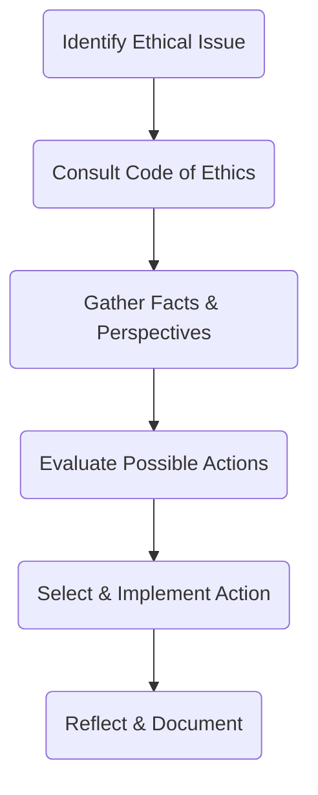

## 2.3 Resolving Ethical Dilemmas

Ethical decision-making is at the heart of any successful advisory practice. Financial planners, particularly in Canada’s regulatory landscape, must balance client objectives, legal requirements, and professional standards. This balance can be challenging in conflicting or ambiguous situations. This section offers a structured approach to resolving these ethical dilemmas, ensuring your decisions remain consistent, transparent, and always in the client’s best interest.

---

### Overview of Ethical Dilemmas in Wealth Management

Ethical dilemmas often arise when there is tension between client interests, professional obligations, and personal values. In a Canadian context, advisors must comply with CIRO (Canadian Investment Regulatory Organization) regulations, abide by FP Canada standards, and meet additional provincial or federal guidelines. Some common dilemmas include:

• Conflicts of interest (e.g., compensation structures that incentivize certain products).  
• Balancing client confidentiality with regulatory reporting requirements.  
• Clarifying the blurred lines between suitability and preference when clients request high-risk investments.  
• Navigating complex family dynamics that affect decision-making (e.g., power of attorney disputes).

A well-defined process is essential to tackle these scenarios. Without it, there is a real risk of harm to the client, reputational damage to the advisor, and potential regulatory or legal ramifications.

---

### Identify the Ethical Issue

The first step in resolving an ethical dilemma is understanding exactly what the dilemma entails.

1. Clarify the Nature of the Dilemma:  
   Ask yourself questions such as:  
   - Is there a direct conflict between the client’s stated interests and my professional duties?  
   - Are there potential or actual conflicts of interest with third parties, such as product providers or referral partners?

2. Determine the Regulatory, Legal, or Professional Standards at Stake:  
   - Is this issue covered by CIRO’s guidelines, FP Canada’s Code of Ethics, or other regulations?  
   - What legal obligations must I uphold (e.g., anti-money laundering regulations, fiduciary duties)?  

3. Identify All Parties Involved:  
   - Client(s)  
   - Employer (brokerage, bank, investment firm)  
   - Product provider (mutual fund company, insurance company)  
   - Other stakeholders (beneficiaries, power of attorney, joint account holders)

#### Practical Example: Conflicting Product Recommendations

Imagine you are an advisor at RBC, and the bank’s proprietary funds offer you higher compensation than third-party funds. The client wants an unbiased recommendation. You suspect the proprietary product might not align perfectly with the client’s risk tolerance or objectives. The dilemma is whether you:  
• Recommend the in-house product and receive higher compensation.  
• Recommend an external product that might better suit the client’s profile but offers lower compensation.

By identifying the ethical issue, you recognize the conflict between personal incentive and the client’s best interest.

---

### Consult the Code of Ethics

Consulting a standardized code of ethics is essential for maintaining professional conduct and objectivity. Codes from CIRO and FP Canada often include principles such as integrity, transparency, confidentiality, and fairness.

• CIRO’s Guidance:  
  Highlights managing conflicts of interest, disclosure, and the duty to place clients’ interests first.  
  [https://www.ciro.ca](https://www.ciro.ca)

• FP Canada Standards of Professional Responsibility:  
  Emphasizes the priority of the client’s interest and provides an ethical decision-making framework.  
  [https://www.fpcanada.ca](https://www.fpcanada.ca)

By reviewing these codes, advisors can confirm the professional obligations that apply to the specific dilemma. This step anchors the decision-making process in universally accepted guidelines rather than personal views alone.

---

### Gather Relevant Facts and Stakeholder Perspectives

Accurate information is critical for making an informed decision.

1. Understand the Client’s Objectives and Circumstances:  
   - Life stage, risk tolerance, time horizon, and unique financial goals.  
   - Special considerations (e.g., the client’s health issues, family conflicts, or language barriers).

2. Clarify the Advisor’s Role and Professional Obligations:  
   - Fiduciary duties: Advisors with fiduciary responsibilities must place client needs above all else.  
   - Regulatory requirements: Suitability, know-your-client (KYC), ongoing disclosure obligations.

3. Consider Third-Party Interests:  
   - Employer expectations: Are there sales targets or conflicting incentives from your firm?  
   - Product provider constraints: Certain investment products may have restrictive redemption schedules or high fees.

#### A Canadian Case Study: TD Wealth Management

Suppose you work for TD Wealth Management, and a long-standing client approaches you to invest a significant portion of their retirement savings into a new venture fund that your employer partially sponsors. The client’s objectives include steady income with moderate growth, but the venture fund is high-risk. Here, you must gather data on the fund’s risk profile, performance history, potential conflicts of interest due to TD’s sponsorship, and the client’s broader retirement framework before deciding how best to advise them.

---

### Evaluate Possible Courses of Action

After clarifying the ethical issue and gathering relevant facts, the next step is to develop potential solutions and analyze the consequences of each action.

1. List Potential Actions:  
   - Disclose the conflict of interest and recommend only suitable products that meet the client’s needs.  
   - Seek a second opinion or consult with a compliance officer.  
   - Decline to proceed with the recommendation if it conflicts with core ethical principles.

2. Conduct a Consequence Analysis:  
   - Assess short- and long-term impacts on the client.  
   - Consider the reputation and legal risks to you and your firm.  
   - Gauge the potential for future conflicts if you choose one path over another.

3. Prioritize Client’s Best Interests:  
   - Evaluate how each possible solution aligns with the client’s objectives and risk profile.  
   - Check for compliance with both internal policies and external regulations.

A useful way to visualize this process is through a simple flowchart:

---

### Implement and Reflect

Once you have decided on the most ethically responsible course of action, it is crucial to:

1. Implement the Decision:  
   - Execute the plan in accordance with your firm’s protocols, legal mandates, and the client’s documented consent.  
   - Ensure all relevant parties (client, compliance, product providers) are informed.

2. Document the Process:  
   - Keep detailed records of each step taken, the rationale behind the decision, and any disclosures made to the client.  
   - This documentation is vital if questions or disputes arise in the future.

3. Reflect and Learn:  
   - Evaluate what went well in the process and where there is room for improvement.  
   - Incorporate insights into future decision-making models.

#### Mini-Exercise: Post-Decision Journal

After resolving an ethical dilemma, spend 10–15 minutes writing a brief summary of the situation, your decision, and the outcome. Note any surprising findings or lessons. This reflective exercise sharpens your ethical judgment for similar issues in the future.

---

### Glossary

• **Ethical Framework:**  
  A decision-making model or set of principles used to evaluate actions, intentions, and outcomes in moral terms.

• **Stakeholder:**  
  Any individual or group with an interest in or affected by a financial decision (e.g., client, advisor, employer, regulators).

• **Consequence Analysis:**  
  The process of weighing the outcomes of multiple actions, typically accounting for potential risks, benefits, and obligations.

• **Documentation:**  
  The critical practice of recording each step taken in diagnosing and resolving an ethical dilemma.

---

### References and Additional Resources

Below are resources to deepen your understanding of ethical dilemmas and the frameworks Canadian financial planners can use:

• [CIRO’s Guidance on Conflicts of Interest](https://www.ciro.ca)  
  Provides recommended steps for identifying, disclosing, and mitigating various conflicts of interest.

• [FP Canada’s Ethical Decision-Making Framework](https://www.fpcanada.ca)  
  Offers a structured and practical set of guidelines for resolving ethical dilemmas unique to financial planning.

• Government of Canada’s Resources on Transparency and Accountability  
  Relevant for advisors working with public funds or providing specialized services in the public sector.

• Suggested Reading:  
  “Ethical Decision Making in Finance and Accounting” by Leonard J. Brooks.  
  Offers case studies and conceptual investigations into financial ethics.

---

## Summary

Ethical dilemmas in wealth management call for structured and principled decision-making. By following the five-step approach—identifying the issue, consulting a code of ethics, gathering facts, evaluating course of action, and implementing with reflection—advisors can ensure they uphold their professional and legal obligations while safeguarding client interests. Continuous documentation and reflection further refine this process, promoting a culture of transparency, accountability, and trust.

---

## Test Your Knowledge: Resolving Ethical Dilemmas Quiz



### What is the first step in resolving an ethical dilemma according to the five-step framework?

- [ ] Implement the solution immediately.  
- [x] Identify the ethical issue at stake.  
- [ ] Consult with the client’s family members.  
- [ ] Document the entire process before taking any action.

> **Explanation:** The framework begins with clarifying the nature of the ethical dilemma, identifying relevant parties, and understanding the conflicting interests.

### Which organization provides guidance on managing conflicts of interest for Canadian Investment professionals?

- [ ] The Canadian Bankers Association (CBA).  
- [ ] The Ontario Securities Commission (OSC).  
- [x] The Canadian Investment Regulatory Organization (CIRO).  
- [ ] The Bank of Canada.

> **Explanation:** CIRO (formerly IIROC + MFDA) offers guidelines to manage conflicts of interest, including recommended steps to disclose and resolve potential issues.

### Which part of the ethical decision-making process involves consulting CIRO’s or FP Canada’s codes of ethics?

- [x] Consult the Code of Ethics.  
- [ ] Gather Relevant Facts.  
- [ ] Implement the Decision.  
- [ ] Reflect on the Outcome.

> **Explanation:** Consulting a professional code of ethics provides standard guidelines and directs the advisor to universally acknowledged principles at the outset.

### In evaluating potential actions during an ethical dilemma, which factor should be given the highest priority?

- [ ] The advisor’s revenue potential.  
- [ ] Product providers’ sales targets.  
- [ ] Institutional reputation.  
- [x] The client’s best interests.

> **Explanation:** Client best interests must remain at the core of any ethical decision in wealth management, as mandated by most regulatory and professional bodies.

### Which of the following best describes the purpose of documenting each step in the ethical decision-making process?

- [x] It provides a record if any questions or disputes arise in the future.  
- [ ] It ensures that everyone in the company receives a raise for ethical compliance.  
- [x] It helps advisors reflect on their decisions for ongoing improvement.  
- [ ] It is purely for marketing purposes to show to prospective clients.

> **Explanation:** Documentation serves both a protective and educational role, ensuring accountability and continuous improvement in advisor practices.

### Why is performing a “consequence analysis” crucial when evaluating possible courses of action?

- [x] It allows advisors to weigh short- and long-term impacts on the client and themselves.  
- [ ] It removes the responsibility of making a final decision from the advisor.  
- [ ] It simplifies the process by evaluating only the advisor’s interests.  
- [ ] It guarantees regulatory approval without further steps.

> **Explanation:** Consequence analysis helps the advisor anticipate potential outcomes and choose a course of action aligned with ethical and fiduciary responsibilities.

### What is the main advantage of documenting your thoughts in a journal after resolving an ethical dilemma?

- [x] It promotes self-reflection and improves decision-making in future scenarios.  
- [ ] It helps clients find new product options.  
- [x] It hides any potential compliance breaches.  
- [ ] It is required by all securities regulators.

> **Explanation:** Journaling about the dilemma, decision, and outcome encourages ongoing ethical awareness and more nuanced decision-making in future cases.

### Which resource would you consult to gain additional structured guidelines for ethical decision-making specific to financial planning in Canada?

- [ ] The Bank of Canada website.  
- [ ] The Consumer Price Index (CPI) releases.  
- [ ] The Canadian Mortgage and Housing Corporation (CMHC) guidelines.  
- [x] FP Canada’s Ethical Decision-Making Framework.

> **Explanation:** FP Canada is a leading standards-setting body for financial planning in Canada, providing a comprehensive ethical decision-making framework for advisors.

### When might you need to seek a second opinion or consult with a compliance officer in an ethical dilemma?

- [x] When the potential conflict of interest or regulatory implications are unclear.  
- [ ] When you want to recommend risky investments for personal benefit.  
- [ ] When you always prefer to avoid disclosing any conflicts of interest.  
- [ ] When you never consult the client about the implications.

> **Explanation:** Consulting a compliance officer is wise when the proper ethical or regulatory approach is uncertain, ensuring professional integrity is maintained.

### In short, applying an ethical framework in any wealth management practice is:

- [x] True  
- [ ] False  

> **Explanation:** Utilizing an ethical framework is considered a fundamental best practice. It helps ensure decisions are transparent, consistent, and aligned with client and regulatory expectations.



---

## For Additional Practice and Deeper Preparation

**[1. WME Course For Financial Planners (WME-FP): Exam 1](https://www.udemy.com/course/csi-wme-fp-exam1/?referralCode=1A23C67E56971C0A73D5)**  
• Dive into 6 full-length mock exams—1,500 questions in total—expertly matching the scope of WME-FP Exam 1.  
• Experience scenario-driven case questions and in-depth solutions, surpassing standard references.  
• Build confidence with step-by-step explanations designed to sharpen exam-day strategies.

**[2. WME Course For Financial Planners (WME-FP): Exam 2](https://www.udemy.com/course/csi-wme-fp-exam2/?referralCode=25879CCDED7B7905BBA8)**  
• Tackle 1,500 advanced questions spread across 6 rigorous mock exams (250 questions each).  
• Gain real-world insight with practical tips and detailed rationales that clarify tricky concepts.  
• Stay aligned with CIRO guidelines and CSI’s exam structure—this is a resource intentionally more challenging than the real exam to bolster your preparedness.

> Note: While these courses are specifically crafted to align with the WME-FP exam outlines, they are independently developed and not endorsed by CSI or CIRO.
