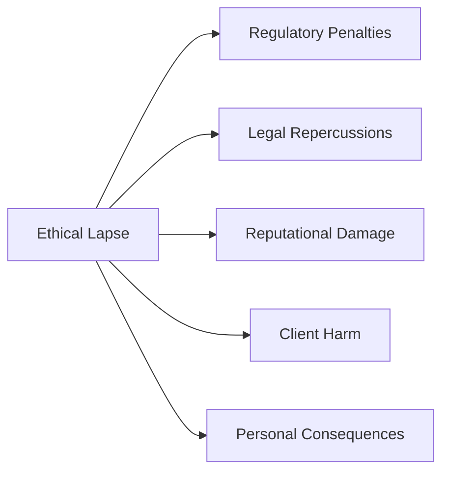

## 2.6 What Can Happen when an Advisor Ignores Ethics

Ethical conduct is the backbone of the financial services industry, particularly within the realm of wealth management. Advisors in Canada are entrusted with significant responsibilities: safeguarding client assets, providing sound recommendations, and acting in clients’ best interests. An ethical lapse can have devastating effects not only on clients but also on the advisor’s career and reputation. In this section, we will delve into what can occur when an advisor chooses to ignore ethics, examine the repercussions from multiple angles, and provide real-world illustrations and best practices.

---

### Introduction to Ethical Accountability

Ethics encompass more than simple compliance; they reflect a commitment to safeguarding client welfare, maintaining honesty, and preserving the trust inherent in the fiduciary relationship. Canadian financial advisors must abide by rules and regulations set by CIRO (Canadian Investment Regulatory Organization), the CSA (Canadian Securities Administrators), and provincial securities commissions. Advisors also face heightened scrutiny under legislation such as anti-money laundering laws enforced by FINTRAC (Financial Transactions and Reports Analysis Centre of Canada).

Below, we outline the immediate and long-term consequences that arise when advisors fall short in their ethical and professional obligations.

---

### Regulatory Penalties

#### Fines and Monetary Sanctions

When advisors commit unethical practices—such as misrepresentation, insider trading, or ignoring “Know Your Client” (KYC) rules—they can be subject to enforcement actions by CIRO or provincial securities commissions. Monetary penalties can be severe, reaching tens or even hundreds of thousands of dollars. These fines serve a critical function:  
• Deter further violations.  
• Encourage corrective measures in the industry.  
• Maintain the integrity of Canada’s financial markets.

For instance, CIRO often publishes Enforcement Proceedings on its website (<https://www.ciro.ca>), where advisors found guilty of misconduct are named. These public disclosures can intensify the reputational damage and serve as a warning for other advisors.

#### Suspensions and Bans

In extreme cases of unethical behavior—such as fraudulent activities or chronic, repeated compliance breaches—advisors risk losing their registration privileges. CIRO or provincial regulators may issue temporary suspensions or impose permanent bans. This effectively prevents the advisor from working in the securities industry in any capacity. The consequences of such prohibitions include:  
• Loss of current and prospective clients.  
• Immediate cessation of all trading activities.  
• Diminished employment prospects in financial services.

---

### Legal Repercussions

#### Litigation and Class-Action Lawsuits

Clients who have suffered financial loss or emotional distress due to unethical advice may choose to pursue legal action. In addition to individual lawsuits, class-action lawsuits can amplify the ramifications significantly. A class action unifies multiple affected investors, leveraging collective power to demand restitution, legal fees, or settlement payouts.

Example:  
• In a hypothetical scenario, an advisor at RBC or TD might recommend an unsuitable high-risk product to multiple retirees, who then experience substantial losses. If it is proven the advisor knowingly violated their obligations, the clients could organize a class-action lawsuit, demanding compensation and punitive damages.

#### Restitution and Settlement Agreements

Often, lawsuits culminate in settlement agreements. Advisors (or their employing firms) may be required to repay clients for financial damages, including interest and legal costs. Such settlements can be costly for both the advisor and the firm, not to mention the associated public relations fallout.

---

### Reputational Damage

#### Loss of Trust

Wealth management hinges on trust. When unethical behavior comes to light—whether reported by media, uncovered through regulatory actions, or discovered by clients—an advisor’s reputation can deteriorate rapidly. Clients may:  
• Sever existing advisory relationships.  
• Warn others through word-of-mouth or social media.  
• Submit complaints to regulatory bodies.

#### Negative Media Exposure

Major Canadian financial institutions typically have dedicated compliance departments and public relations teams to mitigate the spread of negative publicity. However, even large firms cannot fully avoid the stigma of an ethics scandal. Negative headlines reduce a firm’s standing in the market, leading to client attrition, future client hesitancy, and an enduring tarnish on the advisor’s personal brand.

---

### Client Harm

#### Monetary and Emotional Distress

Beyond purely financial losses—such as depleted retirement funds or poorly structured investment portfolios—clients may also experience serious emotional stress, including anxiety or difficulty trusting financial professionals again. When advisors ignore ethics, they violate the foundational principle of acting in a client’s best interest, creating real harm to individuals and families.

#### Breach of Fiduciary Duty

In many client-advisor relationships, a fiduciary duty is implied or formally required. A fiduciary act calls for the highest standard of care, compelling advisors to place client interests above their own. Failing to uphold this duty often constitutes a breach, exposing the advisor not only to legal liability but also to moral accountability.

---

### Personal Consequences

#### Emotional and Psychological Toll

When ethical misconduct becomes public, advisors may face:  
• Personal regret or guilt.  
• Strained relationships with colleagues and family.  
• Stress or depression related to legal, financial, or career uncertainties.

#### Diminished Peer Respect and Career Setbacks

Reputation is currency in the financial services industry. An advisor found guilty of ethical infractions may find themselves ostracized by peers, and professional references for future roles might be impossible to obtain. Even if the advisor wishes to continue in a similar industry capacity, gaining employment can be an uphill battle as potential employers will be wary of hiring an individual with a tarnished record.

---

### Practical Example: Insider Trading Case Study

Consider a hypothetical scenario where an associate at a large Canadian bank learns about a pending merger. If this advisor acts on this inside information for personal gain or tips off clients to profit from trading the stock, they commit insider trading—an egregious breach of both ethics and law. Resulting actions typically include:  
1. Immediate internal investigation, leading to suspension by the bank.  
2. Inquiry by provincial securities commission and CIRO, culminating in charges of insider trading.  
3. Possibility of civil or criminal prosecution, substantial fines, disgorgement of profits, and potential jail time.  
4. Nationwide media coverage naming the advisor and detailing the violation.  
5. Loss of registration and permanent ban from the investment industry.

This example underscores the high stakes of unethical decision-making in finance.

---

### Visualizing the Consequences: A Flowchart

Below is a simple Mermaid diagram to illustrate the chain of events triggered by unethical behavior:

The diagram shows how a single unethical act (A) branches out into multiple negative consequences ranging from fines (B) to lawsuits (C), public scrutiny (D), and emotional or personal stress (F).

---

### Strategies for Maintaining Ethical Conduct

• Ongoing Compliance Training: Regularly update knowledge of CIRO rules, CSA guidelines, and firm-level policies.  
• Transparent Communication: Maintain thorough documentation of all client interactions, disclosures, and investment recommendations.  
• Ethical Culture: Foster an environment where honesty and accountability are valued and endorsed from the top down.  
• Proactive Due Diligence: Evaluate potential ethical risks in new products or practices and encourage colleagues to speak up if concerns arise.  
• Continual Assessment: Periodically review personal and professional standards to ensure alignment with established ethical frameworks.

---

### Best Practices and Common Pitfalls

• Best Practice: “Tone at the Top”—Financial institutions should consistently model ethical behavior to create a culture of integrity.  
• Common Pitfall: Neglecting Conflict of Interest Disclosure—Failing to disclose personal stakes in investment products can lead to significant legal and reputational fallout.  
• Best Practice: Engage in Peer Review—Advisors may enhance ethical accountability by voluntarily conducting peer reviews and adopting standardized ethical guidelines.  
• Common Pitfall: Relying Solely on Compliance Checklists—While important, checklists can become “tick-the-box” exercises if not combined with a genuine commitment to client well-being.

---

### Glossary

• **Regulatory Penalties:** Sanctions levied by regulatory bodies such as CIRO or provincial commissions, which may include fines, suspensions, or revocations of licenses.  
• **Class-Action Lawsuit:** A legal action where multiple plaintiffs with a shared grievance combine their claims into a single lawsuit.  
• **Reputational Damage:** Harm to an individual’s or firm’s public image, potentially leading to client losses and diminished market trust.  
• **Restitution:** Court-ordered compensation paid to clients who have incurred financial harm due to unethical or illegal actions by their advisor.

---

### Additional Resources and References

• **CIRO’s Enforcement Proceedings:** <https://www.ciro.ca>  
  - Showcases real-world cases of advisors disciplined for various infractions, providing insight into common pitfalls.  

• **Regulatory Announcements from the CSA or Provincial Commissions:**  
  - Offers up-to-date investor alerts and details on enforcement actions that highlight the importance of ethical compliance in Canada’s financial markets.  

• **FINTRAC’s AML Updates:** <https://www.fintrac-canafe.gc.ca>  
  - Explains compliance obligations regarding anti-money laundering regulations and the enforcement measures for non-compliance.  

• **Suggested Reading:**  
  - “Financial Ethics: A Positivist Analysis” by Frederick D. S. Choi. This text delves into case studies of ethical failures in finance and illustrates how these episodes can be prevented with robust frameworks.

---

## Quiz: Ethical Violations and Consequences



### Which of the following best describes the immediate effect of ethical misconduct on a financial advisor’s standing?
- [ ] They gain more clients due to lower fees.
- [ ] They receive minor administrative warnings only.
- [x] They may be fined or face suspension by regulators.
- [ ] They are unaffected unless they commit fraud.

> **Explanation:** Ethical misconduct can quickly lead to regulatory penalties, including fines or suspensions by CIRO or provincial commissions.

### When multiple clients come together to sue an advisor for unethical conduct, this is known as:
- [ ] A private settlement.
- [x] A class-action lawsuit.
- [ ] An arbitration hearing.
- [ ] A compliance review.

> **Explanation:** A class-action lawsuit involves a group of individuals collectively bringing a claim to court. This can amplify the consequences for the advisor.

### Which of the following is a negative consequence that primarily impacts clients rather than the advisor directly?
- [ ] Regulatory fines.
- [ ] Permanent industry bans.
- [ ] Media exposure.
- [x] Financial losses and emotional stress.

> **Explanation:** While advisors face legal and regulatory effects, clients can suffer major monetary losses and emotional distress as a result of unethical advice.

### What type of professional duty do many advisors owe their clients, requiring them to place client interests above their own?
- [ ] Minimal Duty of Care
- [ ] Statutory Responsibility
- [x] Fiduciary Duty
- [ ] Passive Consent

> **Explanation:** Fiduciary duty is the highest standard of care in a client-advisor relationship, obligating the advisor to put the client’s best interests first.

### Which of the following strategies is best for proactively preventing ethical lapses?
- [x] Ongoing compliance training and transparent communication.
- [ ] Routinely ignoring minor conflicts of interest.
- [x] Implementing a culture promoting accountability.
- [ ] Encouraging staff to fend for themselves in difficult situations.

> **Explanation:** Regular compliance training, a transparent environment, and leadership commitment to ethical standards help minimize ethical lapses in an organization.

### If an advisor routinely uses insider information for client trades, which penalty is most likely?
- [x] Severe regulatory sanctions, including potential incarceration.
- [ ] A small administrative fee.
- [ ] Promotion within the firm for improving returns.
- [ ] Exemption from all penalties for beneficial client outcomes.

> **Explanation:** Insider trading is illegal and carries significant legal repercussions, including potential jail time, and heavy monetary fines.

### In the event of litigation due to unethical practice, what is the likely outcome for clients who experienced harm?
- [x] They may receive restitution or compensation for damages.
- [ ] They are excluded from the judicial process.
- [x] They may be part of a class-action lawsuit.
- [ ] Their claims are automatically invalid.

> **Explanation:** Victims of unethical advice often seek restitution. When multiple clients are impacted, they can unify under a class-action lawsuit.

### How can reputational damage extend beyond losing existing clients?
- [ ] It temporarily decreases the need for compliance.
- [ ] It helps with rapid reemployment in the industry.
- [ ] It solely affects peer relationships.
- [x] It hinders future client acquisition and diminishes public trust.

> **Explanation:** Reputational damage can drastically reduce a financial professional’s ability to attract new clients and secure future roles in the industry.

### Which organization in Canada handles enforcement for anti-money laundering (AML) regulations?
- [ ] The CSA exclusively.
- [ ] Provincial Securities Commissions.
- [ ] The Bank of Canada.
- [x] FINTRAC (Financial Transactions and Reports Analysis Centre of Canada).

> **Explanation:** FINTRAC enforces AML-related regulations in Canada and can impose penalties for non-compliance.

### True or False: Advisors found guilty of ethical misconduct are commonly subject to emotional and psychological consequences in addition to professional penalties.
- [x] True
- [ ] False

> **Explanation:** Beyond the loss of license or monetary fines, advisors often face stress, guilt, and personal shame when ethical infractions come to light.



---

## For Additional Practice and Deeper Preparation

**[1. WME Course For Financial Planners (WME-FP): Exam 1](https://www.udemy.com/course/csi-wme-fp-exam1/?referralCode=1A23C67E56971C0A73D5)**  
• Dive into 6 full-length mock exams—1,500 questions in total—expertly matching the scope of WME-FP Exam 1.  
• Experience scenario-driven case questions and in-depth solutions, surpassing standard references.  
• Build confidence with step-by-step explanations designed to sharpen exam-day strategies.

**[2. WME Course For Financial Planners (WME-FP): Exam 2](https://www.udemy.com/course/csi-wme-fp-exam2/?referralCode=25879CCDED7B7905BBA8)**  
• Tackle 1,500 advanced questions spread across 6 rigorous mock exams (250 questions each).  
• Gain real-world insight with practical tips and detailed rationales that clarify tricky concepts.  
• Stay aligned with CIRO guidelines and CSI’s exam structure—this is a resource intentionally more challenging than the real exam to bolster your preparedness.

> Note: While these courses are specifically crafted to align with the WME-FP exam outlines, they are independently developed and not endorsed by CSI or CIRO.
