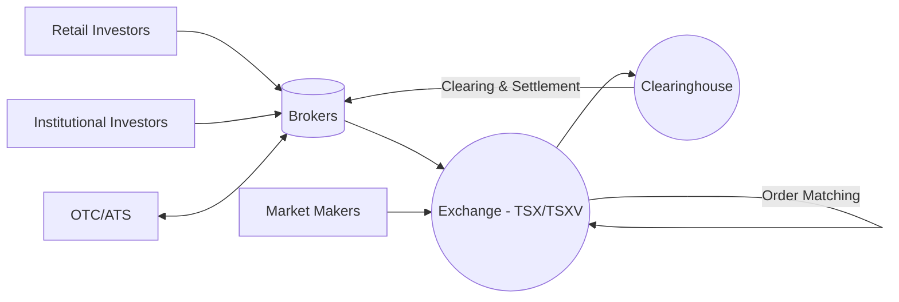

## 20.2 Equity Markets

Equity markets lie at the heart of modern finance, serving as platforms where shares of publicly traded companies are bought and sold. They facilitate capital formation, price discovery, and liquidity for businesses and investors alike. In the Canadian context, the Toronto Stock Exchange (TSX) and the TSX Venture Exchange (TSXV) are pivotal venues for equity trading, while over-the-counter (OTC) and alternative trading systems (ATS) offer additional flexibility and trading opportunities for diverse market participants. 

In this section, we explore the structure and functions of equity markets, focusing on the key players, the roles of regulated exchanges, OTC marketplaces, and technological trends like algorithmic trading. We also highlight the Canadian regulatory framework and best practices relevant to wealth managers and financial planners.

---

## Understanding Equity Markets

Equity markets—often referred to as the stock market—are where corporations’ shares (or stocks) are issued, bought, and sold. Each share represents fractional ownership in a company. By purchasing shares, investors seek returns from price appreciation and potentially dividend income. 

### Key Functions of Equity Markets

1. Capital Formation:  
   Companies can raise capital by listing shares on an exchange. This infusion of funds supports business expansion, research and development, acquisitions, or debt repayment.  

2. Price Discovery:  
   Stock prices are determined by supply (shareholders interested in selling) and demand (investors wanting to buy). Transparent and active trading allows the market to establish fair valuations for each company.  

3. Liquidity:  
   Stock exchanges and OTC marketplaces provide a venue in which investors can readily convert their shares into cash. Liquidity is crucial for attracting investors, as it reduces transaction costs and narrows bid-ask spreads.

4. Risk Management and Portfolio Diversification:  
   Investors use equity markets to diversify their portfolios, mitigating risk by investing in various sectors and industries both in Canada and abroad.  

---

## Major Equity Exchanges in Canada

Canada boasts a robust equity market with two primary stock exchanges:

1. Toronto Stock Exchange (TSX):  
   - The TSX is one of the largest and most well-established stock exchanges in North America.  
   - It hosts senior issuers (i.e., larger, more established companies) that meet stringent listing and ongoing disclosure requirements.  
   - Well-known Canadian and international corporations list on the TSX to access deep capital pools and global investors.

2. TSX Venture Exchange (TSXV):  
   - The TSXV focuses on junior companies—often in earlier growth stages—across sectors like mining, technology, and energy.  
   - Listing requirements are less stringent than on the TSX, catering to emerging businesses with high growth potential.  
   - The TSXV provides a pathway for companies to graduate to the TSX as they mature and meet more rigorous standards.

### Example: Growth from TSXV to TSX  
Many Canadian junior mining companies debut on the TSXV, raising initial exploration capital. As they progress and demonstrate viable production capacity, they may qualify for the TSX, tapping expansive global capital sources.

---

## Global Exchanges and Cross-Border Considerations

While Canadian advisors primarily deal with the TSX and TSXV, investors may also consider global exchanges such as the New York Stock Exchange (NYSE) and NASDAQ in the United States for portfolio diversification and exposure to international markets.  

• NYSE: The world’s largest stock exchange by market capitalization. Home to well-established multinational corporations.  
• NASDAQ: Known for its technology focus, hosting pioneers like Apple, Microsoft, and many emerging fintech companies.

### Canadian Investors Accessing Global Markets
Canadian investors can trade on foreign exchanges through brokerage accounts that grant international access. Wealth managers must consider currency risk, varying regulations, tax implications, and any cross-border restrictions when recommending such investments.  

---

## Regulated Exchanges vs. OTC Markets

### Benefits of Regulated Exchanges

• Transparency:  
  Real-time quotes and transaction data are generally publicly available.  

• Standardization:  
  Rules regarding listing requirements, corporate governance, and timely disclosure ensure a level playing field.  

• Reduced Counterparty Risk:  
  Central clearinghouses and established protocols help ensure settlement and reduce default risks.  

• Better Liquidity:  
  Listed securities typically have more buyers and sellers, translating into narrower bid-ask spreads and easier trade execution.

### Over-the-Counter (OTC) Markets and Alternative Trading Systems (ATS)

Over-the-counter or OTC markets provide trading avenues outside of formal exchanges. OTC trading can be attractive for companies that do not meet the listing requirements of major exchanges or choose to remain unlisted for strategic reasons.

• Less Stringent Listing Requirements:  
  Such markets may have minimal or no listing fees and more relaxed disclosure rules.  

• Potential Risks and Benefits:  
  While investors may find unique or niche investment opportunities, they must also be aware of higher liquidity risk, greater price volatility, and less regulatory oversight.  

• Alternative Trading Systems (ATS):  
  ATSs are electronic platforms that match buy and sell orders, sometimes offering lower transaction fees and reduced market impact for large trades. However, transparency may be less robust, which can widely affect price formation.

---

## The Role of Supply and Demand in Pricing

Securities prices in equity markets are driven by the perennial tug-of-war between supply and demand:

• Supply (Shares for Sale):  
  Investors holding shares who wish to sell at a preferred price.  

• Demand (Buy Orders):  
  Potential buyers evaluating an investment’s future prospects.  

In an active market—where numerous buyers and sellers compete—the bid-ask spread tends to narrow, resulting in more efficient pricing. Conversely, infrequently traded stocks can exhibit wider spreads, increasing transaction costs and price volatility for investors.

---

## Regulatory Landscape in Canada

1. Canadian Securities Administrators (CSA):  
   A coordinating body of provincial and territorial securities regulators. It fosters a harmonized approach to securities regulation across Canada, including oversight of exchanges and investment dealers.  

2. Canadian Investment Regulatory Organization (CIRO):  
   CIRO (formerly IIROC + MFDA) directly supervises investment dealers, trading activity on marketplaces, and enforces rules on market conduct and personal trading. This includes monitoring for insider trading, manipulative practices, and ensuring fair trading.  

3. Disclosure Requirements:  
   Listed companies must publicly disclose all material information. This regulatory framework is designed to protect investors and maintain market integrity.

### References for Further Study
• CIRO’s Regulatory Notices (https://www.ciro.ca/)  
• The TSX Website (https://www.tsx.com/) for listing and trading requirements  

---

## Technology and Modern Equity Markets

### High-Frequency Trading (HFT)

High-frequency trading uses sophisticated algorithms to process market data and execute trades within fractions of a second. Key considerations include:

• Speed and Latency:  
  Co-located servers in exchange data centres minimize delays.  

• Advantages and Criticisms:  
  HFT can narrow spreads and boost liquidity, but critics argue it may exacerbate market volatility and disadvantage slower participants.

### Algorithmic Trading

Broader in scope than HFT, algorithmic trading involves automated strategies for order execution and portfolio rebalancing. Institutional investors commonly use algorithms to reduce market impact (e.g., VWAP or TWAP strategies) and optimize large block trades.

---

## Market Participants and Their Roles

1. Retail Investors:  
   • Individuals buying or selling stocks through brokerage accounts.  
   • Typically smaller transactions but collectively form a significant part of market liquidity.

2. Institutional Investors:  
   • Pension funds, hedge funds, mutual fund companies, and insurance firms.  
   • Often trade in large volumes, significantly influencing stock prices and market liquidity.

3. Market Makers:  
   • Firms or individuals that quote both a buy (bid) and sell (ask) price for specific stocks.  
   • By consistently providing liquidity, market makers help stabilize prices and ensure continuous two-sided quotes.  

### Example: Canadian Market Maker Activities  
Major banks (e.g., RBC, TD) can serve as market makers, especially for smaller-cap firms or ETFs. They profit from the bid-ask spread but must adhere to regulatory requirements to maintain fair, orderly markets.

---

## Best Practices for Wealth Managers

1. Understand Liquidity Risks:  
   Recommending illiquid stocks can compromise a client’s ability to exit positions quickly. Wealth managers should factor in trading volume and average bid-ask spreads.  

2. Keep Abreast of Regulations:  
   Since aims of the CSA and CIRO evolve, it is essential to keep track of regulatory updates, especially regarding insider trading, short selling, or algorithmic activity.  

3. Conduct Thorough Due Diligence:  
   For stocks listed on the TSXV or OTC, in-depth analysis is crucial due to higher uncertainty and lower disclosure.  

4. Leverage Technology Wisely:  
   Access robust market data and analytics to guide client recommendations, balancing the benefits of quantitative models with fundamental research.

5. Diversify:  
   Employ a diversified approach across sectors, geographies, and asset classes to mitigate risk and align with clients’ long-term objectives.

---

## Visualizing the Equity Market Structure

Below is a Mermaid diagram illustrating the interconnectedness of various equity market participants and venues.

• Brokers channel orders from both retail and institutional clients to exchanges or OTC/ATS venues.  
• Exchanges match orders under standardized rules and rely on a clearinghouse for post-trade settlement.  
• Market makers assist in providing liquidity, especially for illiquid securities.  

---

## Practical Case Study

Imagine a Canadian wealth manager, Priya, who advises a client wishing to invest in a high-growth junior mining company. The company’s shares trade on the TSXV with limited daily trading volume:

• Priya analyzes the company’s fundamentals, ensuring compliance with TSXV listing rules and disclosure standards.  
• She considers liquidity risk by reviewing the average daily volume and bid-ask spreads.  
• Through her brokerage’s ATS, she executes a limit order to avoid undue market impact.  
• Ongoing monitoring and diversification remain priorities, as junior stocks may exhibit higher volatility.

---

## Resources and Further Exploration

• CIRO Regulatory Notices (https://www.ciro.ca/):  Stay updated with the latest regulatory guidelines and rulings.  
• TSX Website (https://www.tsx.com/):  Access real-time market data, listing rules, and educational resources.  
• World Federation of Exchanges (https://www.world-exchanges.org/):  Explore global exchange initiatives, research, and statistics.  
• SSRN (https://www.ssrn.com/):  Access open-access academic papers on market microstructure, trading algorithms, and liquidity.  
• “Market Microstructure Theory” by Maureen O’Hara:  A comprehensive resource on how trading mechanisms influence pricing, volatility, and market quality.

---

## Conclusion

Canadian equity markets remain vital for capital formation and wealth generation, anchored by prominent exchanges like the TSX and TSXV. Over-the-counter and alternative trading systems expand the trading ecosystem, offering flexibility alongside unique risks. A solid grasp of regulatory requirements, technological advancements, and best practices ensures wealth managers can effectively guide clients in navigating these markets.  

By staying current on market structure, leveraging technology judiciously, and prioritizing transparency in client relationships, financial planners can foster robust, resilient investment strategies. Equity markets will continue evolving, and those who adapt by integrating regulatory standards, liquidity considerations, and emerging trading technologies will be well positioned to protect and grow their clients’ assets.

---

## Test Your Knowledge: Canadian Equity Markets Quiz



### Which of the following best describes the function of equity markets?

- [x] They provide a platform for buying and selling corporate shares, facilitating capital formation and price discovery.  
- [ ] They exclusively deal with government bonds and treasuries.  
- [ ] They are limited to private equity transactions.  
- [ ] They only handle offshore currency exchanges.

> **Explanation:** Equity markets are marketplaces for trading corporate shares, playing a key role in capital raising and determining share prices through supply and demand.

### What is the main difference between the TSX and the TSX Venture Exchange (TSXV)?

- [ ] The TSXV only lists U.S. companies.  
- [ ] The TSX only trades structured products.  
- [x] The TSX lists more established companies, while the TSXV caters to junior or emerging companies.  
- [ ] The TSX and TSXV are identical except for fund fees.

> **Explanation:** The TSX typically hosts larger, mature companies with strict listing requirements, while TSXV focuses on junior firms, often in earlier stages of growth.

### Which market participant regularly quotes both buy and sell prices to maintain liquidity?

- [ ] Institutional Investor  
- [ ] Proxy Advisor  
- [ ] Compliance Officer  
- [x] Market Maker

> **Explanation:** Market makers continuously quote bid and ask prices, helping to ensure a stable and liquid market.

### What does a narrower bid-ask spread indicate?

- [ ] Lower trading volume  
- [x] Higher liquidity and efficient price discovery  
- [ ] Greater market volatility  
- [ ] Lower transparency of trades

> **Explanation:** Narrower spreads typically reflect increased liquidity, meaning more robust supply and demand for that security.

### Which of the following is a characteristic of over-the-counter (OTC) markets?

- [x] They can allow companies that do not meet exchange listing standards to trade.  
- [ ] They require a central clearinghouse like the TSX for all transactions.  
- [x] They often have less transparency and higher liquidity risk.  
- [ ] They provide guaranteed minimum returns to participants.

> **Explanation:** OTC markets do not require formal listing standards like exchanges. While they can offer unique opportunities, they can also carry higher volatility and less regulatory oversight.

### Which regulatory entity helps harmonize securities regulation across Canadian provinces and territories?

- [ ] FDIC  
- [x] Canadian Securities Administrators (CSA)  
- [ ] Federal Reserve  
- [ ] OSFI

> **Explanation:** The CSA is a coordinating body that unifies the securities regulators of various provinces and territories in Canada.

### What is the main advantage claimed by proponents of high-frequency trading (HFT)?

- [x] Narrowing spreads and adding liquidity  
- [ ] Guaranteed higher returns for retail investors  
- [x] Eliminating all forms of market manipulation  
- [ ] Slowing down market pricing to reduce volatility

> **Explanation:** Although often debated, HFT can narrow bid-ask spreads and add liquidity, but it does not eliminate manipulation nor guarantee returns.

### What is the potential benefit of using algorithmic trading strategies (such as VWAP or TWAP) for institutional orders?

- [ ] They guarantee above-market execution prices.  
- [x] They aim to reduce market impact by breaking down large orders over time.  
- [ ] They ensure that smaller retail investors always benefit at the expense of institutions.  
- [ ] They eliminate the need for any fund managers or traders.

> **Explanation:** Algorithms like VWAP or TWAP systematically execute large orders using a time-weighted or volume-weighted approach, aiming to minimize the effect on market prices.

### Which statement about retail and institutional investors is correct?

- [ ] Retail investors typically transact in large block trades.  
- [x] Institutional investors often have more resources and can influence the market with large trades.  
- [ ] Retail investors dominate the TSX in terms of trading volume.  
- [ ] Both types of investors are barred from trading OTC.

> **Explanation:** Institutional investors, such as pension and mutual funds, trade in large volumes, potentially impacting liquidity and price movements more significantly than individual retail investors.

### True or False: When investing in junior companies listed on the TSXV, wealth managers should not worry about liquidity risk.

- [x] True  
- [ ] False

> **Explanation:** This is a trick question. It is actually false that they “should not worry.” In reality, liquidity risk can be significant for junior companies. Wealth managers must carefully assess daily volume, bid-ask spreads, and the client’s risk tolerance before recommending such stocks.



---

## For Additional Practice and Deeper Preparation

**[1. WME Course For Financial Planners (WME-FP): Exam 1](https://www.udemy.com/course/csi-wme-fp-exam1/?referralCode=1A23C67E56971C0A73D5)**  
• Dive into 6 full-length mock exams—1,500 questions in total—expertly matching the scope of WME-FP Exam 1.  
• Experience scenario-driven case questions and in-depth solutions, surpassing standard references.  
• Build confidence with step-by-step explanations designed to sharpen exam-day strategies.

**[2. WME Course For Financial Planners (WME-FP): Exam 2](https://www.udemy.com/course/csi-wme-fp-exam2/?referralCode=25879CCDED7B7905BBA8)**  
• Tackle 1,500 advanced questions spread across 6 rigorous mock exams (250 questions each).  
• Gain real-world insight with practical tips and detailed rationales that clarify tricky concepts.  
• Stay aligned with CIRO guidelines and CSI’s exam structure—this is a resource intentionally more challenging than the real exam to bolster your preparedness.

> Note: While these courses are specifically crafted to align with the WME-FP exam outlines, they are independently developed and not endorsed by CSI or CIRO.
