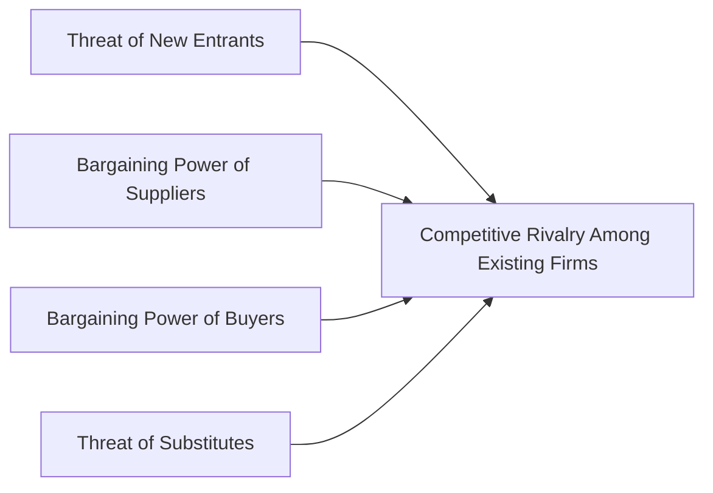

## 20.4 Industry Analysis

Industry analysis is a crucial component of equity research. It provides a structured framework for understanding how broader economic, regulatory, and competitive factors impact a firm’s opportunities and risks. For financial planners, recognizing these influences can help them better advise clients on portfolio diversification and security selection. This section explores key frameworks and tools for industry analysis within a Canadian context, underscoring best practices and common challenges.

---

### Introduction to Industry Analysis

Before diving into a company’s fundamentals, analysts often start by examining the overall landscape in which the company operates. Industry analysis helps answer questions such as:  
• How large is the industry, and how quickly is it growing?  
• What is the intensity of competition within that industry?  
• Which macroeconomic factors shape the performance of that sector?  

By understanding these dimensions, financial planners can better estimate the growth potential and risk profile of investments. This insight is especially relevant when constructing portfolios for clients seeking to manage risks and capitalize on industry-level opportunities.

---

### Industry Classification Systems

Two major classification systems commonly used are:

1. **Global Industry Classification Standard (GICS)**  
   • Developed by MSCI and S&P Global.  
   • Places companies into sectors, industry groups, industries, and sub-industries.  
   • Widely used by international investors, including many Canadian fund managers.

2. **North American Industry Classification System (NAICS)**  
   • Used by statistical agencies in Canada, the U.S., and Mexico.  
   • Facilitates consistent data collection and analysis across North American markets.  
   • Enables analysts to track industry-specific trends using standardized categories.

Financial planners in Canada may rely on GICS for global portfolio comparisons while also leveraging NAICS data from **Statistics Canada** to gain more granular Canadian-focused insights.

---

### Macroeconomic and Industry-Level Factors

Industry performance is frequently influenced by a broad range of macroeconomic variables. Examples include:

• **Consumer Demand:** Shifts in consumer confidence can alter demand patterns (e.g., retail sector booms during strong consumer sentiment).  
• **Commodity Prices:** Industries heavily reliant on raw materials (e.g., energy or mining) are susceptible to commodity price fluctuations.  
• **Interest Rates:** Rising or falling rates affect borrowing costs, potentially impacting the financial health of companies in capital-intensive sectors.  
• **Inflation and Currency Exchange Rates:** Exchange rate fluctuations can bolster or weaken a Canadian company’s competitive position in global markets.

Resources such as the **Bank of Canada** (https://www.bankofcanada.ca/) provide regular updates on interest rates, inflation, and currency trends, while **Statistics Canada** (https://www.statcan.gc.ca/) offers industry-specific economic data and analytical reports. Canadian financial institutions (e.g., **RBC Economics** and **BMO Economics**) publish sector outlooks that can guide forecasts.

---

### Porter’s Five Forces

To gauge the competitive landscape, analysts often apply **Porter’s Five Forces** framework:

1. **Threat of New Entrants:** Barriers to entry—such as regulatory requirements, high capital costs, or brand loyalty—affect new competitors’ ability to enter.  
2. **Bargaining Power of Suppliers:** If suppliers are few or offer differentiated inputs, they can dictate terms and pricing.  
3. **Bargaining Power of Customers:** When customers are few or purchase in large volumes, they have the power to negotiate lower prices.  
4. **Threat of Substitutes:** Availability of substitute products or services can limit an industry’s potential by imposing a price ceiling.  
5. **Competitive Rivalry:** Factors such as market fragmentation, product differentiation, and growth potential affect how fiercely firms compete.

This framework illuminates how an industry’s structure can shape the profitability and stability of its participants. For instance, the Canadian telecommunications sector is known for high barriers to entry and a concentrated market, often leading to higher equilibrium prices. In contrast, industries with low barriers to entry, such as certain segments of retail, may see frequent entrants and exits.

---

### Regulatory Environment and Policy Shifts

Because of its relatively smaller market size and significant reliance on natural resources, Canada often exhibits industry-specific regulatory dynamics:

• **Energy Sector:** Subject to environmental regulations and government policies that can promote or restrict development.  
• **Financial Services:** Heavily guided by regulations from agencies such as the **Canadian Investment Regulatory Organization (CIRO)** and the **Office of the Superintendent of Financial Institutions (OSFI)**.  
• **Trade Policies:** Changes in tariffs and global trade agreements can directly reshape export-oriented industries like automotive or agri-food.  

Regulatory frameworks can quickly alter industry attractiveness and growth potential. Planners should pay attention to legislative updates, statements from government officials, and changes in licensing rules or environmental standards. Keeping current with the **CIRO** website’s guidance on risk assessments is an excellent practice for ensuring compliance and adapting to policy changes.

---

### Industry Life Cycle

Every industry moves through distinct life cycle stages:

1. **Emerging:** Characterized by small market size, rapid innovation, and low profits as companies invest heavily in product development.  
2. **Growth:** Demand accelerates, profits rise, and competition increases as more companies enter.  
3. **Maturity:** Growth stabilizes, competition intensifies, and profits may plateau. Firms focus on efficiency and cost management.  
4. **Decline:** Demand falls, revenues shrink, or the product becomes obsolete. Firms may exit or pivot into new areas.

Financial planners should identify the stage of the life cycle before recommending investments. For example, an emerging technology sector may offer high returns but also carry higher volatility and risk. Meanwhile, a mature industry (like Canadian banking) could provide stable dividends and relatively lower volatility, appealing to income-focused investors.

---

### Specialization and Competitive Advantage

Within each industry, some companies may stand out due to specialization, which can be a strong competitive advantage. Examples include:

• **Niche Product Offerings:** Unique value propositions that meet specific consumer or industrial needs.  
• **Distinctive Technology:** Patented processes or proprietary technology that create barriers to imitation.  
• **Brand Reputation:** Trust and loyalty built over time, especially relevant in consumer-facing industries like retail banking.

For instance, a Canadian fintech firm specializing in blockchain might operate in the broader financial technology space but set itself apart through patent-protected security protocols. Its specialized approach could lead to significant market share gains if the technology sees widespread adoption.

---

### Diversification and Risk Mitigation

Portfolio diversification is a fundamental principle in wealth management. Industry analysis supports diversification by identifying how industries correlate with the broader economy:

• **Cyclical vs. Defensive:** Cyclical industries (e.g., consumer discretionary, materials) move in tandem with economic cycles, while defensive industries (e.g., utilities, consumer staples) may offer more stable returns during downturns.  
• **Correlation Factors:** Investments in industries with different market drivers can reduce overall portfolio volatility.  
• **Global Diversification:** Canadian portfolios often benefit from exposure to international markets, but it remains critical to understand how global industries align—or do not align—with domestic economic conditions.

For instance, a mining-focused client might benefit from partial allocation to Canadian financial services and telecommunication stocks, as those sectors exhibit different sensitivities to commodity prices. In practice, financial planners will often use metrics like beta coefficients or correlation matrices to ensure exposures are properly balanced.

---

### Practical Steps for Financial Planners

Below is a suggested step-by-step approach for incorporating industry analysis into client portfolios:

1. **Identify Client Objectives:** Determine risk tolerance, income requirements, and growth objectives.  
2. **Consult Sector/Classifications:** Use NAICS or GICS to segment possible industries for investment.  
3. **Analyze Key Macro Variables:** Factor in Bank of Canada interest rate announcements and inflation trends.  
4. **Apply Porter’s Five Forces:** Beyond summary metrics, dig into each force to uncover competitive threats or advantages.  
5. **Assess Regulatory Outlook:** Investigate relevant Canadian regulations (e.g., environmental, trade, or licensing).  
6. **Gauge Life Cycle Stage:** Decide if emerging or mature industries match your client’s desired risk-return profile.  
7. **Specialization and Competitive Moats:** Look for companies with strong competitive underpinnings within an industry.  
8. **Finalize Allocations:** Balance cyclical and defensive exposures according to client goals.  
9. **Monitor Ongoing Changes:** Regularly review news, CIRO regulatory updates, and sector reports from RBC/BMO Economics.

This structured process helps financial planners create well-informed recommendations that align with both macro-level insights and the specific needs of their clients.

---

### Tools and Additional Resources

• **Statistics Canada** (https://www.statcan.gc.ca/): Offers in-depth economic and industry data, critical for spotting trends.  
• **CIRO**: Provides guidance on industry-based risk assessments and regulatory updates.  
• **Bank of Canada** (https://www.bankofcanada.ca/): Publishes interest rate announcements, market analyses, and research on the Canadian economy.  
• **Sector Reports**: Research from RBC, BMO Economics, TD Economics, and CIBC Capital Markets often includes valuable sector and macroeconomic insights.  
• **Academic Journals**: Publications like the Journal of Finance or Harvard Business Review for peer-reviewed research on competitive strategy and industry dynamics.  
• **Open-Source Financial Tools**: Python-based libraries (e.g., pandas, NumPy) and R packages that allow advanced data analysis and predictive modeling. These can integrate with publicly available data, including StatsCan datasets.

Staying informed through these resources and employing disciplined industry analysis techniques enable financial planners to build more robust investment portfolios and mitigate unforeseen risks.

---

### Conclusion

Industry analysis is integral to effective equity research and wealth management. By combining a systematic review of macroeconomic factors, regulatory landscapes, competitive pressures, and life cycle stages, financial planners in Canada can refine their recommendations and anticipate how an industry’s trajectory might impact investment returns. Whether discussing a new tech shop in Waterloo or a century-old bank in Toronto, the principles of industry analysis remain the same: a structured, data-driven approach can help ensure that client portfolios align with market realities.

---

## Test Your Knowledge: Canadian Industry Analysis Quiz



### Which classification system is widely adopted globally and segments companies into sectors, industry groups, industries, and sub-industries?

- [ ] NAICS (North American Industry Classification System)
- [x] GICS (Global Industry Classification Standard)
- [ ] SIC (Standard Industrial Classification)
- [ ] ICB (Industry Classification Benchmark)

> **Explanation:** GICS, developed by MSCI and S&P Global, is commonly used worldwide to classify and segment companies into various sectors and industries.

### What advantage does specialization, such as offering niche products or distinctive technologies, typically provide to a company within its industry?

- [ ] Decreased market share
- [ ] Reduced consumer demand
- [x] Competitive advantage
- [ ] Guaranteed regulatory approval

> **Explanation:** Specialization often leads to a competitive advantage by differentiating a company’s offerings from its rivals, potentially increasing market share and profitability.

### Which Canadian resource is a reliable source of industry-specific economic data and analytical reports?

- [ ] U.S. Bureau of Labor Statistics
- [x] Statistics Canada
- [ ] International Monetary Fund
- [ ] Bloomberg Terminal

> **Explanation:** Statistics Canada provides comprehensive statistical information, including industry data, essential for analyzing Canadian market trends.

### Which macroeconomic factor directly influences the borrowing costs of companies in capital-intensive sectors?

- [ ] Competition
- [x] Interest rates
- [ ] Consumer confidence
- [ ] Brand loyalty

> **Explanation:** Interest rates affect the cost of capital. When they rise, it becomes more expensive for companies to borrow, impacting their overall financial health.

### Which of the following stages in the industry life cycle typically features stabilized growth and heightened competition as companies focus on efficiency and cost management?

- [ ] Emerging
- [x] Maturity
- [ ] Growth
- [ ] Decline

> **Explanation:** During the maturity stage, industries reach a plateau in expansion, experience stable or reduced growth rates, and focus on competitive strategies for sustainability.

### According to Porter’s Five Forces, which force describes the ability of customers to demand lower prices or improved services?

- [x] Bargaining Power of Buyers
- [ ] Bargaining Power of Suppliers
- [ ] Threat of New Entrants
- [ ] Threat of Substitutes

> **Explanation:** The Bargaining Power of Buyers examines how customer concentration or purchasing volume can influence product pricing and service quality demands.

### Which Canadian financial institution frequently publishes economic and sector reports that can be used for industry analysis?

- [x] RBC Economics
- [ ] Federal Reserve Board
- [x] BMO Economics
- [ ] Nasdaq

> **Explanation:** RBC Economics and BMO Economics each publish regular sector and macroeconomic outlooks, providing critical insights for industry analysis in Canada.

### How do environmental regulations commonly affect industries in Canada?

- [ ] They always increase profitability.
- [x] They can swiftly alter an industry’s growth potential by changing operating costs and compliance requirements.
- [ ] They have no impact on Canadian industries.
- [ ] They only affect industries located outside of Canada.

> **Explanation:** Regulations can impose additional costs and constraints on operations, or in some cases, create new opportunities (e.g., green technology), thereby influencing an industry’s profitability and attractiveness.

### Which statement best describes industry correlation in a portfolio?

- [ ] Low-correlation industries always move in the same direction.
- [ ] High-correlation industries move independently of each other.
- [ ] Diversification within the same industry eliminates risk.
- [x] Combining industries with low correlation can reduce overall portfolio volatility.

> **Explanation:** Industries with low correlation do not always move in the same direction, helping spread risk and reduce volatility in a diversified portfolio.

### True or False: Identifying the industry life cycle is optional and does not significantly impact investment decisions.

- [x] True
- [ ] False

> **Explanation:** While not strictly mandatory, understanding the industry life cycle is highly beneficial because it helps investors and planners anticipate the level of growth, risks, and competition a portfolio may face.



---

## For Additional Practice and Deeper Preparation

**[1. WME Course For Financial Planners (WME-FP): Exam 1](https://www.udemy.com/course/csi-wme-fp-exam1/?referralCode=1A23C67E56971C0A73D5)**  
• Dive into 6 full-length mock exams—1,500 questions in total—expertly matching the scope of WME-FP Exam 1.  
• Experience scenario-driven case questions and in-depth solutions, surpassing standard references.  
• Build confidence with step-by-step explanations designed to sharpen exam-day strategies.

**[2. WME Course For Financial Planners (WME-FP): Exam 2](https://www.udemy.com/course/csi-wme-fp-exam2/?referralCode=25879CCDED7B7905BBA8)**  
• Tackle 1,500 advanced questions spread across 6 rigorous mock exams (250 questions each).  
• Gain real-world insight with practical tips and detailed rationales that clarify tricky concepts.  
• Stay aligned with CIRO guidelines and CSI’s exam structure—this is a resource intentionally more challenging than the real exam to bolster your preparedness.

> Note: While these courses are specifically crafted to align with the WME-FP exam outlines, they are independently developed and not endorsed by CSI or CIRO.
