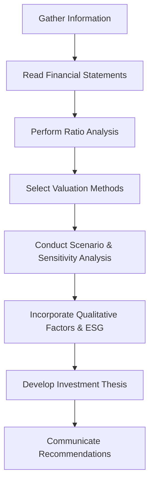

## 20.5 Company Analysis and Equity Valuation

Company analysis and equity valuation are critical components of a wealth advisor’s toolkit. By combining thorough financial statement analysis, ratio trends, and various valuation methods, you can gain deep insights into a firm’s intrinsic value. This section explores how to interpret and analyze company information, assess qualitative factors, and communicate your findings effectively to clients within the Canadian regulatory framework.

--------------------------------------------------------------------------------

### Introduction to Company Analysis

Company analysis entails a systematic review of a corporation’s operations, financials, market position, and management strategy. Canadian financial planners routinely perform or review such analyses to guide clients in selecting equity investments that align with their risk profiles and return objectives.

Key sources include:
• Mandatory corporate filings on [SEDAR+](https://www.sedarplus.ca/) (where Canadian public companies publish their annual reports and audited financial statements).  
• MD&A (Management Discussion & Analysis) reports offering insights into strategic direction, risk management, and performance drivers.  
• IFRS-compliant (International Financial Reporting Standards) statements to ensure standardization across multinational operations.  

When analyzing a business like RBC (Royal Bank of Canada) or TD Bank—two of Canada’s largest financial institutions—you can find consistent IFRS-based data to facilitate peer comparison.

--------------------------------------------------------------------------------

### Reading Financial Statements

Financial statements are the bedrock of company analysis. Four key statements typically guide the assessment:

1. **Income Statement:** Illustrates revenues, expenses, and net income over a fiscal period. Look for trends in revenue growth, operating margins, and net earnings. For instance, during RBC’s quarterly updates, you might track fluctuations in net interest income (NII) or provision for credit losses (PCLs).

2. **Balance Sheet:** Reveals the company’s assets, liabilities, and shareholders’ equity at a specific point in time. Common considerations include liquidity, solvency, and capital structure. For a large bank, analyze loans versus deposits, Tier 1 capital ratios, and intangible assets (e.g., brand goodwill).

3. **Statement of Cash Flows:** Shows how the company generates and uses cash—focusing on cash flow from operations, investing, and financing. An increasing net cash flow from operations for multiple periods could signal healthy fundamentals.

4. **Statement of Changes in Equity:** Details changes within shareholders’ equity (e.g., retained earnings, share issuances, dividend payouts). Steady or growing retained earnings may point to a strong profit history and reinvestment capacity.

By extracting key figures from each statement, you can develop a holistic view of the organization’s financial health and trajectory.

--------------------------------------------------------------------------------

### Ratio Analysis

To evaluate and compare companies more precisely, ratio analysis provides a snapshot of trends and fundamentals. Ratios typically fall into four categories:

1. **Liquidity Ratios**  
   • **Current Ratio = Current Assets / Current Liabilities**  
   Measures the firm’s ability to meet short-term obligations. A ratio of 1.0 or higher is generally healthy, though norms vary by industry.

2. **Solvency Ratios**  
   • **Debt-to-Equity Ratio = Total Debt / Total Equity**  
   Indicates how aggressively the company is financed by debt. Higher ratios suggest greater financial risk. Canadian banks, for example, manage capital ratios differently due to regulatory requirements.

3. **Profitability Ratios**  
   • **Profit Margin = Net Income / Revenue**  
   Reflects efficiency in generating earnings from sales.  
   • **Return on Equity (ROE) = Net Income / Shareholders’ Equity**  
   Gauges how effectively a firm uses investors’ capital. A strong ROE combined with manageable debt is a sign of quality operations.

4. **Efficiency Ratios**  
   • **Asset Turnover = Revenue / Average Total Assets**  
   Shows how effectively the firm uses its assets to create revenue.  
   • **Inventory Turnover = Cost of Goods Sold / Average Inventory** (more relevant to retail or manufacturing, less so to service-oriented financial institutions).

Comparisons over time (trend analysis) and across peers (benchmarking) will highlight positive or concerning developments.

--------------------------------------------------------------------------------

### Equity Valuation Methods

Accurate valuation can help identify attractive investment opportunities. While no single valuation method suits every company, multiple robust techniques can improve overall assessment.

#### Discounted Cash Flow (DCF)
DCF models estimate the firm’s future cash flows and discount them back to present value using a required rate of return. The formula for a simplified DCF is:


\text{Equity Value} = \sum_{t=1}^{n} \frac{FCF_t}{(1 + r)^t} + \frac{\text{Terminal Value}}{(1 + r)^n}


Where:  
• \\( FCF_t \\) = Free Cash Flow in year t  
• \\( r \\) = Discount rate (cost of equity for equity valuation)  
• \\( n \\) = Forecast horizon  

In Canada, professional advisors might factor in the impacts of corporate tax changes, capital expenditure requirements, or the company’s historical cost of equity. Each free cash flow forecast must be anchored in credible assumptions for revenue growth, capex, and working capital requirements.

#### Dividend Discount Model (DDM)
For dividend-paying stocks, especially prominent banks like RBC or TD Bank, the Dividend Discount Model focuses on expected future dividend payments:


\text{Price} = \sum_{t=1}^{\infty} \frac{D_t}{(1 + r)^t}


Where:
• \\( D_t \\) = Dividend in period t  
• \\( r \\) = Required rate of return  

A simplified version, the Gordon Growth Model (GGM), assumes a constant growth rate (g) for dividends:


\text{Price} = \frac{D_1}{r - g}


Where:
• \\( D_1 \\) = Expected dividend one year from now  
• \\( r \\) = Required rate of return  
• \\( g \\) = Dividend growth rate  

Financial statements and management guidance can inform assumptions about the dividend growth rate.

#### Relative Valuation (Comparables)
Relative valuation uses market multiples to compare a target company’s value against industry benchmarks. Common multiples include:
• **Price-to-Earnings (P/E)** = Price per Share / Earnings per Share  
• **Price-to-Book (P/B)** = Market Capitalization / Book Value of Equity  
• **EV/EBITDA** = Enterprise Value (EV) / Earnings Before Interest, Taxes, Depreciation, and Amortization  

For instance, if RBC’s P/E is significantly lower than the average Canadian banking sector P/E—while other fundamentals remain robust—it may reflect an undervaluation (or identify some market-perceived risks you need to check carefully).

--------------------------------------------------------------------------------

### Qualitative Factors

Financial statements only tell part of the story. Qualitative aspects can be critical value drivers:

1. **Management Expertise and Governance**: Evaluate the track record, leadership credibility, and board composition.  
2. **Competitive Position**: Gauge market share, brand loyalty, and barriers to entry. For many Canadian banks, formidable scale and regulatory protections can yield competitive advantages.  
3. **Corporate Strategy**: Consider expansions, acquisitions, or divestitures that align with broader economic trends.  
4. **Brand Reputation**: A well-regarded name can transform intangible assets into long-term benefits.

Building insights from these qualitative elements alongside quantitative metrics leads to more robust valuations.

--------------------------------------------------------------------------------

### Scenario and Sensitivity Analysis

Assumption-driven models like DCF or DDM can be highly sensitive to inputs (discount rates, growth rates, future business cycles). Scenario analysis explores multiple “what if” situations—for example, how a 1% increase in Canadian interest rates could influence mortgage revenues for banks or how changes to corporate tax policies might affect net income.

#### Sensitivity Analysis Example

When conducting a DCF for RBC:

• **Base Case**: 5% revenue growth, 8% discount rate.  
• **Upside Case**: 6% revenue growth, 7% discount rate.  
• **Downside Case**: 4% revenue growth, 9% discount rate.

Comparing these outcomes shows best- and worst-case valuation ranges, improving confidence in your recommendation.

--------------------------------------------------------------------------------

### ESG Considerations

Environmental, Social, and Governance (ESG) factors are becoming essential to company analysis. Firms with robust ESG practices may attract socially conscious investors and reduce reputational or regulatory risks. Examples include:
• Adherence to sustainable lending practices.  
• Transparent governance policies and robust board oversight.  
• Investments in community and social initiatives improving brand loyalty.

Canadian institutions often publish ESG reports, making it simpler for advisors to integrate sustainability into valuation discussions.

--------------------------------------------------------------------------------

### Caution with Pro Forma Numbers

Companies occasionally report “adjusted earnings” to exclude extraordinary or one-time items. While these can clarify recurring performance, advisors must keep an eye on what is being excluded. Repeated use of “one-time” exclusions might signal deeper structural issues. Always compare adjusted and GAAP/IFRS-compliant figures.

--------------------------------------------------------------------------------

### Communicating Results to Clients

When sharing valuation analyses with clients, emphasize both strengths and areas of concern:
• Highlight the rationale for your assumptions.  
• Discuss how different scenarios could impact the outcome.  
• Disclose specific risks—especially relevant during volatile market conditions.

Advisors must adhere to CIRO (Canadian Investment Regulatory Organization) guidelines for due diligence and suitability, ensuring that any equity recommendation aligns with the client’s investment objectives and risk tolerance.

--------------------------------------------------------------------------------

### Best Practices and Common Pitfalls

**Best Practices**  
• **Use Multiple Valuation Methods**: Validate results via DCF, DDM, and comparables.  
• **Cross-Check Ratios and Assumptions**: Integrate forward- and backward-looking metrics for a balanced assessment.  
• **Stay Current on Regulations**: Monitor changes in IFRS, tax policies, and CIRO rules.

**Common Pitfalls**  
• **Overreliance on Historical Data**: Past performance is only a piece of the puzzle.  
• **Ignoring Macro Factors**: Consider interest rates, inflation, and overall market sentiment.  
• **Blind Faith in Model Outputs**: Valuation is part art, part science; never disregard qualitative inputs.

--------------------------------------------------------------------------------

### Visual Overview of the Company Analysis & Equity Valuation Process

Below is a simple Mermaid diagram depicting the key steps in a systematic approach to company analysis and valuation:

--------------------------------------------------------------------------------

### Summary

Company analysis and equity valuation integrate both quantitative and qualitative assessments to gauge intrinsic worth. By examining financial statements, assessing ratios, selecting appropriate valuation methods, and accounting for scenario variability, advisors can form well-reasoned opinions on a stock’s fair value. ESG practices, regulatory oversight, and effective client communication further refine these analyses.

Empowering clients with transparent, data-driven insights can foster trust and help them make informed investment decisions aligned with their goals.

--------------------------------------------------------------------------------

## Comprehensive Company Analysis and Equity Valuation Quiz: Test Your Knowledge



### Which financial statement best indicates a company's operational performance over a period?

- [x] Income Statement
- [ ] Balance Sheet
- [ ] Statement of Changes in Equity
- [ ] Statement of Cash Flows

> **Explanation:** The Income Statement (or Statement of Profit and Loss) reflects revenues, expenses, and net income for a given period, making it most directly indicative of operational performance.

### Which of the following ratios is primarily used to assess a company's short-term financial health?

- [x] Current Ratio
- [ ] P/E Ratio
- [ ] Debt-to-Equity Ratio
- [ ] ROE

> **Explanation:** The Current Ratio measures a company's ability to meet short-term obligations by comparing current assets to current liabilities.

### In DCF valuation, which of the following discount rates is typically used to value equity?

- [x] Cost of Equity
- [ ] Weighted Average Cost of Capital (WACC)
- [ ] Prime Lending Rate
- [ ] Nominal GDP Growth Rate

> **Explanation:** For equity valuation, the discount rate typically reflects the Cost of Equity, accounting for the risk profile of the company’s equity holders.

### When applying the Dividend Discount Model (DDM), the most critical assumptions include:

- [x] Dividend growth rate and required rate of return
- [ ] Debt coverage and credit rating
- [ ] Inventory turnover and product demand
- [ ] Capital expenditure and intangible assets

> **Explanation:** DDM focuses on expected dividend payments, so the dividend growth rate and required rate of return are paramount in pricing a stock using this model.

### In a Relative Valuation approach using comparables, a low P/E ratio relative to industry peers could indicate:

- [x] Potential undervaluation if fundamentals are otherwise strong
- [ ] Guaranteed outperformance in the next quarter
- [x] Signs the market perceives higher risk or lower growth potential
- [ ] A universal buy signal irrespective of other factors

> **Explanation:** A lower P/E might indicate undervaluation, but it can also reflect structural or company-specific risks. Additional investigation is needed before making a definitive judgement.

### Which of the following statements accurately reflects a risk of relying solely on pro forma or “adjusted” earnings?

- [x] Vital expenses or losses may be excluded
- [ ] These figures are always IFRS-compliant
- [ ] They never deviate from GAAP
- [ ] They eliminate the need for ratio analysis

> **Explanation:** Pro forma or adjusted earnings sometimes exclude recurring costs or losses, potentially painting an overly optimistic view if not examined carefully.

### ESG factors are evaluated because:

- [x] They can impact a firm’s reputation and long-term resilience
- [ ] They are immaterial to investors’ decisions
- [x] Socially conscious investors deem them significant
- [ ] They always guarantee higher short-term returns

> **Explanation:** Strong ESG practices can increase brand value and minimize operational or reputational risks, and are increasingly important to a segment of socially conscious investors.

### Scenario analysis is useful because:

- [x] It reveals how changing assumptions alter valuations
- [ ] It guarantees heightened accuracy in final valuations
- [ ] It removes the need for discount rates
- [ ] It hides worst-case outcomes from clients

> **Explanation:** Scenario analysis tests various assumptions (e.g., changes in growth rate or cost of capital) to see how they affect a company’s valuation range, enhancing risk insight.

### A significant rise in a company’s ROE alongside increasing debt-to-equity might indicate:

- [x] Higher returns but also higher leverage risk
- [ ] Long-term stability without any downside
- [ ] Immediate price crash
- [ ] Sustainable growth with zero risk

> **Explanation:** Rising ROE can signal improved performance, but if it coincides with increased debt, the company is taking on more leverage, potentially raising its financial risk.

### For a Canadian bank paying steady dividends, the Dividend Discount Model (DDM) is often:

- [x] True
- [ ] False

> **Explanation:** The DDM is commonly used for stable dividend-paying companies like large Canadian banks. Its assumptions (steady dividends and growth) align well with such business models.



--------------------------------------------------------------------------------

## For Additional Practice and Deeper Preparation

**[1. WME Course For Financial Planners (WME-FP): Exam 1](https://www.udemy.com/course/csi-wme-fp-exam1/?referralCode=1A23C67E56971C0A73D5)**  
• Dive into 6 full-length mock exams—1,500 questions in total—expertly matching the scope of WME-FP Exam 1.  
• Experience scenario-driven case questions and in-depth solutions, surpassing standard references.  
• Build confidence with step-by-step explanations designed to sharpen exam-day strategies.

**[2. WME Course For Financial Planners (WME-FP): Exam 2](https://www.udemy.com/course/csi-wme-fp-exam2/?referralCode=25879CCDED7B7905BBA8)**  
• Tackle 1,500 advanced questions spread across 6 rigorous mock exams (250 questions each).  
• Gain real-world insight with practical tips and detailed rationales that clarify tricky concepts.  
• Stay aligned with CIRO guidelines and CSI’s exam structure—this is a resource intentionally more challenging than the real exam to bolster your preparedness.

> Note: While these courses are specifically crafted to align with the WME-FP exam outlines, they are independently developed and not endorsed by CSI or CIRO.
