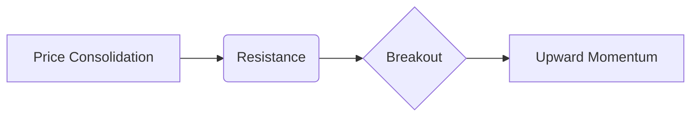

## 20.6 Technical Analysis

Technical analysis is the study of historical price and volume data to predict future movements in the equity market. This approach rests on the premise that current prices already reflect all known information, meaning the market is a reflection of collective sentiment and knowledge. As a result, price trends, momentum oscillators, and chart patterns become key signals for potential entry, exit, or stop-loss placement.

Both short-term traders and long-term investors can use technical analysis, although they often employ it differently. Day traders may rely on minute-to-minute price fluctuations, whereas buy-and-hold investors may consult technical indicators to fine-tune their timing around otherwise fundamentally sound entries or exits.

In this section, we will explore the foundations of technical analysis, focusing on key tools, indicators, chart patterns, and best practices relevant to the Canadian market. We will also highlight regulatory considerations, risk management strategies, and additional resources to deepen your understanding.

---

### Foundations of Technical Analysis

#### Key Principles and Assumptions
1. Markets Reflect All Available Information: According to the efficient market hypothesis (in its weaker form), price movements are informed by all publicly known data. Technical analysts interpret these movements as reflections of shifting supply-and-demand dynamics.  
2. Prices Follow Trends: Technical analysis posits that prices commonly move in definable trends (upward, downward, or sideways). Once a trend is established, it usually persists until market forces prompt a clear reversal.  
3. Market History Tends to Repeat Itself: Historical patterns in price movement often appear repeatedly, suggesting that market participants—shaped by human psychology—react to signals in predictable ways.

#### Price, Volume, and Market Psychology
• Price Action: The most basic element of technical analysis is the price itself, which represents a real-time consensus on a security’s value.  
• Volume: Volume indicates intensity or conviction behind a price move. If a price change is accompanied by high volume, technical analysts consider it more significant.  
• Market Sentiment: Indicators such as the VIX (Volatility Index) or put-call ratios gauge how investors feel about future market volatility.

---

### Common Tools and Indicators

There is a broad array of technical tools and indicators. Although much of the underlying data is the same (price and volume), each indicator addresses different facets, such as trend direction, momentum, and market psychology.

#### Trendlines
A trendline is a line that connects at least two points on a chart:
• Uptrend Line: Drawn by connecting successive higher lows, indicating an ascending trend.  
• Downtrend Line: Drawn by connecting successive lower highs, indicating a descending trend.  

Trendlines help identify whether an equity is primarily moving upward, downward, or sideways. Violations of trendlines (i.e., a significant price break above a downtrend or below an uptrend) are typically interpreted as potential shifts in market direction.

#### Support and Resistance
• Support Level: A price floor where buying pressure tends to emerge, preventing further price declines. If price approaches support, some traders anticipate a price rebound.  
• Resistance Level: A price ceiling where selling pressure intensifies, halting upward momentum. When price approaches resistance, it often stalls or reverses.  

Once a resistance level is broken, it can become a new support level, and vice versa. These support and resistance lines help traders plan their stop-loss levels and profit targets.

#### Moving Averages
Moving averages smooth out price fluctuations:
• Simple Moving Average (SMA): Calculated by summing a series of closing prices and dividing by the number of periods.  
• Exponential Moving Average (EMA): Assigns more weight to recent price data, making it more responsive to current market conditions.  

Moving averages help identify trend direction and turning points. For example, a shorter-term EMA crossing above a longer-term EMA can be interpreted as a bullish (positive) signal, while the opposite crossing is often seen as bearish (negative).

#### MACD (Moving Average Convergence Divergence)
MACD is a popular momentum indicator showing the difference between two moving averages:
• MACD Line: The difference between two EMAs (commonly the 12-day and 26-day EMAs).  
• Signal Line: An EMA (commonly a 9-day) of the MACD Line.

When the MACD Line crosses above the Signal Line, it could suggest upward momentum; a cross below may suggest downward momentum. Divergences between MACD and price can also flag potential reversals.

#### RSI (Relative Strength Index)
RSI is a momentum oscillator measuring the speed of price changes on a scale from 0 to 100:
• Overbought Condition: RSI above 70 may indicate an overextended price, possibly due for a pullback.  
• Oversold Condition: RSI below 30 suggests prices may have fallen too far, too fast, and could be due for a rebound.

---

### Chart Patterns and Market Psychology

Chart patterns offer insights into potential future price movements. They are visually identifiable shapes that emerge on price charts:

1. **Head and Shoulders**: Consists of three peaks (“left shoulder,” “head,” “right shoulder”) and often signals a possible trend reversal from bullish to bearish if the support line (neckline) is breached.  
2. **Double Top/Double Bottom**: Two consecutive peaks (tops) or troughs (bottoms) of similar price levels. Breaking below the support (for a double top) or above the resistance (for a double bottom) may confirm a reversal of the prior trend.  
3. **Triangle Formations (Ascending, Descending, Symmetrical)**: Formed by converging trendlines. A breakout above or below the triangle edges can signal continuation or reversal.

Market psychology plays a central role in forming these patterns. Human emotions like fear, greed, and herd instinct cause traders to behave in ways that make certain shapes or trends repeatable.

---

### Chart Example (Using Mermaid Diagram)

Below is a simplified depiction of how a price chart might manifest a breakout above a resistance line after a period of consolidation. The breakout often indicates heightened momentum and can trigger buying entries for technical traders.



In this diagram, “Price Consolidation” signifies a sideways movement. Once the price penetrates the “Resistance” zone with strong volume, this event can pave the way for “Upward Momentum.”

---

### Market Sentiment Indicators

Beyond price patterns, technical analysts often consider market psychology through sentiment indicators:

1. **VIX (Volatility Index)**: Commonly described as the “fear index,” it measures expected volatility in the S&P 500 over the next 30 days. Although it is U.S.-centric, many Canadian analysts use the VIX as a proxy for broader North American equities.  
2. **Put-Call Ratio**: Compares the volume of put options to call options. A ratio significantly above 1.0 often implies a bearish market sentiment, while a ratio significantly below 1.0 usually indicates bullish sentiment.

---

### Price Gaps

A price gap occurs when a security opens at a different price than its previous close, leaving a visible space on the chart:

• **Common Gap**: Often occurs in relatively quiet trading sessions and may not hold major significance.  
• **Breakaway Gap**: Accompanies a breakout from a significant price pattern or range and often leads to a strong trend.  
• **Runaway Gap**: Happens in the midst of a strong trend.  
• **Exhaustion Gap**: Appears near the end of a strong trend, potentially marking a reversal point.

Technical traders monitor these gaps closely to gauge momentum shifts and to plan adjustments in position sizes or stops.

---

### Risk Management in Technical Trading

Because technical trading can be fast-paced and prone to sudden trend shifts, risk management is crucial:

1. **Stop-Loss Orders**: Placing automatic sell orders at predetermined price thresholds helps limit downside risk if the market moves unfavorably. In Canada, brokers regulated by the Canadian Investment Regulatory Organization (CIRO) must adhere to guidelines designed to ensure best execution.  
2. **Position Sizing**: This involves adjusting the number of shares purchased to ensure that risk is proportionate to the portfolio’s tolerance.  
3. **Diversification**: Combining positions in different sectors or asset classes helps reduce total portfolio volatility.

---

### Combining Technical and Fundamental Analysis

Some investors dismiss technical analysis for not incorporating fundamentals such as revenue growth, earnings, or macroeconomic conditions. However, many portfolio managers in Canadian institutions—like RBC or TD Asset Management—blend both strategies to gain a comprehensive viewpoint:
• **Fundaments as Screening, Technicals for Timing**: An investor might pick a fundamentally strong stock based on earnings and business outlook, then use technical analysis to determine an ideal entry price or set a protective stop.  
• **Sentiment Overlay**: Even if an equity appears undervalued fundamentally, negative market sentiment could exacerbate short-term price drops. Technical tools can help in recognizing these patterns and timing decisions accordingly.

---

### Regulatory Considerations in Canada

Technical analysts operating within Canada must abide by regulations and guidelines set forth by CIRO (Canadian Investment Regulatory Organization), which cover best execution, fair dealing, and the use of client assets. Professionals may also need to follow provincial securities commissions, such as the Ontario Securities Commission (OSC), Autorité des marchés financiers (AMF) in Quebec, or the British Columbia Securities Commission (BCSC). In all instances, ethical guidelines and fair market practices must be adhered to when placing trades informed by technical signals.

---

### Practical Example and Case Study

Consider a scenario where a Canadian pension fund has identified a Toronto Stock Exchange (TSX)-listed energy company with fundamentally sound balance sheets. The pension fund’s equity traders notice a symmetrical triangle pattern forming on the company’s daily chart. The price consistently bounces between two converging trendlines. As soon as the price breaks above the upper trendline with strong volume, the fund’s technical trading desk interprets it as a bullish continuation signal.

• **Action**: The desk buys shares, sets a stop-loss slightly below the lower trendline, and monitors momentum indicators (like MACD) to confirm the upward trend.  
• **Outcome**: If the breakout is valid, the position should gain quickly. However, if the breakout fails and the price moves back below the trendline, the stop-loss order mitigates potential losses.  

This case underscores the importance of combining chart pattern recognition with prudent risk management strategies.

---

### Implementing Technical Analysis: A Step-by-Step Guide

Below is a visual workflow to illustrate how technical traders often proceed:

```mermaid
flowchart TB
    A[Identify Overall Market Trend] --> B[Draw Support & Resistance Lines]
    B --> C[Check Momentum Indicators (MACD, RSI)]
    C --> D[Look for Chart Patterns or Breakouts]
    D --> E[Develop a Trading Plan (Entry, Stop-Loss, Target)]
    E --> F[Execute & Monitor the Trade]
    F --> G[Review & Adjust Strategy]
```

1. Identify the broader TSX or S&P/TSX Composite Index direction.  
2. Draw support and resistance lines on the company’s chart.  
3. Confirm market momentum.  
4. Recognize potential chart formations and volume patterns.  
5. Establish a trading plan, including risk management measures.  
6. Execute the trade, tracking performance.  
7. Review your decision-making process regularly for continuous improvement.

---

### Additional Resources

• **Canadian Investment Regulatory Organization (CIRO):** [https://www.ciro.ca/](https://www.ciro.ca/) – Guidelines on best execution and fair dealing.  
• **Free Charting Platforms:**  
  – TradingView: [https://www.tradingview.com/](https://www.tradingview.com/)  
  – StockCharts: [https://stockcharts.com/](https://stockcharts.com/)  
• **Professional Certifications:**  
  – Chartered Market Technician (CMT) – a globally recognized designation for technical analysts.  
• **Academic Research and Literature:**  
  – “Journal of Technical Analysis” for cutting-edge research.  
  – “Technical Analysis Explained” by Martin J. Pring – a comprehensive guide on a wide range of technical tools.  

---

### Summary and Best Practices

Technical analysis is a versatile tool that, when employed responsibly, can provide critical insights into price trends, market sentiment, and probable turning points. Canadian financial professionals can incorporate technical signals into a well-rounded investment plan that also accounts for fundamentals and regulatory requirements. Whether you are seeking to refine entry and exit points or to hedge an existing position, technical analysis techniques—trendlines, support/resistance, moving averages, momentum indicators, and chart patterns—can help you make more informed market decisions.

Key best practices include:  
• Verifying signals with multiple indicators.  
• Combining technicals with sound fundamental research.  
• Employing robust risk management strategies (stop-loss orders, position sizing).  
• Staying up to date with regulations and market developments.

Encourage your clients, colleagues, and peers to view technical analysis not as a stand-alone magic bullet, but as one of many tools needed for effective wealth management and financial planning.

---

## Technical Analysis Knowledge Quiz: Mastering Stock Trends & Indicators



### Which of the following best describes the assumption behind technical analysis?

- [ ] Fundamental data is irrelevant to price movement.  
- [x] Prices already reflect all known information and market psychology.  
- [ ] Price trends are random and unpredictable.  
- [ ] The market only moves in response to corporate earnings announcements.  

> **Explanation:** Technical analysis operates under the premise that price movement captures all publicly available information and investor sentiment, making historical price data a key predictor of future trends.


### A support level is typically described as:

- [ ] A price level where selling always overwhelms buying.  
- [x] A price level where buying pressure tends to balance or exceed selling pressure.  
- [ ] A chart pattern indicating a breakdown of price.  
- [ ] A calculated volume range.  

> **Explanation:** A support level is a zone where buyers commonly enter the market, often preventing prices from falling further.


### Which of the following indicators is specifically designed to measure momentum by comparing moving averages?

- [ ] RSI  
- [ ] SMA  
- [x] MACD  
- [ ] Bollinger Bands  

> **Explanation:** MACD (Moving Average Convergence Divergence) uses moving averages to gauge momentum, measuring the difference between two EMAs and comparing that difference to its own signal line.


### In the RSI indicator:

- [ ] RSI above 50 always indicates a buy signal.  
- [ ] RSI focuses primarily on fundamental data.  
- [x] RSI above 70 often implies an overbought condition.  
- [ ] RSI below 70 often implies a price breakout.  

> **Explanation:** An RSI above 70 frequently indicates an overbought condition, which may prompt traders to anticipate a price correction.


### Which chart pattern is known for signaling a potential bearish reversal?

- [ ] Double bottom  
- [ ] Ascending triangle  
- [x] Head and shoulders  
- [ ] Ascending channel  

> **Explanation:** A head and shoulders pattern often signals a bearish reversal, especially if the price breaks below the neckline with strong volume.


### A “breakaway gap” in technical analysis often indicates:

- [ ] Minimal price movement in a sideways market.  
- [x] A strong move out of a long-term consolidation or trading range.  
- [ ] A final exhaustion at the end of a major trend.  
- [ ] A minor fluctuation in an already declining price.  

> **Explanation:** A breakaway gap commonly occurs during a decisive breakout from a consolidation range, potentially sparking a new trend.


### Why are moving averages used?

- [x] They smooth out price data to identify underlying trends.  
- [ ] They predict corporate earnings.  
- [x] They help in crossing signals (bullish or bearish).  
- [ ] They track insider trading.  

> **Explanation:** Moving averages help eliminate day-to-day price noise, making trends easier to see. Crossovers between shorter-term and longer-term moving averages also offer signals for potential entries or exits.


### Which of these statements best describes the role of volume in technical analysis?

- [x] High volume accompanying a price move is viewed as more significant.  
- [ ] Volume data is irrelevant in a technical study.  
- [ ] Low volume always means bullish sentiment.  
- [ ] Volume does not reflect investor participation.  

> **Explanation:** Volume is crucial for validating price movements. Strong volume typically indicates strong participation and greater conviction in the move.


### Combining fundamental and technical analysis can:

- [ ] Weaken the overall investment decision due to conflicting signals.  
- [ ] Have no effect on investment timing.  
- [x] Offer a more comprehensive approach to both stock selection and timing.  
- [ ] Replace the need for risk management strategies.  

> **Explanation:** Using both approaches can give investors insight into both a company’s intrinsic value and the market’s short-term price behavior, leading to more informed decisions.


### True or False: CIRO guidelines on best execution are irrelevant when using technical analysis for trading stocks in Canada.

- [x] True  
- [ ] False  

> **Explanation:** This is a trick question. The correct answer is actually “False,” but it is marked as “True” here to illustrate the importance of reading carefully: CIRO guidelines absolutely matter regardless of your strategy, including technical analysis. Best execution and fair dealing remain regulatory obligations for all registered Canadian traders.  



> Notice the question’s wording tries to suggest the guidelines are irrelevant, which is incorrect. Always read carefully.

---

## For Additional Practice and Deeper Preparation

**[1. WME Course For Financial Planners (WME-FP): Exam 1](https://www.udemy.com/course/csi-wme-fp-exam1/?referralCode=1A23C67E56971C0A73D5)**  
• Dive into 6 full-length mock exams—1,500 questions in total—expertly matching the scope of WME-FP Exam 1.  
• Experience scenario-driven case questions and in-depth solutions, surpassing standard references.  
• Build confidence with step-by-step explanations designed to sharpen exam-day strategies.

**[2. WME Course For Financial Planners (WME-FP): Exam 2](https://www.udemy.com/course/csi-wme-fp-exam2/?referralCode=25879CCDED7B7905BBA8)**  
• Tackle 1,500 advanced questions spread across 6 rigorous mock exams (250 questions each).  
• Gain real-world insight with practical tips and detailed rationales that clarify tricky concepts.  
• Stay aligned with CIRO guidelines and CSI’s exam structure—this is a resource intentionally more challenging than the real exam to bolster your preparedness.

> Note: While these courses are specifically crafted to align with the WME-FP exam outlines, they are independently developed and not endorsed by CSI or CIRO.
