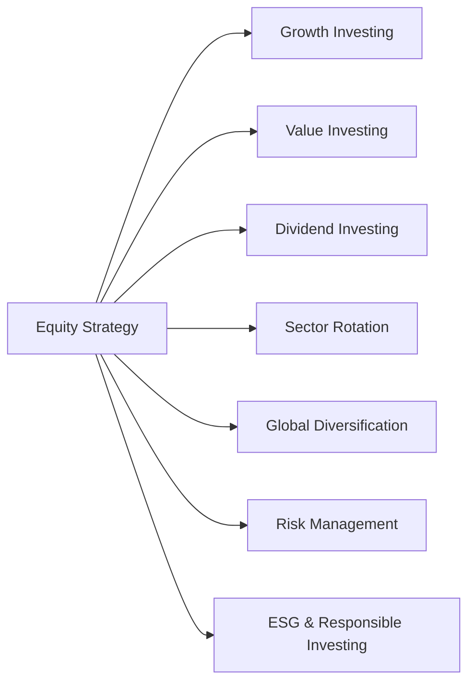

## 20.7 Equity Strategy

Equity strategies serve as the blueprint for how investors and wealth managers select, allocate, and manage equity positions in a portfolio. They influence critical decisions, from balancing high-growth tech stocks against stable dividend payers, to diversifying internationally to mitigate domestic economic risks. This chapter explores several common equity strategies and provides practical guidance for financial planners operating within Canadian regulatory frameworks.

---

### Overview of Equity Strategy

Equity strategy is about aligning investment approaches with the investor’s objectives—be it maximizing capital appreciation, securing a steady income, managing volatility, or adhering to an ethical or responsible investment mandate. Canadian financial advisors operate under the guidance of the Canadian Investment Regulatory Organization (CIRO) and the guidelines set out by the Canadian Securities Administrators’ National Instruments (such as NI 31-103) to fulfill Know Your Client (KYC), suitability, and disclosure requirements when proposing or implementing equity strategies.

Below is a high-level visualization of the major components that can shape an equity strategy:

Each strategy aims to achieve different objectives. A balanced equity approach may incorporate several of these components at once, reflecting an investor’s risk tolerance, time horizon, and return expectations.

---

### Growth Investing

Growth investing targets companies expected to experience above-average revenue or earnings growth. These companies often reinvest their profits into expansion, marketing, and research and development (R&D), instead of paying dividends. As a result, growth stocks—particularly in technology, healthcare innovation, or emerging industries—may trade at comparatively higher valuations.

• Common metrics:  
  – Price-to-Earnings (P/E) ratio adjusted for growth (PEG ratio)  
  – Earnings per share (EPS) growth rates  
  – Revenue growth trends  

• Example:  
  – A Canadian investor seeking to capitalize on technological innovation might invest in software-as-a-service (SaaS) companies listed on the TSX or NASDAQ. RBC, TD, or other Canadian asset managers may offer specialized mutual funds or ETFs focusing on growth stocks in emerging tech sectors.

• Potential benefits:  
  – Significant upside potential if the company’s growth trajectory materializes.  
  – Can outperform broader market indices during economic expansions or bull markets.

• Potential risks:  
  – Higher valuations mean prices can also decline sharply if growth forecasts are not met.  
  – Greater sensitivity to interest rate changes and overall market volatility.

---

### Value Investing

Value investing looks for stocks that appear to be trading below their intrinsic value. Such undervaluation could stem from negative short-term sentiment, temporary market inefficiencies, or cyclical business downturns. The value investor anticipates that, over time, the market will correct this mispricing, leading to capital appreciation.

• Common metrics:  
  – Price-to-Book (P/B) ratio  
  – Price-to-Earnings (P/E) ratio relative to historical and industry averages  
  – Dividend yield (when applicable)  

• Example:  
  – A Canadian bank stock that appears undervalued after a sector-wide pullback might become a target for a value investor. For instance, if TD Bank experiences a sharp price decline due to market speculation on interest rates, a value-focused approach might see this as a buying opportunity before the stock bounces back.

• Potential benefits:  
  – Lower valuations can provide a margin of safety during market downturns.  
  – Historically strong track record when markets revert to mean valuations.

• Potential risks:  
  – Some stocks are undervalued for fundamental reasons, such as deteriorating business models or lack of future demand.  
  – Timing of market “correction” can be uncertain, requiring patience.

---

### Dividend Investing

Dividend investing focuses on finding companies with stable or growing dividend distributions. For income seekers—such as retirees or those approaching retirement—dividend-paying equities can offer a regular income stream and some degree of downside protection.

• Core characteristics of dividend stocks:  
  – Consistent dividend payment history  
  – Lower volatility relative to non-dividend-paying stocks  
  – Often represent mature companies in sectors like banking, utilities, or telecommunications  

• Example:  
  – Toronto-Dominion Bank (TD), Royal Bank of Canada (RBC), and Enbridge Inc. are known for stable dividend payments. Investors seeking reliable cash flow often include these in their portfolios.

• Potential benefits:  
  – Income generation can serve as a hedge during market fluctuations.  
  – Companies with consistent dividends often have strong balance sheets.

• Potential risks:  
  – Dividend cuts can sharply reduce share prices.  
  – Dividend yields can sometimes mask underlying business weakness if dividends are unsustainably high.

---

### Sector Rotation

Sector rotation involves allocating investment capital to sectors poised to outperform during a particular phase of the economic cycle. The Canadian economy, like other developed economies, experiences economic cycles—expansion, peak, contraction, and trough. Different sectors tend to shine during different phases:

• Defensive sectors (e.g., consumer staples, healthcare, utilities) often do well during downturns because they provide essential goods and services.  
• Cyclical sectors (e.g., consumer discretionary, industrials, technology) typically excel during economic expansions when consumer and business spending increases.

#### Phases of Sector Rotation

1. Late Recession or Early Recovery: Basic materials and industrials may start to pick up.  
2. Mid-Economic Expansion: Technology, consumer discretionary, and financials often benefit from higher consumer spending and credit growth.  
3. Late Expansion: Defensive sectors such as utilities and consumer staples may be more resilient if markets grow overheated or enter a plateau.  
4. Recession: Traditional safe havens like gold mining stocks and defensive staples become more appealing.

• Example:  
  – During a downturn, an investor may overweight defensive sectors like utilities or large, stable telecoms. Conversely, in an economic upturn fueled by robust GDP growth, funds might shift towards industrials or technology.

• Potential benefits:  
  – Capitalizing on cyclical trends can enhance returns if timed effectively.  
  – Sector-based exchange-traded funds (ETFs) on the TSX facilitate diversified rotations efficiently.

• Potential risks:  
  – Identifying the economic cycle phase can be challenging.  
  – Over-rotation or late entry/exit can erode returns.

---

### Global Diversification

Depending solely on Canadian equity markets may expose investors to concentrated sector risks (e.g., heavy weighting in financials, materials, and energy). Global diversification can mitigate such risks by holdings in foreign markets that may be on different economic cycles. This can reduce overall portfolio volatility and potentially enhance returns.

• Key considerations:  
  – Currency risks, as fluctuations in the Canadian dollar (CAD) relative to other currencies can affect returns.  
  – Political, regulatory, and market risks vary by region.  

• Example:  
  – A Canadian investor might include U.S. technology stocks or emerging market ETFs in their portfolio to bypass Canadian sector concentration. Pension funds, such as the Canada Pension Plan Investment Board (CPPIB), actively diversify globally to reduce domestic economic dependence.  

• Potential benefits:  
  – Smoother overall returns due to reduced correlation among global markets.  
  – Access to faster-growing or high-potential markets abroad.  

• Potential risks:  
  – Exposure to foreign exchange volatility.  
  – Potential mismatches with the investor’s risk tolerance or expertise in foreign regulatory environments.

---

### Risk Management in Equity Strategies

Regardless of the preferred equity strategy—growth, value, dividend, or otherwise—risk management remains critical. Advisors and investors must balance performance goals with downside protection measures.

1. **Stop-Loss Orders**  
   – Automatically trigger a sale if a stock’s price drops to a predefined level, helping to cap losses.

2. **Options Strategies**  
   – Covered calls can generate income, while protective puts can hedge against price declines.  
   – Advanced strategies like collars can limit both upside and downside.

3. **Position Sizing and Diversification**  
   – Spreading exposures across sectors (e.g., financials, consumer staples, biotech) and market caps (small, mid, large) can mitigate concentration risk.

4. **Ongoing Monitoring**  
   – Continuous review of corporate earnings, macroeconomic indicators, and geopolitical events is essential to adapt to market conditions.

---

### ESG and Responsible Investing

ESG (Environmental, Social, and Governance) investing integrates ethical, sustainability, and social impact considerations into investment decisions. For some investors, ESG is not just about aligning with personal values but also about reducing the risk of investing in companies with poor governance or potential environmental liabilities.

• Data sources:  
  – “Beyond Ratings” and “Sustainalytics” offer ESG data and analysis for companies and indices.  
  – Major Canadian banks and asset managers increasingly incorporate ESG screens in their research.

• Regulatory framework:  
  – CIRO guidelines recommend thorough client profiling to understand if ESG preferences are part of the client’s investment objectives.  
  – Some responsible investment portfolios in Canada comply with programs like the United Nations-supported Principles for Responsible Investment (PRI).

• Potential benefits:  
  – Anticipating regulatory and consumer shifts towards sustainability can provide long-term investment advantages.  
  – Investing in well-governed companies might reduce the risk of detrimental events affecting shareholder value.

• Potential risks:  
  – More limited investment universe if many securities are screened out.  
  – ESG data is not standardized globally, leading to potential inconsistencies or “greenwashing.”

---

### Applying Equity Strategies in the Canadian Context

When implementing these equity strategies in Canada, advisors must adhere to various regulatory and professional guidelines:

1. **CIRO Requirements**  
   – Perform a detailed KYC to determine whether growth, value, dividend, sector rotation, or ESG aligns with a client’s financial goals and risk appetite.  
   – Suitability obligations require that proposed strategies match the client’s return objectives, client knowledge, financial situation, and time horizon.

2. **National Instruments (NI 31-103)**  
   – Sets out general registration requirements, including proficiency standards and ongoing obligations for firms and individuals.  
   – Ensures that advisors properly disclose equity strategy risks, fees, and conflicts of interest.

3. **Tools and Platforms**  
   – Advisors and do-it-yourself investors in Canada can use free financial data sources and research tools (e.g., SEDAR+ for regulatory filings; Yahoo Finance for historical price data; “Beyond Ratings” for sustainability metrics).  
   – Robo-advisors in Canada often incorporate basic equity strategies, simplifying portfolio construction with low-cost ETFs.

4. **Case Study Example**  
   – A high-net-worth (HNW) client at RBC Dominion Securities might have a balanced portfolio with a mix of growth-oriented U.S. equities, dividend-paying Canadian banks, a pipeline of Goderich-based midstream energy companies, and global ESG funds. The advisor would collaborate with RBC’s in-house analysts to customize sector rotations and identify emerging ESG opportunities. By combining sophisticated hedging strategies (options) with a keen eye on currency impacts, the advisor can help manage risk and enhance returns over time.

---

### Best Practices and Pitfalls

• **Best Practices**  
  – Regularly reassess market and economic data to adjust strategies.  
  – Monitor company fundamentals to identify any red flags early.  
  – Remain consistent with long-term objectives; avoid impulsive trades.

• **Common Pitfalls**  
  – Overconcentration in a single sector or country.  
  – Failing to update strategies as economic cycles change.  
  – Neglecting fees, taxes, and transaction costs that can erode returns over time.

---

### Conclusion and Key Takeaways

Crafting an equity strategy requires a thorough understanding of multiple investment approaches—growth, value, dividend, sector rotation, global diversification, and ESG integration. Advisors must apply a risk-aware mindset, employing tools like stop-loss orders, asset allocation models, and optional hedging to protect client portfolios. Aligning with Canadian regulations ensures that the advisor’s recommendations serve the client’s best interests, maintain transparency, and position portfolios for a variety of market conditions.

Key takeaways:

1. A successful equity strategy aligns with the investor’s financial goals, time horizon, and risk tolerance.  
2. Growth and value investing anchor two ends of the spectrum—both can be effective depending on market conditions and client preferences.  
3. Dividend-focused or ESG-oriented frameworks may appeal to clients with specific income or ethical objectives.  
4. Sector rotation and global diversification can help capitalize on macroeconomic cycles and minimize total volatility.  
5. Risk management, through position sizing, hedging, and continuous monitoring, underpins all equity strategies.

For a deeper dive, consult the following resources:  
• “Common Stocks and Uncommon Profits” by Philip A. Fisher (growth investing).  
• “The Little Book of Value Investing” by Christopher H. Browne.  
• CIRO (https://www.ciro.ca/) and Canadian Securities Administrators’ website for additional regulatory guidance.

---

## Mastering Equity Strategies: A Comprehensive Quiz



### Which of the following descriptions best characterizes growth investing?

- [ ] An investment style that minimizes losses through short selling.  
- [x] An investment style targeting companies projected to grow faster than the overall market.  
- [ ] An approach that focuses on underpriced companies with modest future prospects.  
- [ ] A strategy dedicated solely to dividend-paying stocks.  

> **Explanation:** Growth investing zeros in on companies with above-average revenue or earnings growth, often reinvesting profits into expansion and innovation.

### In value investing, which metric is frequently examined to determine whether a stock might be undervalued?

- [ ] Dividend per share  
- [x] Price-to-Book (P/B) ratio  
- [ ] Beta relative to the market  
- [ ] Composite Leading Indicator  

> **Explanation:** Value investors often look at the price-to-book or price-to-earnings (P/E) ratio versus historical averages or industry benchmarks to gauge if a stock is trading below its intrinsic value.

### Which of the following is a common objective of dividend investing?

- [ ] Rapid price appreciation in short-term market swings  
- [x] Generating a steady income stream with lower volatility  
- [ ] Timing market peaks and troughs for maximum gains  
- [ ] Exclusively investing in speculative penny stocks  

> **Explanation:** Dividend investing aims to produce consistent income from stable companies with a track record of reliable dividend payouts, helping investors manage cash flow needs.

### What phase of the economic cycle tends to favour safe-haven or defensive sectors?

- [ ] Early expansion  
- [ ] Growth phase  
- [ ] Peak  
- [x] Recession  

> **Explanation:** During recessions or economic downturns, defensive sectors like utilities, consumer staples, and healthcare typically show resilience, as demand for their products and services remains comparatively steady.

### Which of the following best describes global diversification in an equity portfolio?

- [x] Spreading investments across international markets to potentially reduce domestic concentration risk.  
- [ ] Putting all assets into the largest growth stocks globally.  
- [ ] Rotating sectors within your home market to take advantage of economic cycles.  
- [ ] Eliminating currency exposure through hedging.  

> **Explanation:** Global diversification aims to smooth returns by reducing dependence on the Canadian market’s performance, leveraging economic cycles in different regions.

### To manage the downside risks of equity investing, an advisor may suggest:

- [x] Setting stop-loss orders or using protective puts.  
- [ ] Increasing leverage to double exposure right after prices decline.  
- [ ] Keeping 100% of assets in high-growth technology companies.  
- [ ] Ignoring diversification to focus on a few industry leaders.  

> **Explanation:** Tools such as stop-loss orders, protective puts, and proper position sizing can help minimize losses during market downturns.

### Which example highlights a real-world application of ESG investing?

- [x] Selecting stocks based on environmental, social, and governance metrics, such as those provided by Sustainalytics.  
- [ ] Focusing solely on companies with the highest return on equity without regard for sustainability.  
- [x] Avoiding firms tied to fossil fuels or poor labor conditions.  
- [ ] Investing only in high-growth technology stocks.  

> **Explanation:** ESG investing integrates environmental, social, and governance factors, using metrics from providers like Sustainalytics and “Beyond Ratings” to evaluate a company’s sustainability.

### Why is sector rotation a dynamic strategy?

- [ ] It remains static across market cycles.  
- [ ] It focuses solely on dividends in each sector.  
- [x] It reallocates investments among sectors based on phases of the economic cycle.  
- [ ] It indefinitely locks capital into one sector.  

> **Explanation:** Sector rotation strategically moves capital to sectors best positioned for the current or upcoming phase of the economic cycle, aiming to optimize portfolio performance.

### Under CIRO regulations, which principle is key to recommending an equity strategy?

- [ ] Exclusively maximizing fees for the advisor’s benefit  
- [ ] Relying on guesswork for sector predictions  
- [ ] Overlooking clients’ risk tolerance in favour of returns  
- [x] Suitability—ensuring the allocations match the client’s objectives and risk profile  

> **Explanation:** Suitability is central to Canadian regulatory requirements, meaning the recommended equity strategy must align with the client’s goals and risk capacity.

### Investors who focus on dividend-paying stocks are primarily motivated by capital gains. True or False?

- [ ] True  
- [x] False  

> **Explanation:** Dividend investors often prioritize stable income and lower volatility, although capital gains can still occur. Their main motive is typically generating steady cash flow rather than focusing mainly on price appreciation.



---

## For Additional Practice and Deeper Preparation

**[1. WME Course For Financial Planners (WME-FP): Exam 1](https://www.udemy.com/course/csi-wme-fp-exam1/?referralCode=1A23C67E56971C0A73D5)**  
• Dive into 6 full-length mock exams—1,500 questions in total—expertly matching the scope of WME-FP Exam 1.  
• Experience scenario-driven case questions and in-depth solutions, surpassing standard references.  
• Build confidence with step-by-step explanations designed to sharpen exam-day strategies.

**[2. WME Course For Financial Planners (WME-FP): Exam 2](https://www.udemy.com/course/csi-wme-fp-exam2/?referralCode=25879CCDED7B7905BBA8)**  
• Tackle 1,500 advanced questions spread across 6 rigorous mock exams (250 questions each).  
• Gain real-world insight with practical tips and detailed rationales that clarify tricky concepts.  
• Stay aligned with CIRO guidelines and CSI’s exam structure—this is a resource intentionally more challenging than the real exam to bolster your preparedness.

> Note: While these courses are specifically crafted to align with the WME-FP exam outlines, they are independently developed and not endorsed by CSI or CIRO.
