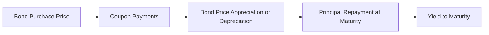

## 21.1 Characteristics of Debt Securities

In the financial marketplace, debt securities (often referred to as fixed-income securities) are vital instruments that represent a contractual loan from an investor (the bondholder) to an issuer (such as the Government of Canada, a province, municipality, or a corporation). The issuer promises to pay interest over a specified term, with the principal (face value) repaid at maturity. Understanding the characteristics of debt securities is crucial for helping clients create balanced portfolios, manage interest rate risk, and achieve specific financial objectives.

This section provides an in-depth look at the core features, structures, and considerations that define debt securities, with a focus on the Canadian market. Whether you advise retail investors, high-net-worth individuals, or institutional clients, having a firm grasp of the concepts below will help you integrate fixed-income products effectively into your wealth management strategies.

---

## Principal (Face Value or Par Value)

At the foundation of every debt security lies its principal (also called face value or par value). This is the amount the issuer borrows and agrees to repay in full on the bond’s maturity date. In Canada, many bonds have a standard principale of $1,000 or $5,000. The principal is also the basis on which interest payments are generally calculated.

• Example: A Government of Canada bond may be issued with a par value of $1,000. If you buy this bond at issuance, it means you’ve lent the government $1,000. The coupon interest is calculated on that $1,000 par value. At maturity, the government repays the full $1,000.  

• Practical Point: When advising a client, emphasize that the face value is not always the price at which the bond trades in the secondary market. Market factors such as interest rate changes and issuer credit ratings can cause bonds to trade above or below their face (par) value.

---

## Coupon Rate

The coupon rate is the nominal, or stated, annual interest rate that determines the interest payments a bondholder receives. This percentage is based on the bond’s face value, not on its market price. While most bonds have a fixed coupon, some issues offer a floating or adjustable rate.

• Fixed Coupon: Pays a predetermined rate (e.g., 3% annually) throughout the life of the bond.  
• Floating Coupon (Variable Coupon): Adjusts periodically (e.g., quarterly or semi-annually) according to a reference rate such as the Canadian Dealer Offered Rate (CDOR) or the yield on a Government of Canada Treasury Bill.  

### Example: Floating-Rate Note (FRN)  
A floating-rate corporate bond might pay a coupon tied to the 3-month CDOR plus a spread, e.g. CDOR + 1.25%. If CDOR changes, the coupon rate is reset at each interval.

---

## Maturity Date

Debt securities come with a defined maturity date—the point in time when the issuer repays the principal to the investor. Maturities can range from very short-term (e.g., 30-day commercial paper) to long-term (e.g., 30-year bonds issued by the Government of Canada or major corporations).

• Short-Term: Less than 1 year (e.g., Treasury Bills).  
• Medium-Term: 1 to 10 years (e.g., many provincial or municipal bonds).  
• Long-Term: More than 10 years (e.g., 30-year Government of Canada bonds).  

### Impact on Investor Strategy  
Bonds with longer maturities typically offer higher coupon rates to compensate for greater interest rate risk and inflation risk over time. For clients who seek a predictable income stream but want lower interest rate risk, shorter maturities may be more suitable.

---

## Interest Payment Structure

Depending on the bond’s structure, interest payments can be made annually, semi-annually, quarterly, or even monthly. In Canada, it is very common for government bonds and many corporate bonds to pay interest semi-annually—effectively splitting the annual coupon rate into two equal payments each year.

• Example: A 4% Government of Canada bond that pays interest semi-annually would deliver two 2% coupon payments over the course of 12 months on a $1,000 face value bond (i.e., $20 every 6 months).

• Investor Tip: The frequency of coupon payments can affect an investor’s cash flow planning, making bonds an important way to match liability streams or anticipated expenses.

---

## Yield

Yield is the reward (or return) an investor receives for holding a debt security. It is influenced by multiple factors, including the coupon rate, the bond’s price (relative to its par value), time to maturity, and the creditworthiness of the issuer. Common yield measures include:

• Current Yield: Annual coupon payment divided by the bond’s current market price.  
• Yield to Maturity (YTM): The total expected return if the bond is held until maturity, accounting for coupon payments, reinvestment assumptions, and any difference between purchase price and par value.  
• Yield to Call (YTC): Relevant if the bond can be called (redeemed early) by the issuer.  

### Visualizing Yield Components

In this diagram, the yield to maturity (E) represents the combination of the coupon income (B), any price difference between the bond’s purchase price and redemption value (C and D), and the interest-on-interest effect from reinvested coupons over the life of the bond.

---

## Market Price

The market price of a bond is the price investors are willing to pay (or accept) in the secondary market. This price varies based on:

• Prevailing Interest Rates: If interest rates rise, bond prices typically drop, and vice versa.  
• Credit Risk of the Issuer: If an issuer’s creditworthiness improves, the bond’s price typically increases.  
• Supply and Demand Dynamics: Market liquidity and demand for certain maturities or credit profiles also affect bond prices.

• Premium or Discount:  
  - Premium: The bond’s price is above par if its coupon rate is higher than current market rates for similarly rated bonds.  
  - Discount: The bond’s price is below par if the coupon rate is lower than current market rates.

---

## Indentures, Covenants, and Legal Protections

An indenture is the formal contract that outlines the terms of the bond, including the rights and obligations of both the issuer and the bondholders. Within indentures, you may find covenants—legal promises or restrictions designed to protect investors.

• Affirmative Covenants: Require the issuer to take certain actions, such as providing audited financial statements or maintaining a certain level of liquidity.  
• Negative Covenants: Restrict the issuer from taking specific actions, such as taking on more debt beyond a set threshold, which could jeopardize the bond’s rating or the issuer’s ability to meet existing obligations.

### Protective Provisions

Some bonds have additional protective features, such as a sinking fund. A sinking fund is a special account into which the issuer deposits funds regularly to redeem a portion of the bond issue before maturity. This reduces the default risk for bondholders, as it ensures that some principal repayment is planned in advance.

---

## Risk Profile of Debt Securities

While debt securities often provide more stability than equity investments, they still expose investors to several risks, including:

• Interest Rate Risk: Prices may decrease when market interest rates rise.  
• Credit Risk: The issuer may fail to make interest or principal payments.  
• Inflation Risk: Fixed coupon payments may lose purchasing power in an inflationary environment.  
• Liquidity Risk: Some bonds, especially from smaller corporate issuers, may be difficult to buy or sell quickly at a fair price.

(Sections 21.2 and 21.3 delve deeper into risks and trading mechanics, including yield curve analysis and bond price volatility.)

---

## Canadian Debt Securities Landscape

In Canada, debt securities are issued by various levels of government and corporations:

1. Government of Canada Bonds (GoCs): Considered risk-free from a credit standpoint, these set the benchmark for the yield curve.  
2. Provincial and Municipal Bonds: Offer slightly higher yields due to their higher risk compared to federal bonds, though still relatively stable.  
3. Corporate Bonds: Issued by public or private companies. Interest rates reflect the issuer’s credit quality and industry sector.  

### Real-World Example

Major Canadian banks like RBC or TD often issue bonds to raise capital for their lending activities. Investors might prefer these bonds for their relatively high creditworthiness, stable yields, and frequent issuance, leading to greater liquidity. At the same time, corporate bonds from less-established firms might offer higher yields but with greater default risk.

---

## Practical Examples and Case Studies

1. Case Study – Canadian Pension Fund  
   • A major Canadian pension fund invests in long-term Government of Canada bonds to match its long-dated liabilities. The stable coupon income helps meet pension payments, and the high credit quality aligns with the fund’s low-risk tolerance.

2. Case Study – Private Investor with a “Laddering” Strategy  
   • A retiree seeking reliable income invests in a laddered bond portfolio with maturities ranging from 1 to 10 years. Each year, when one bond matures, they reinvest the proceeds in a new 10-year bond. This approach helps manage interest rate risk and provides a predictable income stream.

---

## Recommended Resources and References

• Regulatory Bodies:  
  – Canadian Investment Regulatory Organization (CIRO): Offers guidance on managing and distributing fixed-income products.  
  – Canadian Securities Administrators (CSA): Provides regulatory updates on debt securities, including disclosure and reporting requirements.  

• Additional Data and Tools:  
  – Bank of Canada website (https://www.bankofcanada.ca/): Provides daily bond yields, benchmark bond rates, and key economic indicators.  
  – Financial Calculators: Explore open-source bond calculators on GitHub for yield-to-maturity, duration, and convexity analyses.

• Books:  
  – “The Handbook of Fixed Income Securities (Canadian Edition)”  
  – “Fixed Income Analysis” by the CFA Institute  

• Online Courses:  
  – CFA Institute’s Fixed Income curriculum  
  – Moody’s Analytics advanced fixed-income modules  
  – CSI (Canadian Securities Institute) specialized bond courses  

---

## Summary and Key Takeaways

• Debt securities are fixed-income instruments that obligate the issuer to repay principal and interest according to specified terms.  
• Key features include principal, coupon rates, maturity dates, interest payment structures, yield, and market price.  
• The legal framework involves indentures and covenants, which protect both issuers and investors.  
• Although generally less volatile than equities, debt securities still carry risks like interest rate risk, credit risk, and inflation risk.  
• In Canada, government bonds serve as credit-risk-free benchmarks, while corporate bonds and provincial/municipal bonds offer slightly higher yields.  
• Best practices in fixed-income management include understanding bond indentures, covenants, and the potential for sinking funds, as well as analyzing factors affecting bond prices over time.  

By mastering these fundamentals, you are better equipped to guide your clients through the myriad opportunities in Canadian fixed-income markets, tailoring bond investments to meet diverse needs—from capital preservation to steady income generation.

---

## Deep Dive into Key Characteristics of Canadian Debt Securities: Quiz



### Which of the following best describes the principal of a bond?

- [x] The face value or par value that is repaid to the investor at maturity  
- [ ] The annual interest payment an investor receives  
- [ ] The fee an investor pays to broker a bond trade  
- [ ] The total amount of interest earned over the life of the bond  

> **Explanation:** The principal (face value) is the original amount of the loan, repaid at the bond’s maturity date.

### What does the coupon rate of a bond represent?

- [x] The nominal interest rate based on the bond’s face value  
- [ ] The bond’s market price in the secondary market  
- [x] The percentage that determines paid interest to the bondholder  
- [ ] The bond’s rating issued by Moody’s or S&P  

> **Explanation:** The coupon rate, stated as a percentage of par value, determines how much interest is paid to bondholders each year. A bond can have a fixed or floating coupon rate.

### A bond paying 3% annual interest on a $1,000 face value and making semi-annual payments would pay the investor how much every six months?

- [x] $15  
- [ ] $30  
- [ ] $25  
- [ ] $3  

> **Explanation:** A 3% annual coupon on $1,000 equates to $30 per year. Since interest is paid semi-annually, it is split into two payments of $15 each.

### How does a sinking fund provision benefit bondholders?

- [x] It reduces default risk by ensuring partial principal repayments before maturity  
- [ ] It guarantees higher coupon payments if interest rates rise  
- [ ] It mandates a minimum bond price set by the issuer  
- [ ] It ensures bonds trade at a premium in the secondary market  

> **Explanation:** A sinking fund is set aside to redeem portions of the debt issue over time, thereby reducing the chance of default on the final maturity amount.

### Which statement is correct regarding yield to maturity (YTM)?

- [x] YTM accounts for the bond’s coupon payments, the difference between purchase price and par value, and the time to maturity  
- [ ] YTM only considers interest rate changes and not par value at maturity  
- [x] YTM is the same as current yield if the bond is trading at par  
- [ ] YTM is always less than the coupon rate  

> **Explanation:** Yield to maturity is a comprehensive measure of a bond’s total annualized return if held until maturity, factoring in coupon income, price appreciation or depreciation, and compounding over time.

### Which factor typically causes a bond’s market price to rise?

- [x] A decline in prevailing interest rates  
- [ ] A decrease in the issuer’s credit rating  
- [ ] An increase in the bond’s maturity date  
- [ ] A rising inflation rate  

> **Explanation:** When market interest rates decrease, existing bonds with higher coupon rates become more attractive, which drives their prices up.

### Which of the following is a negative covenant in a bond indenture?

- [x] Restricting the issuer from issuing new debt beyond a specified level  
- [ ] Requiring the issuer to submit annual audited financial statements  
- [x] Directing the issuer to invest in a sinking fund for partial redemptions  
- [ ] Allowing the issuer to pay dividends freely  

> **Explanation:** A negative covenant limits certain issuer actions—in this case, preventing the issuer from taking on excessive additional debt or from paying dividends if it impacts their ability to meet bond obligations.

### What is one defining feature of Government of Canada bonds?

- [x] They are generally considered risk-free in terms of credit quality  
- [ ] They pay interest only at maturity (zero-coupon structure)  
- [ ] They must always have a floating rate coupon  
- [ ] They are non-transferable  

> **Explanation:** Government of Canada bonds are regarded as having the highest credit quality in Canada, often used as the risk-free benchmark for other fixed-income securities.

### A bond that trades at a discount in the secondary market is usually priced:

- [x] Below par value  
- [ ] Above par value  
- [ ] Exactly at par value  
- [ ] At a premium plus accrued interest  

> **Explanation:** A discounted bond trades below its par value, often due to a coupon rate lower than the prevailing market rates or changes in issuer creditworthiness.

### True or False: In Canada, semi-annual coupon payments are the most common structure for government and many corporate bonds.

- [x] True  
- [ ] False  

> **Explanation:** In Canada, it is standard practice for federal government and a significant portion of corporate bond issuers to pay coupons semi-annually.



---

## For Additional Practice and Deeper Preparation

**[1. WME Course For Financial Planners (WME-FP): Exam 1](https://www.udemy.com/course/csi-wme-fp-exam1/?referralCode=1A23C67E56971C0A73D5)**  
• Dive into 6 full-length mock exams—1,500 questions in total—expertly matching the scope of WME-FP Exam 1.  
• Experience scenario-driven case questions and in-depth solutions, surpassing standard references.  
• Build confidence with step-by-step explanations designed to sharpen exam-day strategies.

**[2. WME Course For Financial Planners (WME-FP): Exam 2](https://www.udemy.com/course/csi-wme-fp-exam2/?referralCode=25879CCDED7B7905BBA8)**  
• Tackle 1,500 advanced questions spread across 6 rigorous mock exams (250 questions each).  
• Gain real-world insight with practical tips and detailed rationales that clarify tricky concepts.  
• Stay aligned with CIRO guidelines and CSI’s exam structure—this is a resource intentionally more challenging than the real exam to bolster your preparedness.

> Note: While these courses are specifically crafted to align with the WME-FP exam outlines, they are independently developed and not endorsed by CSI or CIRO.
