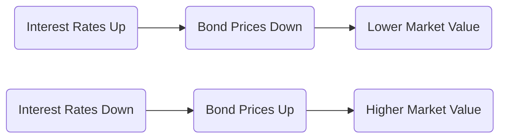
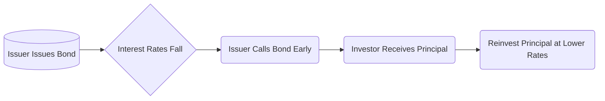

## 21.3 Risks of Debt Securities

Debt securities, such as bonds and debentures, are widely used by Canadian investors and financial planners to generate stable income, diversify portfolios, and preserve capital. However, these securities also come with specific risks that must be understood and managed effectively. In this section, we delve into the primary risks associated with holding debt instruments, explain how these risks impact bond values, and offer practical strategies for mitigation. Examples from the Canadian financial market, including references to major Canadian issuers like the Government of Canada, RBC, and TD, will illustrate how these risks arise in real-world scenarios.

By the end of this section, you will be able to:
• Identify the major risks of debt securities (interest rate, credit, liquidity, inflation, call/prepayment, reinvestment, and foreign exchange).  
• Recognize how each type of risk can affect bond prices, yields, and income streams.  
• Develop strategies to mitigate and manage these risks in a Canadian context.  
• Communicate effectively with clients about the risks inherent in fixed-income products, in line with CIRO’s “Risk Disclosure” guidelines.

---

### Interest Rate Risk

Interest rate risk is one of the most significant risks affecting bond values. When interest rates rise, the price (or market value) of existing bonds typically falls, because newly issued bonds will offer higher coupons or yields to attract investors. Conversely, when interest rates decline, the value of existing bonds generally increases.

1. The **inverse relationship** between bond prices and interest rates  
2. Longer-term bonds are typically more sensitive to interest rate fluctuations than shorter-term bonds  

To visualize this inverse relationship, consider the following Mermaid diagram:

#### Practical Example:
• Suppose you purchase a 10-year Government of Canada bond with a 3% coupon. Shortly after purchase, the Bank of Canada raises its policy rate, causing yields on newly issued 10-year bonds to climb to 4%. Your original bond, still paying a 3% coupon, becomes less attractive, so its market price will decrease to align its yield closer to new market levels.

#### Mitigation Strategies:
• **Short-Duration Bonds**: Investors anticipating rising rates may reduce duration by holding short-term or floating-rate bonds.  
• **Bond Laddering**: Spreading maturities out over time (e.g., 1-year, 3-year, 5-year bonds) helps reduce exposure to any single point of interest rate fluctuation.  
• **Active Portfolio Management**: Regularly reviewing and adjusting bond holdings to respond to changing interest rates.

---

### Credit (Default) Risk

Credit risk is the possibility that a bond issuer will be unable to make scheduled interest or principal payments. This risk varies widely depending on the issuer’s financial stability:

1. Governments like the **Government of Canada** are considered very low risk, owing to their ability to tax and print currency.  
2. Corporations like RBC, TD, or Bell Canada are subject to credit evaluations from rating agencies. Higher-rated issuers (e.g., RBC typically rated AA by DBRS Morningstar or S&P) are considered less risky compared to lower-rated or unrated issuers.

Ratings agencies such as **DBRS Morningstar, Moody’s, S&P, and Fitch** provide independent assessments of issuers’ creditworthiness. Canadian investors and advisors often reference these ratings to evaluate bond default risk.

#### Practical Example:
• Assume RBC issues a 5-year corporate bond paying a 3.5% coupon. RBC’s strong credit rating (e.g., AA) suggests a lower probability of default. Consequently, the yield is relatively modest compared to a lower-rated issuer (e.g., a small energy company rated BB), which might offer a 6% coupon to compensate investors for higher default risk.

#### Mitigation Strategies:
• **Diversification**: Spreading investments across multiple issuers and sectors reduces the impact of any single issuer defaulting.  
• **Credit Analysis**: Monitoring issuers’ credit quality, reading rating agency reports, and tracking financial statements is crucial.  
• **Bond Insurance or Seniority**: In some cases, bonds might be insured, or they may be senior or secured, providing an additional layer of protection.

---

### Liquidity Risk

Liquidity risk arises when investors need to sell a bond but encounter difficulty finding a buyer at a fair market price. While **Government of Canada bonds** are highly liquid, many corporate bonds (especially lower-rated or smaller issues) can trade infrequently.

1. **Narrow vs. Wide Bid-Ask Spreads**: Highly traded bonds, such as federal government bonds, have narrower spreads, making them easier to buy and sell.  
2. **Concentration Risk**: Owning large positions in thinly traded securities increases liquidity risk.

#### Practical Example:
• A small corporate bond issued by a mid-sized Canadian technology company may trade just a few times per month. If you need to sell quickly, you might have to accept a significantly lower price (a wide spread) to entice buyers.

#### Mitigation Strategies:
• **Invest in Liquid Issues**: Preference for issues with high daily trading volumes.  
• **Broker Relationships**: Partnering with brokers or dealers who actively maintain bond inventories can improve liquidity access.  
• **Strategic Allocation**: Limit allocations to illiquid bonds within an overall fixed-income portfolio, balancing them with more liquid securities.

---

### Inflation Risk

Inflation erodes the real purchasing power of a bond’s fixed interest payments and principal repayments. If inflation rises above the coupon rate, the investor’s real return may become negative.

1. **Real Return**: The nominal interest rate minus the inflation rate.  
2. **Index-Linked Securities**: Real Return Bonds (RRBs) issued by the Government of Canada adjust the principal value based on inflation, offering investors partial protection against inflation risk.

#### Practical Example:
• If you hold a 2% coupon bond and inflation unexpectedly jumps to 3%, your real return becomes negative (2% − 3% = −1%). Over time, the purchasing power of interest payments diminishes.

#### Mitigation Strategies:
• **Real Return Bonds (RRBs)**: Issued by the Government of Canada, these adjust with changes in the Consumer Price Index (CPI).  
• **Diversified Portfolio**: Including equities, commodities, or real estate can help hedge inflation risk.  
• **Staggered Maturity Structure**: Holding shorter-term bonds allows for quicker reinvestment at potentially higher rates if inflation (and thus interest rates) rise.

---

### Call or Prepayment Risk

Call or prepayment risk involves the possibility that the issuer or borrowers will repay the debt earlier than its scheduled maturity. Callable corporate bonds, as well as mortgage-backed securities, often come with call or prepayment features.

1. **Callable Bonds**: Issuers may call bonds when interest rates decline, allowing them to refinance at lower rates.  
2. **Mortgage-Backed Securities (MBS)**: Canadian MBS, including those issued or guaranteed by CMHC, can face higher levels of prepayment if homeowners refinance or settle mortgages early.

#### Practical Example:
• An RBC callable bond with a 3.75% coupon and a 10-year term can be called after five years if market interest rates have dropped to 2.5%. RBC might choose to redeem the bond early and reissue debt at the lower rate, leaving you to reinvest at less favourable prevailing rates.

#### Mitigation Strategies:
• **Non-Callable Bonds**: Opt for bonds that do not have embedded call features.  
• **Higher Yield Premium**: If you buy callable bonds, ensure the yield to call reasonably compensates you for the call risk.  
• **Active Monitoring**: Keep an eye on interest rate trends and call dates to be prepared for early redemptions.

---

### Reinvestment Risk

Reinvestment risk occurs when interest or principal payments are received at a time when interest rates are lower than the original bond’s yield, forcing you to reinvest at a reduced rate.

1. **Coupon Payments**: Periodic coupon receipts might need to be reinvested at lower rates in a falling-rate environment.  
2. **Principal Repayment**: At maturity or call date, investors face the same challenge if yields have declined.

#### Practical Example:
• You hold a 5-year callable bond paying 4%. After two years, the issuer calls the bond and repays the principal in full. If the prevailing rate on similar new bonds is now 2%, your reinvestment yield drops significantly.

#### Mitigation Strategies:
• **Bond Ladders**: By staggering bond maturities, coupon and principal payments can be reinvested gradually, reducing reinvestment risk.  
• **Longer Maturities**: Some investors choose longer-maturity bonds if they anticipate a long period of lower rates, though this introduces more interest rate risk.  
• **Diversified Instruments**: Consider other products, such as equities or short-term fixed-income funds, to spread reinvestment risk.

---

### Foreign Exchange Risk

Foreign exchange risk arises when Canadian investors purchase bonds denominated in a foreign currency or when foreign investors hold Canadian dollar bonds. Currency fluctuations can significantly impact returns.

1. **Currency Depreciation/Appreciation**: If the foreign currency in which the bond is denominated weakens against the Canadian dollar, your returns could diminish (and vice versa).  
2. **Global Bond Portfolios**: Many institutional portfolios, such as those managed by Canadian pension funds, use currency-hedging strategies to protect against adverse currency movements.

#### Practical Example:
• A Canadian investor buys a U.S. dollar-denominated bond paying 3%. If the CAD appreciates by 5% against the USD over the holding period, any interest and principal payments converted back to Canadian dollars might result in a loss on the currency side, offsetting the 3% yield.

#### Mitigation Strategies:
• **Hedging Strategies**: Use currency forwards or futures to lock in exchange rates.  
• **Local Currency Bonds**: Focus on Canadian-dollar-denominated bonds if currency risk is undesirable.  
• **Diversification**: Holding a basket of currencies can smooth out the impact of volatility in any single currency.

---

### Glossary of Key Terms

• **Default Risk**: The risk that an issuer will fail to pay interest or principal on time. Largely determined by the issuer’s creditworthiness and financial capacity to repay, as evaluated by rating agencies.  
• **Yield Spreads**: The difference in yields between distinct bonds, reflecting differences in credit risk, liquidity, and other market factors. Government of Canada and corporate bonds often trade at varying spreads based on perceived risk.  
• **Call Provision**: A feature that allows an issuer to redeem a bond before its scheduled maturity, usually at a predefined call price. Immediate reinvestment of the redeemed principal (often at lower rates) represents both call and reinvestment risk.  
• **Reinvestment Risk**: The risk that coupon or principal payments must be reinvested at lower rates, reducing your overall yield.

---

## Diagrams to Enhance Understanding

### Diagram: Call Risk Flow

This diagram illustrates the flow of call risk. When interest rates fall, an issuer is motivated to call the bond (if it has a call provision), returning principal to investors who must then reinvest at lower rates.

---

## Best Practices and Pitfalls

• **Conduct Regular Portfolio Reviews**: Keep track of changing market conditions, credit ratings, and interest rate expectations.  
• **Stay Informed on Regulatory Guidelines**: Consult CIRO’s “Risk Disclosure” guidelines for clear communication of these risks to clients.  
• **Use Reputable Financial Tools**: Services like Bloomberg (subscription required) or TMX Money (https://money.tmx.com/) offer data on Canadian bond prices and yields.  
• **Beware of Concentrated Positions**: Excessive exposure to one issuer or sector amplifies credit and liquidity risks.  
• **Monitor Global Outlook**: Volatility in currency and credit markets can have ripple effects on Canadian bonds, especially for investors in foreign-currency-denominated securities.

---

## Additional Resources

• **Bank of Canada’s Resources on Real Return Bonds and Inflation**:  
  https://www.bankofcanada.ca/rates/

• **CIRO’s “Risk Disclosure” Guidelines**:  
  Official documentation on how Canadian investment dealers and advisors should disclose risks to clients.

• **Recommended Books**:  
  - “Managing Fixed Income Portfolios” by the CFA Institute  
  - “Bond Portfolio Management” by Frank J. Fabozzi  

• **Online Tools & Frameworks**:  
  - **Bloomberg Terminal** for advanced bond analytics (subscription required)  
  - **TMX Money** (https://money.tmx.com/) for Canadian bond quotes and yield comparisons

---

## Summary

Debt securities are integral to the Canadian fixed-income landscape, offering predictability and stability to portfolios. Nonetheless, they carry risks that advisors and investors must recognize. From interest rate risk and credit risk to the nuances of call, prepayment, and reinvestment risk, each factor can significantly influence bond performance. By understanding these risks, adopting prudent portfolio construction techniques, and leveraging resources such as rating agencies and official Canadian regulations, financial planners can better position themselves and their clients to navigate the fixed-income market effectively.

In the next section, we will examine how debt securities are traded and explore yield curves, expanding on how market mechanics and different maturities can further shape the performance and strategies around these instruments.

---

## Test Your Knowledge: Risks of Debt Securities Quiz



### Which statement best explains why bond prices fall when interest rates rise?

- [ ] Bond issuers generally call the bonds immediately when rates rise.  
- [ ] Bond buyers only invest in equities when rates rise.  
- [x] Newly issued bonds carry higher coupon rates, making existing bonds less attractive.  
- [ ] Bonds cannot be sold in secondary markets when rates rise.  

> **Explanation:** When new bonds offer higher coupons or yields, existing bonds must decrease in price to remain competitive.

### Which of the following factors contributes most to higher price volatility in bonds?

- [ ] Shorter duration  
- [x] Longer maturity  
- [ ] High coupon rate  
- [ ] High liquidity  

> **Explanation:** Longer-maturity bonds have higher duration and are more sensitive to changes in interest rates, leading to greater price volatility.

### What is the main purpose of credit ratings from agencies like DBRS Morningstar?

- [x] To assess the bond issuer’s likelihood of defaulting on payments  
- [ ] To determine the next Bank of Canada rate decision  
- [ ] To indicate the expected inflation rate  
- [ ] To stabilize bond prices in the market  

> **Explanation:** Credit ratings evaluate the issuer’s financial strength and ability to meet debt obligations, thereby indicating default risk.

### Which scenario best illustrates liquidity risk?

- [ ] A bond’s coupon rate is lower than the current interest rate.  
- [x] A corporate bond trades infrequently, causing a wide bid-ask spread.  
- [ ] A bond’s coupon payments are not indexed to inflation.  
- [ ] A bond is callable at the issuer’s discretion.  

> **Explanation:** Infrequent trading makes it difficult to sell at a fair price, which is the essence of liquidity risk.

### How do Real Return Bonds (RRBs) help mitigate inflation risk?

- [ ] By guaranteeing a higher coupon when interest rates rise  
- [ ] By offering embedded call features  
- [x] By adjusting principal values based on inflation  
- [ ] By paying coupons directly in gold  

> **Explanation:** RRBs index the bond’s principal to the Consumer Price Index, thereby preserving the holder’s purchasing power.

### If an issuer calls a bond before maturity, which additional risk might investors face?

- [x] Reinvestment risk  
- [ ] Currency risk  
- [ ] Default risk  
- [ ] Liquidity risk  

> **Explanation:** Early redemption forces investors to reinvest returned principal, often at lower prevailing yields.

### Which of the following strategies best helps manage reinvestment risk?

- [x] Creating a bond ladder with staggered maturities  
- [ ] Using only long-duration bonds  
- [x] Diversifying into other asset classes  
- [ ] Holding all bonds until maturity regardless of rate changes  

> **Explanation:** Staggered maturities spread out coupon and principal payments over time, reducing the impact of lower rates when reinvesting. Diversification across asset classes can also help manage reinvestment risk.

### A Canadian investor holding U.S. dollar-denominated bonds faces which additional risk?

- [ ] Call risk  
- [x] Foreign exchange risk  
- [ ] Liquidity risk in the Canadian market  
- [ ] Higher credit risk only  

> **Explanation:** Fluctuations in the CAD/USD exchange rate can affect the investor’s returns, making foreign exchange risk a key consideration.

### Which factor commonly influences yield spreads between two bonds?

- [x] Differences in credit ratings  
- [ ] Whether the bond is short-term or long-term  
- [ ] The investor’s personal risk tolerance  
- [ ] Bond coupon frequency  

> **Explanation:** Yield spreads often reflect differences in creditworthiness (among other factors such as liquidity and sector risk).

### An issuer with an outstanding credit rating (e.g., AA) typically has a higher probability of default compared to a BBB-rated issuer.

- [ ] True  
- [x] False  

> **Explanation:** AA indicates a stronger credit profile than BBB. A stronger rating typically signals a lower probability of default relative to lower-rated issuers.



---

## For Additional Practice and Deeper Preparation

**[1. WME Course For Financial Planners (WME-FP): Exam 1](https://www.udemy.com/course/csi-wme-fp-exam1/?referralCode=1A23C67E56971C0A73D5)**  
• Dive into 6 full-length mock exams—1,500 questions in total—expertly matching the scope of WME-FP Exam 1.  
• Experience scenario-driven case questions and in-depth solutions, surpassing standard references.  
• Build confidence with step-by-step explanations designed to sharpen exam-day strategies.

**[2. WME Course For Financial Planners (WME-FP): Exam 2](https://www.udemy.com/course/csi-wme-fp-exam2/?referralCode=25879CCDED7B7905BBA8)**  
• Tackle 1,500 advanced questions spread across 6 rigorous mock exams (250 questions each).  
• Gain real-world insight with practical tips and detailed rationales that clarify tricky concepts.  
• Stay aligned with CIRO guidelines and CSI’s exam structure—this is a resource intentionally more challenging than the real exam to bolster your preparedness.

> Note: While these courses are specifically crafted to align with the WME-FP exam outlines, they are independently developed and not endorsed by CSI or CIRO.
