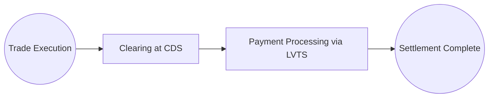

## 21.4 Debt Market Trading Mechanics

Debt markets provide essential channels for governments and corporations to raise capital and for investors to acquire fixed-income securities. In Canada, the debt market includes a vibrant government bond market (federal, provincial, and municipal) and an extensive corporate bond sector. Understanding the mechanics of how bonds are brought to market, traded in the secondary environment, and ultimately settled is crucial for financial planners working with clients who invest in fixed-income products. This section explores the fundamentals of Canadian debt market trading: from primary issuance and underwriting to the protocols of secondary market trading, settlement procedures, transparency initiatives, and regulatory oversight.

---------------------------------------------------------------------------

## The Primary Market

The primary market is where newly issued bonds are first made available to investors. While large institutional investors often dominate primary offerings, retail investors in Canada can also participate, particularly in government bond auctions or through dealers distributing new corporate issues.

### Issuers and Their Motivations

• Government Issuers (Federal and Provincial):  
  - Raise funds to finance public expenditures and manage economic policy.  
  - Investors in government bonds typically enjoy a high degree of safety, especially with federal bonds backed by Canada’s consolidated revenue fund.

• Corporate Issuers:  
  - Seek to fund business operations, expansion, acquisitions, or refinancing of existing debt.  
  - Bond terms (maturity, coupon, security) vary based on company credit status, market interest rates, and appetite from institutional and retail investors.

### Government Bond Auctions

In Canada, auctions for federal government bonds and treasury bills are conducted through the Bank of Canada. The process is designed to promote transparent and efficient allocation of securities:

1. Announcement: The Bank of Canada publishes auction dates, details of the bond issue (maturity, coupon rate, etc.), and bidding procedures.  
2. Competitive vs. Non-Competitive Bids:  
   - Competitive bids specify the quantity and yield desired.  
   - Non-competitive bids (often used by smaller investors) guarantee allocation at the average accepted yield.  
3. Allocation: The Bank of Canada operates a multiple-price auction, filling bids until all securities are allocated.  
4. Results Publication: Post-auction, the Bank of Canada releases auction statistics, including awarded yields and total amount allocated.

The Bank of Canada’s Market Notices and auction results are publicly available on its website, providing transparency and fostering confidence in the Canadian government debt market.

### Corporate Bond Underwriting

When corporations decide to issue bonds, they often employ an underwriting syndicate. A lead underwriter—usually an investment bank or a major broker-dealer (e.g., RBC Capital Markets or TD Securities)—works with a group of dealers to structure, price, and distribute the new bond issue. Key steps include:

1. Pre-Marketing and Roadshows: Underwriters gauge investor demand and gather feedback on pricing and structure.  
2. Pricing and Distribution: Once consensus is reached, underwriters allocate the bonds to investors at a set price or yield.  
3. Settlement: Investors who participated in the primary distribution typically settle on an agreed date—often T+2.  

Some corporate issuers may opt for private placements, selling bonds directly to a select group of institutional investors. This route can save on distribution costs and expedite issuance but often has limited liquidity in the secondary market.

---------------------------------------------------------------------------

## The Secondary Market

Once bonds are issued, their ownership can change hands in the secondary market. These trades do not raise capital for issuers but allow investors to buy or sell existing securities based on changing investment objectives or market conditions.

### Over-the-Counter (OTC) Dominance

Unlike equities, most bond trading in Canada occurs over-the-counter (OTC), where:

• Dealers (banks and broker-dealers) negotiate trades directly with clients or other dealers.  
• Transactions often take place over electronic communication networks, telephone, or specialized trading platforms.  
• Large blocks of bonds can be traded privately, and trade details may be disclosed post-transaction to facilitate regulatory oversight.

### Dealer and Investor Interaction

Dealers quote bid (price at which the dealer buys) and ask (price at which the dealer sells) prices. Investors typically approach dealers for quotes, especially for larger trades that might not have an easily visible market price. This approach ensures flexible pricing structures but can reduce the transparency found in centralized exchange-traded products.

---------------------------------------------------------------------------

## Dealers and Market Makers

Dealers, also called broker-dealers, provide liquidity by continuously quoting bid and ask prices. They often manage inventories of bonds and can commit capital to facilitate client trades:

1. Market Making: A registered dealer maintains an inventory of bonds and stands ready to buy or sell, ensuring market liquidity.  
2. Spread Management: The difference between the bid and ask drives dealer compensation and reflects credit risk, market volatility, and supply/demand.  
3. Risk Management: Dealers must manage the volatility (interest rate movements and credit events) associated with holding bond inventories.

### Example: TD as a Market Maker

A hypothetical scenario helps illustrate the role:  
• TD Securities holds an inventory of Federal Government bonds and corporate bonds.  
• A large pension fund manager wants to buy $10 million of a certain corporate issue.  
• TD checks its inventory and the broader market to determine a price. It may also hedge interest rate risk via bond futures or interest rate swaps.  
• TD quotes a bid-ask spread reflecting the market environment and the credit quality of the bond, aiming to cover potential inventory risks.

---------------------------------------------------------------------------

## Settlement Procedures

Settlement refers to the exchange of payment for securities. In Canada, settlement typically follows a T+2 cycle—two business days after the trade date.

### The Canadian Depository for Securities (CDS)

Clearing and settlement services for most Canadian debt transactions are facilitated by the Canadian Depository for Securities (CDS), a subsidiary of the TMX Group. Key roles include:  
• Recording trades and ownership changes.  
• Facilitating payment through large-value transfer systems such as the Canadian Payments Association’s LVTS (Large Value Transfer System).  
• Reducing counterparty risk through netting processes.

### Settlement Workflow Diagram

Below is a simplified diagram (using Mermaid.js) showing how a transaction might settle:

> **Diagram Explanation:**  
> 1. The trade is executed between two parties.  
> 2. CDS acts as a central clearing hub, recording details of the trade and coordinating the exchange of cash and securities.  
> 3. The payment is processed through a large-value transfer system.  
> 4. Ownership is transferred, and the trade is deemed settled.

---------------------------------------------------------------------------

## Pricing Sources and Transparency

### Government Bond Pricing

• Market data for Government of Canada bonds is widely disseminated.  
• Yields for benchmark issues (e.g., 2-year, 5-year, 10-year, 30-year) are published daily through various financial news outlets and the Bank of Canada.  

### Corporate Bond Pricing

Although public reporting has improved, corporate bond pricing can still be more opaque. Initiatives by the Canadian Securities Administrators (CSA) and improved electronic platforms have enhanced transparency, but complexities remain:

• Corporate bond issues are more diverse and often less liquid than government bonds.  
• Dealer quotes may reflect wide bid-ask spreads, particularly for high-yield or less actively traded issues.  
• Electronic trading venues (like MarketAxess) are increasingly used, reporting executed trades to help investors gauge recent pricing levels.

---------------------------------------------------------------------------

## Regulatory Oversight

### CIRO

The Canadian Investment Regulatory Organization (CIRO)—formed by the consolidation of IIROC and the MFDA—oversees investment firms dealing in debt securities. Their mandates include:

• Ensuring dealers maintain adequate capital and risk controls.  
• Enforcing best execution practices, so clients get fair dealing.  
• Overseeing compliance with suitability requirements.

### CSA and Provincial Regulators

The Canadian Securities Administrators (CSA) and each province’s securities commission (e.g., Ontario Securities Commission) coordinate to maintain fair debt markets:

• Disclosure Requirements: New issuers must comply with prospectus rules and ongoing reporting (if publicly traded).  
• Transaction Reporting: Regulatory bodies receive transaction data or near-real-time reporting.  
• Transparency Initiatives: Regulators regularly review proposals to enhance bond market transparency, including post-trade data disclosure and best execution frameworks.

---------------------------------------------------------------------------

## Practical Examples and Case Studies

### Pension Funds and Federal Government Bonds

A large Canadian pension fund, such as the CPP Investments Board, may opt to purchase federal government bonds during a Bank of Canada auction to match its long-term liabilities. By participating in the primary market directly (or via a dealer), it can secure an allocation of high-quality assets at auction-determined yields. The pension fund’s risk management team then monitors the bond portfolio in the secondary market, adjusting exposures through OTC trades as interest rates or credit conditions evolve.

### Corporate Bond Issuance by RBC

Royal Bank of Canada (RBC) may issue a 5-year corporate bond to raise $1 billion at a fixed coupon. RBC Capital Markets may lead the underwriting syndicate, marketing the bond to institutional clients such as mutual funds, insurance companies, and wealth management firms. After the initial distribution, these bonds trade on the secondary market, typically via OTC dealer networks. RBC, as both an issuer and dealer, must manage any potential conflicts of interest under strict regulations, ensuring arms-length pricing and best execution for clients.

---------------------------------------------------------------------------

## Actionable Insights and Best Practices

1. Stay Informed: Monitor Bank of Canada press releases and auction schedules to anticipate shifts in yield curves that could affect bond allocations.  
2. Evaluate Liquidity: In the secondary market, higher credit bonds (like federal or provincial) typically have narrower spreads and greater liquidity. Advising clients to consider liquidity needs is critical to minimize transaction costs.  
3. Mind the Settlement Cycle: T+2 settlement is standard, but for large institutional trades or cross-border transactions, ensure all parties are prepared for timely settlement to avoid potential fails or penalties.  
4. Compare Dealer Quotes: For best execution, particularly in the corporate bond market, encourage clients to solicit multiple quotes.  
5. Keep Abreast of Regulatory Developments: Bond market transparency and best execution rules continue to evolve. Stay informed via CSA updates, CIRO bulletins, and relevant continuing education.  

---------------------------------------------------------------------------

## Common Pitfalls

• Overlooking Credit Risk: Investors may chase higher yields without adequately assessing the bond’s credit rating or default risk.  
• Ignoring Liquidity Constraints: Less-liquid bonds can have wide bid-ask spreads—significantly impacting returns if you need to sell before maturity.  
• Poor Execution Practices: Failing to shop around for best price or not verifying settlement details can erode investment returns.  
• Underestimating Interest Rate Risk: Rising interest rates can significantly impact bond prices, especially for longer maturities.  

---------------------------------------------------------------------------

## Glossary

• **Primary Market:** The market for new issues of securities.  
• **Secondary Market:** The market where investors buy and sell existing securities.  
• **Underwriting Syndicate:** A group of dealers that jointly distribute new securities and absorb unsold portions if necessary.  
• **T+2 Settlement:** Trades settle two business days after the trade date.  

---------------------------------------------------------------------------

## Additional Resources

• Bank of Canada: Market Notices and auction results (bankofcanada.ca)  
• Canadian Depository for Securities (CDS): Clearing and settlement processes (https://www.cds.ca)  
• CSA Publications: Bond market transparency rules, best execution guidelines (securities-administrators.ca)  
• Books:  
  - “Guide to the Canadian Bond Market” by industry practitioners  
  - “Trading and Exchanges: Market Microstructure for Practitioners” by Larry Harris  
• Open-Source Tools:  
  - Python libraries (NumPy, pandas) for bond pricing and yield curve analysis  
  - R packages (“quantmod”, “xts”) for time-series analysis of bond yields  

---------------------------------------------------------------------------

## Summary and Next Steps

Efficiency, transparency, and robust regulatory oversight define the Canadian debt market. Understanding how new bonds enter the market, how they trade, and how settlement is managed can empower advisors and their clients to make informed decisions. In practice, analyzing liquidity, credit quality, interest rate trends, and regulatory changes is key to successful bond investing.

Next, we will delve deeper into bond pricing mechanics, yield calculations, and sophisticated trading strategies in subsequent chapters. Encourage clients to integrate debt market insights into their broader wealth management strategies, balancing fixed-income holdings with equities, alternative investments, and cash to create a diversified portfolio aligned with their risk tolerance and goals.

---------------------------------------------------------------------------

## Test Your Knowledge: Canadian Debt Market Trading Mechanics Quiz



### Which best describes the primary market for bonds in Canada?

- [x] It involves the issuance of new bonds directly to investors, often via underwriters or auctions.
- [ ] It is a market where previously issued bonds are traded among investors. 
- [ ] It is a platform designed for buying equity securities only.
- [ ] It is a futures market regulated by the Bank of Canada.

> **Explanation:** The primary market is where issuers, such as governments or corporations, sell new bonds to investors for the first time.

### In the Bank of Canada’s auction process, what is a key characteristic of non-competitive bids?

- [ ] They specify a minimum yield but unlimited quantity. 
- [x] They guarantee allocation at the average accepted yield. 
- [ ] They allow only foreign investors to participate. 
- [ ] They can only be submitted for corporate bond issues.

> **Explanation:** Non-competitive bids at Bank of Canada auctions guarantee allocation at the average accepted yield, making them accessible to smaller investors who do not want to compete on yield.

### In Canada’s secondary bond market, which mechanism typically dominates the trading of existing bonds?

- [ ] Centralized exchanges like the TSX. 
- [ ] Blockchain-based decentralized platforms. 
- [ ] Auction-style systems similar to government bond auctions.
- [x] Over-the-counter (OTC) markets with dealer-based negotiations.

> **Explanation:** Most bond trading in Canada happens in OTC markets, where dealers negotiate trades directly with investors.

### How do dealers act as market makers in the bond market?

- [x] They hold inventories of securities, offering quoted bid and ask prices to ensure liquidity. 
- [ ] They participate only on a “matchmaking” basis without handling inventory. 
- [ ] They rely exclusively on electronic trading platforms to provide quotes. 
- [ ] They only execute trades on behalf of institutional investors.

> **Explanation:** Market makers in the bond space typically keep securities on hand (inventory) and quote buy (bid) and sell (ask) prices to facilitate liquidity in the market.

### Why can corporate bond pricing be more opaque than government bond pricing?

- [x] Corporate bond issues are more diverse, often less liquid, and trade predominantly OTC with less frequent public quoting. 
- [ ] There is no regulatory oversight for corporate bond trades. 
- [ ] Corporate bonds trade on a centralized exchange with strict transparency rules. 
- [ ] Corporate bonds do not require a prospectus, making them invisible to investors.

> **Explanation:** Because corporate bonds generally have fewer centralized marketplaces, less trading volume, and are dealt with OTC, pricing transparency is lower compared to highly liquid government bonds.

### Which entity is primarily responsible for clearing and settling most Canadian bond trades?

- [ ] Investment dealers association (IDA). 
- [x] The Canadian Depository for Securities (CDS). 
- [ ] The TMX Stock Exchange. 
- [ ] The Canadian Securities Administrators (CSA).

> **Explanation:** The CDS facilitates the clearing and settlement of most bond transactions in Canada, ensuring accurate and secure transfer of ownership and funds.

### What is the standard settlement period for most bond trades in Canada?

- [ ] T+1 
- [x] T+2 
- [ ] T+3 
- [ ] T+5

> **Explanation:** Canadian bond trades generally settle two business days after the trade date, known as T+2.

### Which regulator is central to overseeing dealer conduct in Canada’s debt markets?

- [x] CIRO (Canadian Investment Regulatory Organization). 
- [ ] The U.S. Securities and Exchange Commission (SEC). 
- [ ] The Royal Canadian Mint. 
- [ ] Canada Revenue Agency (CRA).

> **Explanation:** CIRO, formed by the consolidation of IIROC and MFDA, oversees dealer conduct and ensures compliance across the nation’s investment firms, including those dealing with fixed-income securities.

### How do dealers typically make money in the bond market?

- [x] Through the bid-ask spread. 
- [ ] By charging a mandated government fee for each trade. 
- [ ] By collecting monthly maintenance fees from investors. 
- [ ] By receiving interest coupons on behalf of bondholders.

> **Explanation:** Dealers earn revenue from the difference (spread) between the price at which they buy a bond (bid) and the price at which they sell it (ask).

### T+2 settlement means a bond trade made on Wednesday will typically settle on:

- [x] Friday of the same week.
- [ ] Wednesday of the next week.
- [ ] Monday of the next week.
- [ ] Immediately at the time of trade.

> **Explanation:** With a T+2 standard, a trade executed on Wednesday will settle two business days later, which is Friday (assuming no holidays interrupt the schedule).



---------------------------------------------------------------------------

## For Additional Practice and Deeper Preparation

**[1. WME Course For Financial Planners (WME-FP): Exam 1](https://www.udemy.com/course/csi-wme-fp-exam1/?referralCode=1A23C67E56971C0A73D5)**  
• Dive into 6 full-length mock exams—1,500 questions in total—expertly matching the scope of WME-FP Exam 1.  
• Experience scenario-driven case questions and in-depth solutions, surpassing standard references.  
• Build confidence with step-by-step explanations designed to sharpen exam-day strategies.

**[2. WME Course For Financial Planners (WME-FP): Exam 2](https://www.udemy.com/course/csi-wme-fp-exam2/?referralCode=25879CCDED7B7905BBA8)**  
• Tackle 1,500 advanced questions spread across 6 rigorous mock exams (250 questions each).  
• Gain real-world insight with practical tips and detailed rationales that clarify tricky concepts.  
• Stay aligned with CIRO guidelines and CSI’s exam structure—this is a resource intentionally more challenging than the real exam to bolster your preparedness.

> Note: While these courses are specifically crafted to align with the WME-FP exam outlines, they are independently developed and not endorsed by CSI or CIRO.
