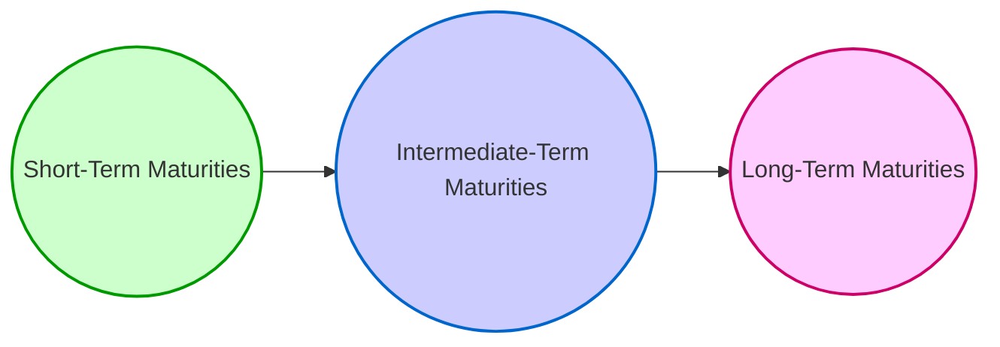
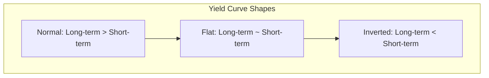

## 21.5 The Term Structure of Interest Rates (Yield Curves)

The term structure of interest rates—often referred to as the “yield curve”—plots the relationship between bond yields and maturities. Representing a foundational concept in bond markets, the yield curve provides insights into economic conditions, inflation expectations, and financial market sentiment. For wealth advisors in Canada, analyzing the yield curve is critical for formulating effective debt security strategies, managing portfolio duration, and advising clients on interest rate risks, credit risks, and overall portfolio positioning.

In this section, we break down the key aspects of yield curves and show you how to navigate their complexities in the Canadian market context.

---

## Defining the Yield Curve

The yield curve is a graphical representation of the yields of similar-quality bonds (often Government of Canada bonds for benchmark purposes) against various maturities, typically ranging from a few months (short-term) to 30 years (long-term). The vertical axis of the chart represents the yield (or interest rate), while the horizontal axis represents time to maturity.

In practice, the yield curve is used by policymakers, investors, and financial planners to gauge expectations around inflation, interest-rate movements, and economic growth.

---

## Shapes of the Yield Curve

Yield curves can assume several shapes, each carrying different market and economic signals:

### Normal (Upward Sloping) Yield Curve
In a normal or upward-sloping curve, longer-term yields are higher than shorter-term yields. This is often interpreted as a sign that investors expect:

1. Economic growth to continue or accelerate.  
2. Inflation to rise moderately with economic expansion.  
3. A potential risk premium for holding longer-term bonds.

Under normal circumstances, the difference between short-term and long-term yields is referred to as the spread. A larger spread suggests stronger growth expectations, while a narrower spread may indicate some concerns about future economic uncertainty.

### Flat Yield Curve
A flat curve occurs when short-, medium-, and long-term yields are very close to each other. Often interpreted as a transitional phase or one reflecting significant economic uncertainty, a flat yield curve may suggest that:

1. The market sees limited difference between short- and long-term risks.  
2. Economic forces (like monetary policy or shifting inflation expectations) are causing a convergence of yields across maturities.

A flattening curve can be seen when markets anticipate a shift from growth to slower growth or from high interest rates to stable or lower rates.

### Inverted (Downward Sloping) Yield Curve
An inverted curve sees shorter-term yields exceed longer-term yields—an unusual scenario that can be driven by:

1. Investor fear of near-term uncertainty and a belief that interest rates in the future will be lower.  
2. Tightening monetary policy that lifts short-term rates above expected longer-term rates.  
3. Expectations of an economic slowdown or recession.

Historically, an inverted yield curve has been a relatively reliable indicator of impending economic slowdowns—though the timing and severity of slowdowns vary widely, and an inverted curve does not guarantee recessionary conditions.

---

## Theories Explaining the Yield Curve

Economists and market analysts have proposed various theories to explain why yield curves take on different shapes. The three most commonly referenced theories are:

### Pure Expectations Theory
According to the Pure Expectations Theory, today’s yield curve reflects the market’s aggregate expectation of future short-term interest rates. In other words, the observed yield on a long-term bond is essentially the average of the future expected short-term rates over that period.

• Example: If the market expects short-term interest rates to rise consistently over the next five years, the yield on a five-year bond will be higher to incorporate these anticipated rate increases.  
• Implication: This theory assumes market participants are indifferent about maturity length, focusing purely on expected future rates.

### Liquidity Preference Theory
Under this theory, investors generally prefer shorter-term bonds because they are more liquid and typically involve less interest rate risk. To entice investors to hold longer-term bonds, issuers must offer a liquidity premium. This premium nudges longer-term yields higher, reinforcing the idea that yield curves are more likely to slope upward over time.

• Example: A pension fund may insist on a higher yield for a 10-year Government of Canada bond versus a 2-year bond to compensate for inflation risk, interest rate risk, and reduced liquidity.  
• Implication: This theory suggests that, even if future interest rates are expected to remain stable, the yield curve will likely have an upward bias because investors need compensation for taking on longer maturities.

### Market Segmentation Theory
Market Segmentation Theory states that different investor groups focus on their own preferred maturity segments due to mandate restrictions, liabilities, or specific risk preferences. For instance, pension funds might concentrate on long-term maturities, while large corporations might be more active in the short-term market.

• Example: A Canadian insurer with long-duration liabilities might focus on 20- to 30-year bonds, causing yields on those bonds to behave somewhat independently of shorter maturities.  
• Implication: The supply and demand dynamics within each maturity segment directly influence the shape of the yield curve.

---

## Implications for Investors and Advisors

### Economic Cycle Indicators
The yield curve can serve as a roadmap for anticipating changes in the economic cycle. For instance, a flattening or inversion might prompt a wealth advisor to counsel clients on repositioning portfolios to be less vulnerable to a potential economic slowdown. Conversely, a steepening yield curve may suggest a period of expansion, offering opportunities in credit or equity markets.

### Portfolio Strategy: Barbell vs. Bullet
• Barbell Strategy: Concentrates on short- and long-duration bonds, reducing exposure to intermediate maturities. This approach may be advantageous if you expect more interest rate volatility in the mid-range or want to balance liquidity (short end) against higher yield (long end).  
• Bullet Strategy: Focuses on bonds that mature around the same time (concentrated in the mid-range), which can be beneficial if you are confident in a particular interest rate outlook or if the liabilities in question have known mid-term horizons.

### Duration Management and Risk
Duration—a measure of a bond’s sensitivity to interest rate changes—shifts in line with the shape of the yield curve. Managing a portfolio’s duration to align with yield curve forecasts is essential in mitigating:

• Interest Rate Risk: Rapid changes in yields can cause significant bond price volatility, especially in longer-dated securities.  
• Reinvestment Risk: A declining yield curve can lower reinvestment rates for coupon payments or maturing bonds.

---

## Yield Curve Analysis Tools

### Government Benchmark Yields
In Canada, Government of Canada bonds form the benchmark curve. Their yields serve as a reference for provincial, municipal, and corporate bonds. By comparing various issuers’ yields against the Government of Canada yield curve, wealth advisors can assess credit spreads and relative value.

A commonly used resource for real-time benchmark yields is the Bank of Canada’s official website:  
• [Bank of Canada: Canadian Bonds](https://www.bankofcanada.ca/rates/interest-rates/canadian-bonds/)

### Spread Analysis 
Spread analysis entails measuring the difference between a specific bond’s yield and the yield on a comparable Canadian government bond. This spread reflects credit risk, liquidity considerations, and market sentiment. For instance, if a major Canadian bank’s five-year bond trades at a 50-basis-point (0.50%) spread over the five-year Government of Canada bond, this indicates the market’s view of the bank’s relative creditworthiness and liquidity risk.

• Example (RBC vs. Government Benchmark): If RBC’s 10-year bond yields 4.0% while the 10-year Government of Canada bond yields 3.6%, the spread is 0.4% (40 basis points). This 0.4% difference compensates investors for RBC’s credit risk versus that of the federal government.

---

## Practical Case Studies and Examples

### Case Study: A Canadian Pension Fund
A large Canadian pension fund plans to fund long-term liabilities (e.g., retirement benefits) over the next 25 years. Faced with a flattening yield curve, they employ a barbell strategy:

1. Short-term bonds provide liquidity to meet near-term payout needs.  
2. Long-term bonds lock in yields for the extended portion of their obligations.  
3. By minimizing exposure to mid-term maturities, they reduce overall interest rate risk volatility if rates unexpectedly spike or plunge in the mid-range segment.

### Case Study: TD Asset Management
TD Asset Management might look at interest rate forecasts from their economic research team. If the yield curve appears to be on the verge of inverting, they could adjust client portfolios, reducing exposure to higher-duration bonds in the short term and positioning in slightly shorter maturities to mitigate potential capital losses if long-term rates drop below short-term rates.  
• This proactive approach is a real-world application of yield curve forecasting and duration management.

---

## Common Pitfalls and Best Practices

### Pitfalls
• Overreliance on Historical Patterns: While an inverted yield curve has historically been a reliable recession indicator, no economic signal is foolproof.  
• Underestimating Credit and Liquidity Risk: Focusing solely on yields and ignoring issuers’ credit quality or liquidity constraints can lead to significant portfolio losses.  
• Neglecting Client Objectives: Advisors must align yield curve strategies with each client’s unique goals, risk tolerance, and timelines.

### Best Practices
• Diversify Across Sectors and Maturities: Mitigate interest rate and credit risk by exploring multiple maturity segments and credit qualities.  
• Monitor Economic Indicators: Track macroeconomic data (inflation, employment, GDP) alongside yield curve movements to form well-rounded market perspectives.  
• Use Reputable Data Sources: Consult the Bank of Canada, Canadian Securities Administrators (CSA), and research materials from major Canadian banks to ensure accurate yield data and analyses.

---

## Additional Resources and References

1. **Bank of Canada’s Yield Curve Data**  
   Visit the Bank of Canada’s official site for real-time yields and historical data.  
   [https://www.bankofcanada.ca/rates/interest-rates/canadian-bonds/](https://www.bankofcanada.ca/rates/interest-rates/canadian-bonds/)
2. **Canadian Securities Administrators (CSA)**  
   Offers valuable publications and research related to market structure and investor protection.  
3. **Leading Canadian Banks’ Market Analysis**  
   RBC, TD, and other major banks publish regular reports on yield curve analyses.  
4. **“Fixed Income Securities” by Bruce Tuckman and Angel Serrat**  
   An in-depth look into yield curve analytics, fixed income valuation, and advanced topics.  
5. **Online Tools**  
   Websites like [Investing.com](https://www.investing.com) and [TMX Money](https://money.tmx.com/) provide user-friendly yield curve charting tools and market data.

---

## Summary

• The term structure of interest rates (yield curve) captures how interest rates vary across different maturities.  
• Advisors interpret yield curve shapes—normal, flat, or inverted—alongside theories like the Pure Expectations Theory, Liquidity Preference Theory, and Market Segmentation Theory.  
• The yield curve helps in anticipating changes in economic cycles, formulating portfolio strategies (e.g., barbell vs. bullet), and managing duration.  
• For Canadian advisors, analyzing Government of Canada bond yields and comparing them with corporate or provincial bond spreads is a key skill for informed decision-making.  
• By incorporating a thorough understanding of yield curves with rigorous credit analysis, advisors can bolster client portfolios against interest rate fluctuation risks.

Yield curve awareness, coupled with ongoing monitoring of economic indicators, is an essential aspect of proactive and strategic wealth management. Whether it is mitigating interest rate risk or capitalizing on new market opportunities, the shapes and movements of the yield curve serve as a powerful guide for financial planners operating in Canada’s dynamic market environment.

---

## Test Your Knowledge of Yield Curves in Canada



### Which of the following best describes a normal yield curve?

- [ ] Short-term yields exceed long-term yields.
- [ ] Short, medium, and long-term yields are nearly equal.
- [x] Long-term yields exceed short-term yields.
- [ ] Intermediate yields are much lower than both short and long maturities.

> **Explanation:** A normal yield curve is typically upward sloping, meaning longer-term rates are higher than shorter-term rates.

### Which shape of the yield curve is often seen as a predictor of economic slowdowns or recessions?

- [ ] Normal
- [ ] Flat
- [x] Inverted
- [ ] Barbell

> **Explanation:** An inverted yield curve occurs when short-term rates exceed long-term rates, historically seen as a potential indicator of an economic downturn.

### What does the Pure Expectations Theory primarily emphasize in explaining the shape of the yield curve?

- [x] Future interest rate expectations
- [ ] Investor preference for liquidity in short-term assets
- [ ] Market segmentation based on institutional mandates
- [ ] Credit risk differentials

> **Explanation:** The Pure Expectations Theory suggests that the slope of the yield curve is determined by the market’s expectations of future short-term rates.

### In the context of Canadian bond markets, which securities are often used as a benchmark for yield curve analysis?

- [ ] U.S. Treasury bonds
- [ ] Corporate bonds from major banks
- [x] Government of Canada bonds
- [ ] Provincial and municipal bonds

> **Explanation:** Government of Canada bonds are generally considered the standard benchmark for yield curve analysis within Canada.

### According to the Liquidity Preference Theory, why do longer-term bonds typically offer higher yields?

- [ ] They are inherently risk-free.
- [ ] They always have higher default risk.
- [x] Investors demand a premium for holding longer-term securities.
- [ ] They are less affected by interest rate movements.

> **Explanation:** Under Liquidity Preference Theory, investors want higher yields to compensate for the greater interest rate risk, inflation risk, and liquidity risk associated with longer maturities.

### A barbell strategy involves which of the following?

- [ ] Concentrating all bonds in medium-term maturities.
- [ ] Diversifying equally across all maturities.
- [x] Focusing on short-term and long-term maturities while minimizing mid-range holdings.
- [ ] Holding only reinvestment-friendly floating-rate notes.

> **Explanation:** A barbell strategy combines short- and long-term bonds to balance liquidity and yield, minimizing exposure to intermediate maturities.

### How can yield curves help anticipate changes in economic cycles?

- [x] A flattening or inversion may signal an upcoming slowdown.
- [ ] A normal yield curve guarantees perpetual economic expansion.
- [x] Yield curves never correlate with economic indicators.
- [ ] Yield curves are irrelevant for economic forecasting.

> **Explanation:** The slope and shape of the yield curve often correlate with broader economic expectations. A flattening or inverted curve can suggest a weakening economy.

### What is a key advantage of spread analysis in bond selection?

- [x] It helps identify relative value by comparing corporate or provincial bonds to government benchmarks.
- [ ] It shows whether a bond is risk-free.
- [ ] It only focuses on short-term yield comparisons.
- [ ] It is only relevant for equity securities.

> **Explanation:** Spread analysis highlights how much extra yield investors receive for taking on additional risk compared to a benchmark government bond.

### Which scenario might prompt using a barbell strategy?

- [ ] Expecting stable interest rates with minimal volatility. 
- [ ] Preferring only mid-range bond maturities to match liabilities.
- [x] Expecting significant rate volatility and wanting liquidity near-term plus higher yields long-term.
- [ ] Avoiding all bonds in favor of equity investments.

> **Explanation:** A barbell strategy can be suitable when there is interest rate uncertainty; it offers liquidity on the short end and the potential for higher yields on the long end.

### When we say “the yield curve is flat,” what does this imply?

- [x] Short-term yields and long-term yields are roughly the same.
- [ ] Short-term yields are exceptionally high.
- [ ] Long-term yields greatly exceed short-term yields.
- [ ] No bonds are trading in the middle maturities.

> **Explanation:** A flat curve arises when yields across various maturities converge, usually indicating economic uncertainty or a transitional phase.



## For Additional Practice and Deeper Preparation

**[1. WME Course For Financial Planners (WME-FP): Exam 1](https://www.udemy.com/course/csi-wme-fp-exam1/?referralCode=1A23C67E56971C0A73D5)**  
• Dive into 6 full-length mock exams—1,500 questions in total—expertly matching the scope of WME-FP Exam 1.  
• Experience scenario-driven case questions and in-depth solutions, surpassing standard references.  
• Build confidence with step-by-step explanations designed to sharpen exam-day strategies.

**[2. WME Course For Financial Planners (WME-FP): Exam 2](https://www.udemy.com/course/csi-wme-fp-exam2/?referralCode=25879CCDED7B7905BBA8)**  
• Tackle 1,500 advanced questions spread across 6 rigorous mock exams (250 questions each).  
• Gain real-world insight with practical tips and detailed rationales that clarify tricky concepts.  
• Stay aligned with CIRO guidelines and CSI’s exam structure—this is a resource intentionally more challenging than the real exam to bolster your preparedness.

> Note: While these courses are specifically crafted to align with the WME-FP exam outlines, they are independently developed and not endorsed by CSI or CIRO.
