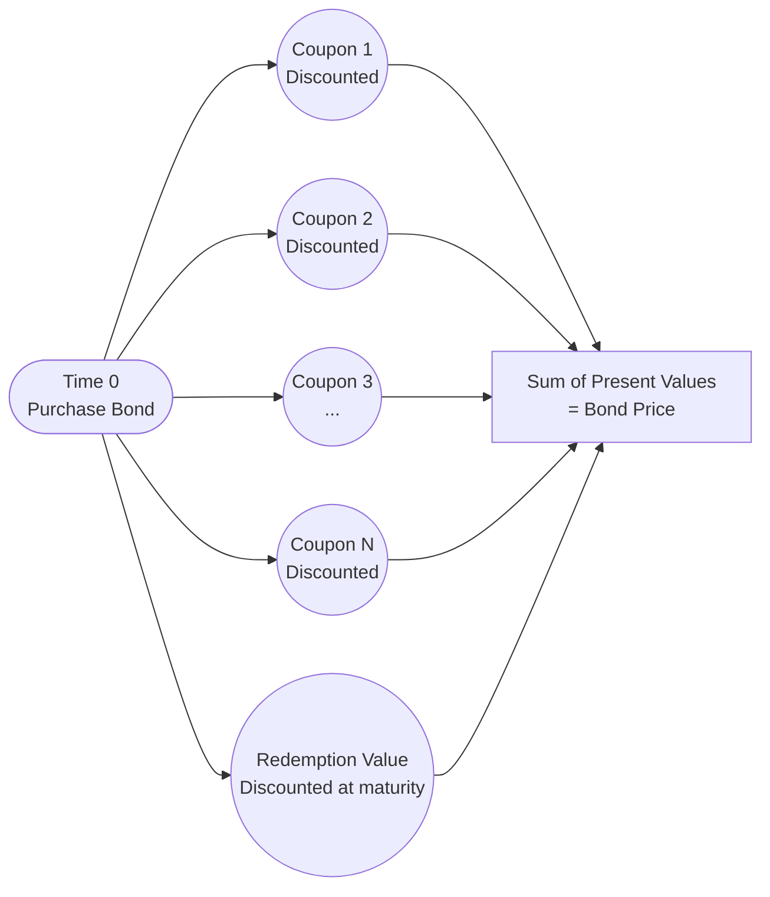

## 22.1 Bond Market Pricing

Bond market pricing is pivotal to wealth management strategies, particularly for advisors seeking to optimize client portfolios. Understanding how bonds are priced—and the various factors that can influence their value—enables financial professionals to offer tailored advice, comply with regulatory requirements, and help clients meet their wealth-building goals within the Canadian market. This section explores the core concepts of bond market pricing, discussing real-world examples, Canadian regulatory frameworks, and practical applications to ensure a well-rounded comprehension.

---

### Bonds as Debt Instruments

At its simplest, a bond is an IOU. An investor (the bondholder) effectively loans money to an issuer—such as a government, corporation, or other entity—for a set time (the bond’s term). In return, the issuer promises to:

• Pay interest (the coupon) at predetermined intervals (e.g., semi-annually).  
• Repay the face value (principal) at maturity.

Canadian government bonds often come in nominal increments of $1,000 or $5,000, whereas corporate bonds may vary, though $1,000 increments are still quite common. Key takeaways:

1. Bonds generate fixed (or semi-fixed) income streams that are particularly appealing to conservative or income-oriented investors.  
2. The issuer’s credit risk significantly influences the bond’s yield; higher perceived default risk typically translates into higher yield expectations.

---

### Price Quotations

Bond prices are conventionally quoted as a percentage of their face (par) value:

• For instance, a bond quoted at 98.50 means 98.50% of its par value. If the par value is $1,000, the bond’s quoted price is $985.00.  
• In Canada, Government of Canada bonds are often quoted in decimals (e.g., 99.25 = $992.50 per $1,000 face value).  

Knowing how to interpret these price quotations is critical for precisely valuing positions and understanding potential capital gains or losses when buying or selling bonds before maturity.

---

### Clean Price vs. Dirty Price

Two pricing conventions are widely used in bond markets:

1. **Clean Price:**  
   - Excludes accrued interest.  
   - Typically reported in financial media and price quotations.

2. **Dirty Price (Full Price):**  
   - Includes accrued interest from the last coupon payment date to (but not including) the settlement date.  
   - Represents the actual amount the buyer pays upon settlement.

When evaluating potential purchases or sales on behalf of a client, advisors should recognize that the transaction’s final cost will reflect the dirty price. While the clean price often appears in quotes, the dirty price is the true cash outflow (or inflow, if selling).

---

### Accrued Interest

Accrued interest represents the portion of interest the bond has earned since its most recent coupon payment. The buyer compensates the seller for this fraction of the upcoming coupon. The standard formula in Canada for accrued interest on a semi-annual coupon is:


\text{Accrued Interest} 
= \left( \frac{\text{Coupon Rate} \times \text{Face Value}}{\text{Number of Coupon Periods per Year}} \right) 
\times \frac{\text{Days Since Last Coupon}}{\text{Days in Coupon Period}}


• **Example:**  
  Suppose a corporate bond has a 6% annual coupon (paid semi-annually), $1,000 face value, and 183 days in each coupon period. If 61 days have passed since the last coupon date, the accrued interest would be calculated as follows:

  1. Semi-annual coupon = 6% / 2 = 3% of $1,000 = $30 per coupon.  
  2. Accrued interest = $30 × (61 / 183) = $10.00 approximately.

Whichever party is buying the bond needs to pay the seller $10 in accrued interest on top of the clean price. The dirty price would then be the clean price plus this accrued interest.

---

### Yield Measures

Bond yield can be expressed through several measurements. Each measure provides a slightly different perspective on the return:

1. **Coupon Rate:**  
   The annual interest rate, calculated on the bond’s face value. For a $1,000 face value bond with a 5% coupon, coupon payments total $50 per year.

2. **Current Yield:**  
   Current yield focuses on the bond’s market price. If the bond is trading at $900, its current yield is $50 ÷ $900 ≈ 5.56%.  

3. **Yield to Maturity (YTM):**  
   Arguably the most comprehensive yield measure, YTM accounts for:  
   - All coupon payments until maturity.  
   - The bond’s redemption value (par value) at maturity.  
   - The reinvestment of coupons at the same yield.  
   - Any capital gains or losses if you hold the bond until it matures.  

   YTM requires more complex calculations (often done with financial calculators or software tools such as QuantLib). YTM is especially important for financial planners, as it provides an annualized rate of return that captures all anticipated cash flows.  

4. **Yield to Call (YTC):**  
   Applicable if the bond has a call feature granting the issuer the right to redeem the bond before maturity. YTC helps assess the return if the issuer exercises the call. If interest rates drop significantly, issuers may call existing bonds to reissue debt at lower rates, thereby affecting an investor’s potential returns.

---

### Bond Pricing Formula (Present Value of Future Cash Flows)

The fundamental principle of bond pricing is **discounting future cash flows** (coupon payments and the redemption value) back to the present at an appropriate **discount rate**—often the prevailing yield or required rate of return for similar bonds.

The **generic formula** for a plain-vanilla coupon bond is:


\text{Price} 
= \sum_{n=1}^{N} \frac{\text{Coupon Payment}}{(1 + r)^n} 
+ \frac{\text{Redemption Value}}{(1 + r)^N}


where:  
• \\( r \\) is the required yield (discount rate) per coupon period (e.g., for semi-annual coupons, \\( r \\) is half the annual required yield if we assume simple division).  
• \\( n \\) is each coupon payment period from 1 to \\( N \\).  
• \\( N \\) is the total number of coupon payments to maturity.

#### Practical Example

Let’s consider a Government of Canada bond:

- Face Value = \$1,000  
- Annual Coupon = 6% (paid semi-annually at 3% each period)  
- 5 years until maturity (10 semi-annual periods)  
- Required Yield (semi-annually) = 2.5% per period (5% annual if simply divided)  

Using the above formula, you would discount each \$30 coupon payment for each of the 10 periods and add the discounted \$1,000 redemption at the final period. This calculation can be done quickly with a financial calculator or spreadsheet, employing the “Present Value of an Annuity + Present Value of a Lump Sum” framework:

1. PV of Annuity (coupons) = 30 × [1 − (1 + 0.025)^(-10)] / 0.025  
2. PV of Lump Sum (principal) = 1,000 × (1 + 0.025)^(-10)  

Add these two components to get the bond’s fair price.  

Below is a helpful visualization of the cash flow timeline and how discounting applies:

---

### Influencing Factors on Bond Pricing

Bond prices can fluctuate based on several variables:

1. **Interest Rates (Market Yields):**  
   The relationship between interest rates and bond prices is inverse: if rates go up, the present value of the bond’s fixed coupons decreases, causing bond prices to drop.

2. **Credit (Default) Risk:**  
   If a bond’s credit profile worsens, investors demand higher yields, forcing prices to decline. For instance, a downgrade by a rating agency for a corporate issuer generally leads to lower bond prices.

3. **Term to Maturity:**  
   Typically, longer-term bonds exhibit greater interest rate sensitivity. This is due to the extended duration over which coupon payments are exposed to fluctuating market rates.

4. **Market Liquidity:**  
   Highly liquid bonds, such as those issued by the federal government, often trade at tighter spreads and thus can maintain more stable pricing. Less liquid, thinly traded corporate bonds might see sharper price moves.

5. **Special Provisions (Callable, Putable, Convertible):**  
   - A **callable** bond may be redeemed by the issuer before maturity—often if interest rates fall.  
   - A **putable** bond allows the holder to sell (or “put”) the bond back to the issuer under certain conditions.  
   - A **convertible** bond lets the holder convert the bond into a predetermined number of the issuer’s shares.

Each of these features can significantly alter the bond’s risk-return profile, and hence its pricing.

---

### Practical Considerations for Advisors

Financial planners evaluating bonds for client portfolios should weigh multiple aspects:

• **Discount, Par, and Premium Bonds:**  
  - **Discount bond**: Market price < face value.  
  - **Par bond**: Market price ≈ face value.  
  - **Premium bond**: Market price > face value.  

  Understanding why a bond trades at a discount (usually higher yields demanded by market) or premium (usually lower yields, or high coupon relative to current rates) is essential for matching client income needs and market expectations.

• **Impact of Accrued Interest:**  
  Always clarify to clients that the settlement amount includes accrued interest, which might surprise those thinking only in terms of the quoted (clean) price.

• **Comparing Yield to Maturity (YTM):**  
  Among bonds with similar credit risk, maturity, and other characteristics, YTM comparisons help highlight more attractive opportunities.

• **Client Objectives and Risk Profiles:**  
  - Retirees or those seeking stable income may favor shorter maturities or less volatile bonds.  
  - Higher-risk tolerance investors might use a barbell strategy (mix of short and long maturities) to manage interest rate risk.

---

### Glossary

• **Face Value (Par Value):** The amount repaid at maturity (commonly \$1,000 in Canada).  
• **Accrued Interest:** Interest earned since the last coupon that is owed to the holder if a bond is sold before the next coupon date.  
• **Clean Price:** The bond’s market price excluding accrued interest.  
• **Dirty Price (Full Price):** The actual transaction price, which is the clean price plus accrued interest.  
• **Yield to Maturity (YTM):** The internal rate of return on a bond if held to maturity, including all coupons and principal repayment.

---

### Useful References and Additional Resources

• **Canadian Investment Regulatory Organization (CIRO):**  
  Ensures compliance with know-your-client (KYC) rules and suitability requirements when recommending fixed-income products.  
  (https://www.cirolr.org/)

• **Bank of Canada (www.bankofcanada.ca):**  
  - Publishes Canada’s yield curve data, interest rate announcements, and market analysis.  
  - Offers important insights for monitoring macroeconomic factors impacting bond prices.

• **QuantLib (www.quantlib.org):**  
  - An open-source C++ library for modeling and pricing a wide range of financial instruments, including bonds.  
  - Contains functions for yield curve construction and bond pricing.

• **Canadian Securities Administrators (https://www.securities-administrators.ca/):**  
  - Acts as an umbrella organization of Canada’s provincial and territorial securities regulators.  
  - Provides up-to-date disclosure requirements and guidelines relevant to bond issuances.

• **Recommended Reading:**  
  - “Bond Markets, Analysis, and Strategies” by Frank J. Fabozzi  
  - CSI’s WME Course companion modules on fixed-income investing.

---

### Summary

Bond market pricing is a cornerstone of fixed-income investing—a vital component of many wealth management strategies. By understanding how bond prices, yields, and accrued interest work, financial professionals can help investors balance risk and return, diversify portfolios, and pursue stable income. Market shifts, issuer credit performance, and special bond provisions all play crucial roles in determining prices.

Advisors should consistently monitor market rates and stay informed about regulatory changes to offer relevant, compliant guidance. In addition, modeling tools like QuantLib and official resources from the Bank of Canada and CIRO can help refine recommendations further. Mastery of bond pricing expands an advisor’s capabilities to create robust, client-centric strategies that stand the test of evolving economic conditions.

---

## Test Your Knowledge: Bond Pricing and Yields in Canada



### Which statement best describes a bond?  
- [x] It is a loan from the investor to the issuer.  
- [ ] It is a trading platform used by financial advisors.  
- [ ] It represents an ownership stake in a corporation.  
- [ ] It is a physical commodity traded on open markets.  

> **Explanation:** A bond is essentially a debt instrument in which the investor lends money to the issuer and in return receives coupon payments plus the principal redemption at maturity.

### Why is the “dirty price” usually higher than the “clean price” of a bond?  
- [x] It includes accrued interest.  
- [ ] It resets the coupon rate.  
- [ ] It factors in market speculation.  
- [ ] It recognizes the face value of the bond.  

> **Explanation:** The dirty price includes both the clean price and the accrued interest owed, making it the total price the buyer pays at settlement.

### A Government of Canada bond is quoted at 98.25 with a face value of $1,000. What is its quoted price in dollars?  
- [x] $982.50  
- [ ] $98.25  
- [ ] $825.00  
- [ ] $692.50  

> **Explanation:** A quote of 98.25 means 98.25% of par value, which equals $982.50 per $1,000 face amount.

### Which of the following yield measures provides the most comprehensive view of a bond’s potential return if held to maturity?  
- [x] Yield to Maturity (YTM)  
- [ ] Current Yield  
- [ ] Coupon Rate  
- [ ] Yield to Call  

> **Explanation:** YTM accounts for coupon payments, reinvestment, and capital gains (or losses) over the life of the bond until maturity.

### What does accrued interest represent with respect to a bond?  
- [x] The interest accumulated since the last coupon payment date.  
- [ ] The borrower's penalty for early redemption.  
- [ ] The difference between yield to call and yield to maturity.  
- [ ] The ongoing cost to the issuer for listing the bond.  

> **Explanation:** Accrued interest is the coupon interest earned by the current bondholder from the last coupon date until the time of sale.

### If interest rates suddenly rise, what is likely to happen to the prices of existing bonds?  
- [x] They decrease.  
- [ ] They increase.  
- [ ] They remain unchanged.  
- [ ] They become illiquid.  

> **Explanation:** When market interest rates rise, new bonds offer higher coupons, making existing bonds less attractive unless their prices decline.

### A bond with additional features allowing the issuer to redeem it before maturity is known as:  
- [x] Callable.  
- [ ] Putable.  
- [ ] Convertible.  
- [ ] Index-linked.  

> **Explanation:** A callable bond includes a provision that permits the issuer to retire the bond before its stated maturity date.

### Which factor generally makes a bond more sensitive to changes in interest rates?  
- [x] Longer term to maturity.  
- [ ] Higher credit rating.  
- [ ] Illiquid market conditions.  
- [ ] Frequent coupon payments.  

> **Explanation:** The longer the term to maturity, the greater the bond’s exposure to interest rate risk.

### For a 6% annual coupon bond (paid semi-annually) priced at $950, which yield measure below would be larger than the coupon rate?  
- [x] Current Yield  
- [ ] Yield to Maturity (YTM)  
- [ ] Yield to Call (YTC)  
- [ ] Coupon Rate  

> **Explanation:** Current yield (Annual Coupon / Market Price) is $60 / $950 ≈ 6.32%, which is already higher than the 6% coupon rate.

### The sum of a bond’s clean price and accrued interest equals its:  
- [x] Dirty Price  
- [ ] Face Value  
- [ ] Current Yield  
- [ ] Yield to Maturity  

> **Explanation:** The dirty (full) price is the total cash amount paid at settlement, comprising the clean price plus accrued interest.



---

## For Additional Practice and Deeper Preparation

**[1. WME Course For Financial Planners (WME-FP): Exam 1](https://www.udemy.com/course/csi-wme-fp-exam1/?referralCode=1A23C67E56971C0A73D5)**  
• Dive into 6 full-length mock exams—1,500 questions in total—expertly matching the scope of WME-FP Exam 1.  
• Experience scenario-driven case questions and in-depth solutions, surpassing standard references.  
• Build confidence with step-by-step explanations designed to sharpen exam-day strategies.

**[2. WME Course For Financial Planners (WME-FP): Exam 2](https://www.udemy.com/course/csi-wme-fp-exam2/?referralCode=25879CCDED7B7905BBA8)**  
• Tackle 1,500 advanced questions spread across 6 rigorous mock exams (250 questions each).  
• Gain real-world insight with practical tips and detailed rationales that clarify tricky concepts.  
• Stay aligned with CIRO guidelines and CSI’s exam structure—this is a resource intentionally more challenging than the real exam to bolster your preparedness.

> Note: While these courses are specifically crafted to align with the WME-FP exam outlines, they are independently developed and not endorsed by CSI or CIRO.
