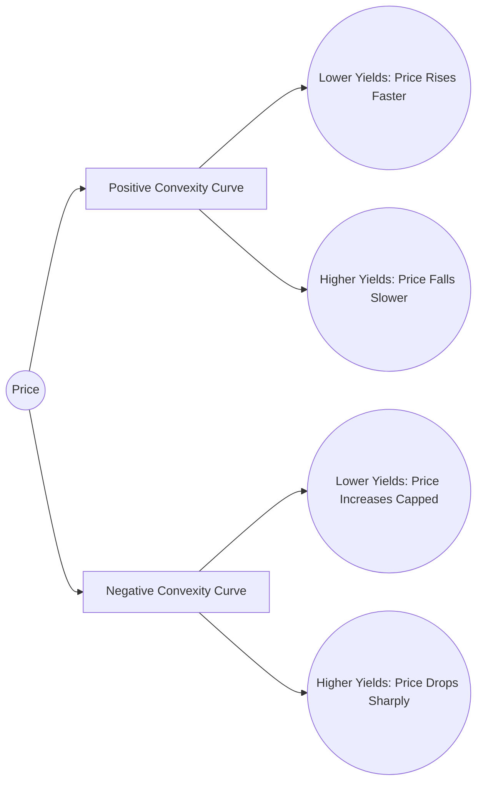

## 22.2 Bond Price Volatility

Bond price volatility is a fundamental concept in fixed-income investing, directly affecting portfolio values and client strategies. For financial planners in Canada, understanding the factors driving bond price changes and how to measure and manage this volatility is crucial to delivering sound advice. 

This section examines the core contributors to bond price volatility, including interest rate risk, duration, and convexity. We then explore specific factors such as embedded options, yield curve shifts, and market liquidity. Finally, we discuss practical applications for advisors working in the Canadian market, highlighting strategies, tools, and best practices for managing and mitigating bond price volatility on behalf of clients.

---

## Interest Rate Risk

Interest rate risk is often considered the dominant contributor to bond price movements. The principle is straightforward: bond prices move inversely to changes in market interest rates.

• When interest rates rise, existing bonds become less attractive because their coupon payments are lower than the new prevailing rates, causing bond prices to drop.  
• When interest rates fall, existing bonds become more attractive (they pay higher coupons relative to new bonds), driving bond prices up.

### Why Long-Term Bonds Are More Volatile

The length of time (i.e., term to maturity) amplifies this inverse relationship. Longer-term bonds lock in a given interest rate for many years, making them more sensitive when market rates change:

• Longer time horizon to maturity = More cumulative discounting effect from the changes in market rates.  
• Therefore, if a bond has 20 years to maturity, a slight move in interest rates can have a pronounced effect compared to a 2-year bond.

A Canadian example could be comparing a Government of Canada 2-Year bond with a Government of Canada 30-Year bond. Historically, the 30-Year bond shows significantly larger price swings in response to the same shift in yield because of its extended exposure to changes in interest rates.

---

## Duration: The Key Measure of Sensitivity

Duration is the most commonly used measure to gauge a bond’s sensitivity to changes in interest rates. In Canada, institutions such as RBC or TD often analyze bond portfolios using duration metrics to protect themselves from adverse rate movements.

### Macaulay Duration

• Macaulay Duration is the weighted average time (in years) an investor must wait to receive all cash flows (coupon payments and principal).  
• It is called “weighted” because each payment is weighted by its proportion of the bond’s total present value.

### Modified Duration

• Modified Duration builds on Macaulay Duration by adjusting for the yield level, providing an estimate of how much a bond’s price will change for a 1% (or 100-basis-point) change in interest rates.  
• For a bond with a Modified Duration of 5.0, if yields rise by 1%, the bond’s price is estimated to decline by approximately 5%. Conversely, if yields fall by 1%, the bond’s price will rise by roughly 5%, barring any convexity effects.

### Duration Formula (High-Level)

If D is Macaulay Duration, then:

Modified Duration ≈ D / (1 + (YTM / k))  

where:  
• YTM = Yield to Maturity  
• k = Number of coupon periods per year  

This formula highlights how the bond’s coupon structure, yield levels, and time to maturity together determine interest-rate sensitivity.

### Practical Example

Imagine a newly issued 5-year corporate bond with a coupon rate of 4%. Suppose the bond has a Macaulay Duration of 4.5 years. If the yield to maturity is 4% and the bond pays coupons semi-annually (k=2):

Modified Duration ≈ 4.5 / (1 + (0.04/2)) = 4.5 / (1 + 0.02) = 4.5 / 1.02 ≈ 4.41

If the market yield spikes to 5% (a 1% increase), the bond’s price could be expected to fall by approximately 4.41%. This simplified calculation illustrates how duration helps estimate price changes.

---

## Convexity: Measuring the Curvature

Duration is a linear approximation of price changes in response to yield shifts, but bond price changes follow a curved path. Enter convexity, a measure that refines duration by indicating how duration itself changes as interest rates change.

### Positive Convexity

Most traditional bonds exhibit positive convexity:

• As yields fall, the increase in price accelerates because each incremental drop in yields has a compounding effect.  
• As yields rise, the decrease in price is somewhat mitigated.

### Negative Convexity

Certain fixed-income instruments, such as callable bonds or mortgage-backed securities, can exhibit negative convexity in certain yield environments:

• Callable Bonds: When interest rates drop significantly, the issuer may “call” (redeem) the bond early to reissue at a lower interest cost. This potential redemption caps the bond’s price appreciation.  
• Mortgage-Backed Securities: Homeowners may refinance mortgages when rates drop, effectively “calling” part of the cash flow.

### Visualizing Convexity

Below is a simplified Mermaid diagram illustrating the price-yield relationship for a bond with positive convexity versus one with negative convexity:

In this diagram:  
- Positive Convexity (B path) shows a steeper slope when yields decrease, indicating more price gain, and a gentler slope when yields increase.  
- Negative Convexity (C path) shows a limitation on potential price increases and potentially more sensitivity to rising yields.

---

## Embedded Options and Volatility

Embedded options introduce additional complexity to bond price volatility.

### Callable Bonds

• A callable bond contains a provision allowing the issuer to repay the principal before the stated maturity.  
• This option is generally exercised when interest rates have declined, so the bond’s price gain is capped.  
• Callable bonds often sell at higher yields to compensate investors for the issuer’s call privilege.

### Putable Bonds

• A putable bond offers the investor the right to sell the bond back to the issuer at predetermined times and prices.  
• This right generally benefits investors when interest rates rise, as they can exit the bond at the put price.  
• Putable bonds often have lower yields due to the additional investor-friendly feature.

### Convertible Bonds

Convertible bonds can be traded in for a predetermined number of shares of the issuing company. As such, their price movement is driven by both:

• Interest Rate Risk: Typical of fixed-income instruments.  
• Equity Market Risk: If the issuer’s share price rises significantly, the bond price may move in line with equity markets.

This dual exposure can increase or decrease volatility relative to standard bonds, depending on prevailing market conditions.

---

## Yield Curve Shifts

The yield curve depicts the relationship between bond yields and maturities. Shifts in the yield curve can be parallel or non-parallel, each with different implications for bond prices.

### Parallel Shifts

• All maturities change by the same number of basis points (bps).  
• The impact on a portfolio is more predictable because durations across maturities tend to consistently adjust.

### Non-Parallel Shifts

• The short-term, mid-term, or long-term rates change by different amounts.  
• A “steepening” curve occurs if long-term rates rise more than short-term rates.  
• A “flattening” curve occurs if short-term rates rise or fall at a different pace than the long-term end.

In Canada, as observed through the Bank of Canada’s yield data, yield curve shifts can be influenced by economic indicators such as inflation, GDP growth, or monetary policy decisions.

---

## Market Liquidity and Volatility

Market liquidity refers to the ease with which a security can be bought or sold without causing a major price movement. In Canada’s corporate bond market, some issues are less liquid than Government of Canada bonds, meaning:

• Smaller or less frequent trades can lead to larger price swings.  
• Bid-ask spreads may widen during periods of market stress, amplifying volatility.

### Liquidity and Price Volatility

An illiquid bond can demonstrate heightened price volatility because limited buyers and sellers can deeply affect market prices. Advisors should pay close attention to a bond’s trading volumes, particularly for high-yield or lower-rated corporate issues, as well as municipal bonds that may have sporadic secondary-market activity.

---

## Practical Considerations for Advisors

As a financial planner or wealth manager, your role is to construct diversified portfolios that appropriately manage interest rate and other risks. Below are several practical steps:

1. **Duration Targeting:**  
   Determine a target duration based on your client’s risk tolerance, investment horizon, and income needs. Matching portfolio duration to the timeframe of goals can help mitigate interest rate risk.

2. **Convexity Management:**  
   Monitor convexity, especially when adding callable or mortgage-backed securities. Understand how negative convexity can limit upside and increase downside.

3. **Bond Laddering Strategies:**  
   Build a “bond ladder” with staggered maturities so that a portion of the portfolio matures every year or two. This naturally mitigates interest rate risk and market timing concerns.

4. **Option-Adjusted Spread (OAS) Analysis:**  
   For bonds with embedded options, consider using OAS analysis to isolate the bond’s yield relative to a benchmark, removing the effect of the option.

5. **Yield Curve Positioning:**  
   Evaluate short-end vs. long-end exposures based on yield curve outlook. Consider a barbell or bullet strategy in response to anticipated yield curve twists.

6. **Monitor Economic Indicators:**  
   Stay abreast of macroeconomic data, such as inflation and central bank announcements from the Bank of Canada. These indicators directly influence interest rate expectations.

7. **Regulatory and Tax Considerations:**  
   • CIRO Guidelines: Comply with relevant regulations, ensuring all fixed income recommendations align with suitabilty requirements and proper risk disclosures.  
   • Tax Implications: Incorporate the impact of interest income tax treatment and capital gains into portfolio decisions.

---

## Glossary

• **Interest Rate Risk:** Sensitivity of a bond’s price to changes in interest rates.  
• **Duration:** A measure of the weighted average time to receive bond payments, indicating sensitivity to rate changes.  
• **Convexity:** A measure of how much a bond’s duration changes when yields change, reflecting the curvature in the price-yield relationship.  
• **Parallel Yield Curve Shift:** A situation where yields of all maturities change by the same absolute amount.  
• **Embedded Option:** A contract provision within a bond that grants rights to either the issuer or the investor (e.g., call feature, put feature).

---

## Additional Resources

Below are valuable tools and references that financial advisors in Canada can leverage for deeper insights into bond pricing and volatility:

1. **CIRO (Canadian Investment Regulatory Organization):**  
   Visit [www.ciro.ca](https://www.ciro.ca) for guidelines and best practices on bond trading compliance, client suitability, and risk disclosure.

2. **Bank of Canada:**  
   Access historical yield curve data, bond auction schedules, and macroeconomic insights at [www.bankofcanada.ca](https://www.bankofcanada.ca).

3. **“Fixed Income Analysis” by the CFA Institute:**  
   A comprehensive guide covering interest rate risk, yield curve analysis, duration, and convexity.

4. **FRED Database (Federal Reserve Bank of St. Louis):**  
   Although U.S.-focused, [FRED](https://fred.stlouisfed.org/) offers historical data that can help Canadian investors compare global bond market trends.

5. **Bloomberg and Reuters:**  
   Widely used platforms among Canadian financial institutions, providing real-time bond pricing, market analytics, and advanced charting tools.

---

## Summary of Key Points

• A change in interest rates inversely affects bond prices, with longer-term bonds being more volatile.  
• Duration (both Macaulay and Modified) is a cornerstone measure of interest rate risk.  
• Convexity refines duration, capturing the curvature of the bond’s price-yield relationship.  
• Embedded options (callable, putable, convertible) can significantly alter a bond’s volatility profile.  
• Yield curve shifts—parallel or non-parallel—affect bond portfolios differently.  
• Market liquidity is an important consideration: lower liquidity can lead to pronounced price fluctuations.  
• Advisors should employ duration and convexity management, bond laddering, and yield curve strategies while adhering to CIRO guidelines and regulatory obligations in Canada.

By combining these concepts and tools in a disciplined manner, financial planners can help clients balance portfolio returns with appropriate risk levels in a changing rate environment.

---

## Mastering Bond Price Volatility: Expert-Level Quiz



### What is the primary reason long-term bonds are generally more volatile than short-term bonds?

- [x] Longer exposure to changing discount rates over time
- [ ] Higher coupon rates
- [ ] Lower credit risks
- [ ] Regulatory barriers

> **Explanation:** Long-term bonds are exposed to potential changes in interest rates for a greater period. The present value of far-future cash flows is more sensitive to rate fluctuations, which magnifies volatility.

### Which duration measure helps estimate the approximate percentage change in a bond’s price given a 1% change in yields?

- [ ] Macaulay Duration
- [x] Modified Duration
- [ ] Effective Duration
- [ ] Cash Flow Duration

> **Explanation:** Modified Duration adjusts Macaulay Duration for the yield level and coupon frequency, making it a practical tool for estimating percentage price changes when interest rates move by 1%.

### Which of the following best describes convexity?

- [x] It measures the rate at which a bond’s duration changes in response to yield changes.
- [ ] It measures the time to maturity.
- [ ] It indicates the coupon rate for the bond.
- [ ] It determines the credit quality of the issuer.

> **Explanation:** Convexity refines duration estimates by indicating how a bond’s sensitivity to interest rate changes (duration) itself varies as yields change.

### What is a typical characteristic of a bond exhibiting negative convexity?

- [x] Prices rise slower when yields decrease.
- [ ] Prices rise faster when yields decrease.
- [ ] Coupon payments increase when yields increase.
- [ ] Maturity lengthens as yields decrease.

> **Explanation:** Negative convexity is often seen in callable or mortgage-backed securities, which limit upside price appreciation when yields fall because they can be called or prepaid early.

### What does a “parallel shift” in the yield curve imply?

- [x] All maturities’ yields change by the same amount.
- [ ] Only short-term yields change, with no effect on mid- or long-term maturities.
- [x] Long-term yields change independently of short-term yields.
- [ ] The yield curve inverts immediately.

> **Explanation:** A parallel shift means that yields across all maturities of the curve move by the same number of basis points, maintaining the same curve shape.

### Which event often triggers the call feature on a callable bond?

- [x] A decline in market interest rates
- [ ] A credit upgrade of the issuer
- [ ] An increase in the bond’s coupon rate
- [ ] A steepening of the yield curve

> **Explanation:** When market interest rates drop, issuers benefit from calling the existing bond and refinancing at a lower rate, capping the bond’s price appreciation.

### How does an embedded put option on a bond affect its volatility from the investor’s perspective?

- [x] It reduces downside risk by allowing the investor to sell back at predetermined terms.
- [ ] It increases downside risk by forcing the investor to keep the bond longer.
- [x] It eliminates interest rate risk entirely.
- [ ] It typically leads to negative convexity in all scenarios.

> **Explanation:** A put feature provides the investor with the right to sell the bond back to the issuer, thereby reducing downside price risk if rates rise or credit quality deteriorates.

### Which of the following describes how liquidity can impact bond price volatility?

- [x] Low liquidity can magnify price changes even on small trade volumes.
- [ ] High liquidity typically leads to excessive price volatility.
- [ ] Liquidity is irrelevant to bond price changes.
- [ ] Liquidity primarily affects equity securities, not bonds.

> **Explanation:** In illiquid markets, limited transactions can have outsized effects on the bond’s market price or yield, making it more volatile.

### Which strategy can help mitigate interest rate risk in a fixed-income portfolio?

- [x] Bond laddering
- [ ] Concentrating on a single maturity
- [ ] Ignoring macroeconomic indicators
- [ ] Investing only in equities

> **Explanation:** Bond laddering spreads out maturities, reducing the sensitivity to any single interest rate environment.

### True or False: Duration alone is sufficient to capture all aspects of bond price volatility.

- [x] True
- [ ] False

> **Explanation:** This question is slightly tricky. In strict terms, duration by itself is not entirely sufficient because it doesn’t account for convexity. However, many market participants rely primarily on duration as a first measure of sensitivity. For more accuracy, especially in larger yield movements or for bonds with embedded options, convexity (and other advanced measures) is crucial. Depending on the viewpoint, some practitioners accept duration-based estimates for relatively small changes. Strictly from a theoretical perspective, the statement would be false. Yet if one follows typical exam or standard practice, they may see “True” as oversimplifying. In an exam context, many standard references highlight that “duration does not capture convexity,” so the more precise answer is “False.”  

  
> Because of the nuanced interpretation of the question in strict theoretical terms, if you are preparing for an exam, consider that most textbooks emphasize duration alone is not sufficient; convexity is also needed. Hence, the widely accepted response is “False.”  
>
> However, if we strictly interpret the statement “Duration alone is sufficient to capture all aspects of bond price volatility,” the practicum answer is indeed “False.”  



---

## For Additional Practice and Deeper Preparation

**[1. WME Course For Financial Planners (WME-FP): Exam 1](https://www.udemy.com/course/csi-wme-fp-exam1/?referralCode=1A23C67E56971C0A73D5)**  
• Dive into 6 full-length mock exams—1,500 questions in total—expertly matching the scope of WME-FP Exam 1.  
• Experience scenario-driven case questions and in-depth solutions, surpassing standard references.  
• Build confidence with step-by-step explanations designed to sharpen exam-day strategies.

**[2. WME Course For Financial Planners (WME-FP): Exam 2](https://www.udemy.com/course/csi-wme-fp-exam2/?referralCode=25879CCDED7B7905BBA8)**  
• Tackle 1,500 advanced questions spread across 6 rigorous mock exams (250 questions each).  
• Gain real-world insight with practical tips and detailed rationales that clarify tricky concepts.  
• Stay aligned with CIRO guidelines and CSI’s exam structure—this is a resource intentionally more challenging than the real exam to bolster your preparedness.

> Note: While these courses are specifically crafted to align with the WME-FP exam outlines, they are independently developed and not endorsed by CSI or CIRO.
