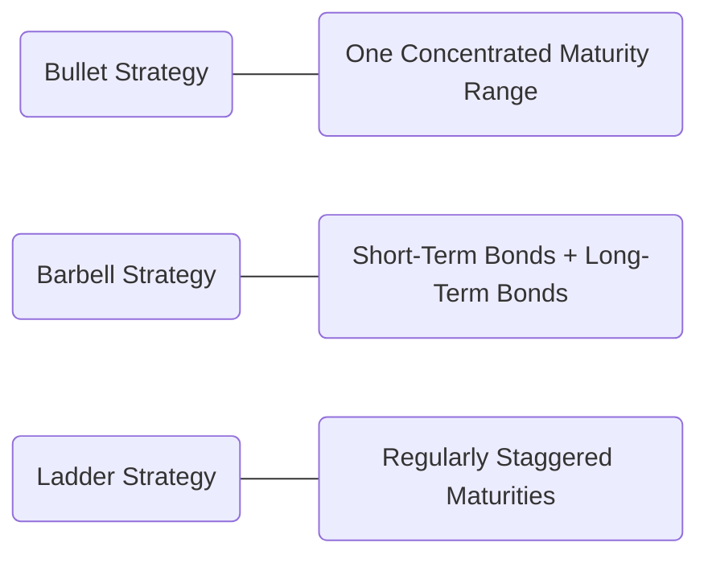

## 22.3 Debt Security Strategies

Bond investing remains a cornerstone of many portfolios, especially for investors seeking steady income and capital preservation. In Canada, fixed-income instruments range from Government of Canada bonds to corporate and provincial debt. Designing strategies around these instruments involves balancing interest rate risk, credit risk, portfolio duration, and client objectives.

In this section, we evaluate both passive and active bond trading strategies, highlight immunization techniques utilized by pension funds and insurers, and offer practical guidance for Canadian financial advisors creating tailored solutions for their clients’ fixed-income portfolios.

---

## Passive Bond Strategies

Passive strategies emphasize lower turnover, aiming to capture broad market returns. These approaches generally have lower transaction costs and rely on the conviction that it is difficult to consistently outperform a market index after fees and trading costs.

### Buy-and-Hold Strategy
• Investors hold bonds until maturity, collecting coupon payments.  
• Minimizes transaction costs and reduces the influence of market sentiment on investment decisions.  
• Avoids frequent rebalancing but may not exploit market opportunities (e.g., rising yields that permit reinvestment at higher rates).

◈ Case Example  
A retiree invests in a ladder of high-quality provincial bonds, each maturing in different years. Their primary objective is to secure predictable coupon income for the duration of their retirement, ignoring short-term price fluctuations. This buy-and-hold strategy ensures they capture the yield they locked in at purchase, mitigating market timing risks.

### Indexing
• Replicate the holdings of a targeted bond index, such as the FTSE Canada Universe Bond Index.  
• Reduces tracking error, approximates market returns, and typically offers lower management costs compared to active strategies.  
• Ideal for those wishing to gain exposure to broad segments of the Canadian bond market without incurring the time and expense of security selection.

◈ Case Example  
A wealth management firm replicates the FTSE Canada Universe Bond Index for clients who desire market-level performance. The firm purchases Government of Canada bonds, provincial bonds, and investment-grade corporate bonds in proportions similar to the index. The goal is to closely track the index yield and duration while minimizing deviations.

---

## Active Bond Strategies

Active bond managers seek to outperform benchmarks by adjusting portfolio structure based on interest rate forecasts, credit analysis, or sector rotation. This typically involves higher research costs and trading frequency.

### Interest Rate Anticipation (Riding the Yield Curve)
• Adjust portfolio duration in anticipation of interest rate movements.  
• If rates are expected to fall, increasing duration may maximize capital gains. Conversely, if rates are expected to rise, a shorter duration reduces price volatility.  
• Requires careful monitoring of economic data (inflation indicators, GDP growth reports, Bank of Canada policy statements).

◈ Canadian Pension Fund Example  
A large Canadian pension fund expects the Bank of Canada to lower interest rates in response to slowing economic growth. In response, the fund strategically purchases long-term Government of Canada bonds, aiming to benefit from price appreciation when rates drop.

### Yield Curve Strategies: Bullet, Barbell, and Laddered
The shape of the yield curve can significantly influence bond strategy. Three common yield curve positioning approaches are:

1. **Bullet**  
   - Concentrates bond maturities around a specific time horizon, often aligned with a known liability or target date (e.g., a pension plan’s significant payout period).  
   - Can deliver strong returns if the yield curve remains stable or if interest rates drop in the targeted maturity range, but lacks diversification across maturities.

2. **Barbell**  
   - Allocates capital at the short- and long-term ends of the curve, skipping the mid-term.  
   - Designed to capitalize on a flattening yield curve or to remain flexible when interest rates move unpredictably.  
   - A common choice for advisors expecting short-term rates to shift differently than long-term rates.

3. **Laddered**  
   - Spreads maturities evenly across regular intervals (e.g., 1-year, 2-year, 3-year, and so on).  
   - Balances reinvestment risk and interest rate risk by continuously reinvesting proceeds from maturing bonds.  
   - Often favored by Canadian retirees seeking consistent cash flow and a steady rolling of bonds into newer issues.

Below is a simplified diagram illustrating the difference among the three yield curve strategies:

### Bond Swaps
A bond swap involves simultaneously selling one bond and purchasing another with the objective of improving the portfolio, whether through yield enhancement, credit quality improvements, or tax benefits. Common types include:

• **Yield Pickup Swap**: Exchanging a lower-yield bond for a higher-yield alternative of similar maturity and credit quality.  
• **Credit Swap**: Substituting one issuer’s bond for another with a better credit profile.  
• **Call-Provision Swap**: Replacing a callable bond with a non-callable (or less risky) bond to avoid potential call risk.  
• **Tax-Loss Harvesting Swap**: Selling a bond at a loss to offset gains in other parts of the portfolio and reinvesting proceeds in a similar bond.

◈ Tax-Loss Harvesting Example  
An investor holds a mid-range corporate bond that has declined in price. Wanting to realize a capital loss to offset gains from equities, the investor sells and buys a highly similar bond (comparable credit quality and maturity), thereby reducing tax liability without changing the portfolio’s overall yield or risk substantially.

---

## Credit Analysis and Sector Rotation

Active bond managers also try to outperform by carefully assessing credit risk and rotating among different sectors (e.g., corporate debt, government debt, high-yield bonds) based on market conditions and economic cycles:

• **Credit Analysis**: Evaluate issuers’ financial strength, leverage ratios, and the likelihood of default. Rating agencies like DBRS Morningstar and Moody’s offer independent opinions on creditworthiness.  
• **Sector Rotation**: Move from lower-yielding, more secure bonds (e.g., federal government issues) to higher-yielding corporate or provincial bonds when the economy is stable or growing. Alternatively, rotate back to high-quality bonds in anticipation of an economic downturn.

◈ Sector Rotation Example  
An ETF manager invests more heavily in high-yield Canadian corporate bonds upon detecting positive trends in corporate earnings, increased consumer spending, and stable inflationary pressures. The strategy is reversed if economic indicators point to a recession.

---

## Immunization

Immunization is the process of matching your assets’ duration to your liabilities’ duration so that changes in interest rates have minimal net impact on portfolio value relative to obligations. This approach is common among insurance companies and pension funds, which have predictable future liabilities:

• **Liability-Driven Investing (LDI)**: Focuses on ensuring the portfolio meets future cash flow requirements.  
• **Duration Matching**: Aligns the weighted-average duration of the bond portfolio with that of the future liabilities. Thus, any rise in rates that reduces the present value of the assets also reduces the present value of the liabilities by a comparable amount.

Below is a simple illustration of how an institutional investor matches bond durations to liabilities:

Immunization provides stability but also involves reinvestment risks and requires frequent recalibration to maintain that matching.

---

## Practical Considerations for Advisors

To ensure successful fixed-income management, Canadian wealth advisors must consider:

1. **Client Time Horizon**  
   - Align maturities with major life events: retirement, education expenses, or other long-term goals.

2. **Risk Tolerance**  
   - Evaluate credit, liquidity, and market risks. Conservative clients typically prefer higher-quality government or provincial bonds; those seeking higher yield might consider corporate or emerging market debt.

3. **Regulatory Compliance**  
   - Adhere to CIRO guidelines around suitability and disclosure. Advisors should clearly communicate bond characteristics (credit risk, maturity, call features) and the rationale behind recommended strategies.

4. **Economic Monitoring**  
   - Stay up-to-date on interest rate forecasts, inflation trends, and macroeconomic announcements, including the Bank of Canada rate decisions and announcements from the Department of Finance Canada.

5. **Potential Costs**  
   - Factor in transaction costs, management fees, and potential tax implications, especially for active strategies involving higher trading frequencies.

---

## Glossary

• **Buy-and-Hold**  
Maintaining an investment in bonds until maturity to avoid frequent trading.

• **Indexing**  
Mirroring a bond index to maintain close correlation to overall market performance.

• **Barbell Strategy**  
Splitting fixed-income investments between short-term and long-term maturities to mitigate interest rate risk.

• **Bond Swap**  
Replacing current bond holdings with new ones aiming to enhance yields, manage taxes, or improve credit quality.

• **Immunization**  
Balancing the duration of assets and liabilities so that the portfolio value remains stable despite rate changes.

---

## Additional Resources and References

• **CIRO Guidelines on Suitability and Disclosure**: Ensure your recommended strategies meet clients’ financial objectives, risk profiles, and regulatory requirements.  
• **Government of Canada’s Department of Finance Canada** (https://www.fin.gc.ca/) for fiscal updates, debt issuance schedules, and economic projections.  
• **Moody’s, DBRS Morningstar** for credit ratings and credit risk analysis of Canadian corporate, provincial, and municipal bonds.  
• **“Active Portfolio Management” by Grinold and Kahn** for advanced bond portfolio construction and risk management topics.  
• **Bank of Canada’s Bond Yield Calculator**: A user-friendly online tool to model bond returns with changing interest rates.  
• **Open-Source Libraries Like QuantLib**: For robust simulation of bond strategies, helping advisors refine scenario analysis for internal portfolio management processes.

---

## Quiz: Bond Strategies



### Which strategy involves holding bonds until maturity to collect coupon payments while minimizing transaction costs?

- [x] Buy-and-Hold
- [ ] Bond Swap
- [ ] Barbell
- [ ] Yield Curve Positioning

> **Explanation:** A Buy-and-Hold strategy keeps bonds until maturity, thereby locking in coupon payments and reducing trading expenses.

### When an advisor replicates the FTSE Canada Universe Bond Index to track overall market performance, this is referred to as:

- [ ] Buy-and-Hold
- [ ] Immunization
- [x] Indexing
- [ ] Barbell Strategy

> **Explanation:** Indexing strives to closely match a benchmark index by replicating its bond holdings.

### What is the primary downside of a Buy-and-Hold strategy?

- [x] Missing potential rebalancing opportunities
- [ ] Excessive tracking error
- [ ] Overexposure to short-term bonds
- [ ] High transaction costs

> **Explanation:** Although Buy-and-Hold strategies reduce costs, they may also miss tactical shifts in the yield curve that could improve returns.

### A portfolio strategy that allocates heavily to short and long maturities, intentionally skipping intermediate-term bonds, is known as a:

- [ ] Bullet Strategy
- [ ] Indexing
- [x] Barbell Strategy
- [ ] Ladder Strategy

> **Explanation:** A Barbell Strategy involves focusing on short and long maturities to manage interest rate exposure across two distinct segments of the yield curve.

### Which of the following statements about Interest Rate Anticipation (Riding the Yield Curve) is correct?

- [x] It involves adjusting portfolio duration based on expected interest rate movements.
- [ ] It focuses on buying bonds and holding to maturity without rebalancing.
- [ ] It spreads maturities evenly across intervals to reduce reinvestment risk.
- [ ] It includes substituting one bond for another to capture a capital loss for tax purposes.

> **Explanation:** Interest Rate Anticipation leverages economic and market forecasts to shorten or lengthen bond duration, depending on the anticipated direction of interest rates.

### Which of the following swaps is typically motivated by a desire to exit a bond with a callable feature in favour of a bond without this risk?

- [ ] Credit Swap
- [ ] Yield Pickup Swap
- [ ] Tax-Loss Harvesting Swap
- [x] Call-Provision Swap

> **Explanation:** A Call-Provision Swap replaces a callable bond with a non-callable or less risky alternative, mitigating call risk that could hurt returns.

### A strategy that concentrates bonds around a single maturity date or time horizon is referred to as:

- [ ] Barbell
- [ ] Ladder
- [ ] Swap
- [x] Bullet

> **Explanation:** A Bullet Strategy focuses maturities on one point in time, aligning with a major liability or investment goal.

### Matching the duration of assets with the duration of liabilities to minimize the impact of interest rate fluctuations is known as:

- [ ] Yield Curve Anticipation
- [ ] Indexing
- [ ] Barbell
- [x] Immunization

> **Explanation:** Immunization aims to ensure changes in interest rates have a relatively minimal effect on meeting future liabilities.

### Which is NOT a primary factor in Credit Analysis for Canadian bonds?

- [ ] Issuer’s leverage
- [ ] Economic outlook
- [ ] Default probability
- [x] Number of bond coupons per year

> **Explanation:** While the cash flow structure is relevant, the frequency of coupon payments is not a core component of issuer credit quality. Analysts focus on ability to repay, default risks, and macroeconomic factors.

### True or False: A Ladder Strategy spreads bond maturities evenly to balance reinvestment risk and interest rate risk.

- [x] True
- [ ] False

> **Explanation:** Laddering ensures that bonds mature periodically, enabling reinvestment at different times to smooth out interest rate volatility.



---

## For Additional Practice and Deeper Preparation

**[1. WME Course For Financial Planners (WME-FP): Exam 1](https://www.udemy.com/course/csi-wme-fp-exam1/?referralCode=1A23C67E56971C0A73D5)**  
• Dive into 6 full-length mock exams—1,500 questions in total—expertly matching the scope of WME-FP Exam 1.  
• Experience scenario-driven case questions and in-depth solutions, surpassing standard references.  
• Build confidence with step-by-step explanations designed to sharpen exam-day strategies.

**[2. WME Course For Financial Planners (WME-FP): Exam 2](https://www.udemy.com/course/csi-wme-fp-exam2/?referralCode=25879CCDED7B7905BBA8)**  
• Tackle 1,500 advanced questions spread across 6 rigorous mock exams (250 questions each).  
• Gain real-world insight with practical tips and detailed rationales that clarify tricky concepts.  
• Stay aligned with CIRO guidelines and CSI’s exam structure—this is a resource intentionally more challenging than the real exam to bolster your preparedness.

> Note: While these courses are specifically crafted to align with the WME-FP exam outlines, they are independently developed and not endorsed by CSI or CIRO.

---
