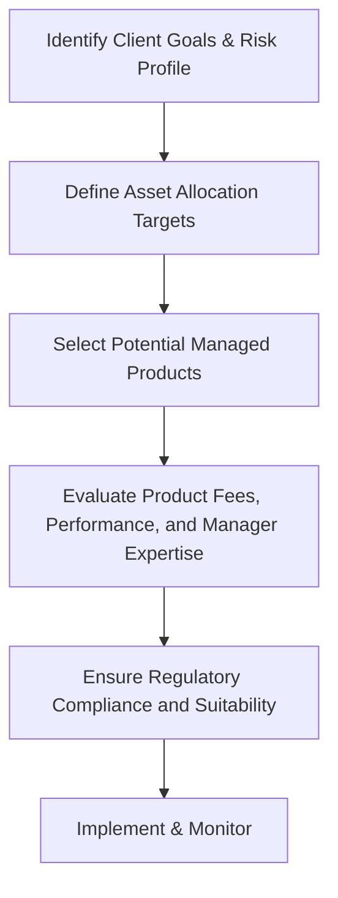

## 23.1 The Role of Managed Products in Investment Management

Managed products are professionally supervised investment vehicles that enable investors to access specialized strategies, broaden portfolio diversification, and benefit from continuous professional oversight. In Canada, common examples include mutual funds, exchange-traded funds (ETFs), wrap programs, and hedge funds. These products are often favoured by financial planners who wish to expose their clients to a variety of asset classes—from domestic equities and fixed-income securities to international markets or alternative strategies—while leveraging the expertise of professional portfolio managers.

In this section, we will explore the key features of managed products, how they fit within the broader context of wealth management in Canada, and the practical considerations financial advisors should keep in mind when including them in client portfolios.

---

## What Are Managed Products?

A managed product is an investment vehicle overseen by professional managers who employ specific strategies—such as value investing, growth strategies, or sector-based approaches—to achieve particular objectives. These strategies typically align with stated investment goals like capital appreciation, income generation, or a balance between the two. By pooling individual investor capital, managers gain economies of scale and greater flexibility in making asset allocation decisions.

### Benefits of Professional Oversight
• Ongoing Monitoring: Portfolio managers continuously assess market conditions, macroeconomic trends, and individual securities, making adjustments as needed.  
• Expertise and Research: Management teams often have significant resources, including research analysts, risk specialists, and market strategists.  
• Reduced Emotional Bias: By outsourcing asset allocation and security selection to professionals, investors are less likely to make emotional decisions during market fluctuations.

---

## The Canadian Regulatory Framework

Canada has a well-established regulatory environment governing managed products. Financial planners must be aware of these regulations and ensure compliance in their advisory practices.

### The Role of the Canadian Securities Administrators (CSA)
The Canadian Securities Administrators (CSA) is an umbrella organization comprising the securities regulators of each province and territory. Its mandate is to improve, coordinate, and harmonize regulation of Canada’s capital markets.

### Canadian Investment Regulatory Organization (CIRO)
CIRO is the pan-Canadian self-regulatory organization for the investment industry, consolidating the former IIROC (Investment Industry Regulatory Organization of Canada) and the former MFDA (Mutual Fund Dealers Association of Canada). CIRO sets and enforces standards for the conduct of member firms and registrants in securities trading, including guidelines for the sale and recommendation of managed products.

### National Instrument 81-102
National Instrument 81-102 sets out the operational rules and regulations for many common investment funds, especially mutual funds and certain ETFs. Key areas include permissible asset classes, liquidity requirements, borrowing limits, and disclosure obligations to protect investors. Before recommending a fund, advisors must review the fund’s compliance with NI 81-102, ensuring that any selected product aligns with their client’s financial profile and risk tolerance.

---

## Types of Managed Products

There are various categories of managed products, each presenting unique structures, strategies, and risk-return profiles.

### Mutual Funds
Mutual funds are among the most widely used managed products in Canada—offered by institutions like RBC, TD, and many insurance companies. They pool the capital of many investors to purchase a diverse range of securities. Mutual funds are attractive for:
• Diversification: Even small investments can be spread across numerous holdings.  
• Liquidity: Most mutual funds allow investors to buy or redeem units on any business day at their net asset value (NAV).  
• Accessibility: Low minimum investment requirements.

### Exchange-Traded Funds (ETFs)
ETFs have gained prominence in recent years due to their relatively low management expense ratios (MERs). ETFs, like mutual funds, pool assets and track broad or specialized market indexes, but they trade on stock exchanges throughout the day. They offer:
• Intraday Liquidity: Investors can buy or sell ETFs any time the market is open.  
• Transparency: Holdings are disclosed regularly, often daily.  
• Versatility: ETFs can target specific sectors, commodities, bonds, or global markets.

### Wrap Programs
Wrap programs bundle various investment services—such as asset allocation, manager selection, and performance reporting—into one comprehensive platform. They typically charge a single all-inclusive fee. This approach:
• Simplifies Fee Structures: Clients pay one fee covering advice, transactions, and administration.  
• Facilitates Centralized Management: Advisors can monitor and adjust multiple strategies within a single program.  
• Streamlines Portfolio Rebalancing: Wrap managers often implement systematic rebalancing strategies.

### Hedge Funds
Hedge funds are designed for sophisticated investors willing and able to tolerate greater risk. They might use leverage, short-selling, and other complex tactics. While some hedge funds can provide robust returns in various market environments, they:
• Are Less Liquid: Many hedge funds have lock-up periods restricting redemptions.  
• Are Highly Specialized: Strategies can be niche, requiring in-depth knowledge from both managers and investors.  
• Require Due Diligence: Not all hedge funds are subject to the same regulations as mutual funds; hence, thorough investigation is essential.

---

## Why Use Managed Products?

### Convenience and Accessibility
Professional oversight allows clients to delegate day-to-day investment decisions to experts. Complex market analysis, security selection, and portfolio rebalancing are handled by qualified managers. For instance, RBC Balanced Fund or TD Dividend Growth Fund each has a specialized team that conducts daily research and trading decisions—activities that would be challenging for an individual investor to replicate.

### Diversification
Holding a broad range of securities, sometimes spread across different asset classes or geographies, lowers the risk that any single underperforming security or sector will significantly impact the overall portfolio. Even advanced strategies, such as international equities or alternative assets, become more accessible through managed products.

### Professional Risk Management
Portfolio managers monitor a variety of risk factors, including interest rate risk, credit risk, currency risk, and market risk. By applying robust risk management frameworks, these managers can adjust the portfolio to maintain alignment with the stated investment objectives and the risk tolerance of the fund.  

### Potential for Cost Efficiencies  
Large institutional investment managers can benefit from economies of scale, obtaining better execution prices and negotiating lower costs with service providers. This advantage can positively impact the expense ratios and, ultimately, the net returns to investors.

---

## Key Considerations for Advisors

### Aligning Product Selection with Client Objectives
• Risk Tolerance: Consider the client’s comfort with volatility and temporary losses.  
• Time Horizon: Short-term or long-term goals influence the types of managed products suitable for their portfolio.  
• Liquidity Needs: Clients requiring ready access to their investment capital may prefer mutual funds or ETFs over hedge funds.  
• Portfolio Fit: Evaluate how the new investment complements or balances the overall portfolio.

### Fee Structures and Cost Transparency
Advisors must be transparent about management fees, loads, and other charges. While some products have higher fees than others, a higher fee could be justifiable if the product delivers above-average returns or offers specialized strategies that align with the client’s needs. Always present the “Fund Facts” or other mandated disclosures to clients.

### Regulatory Compliance and Disclosure
CIRO regulations emphasize suitability, know-your-client (KYC), and know-your-product (KYP) obligations. Ensure that each recommended product meets regulatory scrutiny and that you maintain proper documentation—especially regarding:
• KYC Documentation: Demonstrating that the product aligns with the client profile.  
• Offering Memoranda or Fund Facts: Required documents for mutual funds, ETFs, and certain alternative products.  
• Ongoing Disclosure: Advising clients of material changes in the product, such as changes in management or investment strategy.

### Performance Monitoring and Ongoing Reviews
• Performance Track Record: Evaluate both short-term and long-term results, comparing performance to relevant benchmarks.  
• Risk-Adjusted Returns: Check metrics like the Sharpe ratio or standard deviation, ensuring the manager is compensated adequately for the level of risk taken.  
• Consistency: Look for stable management teams and consistent investment approaches that align with the client’s stated goals.

---

## Practical Example: Using Managed Products for a Diversified Portfolio

Consider a hypothetical client, Avery, a 45-year-old professional with a moderate risk tolerance and a 20-year timeline until retirement. Avery wants exposure to multiple asset classes without the complexity of individually picking stocks or bonds.

1. Advisor meets Avery to evaluate financial goals.  
2. Advisor suggests a core allocation to a well-diversified Canadian mutual fund that invests in domestic equities, government bonds, and corporate bonds.  
3. To add international exposure, the advisor recommends a global equity ETF that invests in European and emerging market equities.  
4. A smaller portion is dedicated to a specialized managed alternative fund focusing on real estate and infrastructure for enhanced diversification.  
5. Ongoing reviews include quarterly check-ins where performance, fees, and alignment with Avery’s objectives are assessed and rebalanced if needed.

This example shows how an advisor may combine multiple managed products to create a comprehensive solution suited to a particular investor profile.

---

## Step-by-Step Guidance for Selecting Managed Products

To simplify the process of selecting appropriate managed products, consider the following workflow:

1. Identify Client Goals & Risk Profile: Clarify objectives (growth, income, or a balance) and gauge risk tolerance.  
2. Define Asset Allocation Targets: Decide on the target mix of equities, fixed-income, alternatives, or cash.  
3. Select Potential Managed Products: Shortlist mutual funds, ETFs, or hedge funds that meet style and asset class requirements.  
4. Evaluate Product Fees, Performance, and Manager Expertise: Compare MERs, track records, risk measures, and management team stability.  
5. Ensure Regulatory Compliance and Suitability: Document your KYC findings and ensure recommendations follow NI 81-102 or other applicable regulations.  
6. Implement & Monitor: Execute trades or subscriptions, followed by consistent performance reviews and rebalancing.

---

## Best Practices and Potential Pitfalls

### Best Practices
• Conduct Thorough Due Diligence: Scrutinize management style, track record, fee disclosures, and compliance with regulatory guidelines.  
• Document Everything: Maintain a paper trail of all client interactions, recommendations, and disclosures.  
• Stay Informed: Ongoing education about new securities regulations or product innovations helps you stay ahead of market changes.  
• Communicate Clearly: Explain the role and risks of each managed product in plain language to clients.

### Common Pitfalls
• Overconcentration: Relying too heavily on one fund or sector can expose the portfolio to substantial risk.  
• Inattention to Fees: Higher fees can erode returns, especially over the long term. Evaluate cost-versus-benefit.  
• Failure to Monitor: Even well-chosen products may underperform or shift strategies over time. Regular reviews are essential.  
• Insufficient Client Education: If investors do not understand the product, they may be more prone to panic-sell during market volatility.

---

## Relevant Resources for Canadian Financial Professionals

• Canadian Securities Administrators (CSA):  
  (https://www.securities-administrators.ca/)  
  Coordinates and harmonizes securities regulation across Canada.
  
• Canadian Investment Regulatory Organization (CIRO):  
  (https://www.ciro.ca/)  
  Oversees the self-regulatory framework for investment dealers and mutual fund dealers.

• National Instrument 81-102:  
  Governing the operation and distribution of mutual funds and certain other investment funds in Canada.

• “Modern Portfolio Theory and Investment Analysis” by Edwin J. Elton et al.:  
  A foundational text examining the theory of diversification, optimal asset allocation, and portfolio risk management.

• Free Online Tools for Fund Evaluation:  
  • Yahoo Finance: Comprehensive quotes, charts, and performance data.  
  • Morningstar: Offers detailed fund performance metrics and ratings.

---

## Conclusion

Incorporating managed products into an investment portfolio can offer significant advantages, including professional oversight, simplified diversification, and improved accessibility to otherwise complex markets. By choosing the right mix of mutual funds, ETFs, wrap programs, or hedge funds, financial planners can craft solutions that align with each client’s risk tolerance, objectives, and time horizon.

Advisors must remain vigilant about product selection and adhere to strict regulations from both the CSA and CIRO. Thorough due diligence of fund fees, performance, and management is crucial to maintaining a portfolio’s suitability and long-term success. Above all, consistent monitoring and clear client communication can help ensure that managed products continue to meet financial goals as market conditions evolve.

---

## Test Your Knowledge of Managed Products and Investment Management



### Which of the following is a regulatory body overseeing the investment industry in Canada?

- [ ] Morningstar
- [ ] RBC
- [x] Canadian Investment Regulatory Organization (CIRO)
- [ ] Canadian Imperial Bank of Commerce (CIBC)

> **Explanation:** CIRO is the self-regulatory organization that oversees both investment dealers and mutual fund dealers across Canada, ensuring industry standards and client protection measures are met.

### What is the primary purpose of National Instrument 81-102?

- [ ] To regulate investor tax rates
- [ ] To oversee banking transactions
- [ ] To manage insurance claims
- [x] To govern the operation and distribution of mutual funds and certain other investment funds in Canada

> **Explanation:** NI 81-102 outlines rules on redemption, disclosure, and investment practices, providing a framework to protect investors and standardize practices among Canadian investment funds.

### Which of the following is a key advantage of using a professionally managed product?

- [x] Access to professional oversight and research
- [ ] Guaranteed returns
- [ ] Elimination of all market risk
- [ ] Ability to avoid all fees

> **Explanation:** Although there are no guarantees for returns or freedom from market risk, managed products offer professional oversight, research capabilities, and potential economies of scale.

### A hedge fund is best described as:

- [x] A fund that uses more complex trading strategies, such as leverage or derivatives
- [ ] A guaranteed investment certificate with fixed returns
- [ ] A bank account offering high interest
- [ ] A real estate investment trust focusing on commercial buildings

> **Explanation:** Hedge funds often employ complex strategies including leverage, short-selling, and derivatives, allowing for a broader range of potential return outcomes but also higher risk.

### Which of the following best describes “Fund Facts” in Canada?

- [ ] A monthly economic commentary produced by the Bank of Canada
- [x] A standardized disclosure document that provides key information about a fund
- [ ] A proprietary summary provided only by hedge funds
- [ ] A short-form tax return

> **Explanation:** “Fund Facts” is mandated by securities regulators to inform investors about key elements of a mutual fund or ETF, including costs, performance, and risk profiles.

### Which factor is most critical when evaluating the suitability of a managed product for a client?

- [x] The client’s goals, risk tolerance, and time horizon
- [ ] The fund’s brand recognition
- [ ] The fund manager’s social media following
- [ ] The length of the fund’s name

> **Explanation:** Aligning the product’s investment style, risk level, and liquidity features with the client’s goals and financial profile is paramount. Brand recognition or name length has no bearing on suitability.

### Wrap programs typically offer which of the following advantages?

- [ ] Zero fees and unlimited trades
- [x] Consolidated fee structure and centralized portfolio management
- [ ] Guaranteed investment gains
- [ ] Obligation to purchase only one type of asset class

> **Explanation:** Wrap programs simplify investment decisions with a consolidated fee structure and integrated rebalancing or manager selection, though they do not promise guaranteed returns.

### A fundamental reason financial planners adopt managed products is:

- [ ] To eliminate the need for client communication
- [x] To obtain professional expertise and simplify portfolio rebalancing
- [ ] To bypass Canadian securities regulations
- [ ] To avoid volatility entirely

> **Explanation:** Managed products can simplify portfolio oversight, rebalance automatically, and provide professional expertise—though they cannot eliminate volatility or circumvent regulation.

### Which of the following is a common pitfall in selecting managed products?

- [ ] Adequate diversification
- [ ] Understanding fee structures
- [ ] Conducting thorough due diligence
- [x] Overconcentration in a single sector or fund

> **Explanation:** Overconcentration in one sector, fund, or strategy can significantly heighten risk lacking the benefit of diversification.

### 
Managed products completely remove market risk. True or False?

- [ ] True
- [x] False

> **Explanation:** While managed products can significantly improve diversification and benefit from professional oversight, they do not eliminate market risk.



---

## For Additional Practice and Deeper Preparation

**[1. WME Course For Financial Planners (WME-FP): Exam 1](https://www.udemy.com/course/csi-wme-fp-exam1/?referralCode=1A23C67E56971C0A73D5)**  
• Dive into 6 full-length mock exams—1,500 questions in total—expertly matching the scope of WME-FP Exam 1.  
• Experience scenario-driven case questions and in-depth solutions, surpassing standard references.  
• Build confidence with step-by-step explanations designed to sharpen exam-day strategies.

**[2. WME Course For Financial Planners (WME-FP): Exam 2](https://www.udemy.com/course/csi-wme-fp-exam2/?referralCode=25879CCDED7B7905BBA8)**  
• Tackle 1,500 advanced questions spread across 6 rigorous mock exams (250 questions each).  
• Gain real-world insight with practical tips and detailed rationales that clarify tricky concepts.  
• Stay aligned with CIRO guidelines and CSI’s exam structure—this is a resource intentionally more challenging than the real exam to bolster your preparedness.

> Note: While these courses are specifically crafted to align with the WME-FP exam outlines, they are independently developed and not endorsed by CSI or CIRO.

---
