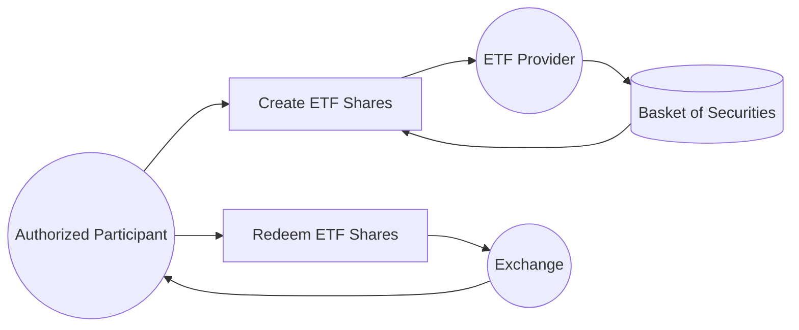

## 23.4 Exchange-Traded Funds

Exchange-Traded Funds (ETFs) have revolutionized how both institutional and retail investors build and manage portfolios. They combine certain structural advantages of mutual funds—such as diversification across multiple underlying securities—with the trading flexibility of individual stocks. As of the mid-2020s, ETFs are regarded as a core strategy in modern wealth management. This section examines how ETFs operate, their unique characteristics, the potential advantages and pitfalls for Canadian investors, and the regulatory landscape that governs them.

---

## Introduction to ETFs

ETFs are investment vehicles that allow investors to buy shares representing a basket of stocks, bonds, commodities, or other assets. Unlike mutual funds, which are typically priced once per day at Net Asset Value (NAV), ETFs trade on exchanges (e.g., the Toronto Stock Exchange, TSX) throughout the trading day. This intraday liquidity grants investors the ability to buy or sell shares at prevailing market prices whenever the exchange is open.

### Key Similarities and Differences with Mutual Funds

• Similarities  
  – Pooled Investment Vehicle: Both ETFs and mutual funds pool money from many investors.  
  – Diversification: Shares in ETFs and mutual funds represent indirect ownership of multiple underlying assets.  
  – Professional Management (in some cases): Many ETFs and mutual funds are managed by professional portfolio managers, although many ETFs simply track an index.  

• Differences  
  – Trading Mechanics: ETFs can be traded intraday on a stock exchange; mutual funds are typically purchased or redeemed at NAV once per day.  
  – Pricing: ETF prices fluctuate throughout the day based on market demand; mutual funds are priced at day’s end.  
  – Transparency: Many ETFs disclose their holdings daily; mutual funds usually disclose holdings less frequently (e.g., quarterly).  
  – Costs: ETFs often feature lower Management Expense Ratios (MERs) and generally have lower portfolio turnover, though investors must factor in brokerage commissions and bid-ask spreads when buying or selling ETF shares.

---

## How ETFs Work

### Creation and Redemption Mechanism

One of the most significant features of ETFs is the creation/redemption mechanism. This process helps keep an ETF’s market price aligned with the net asset value of its underlying holdings. Authorized participants—typically large institutional entities such as major banks or brokerage firms—can create or redeem ETF shares in large blocks (often called “creation units”).

Below is a simple visual representation of the ETF creation and redemption process:

1. The authorized participant buys or borrows the basket of underlying securities (or, in some cases, cash).  
2. They deliver these securities to the ETF provider (the fund sponsor) in exchange for new ETF shares.  
3. The authorized participant can then sell these ETF shares in the secondary market.  
4. Similarly, if the market price of the ETF is below its NAV, authorized participants can buy ETF shares, redeem them with the issuer, and receive the underlying asset basket.  

This process helps to minimize large discrepancies between the ETF’s market price and its net asset value.

---

## ETF Types and Strategies

ETFs have been launched to track virtually every market segment. Common categories include:

1. **Index-Tracking ETFs**  
   – Designed to replicate the performance of a specific index (e.g., S&P/TSX Composite or a sector-specific index).  
   – Passive approach; lower MER due to less frequent trading.

2. **Actively Managed ETFs**  
   – Managed by professional investment managers aiming to outperform a benchmark.  
   – May have higher MERs than passive ETFs due to research and portfolio turnover.

3. **Fixed-Income ETFs**  
   – Provide exposure to bond markets or specific bond sectors (e.g., government, corporate, high-yield, or short-duration bonds).  
   – Often used for diversification, income generation, and risk mitigation.

4. **Commodity ETFs**  
   – Offer investors access to commodities such as gold, oil, or agricultural products.  
   – Some hold physical commodities (e.g., gold ETFs), while others use futures contracts.

5. **Sector and Thematic ETFs**  
   – Focus on specific sectors (e.g., technology, healthcare, energy) or broad themes (e.g., clean energy, artificial intelligence).  
   – Helpful for targeted exposure or satellite positions in a core-satellite investment strategy.

6. **Smart Beta or Factor-Based ETFs**  
   – Track indices constructed around specific quantitative factors, such as low volatility, value, momentum, or quality.  
   – Aim to optimize risk-adjusted returns beyond traditional market-cap-weighted strategies.

---

## Cost Structure of ETFs

### Management Expense Ratio (MER)

MER covers costs associated with operating the fund, including management fees, administrative expenses, and other overhead. In Canada, ETFs generally charge lower MERs compared to mutual funds, reflecting their index-tracking or rules-based nature. For example, a broad-based index ETF may charge an MER as low as 0.05% to 0.30%, while an actively managed ETF might be 0.50% or higher.

### Trading Costs and Bid-Ask Spreads

Investors pay commissions whenever they buy or sell an ETF. Depending on the brokerage, a commission might be a flat rate or a per-share charge. Over time, frequent trading can add up, especially for smaller positions.

Additionally, each ETF has a bid-ask spread—the difference between the highest price a buyer is willing to pay and the lowest price a seller is willing to accept. ETFs with broad market coverage and high daily trading volumes (e.g., large Canadian or U.S. equity index ETFs) tend to have tight bid-ask spreads, minimizing transaction costs. In contrast, specialized or thinly traded ETFs often have wider spreads that can meaningfully impact your net returns.

---

## Tax Efficiency

ETFs generally exhibit tax efficiency, especially passive index ETFs, by minimizing portfolio turnover. Fewer trades mean fewer taxable capital gains distributions passed to unitholders. This is especially relevant for non-registered accounts (i.e., those not sheltered under Registered Retirement Savings Plans (RRSPs) or Tax-Free Savings Accounts (TFSAs)).

Further, creation/redemption in-kind processes often result in minimal capital gains inside the ETF. However, active trading by the ETF managers can reduce this advantage. Canadian investors should compare after-tax returns of different ETFs, particularly if they are investing in a taxable account rather than a registered plan.

---

## Regulatory Landscape in Canada

### ETF Facts

Under National Instrument 41-101, all ETF providers in Canada must issue an “ETF Facts” document. Comparable to the “Fund Facts” required for mutual funds, this document outlines crucial information such as fees, portfolio holdings, past performance, and key risks. 

### CIRO Guidelines for Advisors

The Canadian Investment Regulatory Organization (CIRO) enforces rules ensuring advisors follow best practices when recommending investments, including ETFs. Financial planners should perform due diligence on ETF suitability for specific clients’ risk tolerances, objectives, and investment horizons. This includes:

• Reviewing costs and fees, including MER, commissions, and bid-ask spreads.  
• Evaluating liquidity and trading volumes to reduce the risk of wide spreads.  
• Explaining potential tracking error and index methodology.  
• Ensuring any specialized or leveraged ETFs fit the client’s goals and risk profile.  

Advisors are also encouraged to document their recommendations thoroughly, highlighting how ETFs align with the client’s overall financial plan.

---

## Constructing Portfolios with ETFs

### Core-Satellite Strategy

One popular approach to building ETF-centric portfolios is the “core-satellite” model:

• **Core**: A broadly diversified, low-cost index-based ETF that serves as the foundational holding, covering a large portion of the market (e.g., a broad S&P/TSX Composite index ETF or a global equity ETF).  
• **Satellite**: A few thematic or specialized ETFs for targeted sector or factor exposures (e.g., technology ETFs, dividend-focused ETFs, or emerging market ETFs).  

This approach can be efficient, balancing diversification with tactical allocations based on market outlook or individual client preferences.

### Case Study: Canadian Equity & Bond Allocation

Consider a client wanting a simple 60/40 stock-bond portfolio. The advisor might select:  
1. 60% in an S&P/TSX Composite Index ETF (e.g., trading under RBC iShares or BMO).  
2. 40% in a Government of Canada Bond ETF or an aggregate Canadian bond ETF.  

This classic allocation provides stability through bond holdings and growth potential through equities, all while taking advantage of the intraday trading flexibility and potentially lower costs of ETFs.

---

## Liquidity Considerations

ETFs trade throughout market hours, but not all ETFs are equally liquid. A large ETF tracking a widely followed index typically has tight bid-ask spreads and high trading volumes—ideal for most investors. In contrast, niche or thinly traded ETFs (e.g., certain sector-specific offerings) may exhibit:

- Wider bid-ask spreads, raising trading costs.  
- Difficulty executing large orders without moving the market.  

Advisors often check an ETF’s average daily volume and the presence of market makers. Using limit orders, especially for less liquid ETFs, can help ensure you receive a fair price.

---

## Best Practices and Common Pitfalls

### Best Practices

1. **Understand the Underlying Index:** Know what securities the ETF holds or which index it tracks.  
2. **Evaluate Total Costs:** Assess MER, tracking error, trading commissions, and bid-ask spread.  
3. **Conduct Suitability Checks:** Ensure the ETF aligns with the client’s objectives, risk tolerance, and time horizon.  
4. **Monitor ETFs Regularly:** Keep an eye on performance, changes to the underlying index, and expense ratio adjustments.  
5. **Be Aware of Leverage and Inverse ETFs:** These products are more complex and can lead to unexpected results if held long-term.

### Common Pitfalls

• **Over-Trading:** High-frequency ETF trades can erode returns due to transaction costs.  
• **Misjudging Liquidity:** Low liquidity can widen spreads and reduce the ease of entering/exiting positions.  
• **Ignoring Tracking Error:** Some ETFs may underperform or deviate from the benchmark.  
• **Lack of Diversification:** Concentrating on too few specialized ETFs can expose the investor to high idiosyncratic risk.

---

## Step-by-Step ETF Selection Guide

Below is a concise step-by-step process for choosing the right ETF:

1. **Define Investment Objective:** Identify whether you need broad market exposure, sector-specific coverage, or a fixed-income solution.  
2. **Analyze the Underlying Index or Strategy:** Understand rules, rebalancing methodology, sector composition, and historical performance.  
3. **Compare Management Fees (MER):** Low fees can enhance net returns over the long run, but be aware of any premium charged for active management or specialized strategies.  
4. **Check Historical Tracking Error:** Ensure the ETF effectively matches its benchmark over time.  
5. **Review Liquidity Measures:** Look at daily trading volumes and average bid-ask spreads.  
6. **Examine “ETF Facts” Document:** Pay special attention to key risks, top holdings, annual returns, and cost breakdown.  
7. **Consider Tax Implications:** For non-registered accounts, factor in potential capital gains distributions.  
8. **Monitor and Rebalance:** Regularly review your holdings to verify they still align with your client’s evolving objectives.

---

## Additional Resources

- **Regulations and Guidelines**  
   – Canadian Securities Administrators (CSA): Details on “ETF Facts” under National Instrument 41-101.  
   – Canadian Investment Regulatory Organization (CIRO): Guidelines and best practices for ETF recommendations.

- **Books on ETF Strategies**  
   – “ETF Investment Strategies: Best Practices from Leading Experts on Constructing a Winning ETF Portfolio.”

- **Online Tools**  
   – Morningstar and TMX Money: Compare performance, MER, and holdings of Canadian ETFs.  
   – Yahoo Finance: Track real-time prices and trading data.

- **Case Studies**  
   – RBC iShares, BMO, and Vanguard: Leading Canadian ETF providers with a wide array of offerings.

---

## Summary

ETFs provide an accessible, cost-efficient avenue to gain exposure to a variety of asset classes. Their real-time trading, generally low MERs, tax efficiency, and transparent structure have made them a staple in modern Canadian wealth management. Whether building core holdings or exploring niche market themes, advisors and investors alike benefit from understanding how ETFs function, the factors that influence ETF pricing, and the regulatory requirements that guide these investments in Canada.

ETFs are not without potential downsides—trading costs, liquidity challenges, and occasional tracking errors can detract from performance. However, by carefully examining the underlying index or strategy, understanding bid-ask spreads, and conducting thorough suitability assessments, advisors can effectively integrate ETFs into clients’ portfolios. Armed with this knowledge, planners can harness ETFs to create diversified, tailored, and cost-efficient investment solutions that align with client goals.

---

## Mastering ETF Strategies: 10-Question Quiz



### Which of the following statements best describes how ETFs trade?

- [x] They can be bought and sold at market prices throughout the trading day on an exchange.  
- [ ] They can only be purchased or redeemed at the end of the trading day at NAV.  
- [ ] They can be traded off-exchange without any market influence.  
- [ ] They trade only once weekly to minimize cost.  

> **Explanation:** ETFs offer intraday liquidity, enabling investors to buy and sell shares at ongoing market prices as long as the exchange is open.

### What is one of the primary reasons ETFs often have lower MERs compared to traditional mutual funds?

- [x] They are frequently index-based and thus require less active management.  
- [ ] Their fees are regulated strictly by CIRO.  
- [ ] They pass no costs to investors under Canadian regulations.  
- [ ] They incur higher tax liabilities, offsetting operating costs.  

> **Explanation:** Many ETFs track indexes, resulting in lower operational costs and, therefore, lower Management Expense Ratios.

### How does the creation/redemption mechanism help maintain an ETF’s price close to its net asset value (NAV)?

- [x] Authorized participants can create or redeem large blocks of ETF shares, which helps correct price deviations.  
- [ ] A government authority enforces the ETF price to trade at NAV.  
- [ ] ETFs are only priced monthly, avoiding price deviations.  
- [ ] ETFs must distribute any profits and losses evenly among unitholders.  

> **Explanation:** By delivering the underlying basket of securities to the fund provider (creation) or redeeming shares for that basket, authorized participants arbitrage away large price differentials.

### Which statement about ETF tax efficiency is accurate?

- [x] ETFs often have fewer taxable capital gains distributions due to lower portfolio turnover.  
- [ ] ETFs always yield zero taxable distributions for investors.  
- [ ] Tax efficiency applies only if the ETF invests in fixed-income instruments.  
- [ ] ETFs aren’t subject to capital gains tax.  

> **Explanation:** Lower turnover in passive ETFs and in-kind redemptions typically result in fewer capital gains distributions, although no ETF is entirely exempt from taxes.

### What is a primary concern when trading thinly traded ETFs?

- [x] Wide bid-ask spreads may increase transaction costs.  
- [ ] There is no ability to exit the position once purchased.  
- [ ] Intraday prices are more stable.  
- [ ] Regulators prohibit trading these ETFs without special permissions.  

> **Explanation:** Low trading volumes can result in wider bid-ask spreads, which increases costs for investors buying or selling ETF units.

### Under Canadian regulations (NI 41-101), what key document must ETF providers deliver to investors?

- [x] ETF Facts  
- [ ] An in-depth annual report only  
- [ ] Private Placement Memorandum  
- [ ] Investment Policy Statement  

> **Explanation:** National Instrument 41-101 mandates that ETF providers deliver an “ETF Facts” document that highlights fees, holdings, performance, and key risks.

### In a “core-satellite” portfolio, what typically represents the “core” component?

- [x] A broad-based index ETF comprising a large portion of the portfolio.  
- [ ] A niche, sector-specific ETF with minimal trading volume.  
- [ ] Actively managed funds covering multiple asset classes.  
- [ ] A single commodity ETF focused on gold.  

> **Explanation:** The core is usually a diversified, low-cost index ETF covering broad segments of the market, providing stability and wide market exposure.

### Which factor should advisors review when recommending specific ETFs to clients?

- [x] The client’s risk tolerance, MER, liquidity, and index methodology.  
- [ ] Only the ETF provider’s marketing materials.  
- [ ] Exclusively the client’s tax bracket.  
- [ ] The highest daily trading volume of any ETF in the market.  

> **Explanation:** Suitability depends on multiple factors—client risk preference, cost considerations, daily trading volumes (liquidity), and the underlying strategy align with the client’s investment objectives.

### What is the bid-ask spread?

- [x] The difference between the highest price a buyer is willing to pay and the lowest price a seller is willing to accept.  
- [ ] The cost of an ETF’s annual management fee.  
- [ ] The market price premium for authorized participants.  
- [ ] The spread of capital gains distributions over one year.  

> **Explanation:** The bid-ask spread reflects the gap between the buyer’s bid and the seller’s ask, representing part of the transaction cost when trading.

### True or False: ETFs tracking the same index are guaranteed to have identical performance results.

- [x] True  
- [ ] False  

> **Explanation:** While they aim to replicate the same index, differences in fees, tracking methods, portfolio turnover, and management strategies can lead to performance variations, even among ETFs that track the same benchmark.



---

## For Additional Practice and Deeper Preparation

**[1. WME Course For Financial Planners (WME-FP): Exam 1](https://www.udemy.com/course/csi-wme-fp-exam1/?referralCode=1A23C67E56971C0A73D5)**  
• Dive into 6 full-length mock exams—1,500 questions in total—expertly matching the scope of WME-FP Exam 1.  
• Experience scenario-driven case questions and in-depth solutions, surpassing standard references.  
• Build confidence with step-by-step explanations designed to sharpen exam-day strategies.

**[2. WME Course For Financial Planners (WME-FP): Exam 2](https://www.udemy.com/course/csi-wme-fp-exam2/?referralCode=25879CCDED7B7905BBA8)**  
• Tackle 1,500 advanced questions spread across 6 rigorous mock exams (250 questions each).  
• Gain real-world insight with practical tips and detailed rationales that clarify tricky concepts.  
• Stay aligned with CIRO guidelines and CSI’s exam structure—this is a resource intentionally more challenging than the real exam to bolster your preparedness.

> Note: While these courses are specifically crafted to align with the WME-FP exam outlines, they are independently developed and not endorsed by CSI or CIRO.
