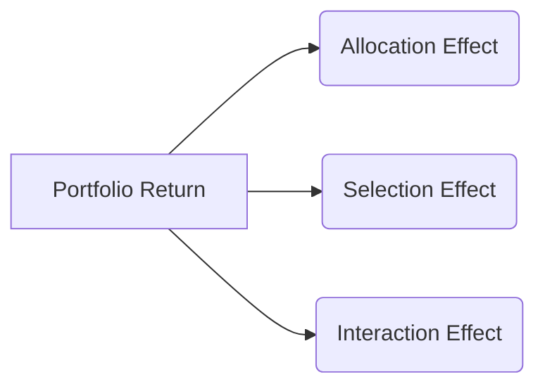

## 24.2 Portfolio Performance Evaluation

Evaluating a portfolio’s performance is a critical aspect of wealth management, ensuring that investment results align with a client’s objectives, risk tolerance, and overall financial plan. A thorough assessment clarifies whether returns stem from informed decision-making or broader market conditions—and, crucially, whether adjustments are needed to stay on track. In Canada, guidelines such as those set by the Canadian Investment Regulatory Organization (CIRO) and the Canadian Securities Administrators (CSA) underscore the importance of transparent and accurate performance reporting. This section provides you with the foundational concepts, methods, and practical tips to conduct robust performance evaluations.

---

## Understanding Portfolio Performance Evaluation

At its core, portfolio performance evaluation determines whether an investment strategy is achieving its stated goals, whether a manager is demonstrating skill, and if present portfolio allocations properly compensate for the levels of risk taken. A solid evaluation helps you discern how much of the portfolio’s success (or shortfall) arises from skill, market momentum, luck, or other factors, such as sectoral biases or timing decisions. 

### Importance of Performance Evaluation

• Identifies strengths and weaknesses in the investment strategy.  
• Measures realized returns relative to the market and competitors.  
• Offers insight into whether performance results are sustainable or dependent on temporary market factors.  
• Helps satisfy regulatory requirements for transparent reporting (e.g., CIRO customer reporting guidelines).  
• Allows for a deeper understanding of risk exposures and how they contribute to returns.  

---

## Measuring Returns

An essential first step is to quantify the returns generated by the portfolio over a specific period. Returns can be expressed in both absolute and relative terms, and various measurement techniques help you isolate the true managerial skill from external factors like deposits, withdrawals, and market fluctuations.

### Absolute Return

Absolute Return is the portfolio’s total return over a particular period, expressed as a percentage. For instance, if a portfolio grows from CAD 100,000 to CAD 110,000 (after fees and any distributions) in one year, the absolute return is:

( (110,000 – 100,000) / 100,000 ) × 100% = 10%

This metric does not compare the portfolio to any external benchmark. While straightforward, it does not provide context on whether the outcome equaled or surpassed market expectations.

### Relative Return

Relative Return compares portfolio performance to a benchmark, such as the S&P/TSX Composite Index or a blended benchmark specified in a client’s Investment Policy Statement (IPS). For example, if your portfolio gained 10% but the relevant benchmark returned 8% during the same period, your excess return is 2%. This comparison adds depth to performance findings, indicating whether the portfolio is outpacing or lagging behind market standards.

### Time-Weighted Rate of Return (TWRR)

The Time-Weighted Rate of Return (TWRR) isolates the impact of investment decisions from the effect of external cash flows (e.g., contributions or withdrawals). This makes TWRR particularly useful for evaluating portfolio managers, since it focuses on growth rates over each sub-period regardless of how much money was invested at any one time.

Conceptually, you split the total performance period into intervals every time there is a cash flow (deposit or withdrawal). You calculate the growth factor for each sub-period and then link them together. It answers the question: “How effectively was the portfolio managed on a percentage basis, independent of contributions and withdrawals?”

### Money-Weighted Rate of Return (MWRR or IRR)

The Money-Weighted Rate of Return (MWRR), also known as the Internal Rate of Return (IRR), takes into account the timing and magnitude of contributions and withdrawals. This reflects the actual investor experience, as larger contributions during favorable markets can yield substantial gains, and withdrawals at inopportune times can diminish overall returns.

Whether you use TWRR or MWRR often depends on your objectives:  
• TWRR for evaluating manager skill.  
• MWRR for reflecting the individual investor’s actual experience.

---

## Risk-Adjusted Performance Metrics

Raw returns, whether absolute or relative, do not provide the full story. Two portfolios with identical returns may carry significantly different risk exposures. Using risk-adjusted metrics allows you to measure how effectively each portfolio manages its volatility (or systematic risk) to generate those returns.

### Sharpe Ratio

The Sharpe Ratio evaluates the amount of excess return earned per unit of total risk (standard deviation). Mathematically:

Sharpe Ratio = (Rp – Rf) / σp

Where:
- Rp is the portfolio return.  
- Rf is the risk-free rate (e.g., yield on Government of Canada Treasury Bills).  
- σp is the standard deviation of the portfolio’s returns.

A higher Sharpe Ratio indicates the portfolio is delivering more return per unit of total volatility. It’s particularly valuable when comparing portfolios with different strategies or asset mixes, though it treats upside and downside volatility equally.

### Treynor Ratio

The Treynor Ratio measures return relative to the portfolio’s systematic risk, denoted by beta (β). The calculation is:

Treynor Ratio = (Rp – Rf) / βp

Where βp is the portfolio’s beta. This implies the risk measure in Treynor Ratio is market-related, making it applicable when you are looking at how well the manager compensated investors for bearing market risk.

### Jensen’s Alpha (Alpha)

Jensen’s Alpha, often called simply “Alpha,” measures the excess return on the portfolio over what is predicted by its beta relative to the market. Suppose the market’s return is Rm, the portfolio’s beta is β, and the risk-free rate is Rf. Then the expected return on the portfolio based on the Capital Asset Pricing Model (CAPM) is:

Expected Return = Rf + β (Rm – Rf)

Jensen’s Alpha = Actual Portfolio Return – Expected Return

A positive alpha suggests the portfolio manager has added value beyond what the market conditions and inherent systematic risk would suggest.

### Sortino Ratio

The Sortino Ratio refines the Sharpe Ratio by penalizing only downside volatility instead of total volatility. This helps distinguish between “good” volatility (upside) and “bad” volatility (downside):

Sortino Ratio = (Rp – Rf) / Downside Deviation

It is particularly relevant for investors who care more about protection from losses than about dampening upside volatility.

---

## Performance Attribution

Performance Attribution dissects the sources of returns relative to a benchmark. This analysis determines whether success (or underperformance) stems from superior asset allocation decisions, security selection, or a combination of both.

### Asset Allocation Effect

This quantifies how decisions regarding the distribution of assets across different classes (e.g., equities, fixed income, cash, alternative investments) have contributed to overall portfolio performance versus a baseline target or benchmark allocation.

### Security Selection Effect

Within each asset class, managers select specific securities (e.g., RBC, TD Bank stocks, Government of Canada bonds). The security selection effect measures how those individual security choices—compared to the benchmark constituents—contribute to performance.

### Interaction Effect

The interaction effect (or allocation/selection interaction) assesses whether the combination of asset allocation and security selection creates synergy or conflicts. For instance, overweighting Canadian equities while also selecting top-performing Canadian bank stocks can magnify returns beyond what each factor would deliver independently.

Below is a simple Mermaid.js diagram illustrating Asset Allocation, Security Selection, and Interaction effects:

---

## Benchmark Selection

Selecting an appropriate benchmark is vital to accurately evaluate whether a portfolio has achieved its intended goals. A properly chosen benchmark should reflect the portfolio’s:

1. Asset classes: (Equities, Fixed Income, Alternatives).  
2. Geographic focus: (Domestic, International, Global).  
3. Sector exposures: (Financials, Technology, etc.).  
4. Risk profile.

For example, a global equity portfolio might benchmark against the MSCI World Index. A balanced Canadian portfolio—split between Canadian equities and Canadian bonds—might use a blended benchmark combining the S&P/TSX Composite Index and the FTSE Canada Universe Bond Index.  

---

## Reporting and Regulatory Compliance in Canada

CIRO and the CSA enforce performance reporting regulations under guidelines often referred to as CRM (Client Relationship Model) reporting. These rules aim to ensure clients receive transparent, simplified, and comprehensible statements. As a financial planner or portfolio manager, you should:

• Disclose fees and costs, net returns, and relevant benchmarks.  
• Provide performance over standardized periods (e.g., 1-, 3-, 5-, and 10-year returns, where applicable).  
• Offer both dollar-based and percentage-based returns.  
• Comply with ongoing disclosures regarding risk levels, conflicts of interest, and statements of potential liabilities.

For the latest updates, monitor:  
• CIRO’s official website for bulletins on new performance reporting requirements.  
• CSA’s announcements on client-focused reforms and key changes in disclosure.

---

## Qualitative Factors in Performance Evaluation

Numbers alone do not tell the entire story. Qualitative factors often shape or contextualize a portfolio’s performance:

1. Changes in client objectives or life stages (e.g., retiring client vs. accumulation phase).  
2. Macroeconomic conditions or geopolitical events influencing markets.  
3. Manager tenure, investment philosophy stability, and experience level.  
4. Client satisfaction with volatility, drawdowns, and alignment with personal ethics (e.g., ESG considerations).  

An in-depth performance review combines quantitative measurements (returns and risk metrics) with these qualitative insights, ensuring alignment between the portfolio and the client’s evolving profile.

---

## Practical Examples and Case Studies

### Case Study: A Canadian Pension Fund

A mid-sized Canadian pension fund invests in a mix of domestic equities (S&P/TSX Composite Index) and Canadian Government bonds (FTSE Canada Universe Bond Index).  
• Absolute Return: 7% annualized over 5 years.  
• Benchmark (60% TSX / 40% Bond Index) = 6.5%.  
• Portfolio TWRR = 6.8%, MWRR = 7.2%.  

Further breakdown shows positive Jensen’s Alpha of +0.4%, indicating skillful active management. Performance Attribution reveals that security selection in the financial sector was a leading contributor. The manager’s overweight in major bank stocks (like RBC, TD Bank) paid off, while the overall bond market environment remained relatively stable.

### Individual Investor Example

A client invests through a self-directed brokerage account. Consistent monthly contributions cause the MWRR to deviate from the TWRR. After analysis, the MWRR is higher, reflecting the fortunate timing of larger investments during market dips, which provided more shares at lower prices. However, a negative Sharpe Ratio during a market downturn indicates the portfolio took on significant volatility with insufficient risk premium.  

This scenario highlights why money-weighted returns can provide a more personalized perspective, while time-weighted returns measure the effectiveness of the investment choices themselves.

---

## Best Practices, Common Pitfalls, and Strategies

• **Best Practices**  
  – Pick benchmarks that match the asset class, region, and style.  
  – Use at least one risk-adjusted metric to capture return efficiency.  
  – Attribute performance to identify skill in security selection or asset allocation.  
  – Maintain consistent, transparent client communications per CIRO rules.  
  – Stay current with CIPM or CFA Institute resources for performance measurement standards.

• **Common Pitfalls**  
  – Relying solely on past performance as an indicator of future results.  
  – Ignoring the impact of fees and transaction costs on net returns.  
  – Overemphasizing short-term performance fluctuations.  
  – Selecting a benchmark that is either too broad or too narrow, misrepresenting the portfolio’s performance.

• **Strategies to Overcome Challenges**  
  – Implement ongoing monitoring to capture multi-period performance trends, not just one-year snapshots.  
  – Educate clients on the nature of risk, using straightforward examples and summary visuals.  
  – Continually align portfolios with stated objectives and constraints, revisiting Investment Policy Statements when necessary.

---

## Additional Resources

• **CIRO & CSA (Canadian Securities Administrators) Guidelines** – Keep abreast of updates on CRM performance reporting requirements.  
• **CFA Institute - CIPM (Certificate in Investment Performance Measurement):** (https://www.cfainstitute.org/) – Offers specialized curriculum on advanced performance measurement and analysis.  
• **Bank of Canada:** (https://www.bankofcanada.ca/) – Source of economic data and market analyses.  
• **SEDAR+:** (https://www.sedarplus.ca/) – Public company and mutual fund performance data.  
• **Recommended Reading:**  
  – “Practical Portfolio Performance Measurement and Attribution” by Carl R. Bacon.  
  – “Investment Performance Measurement: Evaluating and Presenting Results” by Philip Lawton.  
  – Articles from the Journal of Performance Measurement.

---

## Summary

Portfolio performance evaluation is a multi-faceted process. It requires precise measurement tools such as TWRR and MWRR, alongside risk-adjusted metrics like the Sharpe Ratio, Treynor Ratio, Jensen’s Alpha, and the Sortino Ratio. Performance attribution further reveals the drivers of returns, while benchmark selection ensures a meaningful comparison. Canadian regulations mandate clear, accurate reporting for client statements, which integrates seamlessly with best practices in wealth management.

Always examine quantitative results in the context of qualitative factors—client goals, economic conditions, and manager expertise. By combining these elements, financial planners can confidently advise on whether a particular strategy is sustainable or if recalibration is due. Doing so fosters trust, transparency, and successful long-term wealth management outcomes.

---

## Test Your Knowledge: Canadian Portfolio Performance Evaluation Essentials



### Which method best isolates a portfolio manager’s skill from the impact of cash flows?

- [ ] Money-Weighted Rate of Return (MWRR or IRR)
- [x] Time-Weighted Rate of Return (TWRR)
- [ ] Absolute Return
- [ ] Relative Return

> **Explanation:** TWRR divides the performance measurement period whenever there is a cash flow, neutralizing the effect of client contributions or withdrawals on the measurement of managerial skill.

### Which metric penalizes a portfolio for volatility regardless of gains or losses?

- [x] Sharpe Ratio
- [ ] Sortino Ratio
- [ ] Treynor Ratio
- [ ] Jensen’s Alpha

> **Explanation:** The Sharpe Ratio uses total standard deviation, which does not distinguish between upside and downside volatility. The Sortino Ratio, by contrast, penalizes only downside volatility.

### When a portfolio’s alpha (Jensen’s Alpha) is positive, it indicates:

- [x] The portfolio has outperformed what would be expected given its beta.
- [ ] The portfolio has stayed in line with its benchmark.
- [ ] The portfolio’s systematic risk is below 1.0.
- [ ] The portfolio’s Treynor Ratio is negative.

> **Explanation:** Positive Jensen’s Alpha means the manager produced returns above what the Capital Asset Pricing Model (CAPM) would predict, given the portfolio’s systematic risk (beta).

### In a balanced Canadian portfolio using the S&P/TSX Composite and FTSE Canada Universe Bond Index, the “asset allocation effect” measures:

- [ ] Only the selection of individual stocks in the equity portion.
- [x] The impact of distributing investments across different asset classes relative to the benchmark weights.
- [ ] The added value of choosing outperforming bonds versus government bonds.
- [ ] The effect of currency fluctuations on the portfolio’s returns.

> **Explanation:** Asset allocation effect isolates the returns attributable to over- or under-weighting core asset classes versus benchmark weightings.

### Which of the following Canadian regulations primarily governs client-centric performance reporting?

- [x] CIRO guidelines under CRM requirements
- [ ] OSFI mortgage regulations
- [ ] Bank Act for personal deposit insurance
- [ ] Canada Revenue Agency (CRA) guidelines

> **Explanation:** CIRO guidelines under the Client Relationship Model (CRM) frame performance and fee disclosures in Canada. OSFI covers financial institution supervision, while the Bank Act addresses banking operations and CRA handles taxes.

### How does Money-Weighted Rate of Return (MWRR) differ from Time-Weighted Rate of Return (TWRR)?

- [x] MWRR incorporates the timing and size of client cash flows, while TWRR neutralizes them.
- [ ] MWRR is always higher than TWRR.
- [ ] TWRR applies only to Canadian equity portfolios.
- [ ] TWRR is solely used for performance reporting to CIRO.

> **Explanation:** MWRR reflects an investor’s personal return, factoring in when and how much money is deposited or withdrawn. TWRR eliminates those external flows to evaluate the manager’s performance in isolation.

### The Sortino Ratio is primarily distinguished from the Sharpe Ratio by:

- [ ] Using alpha instead of total return.
- [x] Considering only downside volatility in the denominator.
- [ ] Replacing the risk-free rate with a benchmark index.
- [ ] Using total volatility plus the portfolio’s beta.

> **Explanation:** Unlike the Sharpe Ratio, which uses total standard deviation, the Sortino Ratio focuses on downside deviation, making it particularly relevant for risk-averse or drawdown-sensitive investors.

### Which of the following best describes the term “benchmark” in performance evaluation?

- [x] A standard against which a portfolio’s performance is measured.
- [ ] A tool used to calculate MWRR.
- [ ] A regulatory guideline set by CIRO.
- [ ] A measure of a portfolio’s beta relative to the market.

> **Explanation:** A benchmark provides a point of comparison to assess how well a portfolio is doing relative to a comparable market index or blended metric.

### If a portfolio manager consistently outperforms the benchmark without explaining more risk, one possible conclusion is:

- [x] The manager has genuine skill in security selection or asset allocation.
- [ ] The market was abnormally low in volatility.
- [ ] The benchmark is too difficult to beat.
- [ ] The manager’s Sharpe Ratio must be zero.

> **Explanation:** Consistent outperformance net of risk adjustments usually indicates genuine managerial skill or an advantageous process.

### A higher Treynor Ratio suggests:

- [x] The portfolio is generating more return per unit of systematic risk.
- [ ] High loading to total volatility.
- [ ] Poor asset allocation decisions.
- [ ] Lower returns than the risk-free asset.

> **Explanation:** The Treynor Ratio uses beta (systematic risk) in the denominator, so a higher value means the portfolio is efficiently compensating investors for market-related risk.



---

## For Additional Practice and Deeper Preparation

**[1. WME Course For Financial Planners (WME-FP): Exam 1](https://www.udemy.com/course/csi-wme-fp-exam1/?referralCode=1A23C67E56971C0A73D5)**  
• Dive into 6 full-length mock exams—1,500 questions in total—expertly matching the scope of WME-FP Exam 1.  
• Experience scenario-driven case questions and in-depth solutions, surpassing standard references.  
• Build confidence with step-by-step explanations designed to sharpen exam-day strategies.

**[2. WME Course For Financial Planners (WME-FP): Exam 2](https://www.udemy.com/course/csi-wme-fp-exam2/?referralCode=25879CCDED7B7905BBA8)**  
• Tackle 1,500 advanced questions spread across 6 rigorous mock exams (250 questions each).  
• Gain real-world insight with practical tips and detailed rationales that clarify tricky concepts.  
• Stay aligned with CIRO guidelines and CSI’s exam structure—this is a resource intentionally more challenging than the real exam to bolster your preparedness.

> Note: While these courses are specifically crafted to align with the WME-FP exam outlines, they are independently developed and not endorsed by CSI or CIRO.

---
