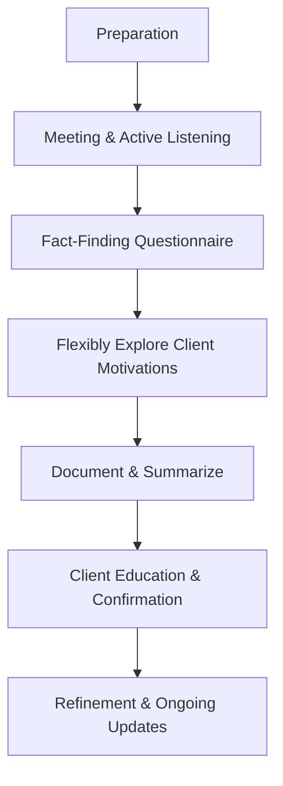

## 3.3 The Client Discovery Process

The foundation of any successful wealth management relationship rests on understanding the client—who they are, their goals, and the nuances of their financial situation. Within the Canadian regulatory framework, advisors must balance the requirements of collecting mandated information with exploring the broader context of a client’s aspirations and values. This extensive discovery phase lays the groundwork for more tailored advice and fosters an atmosphere of mutual trust. Below, we explore the essential elements of the client discovery process, highlighting practical methods, regulatory considerations, and proven strategies that guide Canadian financial advisors.

---

### The Importance of a Thorough Discovery

Wealth management goes beyond merely collecting numbers and completing forms. A well-rounded discovery process should capture:

• Regulatory Information: Know Your Client (KYC) regulations, as framed by the Canadian Investment Regulatory Organization (CIRO), require certain personal and financial details to ensure suitability of advice. These include income, net worth, investment experience, and risk tolerance.  
• Holistic Personal Context: In-depth exploration of a client’s lifestyle, future goals (e.g., retirement, home purchase, education for dependents), personal values, and major life events (e.g., marriage, divorce, career changes) that may substantially affect financial decision-making.  

By bridging the gap between these mandatory requirements and personal context, advisors set the stage for delivering holistic and client-centric planning.

---

### Preparation: Checklist and Preliminary Research

**Key Goal:** Gather relevant documents and structure the conversation so you can focus on what matters to the client.

1. **Create a Personalized Checklist**  
   • Account statements, tax returns (T1 forms in Canada), mortgage details, insurance policies.  
   • Lifestyle and retirement goals, potential real estate ventures, philanthropic interests.  
   • Existing assets, including investments with Canadian banks (e.g., RBC, TD) or self-managed brokerage accounts through institutions such as Questrade.

2. **Use Sample Questionnaires**  
   • Templated questionnaires ensure that mandatory KYC obligations are met while providing structure to capture personal interests and long-term aspirations.  
   • Tools from FP Canada’s six-step process often include standard prompts to unearth client motivations.  

3. **Review of Preliminary Findings**  
   • Prior to the first formal meeting, review all known information, ensuring accuracy and readiness to discuss points of importance to the client.  
   • This preparation signals professionalism and attention to detail, immediately establishing trust when the actual meeting begins.

---

### Active Listening and Questioning Techniques

#### Open-Ended Questions
Rather than asking, “Do you want to retire at age 65?” (which usually yields a yes/no response), open-ended questions invite broader insights:

• “What does a fulfilling retirement look like for you?”  
• “Can you share the aspirations or goals that are most important for your family?”  

These questions encourage clients to reflect on their values. They also help uncover personal aspirations that might otherwise remain hidden, such as a desire to start a charitable foundation or fund a grandchild’s education.

#### Reflective Listening
Reflective listening involves summarizing a client’s statements to verify your understanding:
• “If I understand correctly, you’d like to prioritize traveling in retirement, focusing on experiences rather than leaving a large estate. Is that right?”  
• “It sounds like ensuring a stable education fund for your kids is more important to you than an early retirement. Would you say that’s accurate?”  

By employing reflective listening, you confirm the main points, reduce miscommunication, and demonstrate empathy.

#### Observing Non-Verbal Cues
Non-verbal cues—such as facial expressions, body posture, or tone of voice—can signal comfort or unease with certain topics. If a client frowns when discussing risk tolerance, they may be more conservative than initially indicated. This is especially relevant in cases like mortgage refinancing or investment decisions involving more complex products.

---

### Structured Yet Flexible Approach

#### Using a Discovery Framework
Financial advisors commonly use a fact-finding questionnaire that itemizes everything from basic demographics and financial specifics to intangible goals and risk preferences. While this framework ensures key areas aren’t missed, rigidly moving from question to question can sometimes stifle deeper exploration.

#### Embracing Tangential Conversations
Allowing clients to explore related but seemingly tangential topics can be revealing. For instance, if a client starts discussing their family’s real estate investments, it might signal an opportunity to consider advanced tax planning or the use of trusts in estate planning. Being flexible ensures a robust collection of information.

---

### Documenting and Summarizing Immediately

Timely documentation is critical to ensure details are not forgotten or misinterpreted:

1. **Immediate Record-Keeping**  
   • Right after the meeting, capture essential points in a secure client file.  
   • Include personal motivations, potential changes in risk tolerance, and the client’s attitude toward leverage or credit.

2. **Client Summary**  
   • Providing a bullet-pointed summary to the client demonstrates transparency and helps confirm that the key takeaways are accurate.  
   • This summary can be shared via email or within a secure client portal, prompting clients to correct or refine their statements if needed.

---

### Client Education: Explaining Jargon and Products

The discovery phase is also an ideal time for educating clients about:

• **Financial Product Families**  
  • Mutual funds, ETFs, segregated funds, and annuities—each product has risk-return profiles that need to align with client objectives.  
  • Clarify how Registered Retirement Savings Plans (RRSPs), Tax-Free Savings Accounts (TFSAs), or Registered Education Savings Plans (RESPs) could align with their goals.  

• **Risk Management Tools**  
  • Basic insurance policies (life, disability, critical illness) and more advanced structures (universal life) which can supplement investment strategies.  

• **Possible (and Potential) Risks**  
  • Volatility of equity markets  
  • Interest rate fluctuations impacting bond portfolios or mortgage interest  
  • Unique risks related to real estate or private investments  

By explaining these elements in easily understandable terms, you create a knowledge base that helps clients make confident decisions.

---

### Establishing Trust and Rapport

A thorough and empathetic discovery process reassures clients that they are more than just a portfolio or a series of forms to fill out. Key elements of trust-building include:

• **Transparency**: Clearly outlining charges, fee structures, and the advisor’s responsibilities.  
• **Professionalism**: Being prepared with checklists, documents, and targeted questions.  
• **Consistency**: Following up promptly on action items, and periodically reviewing the plan to adapt to changes in client circumstances.

When clients trust their advisor, they are more transparent about their financial standing, risk concerns, and personal preferences—leading to stronger long-term relationships.

---

### Practical Flowchart of Client Discovery

Below is a simple visual representation of the client discovery process using Mermaid.js:

Use this framework as a reference to ensure you’re covering every necessary element while remaining open to deeper exploration.

---

### Best Practices, Common Pitfalls, and Strategies to Overcome

Below is a reference table outlining best practices, possible pitfalls, and strategies to optimize the client discovery process:

| Best Practice                               | Common Pitfall                                    | Strategy to Overcome                               |
|--------------------------------------------|---------------------------------------------------|----------------------------------------------------|
| Thorough Preparation                       | Arriving unprepared with incomplete background    | Use a standardized checklist, research client data |
| Active Listening & Reflective Summaries    | Rushing through questions and missing vital clues | Pause, paraphrase, and confirm client statements   |
| Flexible Discussion                        | Strictly sticking to the questionnaire            | Encourage open dialogue around tangential topics   |
| Timely Documentation                       | Waiting too long to write notes                   | Record key insights immediately after the meeting  |
| Client Education on Products & Risks       | Overwhelming clients with jargon                  | Simplify explanations and tailor the complexity    |
| Establishing Trust Early                   | Focusing exclusively on product sales             | Demonstrate genuine interest in client’s life      |

---

### Regulatory and Industry References

• **CIRO Guidelines**  
  Advisors in Canada must follow CIRO’s guidelines for understanding a client’s circumstances and maintaining transparent communication. See official resources (https://www.ciro.ca) for know-your-client (KYC) obligations, disclosure best practices, and complaint handling procedures.

• **FP Canada Standards**  
  FP Canada outlines a widely recognized six-step financial planning process, which includes gathering data, analyzing information, developing recommendations, and ongoing monitoring. Details can be found on (https://www.fpcanada.ca).

• **Suggested Reading and Tools**  
  • “Spin Selling” by Neil Rackham: A resource on consultative questioning techniques that can help advisors serve their clients more effectively.  
  • “Values-Based Financial Planning” by Bill Bachrach: Delves deeper into aligning financial strategies with overarching client ambitions and principles.  
  • Open-source software solutions (e.g., Python’s “pandas” library, R’s “quantmod”) for advanced financial analysis. Such tools can be integrated into your advisory practice to create personalized client reports or scenario planning modules.

---

### Summary of Key Insights

1. **Be Thorough yet Personable**: A combination of efficient checklists and personal empathy helps gather a complete picture of the client’s financial and personal landscape.  
2. **Active Listening is Essential**: Skillful question phrasing and reflective listening techniques bring clarity to the client’s objectives and allow them to feel heard.  
3. **Maintain Flexibility**: Go beyond the prescribed questionnaire to uncover deeper motivations or overlooked details, ensuring a truly customized financial plan.  
4. **Immediate Documentation**: Summaries and meeting notes minimize misunderstandings and lay a foundation for building trust.  
5. **Client Education**: Brief but clear explanations about products and risks build client confidence, ensuring more informed decision-making.  
6. **Establish Trust Early**: Transparent communication and genuine empathy set the tone for a successful advisory relationship.

---

## Test Your Knowledge of the Client Discovery Process in Wealth Management



### Which of the following BEST describes the importance of thorough discovery?

- [x] It ensures both mandatory and personal client details are captured for holistic financial advice.
- [ ] It satisfies only the minimum regulatory requirements.
- [ ] It prevents the client from exploring non-financial goals.
- [ ] It eliminates the need for any future meetings.

> **Explanation:** Thorough discovery includes not just the regulatory requirements (KYC) but also the client’s life goals, values, and preferences—essential for a genuinely personalized financial plan.

### What is an effective use of open-ended questions during the client discovery phase?

- [x] To encourage clients to articulate their aspirations in detail.
- [ ] To keep answers confined to a standard set of yes/no questions.
- [x] To delve deeper into the client’s personal motivations.
- [ ] To finalize the client’s decisions on the spot.

> **Explanation:** Open-ended questions prompt clients to share more context and detail about their hopes, fears, and motivations, which advisors can leverage for more nuanced planning.

### Why is reflective listening crucial in the client discovery process?

- [x] It helps confirm the advisor’s understanding and builds rapport.
- [ ] It speeds up the conversation by skipping unnecessary details.
- [ ] It allows the advisor to dominate the conversation.
- [ ] It discourages clients from elaborating on personal details.

> **Explanation:** Reflective listening ensures clarity and understanding, and shows genuine client care, ultimately reinforcing the advisor-client relationship.

### What is a potential pitfall when using a structured fact-finding questionnaire?

- [x] Rigidly adhering to it without exploring tangential client comments.
- [ ] Forgetting to ask KYC requirements.
- [ ] Using any form of open-ended questions.
- [ ] Allowing the client to ask questions mid-meeting.

> **Explanation:** While questionnaires help prevent oversights, strict adherence without deviation can cause an advisor to miss valuable insights revealed in tangential discussions.

### Which of the following actions demonstrates proper post-meeting documentation?

- [x] Summarizing the client’s goals, constraints, and unique preferences and emailing these points to the client for confirmation.
- [ ] Completing only the regulatory forms without retaining any personal notes.
- [x] Guaranteeing data integrity by securely storing meeting minutes and KYC details.
- [ ] Sharing confidential client information openly within the team for brainstorming.

> **Explanation:** Immediately summarizing a client’s meeting takeaways and securely storing that information (while respecting confidentiality) forms best practice in wealth advisory.

### How does client education fit into the discovery process?

- [x] Advisors clarify finance-related jargon and product features, ensuring clients grasp the basics before decisions are made.
- [ ] Advisors overwhelm the client with in-depth product details to create a sense of urgency.
- [ ] Advisors skip product discussions until finalizing the plan to avoid confusion.
- [ ] It does not fit in; education should only be part of the annual review.

> **Explanation:** By providing solid foundational knowledge early, advisors empower clients to make informed decisions and confidently participate in their financial plan.

### What is an effective method to handle a client’s non-verbal cues during discovery?

- [x] Promptly ask clarifying questions if you notice hesitancy or confusion.
- [ ] Ignore any gestures or facial expressions that might disrupt the conversation.
- [x] Pause the discussion to ensure the client’s comfort if they show signs of stress.
- [ ] Conclude the meeting immediately upon noticing discomfort.

> **Explanation:** Advisors who actively observe and address non-verbal signals can clarify misunderstandings and address discomfort, strengthening rapport.

### Why is flexibility essential when guiding the discovery conversation?

- [x] It allows advisors to explore unexpected but relevant topics that deepen the advisor’s understanding of the client.
- [ ] It is not essential, as the same discovery process can be used for all clients.
- [ ] It helps ensure that only short meetings are required.
- [ ] It prevents the client from discussing sensitive information.

> **Explanation:** Staying open-minded during the discussion reveals important financial or personal details that may otherwise remain undiscovered, enabling more customized solutions.

### What is the primary purpose of a “fact-finding questionnaire” in the Canadian regulatory context?

- [x] To meet CIRO’s KYC requirements and collect personal data for tailored advice.
- [ ] To prevent the client from asking any questions about their investments.
- [ ] To minimize client engagement and reduce meeting times.
- [ ] To ensure that advisors only focus on product pitches.

> **Explanation:** Fact-finding tools gather data necessary to comply with regulation and to shape advice that aligns with the client’s personal and financial specifics.

### A thorough discovery process helps the advisor primarily by:

- [x] Building a stronger relationship of trust and delivering more tailored financial strategies.
- [ ] Eliminating the need for future meetings and follow-up.
- [ ] Decreasing the time needed to compile a generic plan.
- [ ] Ensuring the advisor completely controls every aspect of the client’s finances.

> **Explanation:** Discovery fosters trust and helps the advisor craft solutions closely aligned with the client’s goals, values, and unique financial circumstances.



---

## For Additional Practice and Deeper Preparation

**[1. WME Course For Financial Planners (WME-FP): Exam 1](https://www.udemy.com/course/csi-wme-fp-exam1/?referralCode=1A23C67E56971C0A73D5)**  
• Dive into 6 full-length mock exams—1,500 questions in total—expertly matching the scope of WME-FP Exam 1.  
• Experience scenario-driven case questions and in-depth solutions, surpassing standard references.  
• Build confidence with step-by-step explanations designed to sharpen exam-day strategies.

**[2. WME Course For Financial Planners (WME-FP): Exam 2](https://www.udemy.com/course/csi-wme-fp-exam2/?referralCode=25879CCDED7B7905BBA8)**  
• Tackle 1,500 advanced questions spread across 6 rigorous mock exams (250 questions each).  
• Gain real-world insight with practical tips and detailed rationales that clarify tricky concepts.  
• Stay aligned with CIRO guidelines and CSI’s exam structure—this is a resource intentionally more challenging than the real exam to bolster your preparedness.

> Note: While these courses are specifically crafted to align with the WME-FP exam outlines, they are independently developed and not endorsed by CSI or CIRO.

---
