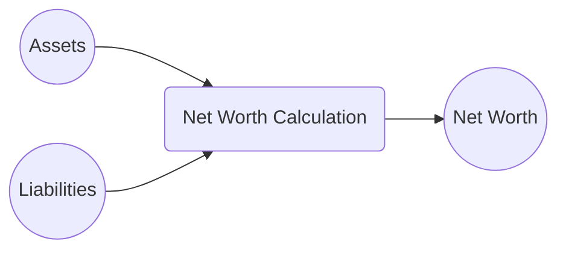

## 4.1 Analyzing Personal Financial Statements and Savings Plan

Properly assessing your client’s financial situation starts with a thorough understanding of their personal financial statements and overall savings plan. These tools form the backbone of any wealth management strategy, guiding advisors in defining short-term and long-term objectives, managing debt, and aligning with the client’s risk profile. In Canada, numerous resources—including guidance from the Canadian Investment Regulatory Organization (CIRO), the Financial Consumer Agency of Canada (FCAC), and FP Canada—provide useful frameworks to ensure advisors gather and analyze essential information in compliance with the country’s regulatory environment.

Below, we explore the fundamental concepts behind personal financial statements, explain how to evaluate a client’s savings plan, and highlight ways advisors can provide strategic guidance in debt management. We also discuss best practices, pitfalls to avoid, and the importance of aligning personal financial data with broader wealth management goals.

---

## Understanding Personal Financial Statements

Personal financial statements comprise two main components: the net worth statement and the cash flow statement. When used together, they offer clear insights into a client’s current financial position.

### Net Worth Statement

A net worth statement provides a snapshot of a client’s financial standing. It is calculated by subtracting total liabilities from total assets.

• Assets: These may include cash, investments like stocks or bonds, registered accounts (e.g., RRSP, TFSA), non-registered holdings, and real estate property.  
• Liabilities: Mortgages, home equity lines of credit (HELOCs), personal loans, student loans, credit card balances, and other debts.

A positive net worth indicates that the client’s total assets exceed total liabilities. Conversely, a negative net worth signals that debt management or increased savings may be necessary.

Below is a simple Mermaid diagram illustrating how a client’s net worth is derived:

> • If Net Worth is positive: This suggests a stronger financial footing, with potential to allocate surplus funds toward long-term investments or other financial objectives.  
> • If Net Worth is negative: This highlights the importance of debt reduction or restructuring, and potential areas where assets can be liquidated or reallocated.

#### Practical Canadian Example  
Imagine a client with the following assets and liabilities:

• Assets:  
  – Cash in chequing/savings accounts at RBC: $15,000  
  – RRSP at TD: $50,000  
  – Primary Residence (estimated value): $400,000  
  – Car (estimated value): $10,000  

• Liabilities:  
  – Mortgage: $250,000  
  – Car Loan: $5,000  

Their net worth would be:  
(15,000 + 50,000 + 400,000 + 10,000) – (250,000 + 5,000) = $220,000

### Cash Flow Statement (Income and Expenses)

The cash flow statement identifies the flow of money into and out of a client’s hands, often segmented on a monthly or annual basis. Sources of income might include salaries, bonuses, investment dividends, income from rental properties, and side businesses; expenses would encompass everything from mortgage payments and groceries to discretionary spending such as hobbies and vacations.

By examining a client’s cash flow, advisors can determine whether the individual runs a surplus (positive cash flow) or deficit (negative cash flow):

• Surplus: Signifies that income exceeds expenses. This leftover amount may be redirected toward savings, investments, or debt repayment.  
• Deficit: Indicates that costs surpass income. This suggests a need for immediate solutions, such as spending reductions, re-evaluating budget allocations, or seeking additional sources of revenue.

### Budgeting

Budgeting is the process of proactively allocating income to cover routine expenses, future savings, and debt repayment. A well-crafted budget:

• Distinguishes fixed expenses (mortgage, rental payments, insurance premiums) from variable or discretionary spending (entertainment, dining out, leisure activities).  
• Helps clients pinpoint areas where they might reduce outflows or reassign funds for more pressing goals—like building an emergency fund or contributing more to retirement accounts.  
• Serves as a roadmap for ensuring that clients stay on track with both short-term and long-term financial objectives.

> **Best Practice:** Encourage clients to maintain a rolling budget in a software or spreadsheet—such as GnuCash (an open-source financial management tool) or LibreOffice Calc—to track their income and expenses. This fosters consistency and provides a living record that can be easily updated and shared during review meetings.

---

## Evaluating Savings Plan

An essential aspect of analyzing personal financial statements is to evaluate and optimize the client’s savings plan. This involves examining savings capacity, aligning short-term and long-term goals, and establishing an appropriate emergency fund.

### Determining Savings Capacity

After budgeting, advisors and clients can accurately identify the monthly surplus that may be redirected into various savings vehicles. Key considerations include:

1. Prioritizing goals: Ranking savings needs such as an emergency fund, retirement contributions (e.g., RRSP, TFSA), children’s education (RESP), or a down payment for a new home.  
2. Systematic savings: Automating deposits into savings or investment accounts ensures that clients "pay themselves first," increasing the likelihood of reaching their targets.  
3. Practical constraints: Advisors must factor in lifestyle requirements, existing debt obligations, and variable income fluctuations (e.g., if a client is self-employed or works on commission).

### Short-Term vs. Long-Term Goals

Clients typically have multiple objectives that can be categorized as either short-term or long-term:

• Short-Term Goals (under three years): Examples include saving for a vacation, car, or wedding. Due to the limited timeline, it is advisable to hold these funds in lower-volatility instruments—e.g., high-interest savings accounts, money market funds, or short-term Guaranteed Investment Certificates (GICs).  
• Long-Term Goals (three years or more): Retirement, post-secondary education for children, or a second property purchase all require a more strategic approach. These funds may be invested in growth-oriented assets such as equities, which provide higher return potential alongside elevated risk.

### Emergency Fund

A well-funded emergency account secures three to six months’ worth of living expenses. This liquidity buffer guards against unforeseen expenses like sudden job loss, medical emergencies, or urgent home repairs—preventing clients from having to rely on high-interest debt.

---

## Debt Management as Part of the Analysis

Debt management is inseparable from assessing a client’s overall financial health. By analyzing and addressing different forms of debt, advisors can help free up cash flow and improve net worth.

### Good vs. Bad Debt

• Good Debt: Typically includes mortgages, student loans, or business loans that can lead to an appreciating asset or increased earning power. For example, paying down a mortgage on a primary residence or an investment property may build equity over time.  
• Bad Debt: Often high-interest consumer debt (like credit cards) or loans used to purchase items that decline rapidly in value. This type of debt can quickly erode savings if not repaid promptly.

### Debt Ratios and Obligations

Common metrics such as debt-to-income (DTI) ratios reveal whether clients are carrying too much debt relative to their cash flow. In Canada, lenders (e.g., RBC, TD, and other major banks) look at two main ratios:

1. Gross Debt Service (GDS) Ratio: (Mortgage payments + Property taxes + Heating costs + 50% of condo fees) ÷ Gross monthly income.  
2. Total Debt Service (TDS) Ratio: (All monthly debt obligations including credit cards and car loans) ÷ Gross monthly income.

These ratios help determine if a client qualifies for new credit and can also signal over-indebtedness.

### Restructuring Options

• Debt Consolidation: Combining high-interest debts into a single, lower-interest solution such as a consolidation loan or a HELOC can reduce monthly payments.  
• Refinancing: Locking in a lower mortgage rate can reduce  mortgage costs and free up extra cash flow for savings.  
• Debt Snowball vs. Debt Avalanche: Advisors can guide clients in systematically paying off debts—from smallest to largest (Debt Snowball) or from highest interest rate to lowest (Debt Avalanche).

---

## Aligning Financial Statements with Goals

Once the net worth statement, cash flow statement, and savings plan are evaluated, it is essential to connect these components to the client’s broader objectives.

### Comprehensive View

A holistic review of net worth, cash flow, and debt obligations helps advisors propose realistic combinations of investment strategies, insurance coverage, and estate planning measures. For instance, a client heavily invested in real estate with limited liquidity might need to diversify into more liquid assets in alignment with retirement and estate objectives.

### KPI Tracking

Using key performance indicators (KPIs) to systematically evaluate a client’s financial condition over time keeps them accountable and highlights areas requiring adjustment. Common KPIs include:

• Savings-rate percentage (what portion of income is saved monthly).  
• Debt-service ratio (the percentage of income dedicated to debt repayment).  
• Funded ratio for specific goals (e.g., how close the client is to the target for a home down payment or college fund).

By establishing benchmarks, advisors and clients can work together on structured adjustments, ensuring continuous progress.

---

## Practical Resources and Next Steps

• **CIRO guidelines (https://www.ciro.ca):** Advises industry professionals on client suitability and underscores understanding a client’s financial situation.  
• **Financial Consumer Agency of Canada (https://www.canada.ca/en/financial-consumer-agency.html):** Offers interactive tools (budget planners, debt calculators) to help Canadians manage their finances.  
• **FP Canada (https://www.fpcanada.ca):** Provides certification and practice standards for financial planners, promoting holistic financial planning approaches.  
• **Open-Source Tools:** GnuCash and LibreOffice Calc for tracking expenses and net worth.  
• **Suggested Reading:** “The Total Money Makeover” by Dave Ramsey provides step-by-step strategies for budgeting, debt reduction, and systematic savings.

---

## Conclusion

Analyzing personal financial statements and a client’s savings plan is a critical first step in delivering tailored wealth management solutions. By looking at net worth, cash flow, and debt, advisors in Canada can identify opportunities to reduce high-interest debt, allocate savings strategically, and mitigate risk. Setting priorities early—such as establishing an emergency fund and striking the right balance between short-term liquidity and long-term growth—empowers clients to achieve their financial goals more efficiently.

Armed with these insights, wealth management professionals can apply a structured, data-driven approach to help clients fortify their personal finances, reduce vulnerabilities, and optimize outcomes in alignment with Canada’s regulatory frameworks and best practices.

---

## Master Your Understanding of Personal Financial Statements and Savings Plans



### Which of the following statements best defines a net worth statement?

- [x] A snapshot of total assets minus total liabilities
- [ ] A summary of monthly income and expenses
- [ ] A credit report from a major lending institution
- [ ] A breakdown of mortgage payments and property taxes alone

> **Explanation:** A net worth statement takes the sum of a client’s assets and subtracts the total liabilities, resulting in a single figure showcasing the client’s overall financial position.

### A client shows a monthly surplus in their cash flow statement. Which of the following might be the best immediate action?

- [x] Increase contributions to an emergency fund or retirement plan
- [ ] Take on a new credit card to expand purchasing power
- [ ] Cancel existing insurance policies
- [ ] Avoid budgeting as the client already has a surplus

> **Explanation:** When a positive cash flow exists, directing the surplus to savings—especially an emergency fund or retirement plan—helps fortify financial security.

### Which is typically considered “good debt” in financial planning?

- [x] Student loans used to obtain an employment-enhancing education
- [ ] High-interest credit card balances for consumer goods
- [ ] Payday loans to cover monthly bills
- [ ] Gambling debt

> **Explanation:** Student loans or mortgages are often labeled as “good debt” because they can foster long-term asset appreciation or income growth.

### Why is an emergency fund generally recommended to cover three to six months of living expenses?

- [x] It ensures sufficient liquidity to handle unexpected events (e.g., job loss, medical emergencies)
- [ ] It matches the minimum payment requirements of government pension plans
- [ ] It attracts unlimited interest in a cash account
- [ ] It is legally mandated in many Canadian provinces

> **Explanation:** Having three to six months of expenses in cash provides a solid safeguard against unpredictable financial hardships without resorting to high-interest debt.

### Which ratio do Canadian lenders often assess to decide if a client is overextended with debt?

- [x] Total Debt Service (TDS) ratio
- [ ] Price-to-Earnings (P/E) ratio
- [x] Gross Debt Service (GDS) ratio
- [ ] Current Ratio

> **Explanation:** Both the TDS and GDS ratios are common metrics used by lenders like RBC or TD to evaluate borrowers’ ability to service debt.

### When designing a budget, why should fixed and discretionary expenses be separated?

- [x] It highlights where clients have flexibility to adjust spending
- [ ] It is required by Canadian tax authorities
- [ ] It makes mortgage payments tax-deductible
- [ ] It does not matter as long as total expenses are tracked

> **Explanation:** By segregating fixed and discretionary costs, clients and advisors can pinpoint areas for potential spending modifications without jeopardizing essential obligations.

### Which of the following is a characteristic of a negative cash flow?

- [x] Monthly expenses surpass monthly income
- [ ] The client has more assets than liabilities
- [x] Clients have a surplus for investing
- [ ] The client is automatically saving enough for retirement

> **Explanation:** Negative cash flow indicates a shortfall, meaning that expenses exceed income, necessitating solutions like expense reduction or income enhancement.

### An advisor suggests refinancing a mortgage at a lower rate. Which of the following is the primary benefit of doing this?

- [x] It may increase monthly cash flow through reduced mortgage payments
- [ ] It entirely eliminates the client’s mortgage debt
- [ ] It substantially boosts the client’s net worth overnight
- [ ] It reduces the total money owed on other unrelated debts

> **Explanation:** Refinancing to a lower interest rate reduces monthly mortgage payments or interest costs, potentially freeing up funds for savings or investments.

### What is the main reason to align short-term and long-term financial goals with financial statements?

- [x] To ensure all expenditures and savings remain relevant to the client’s overall strategy
- [ ] To avoid paying taxes on any income
- [ ] To eliminate the need for external financing
- [ ] To maximize credit card points

> **Explanation:** Aligning goals with personal financial statements ensures that the client’s resources are optimally allocated, whether the objectives are immediate (short-term) or aimed at the future (long-term).

### True or False: Budgeting is a one-time event that can be set up and never revisited.

- [x] False
- [ ] True

> **Explanation:** Budgeting should be an ongoing, dynamic process. Regularly reviewing and updating a budget is crucial to accommodate life changes and shifts in financial goals.



---

## For Additional Practice and Deeper Preparation

**[1. WME Course For Financial Planners (WME-FP): Exam 1](https://www.udemy.com/course/csi-wme-fp-exam1/?referralCode=1A23C67E56971C0A73D5)**  
• Dive into 6 full-length mock exams—1,500 questions in total—expertly matching the scope of WME-FP Exam 1.  
• Experience scenario-driven case questions and in-depth solutions, surpassing standard references.  
• Build confidence with step-by-step explanations designed to sharpen exam-day strategies.

**[2. WME Course For Financial Planners (WME-FP): Exam 2](https://www.udemy.com/course/csi-wme-fp-exam2/?referralCode=25879CCDED7B7905BBA8)**  
• Tackle 1,500 advanced questions spread across 6 rigorous mock exams (250 questions each).  
• Gain real-world insight with practical tips and detailed rationales that clarify tricky concepts.  
• Stay aligned with CIRO guidelines and CSI’s exam structure—this is a resource intentionally more challenging than the real exam to bolster your preparedness.

> Note: While these courses are specifically crafted to align with the WME-FP exam outlines, they are independently developed and not endorsed by CSI or CIRO.
